# New Programming Commands History

This topic lists programming command history, starting with firmware version
A.15.75.xx and earlier. For recent firmware versions, see [New Programming
Commands](New_Programming_Commands.htm).

* * *

The following are new programming commands for VNA release A.15.75.xx [See
What's New](../Whats_New.htm).

Digital Predistortion Commands |  SCPI |  COM  
---|---|---  
Sets the collection acquire. |  [SOURce:DPD:CORRection:COLLection:ACQuire](GP-IB_Command_Finder/SourceDPD.md#SOURce:DPD:CORRection:COLLection:ACQuire) |  None  
Returns a message indicating if the calibration was successful or not. |  [SOURce:DPD:CORRection:COLLection:ACQuire:STATus?](GP-IB_Command_Finder/SourceDPD.md#SOURce:DPD:CORRection:COLLection:ACQuire:STATus) |  None  
Enable or disable the distortion calibration state.  |  [SOURce:DPD:CORRection:COLLection:DISTortion:ENABle](GP-IB_Command_Finder/SourceDPD.md#SOURce:DPD:CORRection:COLLection:DISTortion:ENABle) |  None  
Sets and reads the maximum number of distortion correction iterations used by the calibration routine. |  [SOURce:DPD:CORRection:COLLection:DISTortion:ITERations](GP-IB_Command_Finder/SourceDPD.md#SOURce:DPD:CORRection:COLLection:DISTortion:ITERations) |  None  
Sets and reads the calibration span for a distortion calibration. |  [SOURce:DPD:CORRection:COLLection:DISTortion:SPAN](GP-IB_Command_Finder/SourceDPD.md#SOURce:DPD:CORRection:COLLection:DISTortion:SPAN) |  None  
Sets and reads the desired distortion calibration tolerance. |  [SOURce:DPD:CORRection:COLLection:DISTortion:TOLerance](GP-IB_Command_Finder/SourceDPD.md#SOURce:DPD:CORRection:COLLection:DISTortion:TOLerance) |  None  
Sets and reads the linear or nonlinear distortion correction of the source at the DUT input. |  [SOURce:DPD:CORRection:COLLection:DISTortion:TYPE](GP-IB_Command_Finder/SourceDPD.md#SOURce:DPD:CORRection:COLLection:DISTortion:TYPE) |  None  
Set and read the ACP modulation calibration state. |  [SOURce:DPD:CORRection:COLLection:DUT:ACP:ENABle](GP-IB_Command_Finder/SourceDPD.md#SOURce:DPD:CORRection:COLLection:DUT:ACP:ENABle) |  None  
Sets and reads the frequency delta from the edge of the carrier to the beginning of the ACP Span. |  [SOURce:DPD:CORRection:COLLection:DUT:ACP:GBANd](GP-IB_Command_Finder/SourceDPD.md#SOURce:DPD:CORRection:COLLection:DUT:ACP:GBANd) |  None  
Sets and reads the maximum number of iterations used by the calibration routine. |  [SOURce:DPD:CORRection:COLLection:DUT:ACP:ITERations](GP-IB_Command_Finder/SourceDPD.md#SOURce:DPD:CORRection:COLLection:DUT:ACP:ITERations) |  None  
Sets and reads the calibration span for the ACP calibration. |  [SOURce:DPD:CORRection:COLLection:DUT:ACP:SPAN](GP-IB_Command_Finder/SourceDPD.md#SOURce:DPD:CORRection:COLLection:DUT:ACP:SPAN) |  None  
Sets and reads the desired ACP calibration tolerance for the ACP modulation calibration. |  [SOURce:DPD:CORRection:COLLection:DUT:ACP:TOLerance](GP-IB_Command_Finder/SourceDPD.md#SOURce:DPD:CORRection:COLLection:DUT:ACP:TOLerance) |  None  
Sets and reads the maximum number of iterations used by the calibration routine. |  [SOURce:DPD:CORRection:COLLection:DUT:EVM:ITERations](GP-IB_Command_Finder/SourceDPD.md#SOURce:DPD:CORRection:COLLection:DUT:EVM:ITERations) |  None  
Sets and reads the calibration span of the EVM calibration. |  [SOURce:DPD:CORRection:COLLection:DUT:EVM:SPAN](GP-IB_Command_Finder/SourceDPD.md#SOURce:DPD:CORRection:COLLection:DUT:EVM:SPAN) |  None  
Sets and reads the desired EVM calibration tolerance for the modulation calibration. |  [SOURce:DPD:CORRection:COLLection:DUT:EVM:TOLerance](GP-IB_Command_Finder/SourceDPD.md#SOURce:DPD:CORRection:COLLection:DUT:EVM:TOLerance) |  None  
Enable or disable the LO feedthru calibration state. |  [SOURce:DPD:CORRection:COLLection:LO:FTHRu:ENABle](GP-IB_Command_Finder/SourceDPD.md#SOURce:DPD:CORRection:COLLection:LO:FTHRu:ENABle) |  None  
Sets and reads the maximum number of iterations used by the calibration routine. |  [SOURce:DPD:CORRection:COLLection:LO:FTHRu:ITERations](GP-IB_Command_Finder/SourceDPD.md#SOURce:DPD:CORRection:COLLection:LO:FTHRu:ITERations) |  None  
Sets and reads the desired LO feedthru modulation calibration tolerance. |  [SOURce:DPD:CORRection:COLLection:LO:FTHRu:TOLerance](GP-IB_Command_Finder/SourceDPD.md#SOURce:DPD:CORRection:COLLection:LO:FTHRu:TOLerance) |  None  
Set and read the power modulation calibration state. |  [SOURce:DPD:CORRection:COLLection:POWer:ENABle](GP-IB_Command_Finder/SourceDPD.md#SOURce:DPD:CORRection:COLLection:POWer:ENABle) |  None  
|  |   
Sets and reads the maximum number of iterations used by the calibration routine. |  [SOURce:DPD:CORRection:COLLection:POWer:ITERations](GP-IB_Command_Finder/SourceDPD.md#SOURce:DPD:CORRection:COLLection:POWer:ITERations) |  None  
Sets and reads the calibration span for a power modulation calibration. |  [SOURce:DPD:CORRection:COLLection:POWer:SPAN](GP-IB_Command_Finder/SourceDPD.md#SOURce:DPD:CORRection:COLLection:POWer:SPAN) |  None  
Sets and reads the desired power calibration tolerance for the power modulation calibration. |  [SOURce:DPD:CORRection:COLLection:POWer:TOLerance](GP-IB_Command_Finder/SourceDPD.md#SOURce:DPD:CORRection:COLLection:POWer:TOLerance) |  None  
Specifies the file path to recall an ideal modulation waveform file. |  [SOURce:DPD:FILE:LOAD:IDEal](GP-IB_Command_Finder/SourceDPD.md#SOURce:DPD:FILE:LOAD:IDEal) |  None  
Specifies a DPD Model from a pre-existing file (*.mdpd). |  [SOURce:DPD:FILE:LOAD:MODel](GP-IB_Command_Finder/SourceDPD.md#SOURce:DPD:FILE:LOAD:MODel) |  None  
Specifies the file path and file name to save the DPD Model as a *.mdpd file type. |  [SOURce:DPD:FILE:SAVE](GP-IB_Command_Finder/SourceDPD.md#SOURce:DPD:FILE:SAVE) |  None  
Creates the Modeled DPD Waveform from a user-supplied Ideal Waveform file and a DPD Model file. |  [SOURce:DPD:MODel:APPLy](GP-IB_Command_Finder/SourceDPD.md#SOURce:DPD:MODel:APPLy) |  None  
Creates the DPD Model from the settings defined using the model commands. |  [SOURce:DPD:MODel:CREate](GP-IB_Command_Finder/SourceDPD.md#SOURce:DPD:MODel:CREate) |  None  
Sets and reads whether or not to perform crossterm calculations using default values for the crossterm equation. |  [SOURce:DPD:MODel:MEMPoly:CROSsterm](GP-IB_Command_Finder/SourceDPD.md#SOURce:DPD:MODel:MEMPoly:CROSsterm) |  None  
Sets and reads the number of input future time samples to use for calculating the current output sample. |  [SOURce:DPD:MODel:MEMPoly:MEMory:FUTure](GP-IB_Command_Finder/SourceDPD.md#SOURce:DPD:MODel:MEMPoly:MEMory:FUTure) |  None  
Sets and reads the number of input past time samples to use for calculating the current output sample. |  [SOURce:DPD:MODel:MEMPoly:MEMory:PAST](GP-IB_Command_Finder/SourceDPD.md#SOURce:DPD:MODel:MEMPoly:MEMory:PAST) |  None  
Sets and reads the order of the polynomial equation used to model the DUT nonlinearity. |  [SOURce:DPD:MODel:MEMPoly:ORDer](GP-IB_Command_Finder/SourceDPD.md#SOURce:DPD:MODel:MEMPoly:ORDer) |  None  
Returns a message indicating if the calibration was successful or not. |  [SOURce:DPD:MODel:STATus?](GP-IB_Command_Finder/SourceDPD.md#SOURce:DPD:MODel:STATus) |  None  
Sets and reads DPD Model type. |  [SOURce:DPD:MODel:TYPE](GP-IB_Command_Finder/SourceDPD.md#SOURce:DPD:MODel:TYPE) |  None  
Sets and reads the type of DPD procedure to use. |  [SOURce:DPD:PROCedure](GP-IB_Command_Finder/SourceDPD.md#SOURce:DPD:PROCedure) |  None  
|  |  None  
Material Handler I/O Interface Command  
Set and Read the function for the specified port in Material Handler I/O interface. |  [SENSe:NOISe:CONTrol:HANDler:PIN:FUNCtion](GP-IB_Command_Finder/Sense/Noise.md#SENSe:NOISe:CONTrol:HANDler:PIN:FUNCtion) |  None  
|  |  None  
Pathwave Calibration Advisor System Service Commands  
Returns the instrument calibration information in JSON format. |  [SYSTem:SERVice:MANagement:CALibration:INFormation?](GP-IB_Command_Finder/System_Service_SCPI.md#SYSTem:SERVice:MANagement:CALibration:INFormation) |  None  
Sets calibration interval to Keysight Recommended (according to the instrument model). |  [SYSTem:SERVice:MANagement:CALibration:INTerval:DEFault](GP-IB_Command_Finder/System_Service_SCPI.md#SYSTem:SERVice:MANagement:CALibration:INTerval:DEFault) |  None  
Returns the instrument calibration interval type. |  [SYSTem:SERVice:MANagement:CALibration:INTerval:TYPE?](GP-IB_Command_Finder/System_Service_SCPI.md#SYSTem:SERVice:MANagement:CALibration:INTerval:TYPE) |  None  
Sets and returns the calibration interval value (interval in months). |  [SYSTem:SERVice:MANagement:CALibration:INTerval[:VALue]](GP-IB_Command_Finder/System_Service_SCPI.md#SYSTem:SERVice:MANagement:CALibration:INTerval_:VALue) |  None  
Sets and returns the calibration status/due popup notification state during instrument running. |  [SYSTem:SERVice:MANagement:CALibration:NOTification:ENABle](GP-IB_Command_Finder/System_Service_SCPI.md#SYSTem:SERVice:MANagement:CALibration:NOTification:ENABle) |  None  
Sets new passcode. |  [SYSTem:SERVice:MANagement:CALibration:PASScode:CHANge](GP-IB_Command_Finder/System_Service_SCPI.md#SYSTem:SERVice:MANagement:CALibration:PASScode:CHANge) |  None  
Input existing passcode and enable all setting features. |  [SYSTem:SERVice:MANagement:CALibration:PASScode[:VALue]](GP-IB_Command_Finder/System_Service_SCPI.md#SYSTem:SERVice:MANagement:CALibration:PASScode:VALue) |  None  
Sets and returns the periodic calibration state. |  [SYSTem:SERVice:MANagement:CALibration:PERiodic:ENABle](GP-IB_Command_Finder/System_Service_SCPI.md#SYSTem:SERVice:MANagement:CALibration:PERiodic:ENABle) |  None  
Sets and returns the calibration due reminder days (30, 15, or 7). |  [SYSTem:SERVice:MANagement:CALibration:REMinder](GP-IB_Command_Finder/System_Service_SCPI.md#SYSTem:SERVice:MANagement:CALibration:REMinder) |  None  
|  |   
IMD Receiver Configuration Commands  
Sets and returns the receiver configuration. |  [SENSe:IMD:RECeiver:CONFig:COMBiner:PATH](GP-IB_Command_Finder/Sense/IMD.md#SENSe:IMD:RECeiver:CONFig:COMBiner:PATH) |  None  
|  |   
Misc. Commands  
Returns valid measurement class names available on the VNA. |  [SYSTem:MCLass:VALid:CATalog?](GP-IB_Command_Finder/System.md#mclass) |  None  
Returns the channel number of the specified measurement. |  [SYSTem:MEASure:CHANnel?](GP-IB_Command_Finder/System.md#SYSTem:MEASure:CHANnel) |  None  
Returns the measurement number associated with the measurement name. |  [SYSTem:MEASure:NUMBer?](GP-IB_Command_Finder/System.md#SYSTem:MEASure:NUMBer) |  None  
|  |   
  
* * *

The following are new programming commands for VNA release A.15.65.xx [See
What's New](../Whats_New.htm).

Cal Update Commands |  SCPI |  COM  
---|---|---  
Sets and returns the averaging used to improve noise errors. |  [SYSTem:CALibrate:CALupdate:AVERage:COUNt](GP-IB_Command_Finder/SystCalDrift.md#SYSTem:CALibrate:DRIFt:AVERage:COUNt) |  None  
Sets and returns the IF bandwidth used by the measurement channel. |  [SYSTem:CALibrate:CALupdate:BWIDth[:RESolution]](GP-IB_Command_Finder/SystCalDrift.md#SYSTem:CALibrate:DRIFt:BWIDth:RESolution) |  None  
Selects the channel(s) to calibrate. |  [SYSTem:CALibrate:CALupdate:CHANnel[:SELect]](GP-IB_Command_Finder/SystCalDrift.md#SYSTem:CALibrate:DRIFt:CHANnel:ALL:STATe) |  None  
Sets and returns the gate start value for time domain gating. |  [SYSTem:CALibrate:CALupdate:GATE:STARt](GP-IB_Command_Finder/SystCalDrift.md#SYSTem:CALibrate:DRIFt:GATE:STARt) |  None  
Sets and returns the state of gate coupling for gate start value. |  [SYSTem:CALibrate:CALupdate:GATE:STARt:COUPle[:STATe]](GP-IB_Command_Finder/SystCalDrift.md#SYSTem:CALibrate:DRIFt:GATE:STARt:COUPle:STATe) |  None  
Sets and returns the gate stop value for time domain gating. |  [SYSTem:CALibrate:CALupdate:GATE:STOP](GP-IB_Command_Finder/SystCalDrift.md#SYSTem:CALibrate:DRIFt:GATE:STOP) |  None  
Sets and returns the state of gate coupling for gate stop value. |  [SYSTem:CALibrate:CALupdate:GATE:STOP:COUPle[:STATe]](GP-IB_Command_Finder/SystCalDrift.md#SYSTem:CALibrate:DRIFt:GATE:STOP:COUPle:STATe) |  None  
Initializes the selected ports. |  [SYSTem:CALibrate:CALupdate:INITialize](GP-IB_Command_Finder/SystCalDrift.md#SYSTem:CALibrate:DRIFt:INITialize) |  None  
Recorrects the list of previously initialized ports. |  [SYSTem:CALibrate:CALupdate:RECorrect](GP-IB_Command_Finder/SystCalDrift.md#SYSTem:CALibrate:DRIFt:RECorrect) |  None  
Sets and returns the reference cal set name. |  [SYSTem:CALibrate:CALupdate:REFerence](GP-IB_Command_Finder/SystCalDrift.md#SYSTem:CALibrate:DRIFt:REFerence) |  None  
Selects the port numbers to initialize. |  [SYSTem:CALibrate:CALupdate:PORTs[:SELect]](GP-IB_Command_Finder/SystCalDrift.md#SYSTem:CALibrate:DRIFt:PORTs:SELect) |  None  
Use a channel's existing IF BW, Averaging, and Power value settings or enter the values manually. |  [SYSTem:CALibrate:CALupdate:SETTings:AUTO](GP-IB_Command_Finder/SystCalDrift.md#SYSTem:CALibrate:DRIFt:SETTings:AUTO) |  None  
Manually sets and returns the source power for the active measurement channel. |  [SYSTem:CALibrate:CALupdate:SOURce:POWer](GP-IB_Command_Finder/SystCalDrift.md#SYSTem:CALibrate:DRIFt:SOURce:POWer) |  None  
|  |   
Licensed Features Commands  
Returns the list of licensed features. |  [SYSTem:CAPability:LICenses:FEATure:CATalog?](GP-IB_Command_Finder/SystCapability.md#SYSTem:CAPability:LICenses:FEATure:CATalog) |  None  
Returns a "1" if the specified feature is enabled and a "0" if the specified feature is disabled. |  [SYSTem:CAPability:LICenses:FEATure:ENABle?](GP-IB_Command_Finder/SystCapability.md#SYSTem:CAPability:LICenses:FEATure:ENABle) |  None  
|  |   
Link VNA to 89600 VSA Command  
Sets the VSA spectrum settings to match the current SA coherent repetition rate. |  [SENSe:VSA:SPECtrum:AUTOtune](GP-IB_Command_Finder/Sense/VSA.md#SENSe:VSA:SPECtrum:AUTOset) |  None  
|  |   
Absolute Phase Command  
Enable/disable absolute phase. |  [SENSe:MIXer:PHASe:ABSolute[:STATe]](GP-IB_Command_Finder/Sense/MIXerSCPI.md#SENSe:MIXer:PHASe:ABSolute:STATe) |  None  
|  |   
Preference Command  
Controls the on/off state of the preference, "Use Unknown thru math for SOLT methods". |  [SYSTem:PREFerence:ITEM:USOLt](GP-IB_Command_Finder/System_Preferences.md#SYSTem:PREFerences:ITEM:USOLt) |  None  
|  |  None  
  
* * *

The following are new programming commands for VNA release A.15.60.xx [See
What's New](../Whats_New.htm).

SA Frequency Converter Commands |  SCPI |  COM  
---|---|---  
Set and read the ON/OFF state of the dual band configuration for fast setting of the frequency converter DUT. |  [SENSe:SA:FREQuency:CONVerter[:STATe]](GP-IB_Command_Finder/Sense/SA.md#SENSe:SA:FREQuency:CONVerter:STATe) |  None  
Set and read the source name that generates the modulated signal. |  [SENSe:SA:FREQuency:CONVerter:INPut:SOURce](GP-IB_Command_Finder/Sense/SA.md#SENSe:SA:FREQuency:CONVerter:INPut:SOURce) |  None  
Set and read the port number of the VNA connected to the input of the frequency converter DUT. |  [SENSe:SA:FREQuency:CONVerter:INPut:PORT](GP-IB_Command_Finder/Sense/SA.md#SENSe:SA:FREQuency:CONVerter:INPut:PORT) |  None  
Set and read the frequency converter DUT input center frequency. |  [SENSe:SA:FREQuency:CONVerter:INPut:CENTer](GP-IB_Command_Finder/Sense/SA.md#SENSe:SA:FREQuency:CONVerter:INPut:CENTer) |  None  
Enable or disable inverting the spectrum (or mirror) by the frequency converter operation. |  [SENSe:SA:FREQuency:CONVerter:OUTPut:INVerted](GP-IB_Command_Finder/Sense/SA.md#SENSe:SA:FREQuency:CONVerter:OUTPut:INVerted) |  None  
Set and read the port number of the VNA connected to the output of the frequency converter DUT. |  [SENSe:SA:FREQuency:CONVerter:OUTPut:PORT](GP-IB_Command_Finder/Sense/SA.md#SENSe:SA:FREQuency:CONVerter:OUTPut:PORT) |  None  
Set and read the frequency converter DUT output center frequency. |  [SENSe:SA:FREQuency:CONVerter:OUTPut:CENTer](GP-IB_Command_Finder/Sense/SA.md#SENSe:SA:FREQuency:CONVerter:OUTPut:CENTer) |  None  
Set and read the LO offset value. |  [SENSe:SA:FREQuency:CONVerter:OUTPut:OFFSet](GP-IB_Command_Finder/Sense/SA.md#SENSe:SA:FREQuency:CONVerter:OUTPut:OFFSet) |  None  
|  |  None  
Misc. Commands  
Enables/disables adding all marker data to the text file (*.txt) output. |  [SENSe:SA:DATA:FILE:TEXT:MARKers:ALL[:STATe]](GP-IB_Command_Finder/Sense/SA.md#SENSe:SA:DATA:FILE:TEXT:MARKers:ALL:STATe) |  None  
Returns whether or not the ports on an existing S2P file are reversed. |  [CALCulate:FSIMulator:CIRCuit:DEVice:PORTs:REVerse?](GP-IB_Command_Finder/Calculate/FSimulatorActive.md#CALCulate:FSIMulator:CIRCuit:DEVice:PORTs:REVerse) |  None  
Sets whether or not to reverse the ports on an existing S2P file. |  [CALCulate:FSIMulator:DRAFt:CIRCuit:DEVice:PORTs:REVerse](GP-IB_Command_Finder/Calculate/FSimulatorDraft.md#CALCulate:FSIMulator:DRAFt:CIRCuit:DEVice:PORTs:REVerse) |  None  
Set and read the display size. |  [DISPlay:SIZE](GP-IB_Command_Finder/Display.md#DISPlay:SIZE) |  None  
|  |   
  
* * *

The following are new programming commands for VNA release A.15.55.xx [See
What's New](../Whats_New.htm).

Noise Figure Commands |  SCPI |  COM  
---|---|---  
Enables/disables the use of 302K as the ambient temperature. |  [SENSe:NOISe:TEMPerature:AMBient:AUTO](GP-IB_Command_Finder/Sense/Noise.md#SENSe:NOISe:TEMPerature:AMBient:AUTO) |  None  
Enables/disables the use of 302K as the source temperature. |  [SENSe:NOISe:TEMPerature:SOURce:AUTO](GP-IB_Command_Finder/Sense/Noise.md#SENSe:NOISe:TEMPerature:SOURce:AUTO) |  None  
Sets the temperature value at which the current noise measurement is occurring. |  [SENSe:NOISe:TEMPerature:SOURce[:VALue]](GP-IB_Command_Finder/Sense/Noise.md#SENSe:NOISe:TEMPerature:SOURce) |  None  
|  |  None  
Internal Source Modulation Commands  
Returns the name of the currently loaded internal source modulation file. |  [SYSTem:PREFerences:SOURce:GLOBal:MODulation:FILE?](GP-IB_Command_Finder/System_Preferences.md#SYSTem:PREFerences:SOURce:GLOBal:MODulation:NAME) |  None  
Loads the internal source modulation file. |  [SYSTem:PREFerences:SOURce:GLOBal:MODulation:LOAD](GP-IB_Command_Finder/System_Preferences.md#SYSTem:PREFerences:SOURce:GLOBal:MODulation:LOAD) |  None  
Set and return the state of the specified internal source modulation port. |  [SYSTem:PREFerences:SOURce:GLOBal:MODulation[:STATe]](GP-IB_Command_Finder/System_Preferences.md#SYSTem:PREFerences:SOURce:GLOBal:MODulation:STATe) |  None  
|  |  None  
SA Phase Stitching Commands  
Enables/disables selected receiver, or receiver with highest energy in the overlap area, to drive the phase stitching for all receivers. |  [SENSe:SA:COHerence:PHASe:STITching:COMmon[:STATe]](GP-IB_Command_Finder/Sense/SA.md#SENSe:SA:COHerence:PHASe:STITching:COMmon:STATe) |  None  
Enable/disable phase stitching from hardware time stamps. |  [SENSe:SA:COHerence:PHASe:STITching:HWTStamp[:STATe]](GP-IB_Command_Finder/Sense/SA.md#SENSe:SA:COHerence:PHASe:STITching:HWTStamp) |  None  
Set and read the minimum tone power level to perform phase stitching. |  [SENSe:SA:COHerence:PHASe:STITching:LEVel](GP-IB_Command_Finder/Sense/SA.md#SENSe:SA:COHerence:PHASe:STITching:LEVel) |  None  
Set and read the receiver for stitching automatically. |  [SENSe:SA:COHerence:PHASe:STITching:RECeiver:AUTO[:STATe]](GP-IB_Command_Finder/Sense/SA.md#SENSe:SA:COHerence:PHASe:STITching:RECeiver:AUTO:STATe) |  None  
Assigns a specified receiver for phase stitching. |  [SENSe:SA:COHerence:PHASe:STITching:RECeiver:NAME](GP-IB_Command_Finder/Sense/SA.md#SENSe:SA:COHerence:PHASe:STITching:RECeiver:NAME) |  None  
Enable or disable phase stitching. |  [SENSe:SA:COHerence:PHASe:STITching[:STATe]](GP-IB_Command_Finder/Sense/SA.md#SENSe:SA:COHerence:PHASe:STITching:STATe) |  None  
|  |   
Link VNA to 89600 VSA Commands  
Enable/disable recomputing the advanced IQ parameters automatically. |  [SENSe:SA:DATA:IQ:ALIgned[:STATe]](GP-IB_Command_Finder/Sense/SA.md#SENSe:SA:DATA:IQ:ALIgned:STATe) |  None  
Fill in the IQ settings automatically. |  [SENSe:SA:DATA:IQ:AUTOfill](GP-IB_Command_Finder/Sense/SA.md#SENSe:SA:DATA:IQ:AUTOfill) |  None  
Set and read the IQ carrier frequency. |  [SENSe:SA:DATA:IQ:CARRier:FREQuency](GP-IB_Command_Finder/Sense/SA.md#SENSe:SA:DATA:IQ:CARRier:FREQuency) |  None  
Read the IQ record duration. |  [SENSe:SA:DATA:IQ:DURation?](GP-IB_Command_Finder/Sense/SA.md#SENSe:SA:DATA:IQ:DURation) |  None  
Read the IQ error code to indicate whether the IQ settings are valid or not. |  [SENSe:SA:DATA:IQ:ERRor[:CODE]?](GP-IB_Command_Finder/Sense/SA.md#SENSe:SA:DATA:IQ:ERRor:CODE) |  None  
Read the error text to determine if the IQ settings are valid or not. |  [SENSe:SA:DATA:IQ:ERRor:TEXT?](GP-IB_Command_Finder/Sense/SA.md#SENSe:SA:DATA:IQ:ERRor:TEXT) |  None  
Set and read the number of IQ samples. |  [SENSe:SA:DATA:IQ:SAMPle:COUNt](GP-IB_Command_Finder/Sense/SA.md#SENSe:SA:DATA:IQ:SAMPle:COUNt) |  None  
Set and read the IQ sample rate. |  [SENSe:SA:DATA:IQ:SAMPle:RATE](GP-IB_Command_Finder/Sense/SA.md#SENSe:SA:DATA:IQ:SAMPle:RATE) |  None  
Enable/disable computing time domain IQ. |  [SENSe:SA:DATA:IQ[:STATe]](GP-IB_Command_Finder/Sense/SA.md#SENSe:SA:DATA:IQ:STATe) |  None  
Set and read the list of receivers that will have their measurement traces kept in memory. |  [SENSe:SA:DATA:KEEP:RECeivers:LIST](GP-IB_Command_Finder/Sense/SA.md#SENSe:SA:DATA:KEEP:RECeivers:LIST) |  None  
Set to stream input power to a VSA measurement channel (MOD/MODX channel). |  [SENSe:VSA:DATA:MOD:PIN1[:STATe]](GP-IB_Command_Finder/Sense/VSA.md#SENSe:VSA:DATA:MOD:PIN1:STATe) |  None  
Set to stream output power to a VSA measurement channel (MOD/MODX channel). |  [SENSe:VSA:DATA:MOD:POU2[:STATe]](GP-IB_Command_Finder/Sense/VSA.md#SENSe:VSA:DATA:MOD:POU2:STATe) |  None  
Set and read the receiver data to be transferred to the 89600 VSA. |  [SENSe:VSA:DATA:SA:RECievers](GP-IB_Command_Finder/Sense/SA.md#SENSe:VSA:DATA:SA:RECeivers) |  None  
Set and read the VNA to VSA connection state. |  [SENSe:VSA:CONNect[:STATe]](GP-IB_Command_Finder/Sense/VSA.md#SENSe:VSA:CONNect) |  None  
Set and read the data stream state. |  [SENSe:VSA:DATA:STReam[:STATe]](GP-IB_Command_Finder/Sense/VSA.md#SENSe:VSA:DATA:STReam) |  None  
Set and read the state of the digital trigger. |  [SENSe:VSA:DTRigger[:STATe]](GP-IB_Command_Finder/Sense/VSA.md#SENSe:VSA:DTRigger:STATe) |  None  
Sets the VSA window in front of the VNA GUI when the VSA-to-VNA connection is running. |  [SENSe:VSA:SHOW](GP-IB_Command_Finder/Sense/VSA.md#SENSe:VSA:SHOW) |  None  
Configuration information between the VSA measurement channel and corresponding VNA channel/VNA measurement. |  [SENSe:VSA:STAtus:REPort?](GP-IB_Command_Finder/Sense/VSA.md#SENSe:VSA:STAtus:REPort) |  None  
|  |   
Misc. Commands  
Sets the window type for time domain transform. |  [CALCulate:MEASure:TRANsform:TIME:WINDow[:TYPE]](GP-IB_Command_Finder/Calculate/MeasureTRANsform.md#CALCulate:MEASure:TRANsform:TIME:WINDow:TYPE) |  None  
|  |   
  
* * *

The following are new programming commands for VNA release
A.15.40.xx/A.15.50.xx [See What's New](../Whats_New.md).

X- and Y-Axis Commands |  SCPI |  COM  
---|---|---  
Returns the current units of the X-axis. |  [CALCulate:MEASure:X:AXIS:UNIT?](GP-IB_Command_Finder/Calculate/MeasureX.md#X_AXIS_UNIT) |  None  
Returns the current units of the Y-axis, |  [CALCulate:MEASure:Y:AXIS:UNIT?](GP-IB_Command_Finder/Calculate/MeasureY.md#CALCulate:MEASure:Y:AXIS:UNIT) |  None  
Returns the Y-axis values for the selected measurement in the current units. |  [CALCulate:MEASure:Y[:VALues]?](GP-IB_Command_Finder/Calculate/MeasureY.md#CALCulate:MEASure:Y:VALues) |  None  
|  |   
Misc. Commands  
Returns the current state of the Modify setting (NONE, NREFlect, or NXTalk). |  [CALCulate:FSIMulator:CIRCuit:FILE:MODify?](GP-IB_Command_Finder/Calculate/FSimulatorActive.md#CALCulate:FSIMulator:CIRCuit:FILE:MODify) |  None  
Sets all reflection and crosstalk parameters on the DUT side to zero. |  [CALCulate:FSIMulator:DRAFt:CIRCuit:FILE:MODify](GP-IB_Command_Finder/Calculate/FSimulatorDraft.md#CALCulate:FSIMulator:DRAFt:CIRCuit:FILE:MODify) |  None  
Returns TRUE if user is only using legacy SCPI fixture commands. |  [CALCulate:FSIMulator:LEGacy?](GP-IB_Command_Finder/Calculate/FSimulator.md#LEGacy) |  None  
Sets and returns the Primary Clock setting and is controlled by the internal or external pulse generator which is the primary system clock. |  [SENSe:SWEep:PULSe:PRIMary:CLOCk](GP-IB_Command_Finder/Sense/SweepPulse.md#SENSe:SWEep:PULSe:PRIMary:CLOCk) |  None  
Returns whether or not the Enable Remote Drive Access is checked in the Remote Interface dialog.  |  [SYSTem:COMMunicate:DRIVe:ENABle?](GP-IB_Command_Finder/SystCommunicate.md#SYSTem:COMMunicate:DRIVe:ENABle) |  None  
|  |   
  
* * *

The following are new programming commands for VNA release A.15.30.xx [See
What's New](../Whats_New.htm).

Fixturing Power Compensation Command  
---  
Adjust the source power compensation for gain/loss through “ALL” fixture components or through “DEEMbed” components only. |  [CALCulate:FSIMulator:POWer:COMPensate:MODE](GP-IB_Command_Finder/Calculate/FSimulatorActive.md#CALCulate:FSIMulator:POWer:COMPensate:MODE) |  None  
|  |   
Licensing Command  
Enables/disables showing the licensed features dialog on startup. |  [SYSTem:PREFerences:ITEM:DIALog:SHOW:LICense](GP-IB_Command_Finder/System_Preferences.md#SYSTem:PREFerences:ITEM:DIALog:SHOW:LICense) |  None  
|  |   
Shared Memory Data Transfer Commands  
Closes the specified memory mapped buffer. |  [SYSTem:DATA:MEMory:CLOSe](GP-IB_Command_Finder/System.md#SYSTem:DATA:MEMory:CLOSe) |  None  
Closes the specified memory file. |  [SYSTem:DATA:MEMory:CLOSe:FILE](GP-IB_Command_Finder/System.md#SYSTem:DATA:MEMory:CLOSe:FILE) |  None  
Creates the memory buffer and saves the buffer to a file. |  [SYSTem:DATA:MEMory:COMMit:FILE](GP-IB_Command_Finder/System.md#SYSTem:DATA:MEMory:COMMit:FILE) |  None  
This command resets the current repeat index to 0. |  [SYSTem:DATA:MEMory:REPeat:RESet](GP-IB_Command_Finder/System.md#SYSTem:DATA:MEMory:REPeat:RESet) |  None  
|  |   
TOPology Commands  
Saves the current active fixture topology to a file. |  [CALCulate:FSIMulator:TOPology:SAVE](GP-IB_Command_Finder/Calculate/FSimulatorActive.md#CALCulate:FSIMulator:TOPology:SAVE) |  None  
Loads an active fixture topology file. |  [CALCulate:FSIMulator:TOPology:LOAD](GP-IB_Command_Finder/Calculate/FSimulatorActive.md#CALCulate:FSIMulator:TOPology:LOAD) |  None  
|  |   
Misc. Commands  
This query compares the stimulus of "chanNumber" with the stimulus stored in the specified calset. |  [CSET:VALidate?](GP-IB_Command_Finder/CSET.md#CSETVALidate) |  None  
Enable/disable using existing source power calibration array when acquiring calibration standard data: |  [SENSe:CORRection:COLLect:GUIDed:PCAL:APPLy](GP-IB_Command_Finder/Sense/CorrGuided.md#SENSe:CORRection:COLLect:GUIDed:PCAL:APPLy) |  None  
Selects between a small- and medium-sized font displayed below the trace area of the display. |  [SENSe:DISTortion:TABLe:DISPlay:FONT](GP-IB_Command_Finder/Sense/Distortion_Measurement.md#SENSe:DISTortion:TABLe:DISPlay:FONT) |  None  
Returns the ID string, and optionally visa address, of power meters / sensors that are connected to the VNA via GPIB. |  [SYSTem:COMMunicate:GPIB:PMETer:CATalog?](GP-IB_Command_Finder/SystCommunicate.md#SYSTem:COMMunicate:GPIB:PMETer:CATalog) |  None  
|  |   
  
* * *

The following are new programming commands for VNA release A.15.05.xx [See
What's New](../Whats_New.htm).

GCA/GCX Phase Commands  
---  
Remaps the source port to Port 1. |  [SENSe:GCSetup:PMAP:SOURce:OVERride](GP-IB_Command_Finder/Sense/Gain_Compression.md#SENSe:GCSetup:PMAP:SOURce:OVERride) |  None  
|  |   
Misc. Commands |  |   
Returns the time the first point of a Time Sweep is measured. |  [SENSe:SWEep:TIME:STARt?](GP-IB_Command_Finder/Sense/Sweep_SCPI.md#SENSe:SWEep:TIME:STARt) |  None  
Sets the time the analyzer takes to complete one sweep. |  [SENSe:SWEep:TIME[:STOP]](GP-IB_Command_Finder/Sense/Sweep_SCPI.md#SENSe:SWEep:TIME:STOP) |  None  
|  |   
  
* * *

The following are new programming commands for VNA release A.14.80.xx [See
What's New](../Whats_New.htm).

Automatic Fixture Removal (AFR) Commands  
---  
Turns ON of OFF AFR mode conversion. |  [AFR:ADVanced:MCONversion[:STATe]](GP-IB_Command_Finder/Automatic_Fixture_Removal_\(AFR\).md#AFR:ADVanced:MCONversion:STATe) |  None  
Resets the AFR configuration. |  [AFR:ADVanced:RESet](GP-IB_Command_Finder/Automatic_Fixture_Removal_\(AFR\).md#AFR:ADVanced:RESet) |  None  
Gets or sets the manual start time in AFR configuration. |  [AFR:ADVanced:TIME:STARt](GP-IB_Command_Finder/Automatic_Fixture_Removal_\(AFR\).md#AFR:ADVanced:TIME:STARt) |  None  
Gets or sets the manual stop time in AFR configuration. |  [AFR:ADVanced:TIME:STOP](GP-IB_Command_Finder/Automatic_Fixture_Removal_\(AFR\).md#AFR:ADVanced:TIME:STOP) |  None  
Gets or sets the manual window type in AFR configuration. |  [AFR:ADVanced:WINDow:COEFficient](GP-IB_Command_Finder/Automatic_Fixture_Removal_\(AFR\).md#AFR:ADVanced:WINDow:COEFficient) |  None  
Turns ON of OFF the manual window coefficient of the AFR. |  [AFR:ADVanced:WINDow:MANual[:STATe]](GP-IB_Command_Finder/Automatic_Fixture_Removal_\(AFR\).md#AFR:ADVanced:WINDow:MANual:STATe) |  None  
Sets "System Z0" to Calibration Reference Z0. |  [AFR:FIXTure:SET:SYSZ[:STATe]](GP-IB_Command_Finder/Automatic_Fixture_Removal_\(AFR\).md#AFR:FIXTure:SET:SYSZ) |  None  
Specifies whether thrus are used in case of multi-port fixtures. |  [AFR:FIXTure:USE:THRUs[:STATe]](GP-IB_Command_Finder/Automatic_Fixture_Removal_\(AFR\).md#AFR:FIXTure:USE:THRUs) |  None  
Specifies whether the port impedances are normalized in saving the AFR fixture files. |  [AFR:SAVE:IMPedance:NORMalize[:STATe]](GP-IB_Command_Finder/Automatic_Fixture_Removal_\(AFR\).md#AFR:SAVE:IMPedance:NORMalize) |  None  
Measures calibration standard. |  [AFR:STANdard:MEASure](GP-IB_Command_Finder/Automatic_Fixture_Removal_\(AFR\).md#AFR:STANdard:MEASure) |  None  
|  |  None  
GCA/GCX Phase Commands  
Set and read the desired phase to measure compression. |  [SENSe:GCSetup:COMPression:PHASe:LEVel](GP-IB_Command_Finder/Sense/Gain_Compression.md#SENSe:GCSetup:COMPression:PHASe:LEVel) |  None  
Set and read compression format to be either magnitude, phase, or magnitude and phase. |  [SENSe:GCSetup:COMPression:PHASe:MODE](GP-IB_Command_Finder/Sense/Gain_Compression.md#SENSe:GCSetup:COMPression:PHASe:MODE) |  None  
Set and read the state of the mixer reference. |  [SENSe:GCSetup:MIXer:REFerence](GP-IB_Command_Finder/Sense/Gain_Compression.md#SENSe:GCSetup:MIXer:REFerence) |  None  
Set and read the aperture to use when computing the linear input power. |  [SENSe:GCSetup:POWer:LINear:INPut:COMPute:APERture](GP-IB_Command_Finder/Sense/Gain_Compression.md#SENSe:GCSetup:POWer:LINear:INPut:COMPute:APERture) |  None  
Set and read the state of the power smoothing. |  [SENSe:GCSetup:SWEep:POWer:SMOoth](GP-IB_Command_Finder/Sense/Gain_Compression.md#SENSe:GCSetup:SWEep:POWer:SMOoth) |  None  
Set and read the power smoothing aperture in percent. |  [SENSe:GCSetup:SWEep:POWer:SMOoth:APERture](GP-IB_Command_Finder/Sense/Gain_Compression.md#SENSe:GCSetup:SWEep:POWer:SMOoth:APERture) |  None  
|  |  None  
Modulation Distortion Edit Multitone Commands  
Set all tone states to on or off. |  [SOURce:MODulation:FILE:TONE:ALL[:STATe]](GP-IB_Command_Finder/SourceModulation.md#SOURce:MODulation:FILE:TONE:ALL:STATe) |  None  
Returns the number of tones. |  [SOURce:MODulation:FILE:TONE:COUNt?](GP-IB_Command_Finder/SourceModulation.md#SOURce:MODulation:FILE:TONE:NUMBer) |  None  
Returns the tone frequency in Hz relative to the carrier. |  [SOURce:MODulation:FILE:TONE:FREQuency?](GP-IB_Command_Finder/SourceModulation.md#SOURce:MODulation:FILE:TONE:FREQuency) |  None  
Loads the specified multitone file. |  [SOURce:MODulation:FILE:TONE:LOAD](GP-IB_Command_Finder/SourceModulation.md#SOURce:MODulation:FILE:TONE:LOAD) |  None  
Sets and reads the phase in degrees of the specified tone number. |  [SOURce:MODulation:FILE:TONE:PHASe](GP-IB_Command_Finder/SourceModulation.md#SOURce:MODulation:FILE:TONE:PHASe) |  None  
Sets and reads the power in dBm of the specified tone number. |  [SOURce:MODulation:FILE:TONE:POWer](GP-IB_Command_Finder/SourceModulation.md#SOURce:MODulation:FILE:TONE:POWer) |  None  
Saves the specified multitone file. |  [SOURce:MODulation:FILE:TONE:SAVE](GP-IB_Command_Finder/SourceModulation.md#SOURce:MODulation:FILE:TONE:SAVE) |  None  
Set specified tone state to on or off. |  [SOURce:MODulation:FILE:TONE[:STATe]](GP-IB_Command_Finder/SourceModulation.md#SOURce:MODulation:FILE:TONE:STATe) |  None  
|  |  None  
Residual Phase Noise Commands |  |   
Sets and returns the noise type to phase or residual noise. |  [SENSe:PN:NTYPe](GP-IB_Command_Finder/Sense/Phase_Noise.md#SENSe:PN:MTYPe) |  None  
Sets and returns receiver at the DUT input for residual phase noise measurements. |  [SENSe:PN:RESidual:INPut](GP-IB_Command_Finder/Sense/Phase_Noise.md#SENSe:PN:RESidual:INPut) |  None  
Sets and returns receiver at the DUT output for residual phase noise measurements. |  [SENSe:PN:RESidual:OUTput](GP-IB_Command_Finder/Sense/Phase_Noise.md#SENSe:PN:RESidual:OUTput) |  None  
|  |   
LO Feedthru Monitor Commands |  |   
Return the last monitor result of LO feedthru monitor. |  [SENSe:SA:COHerance:LO:FTHRu:MONitor:LAST:FAILed](GP-IB_Command_Finder/Sense/SA.md#SENS_SA_COH_LO_FTHR_MON_LAST_FAIL) |  None  
Return the last monitor value of LO feedthru monitor.  |  [SENSe:SA:COHerance:LO:FTHRu:MONitor:LAST:VALue](GP-IB_Command_Finder/Sense/SA.md#SENS_SA_COH_LO_FTHR_MON_LAST_VAL) |  None  
Set and read the target receiver for LO Feedthru monitor. |  [SENSe:SA:COHerance:LO:FTHRu:MONitor:RECeiver](GP-IB_Command_Finder/Sense/SA.md#SENS_SA_COH_LO_FTHR_MON_REC) |  None  
Set and read the LO feedthru monitoring state. |  [SENSe:SA:COHerence:LO:FTHRu:MONitor[:STATe]](GP-IB_Command_Finder/Sense/SA.md#SENS_SA_COH_LO_FTHR_MON_STAT) |  None  
Set and read the threshold level for warning. |  [SENSe:SA:COHerence:LO:FTHRu:MONitor:TOLerance](GP-IB_Command_Finder/Sense/SA.md#SENS_SA_COH_LO_FTHR_MON_TOL) |  None  
Set and read the monitoring method for LO feedthru monitor. |  [SENSe:SA:COHerence:LO:FTHRu:MONitor:TYPE](GP-IB_Command_Finder/Sense/SA.md#SENS_SA_COH_LO_FTHR_MON_TYPE) |  None  
|  |   
Fixture Simulator Commands |  |   
These commands are used to query and set fixture values on a scratch fixture. |  [CALCulate:FSIMulator:DRAFt: Commands](GP-IB_Command_Finder/Calculate/FSimulatorDraft.md) |  None  
These commands are used to query ONLY fixture values on the active fixture. |  [CALCulate:FSIMulator: Active Commands](GP-IB_Command_Finder/Calculate/FSimulatorActive.md) |  None  
|  |   
Phase Control Commands |  |   
Returns the available internal ports that the external port can be set to. |  [SOURce:PHASe:EXTernal:CATalog?](GP-IB_Command_Finder/SourcePhase.md#SOURce:PHASe:EXTernal:CATalog) |  None  
Sets and returns the internal port that the external port is routed through. |  [SOURce:PHASe:EXTernal:PORT](GP-IB_Command_Finder/SourcePhase.md#SOURce:PHASe:EXTernal:PORT) |  None  
Returns the available phase control modes for the specified port. |  [SOURce:PHASe:MODE:CATalog?](GP-IB_Command_Finder/SourcePhase.md#SOURce:PHASe:MODE:CATalog) |  None  
Sets and returns the Phase Control mode. |  [SOURce:PHASe:MODE[:VALue]](GP-IB_Command_Finder/SourcePhase.md#SOURce:PHASe:MODE:VALue) |  None  
Returns the available parameters. |  [SOURce:PHASe:PARameter[:CATalog?](GP-IB_Command_Finder/SourcePhase.md#SOURce:PHASe:PARameter:CATalog) |  None  
Sets and returns the ratioed receivers (parameter) to use for phase control. |  [SOURce:PHASe:PARameter[:VALue]](GP-IB_Command_Finder/SourcePhase.md#SOURce:PHASe:PARameter:VALue) |  None  
Returns the available ports that can be used as phase control reference ports for the phase controlled port. |  [SOURce:PHASe:REFerence:CATalog?](GP-IB_Command_Finder/SourcePhase.md#SOURce:PHASe:REFerence:CATalog) |  None  
Sets and returns the reference port for the Phase Control measurement. |  [SOURce:PHASe:REFerence:PORT](GP-IB_Command_Finder/SourcePhase.md#SOURce:PHASe:REFerence:PORT) |  None  
Misc. Commands |  |   
Sets and returns the IF bandwidth filter shape |  [SENSe:IF:BANDwidth:FILTer](GP-IB_Command_Finder/Sense/XSensIF.md#SENSe:IF:BANDwidth:FILTer) |  None  
|  |   
  
* * *

The following are new programming commands for VNA release A.14.60.xx [See
What's New](../Whats_New.htm).

Dark shaded commands existed before this release. They are provided here for
convenience.

Phase Reference Commands  
---  
Reads the number of phase reference modules connected. |  [CONTrol:PHASe:COUNt?](GP-IB_Command_Finder/Control.md#CONTrol:PHASe:COUNt) |  None  
Reads the calibration data from the phase reference of the specified module (x), and writes the data to the Path |  [CONTrol:PHASe:MODule[x]:DATA:STORe](GP-IB_Command_Finder/Control.md#CONTrol:PHASe:MODule:DATA:STORe) |  None  
Reads the model number of the specified module (x). |  [CONTrol:PHASe:MODule[x]:MODel?](GP-IB_Command_Finder/Control.md#CONTrol:PHASe:MODule:MODel) |  None  
Reads the serial number of the specified module (x). |  [CONTrol:PHASe:MODule[x]:SERial?](GP-IB_Command_Finder/Control.md#CONTrol:PHASe:MODule:SERial) |  None  
Turns on the phase reference, and sets the divide number. |  [CONTrol:PHASe:MODule[x]:SETup](GP-IB_Command_Finder/Control.md#CONTrol:PHASe:MODule:SETup) |  None  
USB Noise Source Commands |  |   
Sets and reads the noise source ON or OFF. |  [OUTPut:MANual:NOISe[:STATe]?](GP-IB_Command_Finder/Output.md#NoiseState) |  [NoiseSourceState](COM_Reference/Properties/NoiseSourceState_Property.md)  
Specifies whether to use the ENR file stored internally on the USB sensor or to use specified .enr file. |  [SENSe:NOISe:ENR](GP-IB_Command_Finder/Sense/Noise.md#Enr) |  None  
Returns a comma separated list of connected USB Noise Sources. |  [SENSe:NOISe:USBSource:CATalog?](GP-IB_Command_Finder/Sense/Noise.md#UsbsCat) |  None  
This writes the ENR file stored in USB Noise Sensor to the filename. |  [SENSe:NOISe:USBSource:ENR:SAVE](GP-IB_Command_Finder/Sense/Noise.md#UsbsEnrSave) |  None  
Sets and queries the USB noise source to use for calibration. |  [SENSe:NOISe:USBSource[:SELect]](GP-IB_Command_Finder/Sense/Noise.md#UsbsSel) |  None  
Returns sensor reported temperature in Kelvin. |  [SENSe:NOISe:USBSource:TEMPerature?](GP-IB_Command_Finder/Sense/Noise.md#usbsTemp) |  None  
|  |   
|  |   
Misc. Commands |  |   
Sets and returns the measurement for the Balanced - Single-Ended - Single-Ended topology. |  [CALCulate:FSIMulator:BALun:PARameter:BSSended[:DEFine]](GP-IB_Command_Finder/Calculate/FSimulatorBalun.md#CALCulate:FSIMulator:BALun:PARameter:BSSended:DEFine) |  [BSSMeasurement](COM_Reference/Properties/BSSMeasurement_Property.md)  
This command enables/disables asynchronous sweeping during a calibration acquisition. |  [SENSe:CORRection:COLLect:IDLE:TRIGger](GP-IB_Command_Finder/Sense/Sense_Correction.md#SENSe:CORRection:COLLect:IDLE:TRIGger) |  None  
Limits start/stop times to avoid aliasing. |  [CALCulate:MEASure:TRANsform:TIME:CLIP](GP-IB_Command_Finder/Calculate/MeasureTRANsform.md#CALCulate:MEASure:TRANsform:TIME:CLIP) |  None  
|  |   
|  |   
  
* * *

The following are new programming commands for VNA release A.14.40.xx [See
What's New](../Whats_New.htm).

Dark shaded commands existed before this release. They are provided here for
convenience.

Phase Noise Application Commands |  SCPI |  COM  
---|---|---  
Returns the calculated Allan deviation. |  [CALCulate:MEASure:PN:AVARiance:DEViation](GP-IB_Command_Finder/Calculate/MeasurePhaseNoise.md#CALCulate:MEASure:PN:AVARiance:DEViation) |  None  
Returns the calculated Jitter. |  [CALCulate:MEASure:PN:AVARiance:JITTer](GP-IB_Command_Finder/Calculate/MeasurePhaseNoise.md#CALCulate:MEASure:PN:AVARiance:JITTer) |  None  
Returns the calculated Allan variance. |  [CALCulate:MEASure:PN:AVARiance:VARiance](GP-IB_Command_Finder/Calculate/MeasurePhaseNoise.md#CALCulate:MEASure:PN:AVARiance:VARiance) |  None  
Returns the measured carrier frequency. |  [CALCulate:MEASure:PN:CARRier:FREQuency?](GP-IB_Command_Finder/Calculate/MeasurePhaseNoise.md#CALCulate:MEASure:PN:CARRier:FREQuency) |  None  
Returns the measured carrier power level. |  [CALCulate:MEASure:PN:CARRier:LEVel?](GP-IB_Command_Finder/Calculate/MeasurePhaseNoise.md#CALCulate:MEASure:PN:CARRier:LEVel) |  None  
Sets and returns the dBc data array for the selected measurement. |  [CALCulate:MEASure:PN:DATA:PDATa](GP-IB_Command_Finder/Calculate/MeasurePhaseNoise.md#CALCulate:MEASure:PN:DATA:PDATa) |  None  
Sets and returns the dBc memory data for the selected measurement. |  [CALCulate:MEASure:PN:DATA:PMEMory](GP-IB_Command_Finder/Calculate/MeasurePhaseNoise.md#CALCulate:MEASure:PN:DATA:PMEMory) |  None  
Returns the spurious data (0 or 1) for the selected measurement. |  [CALCulate:MEASure:PN:DATA:SPData](GP-IB_Command_Finder/Calculate/MeasurePhaseNoise.md#CALCulate:MEASure:PN:DATA:SPData) |  None  
Returns the spurious memory data (0 or 1) for the selected measurement. |  [CALCulate:MEASure:PN:DATA:SPMemory](GP-IB_Command_Finder/Calculate/MeasurePhaseNoise.md#CALCulate:MEASure:PN:DATA:SPMemory) |  None  
Returns the specified data for the selected range number. |  [CALCulate:MEASure:PN:INTegral:RANGe:DATA](GP-IB_Command_Finder/Calculate/MeasurePhaseNoise.md#CALCulate:MEASure:PN:INTegral:RANGe:DATA) |  None  
Sets and returns the start frequency of the selected integration range. |  [CALCulate:MEASure:PN:INTegral:RANGe:STARt](GP-IB_Command_Finder/Calculate/MeasurePhaseNoise.md#CALCulate:MEASure:PN:INTegral:RANGe:STARt) |  None  
Sets and returns the stop frequency of the selected integration range. |  [CALCulate:MEASure:PN:INTegral:RANGe:STOP](GP-IB_Command_Finder/Calculate/MeasurePhaseNoise.md#CALCulate:MEASure:PN:INTegral:RANGe:STOP) |  None  
Sets and returns the integration range type of the selected integration range. |  [CALCulate:MEASure:PN:INTegral:RANGe:TYPE](GP-IB_Command_Finder/Calculate/MeasurePhaseNoise.md#CALCulate:MEASure:PN:INTegral:RANGe:TYPE) |  None  
Sets and returns the weighting filter of the selected integration range. |  [CALCulate:MEASure:PN:INTegral:RANGe:WEIGhting](GP-IB_Command_Finder/Calculate/MeasurePhaseNoise.md#CALCulate:MEASure:PN:INTegral:RANGe:WEIGhting) |  None  
Enables and disables the spot noise calculation on every decade offset frequency. |  [CALCulate:MEASure:PN:SNOise:DECades[:STATe]](GP-IB_Command_Finder/Calculate/MeasurePhaseNoise.md#CALCulate:MEASure:PN:SNOise:DECades:STATe) |  None  
Returns the spot noise x-axis array of all decade offset frequencies. |  [CALCulate:MEASure:PN:SNOise:DECades:X](GP-IB_Command_Finder/Calculate/MeasurePhaseNoise.md#CALCulate:MEASure:PN:SNOise:DECades:X) |  None  
Returns the spot noise y-axis array of all decade offset frequencies. |  [CALCulate:MEASure:PN:SNOise:DECades:Y](GP-IB_Command_Finder/Calculate/MeasurePhaseNoise.md#CALCulate:MEASure:PN:SNOise:DECades:Y) |  None  
Enables and disables spot noise calculation for the selected measurement number. |  [CALCulate:MEASure:PN:SNOise[:STATe]](GP-IB_Command_Finder/Calculate/MeasurePhaseNoise.md#CALCulate:MEASure:PN:SNOise:STATe) |  None  
Enables and disables spot noise calculation for the specified user-defined offset frequency. |  [CALCulate:MEASure:PN:SNOise:USER[:STATe]](GP-IB_Command_Finder/Calculate/MeasurePhaseNoise.md#CALCulate:MEASure:PN:SNOise:USER:STATe) |  None  
Sets and returns the offset frequency on which the spot noise is calculated. |  [CALCulate:MEASure:PN:SNOise:USER:X](GP-IB_Command_Finder/Calculate/MeasurePhaseNoise.md#CALCulate:MEASure:PN:SNOise:USER:X) |  None  
Returns the spot noise y-axis value of the specified offset frequency. |  [CALCulate:MEASure:PN:SNOise:USER:Y](GP-IB_Command_Finder/Calculate/MeasurePhaseNoise.md#CALCulate:MEASure:PN:SNOise:USER:Y) |  None  
Enables and disables spurious analysis. |  [CALCulate:MEASure:PN:SPURious:ANALysis[:STATe]](GP-IB_Command_Finder/Calculate/MeasurePhaseNoise.md#CALCulate:MEASure:PN:SPURious:ANALysis:STATe) |  None  
Returns a list of detected spurs. |  [CALCulate:MEASure:PN:SPURious:DATA](GP-IB_Command_Finder/Calculate/MeasurePhaseNoise.md#CALCulate:MEASure:PN:SPURious:DATA) |  None  
Enables and disables spur omission. |  [CALCulate:MEASure:PN:SPURious:OMISsion[:STATe]](GP-IB_Command_Finder/Calculate/MeasurePhaseNoise.md#CALCulate:MEASure:PN:SPURious:OMISsion:STATe) |  None  
Sets and returns the User Spur Table data which defines spurs to omit. |  [CALCulate:MEASure:PN:SPURious:OSSPur:DATA](GP-IB_Command_Finder/Calculate/MeasurePhaseNoise.md#CALCulate:MEASure:PN:SPURious:OSSPur:DATA) |  None  
Deletes the User Spur Table data which defines spurs to omit. |  [CALCulate:MEASure:PN:SPURious:OSSPur:DELete](GP-IB_Command_Finder/Calculate/MeasurePhaseNoise.md#CALCulate:MEASure:PN:SPURious:OSSPur:DELete) |  None  
Enables and disables user specified spur omission. |  [CALCulate:MEASure:PN:SPURious:OSSPur[:STATe]](GP-IB_Command_Finder/Calculate/MeasurePhaseNoise.md#CALCulate:MEASure:PN:SPURious:OSSPur:STATe) |  None  
Sets and returns the spurious sensibility number. |  [CALCulate:MEASure:PN:SPURious:SENSibility](GP-IB_Command_Finder/Calculate/MeasurePhaseNoise.md#CALCulate:MEASure:PN:SPURious:SENSibility) |  None  
Sets and returns the spurious table sorting order. |  [CALCulate:MEASure:PN:SPURious:SORT](GP-IB_Command_Finder/Calculate/MeasurePhaseNoise.md#CALCulate:MEASure:PN:SPURious:SORT) |  None  
Sets and returns the minimum spurious threshold level. |  [CALCulate:MEASure:PN:SPURious:THReshold:LEVel:MINimum](GP-IB_Command_Finder/Calculate/MeasurePhaseNoise.md#CALCulate:MEASure:PN:SPURious:THReshold:LEVel:MINimum) |  None  
Sets and returns the spurious threshold table data. |  [CALCulate:MEASure:PN:SPURious:THReshold:TABle:DATA](GP-IB_Command_Finder/Calculate/MeasurePhaseNoise.md#CALCulate:MEASure:PN:SPURious:THReshold:TABle:DATA) |  None  
Deletes the spurious threshold table. |  [CALCulate:MEASure:PN:SPURious:THReshold:TABle:DELete](GP-IB_Command_Finder/Calculate/MeasurePhaseNoise.md#CALCulate:MEASure:PN:SPURious:THReshold:TABle:DELete) |  None  
Enable or disable displaying the integrated noise table. |  [DISPlay:WINDow:TABLe:INOise:ENABle](GP-IB_Command_Finder/Display.md#DISPlay:WINDow:TABLe:INOise:ENABle) |  None  
Enable or disable displaying the spot noise table. |  [DISPlay:WINDow:TABLe:SNOise:ENABle](GP-IB_Command_Finder/Display.md#DISPlay:WINDow:TABLe:SNOise:ENABle) |  None  
Enable or disable displaying the spurious table. |  [DISPlay:WINDow:TABLe:SPURious:ENABle](GP-IB_Command_Finder/Display.md#DISPlay:WINDow:TABLe:SPURious:ENABle) |  None  
Load user specified spurious frequency list of the active trace of the active channel. |  [MMEMory:LOAD:PN:SPURious:OSSPur](GP-IB_Command_Finder/Memory.md#MMEMory:LOAD:PN:SPURious:OSSPur) |  None  
Load the threshold table of the active trace of the active channel. |  [MMEMory:LOAD:PN:SPURious:THReshold](GP-IB_Command_Finder/Memory.md#MMEMory:LOAD:PN:SPURious:THReshold) |  None  
Enables and disables check for carrier. |  [SENSe:PN:ADJust:CONFigure:FREQuency:CHECk](GP-IB_Command_Finder/Sense/Phase_Noise.md#SENSe:PN:ADJust:CONFigure:FREQuency:CHECk) |  None  
Sets and returns the high frequency limit to use during a broadband carrier search. |  [SENSe:PN:ADJust:CONFigure:FREQuency:LIMit:HIGH](GP-IB_Command_Finder/Sense/Phase_Noise.md#SENSe:PN:ADJust:CONFigure:FREQuency:LIMit:HIGH) |  None  
Sets and returns the low frequency limit to use during a broadband carrier search. |  [SENSe:PN:ADJust:CONFigure:FREQuency:LIMit:LOW](GP-IB_Command_Finder/Sense/Phase_Noise.md#SENSe:PN:ADJust:CONFigure:FREQuency:LIMit:LOW) |  None  
Enables and disables a broadband carrier search. |  [SENSe:PN:ADJust:CONFigure:FREQuency:SEARch[:STATe]](GP-IB_Command_Finder/Sense/Phase_Noise.md#SENSe:PN:ADJust:CONFigure:FREQuency:SEARch:STATe) |  None  
Sets and returns the threshold to use during a carrier search. |  [SENSe:PN:ADJust:CONFigure:LEVel:THReshold](GP-IB_Command_Finder/Sense/Phase_Noise.md#SENSe:PN:ADJust:CONFigure:LEVel:THReshold) |  None  
Sets and returns the FFT average factor number. |  [SENSe:PN:FAVerage:FACTor](GP-IB_Command_Finder/Sense/Phase_Noise.md#SENSe:PN:FAVerage:FACTor) |  None  
Sets and returns the resolution bandwidth ratio. |  [SENSe:PN:BWIDth[:RESolution]:RATio](GP-IB_Command_Finder/Sense/Phase_Noise.md#SENSe:PN:BWIDth:RESolution:RATio) |  None  
Sets and returns the receiver for the phase noise measurement. |  [SENSe:PN:RECeiver](GP-IB_Command_Finder/Sense/Phase_Noise.md#SENSe:PN:RECeiver) |  None  
Sets and returns the carrier frequency. |  [SENSe:PN:SWEep:CARRier:FREQuency](GP-IB_Command_Finder/Sense/Phase_Noise.md#SENSe:PN:SWEep:CARRier:FREQuency) |  None  
Sets and returns the sweep noise mode. |  [SENSe:PN:SWEep:NOISe:MODE](GP-IB_Command_Finder/Sense/Phase_Noise.md#SENSe:PN:SWEep:ACCuracy) |  None  
|  |   
Marker Search Commands  
Spurious Search |  [CALCulate:MEASure:MARKer:FUNCtion:EXECute SPURious](GP-IB_Command_Finder/Calculate/MeasureMARKer.md#CALCulate:MEASure:MARKer:FUNCtion:EXECute) |  None  
Spurious Right >> Search |  [CALCulate:MEASure:MARKer:FUNCtion:EXECute RSPurious](GP-IB_Command_Finder/Calculate/MeasureMARKer.md#CALCulate:MEASure:MARKer:FUNCtion:EXECute) |  None  
<< Spurious Left Search |  [CALCulate:MEASure:MARKer:FUNCtion:EXECute LSPurious](GP-IB_Command_Finder/Calculate/MeasureMARKer.md#CALCulate:MEASure:MARKer:FUNCtion:EXECute) |  None  
Multi Spurious Search |  [CALCulate:MEASure:MARKer:FUNCtion:MULTi:EXECute SPURious](GP-IB_Command_Finder/Calculate/MeasureMARKer.md#CALCulate:MEASure:MARKer:FUNCtion:MULTi:EXECute) |  None  
|  |   
Global Source Commands  
Set and return the frequency of the specified global source. |  [SYSTem:PREFerences:SOURce:GLOBal:FREQuency](GP-IB_Command_Finder/System_Preferences.md#SYSTem:PREFerences:SOURce:GLOBal:FREQuency) |  None  
Set and return the output state of the specified global source. |  [SYSTem:PREFerences:SOURce:GLOBal:OUTPut[:STATe]](GP-IB_Command_Finder/System_Preferences.md#SYSTem:PREFerences:SOURce:GLOBal:OUTPut:STATe) |  None  
Set and return the global sources that ignore the power off setting. |  [SYSTem:PREFerences:SOURce:GLOBal:POFF:IGNore[:STATe]](GP-IB_Command_Finder/System_Preferences.md#SYSTem:PREFerences:SOURce:GLOBal:POFF:IGNore:STATe) |  None  
Set and return the power of the specified global source. |  [SYSTem:PREFerences:SOURce:GLOBal:POWer](GP-IB_Command_Finder/System_Preferences.md#SYSTem:PREFerences:SOURce:GLOBal:POWer) |  None  
Set and return the global state of the specified global source. |  [SYSTem:PREFerences:SOURce:GLOBal[:STATe]](GP-IB_Command_Finder/System_Preferences.md#SYSTem:PREFerences:SOURce:GLOBal:STATe) |  None  
|  |  None  
Modulation Distortion Commands  
Sets the X-axis fixed parameter for a fixed sweep type measurement in a Modulation Distortion channel. |  [CALCulate:MEASure:X:AXIS:FIXed:PARameter](GP-IB_Command_Finder/Calculate/MeasureX.md#CALCulate:MEASure:X:AXIS:FIXed:PARameter) [CALCulate:MEASure:DATA:X:AXIS:FIXed:PARameter](GP-IB_Command_Finder/Calculate/MeasureDATA.md#CALCulate:MEASure:DATA:X:AXIS:FIXed:PARameter) |  None  
Sets the X-axis fixed parameter value for a fixed sweep type measurement in a Modulation Distortion channel. |  [CALCulate:MEASure:X:AXIS:FIXed:PARameter:VALue](GP-IB_Command_Finder/Calculate/MeasureX.md#CALCulate:MEASure:X:AXIS:FIXed:PARameter:VALue) [CALCulate:MEASure:DATA:X:AXIS:FIXed:PARameter:VALue](GP-IB_Command_Finder/Calculate/MeasureDATA.md#CALCulate:MEASure:DATA:X:AXIS:FIXed:PARameter:VALue) |  None  
Enables or disables the external modulated source to pass through the attenuator of the specified PNA source |  [SENSe:DISTortion:PATH:SOURce:ATTenuation:INCLude](GP-IB_Command_Finder/Sense/Distortion_Measurement.md#SENSe:DISTortion:PATH:SOURce:ATTenuation:INCLude) |  None  
Selects between a ramp type power sweep or a list of power values to define a power sweep. |  [SENSe:DISTortion:SWEep:POWer:CARRier:LEVel:TYPE](GP-IB_Command_Finder/Sense/Distortion_Measurement.md#SENSe:DISTortion:SWEep:POWer:CARRier:LEVel:TYPE) |  None  
Adds a new row to the power sweep list table. |  [SENSe:DISTortion:SWEep:POWer:CARRier:LIST:ADD](GP-IB_Command_Finder/Sense/Distortion_Measurement.md#SENSe:DISTortion:SWEep:POWer:CARRier:LIST:ADD) |  None  
Deletes the specified row from the power sweep list table. |  [SENSe:DISTortion:SWEep:POWer:CARRier:LIST:DELete](GP-IB_Command_Finder/Sense/Distortion_Measurement.md#SENSe:DISTortion:SWEep:POWer:CARRier:LIST:DELete) |  None  
Sets and returns the power level used for the specified row in the power sweep list table. |  [SENSe:DISTortion:SWEep:POWer:CARRier:LIST:LEVel](GP-IB_Command_Finder/Sense/Distortion_Measurement.md#SENSe:DISTortion:SWEep:POWer:CARRier:LIST:LEVel) |  None  
Specifies the file path to recall a previous power sweep list file. |  [SENSe:DISTortion:SWEep:POWer:CARRier:LIST:LOAD](GP-IB_Command_Finder/Sense/Distortion_Measurement.md#SENSe:DISTortion:SWEep:POWer:CARRier:LIST:LOAD) |  None  
Sets and returns the noise bandwidth setting used for the specified row in the power sweep list table. |  [SENSe:DISTortion:SWEep:POWer:CARRier:LIST:NBW](GP-IB_Command_Finder/Sense/Distortion_Measurement.md#SENSe:DISTortion:SWEep:POWer:CARRier:LIST:NBW) |  None  
Selects the noise bandwidth mode in the power sweep list table. |  [SENSe:DISTortion:SWEep:POWer:CARRier:LIST:NBW:MODE](GP-IB_Command_Finder/Sense/Distortion_Measurement.md#SENSe:DISTortion:SWEep:POWer:CARRier:LIST:NBW:MODE) |  None  
Sets and returns the number of power points to measure for the power sweep list measurement. |  [SENSe:DISTortion:SWEep:POWer:CARRier:LIST:POINts](GP-IB_Command_Finder/Sense/Distortion_Measurement.md#SENSe:DISTortion:SWEep:POWer:CARRier:LIST:POINts) |  None  
Sets and returns the receiver attenuation for the specified row in the power sweep list table. |  [SENSe:DISTortion:SWEep:POWer:CARRier:LIST:RECeiver:ATTenuation](GP-IB_Command_Finder/Sense/Distortion_Measurement.md#SENSe:DISTortion:SWEep:POWer:CARRier:LIST:RECeiver:ATTenuation) |  None  
Selects the receiver attenuation mode in the power sweep list table. |  [SENSe:DISTortion:SWEep:POWer:CARRier:LIST:RECeiver:ATTenuation:MODE](GP-IB_Command_Finder/Sense/Distortion_Measurement.md#SENSe:DISTortion:SWEep:POWer:CARRier:LIST:RECeiver:ATTenuation:MODE) |  None  
Specifies the file path to save a power sweep list file. |  [SENSe:DISTortion:SWEep:POWer:CARRier:LIST:SAVE](GP-IB_Command_Finder/Sense/Distortion_Measurement.md#SENSe:DISTortion:SWEep:POWer:CARRier:LIST:SAVE) |  None  
Sets and returns the source attenuation for the specified row in the power sweep list table. |  [SENSe:DISTortion:SWEep:POWer:CARRier:LIST:SOURce:ATTenuation](GP-IB_Command_Finder/Sense/Distortion_Measurement.md#SENSe:DISTortion:SWEep:POWer:CARRier:LIST:SOURce:ATTenuation) |  None  
Selects the source attenuation mode in the power sweep list table. |  [SENSe:DISTortion:SWEep:POWer:CARRier:LIST:SOURce:ATTenuation:MODE](GP-IB_Command_Finder/Sense/Distortion_Measurement.md#SENSe:DISTortion:SWEep:POWer:CARRier:LIST:SOURce:ATTenuation:MODE) |  None  
Sets and returns the starting power level for the power sweep ramp measurement. |  [SENSe:DISTortion:SWEep:POWer:CARRier:RAMP:LEVel:STARt](GP-IB_Command_Finder/Sense/Distortion_Measurement.md#SENSe:DISTortion:SWEep:POWer:CARRier:RAMP:LEVel:STARt) |  None  
Sets and returns the stop power level for the power sweep ramp measurement. |  [SENSe:DISTortion:SWEep:POWer:CARRier:RAMP:LEVel:STOP](GP-IB_Command_Finder/Sense/Distortion_Measurement.md#SENSe:DISTortion:SWEep:POWer:CARRier:RAMP:LEVel:STOP) |  None  
Enable or disable increasing noise bandwidth at high powers automatically for faster measurements. |  [SENSe:DISTortion:SWEep:POWer:CARRier:RAMP:NBW:AUTO](GP-IB_Command_Finder/Sense/Distortion_Measurement.md#SENSe:DISTortion:SWEep:POWer:CARRier:RAMP:NBW:AUTO) |  None  
Sets and returns the number of power points to measure for the power sweep ramp measurement. |  [SENSe:DISTortion:SWEep:POWer:CARRier:RAMP:POINts](GP-IB_Command_Finder/Sense/Distortion_Measurement.md#SENSe:DISTortion:SWEep:POWer:CARRier:RAMP:POINts) |  None  
Selects between a fixed or power sweep type of sweep. |  [SENSe:DISTortion:SWEep:TYPE](GP-IB_Command_Finder/Sense/Distortion_Measurement.md#SENSe:DISTortion:SWEep:TYPE) |  None  
Specifies the file path to save a modulation distortion table file. |  [SENSe:DISTortion:TABLe:DISPlay:SAVE](GP-IB_Command_Finder/Sense/Distortion_Measurement.md#SENSe:DISTortion:TABLe:DISPlay:SAVE) |  None  
Sort distortion table by band or power. |  [SENSe:DISTortion:TABLe:DISPlay:SORT](GP-IB_Command_Finder/Sense/Distortion_Measurement.md#SENSe:DISTortion:TABLe:DISPlay:SORT) |  None  
Enable or disable the LO feedthru calibration state. |  [SOURce:MODulation:CORRection:COLLection:LO:FTHRu:ENABle](GP-IB_Command_Finder/SourceModulation.md#SOURce:MODulation:CORRection:COLLection:LO:FTHRu:ENABle) |  None  
Sets and reads the maximum number of iterations used by the calibration routine. |  [SOURce:MODulation:CORRection:COLLection:LO:FTHRu:ITERations](GP-IB_Command_Finder/SourceModulation.md#SOURce:MODulation:CORRection:COLLection:LO:FTHRu:ITERations) |  None  
Sets and reads the receiver for LO feedthru modulation calibration. |  [SOURce:MODulation:CORRection:COLLection:LO:FTHRu:RECeiver](GP-IB_Command_Finder/SourceModulation.md#SOURce:MODulation:CORRection:COLLection:LO:FTHRu:RECeiver) |  None  
Sets and reads the calibration span for a LO feedthru modulation calibration. |  [SOURce:MODulation:CORRection:COLLection:LO:FTHRu:SPAN](GP-IB_Command_Finder/SourceModulation.md#SOURce:MODulation:CORRection:COLLection:LO:FTHRu:SPAN) |  None  
Sets and reads the desired LO feedthru modulation calibration tolerance. |  [SOURce:MODulation:CORRection:COLLection:LO:FTHRu:TOLerance](GP-IB_Command_Finder/SourceModulation.md#SOURce:MODulation:CORRection:COLLection:LO:FTHRu:TOLerance) |  None  
|  |   
SA Commands  
Enables and disables baseband sweep independent of the LO sweep to allow signals down to 1 Hz to be analyzed. |  [SENSe:SA:LO:BASeband[:STATe]](GP-IB_Command_Finder/Sense/SA.md#SENSe:SA:LO:BASeband:STATe) |  None  
Set and read enable force LO to the specified frequency. |  [SENSe:SA:LO:FORCe:FREQuency](GP-IB_Command_Finder/Sense/SA.md#SENSe:SA:LO:FORCe:FREQuency) |  None  
Set and read the divider in the equation for setting LO frequency. |  [SENSe:SA:LO:FORCe:OFFSet:DIVider](GP-IB_Command_Finder/Sense/SA.md#SENSe:SA:LO:FORCe:OFFSet:DIVider) |  None  
Set and read the multiplier in the equation for setting LO frequency. |  [SENSe:SA:LO:FORCe:OFFSet:MULtiplier](GP-IB_Command_Finder/Sense/SA.md#SENSe:SA:LO:FORCe:OFFSet:MULtiplier) |  None  
Set and read the source name in the equation for setting LO frequency |  [SENSe:SA:LO:FORCe:OFFSet:SOURce](GP-IB_Command_Finder/Sense/SA.md#SENSe:SA:LO:FORCe:OFFSet:SOURce) |  None  
Set and read enable force LO to frequency mode. |  [SENSe:SA:LO:FORCe[:STATe]](GP-IB_Command_Finder/Sense/SA.md#SENSe:SA:LO:FORCe:STATe) |  None  
|  |   
Misc. Commands  
Sets and reads the sample rate of the compact modulation file. |  [SOURce:MODulation:FILE:SIGNal:COMPact:OFILe:SRATe](GP-IB_Command_Finder/SourceModulation.md#SOURce:MODulation:FILE:SIGNal:COMPact:OFILe:SRATe) |  None  
Enables or disables a brick-wall filter for spectral leakage. |  [SOURce:MODulation:FILE:SIGNal:OPTimize:FILTer:ENABle](GP-IB_Command_Finder/SourceModulation.md#SOURce:MODulation:FILE:SIGNal:OPTimize:FILTer:ENABle) |  None  
Sets the local/remote state to local. |  [SYSTem:LOCal](GP-IB_Command_Finder/System.md#SYSTem:LOCal) |  None  
Enables/disables changing from local to remote status when a SCPI command is received. |  [SYSTem:PREFerences:ITEM:REMote:AUTO[:STATe]](GP-IB_Command_Finder/System_Preferences.md#SYSTem:PREFerences:ITEM:REMote:AUTO:STATe) |  None  
Sets the raw data for the specified raw parameter buffer. |  [CALCulate:MEASure:DATA:RAW](GP-IB_Command_Finder/Calculate/MeasureDATA.md#CALCulate:MEASure:DATA:RAW) |  None  
Returns the list of raw parameters associated with the measurement <mnum>. |  [CALCulate:MEASure:DATA:RAW:CATalog?](GP-IB_Command_Finder/Calculate/MeasureDATA.md#CALCulate:MEASure:DATA:RAW:CATalog) |  None  
Enables/disables External Reference settings being affected by Recall/Preset. |  [SYSTem:PREFerences:ITEM:ROSCillator:RECall](GP-IB_Command_Finder/System_Preferences.md#SYSTem:PREFerences:ITEM:ROSCillator:RECall) |  None  
Sets and reads the True Mode state for a specified balanced port. |  [CALCulate:FSIMulator:BALun:BPORt:STIMulus:TRUe:STATe](GP-IB_Command_Finder/Calculate/FSimulatorBalun.md#CALCulate:FSIMulator:BALun:BPORt:STIMulus:TRUe:STATe) |  [BalancedPortTrueState](COM_Reference/Properties/BalancedPortTrueState_Property.md)  
|  |   
  
* * *

The following are new programming commands for VNA release A.14.20.xx [See
What's New](../Whats_New.htm).

Dark shaded commands existed before this release. They are provided here for
convenience.

Receiver Leveling - Point Mode Commands |  SCPI |  COM  
---|---|---  
Sets the phase offset between the two balanced stimulus ports. |  [CALCulate:FSIMulator:BALun:LPORt:OFFSet:PHASe](GP-IB_Command_Finder/Calculate/FSimulatorBalun.md#CALCulate:FSIMulator:BALun:LPORt:OFFSet:PHASe) |  None  
Sets the power offset between the two balanced stimulus ports. |  [CALCulate:FSIMulator:BALun:LPORt:OFFSet:POWer](GP-IB_Command_Finder/Calculate/FSimulatorBalun.md#CALCulate:FSIMulator:BALun:LPORt:OFFSet:POWer) |  None  
Sets the start value for a phase sweep. |  [CALCulate:FSIMulator:BALun:LPORt:SWEep:PHAse:STARt](GP-IB_Command_Finder/Calculate/FSimulatorBalun.md#CALCulate:FSIMulator:BALun:LPORt:SWEep:PHASe:STARt) |  None  
Sets the stop value for a phase sweep. |  [CALCulate:FSIMulator:BALun:LPORt:SWEep:PHAse:STOP](GP-IB_Command_Finder/Calculate/FSimulatorBalun.md#CALCulate:FSIMulator:BALun:LPORt:SWEep:PHASe:STOP) |  None  
Specifies which balanced port the phase will be swept. |  [CALCulate:FSIMulator:BALun:PHASe:SWEep:PORT](GP-IB_Command_Finder/Calculate/FSimulatorBalun.md#CALCulate:FSIMulator:BALun:PHASe:SWEep:PORT) |  None  
Sets all ports to pre-sweep or point leveling mode for the specified channel. |  [SOURce:POWer:ALC[:MODE]:RECeiver:ACQuisition:MODE](GP-IB_Command_Finder/SourceRxLeveling.md#SOURce:POWer:ALC:MODE:RECeiver:ACQ:MODE) |  None  
Sets and returns the maximum iterations to be used in order to achieve the tolerance setting. |  [SOURce:POWer:ALC[:MODE]:RECeiver:ITERation:VALue](GP-IB_Command_Finder/SourceRxLeveling.md#recIteration) |  [IterationNumber](COM_Reference/Properties/IterationNumber_Property.md)  
Enables or disables the receiver leveling maximum iteration search function. |  [SOURce:POWer:ALC[:MODE]:RECeiver:ITERation:ENABle](GP-IB_Command_Finder/SourceRxLeveling.md#SOURce:POWer:ALC:MODE:RECeiver:ITERation:ENABle) |  None  
Sets the specific PULSe4 behavior. |  [SENSe:PULSe4:MODE](GP-IB_Command_Finder/Sense/Pulse.md#SENSe:PULSe4:OPTion:MODE) |  None  
Misc. Commands  
Enables/disables selecting between the internal reference or external reference. |  [SENSe:ROSCillator:CONTrol:AUTO](GP-IB_Command_Finder/Sense/Roscillator.md#SENSe:ROSCillator:CONT:AUTO) |  None  
Returns the Synthesizer Revision number. |  [SYSTem:CONFigure:REVision:PNA:SYNthesizer:VERSion?](GP-IB_Command_Finder/System.md#SYSTem:CONFigure:REVision:PNA:SYNthesizer:VERSion) |  None  
Sets and returns the measurement for the Balanced - Single-Ended - Single-Ended topology. |  [CALCulate:MEASure:PARameter](GP-IB_Command_Finder/Calculate/MeasurePARameter.md#CALCulate:MEASure:PARameter) |  [BSSMeasurement](COM_Reference/Properties/BSSMeasurement_Property.md)  
Returns the VNA port number that is connected to the Negative side of the DUT's balanced port. |  [CALCulate<cnum>:FSIMulator:BALun:TOPology:BSSended[:PPORts]?](GP-IB_Command_Finder/Calculate/FSimulatorBalun.md#CALCulate:FSIMulator:BALun:TOPology:BSSended:PPORts) |  [BSS_BalPortNegative](COM_Reference/Properties/BSS_BalPortNegative_Property.md)  
Returns the VNA port number that is connected to the Positive side of the DUT's balanced port. |  [CALCulate<cnum>:FSIMulator:BALun:TOPology:BSSended[:PPORts]?](GP-IB_Command_Finder/Calculate/FSimulatorBalun.md#CALCulate:FSIMulator:BALun:TOPology:BSSended:PPORts) |  [BSS_BalPortPositive](COM_Reference/Properties/BSS_BalPortPositive_Property.md)  
Returns the VNA port number that is connected to the Single-ended port 1. |  [CALCulate<cnum>:FSIMulator:BALun:TOPology:BSSended[:PPORts]?](GP-IB_Command_Finder/Calculate/FSimulatorBalun.md#CALCulate:FSIMulator:BALun:TOPology:BSSended:PPORts) |  [BSS_SEPort1](COM_Reference/Properties/BSS_SEPort1_Property.md)  
Returns the VNA port number that is connected to the Single-ended port 2. |  [CALCulate<cnum>:FSIMulator:BALun:TOPology:BSSended[:PPORts]?](GP-IB_Command_Finder/Calculate/FSimulatorBalun.md#CALCulate:FSIMulator:BALun:TOPology:BSSended:PPORts) |  [BSS_SEPort2](COM_Reference/Properties/BSS_SEPort2_Property.md)  
For a Balanced-Single-ended - Single-ended device type, maps the VNA ports to the DUT ports. |  [CALCulate<cnum>:FSIMulator:BALun:TOPology:BSSended[:PPORts]](GP-IB_Command_Finder/Calculate/FSimulatorBalun.md#CALCulate:FSIMulator:BALun:TOPology:BSSended:PPORts) |  [SetBSSPorts](COM_Reference/Methods/SetBSSPorts_Method.md)  
|  |   
  
* * *

The following are new programming commands for VNA release A.13.95.xx [See
What's New](../Whats_New.htm).

Modulation Distortion/Modulation Distortion Converters Commands |  SCPI |  COM  
---|---|---  
Sets the measurement filter to either None (default) or RRC (root-raised-cosine filter) for EVM and ACP measurements only. |  [SENSe:DISTortion:MEASure:FILTer](GP-IB_Command_Finder/Sense/Distortion_Measurement.md#SENSe:DISTortion:MEASure:FILTer) |  None  
Sets and returns the Alpha factor of the measurement filter. |  [SENSe:DISTortion:MEASure:FILTer:ALPHa](GP-IB_Command_Finder/Sense/Distortion_Measurement.md#SENSe:DISTortion:MEASure:FILTer:ALPHa) |  None  
Sets and returns the Symbol Rate of the filter. |  [SENSe:DISTortion:MEASure:FILTer:SRATe](GP-IB_Command_Finder/Sense/Distortion_Measurement.md#SENSe:DISTortion:MEASure:FILTer:SRATe) |  None  
Enables or disables using the symbol rate from the file. |  [SENSe:DISTortion:MEASure:FILTer:SRATe:AUTO[:STATe]](GP-IB_Command_Finder/Sense/Distortion_Measurement.md#SENSe:DISTortion:MEASure:FILTer:SRATe:AUTO:STATe) |  None  
Resets the LO Frequency Delta and Tuning parameters to their default settings. |  [SENSe:MIXer:ELO:RESet](GP-IB_Command_Finder/Sense/MixrEmbedLO.md#SENSe_ch_:MIXer:ELO:RESet) |  None  
Sets and returns the Noise Bandwidth for Broadband and Precise tuning sweeps. |  [SENSe:MIXer:ELO:TUNing:NBW](GP-IB_Command_Finder/Sense/MixrEmbedLO.md#SENSe:MIXer:ELO:TUNing:NBW) |  None  
Enable or disable the distortion calibration state. |  [SOURce:MODulation:CORRection:COLLection:DISTortion:ENABle](GP-IB_Command_Finder/SourceModulation.md#SOURce:MODulation:CORRection:COLLection:DISTortion:ENABle) |  None  
Sets and reads the maximum number of iterations used by the calibration routine. |  [SOURce:MODulation:CORRection:COLLection:DISTortion:ITERations](GP-IB_Command_Finder/SourceModulation.md#SOURce:MODulation:CORRection:COLLection:DISTortion:ITERations) |  None  
Sets and reads the receiver for distortion calibration. |  [SOURce:MODulation:CORRection:COLLection:DISTortion:RECeiver](GP-IB_Command_Finder/SourceModulation.md#SOURce:MODulation:CORRection:COLLection:DISTortion:RECeiver) |  None  
Sets and reads the calibration span for a distortion calibration. |  [SOURce:MODulation:CORRection:COLLection:DISTortion:SPAN](GP-IB_Command_Finder/SourceModulation.md#SOURce:MODulation:CORRection:COLLection:DISTortion:SPAN) |  None  
Sets and reads the desired distortion calibration tolerance. |  [SOURce:MODulation:CORRection:COLLection:DISTortion:TOLerance](GP-IB_Command_Finder/SourceModulation.md#SOURce:MODulation:CORRection:COLLection:DISTortion:TOLerance) |  None  
Enable or disable the equalization calibration state. |  [SOURce:MODulation:CORRection:COLLection:EQUalization:ENABle](GP-IB_Command_Finder/SourceModulation.md#SOURce:MODulation:CORRection:COLLection:EQUalization:ENABle) |  None  
Sets and reads the maximum number of iterations used by the calibration routine. |  [SOURce:MODulation:CORRection:COLLection:](GP-IB_Command_Finder/SourceModulation.md#SOURce:MODulation:CORRection:COLLection:EQUalization:ITERations)[EQUalization](GP-IB_Command_Finder/SourceModulation.md#SOURce:MODulation:CORRection:COLLection:DISTortion:ENABle):ITERations |  None  
Sets and reads the receiver for equalization calibration. |  [SOURce:MODulation:CORRection:COLLection:](GP-IB_Command_Finder/SourceModulation.md#SOURce:MODulation:CORRection:COLLection:EQUalization:RECeiver)[EQUalization](GP-IB_Command_Finder/SourceModulation.md#SOURce:MODulation:CORRection:COLLection:DISTortion:ENABle):RECeiver |  None  
Sets and reads the calibration span for a equalization calibration. |  [SOURce:MODulation:CORRection:COLLection:](GP-IB_Command_Finder/SourceModulation.md#SOURce:MODulation:CORRection:COLLection:EQUalization:SPAN)[EQUalization](GP-IB_Command_Finder/SourceModulation.md#SOURce:MODulation:CORRection:COLLection:DISTortion:ENABle):SPAN |  None  
Sets and reads the desired equalization calibration tolerance. |  [SOURce:MODulation:CORRection:COLLection:](GP-IB_Command_Finder/SourceModulation.md#SOURce:MODulation:CORRection:COLLection:EQUalization:TOLerance)[EQUalization](GP-IB_Command_Finder/SourceModulation.md#SOURce:MODulation:CORRection:COLLection:DISTortion:ENABle):TOLerance |  None  
Allows setup of multiple carriers when defining a multicarrier signal. |  [SOURce:MODulation:FILE:SIGNal:COMPact:SUBCarrier:NUMBer](GP-IB_Command_Finder/SourceModulation.md#SOURce:MODulation:FILE:SIGNal:COMPact:SUBCarrier:NUMBer) |  None  
Sets and reads the offset of the selected subcarrier. |  [SOURce:MODulation:FILE:SIGNal:COMPact:SUBCarrier:OFFSet](GP-IB_Command_Finder/SourceModulation.md#SOURce:MODulation:FILE:SIGNal:COMPact:SUBCarrier:OFFSet) |  None  
Sets and reads the span of the selected subcarrier. |  [SOURce:MODulation:FILE:SIGNal:COMPact:SUBCarrier:SPAN](GP-IB_Command_Finder/SourceModulation.md#SOURce:MODulation:FILE:SIGNal:COMPact:SUBCarrier:SPAN) |  None  
Enables or disables receiver timing auto generation from the source pulse timing. |  [SENSe:DISTortion:PULSe:RECeiver:AUTO](GP-IB_Command_Finder/Sense/Distortion_Measurement.md#SENSe:DISTortion:PULSe:RECeiver:AUTO) |  None  
AM Distortion Commands |  |   
Sets and returns the compression level. |  [CALCulate:MEASure:DISTortion:BACKoff:COMPression](GP-IB_Command_Finder/Calculate/MeasureAMDistortion.md#CALCulate:MEASure:DISTortion:BACKoff:COMPression) |  None  
Enable/disable compression calculation. |  [CALCulate:MEASure:DISTortion:BACKoff[:STATe]](GP-IB_Command_Finder/Calculate/MeasureAMDistortion.md#CALCulate:MEASure:DISTortion:BACKoff:STATe) |  None  
Displays phase or amplitude distortion. |  [CALCulate:MEASure:DISTortion:MODE](GP-IB_Command_Finder/Calculate/MeasureAMDistortion.md#CALCulate:MEASure:DISTortion:MODE) |  None  
Sets the aperture value over which the phase or gain slope will be calculated. |  [CALCulate:MEASure:DISTortion:SLOPe:APERture](GP-IB_Command_Finder/Calculate/MeasureAMDistortion.md#CALCulate:MEASure:DISTortion:SLOPe:APERture) |  None  
Enables/disables phase slope (AMPM) or gain slope (AMAM) over the slope aperture to be displayed. |  [CALCulate:MEASure:DISTortion:SLOPe[:STATe]](GP-IB_Command_Finder/Calculate/MeasureAMDistortion.md#CALCulate:MEASure:DISTortion:SLOPe:STATe) |  None  
Trace Deviation Commands |  |   
Calculates the deviation from a least-squares best fit line. |  [CALCulate:MEASure:COMPutation:DEViation](GP-IB_Command_Finder/Calculate/Measure.md#CALCulate:MEASure:COMPutation:DEViation) |  [TraceDeviationType](COM_Reference/Properties/TraceDeviationType_Property.md)  
Noise Tuner Commands  
Set and read a custom noise tuner file to be used instead of the one generated automatically based on the state. |  [SENSe:NOISe:TUNer:FILE:NAME](GP-IB_Command_Finder/Sense/Noise.md#SENSe:NOISe:TUNer:FILE:NAME) |  None  
Sets the state of the custom noise tuner file. |  [SENSe:NOISe:TUNer:FILE[:STATe]](GP-IB_Command_Finder/Sense/Noise.md#SENSe:NOISe:TUNer:FILE:STATe) |  None  
|  |   
SA Commands |  |   
Read the count of ADCs/receivers in overload status for the previous sweep. |  [SENSe:SA:ADC:OVERload:COUNt?](GP-IB_Command_Finder/Sense/SA.md#SENSe:SA:ADC:OVERload:COUNt) |  None  
Read the list of measured receivers in overload status for the previous sweep. |  [SENSe:SA:ADC:OVERload:LIST?](GP-IB_Command_Finder/Sense/SA.md#SENSe:SA:ADC:OVERload:LIST) |  None  
Set and read the ADC overload threshold percentage. |  [SENSe:SA:ADC:OVERload:PERCent](GP-IB_Command_Finder/Sense/SA.md#SENSe:SA:ADC:OVERload:PERCent) |  None  
Read maximum ADC range of all receivers in use. |  [SENSe:SA:ADC:RANGe:PERCent[:MAXimum]?](GP-IB_Command_Finder/Sense/SA.md#SENSe:SA:ADC:RANGe:PERCent:MAXimum) |  None  
Read minimum ADC range of all receivers in use. |  [SENSe:SA:ADC:RANGe:PERCent:MINimum?](GP-IB_Command_Finder/Sense/SA.md#SENSe:SA:ADC:RANGe:PERCent:MINimum) |  None  
Read ADC range for specified receiver. |  [SENSe:SA:ADC:RANGe:PERCent:RECeiver?](GP-IB_Command_Finder/Sense/SA.md#SENSe:SA:ADC:RANGe:PERCent:RECeiver) |  None  
ead the current frequencies count. |  [SENSe:SA:DATA:KEEP:FREQuencies:COUNt?](GP-IB_Command_Finder/Sense/SA.md#SENSe:SA:DATA:KEEP:FREQuencies:COUNt) |  None  
Read the number of exported receivers. |  [SENSe:SA:DATA:KEEP:RECeivers:COUNt?](GP-IB_Command_Finder/Sense/SA.md#SENSe:SA:DATA:KEEP:RECeivers:COUNt) |  None  
Read the number of currently exported receivers. |  [SENSe:SA:DATA:KEEP:RECeivers[:CURRent]](GP-IB_Command_Finder/Sense/SA.md#SENSe:SA:DATA:KEEP:RECeivers:CURRent) |  None  
Set and read the list of receivers to export. |  [SENSe:SA:DATA:KEEP:RECeivers:LIST](GP-IB_Command_Finder/Sense/SA.md#SENSe:SA:DATA:KEEP:RECeivers:LIST) |  None  
Read the scalar data. |  [SENSe:SA:DATA:KEEP:SCALar:GET?](GP-IB_Command_Finder/Sense/SA.md#SENSe:SA:DATA:KEEP:SCALar:GET) |  None  
Set and read the ON/OFF state of the end of sweep processing. |  [SENSe:SA:DATA:KEEP[:STATe]](GP-IB_Command_Finder/Sense/SA.md#SENSe:SA:DATA:KEEP:STATe) |  None  
Read the vector data. |  [SENSe:SA:DATA:KEEP:VECTor:GET?](GP-IB_Command_Finder/Sense/SA.md#SENSe:SA:DATA:KEEP:VECTor:GET) |  None  
Set and read the maximum pulse search count for the next pulse search execution. |  [SENSe:SA:COHerence:PULSe:SEARch:COUNt](GP-IB_Command_Finder/Sense/SA.md#SENSe:SA:COHerence:PULSe:SEARch:COUNt) |  None  
Set and read the duty cycle tolerance. |  [SENSe:SA:COHerence:PULSe:SEARch:DUTY:TOLerance](GP-IB_Command_Finder/Sense/SA.md#SENSe:SA:COHerence:PULSe:SEARch:DUTY:TOLerance) |  None  
Executes the pulse search. |  [SENSe:SA:COHerence:PULSe:SEARch:EXECute](GP-IB_Command_Finder/Sense/SA.md#SENSe:SA:COHerence:PULSe:SEARch:EXECute) |  None  
Sets all the search parameters to their default values. |  [SENSe:SA:COHerence:PULSe:SEARch:INITialize](GP-IB_Command_Finder/Sense/SA.md#SENSe:SA:COHerence:PULSe:SEARch:INITialize) |  None  
Returns the number of possible pulse configurations. |  [SENSe:SA:COHerence:PULSe:SEARch:ITEM:COUNt?](GP-IB_Command_Finder/Sense/SA.md#SENSe:SA:COHerence:PULSe:SEARch:ITEM:COUNt) |  None  
Returns the pulse period for found pulse configuration number. |  [SENSe:SA:COHerence:PULSe:SEARch:ITEM:PERiod?](GP-IB_Command_Finder/Sense/SA.md#SENSe:SA:COHerence:PULSe:SEARch:ITEM:PERiod) |  None  
Selects the found configuration number, and applies it to the measurements. |  [SENSe:SA:COHerence:PULSe:SEARch:ITEM:SELect](GP-IB_Command_Finder/Sense/SA.md#SENSe:SA:COHerence:PULSe:SEARch:ITEM:SELect) |  None  
Returns the pulse width for found pulse configuration number. |  [SENSe:SA:COHerence:PULSe:SEARch:ITEM:WIDTh?](GP-IB_Command_Finder/Sense/SA.md#SENSe:SA:COHerence:PULSe:SEARch:ITEM:WIDTh) |  None  
Set and read the period tolerance. |  [SENSe:SA:COHerence:PULSe:SEARch:PERiod:TOLerance](GP-IB_Command_Finder/Sense/SA.md#SENSe:SA:COHerence:PULSe:SEARch:PERiod:TOLerance) |  None  
Set and read the period starting point for the next pulse search execution. |  [SENSe:SA:COHerence:PULSe:SEARch:PERiod[:VALue]](GP-IB_Command_Finder/Sense/SA.md#SENSe:SA:COHerence:PULSe:SEARch:PERiod:VALue) |  None  
Set and read the priority choice for the search algorithm. |  [SENSe:SA:COHerence:PULSe:SEARch:PRIority](GP-IB_Command_Finder/Sense/SA.md#SENSe:SA:COHerence:PULSe:SEARch:PRIority) |  None  
Set and read the width tolerance. |  [SENSe:SA:COHerence:PULSe:SEARch:WIDTh:TOLerance](GP-IB_Command_Finder/Sense/SA.md#SENSe:SA:COHerence:PULSe:SEARch:WIDTh:TOLerance) |  None  
Set and read the width starting point for the next pulse search execution. |  [SENSe:SA:COHerence:PULSe:SEARch:WIDTh[:VALue]](GP-IB_Command_Finder/Sense/SA.md#SENSe:SA:COHerence:PULSe:SEARch:WIDth:VALue) |  None  
|  |   
Preferences Commands |  |   
Enable or disable parallel processing in the CPU which provides higher calculation speeds. |  [SYSTem:PREFerences:ITEM:CORRection:PARallel:PROCess](GP-IB_Command_Finder/System_Preferences.md#SYSTem:PREFerences:ITEM:CORRection:PARallel:PROCess) |  None  
Sets the Series-C and Shunt-L components to legacy or theoretical behavior when set to zero. |  [SYSTem:PREFerences:ITEM:FIXTure:CIRCuit:DEFAults](GP-IB_Command_Finder/System_Preferences.md#SYSTem:PREFerences:ITEM:FIXTure:CIRCuit:DEFAults) |  None  
|  |   
  
* * *

The following are new programming commands for VNA release A.13.80.xx [See
What's New](../Whats_New.htm).

Dark shaded commands existed before this release. They are provided here for
convenience.

SA Modulation Settings Commands |  SCPI |  COM  
---|---|---  
Sets and reads the guard band between the end of the modulation signal and where ACPR is measured. |  [SOURce:MODulation:AUTO:ACPR:GBANd](GP-IB_Command_Finder/SourceModulation.md#SOURce:MODulation:AUToset:ACPR:GBANd) |  None  
Enable or disable ACPR markers. |  [SOURce:MODulation:AUTO:ACPR[:STATe]](GP-IB_Command_Finder/SourceModulation.md#SOURce:MODulation:AUToset:ACPR:STATe) |  None  
Adjusts frequencies and markers if modulation settings are changed. |  [SOURce:MODulation:AUTO:IMMediate](GP-IB_Command_Finder/SourceModulation.md#SOURce:MODulation:AUToset:IMMediate) |  None  
Sets and reads the guard band on each side of the notch in an NPR measurement. |  [SOURce:MODulation:AUTO:NPR:GBANd](GP-IB_Command_Finder/SourceModulation.md#SOURce:MODulation:AUToset:NPR:GBANd) |  None  
Enable or disable NPR markers. |  [SOURce:MODulation:AUTO:NPR[:STATe]](GP-IB_Command_Finder/SourceModulation.md#SOURce:MODulation:AUToset:NPR:STATe) |  None  
Enable or disable automatic updating of SA sweep settings and coherence settings if the modulation settings are changed. |  [SOURce:MODulation:AUTO:SA[:STATe]](GP-IB_Command_Finder/SourceModulation.md#SOURce:MODulation:AUToset:SA:STATe) |  None  
|  |   
Source Modulation Calibration Commands  
Sets and reads the ACP lower frequency delta from the edge of the carrier to the beginning of the Cal Span. |  [SOURce:MODulation:CORRection:COLLection:ACP:LOWer:GBANd](GP-IB_Command_Finder/SourceModulation.md#SOURce:MODulation:CORRection:COLLection:ACP:LOWer:GBANd) |  None  
Sets and reads the ACP upper frequency delta from the edge of the carrier to the beginning of the calibration span. |  [SOURce:MODulation:CORRection:COLLection:ACP:UPPer:GBANd](GP-IB_Command_Finder/SourceModulation.md#SOURce:MODulation:CORRection:COLLection:ACP:UPPer:GBANd) |  None  
Returns a list of the calibrations stored in the .mdx file. |  [SOURce:MODulation:FILE:CORRection:CATalog?](GP-IB_Command_Finder/SourceModulation.md#SOURce:MODulation:FILE:CORRection:CATalog) |  None  
Deletes any of the calibration files stored in the .mdx file. |  [SOURce:MODulation:FILE:CORRection:DELete?](GP-IB_Command_Finder/SourceModulation.md#SOURce:MODulation:FILE:CORRection:DELete) |  None  
Returns the frequency of the specified source modulation calibration file. |  [SOURce:MODulation:FILE:CORRection:FREQuency?](GP-IB_Command_Finder/SourceModulation.md#SOURce:MODulation:FILE:CORRection:FREQuency) |  None  
Returns the power level of the specified source modulation calibration file. |  [SOURce:MODulation:FILE:CORRection:POWer?](GP-IB_Command_Finder/SourceModulation.md#SOURce:MODulation:FILE:CORRection:POWer) |  None  
Append source modulation calibration files stored in the .mdx file. |  [SOURce:MODulation:CORRection:COLLection:APPend](GP-IB_Command_Finder/SourceModulation.md#SOURce:MODulation:CORRection:COLLection:APPend) |  None  
Sets and reads a fixed frequency. |  [SOURce:MODulation:CORRection:COLLection:FREQuency[:FIXed]](GP-IB_Command_Finder/SourceModulation.md#SOURce:MODulation:CORRection:COLLection:FREQuency:FIXed) |  None  
Sets and reads the number of frequency measurement points. |  [SOURce:MODulation:CORRection:COLLection:FREQuency:POINts](GP-IB_Command_Finder/SourceModulation.md#SOURce:MODulation:CORRection:COLLection:FREQuency:POINts) |  None  
Sets and reads the start frequency to use for a swept frequency source modulation calibration. |  [SOURce:MODulation:CORRection:COLLection:FREQuency:STARt](GP-IB_Command_Finder/SourceModulation.md#SOURce:MODulation:CORRection:COLLection:FREQuency:STARt) |  None  
Sets and reads the stop frequency to use for a swept frequency calibration. |  [SOURce:MODulation:CORRection:COLLection:FREQuency:STOP](GP-IB_Command_Finder/SourceModulation.md#SOURce:MODulation:CORRection:COLLection:FREQuency:STOP) |  None  
Sets and reads the calibration frequency type to fixed or swept. |  [SOURce:MODulation:CORRection:COLLection:FREQuency:TYPE](GP-IB_Command_Finder/SourceModulation.md#SOURce:MODulation:CORRection:COLLection:FREQuency:TYPE) |  None  
Sets and reads a fixed power level. |  [SOURce:MODulation:CORRection:COLLection:POWer[:FIXed]](GP-IB_Command_Finder/SourceModulation.md#SOURce:MODulation:CORRection:COLLection:POWer:FIXed) |  None  
Sets and reads the number of power measurement points. |  [SOURce:MODulation:CORRection:COLLection:POWer:POINts](GP-IB_Command_Finder/SourceModulation.md#SOURce:MODulation:CORRection:COLLection:POWer:POINts) |  None  
Sets and reads the start power level to use for a swept calibration. |  [SOURce:MODulation:CORRection:COLLection:POWer:STARt](GP-IB_Command_Finder/SourceModulation.md#SOURce:MODulation:CORRection:COLLection:POWer:STARt) |  None  
Sets and reads the stop power level to use for a swept calibration. |  [SOURce:MODulation:CORRection:COLLection:POWer:STOP](GP-IB_Command_Finder/SourceModulation.md#SOURce:MODulation:CORRection:COLLection:POWer:STOP) |  None  
Sets and reads the calibration power type to fixed or swept. |  [SOURce:MODulation:CORRection:COLLection:POWer:TYPE](GP-IB_Command_Finder/SourceModulation.md#SOURce:MODulation:CORRection:COLLection:POWer:TYPE) |  None  
Create/Edit Modulation File  
Returns the peak-to-average value of the original signal. |  [SOURce:MODulation:FILE:SIGNal:COMPact:PAVG?](GP-IB_Command_Finder/SourceModulation.md#SOURce:MODulation:FILE:SIGNal:COMPact:PAVG) |  None  
Returns the peak-to-average value of the signal created from the original signal. |  [SOURce:MODulation:FILE:SIGNal:COMPact:PAVG:CALCulated?](GP-IB_Command_Finder/SourceModulation.md#SOURce:MODulation:FILE:SIGNal:COMPact:PAVG:CALCulated) |  None  
Returns the calculated start time of the signal created from the original signal. |  [SOURce:MODulation:FILE:SIGNal:COMPact:TIME:STARt:CALCulated?](GP-IB_Command_Finder/SourceModulation.md#SOURce:MODulation:FILE:SIGNal:COMPact:TIME:STARt:CALCulated) |  None  
Returns the calculated peak-to-average value. |  [SOURce:MODulation:FILE:SIGNal:PAVG:CALCulated?](GP-IB_Command_Finder/SourceModulation.md#SOURce:MODulation:FILE:SIGNal:PAVG:CALCulated) |  None  
Returns the calculated signal span. |  [SOURce:MODulation:FILE:SIGNal:SPAN:CALCulated?](GP-IB_Command_Finder/SourceModulation.md#SOURce:MODulation:FILE:SIGNal:SPAN:CALCulated) |  None  
Returns the calculated sampling rate of the signal created from the original signal. |  [SOURce:MODulation:FILE:SIGNal:SRATe:CALCulated?](GP-IB_Command_Finder/SourceModulation.md#SOURce:MODulation:FILE:SIGNal:SRATe:CALCulated) |  None  
Returns the calculated number of tones. |  [SOURce:MODulation:FILE:SIGNal:TONE:NUMBer:CALCulated?](GP-IB_Command_Finder/SourceModulation.md#SOURce:MODulation:FILE:SIGNal:TONE:NUMBer:CALCulated) |  None  
Returns the calculated spacing between the tones. |  [SOURce:MODulation:FILE:SIGNal:TONE:SPACing:CALCulated?](GP-IB_Command_Finder/SourceModulation.md#SOURce:MODulation:FILE:SIGNal:TONE:SPACing:CALCulated) |  None  
|  |   
Misc. Commands |  |   
This command launches the Receiver IF Cal. |  [SENSe<cnum>:DISTortion:CORRection:COLLect:IF:ACQuire [SYNChronous | ASYNchronous]](GP-IB_Command_Finder/Sense/Distortion_Measurement.md#SENSe:DISTortion:CORRection:COLLect:IF:ACQuire) |  None  
Enables or disables S-parameter sweep. |  [SENSe:DISTortion:SWEep:SPARam[:STATe]](GP-IB_Command_Finder/Sense/Distortion_Measurement.md#SENSe:DISTortion:SWEep:SPARam:STATe) |  None  
Sets and returns the IF bandwidth for the linear S21 sweep. |  [SENSe:DISTortion:SWEep:SPARam:BWIDth](GP-IB_Command_Finder/Sense/Distortion_Measurement.md#SENSe:DISTortion:SWEep:SPARam:BWIDth) |  None  
Sets and returns the step size for the linear S21 sweep. |  [SENSe:DISTortion:SWEep:SPARam:STEP](GP-IB_Command_Finder/Sense/Distortion_Measurement.md#SENSe:DISTortion:SWEep:SPARam:STEP) |  None  
Selects between a chirp signal from the external signal generator or an internal CW signal in the VNA for measuring S-parameters. |  [SENSe:DISTortion:SWEep:SPARam:TYPE](GP-IB_Command_Finder/Sense/Distortion_Measurement.md#SENSe:DISTortion:SWEep:SPARam:TYPE) |  None  
Automatically fills in the measurement settings for all bands from the currently active modulation file loaded in the source. |  [SENSe:DISTortion:MEASure:BAND:AUTofill](GP-IB_Command_Finder/Sense/Distortion_Measurement.md#SENSe:DISTortion:MEASure:BAND:AUTofill) |  None  
Enable/disable an SMU channel. |  [SYSTem:CONFigure:EDEVice:SMU:CHANnel[1-4]:STATe](GP-IB_Command_Finder/SystConfigExternalDevice.md#SYSTem:CONFigure:EDEVice:SMU:CHANnel:STATe) |  [ChanActive](COM_Reference/Properties/ChanActive_Property.md)  
  
* * *

The following are new programming commands for VNA release A.13.60.xx [See
What's New](../Whats_New.htm).

Modulation Distortion Commands |  SCPI |  COM  
---|---|---  
Sets and returns the noise bandwidth. |  [SENSe:SA:BANDwidth:NOISe](GP-IB_Command_Finder/Sense/Distortion_Measurement.md#SENSe:SA:BANDwidth:NOISe) |  None  
Enable or disable setting the noise bandwidth to its maximum possible value. |  [SENSe:SA:BANDwidth:NOISe:AUTO](GP-IB_Command_Finder/Sense/Distortion_Measurement.md#SENSe:SA:BANDwidth:NOISe:AUTO) |  None  
Selects between a narrow and wide IF filter anti-aliasing path. |  [SENSe:DISTortion:ADC:FILTer:TYPE](GP-IB_Command_Finder/Sense/Distortion_Measurement.md#SENSe:SA:COHerence:DISTortion:ADC:FILTer:TYPE) |  None  
Identifies the normalization used for the EVM measurements. |  [SENSe:DISTortion:EVM:NORMalize](GP-IB_Command_Finder/Sense/Distortion_Measurement.md#SENSe:DISTortion:EVM:NORMalize) |  None  
Sets and returns the frequency span window used for modeling the DUT's gain and distortion. |  [SENSe:DISTortion:MEASure:CORRelation:APERture](GP-IB_Command_Finder/Sense/Distortion_Measurement.md#SENSe:SA:COHerence:DISTortion:MEASure:ANALysis:BW) |  None  
Enable or disable automatic calculation of the frequency span window used for modeling the DUT's gain and distortion.  |  [SENSe:DISTortion:MEASure:CORRelation:APERture:AUTO[:STATe]](GP-IB_Command_Finder/Sense/Distortion_Measurement.md#SENSe:SA:COHerence:DISTortion:MEASure:ANALysis:BW:AUTO:STATe) |  None  
Sets and returns the integration bandwidth (IBW) of the lower ACP measurement. |  [SENSe:DISTortion:MEASure:BAND:ACP:LOWer:IBW](GP-IB_Command_Finder/Sense/Distortion_Measurement.md#SENSe:SA:COHerence:DISTortion:MEASure:BAND:ACP:LOWer:IBW) |  None  
Sets and returns the lower ACP measurement offset. |  [SENSe:DISTortion:MEASure:BAND:ACP:LOWer:OFFSet](GP-IB_Command_Finder/Sense/Distortion_Measurement.md#SENSe:SA:COHerence:DISTortion:MEASure:BAND:ACP:LOWer:OFFSet) |  None  
Sets and returns the integration bandwidth (IBW) of the upper ACP measurement. |  [SENSe:DISTortion:MEASure:BAND:ACP:UPPer:IBW](GP-IB_Command_Finder/Sense/Distortion_Measurement.md#SENSe:SA:COHerence:DISTortion:MEASure:BAND:ACP:UPPer:IBW) |  None  
Sets and returns the upper ACP measurement offset. |  [SENSe:DISTortion:MEASure:BAND:ACP:UPPer:OFFSet](GP-IB_Command_Finder/Sense/Distortion_Measurement.md#SENSe:SA:COHerence:DISTortion:MEASure:BAND:ACP:UPPer:OFFSet) |  None  
Adds a new distortion measurement band. |  [SENSe:DISTortion:MEASure:BAND:ADD](GP-IB_Command_Finder/Sense/Distortion_Measurement.md#SENSe:SA:COHerence:DISTortion:MEASure:BAND:ADD) |  None  
Sets and returns the carrier (Signal) integration bandwidth (IBW) for the distortion measurement. |  [SENSe:DISTortion:MEASure:BAND:CARRier:IBW](GP-IB_Command_Finder/Sense/Distortion_Measurement.md#SENSe:SA:COHerence:DISTortion:MEASure:BAND:CARRier:IBW) |  None  
Sets and returns the carrier offset (Signal). |  [SENSe:DISTortion:MEASure:BAND:CARRier:OFFSet](GP-IB_Command_Finder/Sense/Distortion_Measurement.md#SENSe:SA:COHerence:DISTortion:MEASure:BAND:CARRier:OFFSet) |  None  
Queries the total number of distortion measurement bands. |  [SENSe:DISTortion:MEASure:BAND:COUNt?](GP-IB_Command_Finder/Sense/Distortion_Measurement.md#SENSe:SA:COHerence:DISTortion:MEASure:BAND:COUNt) |  None  
Deletes the specified distortion measurement band. |  [SENSe:DISTortion:MEASure:BAND:DELete](GP-IB_Command_Finder/Sense/Distortion_Measurement.md#SENSe:SA:COHerence:DISTortion:MEASure:BAND:DELete) |  None  
Deletes all existing bands and adds a single default band back into the Measurement Band Table. |  [SENSe:DISTortion:MEASure:BAND:INITialize](GP-IB_Command_Finder/Sense/Distortion_Measurement.md#SENSe:SA:COHerence:DISTortion:MEASure:BAND:INITialize) |  None  
Assigns a name to the specified distortion measurement band. |  [SENSe:DISTortion:MEASure:BAND:NAME](GP-IB_Command_Finder/Sense/Distortion_Measurement.md#SENSe:SA:COHerence:DISTortion:MEASure:BAND:NAME) |  None  
Sets and returns the notch integration bandwidth (IBW) for an NPR Notch modulation measurement. |  [SENSe:DISTortion:MEASure:BAND:NOTCh:IBW](GP-IB_Command_Finder/Sense/Distortion_Measurement.md#SENSe:SA:COHerence:DISTortion:MEASure:BAND:NOTCh:IBW) |  None  
Sets and returns the notch offset for an NPR Notch modulation measurement. |  [SENSe:DISTortion:MEASure:BAND:NOTCh:OFFSet](GP-IB_Command_Finder/Sense/Distortion_Measurement.md#SENSe:SA:COHerence:DISTortion:MEASure:BAND:NOTCh:OFFSet) |  None  
Set and read the modulation distortion type. |  [SENSe:DISTortion:MEASure:BAND:TYPE](GP-IB_Command_Finder/Sense/Distortion_Measurement.md#SENSe:SA:COHerence:DISTortion:MEASure:BAND:TYPE) |  None  
Sets and returns the distortion modulation source name. |  [SENSe:DISTortion:MODulate:SOURce](GP-IB_Command_Finder/Sense/Distortion_Measurement.md#SENSe:SA:COHerence:DISTortion:MODulate:SOURce) |  None  
Sets and returns the VNA port number connected to the DUT input. |  [SENSe:DISTortion:PATH:DUT:INPut](GP-IB_Command_Finder/Sense/Distortion_Measurement.md#SENSe:SA:COHerence:DISTortion:PATH:DUT:INPut) |  None  
Sets and returns the nominal DUT gain. |  [SENSe:DISTortion:PATH:DUT:NOMinal:GAIN](GP-IB_Command_Finder/Sense/Distortion_Measurement.md#SENSe:SA:COHerence:DISTortion:PATH:DUT:NOMinal:GAIN) |  None  
Sets and returns the nominal DUT noise figure. |  [SENSe:DISTortion:PATH:DUT:NOMinal:NF](GP-IB_Command_Finder/Sense/Distortion_Measurement.md#SENSe:SA:COHerence:DISTortion:PATH:DUT:NOMinal:NF) |  None  
Sets and returns the VNA port number connected to the DUT output. |  [SENSe:DISTortion:PATH:DUT:OUTPut](GP-IB_Command_Finder/Sense/Distortion_Measurement.md#SENSe:SA:COHerence:DISTortion:PATH:DUT:OUTPut) |  None  
Sets and returns the nominal gain of an external source amplifier. |  [SENSe:DISTortion:PATH:SOURce:NOMinal:AMPLifier](GP-IB_Command_Finder/Sense/Distortion_Measurement.md#SENSe:SA:COHerence:DISTortion:PATH:SOURce:NOMinal:AMPLifier) |  None  
Sets and returns the carrier center frequency. |  [SENSe:DISTortion:SWEep:CARRier:FREQuency](GP-IB_Command_Finder/Sense/Distortion_Measurement.md#SENSe:SA:COHerence:DISTortion:SWEep:CARRier:FREQuency) |  None  
Enable or disable the re-use of the previous linear S-parameter measurements if available and skip sweep. |  [SENSe:DISTortion:SWEep:SPARam:REUSe](GP-IB_Command_Finder/Sense/Distortion_Measurement.md#SENSe:DISTortion:SWEep:SPARam:REUSe) |  None  
Enable or disable noise sweep used for the distortion test. |  [SENSe:DISTortion:SWEep:NOISe](GP-IB_Command_Finder/Sense/Distortion_Measurement.md#SENSe:SA:COHerence:DISTortion:SWEep:NOISe) |  None  
Sets and returns the power level used to measure the DUT gain when operating in its linear region. |  [SENSe:DISTortion:SWEep:POWer:SPARam:LEVel](GP-IB_Command_Finder/Sense/Distortion_Measurement.md#SENSe:DISTortion:SWEep:POWer:SPARam:LEVel) |  None  
Sets and returns the power level used for the distortion test at either the input or output of the DUT. |  [SENSe:DISTortion:SWEep:POWer:CARRier:LEVel](GP-IB_Command_Finder/Sense/Distortion_Measurement.md#SENSe:DISTortion:SWEep:POWer:CARRier:LEVel) |  None  
Set and read where to apply power to the DUT (input or output). |  [SENSe:DISTortion:SWEep:POWer:CARRier:LEVel:PORT](GP-IB_Command_Finder/Sense/Distortion_Measurement.md#SENSe:DISTortion:SWEep:POWer:CARRier:LEVel:PORT) |  None  
Keeps RF power ON at the End of Sweep. |  [SENSe:DISTortion:SWEep:RETRace:POWer](GP-IB_Command_Finder/Sense/Distortion_Measurement.md#SENSe:SA:COHerence:DISTortion:SWEep:RETRace:POWer) |  None  
Sets and returns the delay in seconds before the test signal to allow the RF source to settle. |  [SENSe:DISTortion:SWEep:DWELl](GP-IB_Command_Finder/Sense/Distortion_Measurement.md#SENSe:DISTortion:SWEep:DWELl) |  None  
Calibrate Source Modulation Commands |   
Set and read the ACP modulation calibration state. |  [SOURce:MODulation:CORRection:COLLection:ACP:ENABle](GP-IB_Command_Finder/SourceModulation.md#SOURce:MODulation:CORRection:COLLection:ACP:STATe) |  None  
Sets and reads the maximum number of iterations for the lower ACP modulation calibration. |  [SOURce:MODulation:CORRection:COLLection:ACP:LOWer:ITERations](GP-IB_Command_Finder/SourceModulation.md#SOURce:MODulation:CORRection:COLLection:ACP:LOWer:ITERations) |  None  
Sets and reads the receiver for the lower ACP modulation calibration. |  [SOURce:MODulation:CORRection:COLLection:ACP:LOWer:RECeiver](GP-IB_Command_Finder/SourceModulation.md#SOURce:MODulation:CORRection:COLLection:ACP:LOWer:RECeiver) |  None  
Sets and reads the calibration span for a lower ACP modulation calibration. |  [SOURce:MODulation:CORRection:COLLection:ACP:LOWer:SPAN](GP-IB_Command_Finder/SourceModulation.md#SOURce:MODulation:CORRection:COLLection:ACP:LOWer:SPAN) |  None  
Sets and reads the desired ACP calibration tolerance for the lower ACP modulation calibration. |  [SOURce:MODulation:CORRection:COLLection:ACP:LOWer:TOLerance](GP-IB_Command_Finder/SourceModulation.md#SOURce:MODulation:CORRection:COLLection:ACP:LOWer:TOLerance) |  None  
Enables or disables the upper ACP (ACPUp) modulation calibration. |  [SOURce:MODulation:CORRection:COLLection:ACP:UPPer:ENABle](GP-IB_Command_Finder/SourceModulation.md#SOURce:MODulation:CORRection:COLLection:ACP:UPPer:ENABle) |  None  
Sets and reads the maximum number of iterations for the upper ACP modulation calibration. |  [SOURce:MODulation:CORRection:COLLection:ACP:UPPer:ITERations](GP-IB_Command_Finder/SourceModulation.md#SOURce:MODulation:CORRection:COLLection:ACP:UPPer:ITERations) |  None  
Sets and reads the receiver for the upper ACP modulation calibration. |  [SOURce:MODulation:CORRection:COLLection:ACP:UPPer:RECeiver](GP-IB_Command_Finder/SourceModulation.md#SOURce:MODulation:CORRection:COLLection:ACP:UPPer:RECeiver) |  None  
Sets and reads the calibration span for an upper ACP modulation calibration. |  [SOURce:MODulation:CORRection:COLLection:ACP:UPPer:SPAN](GP-IB_Command_Finder/SourceModulation.md#SOURce:MODulation:CORRection:COLLection:ACP:UPPer:SPAN) |  None  
Sets and reads the desired ACP calibration tolerance for the upper ACP modulation calibration. |  [SOURce:MODulation:CORRection:COLLection:ACP:UPPer:TOLerance](GP-IB_Command_Finder/SourceModulation.md#SOURce:MODulation:CORRection:COLLection:ACP:UPPer:TOLerance) |  None  
Create/Edit Modulation File  
Sets and reads the source sample rate. |  [SOURce:MODulation:FILE:INITialize](GP-IB_Command_Finder/SourceModulation.md#SOURce:MODulation:FILE:INITialize) |  None  
Specifies the file path to recall a previous modulation file. |  [SOURce:MODulation:FILE:LOAD](GP-IB_Command_Finder/SourceModulation.md#SOURce:MODulation:FILE:LOAD) |  None  
Sets and reads the source sample rate. |  [SOURce:MODulation:FILE:SAVE](GP-IB_Command_Finder/SourceModulation.md#SOURce:MODulation:FILE:SAVE) |  None  
Sets and reads the Carrier offset value. |  [SOURce:MODulation:FILE:SIGNal:CARRier:OFFSet](GP-IB_Command_Finder/SourceModulation.md#SOURce:MODulation:FILE:SIGNal:CARRier:OFFSet) |  None  
Sets and reads the number of compact modulation files to create. |  [SOURce:MODulation:FILE:SIGNal:COMPact:FILE:NUMBer](GP-IB_Command_Finder/SourceModulation.md#SOURce:MODulation:FILE:SIGNal:COMPact:FILE:NUMBer) |  None  
Sets and reads the compact modulation file selection. |  [SOURce:MODulation:FILE:SIGNal:COMPact:FILE:NUMBer:SELect](GP-IB_Command_Finder/SourceModulation.md#SOURce:MODulation:FILE:SIGNal:COMPact:FILE:SELect) |  None  
Specifies the file path to recall a previous modulation file from which to create a compact signal. |  [SOURce:MODulation:FILE:SIGNal:COMPact:OFILe](GP-IB_Command_Finder/SourceModulation.md#SOURce:MODulation:FILE:SIGNal:COMPact:OFILe) |  None  
Sets and reads the Peak-to-Avg priority for Compact signals. |  [SOURce:MODulation:FILE:SIGNal:COMPact:PAVG:PRIority](GP-IB_Command_Finder/SourceModulation.md#SOURce:MODulation:FILE:SIGNal:COMPact:PAVG:PRIority) |  None  
Sets and reads where to start the compact signal within the original signal. |  [SOURce:MODulation:FILE:SIGNal:COMPact:TIME:STARt](GP-IB_Command_Finder/SourceModulation.md#SOURce:MODulation:FILE:SIGNal:COMPact:TIME:STARt) |  None  
Sets and reads the start time priority for Compact signals. |  [SOURce:MODulation:FILE:SIGNal:COMPact:TIME:STARt:PRIority](GP-IB_Command_Finder/SourceModulation.md#SOURce:MODulation:FILE:SIGNal:COMPact:TIME:STARt:PRIority) |  None  
Sets and reads the DAC scale as a percentage of full scale.  |  [SOURce:MODulation:FILE:SIGNal:DAC:SCALing](GP-IB_Command_Finder/SourceModulation.md#SOURce:MODulation:FILE:SIGNal:DAC:SCALing) |  None  
Sets the NPR notch location type for the selected NPR Notch modulation type. |  [SOURce:MODulation:FILE:SIGNal:NPR:NOTCh:LOCation](GP-IB_Command_Finder/SourceModulation.md#SOURce:MODulation:FILE:SIGNal:NPR:NOTCh:LOCation) |  None  
Sets and reads the number of NPR notches for NPR Notch modulation type. |  [SOURce:MODulation:FILE:SIGNal:NPR:NOTCh:NUMBer](GP-IB_Command_Finder/SourceModulation.md#SOURce:MODulation:FILE:SIGNal:NPR:NOTCh:NUMBer) |  None  
Sets and reads the NPR notch offset frequency of the selected notch. |  [SOURce:MODulation:FILE:SIGNal:NPR:NOTCh:OFFSet](GP-IB_Command_Finder/SourceModulation.md#SOURce:MODulation:FILE:SIGNal:NPR:NOTCh:OFFSet) |  None  
Sets and reads the span of the selected notch. |  [SOURce:MODulation:FILE:SIGNal:NPR:NOTCh:SPAN](GP-IB_Command_Finder/SourceModulation.md#SOURce:MODulation:FILE:SIGNal:NPR:NOTCh:SPAN) |  None  
Enables or disables signal optimization settings. |  [SOURce:MODulation:FILE:SIGNal:OPTimize:ENABle](GP-IB_Command_Finder/SourceModulation.md#SOURce:MODulation:FILE:SIGNal:OPTimize:ENABle) |  None  
Sets and reads the number of decimal digits limit for calculated frequencies. |  [SOURce:MODulation:FILE:SIGNal:OPTimize:FREQuency:LIMit:DDIGits](GP-IB_Command_Finder/SourceModulation.md#SOURce:MODulation:FILE:SIGNal:OPTimize:FREQuency:LIMit:DDIGits) |  None  
Enables or disables the number of decimal digits limit for calculated frequencies. |  [SOURce:MODulation:FILE:SIGNal:OPTimize:FREQuency:LIMit:ENABle](GP-IB_Command_Finder/SourceModulation.md#SOURce:MODulation:FILE:SIGNal:OPTimize:FREQuency:LIMit:ENABle) |  None  
Sets and reads the frequency tolerance value (in percent). |  [SOURce:MODulation:FILE:SIGNal:OPTimize:FREQuency:TOLerance](GP-IB_Command_Finder/SourceModulation.md#SOURce:MODulation:FILE:SIGNal:OPTimize:FREQuency:TOLerance_) |  None  
Sets and reads the number of test signal harmonics you want to be protected against. |  [SOURce:MODulation:FILE:SIGNal:OPTimize:HREJect](GP-IB_Command_Finder/SourceModulation.md#SOURce:MODulation:FILE:SIGNal:OPTimize:HREJect) |  None  
Sets and reads the maximum distance between each tone. |  [SOURce:MODulation:FILE:SIGNal:OPTimize:MAX:TONE:SPacing](GP-IB_Command_Finder/SourceModulation.md#SOURce:MODulation:FILE:SIGNal:OPTimize:MAX:TONE:SPACing) |  None  
Sets and reads the minimum number of tones. |  [SOURce:MODulation:FILE:SIGNal:OPTimize:MIN:TONE:NUMBer](GP-IB_Command_Finder/SourceModulation.md#SOURce:MODulation:FILE:SIGNal:OPTimize:MIN:TONE:NUMBer) |  None  
Sets and reads theminimum waveform period. |  [SOURce:MODulation:FILE:SIGNal:OPTimize:MIN:WAVeform:PERiod](GP-IB_Command_Finder/SourceModulation.md#SOURce:MODulation:FILE:SIGNal:OPTimize:MIN:WAVeform:PERiod) |  None  
Enables or disables the rejection of Nyquist frequencies.  |  [SOURce:MODulation:FILE:SIGNal:OPTimize:NYQReject:ENABle](GP-IB_Command_Finder/SourceModulation.md#SOURce:MODulation:FILE:SIGNal:OPTimize:NYQReject:ENABle) |  None  
Sets the optimize signal type. |  [SOURce:MODulation:FILE:SIGNal:OPTimize:TYPE](GP-IB_Command_Finder/SourceModulation.md#SOURce:MODulation:FILE:SIGNal:OPTimize:TYPE) |  None  
Sets and reads the phase when Fixed phase is the Phase Type. |  [SOURce:MODulation:FILE:SIGNal:PHASe:FIXed](GP-IB_Command_Finder/SourceModulation.md#SOURce:MODulation:FILE:SIGNal:PHASe:FIXed) |  None  
Sets and reads the phase seed when Random phase is the Phase Type. |  [SOURce:MODulation:FILE:SIGNal:PHASe:RANDom:SEED](GP-IB_Command_Finder/SourceModulation.md#SOURce:MODulation:FILE:SIGNal:PHASe:RANDom:SEED) |  None  
Sets the phase type. |  [SOURce:MODulation:FILE:SIGNal:PHASe:TYPE](GP-IB_Command_Finder/SourceModulation.md#SOURce:MODulation:FILE:SIGNal:PHASe:TYPE) |  None  
Sets and reads the signal span. |  [SOURce:MODulation:FILE:SIGNal:SPAN](GP-IB_Command_Finder/SourceModulation.md#SOURce:MODulation:FILE:SIGNal:SPAN) |  None  
Sets and reads the signal span priority. |  [SOURce:MODulation:FILE:SIGNal:SPAN:PRIority](GP-IB_Command_Finder/SourceModulation.md#SOURce:MODulation:FILE:SIGNal:SPAN:PRIority) |  None  
Sets and reads the source sample rate. |  [SOURce:MODulation:FILE:SIGNal:SRATe](GP-IB_Command_Finder/SourceModulation.md#SOURce:MODulation:FILE:SIGNal:SRATe) |  None  
Set and read the auto sample rate. |  [SOURce:MODulation:FILE:SIGNal:SRATe:AUTO](GP-IB_Command_Finder/SourceModulation.md#SOURce:MODulation:FILE:SIGNal:SRATe:AUTO) |  None  
Sets and reads the number of tones. |  [SOURce:MODulation:FILE:SIGNal:TONE:NUMBer](GP-IB_Command_Finder/SourceModulation.md#SOURce:MODulation:FILE:SIGNal:TONE:NUMBer) |  None  
Sets and reads the tone number priority. |  [SOURce:MODulation:FILE:SIGNal:TONE:NUMBer:PRIority](GP-IB_Command_Finder/SourceModulation.md#SOURce:MODulation:FILE:SIGNal:TONE:NUMBer:PRIority) |  None  
Sets and reads the tone spacing. |  [SOURce:MODulation:FILE:SIGNal:TONE:SPACing](GP-IB_Command_Finder/SourceModulation.md#SOURce:MODulation:FILE:SIGNal:TONE:SPACing) |  None  
Sets and reads the tone spacing priority. |  [SOURce:MODulation:FILE:SIGNal:TONE:SPACing:PRIority](GP-IB_Command_Finder/SourceModulation.md#SOURce:MODulation:FILE:SIGNal:TONE:SPACing:PRIority) |  None  
Sets the modulation type. |  [SOURce:MODulation:FILE:TYPE](GP-IB_Command_Finder/SourceModulation.md#SOURce:MODulation:FILE:TYPE) |  None  
Distortion Table Commands  
Returns the currently displayed Distortion Table parameters. |  [SENSe:DISTortion:TABLe:DISPlay:CATalog?](GP-IB_Command_Finder/Sense/Distortion_Measurement.md#SENSe:DISTortion:TABLe:DISPlay:CATalog) |  None  
Deletes the specified parameter from the Distortion Table. |  [SENSe:DISTortion:TABLe:DISPlay:DELete](GP-IB_Command_Finder/Sense/Distortion_Measurement.md#SENSe:DISTortion:TABLe:DISPlay:DELete) |  None  
Adds the specified parameter to the Distortion Table. |  [SENSe:DISTortion:TABLe:DISPlay:FEED](GP-IB_Command_Finder/Sense/Distortion_Measurement.md#SENSe:DISTortion:TABLe:DISPlay:FEED) |  None  
Returns a list of existing band names from the Measurement Band Table. |  [SENSe:DISTortion:TABLe:CATalog?](GP-IB_Command_Finder/Sense/Distortion_Measurement.md#SENSe:DISTortion:TABLe:CATalog) |  None  
Returns a list of data parameter names corresponding to the currently specified Measurement Type. |  [SENSe:DISTortion:TABLe:DATA:CATalog?](GP-IB_Command_Finder/Sense/Distortion_Measurement.md#SENSe:DISTortion:TABLe:DATA:CATalog) |  None  
Returns a list of data values from the Distortion Table for the specified band and parameter name. |  [SENSe:DISTortion:TABLe:DATA:VALue?](GP-IB_Command_Finder/Sense/Distortion_Measurement.md#SENSe:DISTortion:TABLe:DATA:VALue) |  None  
|  |   
Modulation Distortion Marker Commands  
Set and read the SA marker function type. |  [CALCulate:MEASure:SA:MARKer:BAND:FUNCtion](GP-IB_Command_Finder/Calculate/MeasureSA.md#CALCulate:MEASure:SA:MARKer:BAND:FUNCtion) |  None  
Sets and reads the integration bandwidth marker. |  [CALCulate:MEASure:SA:MARKer:BAND:IBW](GP-IB_Command_Finder/Calculate/MeasureSA.md#CALCulate:MEASure:SA:MARKer:BAND:IBW) |  None  
Sets and reads the ACPR density marker. |  [CALCulate:MEASure:SA:MARKer:BDENsity:ACPR[:STATe]](GP-IB_Command_Finder/Calculate/MeasureSA.md#CALCulate:MEASure:SA:MARKer:BDENsity:ACPR:STATe) [CALCulate:SA:MARKer:BDENsity:ACPR[:STATe]](GP-IB_Command_Finder/Calculate/SA.md#CALCulate:SA:MARKer:BDENsity:ACPR:STATe) |  [BandDensityACPRState](COM_Reference/Properties/BandDensityACPRState_Property.md)  
Sets and reads the NPR density marker. |  [CALCulate:MEASure:SA:MARKer:BDENsity:NPR[:STATe]](GP-IB_Command_Finder/Calculate/MeasureSA.md#CALCulate:MEASure:SA:MARKer:BDENsity:NPR:STATe) [CALCulate:SA:MARKer:BDENsity:NPR[:STATe]](GP-IB_Command_Finder/Calculate/SA.md#CALCulate:SA:MARKer:BDENsity:NPR:STATe) |  [BandDensityNPRState](COM_Reference/Properties/BandDensityNPRState_Property.md)  
Executes the search ACPR density marker. |  [CALCulate:MEASure:SA:MARKer:SEARch:ACPR](GP-IB_Command_Finder/Calculate/MeasureSA.md#CALCulate:SA:MARKer:SEARch:ACPR) |  None  
Executes the search NPR density marker. |  [CALCulate:MEASure:SA:MARKer:SEARch:NPR](GP-IB_Command_Finder/Calculate/MeasureSA.md#CALCulate:SA:MARKer:SEARch:NPR) |  None  
|  |   
Measurement Data  
Retrieves trace data (Y data) from the modulation distortion measurement. |  [CALCulate:MEASure:DATA:BUFFer:Y?](GP-IB_Command_Finder/Calculate/MeasureDATA.md#CALCulate:MEASure:DATA:BUFFer) |  [GetDataBuffer](COM_Reference/Methods/GetDataBuffer_Method.md) [GetDataBufferCompact](COM_Reference/Methods/GetDataBufferCompact_Method.md)  
Retrieves frequency tone data from the modulation distortion measurement. |  [CALCulate:MEASure:DATA:BUFFer:X?](GP-IB_Command_Finder/Calculate/MeasureDATA.md#CALCulate:MEASure:DATA:X:BUFFer) |  [GetXDataBuffer](COM_Reference/Methods/GetXDataBuffer_Method.md) [GetXDataBufferCompact](COM_Reference/Methods/GetXDataBufferCompact_Method.md)  
|  |   
Pulse Generator Commands |  |   
Sets and reads the device being controlled by the pulse generator output. |  [SENSe:PULSe:MTIMing:DEVice](GP-IB_Command_Finder/Sense/Pulse.md#SENSe:PULSe:MTIMing:DEVice) |  [PulseTimingDevice](COM_Reference/Properties/PulseTimingDevice_Property.md)  
|  |   
SA Commands  
Set and read the phase display minimum level. |  [SENSe:SA:COHerence:PHASe:DISPlay:LEVel](GP-IB_Command_Finder/Sense/SA.md#SENSe:SA:COHerence:PHASe:DISPlay:LEVel) |  None  
Enables/disables phase computing. |  [SENSe:SA:COHerence:PHASe[:STATe]](GP-IB_Command_Finder/Sense/SA.md#SENSe:SA:COHerence:PHASe:STATe) |  [PhaseProcessState](COM_Reference/Properties/PhaseProcessState_Property.md)  
|  |   
Misc. Commands |  |   
Set and read the name of the external DC device. |  [SENSe:GCSetup:SAFE:DC:PARameter](GP-IB_Command_Finder/Sense/Gain_Compression.md#SENSe:GCSetup:SAFE:DC:PARameter) |  [SafeSweepDCParameter](COM_Reference/Properties/SafeSweepDCParameter_Property.md)  
Set and read the maximum limit of the external DC device. |  [SENSe:GCSetup:SAFE:DC:MLimit](GP-IB_Command_Finder/Sense/Gain_Compression.md#SENSe:GCSetup:SAFE:DC:MLimit) |  [SafeSweepMaximumDCLimit](COM_Reference/Properties/SafeSweepMaximumDCLimit_Property.md)  
Set and read the state of the thru adapter de-embedding. |  [SENSe:CORRection:COLLect:NOISe:THRU:ADAPter:DEEMbed[:STATe]](GP-IB_Command_Finder/Sense/Sense_Correction.md#SENSe:CORRection:COLLect:NOISe:THRU:ADAPter:DEEMbed:STATe) |  None  
Sets or returns the noise figure bandwidth. |  [SENSe:SEGMent:NFBW](GP-IB_Command_Finder/Sense/Segment.md#SENSe:SEGMent:NFBW) |  [NoiseFigureBW](COM_Reference/Properties/NoiseFigureBW_Property.md)  
Turns ON or OFF the noise figure bandwidth setting. |  [SENSe:SEGMent:NFBW:CONTrol](GP-IB_Command_Finder/Sense/Segment.md#SENSe:SEGMent:NFBW:CONTrol) |  [NoiseFigureBWOption](COM_Reference/Properties/NoiseFigureBWOption_Property.md)  
|  |   
  
* * *

The following are new programming commands for VNA release A.13.50.xx [See
What's New](../Whats_New.htm).

Dark shaded commands existed before this release. They are provided here for
convenience.

Spectrum Analyzer Commands  
---  
Sets and reads the bandwidth of the band density marker. |  [CALCulate:MEASure:SA:MARKer:BDENsity:BW](GP-IB_Command_Finder/Calculate/MeasureSA.md#CALCulate:MEASure:SA:MARKer:BDENsity:BW) [CALCulate:SA:MARKer:BDENsity:BW](GP-IB_Command_Finder/Calculate/SA.md#CALCulate:SA:MARKer:BDENsity:BW) |  [BandDensityBW](COM_Reference/Properties/BandDensityBW_Property.md)  
Returns the band density level in dBm/Hz from the band density marker. |  [CALCulate:MEASure:SA:MARKer:BDENsity:DATA?](GP-IB_Command_Finder/Calculate/MeasureSA.md#CALCulate:MEASure:SA:MARKer:BDENsity:DATA) [CALCulate:SA:MARKer:BDENsity:DATA?](GP-IB_Command_Finder/Calculate/SA.md#CALCulate:SA:MARKer:BDENsity:DATA) |  [BandDensityValue](COM_Reference/Properties/BandDensityValue_Property.md)  
Set and read the phase display minimum level. |  [SENSe:SA:COHerence:PHASe:DISPlay:LEVel](GP-IB_Command_Finder/Sense/SA.md#SENSe:SA:COHerence:PHASe:DISPlay:LEVel) |  [PhaseDisplayMinLevel](COM_Reference/Properties/PhaseDisplayMinLevel_Property.md)  
Sets and reads the state of the band density noise marker. |  [CALCulate:MEASure:SA:MARKer:BDENsity:NOISe[:STATe]](GP-IB_Command_Finder/Calculate/MeasureSA.md#CALCulate:SA:MARKer:BDENsity:NOISe:STATe) [CALCulate:SA:MARKer:BDENsity:NOISe[:STATe]](GP-IB_Command_Finder/Calculate/SA.md#CALCulate:SA:MARKer:BDENsity:NOISe:STATe) |  [BandDensityNoiseState](COM_Reference/Properties/BandDensityNoiseState_Property.md)  
Sets and reads the bandwidth of the band power density marker. |  [CALCulate:MEASure:SA:MARKer:BDENsity:POWer:BW](GP-IB_Command_Finder/Calculate/MeasureSA.md#CALCulate:SA:MARKer:BDENsity:POWer:BW) [CALCulate:SA:MARKer:BDENsity:POWer:BW](GP-IB_Command_Finder/Calculate/SA.md#CALCulate:SA:MARKer:BDENsity:POWer:BW) |  [BandDensityPowerBW](COM_Reference/Properties/BandDensityPowerBW_Property.md)  
Sets and reads the state of the band power density marker. |  [CALCulate:MEASure:SA:MARKer:BDENsity:POWer[:STATe]](GP-IB_Command_Finder/Calculate/MeasureSA.md#CALCulate:SA:MARKer:BDENsity:POWer:STATe) [CALCulate:SA:MARKer:BDENsity:POWer[:STATe]](GP-IB_Command_Finder/Calculate/SA.md#CALCulate:SA:MARKer:BDENsity:POWer:STATe) |  [BandDensityPowerState](COM_Reference/Properties/BandDensityPowerState_Property.md)  
Sets and reads the bandwidth of the band tone density marker. |  [CALCulate:MEASure:SA:MARKer:BDENsity:TONE:BW](GP-IB_Command_Finder/Calculate/MeasureSA.md#CALCulate:SA:MARKer:BDENsity:TONE:BW) [CALCulate:SA:MARKer:BDENsity:TONE:BW](GP-IB_Command_Finder/Calculate/SA.md#CALCulate:SA:MARKer:BDENsity:TONE:BW) |  [BandDensityToneBW](COM_Reference/Properties/BandDensityToneBW_Property.md)  
Sets and reads the state of the band tone density marker. |  [CALCulate:MEASure:SA:MARKer:BDENsity:TONE[:STATe]](GP-IB_Command_Finder/Calculate/MeasureSA.md#CALCulate:SA:MARKer:BDENsity:TONE:STATe) [CALCulate:SA:MARKer:BDENsity:TONE[:STATe]](GP-IB_Command_Finder/Calculate/SA.md#CALCulate:SA:MARKer:BDENsity:TONE:STATe) |  [BandDensityToneState](COM_Reference/Properties/BandDensityToneState_Property.md)  
Sets and reads the frequency span used by Power Density to normalize the power. |  [CALCulate:MEASure:SA:MARKer:BDENsity:EQSPan](GP-IB_Command_Finder/Calculate/MeasureSA.md#CALCulate:SA:MARKer:BDENsity:EQSPan) [CALCulate:SA:MARKer:BDENsity:EQSPan](GP-IB_Command_Finder/Calculate/SA.md#CALCulate:SA:MARKer:BDENsity:EQSPan) |  [BandDensityEQSPan](COM_Reference/Properties/BandDensityEQSPan_Property.md)  
Sets and reads the spacing of the band tone density marker. |  [CALCulate:MEASure:SA:MARKer:BDENsity:TONE:TSPacing](GP-IB_Command_Finder/Calculate/MeasureSA.md#CALCulate:SA:MARKer:BDENsity:TONE:TSPacing) [CALCulate:SA:MARKer:BDENsity:TONE:TSPacing](GP-IB_Command_Finder/Calculate/SA.md#CALCulate:SA:MARKer:BDENsity:TONE:TSPacing) |  [BandDensityToneSpacing](COM_Reference/Properties/BandDensityToneSpacing_Property.md)  
Segment Sweep Commands |  |   
Sets or returns the SA data threshold. |  [SENSe:SEGMent:SA:DTHReshold](GP-IB_Command_Finder/Sense/Segment.md#SENSe:SEGMent:SA:DTHReshold) |  [SADataThreshold](COM_Reference/Properties/SADataThreshold_Property.md)  
Specifies whether SA Data Threshold can be set independently for each segment. |  [SENSe:SEGMent:SA:DTHReshold:CONTrol](GP-IB_Command_Finder/Sense/Segment.md#SENSe:SEGMent:SA:DTHReshold:CONTrol) |  [SADataThresholdOption](COM_Reference/Properties/SADataThresholdOption_Property.md)  
Sets or returns the SA multitone reference. |  [SENSe:SEGMent:SA:MTReference](GP-IB_Command_Finder/Sense/Segment.md#SENSe:SEGMent:SA:MTReference) |  [SAMTReference](COM_Reference/Properties/SAMTReference_Property.md)  
Specifies whether SA Reference Tone can be set independently for each segment. |  [SENSe:SEGMent:SA:MTReference:CONTrol](GP-IB_Command_Finder/Sense/Segment.md#SENSe:SEGMent:SA:MTReference:CONTrol) |  [SAMTReferenceFreqOption](COM_Reference/Properties/SAMTReferenceFreqOption_Property.md)  
Queries the maximum value of the SA Reference Tone, which is the maximum frequency.  |  [SENSe:SEGMent:SA:MTReference:MAX?](GP-IB_Command_Finder/Sense/Segment.md#SENSe:SEGMent:SA:MTReference:MAX) |  None  
Queries the minimum value of the SA Reference Tone.  |  [SENSe:SEGMent:SA:MTReference:MIN?](GP-IB_Command_Finder/Sense/Segment.md#SENSe:SEGMent:SA:MTReference:MIN) |  None  
Sets or returns the SA vector average points. |  [SENSe:SEGMent:SA:VAVerage](GP-IB_Command_Finder/Sense/Segment.md#SENSe:SEGMent:SA:VAVerage) |  [SAVectorAverage](COM_Reference/Properties/SAVectorAverage_Property.md)  
Specifies whether SA Vector Averaging can be set independently for each segment. |  [SENSe:SEGMent:SA:VAVerage:CONTrol](GP-IB_Command_Finder/Sense/Segment.md#SENSe:SEGMent:SA:VAVerage:CONTrol) |  [SAVectorAverageOption](COM_Reference/Properties/SAVectorAverageOption_Property.md)  
Sets or returns the SA video bandwidth. |  [SENSe:SEGMent:SA:VIDeobw](GP-IB_Command_Finder/Sense/Segment.md#SENSe:SEGMent:SA:VIDeobw) |  [SAVideoBandwidth](COM_Reference/Properties/SAVideoBandwidth_Property.md)  
Specifies whether SA Video Bandwidth can be set independently for each segment. |  [SENSe:SEGMent:SA:VIDeobw:CONTrol](GP-IB_Command_Finder/Sense/Segment.md#SENSe:SEGMent:SA:VIDeobw:CONTrol) |  [SAVideoAverageOption](COM_Reference/Properties/SAVectorAverageOption_Property.md)  
Source Modulation Commands |  |   
Sets and reads the frequency of the arbitrary waveform generator. |  [SOURce:MODulation:ARB:CLOCk:SRATe](GP-IB_Command_Finder/SourceModulation.md#SOURce:MODulation:DARB:CLOCk) |  None  
Sets and reads the I data for I/Q modulation. |  [SOURce:MODulation:ARB:DATA:I](GP-IB_Command_Finder/SourceModulation.md#SOURce:MODulation:DARB:DATA:I) |  None  
Sets and reads the Q data for I/Q modulation. |  [SOURce:MODulation:ARB:DATA:Q](GP-IB_Command_Finder/SourceModulation.md#SOURce:MODulation:DARB:DATA:Q) |  None  
Set and read the modulation state. |  [SOURce:MODulation[:STATe]](GP-IB_Command_Finder/SourceModulation.md#SOURce:MODulation:STATe) |  None  
Sets and reads the maximum number of iterations for an ACP modulation calibration. |  [SOURce:MODulation:CORRection:COLLection:ACP:ITERations](GP-IB_Command_Finder/SourceModulation.md#SOURce:MODulation:CORRection:COLLection:ACP:ITERations) |  None  
Sets and reads the calibration plane for an ACP modulation calibration. |  [SOURce:MODulation:CORRection:COLLection:ACP:RECeiver](GP-IB_Command_Finder/SourceModulation.md#SOURce:MODulation:CORRection:COLLection:ACP:PLANe) |  None  
Set and read the ACP modulation calibration state. |  [SOURce:MODulation:CORRection:COLLection:ACP:ENABle](GP-IB_Command_Finder/SourceModulation.md#SOURce:MODulation:CORRection:COLLection:ACP:STATe) |  None  
Sets and reads the desired ACP calibration tolerance for the ACP modulation calibration. |  [SOURce:MODulation:CORRection:COLLection:ACP:TOLerance](GP-IB_Command_Finder/SourceModulation.md#SOURce:MODulation:CORRection:COLLection:ACP:TOLerance) |  None  
Sets the Notch location. |  [SOURce:MODulation:CORRection:COLLection:ACQuire](GP-IB_Command_Finder/SourceModulation.md#SOURce:MODulation:CORRection:COLLection:ACQuire) |  None  
Returns a message indicating if the calibration was successful or not. |  [SOURce:MODulation:CORRection:COLLection:ACQuire:STATus?](GP-IB_Command_Finder/SourceModulation.md#SOURce:MODulation:CORRection:COLLection:ACQuire:STATus) |  None  
Sets and reads the maximum number of iterations for a flatness modulation calibration. |  [SOURce:MODulation:CORRection:COLLection:FLATness:ITERations](GP-IB_Command_Finder/SourceModulation.md#SOURce:MODulation:CORRection:COLLection:FLATness:ITERations) |  None  
Sets and reads the calibration plane for flatness modulation calibration. |  [SOURce:MODulation:CORRection:COLLection:FLATness:RECeiver](GP-IB_Command_Finder/SourceModulation.md#SOURce:MODulation:CORRection:COLLection:FLATness:PLANe) |  None  
Set and read the flatness modulation calibration state. |  [SOURce:MODulation:CORRection:COLLection:FLATness:ENABle](GP-IB_Command_Finder/SourceModulation.md#SOURce:MODulation:CORRection:COLLection:FLATness:STATe) |  None  
Sets and reads the desired flatness calibration tolerance for the flatness modulation calibration. |  [SOURce:MODulation:CORRection:COLLection:FLATness:TOLerance](GP-IB_Command_Finder/SourceModulation.md#SOURce:MODulation:CORRection:COLLection:FLATness:TOLerance) |  None  
Sets and reads the maximum number of iterations to provide the deepest notch. |  [SOURce:MODulation:CORRection:COLLection:NOTch:ITERations](GP-IB_Command_Finder/SourceModulation.md#SOURce:MODulation:CORRection:COLLection:NOTch:ITERations) |  None  
Sets and reads the calibration plane for an notch modulation calibration. |  [SOURce:MODulation:CORRection:COLLection:NOTch:RECeiver](GP-IB_Command_Finder/SourceModulation.md#SOURce:MODulation:CORRection:COLLection:NOTch:PLANe) |  None  
Set and read the notch modulation calibration state. |  [SOURce:MODulation:CORRection:COLLection:NOTch:ENABle](GP-IB_Command_Finder/SourceModulation.md#SOURce:MODulation:CORRection:COLLection:NOTch:ENABle) |  None  
Sets and reads the desired notch calibration tolerance for the notch modulation calibration. |  [SOURce:MODulation:CORRection:COLLection:NOTch:TOLerance](GP-IB_Command_Finder/SourceModulation.md#SOURce:MODulation:CORRection:COLLection:NOTch:TOLerance) |  None  
Sets and reads the maximum number of iterations for a power modulation calibration. |  [SOURce:MODulation:CORRection:COLLection:POWer:ITERations](GP-IB_Command_Finder/SourceModulation.md#SOURce:MODulation:CORRection:COLLection:POWer:ITERations) |  None  
Sets and reads the calibration plane for a power modulation calibration. |  [SOURce:MODulation:CORRection:COLLection:POWer:RECeiver](GP-IB_Command_Finder/SourceModulation.md#SOURce:MODulation:CORRection:COLLection:POWer:PLANe) |  None  
Set and read the power modulation calibration state. |  [SOURce:MODulation:CORRection:COLLection:POWer:ENABle](GP-IB_Command_Finder/SourceModulation.md#SOURce:MODulation:CORRection:COLLection:POWer:STATe) |  None  
Sets and reads the desired power calibration tolerance for the power modulation calibration. |  [SOURce:MODulation:CORRection:COLLection:POWer:TOLerance](GP-IB_Command_Finder/SourceModulation.md#SOURce:MODulation:CORRection:COLLection:POWer:TOLerance) |  None  
Set and read the modulation correction state. |  [SOURce:MODulation:CORRection[:STATe]](GP-IB_Command_Finder/SourceModulation.md#SOURce:MODulation:CORRection:STATe) |  None  
Returns a list of modulation files (*.mdx). |  [SOURce:MODulation:FILE](GP-IB_Command_Finder/SourceModulation.md#SOURce:MODulation:FILE) |  None  
Loads the specified modulation file. |  [SOURce:MODulation:LOAD](GP-IB_Command_Finder/SourceModulation.md#SOURce:MODulation:LOAD) |  None  
Saves the specified modulation file. |  [SOURce:MODulation:SAVE](GP-IB_Command_Finder/SourceModulation.md#SOURce:MODulation:SAVE) |  None  
Checks if pulse source exists. |  [SOURce:PULSe:EXISts?](GP-IB_Command_Finder/source.md#SOURce:PULSe:EXISts) |  None  
Turns pulse modulation on and off with an external source. |  [SOURce:PULSe:MODulation[:STATe]](GP-IB_Command_Finder/source.md#SOURce:PULSe:STATe) |  None  
Enable fast calibration. |  [SOURce:MODulation:CORRection:COLLection:FAST:ENABle](GP-IB_Command_Finder/SourceModulation.md#SOURce:MODulation:CORRection:COLLection:FAST:ENABle) |  None  
|  |  None  
Power Meter Uncertainty Commands |  |   
Returns a list of available power meters that have power uncertainty. |  [SYSTem:CONFigure:EDEVice:PMAR:UNCertainty:CATalog?](GP-IB_Command_Finder/SystConfigExtPMAR.md#SYSTem:CONFigure:EDEVice:PMAR:UNC:CAT) |  [UncertaintyModelCatalog](COM_Reference/Properties/UncertaintyModelCatalog_Property.md)  
Sets and returns a custom model uncertainty file containing all of the power meter uncertainty properties. |  [SYSTem:CONFigure:EDEVice:PMAR:UNCertainty:FILE](GP-IB_Command_Finder/SystConfigExtPMAR.md#SYSTem:CONFigure:EDEVice:PMAR:UNC:FILE) |  [UncertaintyFile](COM_Reference/Properties/UncertaintyFile_Property.md)  
Sets and returns the name assigned to a specific power meter model among those available for uncertainty. |  [SYSTem:CONFigure:EDEVice:PMAR:UNCertainty:MODel](GP-IB_Command_Finder/SystConfigExtPMAR.md#SYSTem:CONFigure:EDEVice:PMAR:UNC:MOD) |  [UncertaintyModel](COM_Reference/Properties/UncertaintyModel_Property.md)  
Returns the power level associated with the best accuracy for a specific power meter. |  [SYSTem:CONFigure:EDEVice:PMAR:UNCertainty:PLEVel?](GP-IB_Command_Finder/SystConfigExtPMAR.md#SYSTem:CONFigure:EDEVice:PMAR:UNCertainty:PLEVel) |  [PowerForBestAccuracy](COM_Reference/Properties/PowerForBestAccuracy_Property.md)  
Returns the power uncertainty associated with the specific power meter at the specified frequency and power. |  [SYSTem:CONFigure:EDEVice:PMAR:UNCertainty:READ?](GP-IB_Command_Finder/SystConfigExtPMAR.md#SYSTem:CONFigure:EDEVice:PMAR:UNCertainty:READ) |  [PowerMtrReadingUncertainty](COM_Reference/Properties/PowerMtrReadingUncertainty_Property.md)  
Pulse Generator Commands |  |   
Returns the ADC delay. |  [SENSe:PULSe:HDELay:ADC?](GP-IB_Command_Finder/Sense/Pulse.md#SENSe:PULSe:HWDelay:ADC) |  [ADCDelay](COM_Reference/Properties/FixedADCDelay_Property.md)  
Sets the time lag between the pulse drive signal and the actual RF output. |  [SENSe:PULSe:HDELay:MODulator](GP-IB_Command_Finder/Sense/Pulse.md#SENSe:PULSe:HWDelay:MODulator) |  [ModulatorDelay](COM_Reference/Properties/ModulatorDelay_Property.md)  
Enables / Disables offset delays. |  [SENSe:PULSe:HDELay[:STATe]](GP-IB_Command_Finder/Sense/Pulse.md#SENSe:PULSe:HWDelay:STATe) |  [EnableOffsetDelays](COM_Reference/Properties/EnableOffsetDelays_Property.md)  
Enables / Disables pulse4 to use an oscilloscope connected to pin 13 of the [PULSE I/O connector](../Rear_Panel/XPulseIO.md) on the rear panel of the VNA to display when the ADC is making measurements. |  [SENSe<ch>:PULSe4:OPTion](GP-IB_Command_Finder/Sense/Pulse.md#SENSe:PULSe4:OPTion) |  [Pulse4OutAsADCActivity](COM_Reference/Properties/Pulse4OutAsADCActivity_Property.md)  
Misc. Commands |  |   
Sets and returns the wave correction method. |  [SENSe:CORRection:METHods:WAVE](GP-IB_Command_Finder/Sense/Sense_Correction.md#SENSe:WAVE:CORR:METHod) |  None  
|  |   
  
* * *

The following are new programming commands for VNA release A.13.25.xx [See
What's New](../Whats_New.htm).

Spectrum Analyzer Commands  
---  
Enables/disables adding marker data to the text file (*.txt) output. |  [SENSe:SA:DATA:FILE:TEXT:MARKers[:STATe]](GP-IB_Command_Finder/Sense/SA.md#SENSe:SA:DATA:FILE:TEXT:MARKers:STATe) |  [DataExportMarkersEnabled](COM_Reference/Properties/DataExportMarkersEnabled_Property.md)  
Enables/disables data level threshold mode. |  [SENSe:SA:DATA:THReshold[:STATe]](GP-IB_Command_Finder/Sense/SA.md#SENSe:SA:DATA:THReshold_:STATe) |  [DataLevelThresholdEnabled](COM_Reference/Properties/DataLevelTresholdEnabled_Property.md)  
Sets and returns the threshold value (dBm). |  [SENSe:SA:DATA:THReshold:VALue](GP-IB_Command_Finder/Sense/SA.md#SENSe:SA:DATA:THReshold:VALue) |  [DataLevelThreshold](COM_Reference/Properties/DataLevelTreshold_Property.md)  
Returns the windowing factor for band power computation. |  [SENSe:SA:DATA:WFACtor?](GP-IB_Command_Finder/Sense/SA.md#SENSe:SA:DATA:WFACtor) |  [DataExportWindowingFactor](COM_Reference/Properties/DataExportWindowingFactor_Property.md)  
Millimeter Wave Commands |  |   
Return the calibration date of the active configuration's test set. |  [SYSTem:CONFigure:MWAVe:CONF:ACTive:CALibration:DATE?](GP-IB_Command_Finder/SystConfig_mmWave.md#SYSTem:CONFigure:MWAVe:CONF:ACTive:CALibration:DATE) |  None  
Return the calibration time of the active configuration's test set. |  [SYSTem:CONFigure:MWAVe:CONF:ACTive:CALibration:TIME?](GP-IB_Command_Finder/SystConfig_mmWave.md#SYSTem:CONFigure:MWAVe:CONF:ACTive:CALibration:TIME) |  None  
Return the calibration date of the active configuration's port. |  [SYSTem:CONFigure:MWAVe:CONF:ACTive:PORT:CALibration:DATE?](GP-IB_Command_Finder/SystConfig_mmWave.md#SYSTem:CONFigure:MWAVe:CONF:ACTive:PORT:CALibration:DATE) |  None  
Return the calibration time of the active configuration's port. |  [SYSTem:CONFigure:MWAVe:CONF:ACTive:PORT:CALibration:TIME?](GP-IB_Command_Finder/SystConfig_mmWave.md#SYSTem:CONFigure:MWAVe:CONF:ACTive:PORT:CALibration:TIME) |  None  
Misc. Commands |  |   
Sets and returns the power level knob resolution. |  [DISPlay:GUI:POWer:SPIN:RESolution](GP-IB_Command_Finder/Display.md#DISPlay:GUI:POWer:SPIN:RESolution) |  [PowerSpinResolution](COM_Reference/Properties/PowerSpinResolution_Property.md)  
Returns the word size (32 or 64). |  [SYSTem:CONFigure:BIT?](GP-IB_Command_Finder/System.md#SYSTem:CONFigure:BIT) |  None  
  
* * *

The following are new programming commands for VNA release A.13.20.xx [See
What's New](../Whats_New.htm).

Enhanced Time Domain Analysis (TDR)  
---  
Setup and execution of TDR measurement Commands  
Sets the type of parameter and format allocation for each trace. |  [CALCulate:TDR:ALLocate](GP-IB_Command_Finder/Calculate/TDR.md#CALCulate:TDR:ALLocate) |  None  
Sets the DUT topology. |  [CALCulate:TDR:DEVice](GP-IB_Command_Finder/Calculate/TDR.md#CALCulate:TDR:DEVice) |  None  
Sets the emphasis post1 level. |  [CALCulate:TDR:EMPHasis:CURSor:POST1](GP-IB_Command_Finder/Calculate/TDR.md#CALCulate:TDR:EMPHasis:CURSor:POST1) |  None  
Sets the emphasis post2 level. |  [CALCulate:TDR:EMPHasis:CURSor:POST2](GP-IB_Command_Finder/Calculate/TDR.md#CALCulate:TDR:EMPHasis:CURSor:POST2) |  None  
Sets the emphasis pre1 level. |  [CALCulate:TDR:EMPHasis:CURSor:PRE1](GP-IB_Command_Finder/Calculate/TDR.md#CALCulate:TDR:EMPHasis:CURSor:PRE1) |  None  
Turns the emphasis function state ON or OFF. |  [CALCulate:TDR:EMPHasis:STATe](GP-IB_Command_Finder/Calculate/TDR.md#CALCulate:TDR:EMPHasis:STATe) |  None  
Sets the equalization CTLE DC gain parameter. |  [CALCulate:TDR:EQUalization:CTLE:DC](GP-IB_Command_Finder/Calculate/TDR.md#CALCulate:TDR:EQUalization:CTLE:DC) |  None  
Sets the equalization CTLE Pole1 parameter. |  [CALCulate:TDR:EQUalization:CTLE:POLE1](GP-IB_Command_Finder/Calculate/TDR.md#CALCulate:TDR:EQUalization:CTLE:POLE1) |  None  
Sets the equalization CTLE Pole2 parameter. |  [CALCulate:TDR:EQUalization:CTLE:POLE2](GP-IB_Command_Finder/Calculate/TDR.md#CALCulate:TDR:EQUalization:CTLE:POLE2) |  None  
Sets the equalization CTLE zero parameter. |  [CALCulate:TDR:EQUalization:CTLE:ZERO1](GP-IB_Command_Finder/Calculate/TDR.md#CALCulate:TDR:EQUalization:CTLE:ZERO1) |  None  
Sets the filename of the equalization equation user file. |  [CALCulate:TDR:EQUalization:FILename](GP-IB_Command_Finder/Calculate/TDR.md#CALCulate:TDR:EQUalization:FILename) |  None  
Turns the equalization function state ON or OFF. |  [CALCulate:TDR:EQUalization:STATe](GP-IB_Command_Finder/Calculate/TDR.md#CALCulate:TDR:EQUalization:STATe) |  None  
Sets the equalization type. |  [CALCulate:TDR:EQUalization:TYPE](GP-IB_Command_Finder/Calculate/TDR.md#CALCulate:TDR:EQUalization:TYPE) |  None  
Executes the calculation for the simulated eye diagram for the active trace. |  [CALCulate:TDR:EYE:EXECute](GP-IB_Command_Finder/Calculate/TDR.md#CALCulate:TDR:EYE:EXECute) |  None  
Sets the bits' power of 2 for a PRBS pattern. |  [CALCulate:TDR:EYE:INPut:BPATtern:LENGth](GP-IB_Command_Finder/Calculate/TDR.md#CALCulate:TDR:EYE:INPut:BPATtern:LENGth) |  None  
Sets the bit pattern type for the simulated eye function. |  [CALCulate:TDR:EYE:INPut:BPATtern:TYPE](GP-IB_Command_Finder/Calculate/TDR.md#CALCulate:TDR:EYE:INPut:BPATtern:TYPE) |  None  
Sets the bit rate in bits/sec for the simulated eye function. |  [CALCulate:TDR:EYE:INPut:DRATe](GP-IB_Command_Finder/Calculate/TDR.md#CALCulate:TDR:EYE:INPut:DRATe) |  None  
Sets the display limit value. |  [CALCulate:TDR:EYE:INPut:JITTer:DLIMit](GP-IB_Command_Finder/Calculate/TDR.md#CALCulate:TDR:EYE:INPut:JITTer:DLIMit) |  None  
Sets the periodic jitter frequency. |  [CALCulate:TDR:EYE:INPut:JITTer:PERiodic:FREQuency](GP-IB_Command_Finder/Calculate/TDR.md#CALCulate:TDR:EYE:INPut:JITTer:PERiodic:FREQuency) |  None  
Sets the periodic jitter magnitude in rms. |  [CALCulate:TDR:EYE:INPut:JITTer:PERiodic:MAGNitude](GP-IB_Command_Finder/Calculate/TDR.md#CALCulate:TDR:EYE:INPut:JITTer:PERiodic:MAGNitude) |  None  
Sets the random jitter magnitude in rms |  [CALCulate:TDR:EYE:INPut:JITTer:RANDom:MAGNitude](GP-IB_Command_Finder/Calculate/TDR.md#CALCulate:TDR:EYE:INPut:JITTer:RANDom:MAGNitude) |  None  
Turns the jitter function state with simulated eye ON or OFF. |  [CALCulate:TDR:EYE:INPut:JITTer:STATe](GP-IB_Command_Finder/Calculate/TDR.md#CALCulate:TDR:EYE:INPut:JITTer:STATe) |  None  
Sets the jitter function type for the simulated eye function. |  [CALCulate:TDR:EYE:INPut:JITTer:TYPE](GP-IB_Command_Finder/Calculate/TDR.md#CALCulate:TDR:EYE:INPut:JITTer:TYPE) |  None  
Sets the voltage level for bit "1" for the simulated eye function. |  [CALCulate:TDR:EYE:INPut:OLEVel](GP-IB_Command_Finder/Calculate/TDR.md#CALCulate:TDR:EYE:INPut:OLEVel) |  None  
Sets the rise time value for the simulated eye function. |  [CALCulate:TDR:EYE:INPut:RTIMe:DATA](GP-IB_Command_Finder/Calculate/TDR.md#CALCulate:TDR:EYE:INPut:RTIMe:DATA) |  None  
Sets the rise time threshold for the simulated eye. |  [CALCulate:TDR:EYE:INPut:RTIMe:THReshold](GP-IB_Command_Finder/Calculate/TDR.md#CALCulate:TDR:EYE:INPut:RTIMe:THReshold) |  None  
Sets the voltage level for bit "0" for the simulated eye function. |  [CALCulate:TDR:EYE:INPut:ZLEVel](GP-IB_Command_Finder/Calculate/TDR.md#CALCulate:TDR:EYE:INPut:ZLEVel) |  None  
Returns the mask test result. |  [CALCulate:TDR:EYE:MASK:FAIL?](GP-IB_Command_Finder/Calculate/TDR.md#CALCulate:TDR:EYE:MASK:FAIL) |  None  
Turns the mask test function state with simulated eye ON or OFF. |  [CALCulate:TDR:EYE:MASK:STATe](GP-IB_Command_Finder/Calculate/TDR.md#CALCulate:TDR:EYE:MASK:STATe) |  None  
Returns the results of the eye measurement. |  [CALCulate:TDR:EYE:RESults:DATA?](GP-IB_Command_Finder/Calculate/TDR.md#CALCulate:TDR:EYE:RESults:DATA) |  None  
Turns the overlay ON or OFF. |  [CALCulate:TDR:EYE:RESults:DISPlay:STATe](GP-IB_Command_Finder/Calculate/TDR.md#CALCulate:TDR:EYE:RESults:DISPlay:STATe) |  None  
Sets the rise time threshold level for the results of eye measurement. |  [CALCulate:TDR:EYE:RESults:THReshold](GP-IB_Command_Finder/Calculate/TDR.md#CALCulate:TDR:EYE:RESults:THReshold) |  None  
Turns the Eye/Mask window ON or OFF. |  [CALCulate:TDR:EYE:STATe](GP-IB_Command_Finder/Calculate/TDR.md#CALCulate:TDR:EYE:STATe) |  None  
Sets active marker number. |  [CALCulate:TDR:MEASure[1-16]:ACTive:MARKer](GP-IB_Command_Finder/Calculate/TDR.md#CALCulate:TDR:MEASure:ACTive:MARKer) |  None  
Returns the delta time result value. |  [CALCulate:TDR:MEASure[1-16]:DTIMe:DATA?](GP-IB_Command_Finder/Calculate/TDR.md#CALCulate:TDR:MEASure:DTIMe:DATA) |  None  
Sets delta time reference position. |  [CALCulate:TDR:MEASure[1-16]:DTIMe:POSition](GP-IB_Command_Finder/Calculate/TDR.md#CALCulate:TDR:MEASure:DTIMe:POSition) |  None  
Turns the delta time marker in the marker search ON or OFF. |  [CALCulate:TDR:MEASure[1-16]:DTIMe:STATe](GP-IB_Command_Finder/Calculate/TDR.md#CALCulate:TDR:MEASure:DTIMe:STATe) |  None  
Sets the target trace number for the delta time function. |  [CALCulate:TDR:MEASure[1-16]:DTIMe:TARGet](GP-IB_Command_Finder/Calculate/TDR.md#CALCulate:TDR:MEASure:DTIMe:TARGet) |  None  
Sets the trace format. |  [CALCulate:TDR:MEASure[1-16]:FORMat](GP-IB_Command_Finder/Calculate/TDR.md#CALCulate:TDR:MEASure:FORMat) |  None  
Sets the measurement parameter. |  [CALCulate:TDR:MEASure[1-16]:PARameter](GP-IB_Command_Finder/Calculate/TDR.md#CALCulate:TDR:MEASure:PARameter) |  None  
Sets state for the peeling function. |  [CALCulate:TDR:MEASure[1-16]:PEELing:STATe](GP-IB_Command_Finder/Calculate/TDR.md#CALCulate:TDR:MEASure:PEELing:STATe) |  None  
Sets state for the smoothing function. |  [CALCulate:TDR:MEASure[1-16]:SMOothing:STATe](GP-IB_Command_Finder/Calculate/TDR.md#CALCulate:TDR:MEASure:SMOothing:STATe) |  None  
Sets the impulse width value for the transform function. |  [CALCulate:TDR:MEASure[1-16]:TIME:IMPulse:WIDTh](GP-IB_Command_Finder/Calculate/TDR.md#CALCulate:TDR:MEASure:TIME:IMPulse:WIDTh) |  None  
Sets rise time value for the transform function. |  [CALCulate:TDR:MEASure[1-16]:TIME:STEP:RTIMe](GP-IB_Command_Finder/Calculate/TDR.md#CALCulate:TDR:MEASure:TIME:STEP:RTIMe:DATA) |  None  
Sets the rise time threshold level for the results of eye measurement. |  [CALCulate:TDR:MEASure[1-16]:TIME:STEP:RTIMe:THReshold](GP-IB_Command_Finder/Calculate/TDR.md#CALCulate:TDR:MEASure:TIME:STEP:RTIMe:THReshold) |  None  
Sets the stimulus type for the transform function. |  [CALCulate:TDR:MEASure[1-16]:TIME:TYPE](GP-IB_Command_Finder/Calculate/TDR.md#CALCulate:TDR:MEASure:TIME:TYPE) |  None  
Returns the rise time result value for marker search. |  [CALCulate:TDR:MEASure[1-16]:TTIMe:DATA?](GP-IB_Command_Finder/Calculate/TDR.md#CALCulate:TDR:MEASure:TTIMe:DATA) |  None  
Displays the rise time marker. |  [CALCulate:TDR:MEASure[1-16]:TTIMe:STATe](GP-IB_Command_Finder/Calculate/TDR.md#CALCulate:TDR:MEASure:TTIMe:STATe) |  None  
Sets the rise time threshold for the rise time in the marker search function. |  [CALCulate:TDR:MEASure[1-16]:TTIMe:THReshold](GP-IB_Command_Finder/Calculate/TDR.md#CALCulate:TDR:MEASure:TTIMe:THReshold) |  None  
Display TDR Commands |  |   
Turns the continuous auto-scale mode for the eye y-axis ON or OFF. |  [DISPlay:TDR:EYE:Y:SCALe:AUTO:STATe](GP-IB_Command_Finder/TDR_Display.md#DISPlay:TDR:EYE:Y:SCALe:AUTO:STATe) |  None  
Sets the value of the y-axis scale per division for eye diagram. |  [DISPlay:TDR:EYE:Y:SCALe:PDIVision](GP-IB_Command_Finder/TDR_Display.md#DISPlay:TDR:EYE:Y:SCALe:PDIVision) |  None  
Sets the value of the eye diagram y-axis reference line. |  [DISPlay:TDR:EYE:Y:SCALe:RLEVel](GP-IB_Command_Finder/TDR_Display.md#DISPlay:TDR:EYE:Y:SCALe:RLEVel) |  None  
Sets the value of the eye diagram y-axis reference position. |  [DISPlay:TDR:EYE:Y:SCALe:RPOSition](GP-IB_Command_Finder/TDR_Display.md#DISPlay:TDR:EYE:Y:SCALe:RPOSition) |  None  
Changes the background color of the screen. |  [DISPlay:TDR:IMAGe](GP-IB_Command_Finder/TDR_Display.md#DISPlay:TDR:IMAGe) |  None  
Sets the display to off, data type, memory type, or data and memory type. |  [DISPlay:TDR:MEASure[1-16]:DMEMory:TYPE](GP-IB_Command_Finder/TDR_Display.md#DISPlay:TDR:MEASure:DMEMory:TYPE) |  None  
Executes x-axis auto scaling. |  [DISPlay:TDR:MEASure[1-16]:X:SCALe:AUTO](GP-IB_Command_Finder/TDR_Display.md#DISPlay:TDR:MEASure:X:SCALe:AUTO) |  None  
Sets the value of the x-axis scale per division. |  [DISPlay:TDR:MEASure[1-16]:X:SCALe:PDIVision](GP-IB_Command_Finder/TDR_Display.md#DISPlay:TDR:MEASure:X:SCALe:PDIVision) |  None  
Sets the value of the x-axis reference line. |  [DISPlay:TDR:MEASure[1-16]:X:SCALe:RLEVel](GP-IB_Command_Finder/TDR_Display.md#DISPlay:TDR:MEASure:X:SCALe:RLEVel) |  None  
Executes y-axis auto scaling. |  [DISPlay:TDR:SCALe:AUTO](GP-IB_Command_Finder/TDR_Display.md#DISPlay:TDR:SCALe:AUTO) |  None  
Sets the x-axis reference position for the time domain measurement. |  [DISPlay:TDR:SCALe:RPOSition](GP-IB_Command_Finder/TDR_Display.md#DISPlay:TDR:SCALe:RPOSition) |  None  
Selects the view point for waveform analysis either before or after the DUT. |  [DISPlay:TDR:VIEW](GP-IB_Command_Finder/TDR_Display.md#DISPlay:TDR:VIEW) |  None  
Sets or gets the minimize state. |  [DISPlay:TDR:MINimize:STATe](GP-IB_Command_Finder/TDR_Display.md) |  None  
Memory TDR Commands |  |   
Loads the specified user bit pattern file. |  [MMEMory:TDR:LOAD[:EYE]:BPATtern](GP-IB_Command_Finder/TDR_Memory.md#MMEMory:TDR:LOAD:EYE:BPATtern) |  None  
Loads eye-mask file. |  [MMEMory:TDR:LOAD[:EYE][:MASK]](GP-IB_Command_Finder/TDR_Memory.md#MMEMory:TDR:LOAD:EYE:MASK) |  None  
Stores the user bit pattern file. |  [MMEMory:TDR:STORe[:EYE]:BPATtern](GP-IB_Command_Finder/TDR_Memory.md#MMEMory:TDR:STORe:EYE:BPATtern) |  None  
Stores the eye-mask file. |  [MMEMory:TDR:STORe[:EYE][:MASK]](GP-IB_Command_Finder/TDR_Memory.md#MMEMory:TDR:STORe:EYE:MASK) |  None  
Correction TDR Commands |  |   
Executes load measurement. |  [SENSe:CORRection:TDR:COLLection:DLComp:LOAD](GP-IB_Command_Finder/Sense/TDR_Correction.md#SENSe:CORRection:TDR:COLLection:DLComp:LOAD) |  None  
Executes open measurement. |  [SENSe:CORRection:TDR:COLLection:DLComp:OPEN](GP-IB_Command_Finder/Sense/TDR_Correction.md#SENSe:CORRection:TDR:COLLection:DLComp:OPEN) |  None  
Saves the result of the Loss Compensation sequence. |  [SENSe:CORRection:TDR:COLLection:DLComp:SAVE](GP-IB_Command_Finder/Sense/TDR_Correction.md#SENSe:CORRection:TDR:COLLection:DLComp:SAVE) |  None  
Executes a thru measurement. |  [SENSe:CORRection:TDR:COLLection:DLComp:THRU](GP-IB_Command_Finder/Sense/TDR_Correction.md#SENSe:CORRection:TDR:COLLection:DLComp:THRU) |  None  
Executes fixture compensation after ECAL. |  [SENSe:CORRection:TDR:COLLection:ECAL:FCOMp:IMMediate](GP-IB_Command_Finder/Sense/TDR_Correction.md#SENSe:CORRection:TDR:COLLection:ECAL:FCOMp:IMMediate) |  None  
Executes full calibration using the ECal module. |  [SENSe:CORRection:TDR:COLLection:ECAL:IMMediate](GP-IB_Command_Finder/Sense/TDR_Correction.md#SENSe:CORRection:TDR:COLLection:ECAL:IMMediate) |  None  
Sets the dielectric constant value. |  [SENSe:CORRection:TDR:DCONstant](GP-IB_Command_Finder/Sense/TDR_Correction.md#SENSe:CORRection:TDR:DCONstant) |  None  
Executes deskew (auto port extension). |  [SENSe:CORRection:TDR:EXTension:AUTO:IMMediate](GP-IB_Command_Finder/Sense/TDR_Correction.md#SENSe:CORRection:TDR:EXTension:AUTO:IMMediate) |  None  
Sets the standard for auto port extension. |  [SENSe:CORRection:TDR:EXTension:AUTO:STANdard](GP-IB_Command_Finder/Sense/TDR_Correction.md#SENSe:CORRection:TDR:EXTension:AUTO:STANdard) |  None  
Sets the reference impedance value. |  [SENSe:CORRection:TDR:RIMPedance](GP-IB_Command_Finder/Sense/TDR_Correction.md#SENSe:CORRection:TDR:RIMPedance) |  None  
Bandwidth, DUT information, avoid spurious function, and sweep TDR Commands  
Sets the IF bandwidth value. |  [SENSe:TDR:BWIDth[:RESolution]](GP-IB_Command_Finder/Sense/TDR.md#SENSe:TDR:BWIDth:RESolution) |  None  
Executes auto DUT length setting. |  [SENSe:TDR:DLENgth:AUTO:IMMediate](GP-IB_Command_Finder/Sense/TDR.md#SENSe:TDR:DLENgth:AUTO:IMMediate) |  None  
Sets the DUT length value. |  [SENSe:TDR:DLENgth:DATA](GP-IB_Command_Finder/Sense/TDR.md#SENSe:TDR:DLENgth:DATA) |  None  
Executes avoid spurious. |  [SENSe:TDR:SPURious:AVOid:IMMediate](GP-IB_Command_Finder/Sense/TDR.md#SENSe:TDR:SPURious:AVOid:IMMediate) |  None  
Queries the avoid spurious state. |  [SENSe:TDR:SPURious:AVOid:STATe?](GP-IB_Command_Finder/Sense/TDR.md#SENSe:TDR:SPURious:AVOid:STATe) |  None  
Sets the value of input bit rate for avoid spurious. |  [SENSe:TDR:SPURious:INPut:DRATe](GP-IB_Command_Finder/Sense/TDR.md#SENSe:TDR:SPURious:INPut:DRATe) |  None  
Queries the Hot TDR mode status. |  [SENSe:TDR:SPURious:STATe?](GP-IB_Command_Finder/Sense/TDR.md#SENSe:TDR:SPURious:STATe) |  None  
Sets the TDR averaging trigger state on/off. |  [SENSe:TDR:SWEep:AVERage](GP-IB_Command_Finder/Sense/TDR.md#SENSe:TDR:SWEep:AVERage) |  None  
Sets trigger mode. |  [SENSe:TDR:SWEep:MODE](GP-IB_Command_Finder/Sense/TDR.md#SENSe:TDR:SWEep:MODE) |  None  
Executes single trigger. |  [SENSe:TDR:SWEep:SINGle](GP-IB_Command_Finder/Sense/TDR.md#SENSe:TDR:SWEep:SINGle) |  None  
Enables/disables the Reduce IF BW at Low Frequencies feature in segments with IFBW arbitrary. |  [SENSe:TDR:BWIDth:TRACk:FORCe](GP-IB_Command_Finder/Sense/Sense_Bandwidth.md#track) |  None  
Source Power Level TDR Command  
Sets the source power level. |  [SOURce:TDR:POWer[:LEVel][:IMMediate][:AMPLitude]](GP-IB_Command_Finder/TDR_Source.md#SOURce:TDR:POWer:LEVel:IMMediate:AMPLitude) |  None  
Preset TDR Command  
Executes a TDR preset. |  [SYSTem:TDR:PRESet](GP-IB_Command_Finder/TDR_System.md#SYSTem:TDR:PRESet) |  None  
  
* * *

The following are new programming commands for VNA release A.12.90.xx [See
What's New](../Whats_New.htm).

Multi-Dimensional Sweep  
---  
Set and read the order for the specified DC source in the multi-dimensional sweep. |  **SOURce:DC:DIMension:ORDer** |  [DCOrder](COM_Reference/Properties/DCOrder_Property.md)  
Set and read the specified DC source’s ON/OFF state in the multi-dimensional sweep. |  **SOURce:DC:DIMension[:STATe]** |  [DCState](COM_Reference/Properties/DCState_Property.md)  
Read the names of source domains in the multi-dimensional sweep whose state is ON and whose dimension order is the specified dimension order. |  **SOURce:DIMension:CATalog?** |  [DimensionCatalog](COM_Reference/Properties/DimensionCatalog_Property.md)  
Read the highest dimension order in the multi-dimensional sweep. |  **SOURce:DIMension:COUNt?** |  [DimensionCount](COM_Reference/Properties/DimensionCount_Property.md)  
Set and read the point count for the specified dimension order in the multi-dimensional sweep. |  **SOURce:DIMension:POINts** |  [DimensionPointCount](COM_Reference/Properties/DimensionPointCount_Property.md)  
Set and read the repeat count for the specified dimension order in the multi-dimensional sweep. |  **SOURce:DIMension:REPeat:COUNt** |  [DimensionRepeatCount](COM_Reference/Properties/DimensionRepeatCount_Property.md)  
Set and read the source frequency domain’s order in the multi-dimensional sweep. |  **SOURce:FREQuency:DIMension:ORDer** |  [SourcePortFrequencyOrder](COM_Reference/Properties/SourcePortFrequencyOrder_Property.md)  
Set and read the source frequency domain’s ON/OFF state in the multi-dimensional sweep. |  **SOURce:FREQuency:DIMension[:STATe]** |  [SourcePortFrequencyState](COM_Reference/Properties/SourcePortFrequencyState_Property.md)  
Set and read the fixed frequency value for a specific port. |  **SOURce:FREQuency:FIXed** |  [SourcePortFixedFrequency](COM_Reference/Properties/SourcePortFixedFrequency_Property.md)  
Set and read the start frequency value for a specific port. |  **SOURce:FREQuency:STARt** |  [SourcePortStartFrequency](COM_Reference/Properties/SourcePortStartFrequency_Property.md)  
Set and read the stop frequency value for a specific port. |  **SOURce:FREQuency:STOP** |  [SourcePortStopFrequency](COM_Reference/Properties/SourcePortStopFrequency_Property.md)  
Set and read the source phase domain’s order in the multi-dimensional sweep. |  **SOURce:PHASe:DIMension:ORDer** |  [SourcePortPhaseOrder](COM_Reference/Properties/SourcePortPhaseOrder_Property.md)  
Set and read the source phase domain’s ON/OFF state in the multi-dimensional sweep. |  **SOURce:PHASe:DIMension[:STATe]** |  [SourcePortPhaseState](COM_Reference/Properties/SourcePortPhaseState_Property.md)  
Set and read the source power domain’s order in the multi-dimensional sweep. |  **SOURce:POWer:DIMension:ORDer** |  [SourcePortPowerOrder](COM_Reference/Properties/SourcePortPowerOrder_Property.md)  
Set and read the source power domain’s ON/OFF state in the multi-dimensional sweep. |  **SOURce:POWer:DIMension[:STATe]** |  [SourcePortPowerState](COM_Reference/Properties/SourcePortPowerState_Property.md)  
  
Active Hot Parameters  
---  
Sets whether or not interpolation is on for display. |  [SENSe:ACTive:DISP:INTerpolate[:STATe]](GP-IB_Command_Finder/Sense/XMatch.md#SENSe:HOTS:DISP:INTerpolate:STATe) |  [DisplayInterpolationState](COM_Reference/Properties/DisplayInterpolationState_Property.md)  
Set and read a fixed input power level. |  [SENSe:ACTive:DISPlay:TRACe:IPWer](GP-IB_Command_Finder/Sense/XMatch.md#SENSe:HOTS:DISPlay:TRACe:IPWer) |  [DisplayInputPower](COM_Reference/Properties/DisplayInputPower_Property.md)  
Set and read the number of phase points. |  [SENSe:ACTive:SWEep:PHASe:POINt](GP-IB_Command_Finder/Sense/XMatch.md#SENSe:HOTS:SWEep:PHASe:POINts) |  [PhaseSweepPoints](COM_Reference/Properties/PhaseSweepPoints_Property.md)  
Set and read the start power level for a 3D sweep. |  [SENSe:ACTive:SWEep:POWer:STARt](GP-IB_Command_Finder/Sense/XMatch.md#SENSe:HOTS:SWEep:POWer:STARt) |  [StartPowerIn3DSweep](COM_Reference/Properties/StartPowerIn3DSweep_Property.md)  
Set and read the number of power steps for a 3D sweep. |  [SENSe:ACTive:SWEep:POWer:STEP](GP-IB_Command_Finder/Sense/XMatch.md#SENSe:HOTS:SWEep:POWer:STEP) |  [PowerStepsIn3DSweep](COM_Reference/Properties/PowerStepsIn3DSweep_Property.md)  
Set and read the stop power level for a 3D sweep. |  [SENSe:ACTive:SWEep:POWer:STOP](GP-IB_Command_Finder/Sense/XMatch.md#SENSe:HOTS:SWEep:POWer:STOP) |  [StopPowerIn3DSweep](COM_Reference/Properties/StopPowerIn3DSweep_Property.md)  
Set and read the sweep type. |  [SENSe:ACTive:SWEep:TYPE](GP-IB_Command_Finder/Sense/XMatch.md#SENSe:HOTS:SWEep:TYPE) |  [SweepType](COM_Reference/Properties/SweepType_Property.md)  
Set and read the tuning tone mode. |  [SENSe:ACTive:TTONe:MODE](GP-IB_Command_Finder/Sense/XMatch.md#SENSe:HOTS:TTONe:MODE) |  [ExtractionToneMode](COM_Reference/Properties/ExtractionToneMode_Property.md)  
Set and read the absolute tone power level. |  [SENSe:ACTive:TTONe:ABSolute](GP-IB_Command_Finder/Sense/XMatch.md#SENSe:HOTS:TTONe:ABSolute) |  [AbsoluteExtractionToneLevel](COM_Reference/Properties/AbsoluteExtractionToneLevel_Property.md)  
Set and read the tone power relative to the input power (dBc). |  [SENSe:ACTive:TTONe:RELative](GP-IB_Command_Finder/Sense/XMatch.md#SENSe:HOTS:TTONe:RELative) |  [RelativeExtractionToneLevel](COM_Reference/Properties/RelativeExtractionToneLevel_Property.md)  
Set and read the X-axis domain type. |  [CALC:X:AXIS:DOMain](GP-IB_Command_Finder/Calculate/X_Values.md#domain) |  [DisplayDomain](COM_Reference/Properties/DisplayDomain_Property.md)  
  
Millimeter Wave Commands |  SCPI |  COM  
---|---|---  
Return the model number of the active test set. |  [SYSTem:CONFigure:MWAVe:CONF:ACTive:MODel?](GP-IB_Command_Finder/SystConfig_mmWave.md#SYSTem:CONFigure:MWAVe:CONF:ACTive:MODel) |  None  
Return the option number of the active test set. |  [SYSTem:CONFigure:MWAVe:CONF:ACTive:OPTion?](GP-IB_Command_Finder/SystConfig_mmWave.md#SYSTem:CONFigure:MWAVe:CONF:ACTive:OPTion) |  None  
Return the model number of the frequency extender module connected to the specified port number. |  [SYSTem:CONFigure:MWAVe:CONF:ACTive:PORT{1:4}:MODel?](GP-IB_Command_Finder/SystConfig_mmWave.md#SYSTem:CONFigure:MWAVe:CONF:ACTive:PORT:MODel) |  None  
Return the option number of the frequency extender module connected to the specified port number. |  [SYSTem:CONFigure:MWAVe:CONF:ACTive:PORT{1:4}:OPTion?](GP-IB_Command_Finder/SystConfig_mmWave.md#SYSTem:CONFigure:MWAVe:CONF:ACTive:PORT:OPTion) |  None  
  
Spectrum Analyzer  
---  
Set and read the Nyquist protection level. |  [SENSe:SA:COHerence:MULTitone:NYQReject](GP-IB_Command_Finder/Sense/SA.md#SENSe:SA:COHerence:MULTitone:NYQReJect) |  [MultiToneNyquistProtection](COM_Reference/Properties/MultiToneNyquistProtection_Property.md)  
Read the current multitone settings and determine if they are valid or not. |  [SENSe:SA:COHerence:MULTitone:VALid](GP-IB_Command_Finder/Sense/SA.md#SENSe:SA:COHerence:MULTitone:VALid) |  [MultiToneSettingsValid](COM_Reference/Properties/MultitoneSettingsValid_Property.md)  
  
Misc. Commands |  SCPI |  COM  
---|---|---  
Perform multiple CalAll instances. |  [SYSTem:CALibrate:ALL](GP-IB_Command_Finder/SystCalAll.md) |  CalibrateAllChannelsEx  
Create a new S4P file. |  [CSET:FIXTure:ZERO](GP-IB_Command_Finder/CSET.md#CSET:FIXTure:ZERO) |  [ZeroTermsInS4PFile](COM_Reference/Methods/ZeroTermsInS4PFile.md)  
  
* * *

The following are new programming commands for VNA release A.12.85.xx [See
What's New](../Whats_New.htm).

Dark shaded commands existed before this release. They are provided here for
convenience.

Automatic Fixture Removal (AFR)  
---  
Selects whether the fixture is band limited or not. |  [AFR:FIXTure:BLIMited[:STATe]](GP-IB_Command_Finder/Automatic_Fixture_Removal_\(AFR\).md#AFR:FIXTure:BLIMited_:STATe) |  None  
Selects whether to use DUT correction or not when the characterization fixture is not equal to the DUT measurement fixture. |  [AFR:FIXTure:CDUT[:STATe]](GP-IB_Command_Finder/Automatic_Fixture_Removal_\(AFR\).md#AFR:FIXTure:CDUT_:STATe) |  None  
Selects Fixture Length A not equal to B correction. |  [AFR:FIXTure:CLENgth[:STATe]](GP-IB_Command_Finder/Automatic_Fixture_Removal_\(AFR\).md#AFR:FIXTure:CLENgth_:STATe) |  None  
Selects Fixture Match A not equal to B correction. |  [AFR:FIXTure:CMATch[:STATe]](GP-IB_Command_Finder/Automatic_Fixture_Removal_\(AFR\).md#AFR:FIXTure:CMATch_:STATe) |  None  
Describes the fixture inputs (single ended or differential). |  [AFR:FIXTure:INPuts](GP-IB_Command_Finder/Automatic_Fixture_Removal_\(AFR\).md#AFR:FIXTure:INPuts) |  None  
Selects the number of fixtures to be characterized. |  [AFR:FIXTure:MEASurement](GP-IB_Command_Finder/Automatic_Fixture_Removal_\(AFR\).md#AFR:FIXTure:MEASurement) |  None  
Refreshes preview data. |  [AFR:FIXTure:PREView](GP-IB_Command_Finder/Automatic_Fixture_Removal_\(AFR\).md#AFR:FIXTure:PREView) |  None  
Reads the impedance profile of the calculated fixture model. |  [AFR:FIXTure:PREView:DATA[:IMPedance]?](GP-IB_Command_Finder/Automatic_Fixture_Removal_\(AFR\).md#AFR:FIXTure:PREView:DATA:IMPedance) |  None  
Reads the impedance profile of the calculated fixture model at a specified position. |  [AFR:FIXTure:PREView:DATA[:IMPedance]:MARKer:Y?](GP-IB_Command_Finder/Automatic_Fixture_Removal_\(AFR\).md#AFR:FIXTure:PREView:DATA:IMPedance:MARKer:Y) |  None  
Chooses the calibration reference Z0 after fixture removal. |  [AFR:FIXTure:REFZ](GP-IB_Command_Finder/Automatic_Fixture_Removal_\(AFR\).md#AFR:FIXTure:REFZ) |  None  
Restores the default AFR settings. |  [AFR:INITialize](GP-IB_Command_Finder/Automatic_Fixture_Removal_\(AFR\).md#AFR:INITialize) |  None  
Specifies the file paths of saved fixture data. |  [AFR:SAVE:FILename](GP-IB_Command_Finder/Automatic_Fixture_Removal_\(AFR\).md#AFR:SAVE:FILename) |  None  
Assigns the ports for saved fixture data in several formats. |  [AFR:SAVE:PORTs](GP-IB_Command_Finder/Automatic_Fixture_Removal_\(AFR\).md#AFR:SAVE:PORTs) |  None  
Sets the file type to save fixture data. |  [AFR:SAVE:TYPE](GP-IB_Command_Finder/Automatic_Fixture_Removal_\(AFR\).md#AFR:SAVE:TYPE) |  None  
Selects all OPEN standards. |  [AFR:STANdard:ALLOpen[:STATe]](GP-IB_Command_Finder/Automatic_Fixture_Removal_\(AFR\).md#AFR:STANdard:ALLOpen:STATe) |  None  
Selects all SHORT standards. |  [AFR:STANdard:ALLShort[:STATe]](GP-IB_Command_Finder/Automatic_Fixture_Removal_\(AFR\).md#AFR:STANdard:ALLShort:STATe) |  None  
Reads the impedance profile of the measured standard. |  [AFR:STANdard:DATA[:IMPedance]?](GP-IB_Command_Finder/Automatic_Fixture_Removal_\(AFR\).md#AFR:STANdard:DATA:IMPedance) |  None  
Reads the impedance of the measured standard at a specified position. |  [AFR:STANdard:DATA[:IMPedance]:MARKer:Y?](GP-IB_Command_Finder/Automatic_Fixture_Removal_\(AFR\).md#AFR:STANdard:DATA:IMPedance:MARKer:Y) |  None  
Sets the fixture length for the selected fixture (for 1X AFR only). |  [AFR:STANdard:EDIT:FLENgth](GP-IB_Command_Finder/Automatic_Fixture_Removal_\(AFR\).md#AFR:STANdard:EDIT:FLENgth) |  None  
Sets the gate position for the selected fixture. |  [AFR:STANdard:EDIT:GATE](GP-IB_Command_Finder/Automatic_Fixture_Removal_\(AFR\).md#AFR:STANdard:EDIT:GATE) |  None  
Sets the impedance for the selected term. |  [AFR:STANdard:EDIT:IMPedance](GP-IB_Command_Finder/Automatic_Fixture_Removal_\(AFR\).md#AFR:STANdard:EDIT:IMPedance) |  None  
Sets the impedance method. |  [AFR:STANdard:EDIT:IMPedance:METHod](GP-IB_Command_Finder/Automatic_Fixture_Removal_\(AFR\).md#AFR:STANdard:EDIT:IMPedance:METHod) |  None  
Loads the calibration standards data from a file. |  [AFR:STANdard:LOAD](GP-IB_Command_Finder/Automatic_Fixture_Removal_\(AFR\).md#AFR:STANdard:LOAD) |  None  
Specifies fixture thru settings. |  [AFR:STANdard:THRU](GP-IB_Command_Finder/Automatic_Fixture_Removal_\(AFR\).md#AFR:STANdard:THRU) |  None  
Chooses the calibration standards. |  [AFR:STANdard:USE](GP-IB_Command_Finder/Automatic_Fixture_Removal_\(AFR\).md#AFR:STANdard:USE) |  None  
  
Independent Power Calibration Commands |  SCPI |  COM  
---|---|---  
Returns available ports for independent power calibration. |  [SYSTem:CALibrate:ALL:INDependent:SOURce:CALibrate:CATalog?](GP-IB_Command_Finder/SystCalAll.md#SYSTem:CALibrate:ALL:INDependent:SOURce:CALibrate:CATalog) |  [ValidPorts](COM_Reference/Properties/ValidPorts.md)  
Adds a power cal range for a specific port <n>. |  [SYSTem:CALibrate:ALL:INDependent:SOURce:CALibrate:RANGe:ADD](GP-IB_Command_Finder/SystCalAll.md#SYSTem:CALibrate:ALL:INDependent:SOURce:CALibrate:RANGe:ADD) |  [AddPowerCalRange](COM_Reference/Methods/AddPowerCalRange_Method.md)  
Resets all ranges for the given source port <n>. |  [SYSTem:CALibrate:ALL:INDependent:SOURce:CALibrate:RANGe:CLEar](GP-IB_Command_Finder/SystCalAll.md#SYSTem:CALibrate:ALL:INDependent:SOURce:CALibrate:RANGe:CLEar) |  [Reset](COM_Reference/Methods/Reset_\(Independent_CalAll\)_Method.md)  
Queries how many ranges are included in the calibration for source port <n>. |  [SYSTem:CALibrate:ALL:INDependent:SOURce:CALibrate:RANGe:COUNt?](GP-IB_Command_Finder/SystCalAll.md#SYSTem:CALibrate:ALL:INDependent:SOURce:CALibrate:RANGe:COUNt) |  [RangeCount](COM_Reference/Properties/RangeCount_\(Independent_Power_Cal\)_Property.md)  
Sets and gets the number of points for range <m> for source port<n>. |  [SYSTem:CALibrate:ALL:INDependent:SOURce:CALibrate:RANGe:POINts](GP-IB_Command_Finder/SystCalAll.md#SYSTem:CALibrate:ALL:INDependent:SOURce:CALibrate:RANGe:POINts) |  [NumberOfPoints](COM_Reference/Properties/NumberOfPoints_\(PowerCalRange\)_Property.md)  
Sets and gets the start frequency for range <m> for source port<n>. |  [SYSTem:CALibrate:ALL:INDependent:SOURce:CALibrate:RANGe:STARt](GP-IB_Command_Finder/SystCalAll.md#SYSTem:CALibrate:ALL:INDependent:SOURce:CALibrate:RANGe:STARt) |  [StartFrequency](COM_Reference/Properties/StartFrequency_\(PowerCalRange\)_Property.md)  
Sets and gets the stop frequency for range <m> for source port<n>. |  [SYSTem:CALibrate:ALL:INDependent:SOURce:CALibrate:RANGe:STOP](GP-IB_Command_Finder/SystCalAll.md#SYSTem:CALibrate:ALL:INDependent:SOURce:CALibrate:RANGe:STOP) |  [StopFrequency](COM_Reference/Properties/StopFrequency_\(PowerCalRange\)_Property.md)  
  
ISegment3 and ISegments6 Interface Commands |  SCPI |  COM  
---|---|---  
Sets and gets sweep delay. |  [SENSe:SEGMent:SWEep:DELay](GP-IB_Command_Finder/Sense/Segment.md#Delay) |  [DelayOption](COM_Reference/Properties/DelayOption_Property.md) [Delay](COM_Reference/Properties/Delay_\(Segment_Sweep\)_Property.md)  
Sets and gets port IF bandwidth. |  [SENSe:SEGMent:BWIDth|BANDwidth:PORT[:RESolution]:CONTrol](GP-IB_Command_Finder/Sense/Segment.md#BwidthPortCtrl) |  [PortIFBandwidthOption](COM_Reference/Properties/PortIFBandwidthOption_Property.md) [PortIFBandwidth](COM_Reference/Properties/PortIFBandwidth_Property.md)  
Sets and gets the Shift LO state. |  [SENSe:SEGMent:SHLO](GP-IB_Command_Finder/Sense/Segment.md#Shlo) |  [ShiftLOOption](COM_Reference/Properties/ShiftLOOption_Property.md) [ShiftLO](COM_Reference/Properties/ShiftLO.md)  
Sets and gets the sweep mode. |  [SENSe:SEGMent:SWEep:GENeration:CONTrol](GP-IB_Command_Finder/Sense/Segment.md#GenControl) |  [SweepModeOption](COM_Reference/Properties/SweepModeOption_Property.md) [SweepMode](COM_Reference/Properties/SweepMode_Property.md)  
Export CSV file. |  |  [ExportCSVfile](COM_Reference/Methods/ExportCSVfile_Method.md)  
Import CSV file. |  |  [ImportCSVfile](COM_Reference/Methods/ImportCSVfile_Method.md)  
  
* * *

The following are new programming commands for VNA release A.12.80.xx [See
What's New](../Whats_New.htm).

Dark shaded commands existed before this release. They are provided here for
convenience.

External DC Source/Meter |  SCPI |  COM  
---|---|---  
Set and return the DC Meter/DC Source Abort Sweep command |  [SYSTem:CONFigure:EDEVice:DC:COMMand:SWEep:ABORt](GP-IB_Command_Finder/SystConfigExtDC.md#SYSTem:CONFigure:EDEVice:DC:COMMand:SWEep:ABORt) |  [AbortSweepCmd](COM_Reference/Properties/AbortSweepCmd_Property.md)  
Set and return the DC Meter/DC Source After Sweep command |  [SYSTem:CONFigure:EDEVice:DC:COMMand:SWEep:AFTer](GP-IB_Command_Finder/SystConfigExtDC.md#SYSTem:CONFigure:EDEVice:DC:COMMand:SWEep:AFTer) |  [AfterSweepCmd](COM_Reference/Properties/AfterSweepCmd_Property.md)  
Set and return the DC Meter/DC Source Before Sweep command |  [SYSTem:CONFigure:EDEVice:DC:COMMand:SWEep:BEFore](GP-IB_Command_Finder/SystConfigExtDC.md#SYSTem:CONFigure:EDEVice:DC:COMMand:SWEep:BEFore) |  [BeforeSweepCmd](COM_Reference/Properties/BeforeSweepCmd_Property.md)  
Set and return the DC Meter/DC Source Error Query command |  [SYSTem:CONFigure:EDEVice:DC:QUERy:ERRor](GP-IB_Command_Finder/SystConfigExtDC.md#SYSTem:CONFigure:EDEVice:DC:QUERy:ERRor) |  [ErrorQuery](COM_Reference/Properties/ErrorQuery_Property.md)  
Set and return the DC Meter/DC Source Disable I/O command |  [SYSTem:CONFigure:EDEVice:DC:COMMand:EXIT](GP-IB_Command_Finder/SystConfigExtDC.md#SYSTem:CONFigure:EDEVice:DC:COMMand:EXIT) |  [ExitCmd](COM_Reference/Properties/ExitCmd_Property.md)  
Set and return the DC Meter/DC Source ID Query command |  [SYSTem:CONFigure:EDEVice:DC:QUERy:ID](GP-IB_Command_Finder/SystConfigExtDC.md#SYSTem:CONFigure:EDEVice:DC:QUERy:ID) |  [IDQuery](COM_Reference/Properties/IDQuery_Property.md)  
Set and return the DC Meter/DC Source Enable I/O command |  [SYSTem:CONFigure:EDEVice:DC:COMMand:INIT](GP-IB_Command_Finder/SystConfigExtDC.md#SYSTem:CONFigure:EDEVice:DC:COMMand:INIT) |  [InitCmd](COM_Reference/Properties/InitCmd_Property.md)  
Set and return the DC Source maximum output |  [SYSTem:CONFigure:EDEVice:DC:MAX:VALue](GP-IB_Command_Finder/SystConfigExtDC.md#SYSTem:CONFigure:EDEVice:DC:MAX:VALue) |  [MaxOutput](COM_Reference/Properties/MaxOutput_Property.md)  
Set and return the DC Source maximum output state |  [SYSTem:CONFigure:EDEVice:DC:MAX[:STATe]](GP-IB_Command_Finder/SystConfigExtDC.md#SYSTem:CONFigure:EDEVice:DC:MAX_:STATe) |  [MaxOutputState](COM_Reference/Properties/MaxOutputState_Property.md)  
Set and return the DC Source minimum output |  [SYSTem:CONFigure:EDEVice:DC:MIN:VALue](GP-IB_Command_Finder/SystConfigExtDC.md#SYSTem:CONFigure:EDEVice:DC:MIN:VALue) |  [MinOutput](COM_Reference/Properties/MinOutput_Property.md)  
Set and return the DC Source minimum output state |  [SYSTem:CONFigure:EDEVice:DC:MIN[:STATe]](GP-IB_Command_Finder/SystConfigExtDC.md#SYSTem:CONFigure:EDEVice:DC:MIN_:STATe) |  [MinOutputState](COM_Reference/Properties/MinOutputState_Property.md)  
Set and return the Point Read commands and Point Set commands |  [SYSTem:CONFigure:EDEVice:DC:COMMand:POINt:SET](GP-IB_Command_Finder/SystConfigExtDC.md#SYSTem:CONFigure:EDEVice:DC:COMMand:POINt:SET) |  [PointCmd](COM_Reference/Properties/PointCmd_Property.md)  
Set and return the Max DC limit value for a DC source |  [SOURce:DC:LIMit:MAXimum](GP-IB_Command_Finder/SourceDC.md#SOURce:DC:LIMit:MAXimum) |  [LimitMax](COM_Reference/Properties/LimitMax_Property.md)  
Set and return the Min DC limit value for a DC source |  [SOURce:DC:LIMit:MINimum](GP-IB_Command_Finder/SourceDC.md#SOURce:DC:LIMit:MINimum) |  [LimitMin](COM_Reference/Properties/LimitMin_Property.md)  
  
Spectrum Analyzer Commands |  SCPI |  COM  
---|---|---  
Read current maximum available ADC record size |  [SENSe:SA:ADC:RECord:SIZE:MAX?](GP-IB_Command_Finder/Sense/SA.md#SENSe:SA:ADC:RECord:SIZE:MAX) |  [ADCRecordSizeMax](COM_Reference/Properties/ADCRecordSizeMax_Property.md)  
Read current minimum available ADC record size |  [SENSe:SA:ADC:RECord:SIZE:MIN?](GP-IB_Command_Finder/Sense/SA.md#SENSe:SA:ADC:RECord:SIZE:MIN) |  [ADCRecordSizeMin](COM_Reference/Properties/ADCRecordSizeMin_Property.md)  
Set and read stacking size |  [SENSe:SA:ADC:STACking:VALue](GP-IB_Command_Finder/Sense/SA.md#ADC_Stacking) |  [ADCStacking](COM_Reference/Properties/ADCStackingValue_Property.md) [ADCStackingMax](COM_Reference/Properties/ADCStackingMax_Property.md)  
Enables/disable multitone image rejection |  [SENSe:SA:COHerence:MULTitone[:STATe]](GP-IB_Command_Finder/Sense/SA.md#SENSe:SA:IMAGe:COHerence:STATe) |  [MultiToneImageRejectEnable](COM_Reference/Properties/MultiToneImageRejectEnable_Property.md)  
Set and return the data display mode |  [SENSe:SA:COHerence:MULTitone:DATA](GP-IB_Command_Finder/Sense/SA.md#SENSe:SA:IMAGe:COHerence:DATa) |  [MultiToneImageRejectDataDisplay](COM_Reference/Properties/MultiToneImageRejectDataDisplay_Property.md)  
Set and return the tone spacing of the multitone signal (in Hz) |  [SENSe:SA:COHerence:MULTitone:SPACing](GP-IB_Command_Finder/Sense/SA.md#SENSe:SA:IMAGe:COHerence:SPACing) |  [MultiToneImageRejectSpacing](COM_Reference/Properties/MultiToneImageRejectSpacing_Property.md)  
Set and return the test signal repetition rate (in seconds) |  [SENSe:SA:COHerence:Multitone:PERiod](GP-IB_Command_Finder/Sense/SA.md#SENSe:SA:IMAGe:COHerence:PERiod) |  [MultiToneImageRejectPeriod](COM_Reference/Properties/MultiToneImageRejectPeriod_Property.md)  
Set and return the multitone image rejection offset frequency |  [SENSe:SA:COHerence:MULTitone:REFerence](GP-IB_Command_Finder/Sense/SA.md#SENSe:SA:IMAGe:COHerence:REFerence) |  [MultiToneImageRejectReference](COM_Reference/Properties/MultiToneImageRejectReference_Property.md)  
Sets and returns the number of test signal harmonics you want to be protected against |  [SENSe:SA:COHerence:MULTitone:HREJect](GP-IB_Command_Finder/Sense/SA.md#SENSe:SA:IMAGe:COHerence:HREJect) |  [MultiToneImageRejectHarmonic](COM_Reference/Properties/MultiToneImageRejectHarmonic_Property.md)  
Zooms in on signal within a SA sweep |  [SENSe:SA:FREQuency:TUNE:IMMediate](GP-IB_Command_Finder/Sense/SA.md#SENSe:SA:FREQuency:TUNE:IMMediate) |  [FrequencyAutoTune](COM_Reference/Methods/FrequencyAutoTune_Method.md)  
Sets and returns the data format. |  [SENSe:SA:DATA:TYPE](GP-IB_Command_Finder/Sense/SA.md#SENSe:SA:DATA:TYPE) |  [DataFormat](COM_Reference/Properties/DataFormat_Property.md)  
Returns the frequency of the first RF bin. |  [SENSe:SA:DATA:STARt?](GP-IB_Command_Finder/Sense/SA.md#SENSe:SA:DATA:STARt) |  [DataFirstRFBin](COM_Reference/Properties/DataFirstRFBin_Property.md)  
Returns the currently exported receiver list. |  [SENSe:SA:DATA:RECeivers?](GP-IB_Command_Finder/Sense/SA.md#SENSe:SA:DATA:RECeivers) |  [ExportReceiverList](COM_Reference/Properties/ExportReceiverList_Property.md)  
Sets and returns the list of exported receivers. |  [SENSe:SA:DATA:RECeivers:LIST](GP-IB_Command_Finder/Sense/SA.md#SENSe:SA:DATA:RECeivers:LIST) |  [ExportReceiverSetList](COM_Reference/Properties/ExportReceiverSetList_Property.md)  
Returns the number of currently exported receivers. |  [SENSe:SA:DATA:RECeivers:COUNt?](GP-IB_Command_Finder/Sense/SA.md#SENSe:SA:DATA:RECeivers:COUNt) |  [ExportReceiverCount](COM_Reference/Properties/ExportReceiverCount_Property.md)  
Returns the number of DFT points processed across the total RF span. |  [SENSe:SA:DATA:BINs:COUNt?](GP-IB_Command_Finder/Sense/SA.md#SENSe:SA:DATA:BINs:COUNt) |  [DataBinCount](COM_Reference/Properties/DataBinCount_Property.md)  
Returns the byte size. |  [SENSe:SA:DATA:SIZE?](GP-IB_Command_Finder/Sense/SA.md#SENSe:SA:DATA:SIZE) |  [DataByteSize](COM_Reference/Properties/DataByteSize_Property.md)  
Returns byte size of one data bin in binary mode. |  [SENSe:SA:DATA:SIZE:BIN?](GP-IB_Command_Finder/Sense/SA.md#SENSe:SA:DATA:SIZE:BIN) |  [DataBytesPerBin](COM_Reference/Properties/DataBytesPerBin_Property.md)  
Returns the least significant bytes. |  [SENSe:SA:DATA:SIZE:LOW?](GP-IB_Command_Finder/Sense/SA.md#SENSe:SA:DATA:SIZE:LOW) |  [DataByteSizeLSB](COM_Reference/Properties/DataByteSizeLSB_Property.md)  
Returns the most significant bytes. |  [SENSe:SA:DATA:SIZE:HIGH?](GP-IB_Command_Finder/Sense/SA.md#SENSe:SA:DATA:SIZE:HIGH) |  [DataByteSizeMSB](COM_Reference/Properties/DataByteSizeMSB_Property.md)  
Enables binary file output. |  [SENSe:SA:DATA:FILE:BINary[:STATe]](GP-IB_Command_Finder/Sense/SA.md#SENSe:SA:DATA:FILE:BINary:STATe) |  [BinaryFileEnabled](COM_Reference/Properties/BinaryFileEnabled_Property.md)  
Enables text file output. |  [SENSe:SA:DATA:FILE:TEXT[:STATe]](GP-IB_Command_Finder/Sense/SA.md#SENSe:SA:DATA:FILE:TEXT:STATe) |  [TextFileEnabled](COM_Reference/Properties/TextFileEnabled_Property.md)  
Enables output of data and frequency. |  [SENSe:SA:DATA:FILE:TEXT:VERBose[:STATe]](GP-IB_Command_Finder/Sense/SA.md#SENSe:SA:DATA:FILE:TEXT:VERBose:STATe) |  [FileVerboseEnabled](COM_Reference/Properties/FileVerboseEnabled_Property.md)  
Enables output data files to be erased after each sweep. |  [SENSe:SA:DATA:FILE:ERASe[:STATe]](GP-IB_Command_Finder/Sense/SA.md#SENSe:SA:DATA:FILE:ERAse:STATe) |  [FileEraseEachSweep](COM_Reference/Properties/FileEraseEachSweep_Property.md)  
Sets and returns the file name prefix for the data file. |  [SENSe:SA:DATA:FILE:PREFix](GP-IB_Command_Finder/Sense/SA.md#SENSe:SA:DATA:FILE:PREFix) |  [FilePrefix](COM_Reference/Properties/FilePrefix_Property.md)  
Enables exporting data to the FIFO (First-IN, First-OUT) data buffer. |  [SENSe:SA:DATA:FIFO[:STATe]](GP-IB_Command_Finder/Sense/SA.md#SENSe:SA:DATA:FIFO:STATe) |  [FIFOEnabled](COM_Reference/Properties/FIFOEnabled_Property.md)  
Enables data to be output to shared memory. |  [SENSe:SA:DATA:SHARed[:STATe]](GP-IB_Command_Finder/Sense/SA.md#SENSe:SA:DATA:SHARed:STATe) |  [MemShareEnabled](COM_Reference/Properties/MemShareEnabled_Property.md)  
Assigns a specified name to the shared data. |  [SENSe:SA:DATA:SHARed:NAME](GP-IB_Command_Finder/Sense/SA.md#SENSe:SA:DATA:SHARed:NAMe) |  [MemShareName](COM_Reference/Properties/MemShareName_Property.md)  
Read the occupied bandwidth center frequency. |  [CALC:MEAS:SA:MARK:OCCBand:CENTer?](GP-IB_Command_Finder/Calculate/MeasureSA.md#CALCulate:SA:MARKer:OCCBand:CENTer) | [OccupiedBandCenter](COM_Reference/Properties/OccupiedBandCenter_Property.md)  
Sets and reads the percentage of the band span to measure. |  [CALC:MEAS:SA:MARK:OCCBand:PERCent](GP-IB_Command_Finder/Calculate/MeasureSA.md#CALCulate:SA:MARKer:OCCBand:PERCent) | [OccupiedBandPercent](COM_Reference/Properties/OccupiedBandPercent_Property.md)  
Read the occupied bandwidth power. |  [CALC:MEAS:SA:MARK:OCCBand:POWer?](GP-IB_Command_Finder/Calculate/MeasureSA.md#CALCulate:SA:MARKer:OCCBand:POWer) | [OccupiedBandPowerdBm](COM_Reference/Properties/OccupiedBandPowerdBm_Property.md)  
Read the span of the occupied bandwidth. |  [CALC:MEAS:SA:MARK:OCCBand:SPAN?](GP-IB_Command_Finder/Calculate/MeasureSA.md#CALCulate:SA:MARKer:OCCBand:SPAN) | [OccupiedBandSpan](COM_Reference/Properties/OccupiedBandSpan_Property.md)  
Sets and reads the occupied bandwidth on/off state. |  [CALC:MEAS:SA:MARK:OCCBand[:STATe]](GP-IB_Command_Finder/Calculate/MeasureSA.md#CALCulate:SA:MARKer:OCCBand:STATe) | [OccupiedBandState](COM_Reference/Properties/OccupiedBandState_Property.md)  
Sets and reads the minimum search frequency to use during an Occupied BW search measurement. |  [SENSe:SA:BANDwidth:SEARch:OCCupied:MIN](GP-IB_Command_Finder/Sense/SA.md#SENSe:SA:BANDwidth:SEARch:OCCupied:MIN) | [SearchOccupiedBWMinFreq](COM_Reference/Properties/SearchOccupiedBWMinFreq_Property.md)  
Returns the Y-axis data from the bandpower marker. |  [CALC:MEAS:SA:MARK:BPOWer:DATA?](GP-IB_Command_Finder/Calculate/MeasureSA.md#CALCulate:MEASure:SA:MARKer:BPOWer:DATA) | [BandPowerdBm](COM_Reference/Properties/BandPowerdBm_Property.md)  
Set and read the ON/OFF state of the vector averaging. |  [SENSe:SA:COHerence:VECTor:AVERage[:STATe]](GP-IB_Command_Finder/Sense/SA.md#SENSe:SA:COHerence:VECTor:AVERage:STATe) |  [VectorAverageEnable](COM_Reference/Properties/VectorAverageEnable_Property.md)  
Set and read the vector averaging value. |  [SENSe:SA:COHerence:VECTor:AVERage:VALue](GP-IB_Command_Finder/Sense/SA.md#SENSe:SA:COHerence:VECTor:AVERage:VALue) |  [VectorAverageValue](COM_Reference/Properties/VectorAverageValue_Property.md) [VectorAverageMax](COM_Reference/Properties/VectorAverageMax.md)  
  
Low Frequency Extension Commands |  SCPI |  COM  
---|---|---  
Enables/disables low frequency extension |  [SENSe:SWEep:LFEXtension:STATe](GP-IB_Command_Finder/Sense/Sweep_SCPI.md#SENSe:SWEep:LFEXtension:STATe) |  [LowFrequencyExtension](COM_Reference/Properties/LowFrequencyExtension_Property.md)  
Returns if the low frequency extension is installed |  [SYSTem:CAPability:HARDware:LFEXtensions:EXISts?](GP-IB_Command_Finder/SystCapability.md#SYSTem:CAPability:HARDware:LFEXtensions:EXISts) |  [HasLowFrequencyExtension](COM_Reference/Properties/HasLowFrequencyExtension_Property.md)  
  
Millimeter Wave Commands |  SCPI |  COM  
---|---|---  
Reads the port count of the test set |  [SYSTem:CONFigure:MWAVe:TSET:PORT:COUNt?](GP-IB_Command_Finder/SystConfig_mmWave.md#SYSTem:CONFigure:MWAVe:TSET:PORT:COUNt) |  None  
Reads the serial number of the frequency extender module connected to the specified port number. |  [SYSTem:CONFigure:MWAVe:CONF:ACTive:PORT{1:4}:SERial?](GP-IB_Command_Finder/SystConfig_mmWave.md#SYSTem:CONFigure:MWAVe:CONF:ACTive:PORT:SERial) |  None  
Reads the serial number of the test set. |  [SYSTem:CONFigure:MWAVe:CONF:ACTive:SERial?](GP-IB_Command_Finder/SystConfig_mmWave.md#SYSTem:CONFigure:MWAVe:CONF:ACTive:SERial) |  None  
  
Misc. Commands |  SCPI |  COM  
---|---|---  
Checks if the PNA is ready for a hardware trigger |  [TRIGger:STATus:READy?](GP-IB_Command_Finder/Trigger_SCPI.md#TRIGger:STATus:READy) |  [ReadyForTriggerStatus](COM_Reference/Properties/ReadyForTriggerStatus_Property.md)  
Sets and returns ALC mode that the Pulse Setup will use when the pulse is turned off |  [SENSe:SWEep:PULSe:POFF:ALCmode](GP-IB_Command_Finder/Sense/SweepPulse.md#SENSe:SWEep:PULSe:POFF:ALCmode) |  PulseOffAlcMode  
Reads the FIFO data byte count. |  [SYST:FIFO:DATA:BYTe:COUNt?](GP-IB_Command_Finder/SystFIFO.md#SYSTem:FIFO:DATA:BYTe:COUNt) |  [DataByteCount](COM_Reference/Properties/DataByteCount_Property.md)  
Reads the FIFO buffer data as a Variant of a specified array size (SafeArray) of bytes. |  [SYST:FIFO:DATA:BYTe?](GP-IB_Command_Finder/SystFIFO.md#SYSTem:FIFO:DATA:BYTe) |  [DataAsBytes](COM_Reference/Properties/DataInBytes_Property.md)  
Reads the FIFO buffer data as a Variant of a specified array size (SafeArray) of 32-bit floating point (Float32) numbers. |  |  [DataAsFloat32](COM_Reference/Properties/DataInFloat32_Property.md)  
Reads the FIFO buffer data as a Variant of a specified array size (SafeArray) of 16-bit integers. |  |  [DataAsInt16](COM_Reference/Properties/DataInInt16_Property.md)  
Reads the FIFO buffer data as a Variant of a specified array size (SafeArray) of 32-bit integers. |  |  [DataAsInt32](COM_Reference/Properties/DataInInt32_Property.md)  
Returns all cal all guided calibration channels. |  [SYSTem:CAL:ALL:GUIDed:CHANnel:LIST?](GP-IB_Command_Finder/SystCalAll.md#SYSTem:CALibrate:ALL:GUIDed:CHANnel:CATalog) |  None  
  
* * *

The following are new programming commands for VNA release A.12.70.xx [See
What's New](../Whats_New.htm).

Error Correction  
---  
Turn error correction ON or OFF |  [CALCulate:MEASure:CORRection[:STATe]](GP-IB_Command_Finder/Calculate/MeasureCorrection.md#CALCulate:MEASure:CORRection:STATe) |  [ErrorCorrection](COM_Reference/Properties/Error_Correction_Property.md)  
Returns the error correction state for the measurement |  [CALCulate:MEASure:CORRection:INDicator?](GP-IB_Command_Finder/Calculate/MeasureCorrection.md#CALCulate:MEASure:CORRection:STATe:INDicator) |  [ErrorCorrectionIndicator](COM_Reference/Properties/ErrorCorrectionIndicator_Property.md)  
Set the Cal Type |  [CALCulate:MEASure:CORRection:TYPE](GP-IB_Command_Finder/Calculate/MeasureCorrection.md#CALCulate:MEASure:CORRection:TYPE) |  [meas.CalibrationTypeID](COM_Reference/Properties/CalibrationTypeID_property.md)  
Execute the Ecal calibration |  [SENSe:CORRection:COLLect:GUIDed:ECAL:ACQuire](GP-IB_Command_Finder/Sense/CorrGuided.md#EcalAqu) |  None  
Specifies the Ecal Kit for Ecal Calibration |  [SENSe:CORRection:COLLect:GUIDed:ECAL:SELect](GP-IB_Command_Finder/Sense/CorrGuided.md#EcalSel) |  None  
Compute Error Terms |  [SENSe:CORRection:COLLect:GUIDed:ETERms:COMPute](GP-IB_Command_Finder/Sense/CorrGuided.md#SENSe:CORRection:COLLect:ETERms:COMPute) |  None  
Return Number of Steps in a Cal |  [SENSe:CORRection:COLLect:GUIDed:LIST:COUNt?](GP-IB_Command_Finder/Sense/CorrGuided.md#SENSe:CORRection:COLLect:GUIDed:LIST:COUNt) |  None  
Return number of standards for step[n] |  [SENSe:CORRection:COLLect:GUIDed:LIST:STEP:COUNt?](GP-IB_Command_Finder/Sense/CorrGuided.md#SENSe:CORRection:COLLect:GUIDed:LIST:STEP:COUNt) |  None  
Return step description |  [SENSe:CORRection:COLLect:GUIDed:LIST:STEP:DESCription?](GP-IB_Command_Finder/Sense/CorrGuided.md#SENSe:CORRection:COLLect:GUIDed:LIST:STEP:DESCription) |  None  
Return label for complete standard |  [SENSe:CORRection:COLLect:GUIDed:LIST:STEP:LABel?](GP-IB_Command_Finder/Sense/CorrGuided.md#SENSe:CORRection:COLLect:GUIDed:LIST:STEP:LABel) |  None  
Return number of ports on standard used in the step |  [SENSe:CORRection:COLLect:GUIDed:LIST:STEP:PORTs?](GP-IB_Command_Finder/Sense/CorrGuided.md#SENSe:CORRection:COLLect:GUIDed:LIST:STEP:PORTs) |  None  
Return label for one of the standards in the step |  [SENSe:CORRection:COLLect:GUIDed:LIST:STEP:STANdard:LABel?](GP-IB_Command_Finder/Sense/CorrGuided.md#SENSe:CORRection:COLLect:GUIDed:LIST:STEP:STANdard:LABel) |  None  
Return number of ports on one of the standards used in the step |  [SENSe:CORRection:COLLect:GUIDed:LIST:STEP:STANdard:PORTs?](GP-IB_Command_Finder/Sense/CorrGuided.md#SENSe:CORRection:COLLect:GUIDed:LIST:STEP:STANdard:PORTs) |  None  
Return the enumeration for the type of standard |  [SENSe:CORRection:COLLect:GUIDed:LIST:STEP:STANdard:STYPe?](GP-IB_Command_Finder/Sense/CorrGuided.md#SENSe:CORRection:COLLect:GUIDed:LIST:STEP:STANdard:STYPe) |  None  
Return list of VNA test ports to which one of the standards is attached |  [SENSe:CORRection:COLLect:GUIDed:LIST:STEP:STANdard:TPORts?](GP-IB_Command_Finder/Sense/CorrGuided.md#SENSe:CORRection:COLLect:GUIDed:LIST:STEP:STANdard:TPORts) |  None  
Return enumeration for the type of standard device used in the step |  [SENSe:CORRection:COLLect:GUIDed:LIST:STEP:STYPe?](GP-IB_Command_Finder/Sense/CorrGuided.md#SENSe:CORRection:COLLect:GUIDed:LIST:STEP:STYPe) |  None  
Return list of VNA test ports to which the standard(s) in this step is attached |  [SENSe:CORRection:COLLect:GUIDed:LIST:STEP:TPORts?](GP-IB_Command_Finder/Sense/CorrGuided.md#SENSe:CORRection:COLLect:GUIDed:LIST:STEP:TPORts) |  None  
Get list of name-value pairs from cal set |  [SENSe:CORRection:CSET:ITEM:CAT?](GP-IB_Command_Finder/Sense/CorrCset.md#SENSe:CORRection:CSET:ITEM:CATalog) |  [Item](COM_Reference/Properties/Item_Property.md)  
Add or change a name-value pair in the Cal Set |  [SENSe:CORRection:CSET:ITEM[:DATA]?](GP-IB_Command_Finder/Sense/CorrCset.md#SENSe:CORRection:CSET:ITEM:DATA) |  None  
Quickly test a prototype of automation software |  [SENSe:CORRection:CSET:CREate:DEFault](GP-IB_Command_Finder/Sense/CorrCset.md#SENSe:CORRection:CSET:CREate:DEFault) |  None  
Return measurement parameters measured in the specified step number of a guided calibration |  [SENSe:CORRection:COLLect:GUIDed:DATA:CATalog?](GP-IB_Command_Finder/Sense/CorrGuided.md#SENSe:CORRection:COLLect:GUIDed:MEASurement:CATalog) |  None  
Set and return measurement data for a specified measurement parameter of a particular step of a guided cal |  [SENSe:CORRection:COLLect:GUIDed:DATA](GP-IB_Command_Finder/Sense/CorrGuided.md#SENSe:CORRection:COLLect:GUIDed:MEASurement:DATA) |  None  
Return list of ports being calibrated by an active calibration session |  [SENSe:CORRection:COLLect:GUIDed:PORTs?](GP-IB_Command_Finder/Sense/CorrGuided.md#SENSe:CORRection:COLLect:GUIDed:PORTs) |  None  
Sets and returns the selected ports to include in a full NPort correction. |  [SENSe:CORRection:METHods:PORT:SUBSet:FULL[:VALue]](GP-IB_Command_Finder/Sense/Sense_Correction.md#SENSe:CORRection:METHods:PORT:SUBSet:FULL:VALue) |  [FullyCorrectedPorts](COM_Reference/Properties/FullyCorrectedPorts_Property.md)  
Resets the full and response list to their default values. |  [SENSe:CORRection:METHods:PORT:SUBSet:RESet](GP-IB_Command_Finder/Sense/Sense_Correction.md#SENSe:CORRection:METHods:PORT:SUBSet:RESet) |  [ResetPortValues](COM_Reference/Methods/ResetPortValues_Method.md)  
Sets and returns the selected ports to be corrected with enhanced response calibration. |  [SENSe:CORRection:METHods:PORT:SUBSet:RESPonse[:VALue]](GP-IB_Command_Finder/Sense/Sense_Correction.md#SENSe:CORRection:METHods:PORT:SUBSet:RESPonse:VALue) |  [ResponseCorrectedPorts](COM_Reference/Properties/ResponseCorrectedPorts_Property.md)  
Set and return the ON/OFF subset correction state. |  [SENSe:CORRection:METHods:PORT:SUBSet:[:STATe]](GP-IB_Command_Finder/Sense/Sense_Correction.md#SENSe:CORRection:METHods:PORT:SUBSet:STATe) |  [CorrectionSubsettingState](COM_Reference/Properties/CorrectionSubsettingState_Property.md)  
Enable/disable use of error messages during a source calibration if calibration fails to achieve desired power level at the power sensor |  [SOURce:POWer:CORRection:COLLect:WARN](GP-IB_Command_Finder/SourceCorrection.md#SOURce:POWer:CORRection:COLLect:WARN) |  None  
Read Measurement Data  
Get formatted data array of multiple traces |  [CALCulate:DATA:MFData?](GP-IB_Command_Finder/Calculate/Data.md#DataMfdata) |  None  
Get corrected data array of multiple traces |  [CALCulate:DATA:MSData?](GP-IB_Command_Finder/Calculate/Data.md#DataMsdata) |  None  
Get receiver data |  [CALCulate:MEASure:RDATA?](GP-IB_Command_Finder/Calculate/Measure.md#CALCulate:MEASure:RDATA) |  [IArrayTrans.getComplex](COM_Reference/Methods/Get_Complex_Method.md) [IArrayTrans.getNAComplex](COM_Reference/Methods/Get_NAComplex_Method.HTM) [IArrayTrans.getPairedData](COM_Reference/Methods/Get_Paired_Data_Method.md) [IArrayTrans.getScalar](COM_Reference/Methods/Get_Scalar_Method.md) [meas.GetDataByString](COM_Reference/Methods/Get_DataByString_Method.md)  
Topology  
Maps the physical VNA ports to a device of balanced and single-ended logical ports for multi-port systems with greater than 4 ports |  [CALCulate:DTOPology](GP-IB_Command_Finder/Calculate/Calculate_DTOPology_Command.md) |  [BalancedTopology Object](COM_Reference/Objects/BalancedTopology_Object.md)  
For a Balanced device type, maps the VNA ports to the DUT ports |  [CALCulate:FSIMulator:BALun:TOPology:BALanced:PPORts](GP-IB_Command_Finder/Calculate/FSimulatorBalun.md#topBAL1)  
Specifies the VNA port connections for VNAs having greater than 4 ports |  [CALCulate:FSIMulator:EMBed:TOPology:D:PORTs](GP-IB_Command_Finder/Calculate/FSimulatorEmbed.md#topD) |  [Embed4PortList](COM_Reference/Properties/Embed4PortList_Property.md)  
Balanced Measurements and Fixturing  
Select measurement parameter for the specified trace for a balanced device type |  [CALCulate:FSIMulator:BALun:PARameter:BALanced:DEFine](GP-IB_Command_Finder/Calculate/FSimulatorBalun.md#parBAL1) |  [ChangeParameter](COM_Reference/Methods/Change_Parameter_Method.md)  
Returns the list of parameters available for the currently selected topology |  [CALCulate:FSIMulator:BALun:PARameter:CATalog?](GP-IB_Command_Finder/Calculate/FSimulatorBalun.md#CALCulate:FSIMulator:BALun:PARameter:CATalog) |  [Parameter](COM_Reference/Properties/Parameter_Property.md)  
Defines a balanced measurement parameter corresponding to a custom topology for systems where the port count is expandable beyond 4 ports. |  [CALCulate:FSIMulator:BALun:PARameter:CUSTom[:DEFine]](GP-IB_Command_Finder/Calculate/FSimulatorBalun.md#CALCulate:FSIMulator:BALun:PARameter:CUSTom:DEFine) |  [ChangeParameter](COM_Reference/Methods/Change_Parameter_Method.md)  
De-embedding |  |   
Sets and returns the Capacitance value |  [CALCulate:FSIMulator:GLOop:DEEMbed:PARameters:C](GP-IB_Command_Finder/Calculate/FSimulatorGLoop.md#CALCulate:FSIMulator:GLOop:DEEMbed:C) |  None  
Sets and returns the Inductance value |  [CALCulate:FSIMulator:GLOop:DEEMbed:](GP-IB_Command_Finder/Calculate/FSimulatorGLoop.md#CALCulate:FSIMulator:GLOop:DEEMbed:C)[PARameters:L](GP-IB_Command_Finder/Calculate/FSimulatorGLoop.md#CALCulate:FSIMulator:GLOop:DEEMbed:C) |  None  
Sets and returns the Resistance value |  [CALCulate:FSIMulator:GLOop:DEEMbed:](GP-IB_Command_Finder/Calculate/FSimulatorGLoop.md#CALCulate:FSIMulator:GLOop:DEEMbed:R)[PARameters:R](GP-IB_Command_Finder/Calculate/FSimulatorGLoop.md#CALCulate:FSIMulator:GLOop:DEEMbed:C) |  None  
Turns ON or OFF De-embedding |  [CALCulate:FSIMulator:GLOop:DEEMbed:STATe](GP-IB_Command_Finder/Calculate/FSimulatorGLoop.md#CALCulate:FSIMulator:GLOop:DEEMbed:STATe) |  None  
Specifies the circuit model type |  [CALCulate:FSIMulator:GLOop:DEEMbed:TYPE](GP-IB_Command_Finder/Calculate/FSimulatorGLoop.md#CALCulate:FSIMulator:GLOop:DEEMbed:TYPE) |  None  
Specifies the filename of the s1p file to load |  [CALCulate:FSIMulator:GLOop:DEEMbed:USER:FILename](GP-IB_Command_Finder/Calculate/FSimulatorGLoop.md#CALCulate:FSIMulator:GLOop:DEEMbed:USER) |  None  
Embedding |  |   
Sets and returns the Capacitance value |  [CALCulate:FSIMulator:GLOop:EMBed:](GP-IB_Command_Finder/Calculate/FSimulatorGLoop.md#CALCulate:FSIMulator:GLOop:EMBed:C)[PARameters:C](GP-IB_Command_Finder/Calculate/FSimulatorGLoop.md#CALCulate:FSIMulator:GLOop:DEEMbed:C) |  None  
Sets and returns the Inductance value |  [CALCulate:FSIMulator:GLOop:EMBed:](GP-IB_Command_Finder/Calculate/FSimulatorGLoop.md#CALCulate:FSIMulator:GLOop:EMBed:L)[PARameters:L](GP-IB_Command_Finder/Calculate/FSimulatorGLoop.md#CALCulate:FSIMulator:GLOop:DEEMbed:C) |  None  
Sets and returns the Resistance value |  [CALCulate:FSIMulator:GLOop:EMBed:](GP-IB_Command_Finder/Calculate/FSimulatorGLoop.md#CALCulate:FSIMulator:GLOop:EMBed:R)[PARameters:R](GP-IB_Command_Finder/Calculate/FSimulatorGLoop.md#CALCulate:FSIMulator:GLOop:DEEMbed:C) |  None  
Turns ON or OFF Embedding |  [CALCulate:FSIMulator:GLOop:EMBed:STATe](GP-IB_Command_Finder/Calculate/FSimulatorGLoop.md#CALCulate:FSIMulator:GLOop:EMBed:STATe) |  None  
Specifies the circuit model type |  [CALCulate:FSIMulator:GLOop:EMBed:TYPE](GP-IB_Command_Finder/Calculate/FSimulatorGLoop.md#CALCulate:FSIMulator:GLOop:EMBed:TYPE) |  None  
Specifies the filename of the s1p file to load |  [CALCulate:FSIMulator:GLOop:EMBed:USER:FILename](GP-IB_Command_Finder/Calculate/FSimulatorGLoop.md#CALCulate:FSIMulator:GLOop:EMBed:USER) |  None  
Limits  
Read the bandwidth test results for the active trace of selected channel |  [CALCulate:MEASure:LIMit:REPort:ALL](GP-IB_Command_Finder/Calculate/MeasureLIMit.md#CALCulate:MEASure:LIMit:REPort:ALL) [CALCulate:LIMit:REPort:ALL](GP-IB_Command_Finder/Calculate/Limit.md#CALCulate:LIMit:REPort:ALL) |  None  
Read stimulus values at all the measurement points that failed the limit test |  [CALCulate:MEASure:LIMit:REPort:DATA](GP-IB_Command_Finder/Calculate/MeasureLIMit.md#CALCulate:MEASure:LIMit:REPort:DATA) [CALCulate:LIMit:REPort:DATA](GP-IB_Command_Finder/Calculate/Limit.md#CALCulate:LIMit:REPort:DATA) |  None  
Read number of measurement points that failed the limit test |  [CALCulate:MEASure:LIMit:REPort:POINts](GP-IB_Command_Finder/Calculate/MeasureLIMit.md#CALCulate:MEASure:LIMit:REPort:POINts) [CALCulate:LIMit:REPort:POINts](GP-IB_Command_Finder/Calculate/Limit.md#CALCulate:LIMit:REPort:POINts) |  None  
Set / Read entire Limit Line |  [CALCulate:MEASure:LIMit:DATA](GP-IB_Command_Finder/Calculate/MeasureLIMit.md#CALCulate:MEASure:LIMit:DATA) |  None  
Delete all limit line data |  [CALCulate:MEASure:LIMit:DATA:DELete](GP-IB_Command_Finder/Calculate/MeasureLIMit.md#CALCulate:MEASure:LIMit:DATA:DELete) |  None  
Display Lines ON|OFF |  [CALCulate:MEASure:LIMit:DISPlay[:STATe]](GP-IB_Command_Finder/Calculate/MeasureLIMit.md#CALCulate:MEASure:LIMit:DISPlay:STATe) |  [LineDisplay](COM_Reference/Properties/LineDisplay_Property.md)  
Limit Test Failed |  [CALCulate:MEASure:LIMit:FAIL?](GP-IB_Command_Finder/Calculate/MeasureLIMit.md#CALCulate:MEASure:LIMit:FAIL) |  [meas.LimitTestFailed](COM_Reference/Properties/LimitTestFailed_Property.md)  
Begin Response |  [CALCulate:MEASure:LIMit:SEGMent1:AMPLitude:STARt](GP-IB_Command_Finder/Calculate/MeasureLIMit.md#CALCulate:MEASure:LIMit:SEGMent:AMPLitude:STARt) |  [limtseg.BeginResponse](COM_Reference/Properties/Begin_Response_Property.md)  
End Response |  [CALCulate:MEASure:LIMit:SEGMent1:AMPLitude:STOP](GP-IB_Command_Finder/Calculate/MeasureLIMit.md#CALCulate:MEASure:LIMit:SEGMent:AMPLitude:STOP) |  [limtseg.EndResponse](COM_Reference/Properties/End_Response_Property.md)  
Begin Stimulus |  [CALCulate:MEASure:LIMit:SEGMent:STIMulus:STARt](GP-IB_Command_Finder/Calculate/MeasureLIMit.md#CALCulate:MEASure:LIMit:SEGMent:STIMulus:STARt) |  [limtseg.BeginStimulus](COM_Reference/Properties/Begin_Stimulus_Property.md)  
End Stimulus |  [CALCulate:MEASure:LIMit:SEGMent:STIMulus:STOP](GP-IB_Command_Finder/Calculate/MeasureLIMit.md#CALCulate:MEASure:LIMit:SEGMent:STIMulus:STOP) |  [limtseg.EndStimulus](COM_Reference/Properties/End_Stimulus_Value.md)  
Limit Line Type (Max|Min) |  [CALCulate:MEASure:LIMit:SEGMent:TYPE](GP-IB_Command_Finder/Calculate/MeasureLIMit.md#CALCulate:MEASure:LIMit:SEGMent:TYPE) |  [limts.Type](COM_Reference/Properties/Type_limit_Property.md)  
Fail Sound ON|OFF |  [CALCulate:MEASure:LIMit:SOUNd[:STATe]](GP-IB_Command_Finder/Calculate/MeasureLIMit.md#CALCulate:MEASure:LIMit:SOUNd:STATe) |  [SoundOnFail](COM_Reference/Properties/SoundOnFail_Property.md)  
Testing ON|OFF |  [CALCulate:MEASure:LIMit[:STATe]](GP-IB_Command_Finder/Calculate/MeasureLIMit.md#CALCulate:MEASure:LIMit:STATe) |  [Trans.State](COM_Reference/Properties/State_Property.md)  
Bandwidth Tests  
Set bandwidth threshold value of bandwidth test |  [CALCulate:MEASure:BLIMit:BWIDth:THReshold](GP-IB_Command_Finder/Calculate/MeasureBLIMit.md#CALCulate:MEASure:BLIMit:BWIDth:THReshold) |  None  
Turn ON/OFF the bandwidth value display of the bandwidth test |  [CALCulate:MEASure:BLIMit:BWIDth:DISPlay:MARker:STATe](GP-IB_Command_Finder/Calculate/MeasureBLIMit.md#CALCulate:MEASure:BLIMit:DISPlay:MARKer:STATe) |  None  
Get the bandwidth limit test results |  [CALCulate:MEASure:BLIMit:FAIL](GP-IB_Command_Finder/Calculate/MeasureBLIMit.md#CALCulate:MEASure:BLIMit:FAIL) |  None  
Set/get the upper limit value of the bandwidth test |  [CALCulate:MEASure:BLIMit:MAXimum](GP-IB_Command_Finder/Calculate/MeasureBLIMit.md#CALCulate:MEASure:BLIMit:MAX) |  None  
Set/get the lower limit value of the bandwidth test |  [CALCulate:MEASure:BLIMit:MINimum](GP-IB_Command_Finder/Calculate/MeasureBLIMit.md#CALCulate:MEASure:BLIMit:MIN) |  None  
Get the bandwidth value of the bandwidth test |  [CALCulate:MEASure:BLIMit:REPort:DATA](GP-IB_Command_Finder/Calculate/MeasureBLIMit.md#CALCulate:MEASure:BLIMit:REPort:DATA) |  None  
Turn ON/OFF the bandwidth test function |  [CALCulate:MEASure:BLIMit:STATe](GP-IB_Command_Finder/Calculate/MeasureBLIMit.md#CALCulate:MEASure:BLIMit:STATe) |  None  
Conversions  
Set/get parameter conversion function |  [CALCulate:MEASure:CONVersion:FUNCtion](GP-IB_Command_Finder/Calculate/Measure.md#CALCulate:MEASure:CONVersion:FUNCtion) |  None  
Electrical Delay  
Delay in distance |  [CALCulate:MEASure:CORRection:EDELay:DISTance](GP-IB_Command_Finder/Calculate/MeasureCorrection.md#CALCulate:MEASure:CORRection:EDELay:DISTance) |  [ElecDistanceDelay](COM_Reference/Properties/ElecDistanceDelay_Property.md)  
Media |  [CALCulate:MEASure:CORRection:EDELay:MEDium](GP-IB_Command_Finder/Calculate/MeasureCorrection.md#CALCulate:MEASure:CORRection:EDELay:MEDium) |  [PortMedium](COM_Reference/Properties/PortMedium_Property.md)  
Electrical Delay |  [CALCulate:MEASure:CORRection:EDELay:TIME](GP-IB_Command_Finder/Calculate/MeasureCorrection.md#CALCulate:MEASure:CORRection:EDELay:TIME) |  [meas.ElectricalDelay](COM_Reference/Properties/Electrical_Delay_Property.md)  
Set units for distance |  [CALCulate:MEASure:CORRection:EDELay:UNIT](GP-IB_Command_Finder/Calculate/MeasureCorrection.md#CALCulate:MEASure:CORRection:EDELay:UNIT) |  [ElecDistanceDelayUnit](COM_Reference/Properties/ElecDistanceDelayUnit_Property.md)  
Wavegd Cutoff |  [CALCulate:MEASure:CORRection:EDELay:WGCutoff](GP-IB_Command_Finder/Calculate/MeasureCorrection.md#CALCulate:MEASure:CORRection:EDELay:WGCutoff) |  [PortWGCutoffFreq](COM_Reference/Properties/PortWGCutoffFreq_Property.md)  
Save/Recall  
Set/get formatted measurement data |  [CALCulate:MEASure:DATA:FDATa](GP-IB_Command_Finder/Calculate/MeasureDATA.md#FDATA) |  [getData](COM_Reference/Methods/Get_Data_Method.md) [putDataComplex](COM_Reference/Methods/Put_Data_Complex_Method.md)  
Set/get formatted memory data |  [CALCulate:MEASure:DATA:FMEMory](GP-IB_Command_Finder/Calculate/MeasureDATA.md#FMEM) |  [getData](COM_Reference/Methods/Get_Data_Method.md) [putDataComplex](COM_Reference/Methods/Put_Data_Complex_Method.md)  
Set/get complex measurement data |  [CALCulate:MEASure:DATA:SDATa](GP-IB_Command_Finder/Calculate/MeasureDATA.md#SDATA) |  [getData](COM_Reference/Methods/Get_Data_Method.md) [putDataComplex](COM_Reference/Methods/Put_Data_Complex_Method.md)  
Set/get complex memory data |  [CALCulate:MEASure:DATA:SMEMory](GP-IB_Command_Finder/Calculate/MeasureDATA.md#SMEM) |  [getData](COM_Reference/Methods/Get_Data_Method.md) [putDataComplex](COM_Reference/Methods/Put_Data_Complex_Method.md)  
Reads SnP data from the selected measurement |  [CALCulate:MEASure:DATA:SNP?](GP-IB_Command_Finder/Calculate/MeasureDATA.md#CALCulate:MEASure:DATA:SNP:PORTs:SAVE) |  [GetSnPData](COM_Reference/Methods/GetSnpData_Method.md)  
Reads SNP data for the specified ports |  [CALCulate:MEASure:DATA:SNP:PORTs?](GP-IB_Command_Finder/Calculate/MeasureDATA.md#CALCulate:MEASure:DATA:SNP:PORTs) |  [Get SnpDataWithSpecifiedPorts](COM_Reference/Methods/Get_SnpDataWithSpecifiedPorts_Method.md)  
Saves SNP data for the specified ports |  [CALCulate:MEASure:DATA:SNP:PORTs:SAVE](GP-IB_Command_Finder/Calculate/MeasureDATA.md#CALCulate:MEASure:DATA:SNP:PORTs:SAVE) |  [WriteSnpFileWithSpecifiedPorts](COM_Reference/Methods/WriteSnpFileWithSpecifiedPorts_Method.md)  
Recall Files |  [MMEMory:LOAD](GP-IB_Command_Finder/Memory.md#recall) |  [app.recall](COM_Reference/Methods/Recall_Method.md)  
Save Instrument States (*.csa, *.cst, *.sta, *.cal) and type of file |  [MMEMory:STORe](GP-IB_Command_Finder/Memory.md#save) |  [app.Save](COM_Reference/Methods/Save_Method.md)  
Measurements  
Create Measurement |  [CALCulate:MEASure::DEFine](GP-IB_Command_Finder/Calculate/Measure.md#CALCulate:MEASure:DEFine) |  [app.CreateMeasurement](COM_Reference/Methods/CreateMeasurement_Method.md)  
Delete a measurement |  [CALCulate:MEASure::DELete](GP-IB_Command_Finder/Calculate/Measure.md#CALCulate:MEASure:DELete) |  [Measurements.Remove](COM_Reference/Methods/Remove_Method.md)  
Delete ALL measurements |  [CALCulate:MEASure::DELete:ALL](GP-IB_Command_Finder/Calculate/Measure.md#CALCulate:MEASure:DELete:ALL) |  None  
Deletes the trace associated with the specified measurement number |  [DISPlay:MEASure:DELete](GP-IB_Command_Finder/Display.md#MeasDelete) |  None  
Create a new trace in the specified window |  [DISPlay:MEASure:FEED](GP-IB_Command_Finder/Display.md#MeasFeed) |  None  
Turn the memory trace ON or OFF for the specified measurement |  [DISPlay:MEASure:MEMory[:STATe]](GP-IB_Command_Finder/Display.md#MeasMem) |  None  
Move a trace associated with measurement number to the specified window |  [DISPlay:MEASure:MOVE](GP-IB_Command_Finder/Display.md#MeasMove) |  None  
Activate the specified measurement to be selected |  [DISPlay:MEASure:SELect](GP-IB_Command_Finder/Display.md#MeasSelect) |  None  
Turn trace display associated with the specified measurement ON or OFF |  [DISPlay:MEASure[:STATe]](GP-IB_Command_Finder/Display.md#MeasState) |  None  
Set or return the title for the specified measurement |  [DISPlay:MEASure:TITLe:DATA](GP-IB_Command_Finder/Display.md#MeasTitleData) |  None  
Turn the measurement title ON or OFF |  [DISPlay:MEASure:TITLe[:STATe]](GP-IB_Command_Finder/Display.md#MeasTitle) |  None  
Autoscale the specified trace in the specified measurement |  [DISPlay:MEASure:Y[:SCALe]:AUTO](GP-IB_Command_Finder/Display.md#MeasYAuto) |  None  
Set the Y axis Scale Per Division value of the specified trace associated with the specified measurement |  [DISPlay:MEASure:Y[:SCALe]:PDIVision](GP-IB_Command_Finder/Display.md#MeasYPdiv) |  None  
Set the Y axis Reference Level of the specified trace associated with the specified measurement |  [DISPlay:MEASure:Y[:SCALe]:RLEVel](GP-IB_Command_Finder/Display.md#MeasYRlev) |  None  
Set the Reference Position of the specified trace associated with the specified measurement |  [DISPlay:MEASure:Y[:SCALe]:RPOSition](GP-IB_Command_Finder/Display.md#MeasYRpos) |  None  
Return active sheet number |  [SYSTem:ACTive:SHEet](GP-IB_Command_Finder/System.md#SYSTem:ACTive:SHEet) |  None  
Read Active Measurement Number |  [SYSTem:ACTive:MEASurement:NUMBer?](GP-IB_Command_Finder/System.md#ActMeasNumber) |  [meas.Number](COM_Reference/Properties/Number_meas_Property.md)  
Equation Editor  
Turn ON / OFF equation |  [CALCulate:MEASure:EQUation[:STATe]](GP-IB_Command_Finder/Calculate/Measure.md#CALCulate:MEASure:EQUation:STATe) |  [State](COM_Reference/Properties/State_Property.md)  
Set equation |  [CALCulate:MEASure:EQUation:TEXT](GP-IB_Command_Finder/Calculate/Measure.md#CALCulate:MEASure:EQUation:TEXT) |  [Text](COM_Reference/Properties/Text_Property.md)  
Return validity of equation |  [CALCulate:MEASure:EQUation:VALid?](GP-IB_Command_Finder/Calculate/Measure.md#CALCulate:MEASure:EQUation:VALid) |  [Valid](COM_Reference/Properties/Valid_Property.md)  
Gating  
Set gate coupling parameters |  [CALCulate:MEASure:FILTer[:GATE]:COUPle:PARameters](GP-IB_Command_Finder/Calculate/MeasureFILter.md#CALCulate:MEASure:FILTer:GATE:COUPle:PARameters) |  [gate.CoupledParameters](COM_Reference/Properties/CoupledParameters_Gate_Property.md)  
Center |  [CALCulate:MEASure:FILTer[:GATE]:TIME:CENTer](GP-IB_Command_Finder/Calculate/MeasureFILter.md#CALCulate:MEASure:FILTer:GATE:TIME:CENTer) |  [gate.Center](COM_Reference/Properties/Center_Property.md)  
Shape |  [CALCulate:MEASure:FILTer[:GATE]:TIME:SHAPe](GP-IB_Command_Finder/Calculate/MeasureFILter.md#CALCulate:MEASure:FILTer:GATE:TIME:SHAPe) |  [gat.Shape](COM_Reference/Properties/Shape_Property.md)  
Span |  [CALCulate:MEASure:FILTer[:GATE]:TIME:SPAN](GP-IB_Command_Finder/Calculate/MeasureFILter.md#CALCulate:MEASure:FILTer:GATE:TIME:SPAN) |  [gate.Span](COM_Reference/Properties/Span_Property.md)  
Start |  [CALCulate:MEASure:FILTer[:GATE]:TIME:STARt](GP-IB_Command_Finder/Calculate/MeasureFILter.md#CALCulate:MEASure:FILTer:GATE:TIME:STARt) |  [gate.Start](COM_Reference/Properties/Start_Property.md)  
ON|OFF |  [CALCulate:MEASure:FILTer[:GATE]:TIME:STATe](GP-IB_Command_Finder/Calculate/MeasureFILter.md#CALCulate:MEASure:FILTer:GATE:TIME:STATe) |  [gate.State](COM_Reference/Properties/State_Property.md)  
Stop |  [CALCulate:MEASure:FILTer[:GATE]:TIME:STOP](GP-IB_Command_Finder/Calculate/MeasureFILter.md#CALCulate:MEASure:FILTer:GATE:TIME:STOP) |  [gate.Stop](COM_Reference/Properties/Stop_Property.md)  
Type (BandPass, Notch) |  [CALCulate:MEASure:FILTer[:GATE]:TIME[:TYPE]](GP-IB_Command_Finder/Calculate/MeasureFILter.md#CALCulate:MEASure:FILTer:GATE:TIME:TYPE) |  [gate.Type](COM_Reference/Properties/Type_Gate_Property.md)  
Format  
Set or return the measurement format |  [CALCulate:MEASure:FORMat](GP-IB_Command_Finder/Calculate/Measure.md#CALCulate:MEASure:FORMat) |  [Format](COM_Reference/Properties/Format_Property.md)  
Set or return the units for the specified data format |  [CALCulate:MEASure:FORMat:UNIT](GP-IB_Command_Finder/Calculate/Measure.md#CALCulate:MEASure:FORMat:UNIT) |  [FormatUnit](COM_Reference/Properties/FormatUnit_Property.md)  
Group Delay Aperture Frequency |  [CALCulate:MEASure:GDELay:FREQuency](GP-IB_Command_Finder/Calculate/MeasureGDELay.md#CALCulate:MEASure:GDELay:FREQuency) |  [Frequency](COM_Reference/Properties/Frequency_Property.md)  
Group Delay Aperture Percent of Span |  [CALCulate:MEASure:GDELay:PERCent](GP-IB_Command_Finder/Calculate/MeasureGDELay.md#CALCulate:MEASure:GDELay:PERCent) |  [Percent](COM_Reference/Properties/Percent_Property.md)  
Group Delay Aperture Points |  [CALCulate:MEASure:GDELay:POINts](GP-IB_Command_Finder/Calculate/MeasureGDELay.md#CALCulate:MEASure:GDELay:POINts) |  [Points](COM_Reference/Properties/Points_Property.md)  
Statistics  
Get trace statistic data |  [CALCulate:MEASure:FUNCtion:DATA?](GP-IB_Command_Finder/Calculate/MeasureFUNCtion.md#CALCulate:MEASure:FUNCtion:DATA) |  [meas.GetFilterStatistics](COM_Reference/Methods/Get_Filter_Statistics_Method.md) [meas.StandardDeviation](COM_Reference/Properties/Standard_Deviation_Property.md) [meas.Mean](COM_Reference/Properties/Mean_Property.md) [meas.PeakToPeak](COM_Reference/Properties/PeakToPeak_Property.md)  
Statistics Range |  [CALCulate:MEASure:FUNCtion:DOMain:USER[:RANGe]](GP-IB_Command_Finder/Calculate/MeasureFUNCtion.md#CALCulate:MEASure:FUNCtion:DOMain:USER:RANGe) |  [meas.StatisticsRange](COM_Reference/Properties/Statistics_Range_Property.md)  
Domain Range Start |  [CALCulate:MEASure:FUNCtion:DOMain:USER:STARt](GP-IB_Command_Finder/Calculate/MeasureFUNCtion.md#CALCulate:MEASure:FUNCtion:DOMain:USER:STARt) |  [UserRangeMin](COM_Reference/Properties/User_Range_Min_Property.md)  
Domain Range Stop |  [CALCulate:MEASure:FUNCtion:DOMain:USER:STOP](GP-IB_Command_Finder/Calculate/MeasureFUNCtion.md#CALCulate:MEASure:FUNCtion:DOMain:USER:STOP) |  [UserRangeMax](COM_Reference/Properties/User_Range_Max_Property.md)  
Executes the statistical analysis |  [CALCulate:MEASure:FUNCtion:EXECute](GP-IB_Command_Finder/Calculate/MeasureFUNCtion.md#CALCulate:MEASure:FUNCtion:EXECute) |  None  
Statistics ON|OFF |  [CALCulate:MEASure:FUNCtion:STATistics[:STATe]](GP-IB_Command_Finder/Calculate/MeasureFUNCtion.md#CALCulate:MEASure:FUNCtion:STATistics:STATe) |  [meas.ShowStatistics](COM_Reference/Properties/Show_Statistics_Property.md)  
Set Type (Pk-Pk|StdDev|Mean) |  [CALCulate:MEASure:FUNCtion:TYPE](GP-IB_Command_Finder/Calculate/MeasureFUNCtion.md#CALCulate:MEASure:FUNCtion:TYPE) |  Set individually  
Gain Compression  
Read all GCA data |  [CALCulate:MEASure:GCData:DATA?](GP-IB_Command_Finder/Calculate/MasureGCData.md) |  [GetRaw2DData](COM_Reference/Methods/GetRaw2DData_Method.md)  
Read imaginary GCA data |  [CALCulate:MEASure:GCData:IMAG?](GP-IB_Command_Finder/Calculate/MasureGCData.md#CALCulate:MEASure:GCData:IMAG) |  [GetDataIm](COM_Reference/Methods/GetDataIm_Method.md)  
Read number of iterations |  [CALCulate:MEASure:GCData:ITERations?](GP-IB_Command_Finder/Calculate/MasureGCData.md#CALCulate:MEASure:GCData:ITERations) |  [TotalIterations](COM_Reference/Properties/TotalIterations_Property.md)  
Read real GCA data |  [CALCulate:MEASure:GCData:REAL?](GP-IB_Command_Finder/Calculate/MasureGCData.md#CALCulate:MEASure:GCData:REAL) |  [GetDataRe](COM_Reference/Methods/GetDataRe_Method.md)  
Set CW frequency |  [CALCulate:MEASure:GCMeas:ANALysis:CWFRequency](GP-IB_Command_Finder/Calculate/MeasureGCMeas.md#CALCulate:MEASure:GCMeas:ANALysis:CWFRequency) |  [AnalysisCWFreq](COM_Reference/Properties/AnalysisCWFreq_Property.md)  
Set to discrete or interpolated CW frequencies |  [CALCulate:MEASure:GCMeas:ANALysis:DISCrete](GP-IB_Command_Finder/Calculate/MeasureGCMeas.md#CALCulate:MEASure:GCMeas:ANALysis:DISCrete:STATe) |  [AnalysisIsDiscreteFreq](COM_Reference/Properties/AnalysisIsDiscreteFreq_Property.md)  
Enable a compression analysis trace |  [CALCulate:MEASure:GCMeas:ANALysis:ENABle](GP-IB_Command_Finder/Calculate/MeasureGCMeas.md#CALCulate:MEASure:GCMeas:ANALysis:ENABle) |  [AnalysisEnable](COM_Reference/Properties/AnalysisEnable_Property.md)  
Sets X-axis display |  [CALCulate:MEASure:GCMeas:ANALysis:XAXis](GP-IB_Command_Finder/Calculate/MeasureGCMeas.md#CALCulate:MEASure:GCMeas:ANALysis:XAXis) |  [AnalysisXAxis](COM_Reference/Properties/AnalysisXAxis_Property.md)  
Interpolation |  [SENSe:GCSetup:COMPression:INTerpolate[:STATe]](GP-IB_Command_Finder/Sense/Gain_Compression.md#comInterp) |  [CompressionInterpolation](COM_Reference/Properties/CompressionInterpolation_Property.md)  
Set and read the DC readings at the compression point in the last iteration of a smart sweep |  [SENSe:GCSetup:SMARt:CDC](GP-IB_Command_Finder/Sense/Gain_Compression.md#SENSe:GCSetup:SMARt:CDC) |  [ReadDCAtCompression](COM_Reference/Properties/ReadDCAtCompression_Property.md)  
Trace  
Reset currently-stored data points to the live data trace |  [CALCulate:MEASure:HOLD:CLEar](GP-IB_Command_Finder/Calculate/Measure.md#CALCulate:MEASure:HOLD:CLEar) |  [TraceHoldClear](COM_Reference/Methods/TraceHoldClear_Method.md)  
Set type of trace hold to perform |  [CALCulate:MEASure:HOLD:TYPE](GP-IB_Command_Finder/Calculate/Measure.md#CALCulate:MEASure:HOLD:TYPE) |  [TraceHoldType](COM_Reference/Properties/TraceHoldType_Property.md)  
Measure |  [CALCulate:MEASure:PARameter](GP-IB_Command_Finder/Calculate/MeasurePARameter.md#CALCulate:MEASure:PARameter) |  [CreateSParameterEx](COM_Reference/Methods/Create_SParameterEX_Method.md)  
Set/get the number of traces of selected channel |  [CALCulate:PARameter:COUNt](GP-IB_Command_Finder/Calculate/Parameter.md#Count) |  None  
Marker Functions  
Delete All Markers |  [CALCulate:MEASure:MARKer:AOFF](GP-IB_Command_Finder/Calculate/MeasureMARKer.md#CALCulate:MEASure:MARKer:AOFF) |  [meas.DeleteAllMarkers](COM_Reference/Methods/DeleteAllMarkers_Method.md)  
Read/Set Data Point number |  [CALCulate:MEASure:MARKer:BUCKet](GP-IB_Command_Finder/Calculate/MeasureMARKer.md#CALCulate:MEASure:MARKer:BUCKet) |  [mark.BucketNumber](COM_Reference/Properties/Bucket_Number_Property.md)  
Read bandwidth data |  [CALCulate:MEASure:MARKer:BWIDth:DATA?](GP-IB_Command_Finder/Calculate/MeasureMARKer.md#CALCulate:MEASure:MARKer:BWIDth:DATA) |  [meas.FilterBW](COM_Reference/Properties/Filter_BW_Property.md) [meas.FilterCF](COM_Reference/Properties/Filter_CF_Property.md) [meas.FilterLoss](COM_Reference/Properties/Filter_Loss_Property.md) [meas.FilterQ](COM_Reference/Properties/Filter_Q_Property.md)  
Set bandwidth marker function reference to either MARKer or PEAK |  [CALCulate:MEASure:MARKer:BWIDth:REF](GP-IB_Command_Finder/Calculate/MeasureMARKer.md#CALCulate:MEASure:MARKer:BWIDth:REF) |  None  
Search Filter Bandwidth |  [CALCulate:MEASure:MARKer:BWIDth[:STATe]](GP-IB_Command_Finder/Calculate/MeasureMARKer.md#CALCulate:MEASure:MARKer:BWIDth:STATe) |  [meas.SearchFilterBandwidth](COM_Reference/Methods/Search_Filter_Bandwidth_Method.md)  
Bandwidth (Target) |  [CALCulate:MEASure:MARKer:BWIDth:THReshold](GP-IB_Command_Finder/Calculate/MeasureMARKer.md#CALCulate:MEASure:MARKer:BWIDth:THReshold) |  [meas.BandwidthTarget](COM_Reference/Properties/Bandwidth_Target_Property.md)  
Coupled Markers Method |  [CALCulate:MEASure:MARKer:COUPling:METHod](GP-IB_Command_Finder/Calculate/MeasureMARKer.md#CALCulate:MEASure:MARKer:COUPling:METHod) |  [CoupledMarkersMethod](COM_Reference/Properties/CoupledMarkersMethod_Property.md)  
Coupled Markers |  [CALCulate:MEASure:MARKer:COUPling[:STATe]](GP-IB_Command_Finder/Calculate/MeasureMARKer.md#CALCulate:MEASure:MARKer:COUPling:STATe) |  [app.CoupledMarkers](COM_Reference/Properties/CoupledMarkers_Property.md)  
Delta Marker |  [CALCulate:MEASure:MARKer:DELTa](GP-IB_Command_Finder/Calculate/MeasureMARKer.md#CALCulate:MEASure:MARKer:DELTa) |  [mark.DeltaMarker](COM_Reference/Properties/DeltaMarker_Property.md)  
Interpolate Individ. Marker (Discrete) |  [CALCulate:MEASure:MARKer:DISCrete](GP-IB_Command_Finder/Calculate/MeasureMARKer.md#CALCulate:MEASure:MARKer:DISCrete) |  [mark.Interpolated](COM_Reference/Properties/Interpolated_Property.md)  
Set and return marker distance value |  [CALCulate:MEASure:MARKer:DISTance](GP-IB_Command_Finder/Calculate/MeasureMARKer.md#CALCulate:MEASure:MARKer:DISTance) |  [mark.Distance](COM_Reference/Properties/Distance_Property.md)  
Format All Markers |  [CALCulate:MEASure:MARKer:FORMat](GP-IB_Command_Finder/Calculate/MeasureMARKer.md#CALCulate:MEASure:MARKer:FORMat) |  [mark.Format](COM_Reference/Properties/Format_Marker_Property.md)  
Compression Marker level found |  [CALCulate:MEASure:MARKer:FUNCtion:COMPression:LEVel](GP-IB_Command_Finder/Calculate/MeasureMARKer.md#CALCulate:MEASure:MARKer:FUNCtion:COMPression:LEVel) |  [CompressionLevel](COM_Reference/Properties/CompressionLevel_mkr_Property.md)  
Read Compression Marker Input power |  [CALCulate:MEASure:MARKer:FUNCtion:COMPression:PIN](GP-IB_Command_Finder/Calculate/MeasureMARKer.md#CALCulate:MEASure:MARKer:FUNCtion:COMPression:PIN) |  [CompressionPin](COM_Reference/Properties/CompressionPin_Property.md)  
Read Compression Marker Output power |  [CALCulate:MEASure:MARKer:FUNCtion:COMPression:POUT](GP-IB_Command_Finder/Calculate/MeasureMARKer.md#CALCulate:MEASure:MARKer:FUNCtion:COMPression:POUT) |  [CompressionPout](COM_Reference/Properties/CompressionPout_Property.md)  
Turn ON|OFF the compression state |  [CALCulate:MEASure:MARKer:FUNCtion:COMPression[:STATe]](GP-IB_Command_Finder/Calculate/MeasureMARKer.md#CALCulate:MEASure:MARKer:FUNCtion:COMPression:STATe) |  None  
Assign Marker to Domain |  [CALCulate:MEASure:MARKer:FUNCtion:DOMain:USER[:RANGe]](GP-IB_Command_Finder/Calculate/MeasureMARKer.md#CALCulate:MEASure:MARKer:FUNCtion:DOMain:USER:RANGe_) |  [mark.UserRange](COM_Reference/Properties/User_Range_Property.md)  
Domain Range Start |  [CALCulate:MEASure:MARKer:FUNCtion:DOMain:USER:STARt](GP-IB_Command_Finder/Calculate/MeasureMARKer.md#CALCulate:MEASure:MARKer:FUNCtion:DOMain:USER:STARt) |  [mark.UserRangeMin](COM_Reference/Properties/User_Range_Min_Property.md)  
Domain Range Stop |  [CALCulate:MEASure:MARKer:FUNCtion:DOMain:USER:STOP](GP-IB_Command_Finder/Calculate/MeasureMARKer.md#CALCulate:MEASure:MARKer:FUNCtion:DOMain:USER:STOP) |  [mark.UserRangeMax](COM_Reference/Properties/User_Range_Max_Property.md)  
Execute Search |  [CALCulate:MEASure:MARKer:FUNCtion:EXECute](GP-IB_Command_Finder/Calculate/MeasureMARKer.md#CALCulate:MEASure:MARKer:FUNCtion:EXECute) |  [SearchFunction](COM_Reference/Properties/Search_Function_Property.md)  
Multi Peak Search |  [CALCulate:MEASure:MARKer:FUNCtion:MULTi:EXECute](GP-IB_Command_Finder/Calculate/MeasureMARKer.md#CALCulate:MEASure:MARKer:FUNCtion:MULTi:EXECute) |  None  
Peak Excursion |  [CALCulate:MEASure:MARKer:FUNCtion:MULTi:PEAK:EXCursion](GP-IB_Command_Finder/Calculate/MeasureMARKer.md#CALCulate:MEASure:MARKer:FUNCtion:MULTi:PEAK:EXCursion) |  None  
Peak Polarity |  [CALCulate:MEASure:MARKer:FUNCtion:MULTi:PEAK:POLarity](GP-IB_Command_Finder/Calculate/MeasureMARKer.md#CALCulate:MEASure:MARKer:FUNCtion:MULTi:PEAK:POLarity) |  None  
Peak Threshold |  [CALCulate:MEASure:MARKer:FUNCtion:MULTi:PEAK:THReshold](GP-IB_Command_Finder/Calculate/MeasureMARKer.md#CALCulate:MEASure:MARKer:FUNCtion:MULTi:PEAK:THReshold) |  None  
Set or return search type of the multi search |  [CALCulate:MEASure:MARKer:FUNCtion:MULTi:SELect](GP-IB_Command_Finder/Calculate/MeasureMARKer.md#CALCulate:MEASure:MARKer:FUNCtion:MULTi:SELect) |  None  
Transition |  [CALCulate:MEASure:MARKer:FUNCtion:MULTi:TARGet:TRANsition](GP-IB_Command_Finder/Calculate/MeasureMARKer.md#CALCulate:MEASure:MARKer:FUNCtion:MULTi:TARGet:TRANsition) |  None  
Target Value |  [CALCulate:MEASure:MARKer:FUNCtion:MULTi:TARGet[:VALue]](GP-IB_Command_Finder/Calculate/MeasureMARKer.md#CALCulate:MEASure:MARKer:FUNCtion:MULTi:TARGet:VALue) |  None  
Turn ON|OFF search tracking |  [CALCulate:MEASure:MARKer:FUNCtion:MULTi:TRACking](GP-IB_Command_Finder/Calculate/MeasureMARKer.md#CALCulate:MEASure:MARKer:FUNCtion:MULTi:TRACking) |  None  
Excursion Value |  [CALCulate:MEASure:MARKer:FUNCtion:PEAK:EXCursion](GP-IB_Command_Finder/Calculate/MeasureMARKer.md#CALCulate:MEASure:MARKer:FUNCtion:PEAK:EXCursion) |  [mark.PeakExcursion](COM_Reference/Properties/Peak_Excursion_Property.md)  
Set or return polarity of the peak search |  [CALCulate:MEASure:MARKer:FUNCtion:PEAK:POLarity](GP-IB_Command_Finder/Calculate/MeasureMARKer.md#CALCulate:MEASure:MARKer:FUNCtion:PEAK:POLarity) |  None  
Threshold Value |  [CALCulate:MEASure:MARKer:FUNCtion:PEAK:THReshold](GP-IB_Command_Finder/Calculate/MeasureMARKer.md#CALCulate:MEASure:MARKer:FUNCtion:PEAK:THReshold) |  [mark.PeakThreshold](COM_Reference/Properties/Peak_Threshold_Property.md)  
Select Search Function |  [CALCulate:MEASure:MARKer:FUNCtion[:SELect]](GP-IB_Command_Finder/Calculate/MeasureMARKer.md#CALCulate:MEASure:MARKer:FUNCtion:SELect) |  None  
Select transition type |  [CALCulate:MEASure:MARKer:FUNCtion:TARGet:TRANsition](GP-IB_Command_Finder/Calculate/MeasureMARKer.md#CALCulate:MEASure:MARKer:FUNCtion:TARGet:TRANsition) |  None  
Target (Value) |  [CALCulate:MEASure:MARKer:FUNCtion:TARGet[:VALue]](GP-IB_Command_Finder/Calculate/MeasureMARKer.md#CALCulate:MEASure:MARKer:FUNCtion:TARGet:VALue) |  [mark.TargetValue](COM_Reference/Properties/TargetValue_Property.md)  
Tracking |  [CALCulate:MEASure:MARKer:FUNCtion:TRACKing](GP-IB_Command_Finder/Calculate/MeasureMARKer.md#CALCulate:MEASure:MARKer:FUNCtion:TRACking) |  [mark.Tracking](COM_Reference/Properties/Tracking_Property.md) [mark.SearchFunction](COM_Reference/Properties/Search_Function_Property.md)  
Read notch search result |  [CALCulate:MEASure:MARKer:NOTCh:DATA?](GP-IB_Command_Finder/Calculate/MeasureMARKer.md#CALCulate:MEASure:MARKer:NOTCh:DATA) |  None  
Set bandwidth marker function reference to either MARKer or PEAK |  [CALCulate:MEASure:MARKer:NOTCh:REF](GP-IB_Command_Finder/Calculate/MeasureMARKer.md#CALCulate:MEASure:MARKer:NOTCh:REF) |  None  
Notch Search |  [CALCulate:MEASure:MARKer:NOTCh[:STATe]](GP-IB_Command_Finder/Calculate/MeasureMARKer.md#CALCulate:MEASure:MARKer:NOTCh:STATe) |  None  
Notch Level |  [CALCulate:MEASure:MARKer:NOTCh:THReshold](GP-IB_Command_Finder/Calculate/MeasureMARKer.md#CALCulate:MEASure:MARKer:NOTCh:THReshold) |  None  
PNOP backoff |  [CALCulate:MEASure:MARKer:PNOP:BACKoff](GP-IB_Command_Finder/Calculate/MeasureMARKer.md#CALCulate:MEASure:MARKer:PNOP:BACKoff) |  [BackOff](COM_Reference/Properties/BackOff_Property.md)  
Read PBO Gain |  [CALCulate:MEASure:MARKer:PNOP:BACKoff:GAIN?](GP-IB_Command_Finder/Calculate/MeasureMARKer.md#CALCulate:MEASure:MARKer:PNOP:BACKoff:GAIN) |  [BackOffGain](COM_Reference/Properties/BackOffGain_Property.md)  
Read PBO In |  [CALCulate:MEASure:MARKer:PNOP:BACKoff:PIN?](GP-IB_Command_Finder/Calculate/MeasureMARKer.md#CALCulate:MEASure:MARKer:PNOP:BACKoff:PIN) |  [BackOffPIn](COM_Reference/Properties/BackOffPIn_Property.md)  
Read PBO Out |  [CALCulate:MEASure:MARKer:PNOP:BACKoff:POUT?](GP-IB_Command_Finder/Calculate/MeasureMARKer.md#CALCulate:MEASure:MARKer:PNOP:BACKoff:POUT) |  [BackOffPout](COM_Reference/Properties/BackOffPout_Property.md)  
Read Pnop Comp |  [CALCulate:MEASure:MARKer:PNOP:COMPression?](GP-IB_Command_Finder/Calculate/MeasureMARKer.md#CALCulate:MEASure:MARKer:PNOP:COMPression) |  [Compression](COM_Reference/Properties/Compression_Property.md)  
Read Comp Max |  [CALCulate:MEASure:MARKer:PNOP:COMPression:MAXimum?](GP-IB_Command_Finder/Calculate/MeasureMARKer.md#CALCulate:MEASure:MARKer:PNOP:COMPression:MAXimum) |  [CompressionMax](COM_Reference/Properties/CompressionMax_Property.md)  
Read Pnop Gain |  [CALCulate:MEASure:MARKer:PNOP:GAIN?](GP-IB_Command_Finder/Calculate/MeasureMARKer.md#CALCulate:MEASure:MARKer:PNOP:GAIN) |  [Gain](COM_Reference/Properties/Gain_Property.md)  
Read Gain Max |  [CALCulate:MEASure:MARKer:PNOP:GAIN:MAXimum?](GP-IB_Command_Finder/Calculate/MeasureMARKer.md#CALCulate:MEASure:MARKer:PNOP:GAIN:MAXimum) |  [GainMax](COM_Reference/Properties/GainMax_Property.md)  
Read Pnop in |  [CALCulate:MEASure:MARKer:PNOP:PIN?](GP-IB_Command_Finder/Calculate/MeasureMARKer.md#CALCulate:MEASure:MARKer:PNOP:PIN) |  [Pin](COM_Reference/Properties/Pin_Property.md)  
Read PMax In |  [CALCulate:MEASure:MARKer:PNOP:PIN:MAXimum?](GP-IB_Command_Finder/Calculate/MeasureMARKer.md#CALCulate:MEASure:MARKer:PNOP:PIN:MAXimum) |  [PMaxIn](COM_Reference/Properties/PMaxIn_Property.md)  
PNOP Power Offset |  [CALCulate:MEASure:MARKer:PNOP:POFFset](GP-IB_Command_Finder/Calculate/MeasureMARKer.md#CALCulate:MEASure:MARKer:PNOP:POFFset) |  [PinOffset](COM_Reference/Properties/PinOffset_Property.md)  
Read Pnop Out |  [CALCulate:MEASure:MARKer:PNOP:POUT?](GP-IB_Command_Finder/Calculate/MeasureMARKer.md#CALCulate:MEASure:MARKer:PNOP:POUT) |  [POut](COM_Reference/Properties/POut_Property.md)  
Read PMax Out |  [CALCulate:MEASure:MARKer:PNOP:POUT:MAXimum?](GP-IB_Command_Finder/Calculate/MeasureMARKer.md#CALCulate:MEASure:MARKer:PNOP:POUT:MAXimum) |  [PMaxOut](COM_Reference/Properties/PMaxOut_Property.md)  
Turn ON|OFF PNOP marker search |  [CALCulate:MEASure:MARKer:PNOP[:STATe]](GP-IB_Command_Finder/Calculate/MeasureMARKer.md#CALCulate:MEASure:MARKer:PNOP:STATe) |  None  
Set and read PSAT backoff |  [CALCulate:MEASure:MARKer:PSATuration:BACKoff](GP-IB_Command_Finder/Calculate/MeasureMARKer.md#CALCulate:MEASure:MARKer:PSATuration:BACKoff) |  [PMaxBackOff](COM_Reference/Properties/PMaxBackOff_Property.md)  
Read Comp Max |  [CALCulate:MEASure:MARKer:PSATuration:COMPression:MAXimum?](GP-IB_Command_Finder/Calculate/MeasureMARKer.md#CALCulate:MEASure:MARKer:PSATuration:COMPression:SATuration) |  [CompressionMax](COM_Reference/Properties/CompressionMax_Property.md)  
Read Comp Sat |  [CALCulate:MEASure:MARKer:PSATuration:COMPression:SATuration?](GP-IB_Command_Finder/Calculate/MeasureMARKer.md#CALCulate:MEASure:MARKer:PSATuration:COMPression:SATuration) |  [CompressionSaturation](COM_Reference/Properties/CompressionSaturation_Property.md)  
Read Gain Sat |  [CALCulate:MEASure:MARKer:PSATuration:GAIN?](GP-IB_Command_Finder/Calculate/MeasureMARKer.md#CALCulate:MEASure:MARKer:PSATuration:GAIN) |  [GainSaturation](COM_Reference/Properties/GainSaturation_Property.md)  
Read Gain Linear |  [CALCulate:MEASure:MARKer:PSATuration:GAIN:LINear?](GP-IB_Command_Finder/Calculate/MeasureMARKer.md#CALCulate:MEASure:MARKer:PSATuration:GAIN:LINear) |  [GainLinear](COM_Reference/Properties/GainLinear_Property.md)  
Read Gain Max |  [CALCulate:MEASure:MARKer:PSATuration:GAIN:MAXimum?](GP-IB_Command_Finder/Calculate/MeasureMARKer.md#CALCulate:MEASure:MARKer:PSATuration:GAIN:MAXimum) |  [GainMax](COM_Reference/Properties/GainMax_Property.md)  
Read PSat In |  [CALCulate:MEASure:MARKer:PSATuration:PIN?](GP-IB_Command_Finder/Calculate/MeasureMARKer.md#CALCulate:MEASure:MARKer:PSATuration:PIN) |  [Pin](COM_Reference/Properties/Pin_Property.md)  
Read PMax In |  [CALCulate:MEASure:MARKer:PSATuration:PIN:MAXimum?](GP-IB_Command_Finder/Calculate/MeasureMARKer.md#CALCulate:MEASure:MARKer:PSATuration:PIN:MAXimum) |  [PMaxIn](COM_Reference/Properties/PMaxIn_Property.md)  
Read PSat Out |  [CALCulate:MEASure:MARKer:PSATuration:POUT?](GP-IB_Command_Finder/Calculate/MeasureMARKer.md#CALCulate:MEASure:MARKer:PSATuration:POUT) |  [POut](COM_Reference/Properties/POut_Property.md)  
Read PMax Out |  [CALCulate:MEASure:MARKer:PSATuration:POUT:MAXimum?](GP-IB_Command_Finder/Calculate/MeasureMARKer.md#CALCulate:MEASure:MARKer:PSATuration:POUT:MAXimum) |  [PMaxOut](COM_Reference/Properties/PMaxOut_Property.md)  
Turn ON|OFF PSAT marker search |  [CALCulate:MEASure:MARKer:PSATuration[:STATe]](GP-IB_Command_Finder/Calculate/MeasureMARKer.md#CALCulate:MEASure:MARKer:PSATuration:STATe) |  None  
Reference Marker On | Off |  [CALCulate:MEASure:MARKer:REFerence[:STATe]](GP-IB_Command_Finder/Calculate/MeasureMARKer.md#CALCulate:MEASure:MARKer:REFerence:STATe) |  [meas.ReferenceMarkerState](COM_Reference/Properties/ReferenceMarkerState_Property.md)  
Set and read X-axis location |  [CALCulate:MEASure:MARKer:REFerence:X](GP-IB_Command_Finder/Calculate/MeasureMARKer.md#CALCulate:MEASure:MARKer:REFerence:X) |  [GetReferenceMarker.Stimulus](COM_Reference/Properties/Stimulus_Property.md)  
Set and read Y-axis location |  [CALCulate:MEASure:MARKer:REFerence:Y](GP-IB_Command_Finder/Calculate/MeasureMARKer.md#CALCulate:MEASure:MARKer:REFerence:Y) |  [GetReferenceMarker.Value](COM_Reference/Properties/Value_Property.md)  
Marker=> SA |  [CALCulate:MEASure:MARKer:SET](GP-IB_Command_Finder/Calculate/MeasureMARKer.md#CALCulate:MEASure:MARKer:SET) |  [toSA](COM_Reference/Methods/toSA_Method.md)  
Marker=> Span |  None  
Marker=> Center (Freq) |  [mark.SetCenter](COM_Reference/Methods/Set_Center_Method.md)  
Marker=> CW Freq and change sweep type |  [mark.SetCW](COM_Reference/Methods/Set_CW_Method.md)  
Marker=> Start (Freq) |  [mark.SetStart](COM_Reference/Methods/Set_Start_Method.md)  
Marker=> Stop (Freq) |  [mark.SetStop](COM_Reference/Methods/Set_Stop_Method.md)  
Marker=> Elect. Delay |  [mark.SetElectricalDelay](COM_Reference/Methods/SetElectricalDelay_Method.md)  
Marker=> Ref. Level |  [mark.SetReferenceLevel](COM_Reference/Methods/SetReferenceLevel_Method.md)  
Marker=> CW Freq - No sweep type change |  [SetCWFreq](COM_Reference/Methods/SetCWFreq_Method.md)  
ON|OFF |  [CALCulate:MEASure:MARKer[:STATe]](GP-IB_Command_Finder/Calculate/MeasureMARKer.md#CALCulate:MEASure:MARKer:STATe) |  [meas.MarkerState](COM_Reference/Properties/MarkerState_Property.md)  
Type (Normal | Fixed) |  [CALCulate:MEASure:MARKer:TYPE](GP-IB_Command_Finder/Calculate/MeasureMARKer.md#CALCulate:MEASure:MARKer:TYPE) |  [mark.Type](COM_Reference/Properties/Type_Marker_Property.md)  
Read/Set X-axis value |  [CALCulate:MEASure:MARKer:X](GP-IB_Command_Finder/Calculate/MeasureMARKer.md#CALCulate:MEASure:MARKer:X) |  [mark.Stimulus](COM_Reference/Properties/Stimulus_Property.md)  
Read/Set Y-axis value |  [CALCulate:MEASure:MARKer:Y](GP-IB_Command_Finder/Calculate/MeasureMARKer.md#CALCulate:MEASure:MARKer:Y) |  [mark.Value](COM_Reference/Properties/Value_Property.md)  
Read Band Power |  [CALCulate:MEASure:SA:MARKer:BPOWer:DATA?](GP-IB_Command_Finder/Calculate/MeasureSA.md#CALCulate:MEASure:SA:MARKer:BPOWer:DATA) |  [BandpowereData](COM_Reference/Methods/BandpowerData_Method.md)  
Read/Set Band Power Span |  [CALCulate:MEASure:SA:MARKer:BPOWer:SPAN](GP-IB_Command_Finder/Calculate/MeasureSA.md#CALCulate:MEASure:SA:MARKer:BPOWer:SPAN) |  [BandpowerSpan](COM_Reference/Properties/BandpowerSpan_Property.md)  
Read/Set Band Power State |  [CALCulate:MEASure:SA:MARKer:BPOWer:STATe](GP-IB_Command_Finder/Calculate/MeasureSA.md#CALCulate:MEASure:SA:MARKer:BPOWer:STATe) |  [BandpowerState](COM_Reference/Properties/BandpowerState_Property.md)  
Math  
Data Math (Add|Sub|Mult|Div) |  [CALCulate:MEASure:MATH:FUNCtion](GP-IB_Command_Finder/Calculate/Measure.md#CALCulate:MEASure:MATH:FUNCtion) |  [TraceMath](COM_Reference/Properties/Trace_Math_Property.md)  
Data =>Memory |  [CALCulate:MEASure:MATH:MEMorize](GP-IB_Command_Finder/Calculate/Measure.md#CALCulate:MEASure:MATH:MEMorize) |  [meas.DataToMemory](COM_Reference/Methods/DataToMemory_Method.md)  
Mixer  
X-axis display |  [CALCulate:MEASure:MIXer:XAXis](GP-IB_Command_Finder/Calculate/Measure.md#CALCulate:MEASure:MIXer:XAXis) |  [ActiveXAxisRange](COM_Reference/Properties/ActiveXAxisRange_Conv_Property.md)  
Constants  
Mag Offset |  [CALCulate:MEASure:OFFSet:MAGNitude](GP-IB_Command_Finder/Calculate/MeasureOFFSet.md#CALCulate:MEASure:OFFSet:MAGNitude) |  [MagnitudeOffset](COM_Reference/Properties/MagnitudeOffset_Property.md)  
Mag Slope |  [CALCulate:MEASure:OFFSet:MAGNitude:SOPe](GP-IB_Command_Finder/Calculate/MeasureOFFSet.md#CALCulate:MEASure:OFFSet:MAGNitude:SLOPe) |  [MagnitudeSlopeOffset](COM_Reference/Properties/MagnitudeSlopeOffset_Property.md)  
Phase Offset |  [CALCulate:MEASure:OFFSet:PHASe](GP-IB_Command_Finder/Calculate/MeasureOFFSet.md#CALCulate:MEASure:OFFSet:PHASe) |  [PhaseOffset](COM_Reference/Properties/Phase_Offset_Property.md)  
Ripple Tests  
Set or return the ripple limit table |  [CALCulate:MEASure:RLIMit:DATA](GP-IB_Command_Finder/Calculate/MeasureRLIMit.md#CALCulate:MEASure:RLIMit:DATA) |  None  
Turn ON/OFF the ripple limit line display |  [CALCulate:MEASure:RLIMit:DISPlay::LINE:STATe](GP-IB_Command_Finder/Calculate/MeasureRLIMit.md#CALCulate:MEASure:RLIMit:DISPlay:LINE:STATe) |  None  
Set/get the ripple limit band |  [CALCulate:MEASure:RLIMit:DISPlay:SELect](GP-IB_Command_Finder/Calculate/MeasureRLIMit.md#CALCulate:MEASure:RLIMit:DISPlay:SELect) |  None  
Set/get the display type of ripple value |  [CALCulate:MEASure:RLIMit:DISPlay:TYPE](GP-IB_Command_Finder/Calculate/MeasureRLIMit.md#CALCulate:MEASure:RLIMit:DISPlay:SELect) |  None  
Read the ripple test result |  [CALCulate:MEASure:RLIMit:FAIL](GP-IB_Command_Finder/Calculate/MeasureRLIMit.md#CALCulate:MEASure:RLIMit:FAIL) |  None  
Read the ripple value |  [CALCulate:MEASure:RLIMit:REPort:DATA](GP-IB_Command_Finder/Calculate/MeasureRLIMit.md#CALCulate:MEASure:RLIMit:REPort:DATA) |  None  
Turn ON/OFF the ripple test function |  [CALCulate:MEASure:RLIMit:STATe](GP-IB_Command_Finder/Calculate/MeasureRLIMit.md#CALCulate:MEASure:RLIMit:STATe) |  None  
Smoothing  
Smoothing Percent |  [CALCulate:MEASure:SMOothing:APERture](GP-IB_Command_Finder/Calculate/MeasureSMOothing.md#CALCulate:MEASure:SMOothing:APERture) |  [meas.SmoothingAperture](COM_Reference/Properties/Smoothing_Aperture_Property.md)  
Smoothing Points |  [CALCulate:MEASure:SMOothing:POINts](GP-IB_Command_Finder/Calculate/MeasureSMOothing.md#CALCulate:MEASure:SMOothing:POINts) |  None  
Smoothing ON|OFF |  [CALCulate:MEASure:SMOothing[:STATe]](GP-IB_Command_Finder/Calculate/MeasureSMOothing.md#CALCulate:MEASure:SMOothing:STATe) |  [meas.Smoothing](COM_Reference/Properties/Smoothing_Property.md)  
Transform  
Set transform coupling parameters |  [CALCulate:MEASure:TRANsform:COUPle:PARameters](GP-IB_Command_Finder/Calculate/MeasureTRANsform.md#CALCulate:MEASure:TRANsform:COUPle:PARameters) |  [trans.CoupledParameters](COM_Reference/Properties/CoupledParameters_Transform_Property.md)  
Sets the alignment of the time domain measurement. |  [CALCulate:MEASure:TRANsform:TIME:ALIGnment](GP-IB_Command_Finder/Calculate/MeasureTRANsform.md#CALCulate:MEASure:TRANsform:TIME:ALIGnment) |  [Alignment](COM_Reference/Properties/Alignment_Property.md)  
Center |  [CALCulate:MEASure:TRANsform:TIME:CENTer](GP-IB_Command_Finder/Calculate/MeasureTRANsform.md#CALCulate:MEASure:TRANsform:TIME:CENTer) |  [trans.Center](COM_Reference/Properties/Center_Property.md)  
Set/get the impulse width |  [CALCulate:MEASure:TRANsform:TIME:IMPulse:WIDTh](GP-IB_Command_Finder/Calculate/MeasureTRANsform.md#CALCulate:MEAsure:TRANsform:TIME:IMPulse:WIDTh) |  [trans.ImpulseWidth](COM_Reference/Properties/Impulse_Width_Property.md)  
Kaiser Beta |  [CALCulate:MEASure:TRANsform:TIME:KBESsel](GP-IB_Command_Finder/Calculate/MeasureTRANsform.md#CALCulate:MEASure:TRANsform:TIME:KBESsel) |  [trans.KaiserBeta](COM_Reference/Properties/Kaiser_Beta_Property.md)  
Set Low Pass Frequency |  [CALCulate:MEASure:TRANsform:TIME:LPFREQuency](GP-IB_Command_Finder/Calculate/MeasureTRANsform.md#CALCulate:MEASure:TRANsform:TIME:LPFREQuency) |  [trans.SetFrequencyLowPass](COM_Reference/Methods/Set_Frequency_LowPass_Method.md)  
Specify measurement type for distance markers |  [CALCulate:MEASure:TRANsform:TIME:MARKer:MODE](GP-IB_Command_Finder/Calculate/MeasureTRANsform.md#CALCulate:MEASure:TRANsform:TIME:MARKer:MODE) |  [trans.DistanceMarkerMode](COM_Reference/Properties/DistanceMarkerMode_Property.md)  
Specify units for distance markers |  [CALCulate:MEASure:TRANsform:TIME:MARKer:UNIT](GP-IB_Command_Finder/Calculate/MeasureTRANsform.md#CALCulate:MEASure:TRANsform:TIME:MARKer:UNIT) |  [trans.DistanceMarkerUnit](COM_Reference/Properties/DistanceMarkerUnit_Property.md)  
Span |  [CALCulate:MEASure:TRANsform:TIME:SPAN](GP-IB_Command_Finder/Calculate/MeasureTRANsform.md#CALCulate:MEASure:TRANsform:TIME:SPAN) |  [trans.Span](COM_Reference/Properties/Span_Property.md)  
Start Time |  [CALCulate:MEASure:TRANsform:TIME:STARt](GP-IB_Command_Finder/Calculate/MeasureTRANsform.md#CALCulate:MEASure:TRANsform:TIME:STARt) |  [trans.Start](COM_Reference/Properties/Start_Property.md)  
Transform ON|OFF |  [CALCulate:MEASure:TRANsform:TIME:STATe](GP-IB_Command_Finder/Calculate/MeasureTRANsform.md#CALCulate:MEASure:TRANsform:TIME:STATe) |  [trans.State](COM_Reference/Properties/State_Property.md)  
Step Rise Time |  [CALCulate:MEASure:TRANsform:TIME:STEP:RTIMe](GP-IB_Command_Finder/Calculate/MeasureTRANsform.md#CALCulate:MEASure:TRANsform:TIME:STEP:RTIMe) |  [trans.StepRiseTime](COM_Reference/Properties/Step_Rise_Time_Property.md)  
Stop Time |  [CALCulate:MEASure:TRANsform:TIME:STOP](GP-IB_Command_Finder/Calculate/MeasureTRANsform.md#CALCulate:MEASure:TRANsform:TIME:STOP) |  [trans.Stop](COM_Reference/Properties/Stop_Property.md)  
Mode (LowPass, BandPass) |  [CALCulate:MEASure:TRANsform:TIME[:TYPE]](GP-IB_Command_Finder/Calculate/MeasureTRANsform.md#CALCulate:MEASure:TRANsform:TIME:TYPE) |  [trans.Mode](COM_Reference/Properties/Mode_Property.md)  
Uncertainty  
Trace |  [CALCulate:MEASure:UNCertainty:DISPlay:CFACtor](GP-IB_Command_Finder/Calculate/MeasureUncertainty.md#CALCulate:MEASure:UNCertainty:DISPlay:CFACtor) |  [CoverageFactor](COM_Reference/Properties/CoverageFactor_Property.md)  
Trace Type |  [CALCulate:MEASure:UNCertainty:DISPlay:TYPE](GP-IB_Command_Finder/Calculate/MeasureUncertainty.md#CALCulate:MEASure:UNCertainty:DISPlay:TYPE) |  [DisplayType](COM_Reference/Properties/DisplayType_Property.md)  
Repeatability |  [CALCulate:MEASure:UNCertainty:MODE:CABLe:REPeat](GP-IB_Command_Finder/Calculate/MeasureUncertainty.md#CALCulate:MEASure:UNCertainty:MODE:CABLe:REPeat) |  [CableRepeatabilityUncertainty](COM_Reference/Properties/CableRepeatabilityUncertainty_Property.md)  
Calibration |  [CALCulate:MEASure:UNCertainty:MODE:ETERm](GP-IB_Command_Finder/Calculate/MeasureUncertainty.md#CALCulate:MEASure:UNCertainty:MODE:ETERm) |  [ErrorTermUncertainty](COM_Reference/Properties/ErrorTermUncertainty_Property.md)  
Noise |  [CALCulate:MEASure:UNCertainty:MODE:NOISe](GP-IB_Command_Finder/Calculate/MeasureUncertainty.md#CALCulate:MEASure:UNCertainty:MODE:NOISe) |  [MeasurementNoiseUncertainty](COM_Reference/Properties/MeasurementNoiseUncertainty_Property.md)  
Save uncertainty data |  [CALCulate:MEASure:UNCertainty:SAVE](GP-IB_Command_Finder/Calculate/MeasureUncertainty.md#CALCulate:MEASure:UNCertainty:SAVE) |  [WriteUncertaintyFile](COM_Reference/Methods/WriteUncertaintyFile_Method.md)  
X-Axis  
Set/get X-axis for trace |  [CALCulate:MEASure:X:AXIS](GP-IB_Command_Finder/Calculate/MeasureX.md#CALCulate:MEASure:X:AXiS) |  None  
Set/get the X-Axis domain |  [CALCulate:MEASure:X:AXIS:DOMain](GP-IB_Command_Finder/Calculate/MeasureX.md#CALCulate:MEASure:X:AXIS:DOMain) |  None  
Get X-Axis values (variant) |  [CALCulate:MEASure:X:VALues?](GP-IB_Command_Finder/Calculate/MeasureX.md#CALCulate:MEASure:X:VALues) |  [Get X-axis Values](COM_Reference/Methods/Get_X-axis_Values_Method.md)  
Display Setup  
Sheet Layout |  [DISPlay:SHEet:ARRange](GP-IB_Command_Finder/Display.md#SheetArrange) |  None  
Get list of window numbers which the sheet contains |  [DISPlay:SHEet:CATalog?](GP-IB_Command_Finder/Display.md#SheetCatalog) |  None  
Add/Delete Sheet |  [DISPlay:SHEet:STATe](GP-IB_Command_Finder/Display.md#SheetState) |  None  
Sheet Title |  [DISPlay:SHEet:TITle:DATA](GP-IB_Command_Finder/Display.md#SheetTitle) |  None  
Creates N windows |  [DISPlay:SPLit](GP-IB_Command_Finder/Display.md#Split) |  None  
Toolbar Cal Set Viewer |  [DISPlay:TOOLbar:CSET[:STATe]](GP-IB_Command_Finder/Display.md#DISPlay:TOOLbar:CSET:STATe) |  None  
Display Update |  [DISPlay:UPDate:IMMediate](GP-IB_Command_Finder/Display.md#UpdateImmediate) |  None  
Enable/disable display updates |  [DISPlay:UPDate[:STATe]](GP-IB_Command_Finder/Display.md#DISPlay:UPDate:STATe) |  None  
Sets the marker readouts to coupled (one combination annotation) or not coupled (one annotation per trace). |  [DISPlay:WINDow:ANNotation:MARKer:COUPle](GP-IB_Command_Finder/Display.md#AnnMarkStat) |  None  
Shows the marker readouts only for active trace or for all traces. |  [DISPlay:WINDow:ANNotation:MARKer:VISible](GP-IB_Command_Finder/Display.md#DISPlayWINDowANNotationMARKerVISible) |  None  
Y-axis Labels |  [DISPlay:WINDow:ANNotation:Y[:STATe]](GP-IB_Command_Finder/Display.md#AnnYstate) |  None  
Feed specified window to a sheet |  [DISPlay:WINDow:FEED](GP-IB_Command_Finder/Display.md#SheetFeed) |  None  
Feed specified measurement to specified window |  [DISPlay:WINDow:TRACe:FEED:MNUMber](GP-IB_Command_Finder/Display.md#DISPlay:WINDow:TRACe:FEED:MNUMber) |  None  
Returns the next unused trace number |  [DISPlay:WINDow:TRACe:NEXT[:NUMBer]](GP-IB_Command_Finder/Display.md#DISPlay:WINDow:TRACe:NEXT:NUMBer) |  None  
Set graph divisions |  [DISPlay:WINDow:Y[:SCALe]:DIVisions](GP-IB_Command_Finder/Display.md#YDivisions) |  None  
Pulse  
Set pulse start time |  [SENSe:SWEep:PULSe:PROFile:STARt](GP-IB_Command_Finder/Sense/SweepPulse.md#SWEep:PULSe:PROFile:STARt) |  [PulseProfileStart](COM_Reference/Properties/PulseProfileStart_Property.md)  
Set pulse stop time |  [SENSe:SWEep:PULSe:PROFile:STOP](GP-IB_Command_Finder/Sense/SweepPulse.md#SWEep:PULSe:PROFile:STOP) |  [PulseProfileStop](COM_Reference/Properties/PulseProfileStop_Property.md)  
Enable pulse4 to monitor ADC activity |  [SENSe:PULSe4:OPTion](GP-IB_Command_Finder/Sense/Pulse.md#SENSe:PULSe4:OPTion) |  None  
Sweep  
IF Bandwidth resolution |  [SENSe:SEGMent:BWIDth:PORT[:RESolution]](GP-IB_Command_Finder/Sense/Segment.md#BwidthPort) |  None  
IF Bandwidth Per Port |  [SENSe:SEGMent:SWEep:DELay:CONTrol](GP-IB_Command_Finder/Sense/Segment.md#DelayControl) |  None  
Sweep Delay Time |  [SENSe:SEGMent:SWEep:DELay](GP-IB_Command_Finder/Sense/Segment.md#Delay) |  None  
Sweep delay ON|OFF |  [SENSe:SEGMent:SWEep:DELay:CONTrol](GP-IB_Command_Finder/Sense/Segment.md#DelayControl) |  None  
Sweep Dwell |  [SENSe:SEGMent:SWEep:DWELl](GP-IB_Command_Finder/Sense/Segment.md#Dweli) |  None  
Sweep dwell ON|OFF |  [SENSe:SEGMent:SWEep:DWELl:CONTrol](GP-IB_Command_Finder/Sense/Segment.md#DweliControl) |  None  
Sweep Mode |  [SENSe:SEGMent:SWEep:GENeration](GP-IB_Command_Finder/Sense/Segment.md#Gen) |  None  
Sweep mode ON|OFF |  [SENSe:SEGMent:SWEep:GENeration:CONTrol](GP-IB_Command_Finder/Sense/Segment.md#GenControl) |  None  
Total Sweep Points |  [SENSe:SEGMent:SWEep:POINts:TOTal?](GP-IB_Command_Finder/Sense/Segment.md#SENSe:SEGMent:SWEep:POINts:TOTal) |  None  
Total Sweep Time |  [SENSe:SEGMent:SWEep:TIME:TOTal?](GP-IB_Command_Finder/Sense/Segment.md#SENSe:SEGMent:SWEep:TIME:TOTal) |  None  
Set shift LO maximum frequency |  [SENSe:SWEep:SLOCal:MAXimum](GP-IB_Command_Finder/Sense/Sweep_SCPI.md#SlocalMax) |  None  
Turn shift LO on or off |  [SENSe:SWEep:SLOCal:STATe](GP-IB_Command_Finder/Sense/Sweep_SCPI.md#SlocalState) |  None  
Power  
Receiver Reference Attenuation |  [SOURce:POWer:ATTenuation:RECeiver:REFerence](GP-IB_Command_Finder/source.md#SOURce:POWer:ATTenuation:RECeiver:REFerence) |  None  
Receiver Test Attenuation |  [SOURce:POWer:ATTenuation:RECeiver:TEST](GP-IB_Command_Finder/source.md#SOURce:POWer:ATTenuation:RECeiver:TEST) |  None  
System Settings  
Set sound after operation completion |  [SYSTem:BEEPer:COMPlete:IMMediate](GP-IB_Command_Finder/System.md#SYSTem:BEEPer:COMPlete:IMMediate) |  None  
Enable Sound |  [SYSTem:BEEPer:STATe](GP-IB_Command_Finder/System.md#beepStat) |  None  
Set limit test warning sound |  [SYSTem:BEEPer:WARNing:IMMediate](GP-IB_Command_Finder/System.md#SYSTem:BEEPer:WARNing:IMMediate) |  None  
Return the maximum trigger delay |  [SYSTem:CAPability:DELay:TRIGger:MAX?](GP-IB_Command_Finder/SystCapability.md#DELay:TRIGger:MAX) |  None  
Return the minimum trigger delay |  [SYSTem:CAPability:DELay:TRIGger:MIN?](GP-IB_Command_Finder/SystCapability.md#DELay:TRIGger:MIN) |  None  
Return the maximum IF frequency |  [SYSTem:CAPability:HARDware:IF:MAXimum?](GP-IB_Command_Finder/SystCapability.md#HARDware:IF:MAX) |  None  
Return the minimum IF frequency |  [SYSTem:CAPability:HARDware:IF:MINimum?](GP-IB_Command_Finder/SystCapability.md#HARDware:IF:MIN) |  None  
Set or return list of discrete frequencies |  [SYSTem:CAPability:HARDware:POWer:DISCrete:FREQuency:LIST](GP-IB_Command_Finder/SystCapability.md#POWer:DISCrete:FREQuency:LIST) |  [DiscreteFrequencies](COM_Reference/Properties/DiscreteFrequencies_Property.md)  
Return a single max leveled power value |  [SYSTem:CAPability:HARDware:POWer:DISCrete:MAXimum?](GP-IB_Command_Finder/SystCapability.md#POWer:DISCrete:MAXimum) |  [DiscreteGetMaxPower](COM_Reference/Methods/DiscreteGetMaxPower_Method.md)  
Return an array of max leveled power values |  [SYSTem:CAPability:HARDware:POWer:DISCrete:MAXimum:LIST?](GP-IB_Command_Finder/SystCapability.md#POWer:DISCrete:MAXimum:LIST) |  [DiscreteGetMaxPowerArray](COM_Reference/Methods/DiscreteGetMaxPowerArray_Method.md)  
Return a single minimum leveled power value |  [SYSTem:CAPability:HARDware:POWer:DISCrete:MINimum?](GP-IB_Command_Finder/SystCapability.md#POWer:DISCrete:MINimum) |  [DiscreteGetMinPower](COM_Reference/Methods/DiscreteGetMinPower_Method.md)  
Return an array of minimum leveled power values |  [SYSTem:CAPability:HARDware:POWer:DISCrete:MINimum:LIST?](GP-IB_Command_Finder/SystCapability.md#POWer:DISCrete:MINimum:LIST) |  [DiscreteGetMinPowerArray](COM_Reference/Methods/DiscreteGetMinPowerArray_Method.md)  
Returns an array with the names of all RF path elements that may be configured |  [SYSTem:CAPability:HARDware:POWer:PATH:CONFig:ELEMent:CATalog?](GP-IB_Command_Finder/SystCapability.md#POWer:PATH:CONFig:ELEMent:CATalog) |  [PathElements](COM_Reference/Properties/PathElements_Property.md)  
Return the name of the value for the given path element name or sets the value of a path element |  [SYSTem:CAPability:HARDware:POWer:PATH:CONFig:ELEMent[:STATe]](GP-IB_Command_Finder/SystCapability.md#POWer:PATH:CONFig:ELEMent:STATe) |  [PathElement](COM_Reference/Properties/PathElement_Property.md)  
Return all valid values for the given path configuration element |  [SYSTem:CAPability:HARDware:POWer:PATH:CONFig:ELEMent:VALue:CATalog?](GP-IB_Command_Finder/SystCapability.md#POWer:PATH:CONFig:ELEMent:VALue:CATalog) |  None  
Set or return the port number for power data |  [SYSTem:CAPability:HARDware:POWer:PORT](GP-IB_Command_Finder/SystCapability.md#HARDware:POWer:PORT) |  [PortNumber](COM_Reference/Properties/PortNumber_Property.md)  
Set or return the lower bound of the frequency range |  [SYSTem:CAPability:HARDware:POWer:RANGe:FREQuency:STARt](GP-IB_Command_Finder/SystCapability.md#POWer:RANGe:FREQuency:STARt) |  [RangeStartFrequency](COM_Reference/Properties/RangeStartFrequency_\(PowerRange\)_Property.md)  
Set or return the upper bound of the frequency range |  [SYSTem:CAPability:HARDware:POWer:RANGe:FREQuency:STOP](GP-IB_Command_Finder/SystCapability.md#POWer:RANGe:FREQuency:STOP) |  [RangeStopFrequency](COM_Reference/Properties/RangeStopFrequency_\(PowerRange\)_Property.md)  
Return the minimum of all max leveled power values |  [SYSTem:CAPability:HARDware:POWer:RANGe:MAXimum?](GP-IB_Command_Finder/SystCapability.md#POWer:RANGe:MAXimum) |  [RangeGetMaxPower](COM_Reference/Methods/RangeGetMaxPower_Method.md)  
Return the maximum of all min power values |  [SYSTem:CAPability:HARDware:POWer:RANGe:MINimum?](GP-IB_Command_Finder/SystCapability.md#POWer:RANGe:MINimum) |  [RangeGetMinPower](COM_Reference/Methods/RangeGetMinPower_Method.md)  
Reset all Power Range properties to default values |  [SYSTem:CAPability:HARDware:POWer:RESet](GP-IB_Command_Finder/SystCapability.md#POWer:RESet) |  [Reset (Power Range)](COM_Reference/Methods/Reset_\(Power_Range\)_Method.md)  
Set and return the type of power range data to be returned |  [SYSTem:CAPability:HARDware:POWer:TYPE](GP-IB_Command_Finder/SystCapability.md#POWer:TYPE) |  [PowerRangeType](COM_Reference/Properties/PowerRangeType_Property.md)  
Return the maximum IFBW for the standard IF filter |  [SYSTem:CAPability:IFBW:MAXimum?](GP-IB_Command_Finder/SystCapability.md#IFBW:MAXimum) |  None  
Return the minimum IFBW for the standard IF filter |  [SYSTem:CAPability:IFBW:MINimum?](GP-IB_Command_Finder/SystCapability.md#IFBW:MINimum) |  None  
Returns the list of licenses |  [SYSTem:CAPability:LICenses:CATalog?](GP-IB_Command_Finder/SystCapability.md#SYSTem:CAPability:LICenses:CATalog) |  None  
Set and return the group of channels |  [SYSTem:CHANnels:COUPle:GROup](GP-IB_Command_Finder/System.md#SYSTem:CHANnels:COUPle:GROup) |  None  
Set and return the Multi DUT parallel measurement state |  [SYSTem:CHANnels:COUPle:PARallel[:ENABle]](GP-IB_Command_Finder/System.md#SYSTem:CHANnels:COUPle:PARallel:ENABle) |  None  
Get the information if the parallel measurement is executed in the last sweep |  [SYSTem:CHANnels:COUPle:PARallel:STATe](GP-IB_Command_Finder/System.md#SYSTem:CHANnels:COUPle:PARallel:STATe) |  None  
Set up multiple channels for manual trigger |  [SYSTem:CHANnels:SINGle](GP-IB_Command_Finder/System.md#SYSTem:CHANnels:SINGle) |  None  
Return the ID string of ECals |  [SYSTem:COMMunicate:ECAL:CATalog?](GP-IB_Command_Finder/SystCommunicate.md#EcalCat) |  None  
Return a list of characterizations |  [SYSTem:COMMunicate:ECAL:CLISt?](GP-IB_Command_Finder/SystCommunicate.md#SYSTem:COMMunicate:ECAL:CLISt) |  None  
Return the number of installed cal kits |  [SYSTem:COMMunicate:ECAL:COUNt?](GP-IB_Command_Finder/SystCommunicate.md#SYSTem:COMMunicate:ECAL:COUNt) |  None  
Delete user characterizations from VNA disk memory |  [SYSTem:COMMunicate:ECAL:DMEMory:CLEar](GP-IB_Command_Finder/SystCommunicate.md#SYSTem:COMMunicate:ECAL:DMEMory:CLEar) |  None  
Import file into VNA disk memory |  [SYSTem:COMMunicate:ECAL:DMEMory:IMPort](GP-IB_Command_Finder/SystCommunicate.md#SYSTem:COMMunicate:ECAL:DMEMory:IMPort) |  None  
Save existing ECal characterization to a file |  [SYSTem:COMMunicate:ECAL:EXPort](GP-IB_Command_Finder/SystCommunicate.md#SYSTem:COMMunicate:ECAL:EXPort) |  None  
Read identification and characterization information for ECal module |  [SYSTem:COMMunicate:ECAL:INFormation?](GP-IB_Command_Finder/SystCommunicate.md#SYSTem:COMMunicate:ECAL:INFormation) |  None  
Read identification and characterization information from ECal module or VNA disk memory |  [SYSTem:COMMunicate:ECAL:KNAMe:INFormation?](GP-IB_Command_Finder/SystCommunicate.md#SYSTem:COMMunicate:ECAL:KNAMe:INFormation) |  None  
Return list of index numbers for ECal modules |  [SYSTem:COMMunicate:ECAL:LIST?](GP-IB_Command_Finder/SystCommunicate.md#SYSTem:COMMunicate:ECAL:LIST) |  None  
Return number of unique states for specified path name on selected ECal module |  [SYSTem:COMMunicate:ECAL:PATH:COUNt?](GP-IB_Command_Finder/SystCommunicate.md#SYSTem:COMMunicate:ECAL:PATH:COUNt) |  None  
Set and return the maximum output current value of the external DC Source |  [SYSTem:CONFigure:EDEVice:DC:LIMit:CURRent](GP-IB_Command_Finder/SystConfigExtDC.md#SYSTem:CONFigure:EDEVice:DC:LIMit:CURRent) |  [CurrentLimit](COM_Reference/Properties/CurrentLimit.md)  
Set and return the maximum output voltage value of the external DC Source |  [SYSTem:CONFigure:EDEVice:DC:LIMit:VOLTage](GP-IB_Command_Finder/SystConfigExtDC.md#SYSTem:CONFigure:EDEVice:DC:LIMit:VOLTage) |  [VoltageLimit](COM_Reference/Properties/VoltageLimit.md)  
Set Modulation Control |  [SYSTem:CONFigure:EDEVice:SOURce:MODulation:CONTrol](GP-IB_Command_Finder/SystConfigExternalDevice.md#ESourceTport) |  None  
Disk Drive Version |  [SYSTem:DISK:REVision?](GP-IB_Command_Finder/System.md#SYSTem:DISK:REVision) |  None  
Set and return the coupler state |  [SYSTem:FCORrection:CHANnel:COUPler[:STATe]](GP-IB_Command_Finder/System.md#SYSTem:FCORrection:CHANnel:COUPler:STATe) |  None  
Set and return Source Port Control |  [SYSTem:ISPControl[:STATe]](GP-IB_Command_Finder/System.md#SYST_ISPContol_STATe) |  None  
Modify the manufacturer name |  [SYSTem:PERSona:MANufacturer](GP-IB_Command_Finder/System.md#SYSTem:PERSona:MANufacturer) |  None  
Reset to original manufacturer identification |  [SYSTem:PERSona:MANufacturer:DEFault](GP-IB_Command_Finder/System.md#SYSTem:PERSona:MANufacturer:DEFault) |  None  
Modify the product model |  [SYSTem:PERSona:MODel](GP-IB_Command_Finder/System.md#SYSTem:PERSona:MODel) |  None  
Reset to original product model name |  [SYSTem:PERSona:MODel:DEFault](GP-IB_Command_Finder/System.md#SYSTem:PERSona:MODel:DEFault) |  None  
Shutdown or Restart System |  [SYSTem:POFF](GP-IB_Command_Finder/System.md#shutdown) |  None  
Use only ramp sweeps for Auto Sweep Mode |  [SYSTem:PREFerences:ITEM:ASMRamp](GP-IB_Command_Finder/System_Preferences.md#SYSTem:PREFerences:ITEM:ASMRamp) |  None  
On Power-on show Keys toolbar |  [SYSTem:PREFerences:ITEM:Keys](GP-IB_Command_Finder/System_Preferences.md#SYSTem:PREFerences:ITEM:KEYS) |  [ShowkeysToolbarAtPowerOn](COM_Reference/Properties/ShowKeysToolbarAtPowerOn.md)  
Sets the bandwidth search preference |  [SYSTem:PREFerences:ITEM:MARKer:BANDwidth:SEARch](GP-IB_Command_Finder/System_Preferences.md#SYSTem:PREFerences:ITEM:MARKer:BANDwidth:SEARch) |  [BandwidthSearch](COM_Reference/Properties/BandwidthSearch_Property.md)  
Use single marker for marker search |  [SYSTem:PREFerences:ITEM:MARKer:SINGle](GP-IB_Command_Finder/System_Preferences.md#SYSTem:PREFerences:ITEM:MARKer:SINGle) |  [SingleMarkerSearch](COM_Reference/Properties/SingleMarkerSearch_Property.md)  
Confirm preset |  [SYSTem:PREFerences:ITEM:PRESet:CONFirm](GP-IB_Command_Finder/System_Preferences.md#SYSTem:PREFerences:ITEM:PRESet:CONFirm) |  [ConfirmPreset](COM_Reference/Properties/ConfirmPreset_Property.md)  
Controls the on/off state of the preference, "Use keyboard to navigate softkeys" |  [SYSTem:PREFerences:ITEM:SOFTkeys:NAVigation](GP-IB_Command_Finder/System_Preferences.md#SYSTem:PREFerences:ITEM:SOFTkeys:NAVigation) |  None  
Return list of visible sheets |  [SYSTem:SHEets:CATalog?](GP-IB_Command_Finder/System.md#SYSTem:SHEet:CATalog) |  None  
Specifies if the source power cal in the calset linked to a measurement cal should be enabled or disabled with that cal |  None |  [PreferSourcePowerCalFromCalset](COM_Reference/Properties/PreferSourcePowerCalFromCalset_Property.md)  
Spectrum Analysis  
Set and read the FIR filter for 25 MHz decimation |  [SENSe:SA:ADC:SAMPle:DECimation:FIR](GP-IB_Command_Finder/Sense/SA.md#SENSe:SA:ADC:SAMPle:DECimation:FIR) |  [ADCEnableFIRFor25Mhz](COM_Reference/Properties/ADCEnableFIRFor25Mhz_Property.md)  
Set and read the default values for DFT bandwidth |  [SENSe:SA:DFT:BANDwidth:AUTO](GP-IB_Command_Finder/Sense/SA.md#SENSe:SA:DFT:BANDwidth:AUTO) |  [AutoBandwidth](COM_Reference/Properties/AutoBandwidth_Property.md)  
Set and read the maximum value for narrow DFT bandwidth |  [SENSe:SA:DFT:BANDwidth:NARRow:MAX](GP-IB_Command_Finder/Sense/SA.md#SENSe:SA:DFT:BANDwidth:NARRow:MAX) |  [BandwidthNarrowMax](COM_Reference/Properties/BandwidthNarrowMax_Property.md)  
Set and read the minimum value for narrow DFT bandwidth |  [SENSe:SA:DFT:BANDwidth:NARRow:MIN](GP-IB_Command_Finder/Sense/SA.md#SENSe:SA:DFT:BANDwidth:NARRow:MIN) |  [BandwidthNarrowMin](COM_Reference/Properties/BandwidthNarrowMin_Property.md)  
Set and read the maximum value for wide DFT bandwidth |  [SENSe:SA:DFT:BANDwidth:WIDE:MAX](GP-IB_Command_Finder/Sense/SA.md#SENSe:SA:DFT:BANDwidth:WIDE:MAX) |  [BandwidthWideMax](COM_Reference/Properties/BandwidthWideMax_Property.md)  
Set and read the minimum value for wide DFT bandwidth |  [SENSe:SA:DFT:BANDwidth:WIDE:MIN](GP-IB_Command_Finder/Sense/SA.md#SENSe:SA:DFT:BANDwidth:WIDE:MIN) |  [BandwidthWideMin](COM_Reference/Properties/BandwidthWideMin_Property.md)  
Read the current DFT record size |  [SENSe:SA:DFT:RECord:SIZE?](GP-IB_Command_Finder/Sense/SA.md#SENSe:SA:DFT:RECord:SIZE) |  [RecordSize](COM_Reference/Properties/RecordSize_Property.md)  
Read the current DFT resolution |  [SENSe:SA:DFT:RESolution?](GP-IB_Command_Finder/Sense/SA.md#SENSe:SA:DFT:RESolution) |  [Resolution](COM_Reference/Properties/Resolution_Property.md)  
Set and read the DFT record size type |  [SENSe:SA:DFT:TYPE](GP-IB_Command_Finder/Sense/SA.md#SENSe:SA:DFT:TYPE) |  [Type](COM_Reference/Properties/Type_Property.md)  
Set and read the image rejection strength |  [SENSe:SA:IMAGe:STRENgth](GP-IB_Command_Finder/Sense/SA.md#SENSe:SA:IMAGe:STRENgth) |  [ImageRejectStrength](COM_Reference/Properties/ImageRejectStrength_Property.md)  
Read the current span DFT bin count |  [SENSe:SA:SPAN:BINS:COUNt?](GP-IB_Command_Finder/Sense/SA.md#SENSe:SA:SPAN:BINS:COUNt) |  [SpanBinsCount](COM_Reference/Properties/SpanBinsCount_Property.md)  
  
* * *

The following are new programming commands for release A.12.50.01.

Memory Interpolation  
---  
Generate a new ENR file by embedding an adapter to an existing ENR file. |  [CSET:FIXTure:ENR:EMBed](GP-IB_Command_Finder/CSET.md#CSET:FIXTure:ENR:EMBed) | [ENREmbedAdapter](COM_Reference/Methods/ENREmbedAdapter_Method.md)  
Read S parameter of ECal Thru from the ECal memory and save it as s2p file |  [SYSTem:COMMunicate:ECAL:EXPort:SNP](GP-IB_Command_Finder/SystCommunicate.md#SYSTem:COMMunicate:ECAL:EXPort:SNP) | [OutputSNPFromECal Method](COM_Reference/Methods/OutputSNPFromECal_Method.md)  
  
* * *

The following are new programming commands for PNA release A.10.49.05.xx [See
What's New](../Whats_New.htm).

Memory Interpolation  
---  
Sets and reads the state of the memory data interpolation |  [CALC:MATH:INTerpolate](GP-IB_Command_Finder/Calculate/Math_Calc.md#cmi) |  [InterpolateMemory](COM_Reference/Properties/InterpolateMemory_Property.md)  
Sets and reads the state of the memory data interpolation default preference |  [SYST:PREF:ITEM:MINTerpolate](GP-IB_Command_Finder/System_Preferences.md#SYSTem:PREFerences:ITEM:MINTerpolate) |  [InterpolateMemoryIsDefault](COM_Reference/Properties/InterpolateMemoryIsDefault_Property.md)  
  
External DC Device  
---  
Sets and returns the current limit value | [SYST:CONF:EDEV:DC:LIMit:CURRent](GP-IB_Command_Finder/SystConfigExtDC.md#SYSTem:CONFigure:EDEVice:DC:LIMit:CURRent) | [CurrentLimit](COM_Reference/Properties/CurrentLimit.md)  
Sets and returns the voltage limit value | [SYST:CONF:EDEV:DC:LIMit:VOLTage](GP-IB_Command_Finder/SystConfigExtDC.md#SYSTem:CONFigure:EDEVice:DC:LIMit:VOLTage) | [VoltageLimit](COM_Reference/Properties/VoltageLimit.md)  
  
Error Correction Terms  
---  
Computes the error correction terms, turns Correction ON, and saves the calibration to an existing, specified Cal Set | [SENS:CORR:COLL:GUID:ETER:COMPute](GP-IB_Command_Finder/Sense/CorrGuided.md#SENSe:CORRection:COLLect:ETERms:COMPute) | None  
  
* * *

The following are new programming commands for PNA release A.10.49 [See What's
New](../Whats_New.htm).

Dark shaded commands existed before this release. They are provided here for
convenience.

Source Setup tab  
---  
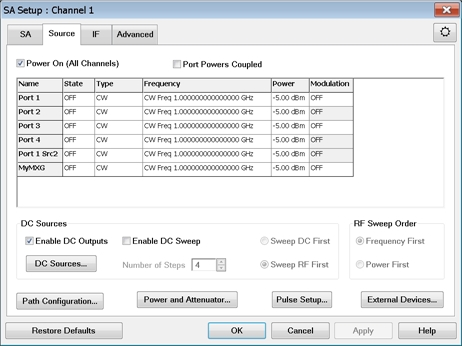 |  [SENS:SA:SOUR:FREQ:STARt](GP-IB_Command_Finder/Sense/SA.md#SourFreqStart) |  [SourceStartFrequency](COM_Reference/Properties/SourceStartFrequency_Property.md)  
[SENS:SA:SOUR:FREQ:STOP](GP-IB_Command_Finder/Sense/SA.md#sourFreqStop) |  [SourceStopFrequency](COM_Reference/Properties/SourceStopFrequency_Property.md)  
[SENS:SA:SOUR:FREQ:CW](GP-IB_Command_Finder/Sense/SA.md#sourFreqCW) |  [SourceCWFrequency](COM_Reference/Properties/SourceCWFrequency_Property.md)  
[SENS:SA:SOUR:DC:SWEep:FIRst[:DIMension]](GP-IB_Command_Finder/Sense/SA.md#DC:SWEep:FIRst:DIMension) |  [DCSourceSweepFirstDimension](COM_Reference/Properties/DCSourceSweepFirstDimension_Property.md)  
[SENS:SA:SOUR:DC:SWEep:POINt](GP-IB_Command_Finder/Sense/SA.md#DC:SWEep:POINt) |  [DCSourcePointCount](COM_Reference/Properties/DCSourcePointCount_Property.md)  
[SENS:SA:SOUR:DC:SWEep[:STATe]](GP-IB_Command_Finder/Sense/SA.md#DC:SWEep:STATe) |  [DCSourceSweepState](COM_Reference/Properties/DCSourceSweepState.md)  
[SENS:SA:SOUR:POW:SWEep:POINt:COUNt](GP-IB_Command_Finder/Sense/SA.md#SENSe:SA:SOURce:POW:SWEep:POINt:COUNt) |  [SourcePowerPointCount](COM_Reference/Properties/SourcePowerPointCount_Property.md)  
[SENS:SA:SOUR:POW:SWEep:REPeat:COUNt](GP-IB_Command_Finder/Sense/SA.md#SENSe:SA:SOURce:POW:SWEep:REPeat:COUNt) |  [SourcePowerRepeatCount](COM_Reference/Properties/SourcePowerRepeatCount_Property.md)  
[SENS:SA:SOUR:POWer:STARt](GP-IB_Command_Finder/Sense/SA.md#SENSe:SA:SOURce:POWer:STARt) |  [SourceStartPower](COM_Reference/Properties/SourceStartPower_Property.md)  
[SENS:SA:SOUR:POWer:STOP](GP-IB_Command_Finder/Sense/SA.md#SENSe:SA:SOURce:POWer:STOP) |  [SourceStopPower](COM_Reference/Properties/SourceStopPower_Property.md)  
[SENS:SA:SOUR:POWer[:VALue]](GP-IB_Command_Finder/Sense/SA.md#SENSe:SA:SOURce:POWer_:VALue) |  [SourcePower](COM_Reference/Properties/SourcePower_Property.md)  
[SENS:SA:SOUR:SWEep:FIRst[:DIMension]](GP-IB_Command_Finder/Sense/SA.md#SENSe:SA:SOURce:SWEep:FIRst) |  [SourceSweepFirstDimension](COM_Reference/Properties/SourceSweepFirstDimension_Property.md)  
[SENS:SA:SOUR:SWEep:TYPE](GP-IB_Command_Finder/Sense/SA.md#sourSweepType) |  [SourceSweepType](COM_Reference/Properties/SourceSweepType_Property.md) [SourceSweepType2](COM_Reference/Properties/SourceSweepType2_Property.md)  
[SENS:SA:SOUR:SWEep:POINt:COUNt](GP-IB_Command_Finder/Sense/SA.md#sweepPointCount) |  [SourcePointCount](COM_Reference/Properties/SourcePointCount_Property.md)  
[SENS:SA:SOUR:SWEep:REPeat:COUNt](GP-IB_Command_Finder/Sense/SA.md#sweepRepeatCount) |  [SourceRepeatCount](COM_Reference/Properties/SASweepRepeatCount_Property.md)  
  
* * *

The following are new programming commands for PNA release A.10.45 [See What's
New](../Whats_New.htm).

Dark shaded commands existed before this release. They are provided here for
convenience.

SA Advanced Settings tab  
---  
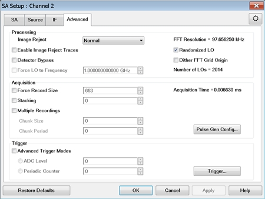 |  [SENSe:SA:IMAGe:REJect](GP-IB_Command_Finder/Sense/SA.md#imagRej) |  [ImageRejectMethod](COM_Reference/Properties/ImageReject_Property.md)  
[SENSe:SA:TRACe:IMAGe[:STATe]](GP-IB_Command_Finder/Sense/SA.md#Image_Reject_State) |  [EnableImageRejectTraces](COM_Reference/Properties/ImageRejectTracesState_Property.md)  
[SENSe:SA:DETector:BYPass:[STATe]](GP-IB_Command_Finder/Sense/SA.md#detBypassState) |  [EnableDetectorBypass](COM_Reference/Properties/DetectorBypassState_Property.md)  
[SENSe:SA:FFT:RES?](GP-IB_Command_Finder/Sense/SA.md#FFT_RES) |  [FFTResolution](COM_Reference/Properties/FFTResolution_Property.md)  
[SENSe:SA:FFT:DITHer[:STATe]](GP-IB_Command_Finder/Sense/SA.md#FFT:DITHer) |  [EnableDitherFFTGridOrigin](COM_Reference/Properties/FFTDither_Property.md)  
[SENSe:SA:LO:RANDom[:STATe]](GP-IB_Command_Finder/Sense/SA.md#LoRandState) |  [EnableRandomizedLO](COM_Reference/Properties/RandomizedLO_Property.md)  
[SENSe:SA:LO:FREQ:FORCe](GP-IB_Command_Finder/Sense/SA.md#FFTFreqMode) |  [EnableForce LOToFrequency](COM_Reference/Properties/EnableForceFFTToFrequency_Property.md)  
[SENSe:SA:LO:FREQ:VALue](GP-IB_Command_Finder/Sense/SA.md#FFT_FREQ_VALue) |  [ForceLOToFrequency](COM_Reference/Properties/ForceFFTToFrequency_Property.md)  
[SENSe:SA:ADC:STACking:STATe](GP-IB_Command_Finder/Sense/SA.md#SENSe:SA:ADC:STACking:STATe) |  [ADCStackingState](COM_Reference/Properties/ADCStackingState.md)  
[SENSe:SA:ADC:STACking](GP-IB_Command_Finder/Sense/SA.md#ADC_Stacking) |  [ADCStackingValue](COM_Reference/Properties/ADCStackingValue_Property.md)  
[SENSe:SA:ADC:RECord:SIZE:FORCe](GP-IB_Command_Finder/Sense/SA.md#FFT_ADC_Record_Size) |  [EnableForceADCRecordSize](COM_Reference/Properties/EnableForceADCRecordSize_Property.md)  
[SENSe:SA:ADC:RECord:SIZE:VALue](GP-IB_Command_Finder/Sense/SA.md#FFT_ADC_Record_Size_Value) |  [ForceADCRecordSize](COM_Reference/Properties/ForceADCRecordSize_Property.md)  
[SENSe:SA:ADC:MREC[:STATe]](GP-IB_Command_Finder/Sense/SA.md#SENSe:SA:ADC:MREC:STATe) |  [ADCMultRecState](COM_Reference/Properties/ADCMultRecState_Property.md)  
[SENSe:SA:ADC:MREC:SIZE](GP-IB_Command_Finder/Sense/SA.md#SENSe:SA:ADC:MREC:SIZE) |  [ADCMultRecSize](COM_Reference/Properties/ADCMultRecSize_Property.md)  
[SENSe:SA:ADC:MREC:PERiod](GP-IB_Command_Finder/Sense/SA.md#SENSe:SA:ADC:MREC:PERiod) |  [ADCMultRecPeriod](COM_Reference/Properties/ADCMultRecPeriod_Property.md)  
[SENSe:SA:TRIGer:LEVel[:STATe]](GP-IB_Command_Finder/Sense/SA.md#SENSe:SA:TRIGer:LEVel:STATe) |  [TriggerADCLevelState](COM_Reference/Properties/TriggerADCLevelState_Property.md)  
[SENSe:SA:TRIGer:LEVel:VALue](GP-IB_Command_Finder/Sense/SA.md#SENSe:SA:TRIGer:LEVel:VALue) |  [TriggerADCLevelValue](COM_Reference/Properties/TriggerADCLevelValue_Property.md)  
[SENSe:SA:TRIGer:PERCounter[:STATe]](GP-IB_Command_Finder/Sense/SA.md#SENSe:SA:TRIGer:PERCounter:STATe) |  [TriggerPeriodicCounterState](COM_Reference/Properties/TriggerPeriodicCounterState_Property.md)  
[SENSe:SA:TRIGer:PERCounter:VALue](GP-IB_Command_Finder/Sense/SA.md#SENSe:SA:TRIGer:PERCounter:VALue) |  [TriggerPeriodicCounterValue](COM_Reference/Properties/TriggerPeriodicCounterValue_Property.md)  
[SENSe:SA:LO:COUNt?](GP-IB_Command_Finder/Sense/SA.md#SENSe:SA:LO:NUMBer) |  [LOCount](COM_Reference/Properties/LONumber_Property.md)  
[SENSe:SA:ADC:ACQTime?](GP-IB_Command_Finder/Sense/SA.md#SENSe:SA:ADC:ACQTime) |  [AcquisitionTime](COM_Reference/Properties/AcquisitionTime.md)  
  
#### Millimeter-Wave Commands  
  
---  
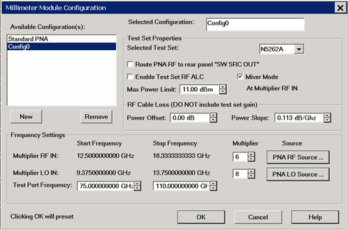 |  [SYSTem:CONFigure:MWAVe:CONF:ACTive](GP-IB_Command_Finder/SystConfig_mmWave.md#SYSTem:CONFigure:MWAVe:CONFiguration:ACTive)  
[SYSTem:CONFigure:MWAVe:CONF:ADD](GP-
IB_Command_Finder/SystConfig_mmWave.htm#SYSTem:CONFigure:MWAVe:CONFiguration:ADD)  
[SYSTem:CONFigure:MWAVe:CONF:CATalog?](GP-
IB_Command_Finder/SystConfig_mmWave.htm#SYSTem:CONFigure:MWAVe:CONFiguration:CATalog)  
[SYSTem:CONFigure:MWAVe:CONF:REMove](GP-
IB_Command_Finder/SystConfig_mmWave.htm#SYSTem:CONFigure:MWAVe:CONFiguration:REMove)  
[SYSTem:CONFigure:MWAVe:FREQuency:LO:MULTiplier](GP-
IB_Command_Finder/SystConfig_mmWave.htm#SYSTem:CONFigure:MWAVe:FREQuency:LO:MULTiplier)  
[SYSTem:CONFigure:MWAVe:FREQuency:LO:SOURce](GP-
IB_Command_Finder/SystConfig_mmWave.htm#SYSTem:CONFigure:MWAVe:FREQuency:LO:SOURce)  
[SYSTem:CONFigure:MWAVe:FREQuency:LO:STARt?](GP-
IB_Command_Finder/SystConfig_mmWave.htm#SYSTem:CONFigure:MWAVe:FREQuency:LO:STARt)  
[SYSTem:CONFigure:MWAVe:FREQuency:LO:STOP?](GP-
IB_Command_Finder/SystConfig_mmWave.htm#SYSTem:CONFigure:MWAVe:FREQuency:LO:STOP)  
[SYSTem:CONFigure:MWAVe:FREQuency:RF:MULTiplier](GP-
IB_Command_Finder/SystConfig_mmWave.htm#SYSTem:CONFigure:MWAVe:FREQuency:RF:MULTiplier)  
[SYSTem:CONFigure:MWAVe:FREQuency:RF:SOURce](GP-
IB_Command_Finder/SystConfig_mmWave.htm#SYSTem:CONFigure:MWAVe:FREQuency:RF:SOURce)  
[SYSTem:CONFigure:MWAVe:FREQuency:RF:STARt?](GP-
IB_Command_Finder/SystConfig_mmWave.htm#SYSTem:CONFigure:MWAVe:FREQuency:RF:STARt)  
[SYSTem:CONFigure:MWAVe:FREQuency:RF:STOP?](GP-
IB_Command_Finder/SystConfig_mmWave.htm#SYSTem:CONFigure:MWAVe:FREQuency:RF:STOP)  
[SYSTem:CONFigure:MWAVe:FREQuency:STARt](GP-
IB_Command_Finder/SystConfig_mmWave.htm#SYSTem:CONFigure:MWAVe:FREQuency:STARt)  
[SYSTem:CONFigure:MWAVe:FREQuency:STOP](GP-
IB_Command_Finder/SystConfig_mmWave.htm#SYSTem:CONFigure:MWAVe:FREQuency:STOP)  
[SYSTem:CONFigure:MWAVe:TSET:ALC](GP-
IB_Command_Finder/SystConfig_mmWave.htm#SYSTem:CONFigure:MWAVe:TSET:ALC)  
[SYSTem:CONFigure:MWAVe:TSET:CATalog?](GP-
IB_Command_Finder/SystConfig_mmWave.htm#SYSTem:CONFigure:MWAVe:TSET:CATalog)  
[SYSTem:CONFigure:MWAVe:TSET:MIXer](GP-
IB_Command_Finder/SystConfig_mmWave.htm#SYSTem:CONFigure:MWAVe:TSET:MIXer)  
[SYSTem:CONFigure:MWAVe:TSET:NAME](GP-
IB_Command_Finder/SystConfig_mmWave.htm#SYSTem:CONFigure:MWAVe:TSET:NAME)  
[SYSTem:CONFigure:MWAVe:TSET:POWer:LIMit](GP-
IB_Command_Finder/SystConfig_mmWave.htm#SYSTem:CONFigure:MWAVe:TSET:POWer:LIMit)  
[SYSTem:CONFigure:MWAVe:TSET:POWer:OFFSet](GP-
IB_Command_Finder/SystConfig_mmWave.htm#SYSTem:CONFigure:MWAVe:TSET:POWer:OFFSet)  
[SYSTem:CONFigure:MWAVe:TSET:POWer:SLOPe](GP-
IB_Command_Finder/SystConfig_mmWave.htm#SYSTem:CONFigure:MWAVe:TSET:POWer:SLOPe)  
[SYSTem:CONFigure:MWAVe:TSET:RPANel](GP-
IB_Command_Finder/SystConfig_mmWave.htm#SYSTem:CONFigure:MWAVe:TSET:RPANel)  
  
* * *

The following are new programming commands for PNA release A.10.40 [See What's
New](../Whats_New.htm).

Dark shaded commands existed before this release. They are provided here for
convenience.

SA Application - SA Setup tab  
---  
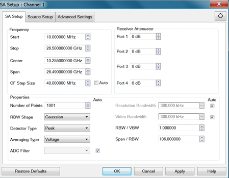 |  [SENS:FREQ:STARt](GP-IB_Command_Finder/Sense/Frequency.md#start) |  [chan.StartFrequency](COM_Reference/Properties/Start_Frequency_Property.md)  
[SENS:FREQ:STOP](GP-IB_Command_Finder/Sense/Frequency.md#stop) |  [chan.StopFrequency](COM_Reference/Properties/Stop_Frequency_Property.md)  
[SENS:FREQ:CENT](GP-IB_Command_Finder/Sense/Frequency.md#cent) |  [chan.CenterFrequency](COM_Reference/Properties/CenterFreq_Property.md)  
[SENS:FREQ:SPAN](GP-IB_Command_Finder/Sense/Frequency.md#span) |  [chan.FrequencySpan](COM_Reference/Properties/Frequency_Span_Property.md)  
[SENS:FREQ:SPAN:FULL](GP-IB_Command_Finder/Sense/Frequency.md#SpanFull) |  [FrequencySpanFull](COM_Reference/Methods/FrequencySpanFull_Method.md)  
[SENS:FREQ:CENT:STEP:SIZE](GP-IB_Command_Finder/Sense/Frequency.md#StepSize) |  [CenterFrequencyStepSize](COM_Reference/Properties/CenterFrequencyStepSize_Property.md)  
[SENS:FREQ:CENT:STEP:AUTO](GP-IB_Command_Finder/Sense/Frequency.md#STEPAUTO) |  [CenterFrequencyStepSizeMode](COM_Reference/Properties/CenterFrequencyStepSizeMode_Property.md)  
[SENS:POWer:ATT](GP-IB_Command_Finder/Sense/Power.md) |  [Receiver Attenuator Property](COM_Reference/Properties/Receiver_Attenuator_Property.md)  
  
#### Properties  
  
Number of Points |  [SENS:SWE:POIN](GP-IB_Command_Finder/Sense/Sweep_SCPI.md#ssp) |  [chan.NumberOfPoints](COM_Reference/Properties/Number_of__Points_Property.md)  
RBW Shape |  [SENS:SA:BAND:SHAPe](GP-IB_Command_Finder/Sense/SA.md#bandShape) |  [BandwidthShape](COM_Reference/Properties/BandwidthShape_\(SA\)_Property.md)  
Detector Type |  [SENSe:SA:DETector:FUNCtion](GP-IB_Command_Finder/Sense/SA.md#detFunction) |  [DetectorFunction](COM_Reference/Properties/DetectorFunction_Property.md)  
Averaging Type |  [SENS:SA:BAND:VIDEO:AVER:TYPE](GP-IB_Command_Finder/Sense/SA.md#vidAverType) |  [VideoAveragingType](COM_Reference/Properties/VideoAveragingType_Property.md)  
ADC Filter |  [SENS:SA:ADC:FILTer](GP-IB_Command_Finder/Sense/SA.md#FFT_Width) |  [ADCFilter](COM_Reference/Properties/FFTWidthMode_Property.md)  
ADC Filter Auto |  [SENS:SA:ADC:FILTer:AUTO](GP-IB_Command_Finder/Sense/SA.md#ADC_FILTer_AUTO) |  [EnableADCFilterAuto](COM_Reference/Properties/ADCFilterAuto.md)  
Resolution Bandwidth |  [SENS:SA:BAND:[RES]](GP-IB_Command_Finder/Sense/SA.md#BandRes) |  [ResolutionBW](COM_Reference/Properties/ResolutionBW_\(SA\)_Property.md)  
Resolution Bandwidth Auto |  [SENS:SA:BAND:[RES]:AUTO](GP-IB_Command_Finder/Sense/SA.md#bandResAuto) |  [ResolutionBWMode](COM_Reference/Properties/ResolutionBWMode_Property.md)  
Minimum Resolution Bandwidth |  [SENS:SA:BAND:RES MIN](GP-IB_Command_Finder/Sense/SA.md#SENSe:SA:BANDwidth:RESolution) |  [ResolutionBWMin](COM_Reference/Properties/ResolutionBWMin.md)  
Maximum Resolution Bandwidth |  [SENS:SA:BAND:RES MAX](GP-IB_Command_Finder/Sense/SA.md#SENSe:SA:BANDwidth:RESolution) |  [ResolutionBWMax](COM_Reference/Properties/ResolutionBWMax.md)  
Video Bandwidth |  [SENS:SA:BAND:VIDeo](GP-IB_Command_Finder/Sense/SA.md#video) |  [VideoBW](COM_Reference/Properties/VideoBW_Property.md)  
Video Bandwidth Auto |  [SENS:SA:BAND:VIDeo:AUTO](GP-IB_Command_Finder/Sense/SA.md#videoAuto) |  [VideoBWMode](COM_Reference/Properties/VideoBWMode_Property.md)  
Minimum Video Bandwidth |  [SENS:SA:BAND:VID MIN](GP-IB_Command_Finder/Sense/SA.md#SENSe:SA:BANDwidth:VIDeo) |  [VideoBWMin](COM_Reference/Properties/VideoBWMin.md)  
Maximum Video Bandwidth |  [SENS:SA:BAND:VID MAX](GP-IB_Command_Finder/Sense/SA.md#SENSe:SA:BANDwidth:VIDeo) |  [VideoBWMax](COM_Reference/Properties/VideoBWMax.md)  
RBW/VBW |  [SENSe:SA:BAND:VIDeo:RATio](GP-IB_Command_Finder/Sense/SA.md#bandVidRatio) |  [ResolutionBWVideoBWRatio](COM_Reference/Properties/ResolutionBWVideoBWRatio_Property.md)  
Span/RBW |  [SENS:SA:FREQ:SPAN:BAND[:RES]:RATio](GP-IB_Command_Finder/Sense/SA.md#freqSpanBWRat) |  [SpanResolutionBWRatio](COM_Reference/Properties/SpanResolutionBWRatio_Property.md)  
Video Averaging Count (no UI) |  [SENS:SA:BAND:VIDEO:AVER:COUNt?](GP-IB_Command_Finder/Sense/SA.md#vidAverCount) |  [VideoAveragingCount](COM_Reference/Properties/VideoAveragingCount_Property.md)  
  
#### Advanced Settings tab  
  
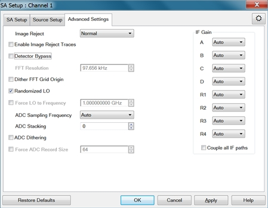 |  [SENSe:SA:IMAGe:REJect](GP-IB_Command_Finder/Sense/SA.md#imagRej) |  [ImageRejectMethod](COM_Reference/Properties/ImageReject_Property.md)  
[SENSe:SA:TRACe:IMAGe[:STATe]](GP-IB_Command_Finder/Sense/SA.md#Image_Reject_State) |  [EnableImageRejectTraces](COM_Reference/Properties/ImageRejectTracesState_Property.md)  
[SENSe:SA:DETector:BYPass:[STATe]](GP-IB_Command_Finder/Sense/SA.md#detBypassState) |  [EnableDetectorBypass](COM_Reference/Properties/DetectorBypassState_Property.md)  
[SENSe:SA:FFT:RES?](GP-IB_Command_Finder/Sense/SA.md#FFT_RES) |  [FFTResolution](COM_Reference/Properties/FFTResolution_Property.md)  
[SENSe:SA:FFT:DITHer[:STATe]](GP-IB_Command_Finder/Sense/SA.md#FFT:DITHer) |  [EnableDitherFFTGridOrigin](COM_Reference/Properties/FFTDither_Property.md)  
[SENSe:SA:LO:RANDom:[STATe]](GP-IB_Command_Finder/Sense/SA.md#LoRandState) |  [EnableRandomizedLO](COM_Reference/Properties/RandomizedLO_Property.md)  
[SENSe:SA:LO:FREQ:FORCe](GP-IB_Command_Finder/Sense/SA.md#FFTFreqMode) |  [EnableForce LOToFrequency](COM_Reference/Properties/EnableForceFFTToFrequency_Property.md)  
[SENSe:SA:LO:FREQ:VALue](GP-IB_Command_Finder/Sense/SA.md#FFT_FREQ_VALue) |  [ForceLOToFrequency](COM_Reference/Properties/ForceFFTToFrequency_Property.md)  
[SENSe:SA:ADC:SAMPle:RATE](GP-IB_Command_Finder/Sense/SA.md#ADCSampleRate) |  [ADCSampleRate](COM_Reference/Properties/ADCSampleRate_Property.md)  
[SENSe:SA:ADC:SAMPle:RATE:AUTO](GP-IB_Command_Finder/Sense/SA.md#ADC_Sample_Rate_Auto) |  [EnableADCSampleRateAuto](COM_Reference/Properties/ADCSampleRateAuto_Property.md)  
[SENSe:SA:ADC:STACking](GP-IB_Command_Finder/Sense/SA.md#ADC_Stacking) |  ADCStacking  
[SENSe:SA:ADC:DITHer:[STATe]](GP-IB_Command_Finder/Sense/SA.md#ADC:DITHer) |  [EnableADCDither](COM_Reference/Properties/ADC_Dithering_Property.md)  
[SENSe:SA:ADC:RECord:SIZE:FORCe](GP-IB_Command_Finder/Sense/SA.md#FFT_ADC_Record_Size) |  [EnableForceADCRecordSize](COM_Reference/Properties/EnableForceADCRecordSize_Property.md)  
[SENSe:SA:ADC:RECord:SIZE:VALue](GP-IB_Command_Finder/Sense/SA.md#FFT_ADC_Record_Size_Value) |  [ForceADCRecordSize](COM_Reference/Properties/ForceADCRecordSize_Property.md)  
[SENS:PATH:CONFig:ELEM](GP-IB_Command_Finder/Sense/Path.md#state) |  [Element](COM_Reference/Properties/Element_Property.md)  
Source Setup tab  
---  
 |  [SENS:SA:SOUR:FREQ:STARt](GP-IB_Command_Finder/Sense/SA.md#SourFreqStart) |  [SourceStartFrequency](COM_Reference/Properties/SourceStartFrequency_Property.md)  
[SENS:SA:SOUR:FREQ:STOP](GP-IB_Command_Finder/Sense/SA.md#sourFreqStop) |  [SourceStopFrequency](COM_Reference/Properties/SourceStopFrequency_Property.md)  
[SENS:SA:SOUR:FREQ:CW](GP-IB_Command_Finder/Sense/SA.md#sourFreqCW) |  [SourceCWFrequency](COM_Reference/Properties/SourceCWFrequency_Property.md)  
[SENS:SA:SOUR:SWEep:TYPE](GP-IB_Command_Finder/Sense/SA.md#sourSweepType) |  [SourceSweepType](COM_Reference/Properties/SourceSweepType_Property.md)  
[SENS:SA:SOUR:SWEep:POINt:COUNt](GP-IB_Command_Finder/Sense/SA.md#sweepPointCount) |  [SourcePointCount](COM_Reference/Properties/SourcePointCount_Property.md)  
[SENS:SA:SOUR:SWEep:REPeat:COUNt](GP-IB_Command_Finder/Sense/SA.md#sweepRepeatCount) |  [SourceRepeatCount](COM_Reference/Properties/SASweepRepeatCount_Property.md)  
[SOURce:POWer](GP-IB_Command_Finder/source.md#pwrval) |  [chan.TestPortPower](COM_Reference/Properties/Test_Port_Power_Property.md)  
[SENS:PATH:CONFig:ELEMent](GP-IB_Command_Finder/Sense/Path.md#state) |  [Element](COM_Reference/Properties/Element_Property.md)  
  
SA Marker Settings  
---  
Marker to SA |  [CALC:MARKer:SET SA](GP-IB_Command_Finder/Calculate/Marker.md#set) |  [toSA](COM_Reference/Methods/toSA_Method.md)  
Read Band Power |  [CALC:SA:MARK:BPOWer:DATA?](GP-IB_Command_Finder/Calculate/SA.md#bpowData) |  [BandpowerData](COM_Reference/Methods/BandpowerData_Method.md)  
Read Band Power Span |  [CALC:SA:MARK:BPOWer:SPAN](GP-IB_Command_Finder/Calculate/SA.md#bpowSpan) |  [BandpowerSpan](COM_Reference/Properties/BandpowerSpan_Property.md)  
Set Band Power State |  [CALC:SA:MARK:BPOWer[:STATe]](GP-IB_Command_Finder/Calculate/SA.md#bpowState) |  [BandpowerState](COM_Reference/Properties/BandpowerState_Property.md)  
  
### Dynamic Uncertainty

Setup Options  
---  
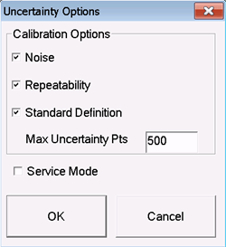 |  [SYST:UNC:ETER:NOIS:ENAB](GP-IB_Command_Finder/SystUncertainty.md#EtermNoiseEnable) |  [PortNoiseEnabled](COM_Reference/Properties/PortNoiseEnabled_Property.md)  
[SYST:UNC:ETER:CABL:REP](GP-IB_Command_Finder/SystUncertainty.md#EtermCableRepeatEnab) |  [CableRepeatabilityEnabled](COM_Reference/Properties/CableRepeatabilityEnabled_Property.md)  
[SYST:UNC:ETER:SDEF](GP-IB_Command_Finder/SystUncertainty.md#EtermSdef) |  [StandardDefinitionsEnabled](COM_Reference/Properties/StandardDefinitionsEnabled_Property.md)  
[SYST:UNC:POIN:MAX](GP-IB_Command_Finder/SystUncertainty.md#PointsMAX) |  [MaximumUncertaintyPoints](COM_Reference/Properties/MaximumUncertaintyPoints_Property.md)  
Noise Characterization  
---  
Clear noise data on specified port |  [SYST:UNC:PORT
:NOISe:RESet](GP-IB_Command_Finder/SystUncertainty.md#NOISeRESet) |  [ResetNoise](COM_Reference/Methods/ResetNoise_Method.md)  
Clear noise data on all ports |  [SYST:UNC:PORT:NOISe:RESet](GP-IB_Command_Finder/SystUncertainty.md#NOISeRESet) |  [ResetNoiseForAllPorts](COM_Reference/Methods/ResetNoiseForAllPorts_Method.md)  
Copy noise from a port to all ports |  [SYST:UNC:PORT:NOISe:ALL:COPY](GP-IB_Command_Finder/SystUncertainty.md#NoiseAllCopy) |  [CopyNoiseToAllPorts](COM_Reference/Methods/CopyNoiseToAllPorts_Method.md)  
Start Noise char |  [SENS:CORR:COLL:GUIDed:UNC:CHAR:NOISe](GP-IB_Command_Finder/Sense/CorrGuided.md#UncertNoiseInit) |  [InitiateNoiseCharacterization](COM_Reference/Methods/InitiateNoiseCharacterization_Method.md)  
Cables Characterization  
---  
List cables |  [SYST:UNC:CABLe:CATalog?](GP-IB_Command_Finder/SystUncertainty.md#CABLeCAT) |  [Cables Collection](COM_Reference/Objects/Cables_Collection.md)  
Assign Cable to all ports |  [SYST:UNC:PORT:CABLe:ALL](GP-IB_Command_Finder/SystUncertainty.md#CABLeSelALL) |  [SelectCableForAllPorts](COM_Reference/Methods/SelectCableForAllPorts_Method.md)  
Assign Cable to specified port |  [SYST:UNC:PORT
:CABLe](GP-IB_Command_Finder/SystUncertainty.md#CABLeSELect) |  [Cable](COM_Reference/Properties/Cable_Property.md)  
Reset repeatability |  [SYST:UNC:CABL:REP:RES](GP-IB_Command_Finder/SystUncertainty.md#CABLeRESet) |  [ResetRepeatability](COM_Reference/Methods/ResetRepeatability_Method.md)  
Start Cable char |  [SENS:CORR:COLL:GUID:UNC:CHAR:CABLe](GP-IB_Command_Finder/Sense/CorrGuided.md#UncertCableINIT) |  [InitiateCableCharacterization](COM_Reference/Methods/InitiateCableCharacterization_Method.md)  
Uncertainty workspace  
---  
Load workspace |  [SYST:UNC:LOAD](GP-IB_Command_Finder/SystUncertainty.md#LOAD) |  [Recall](COM_Reference/Methods/Recall_uncert_Method.md)  
Save workspace |  [SYST:UNC:STORe](GP-IB_Command_Finder/SystUncertainty.md#STORe) |  [Save](COM_Reference/Methods/Save_uncert_Method.md)  
Enabling a Guided Calibration to include Uncertainties  
---  
Checkbox on [Guided Cal Select Ports](../S3_Cals/Calibration_Wizard.md#GuidedSelCalType) page |  [SENS:CORR:COLL:GUID:UNC](GP-IB_Command_Finder/Sense/CorrGuided.md#UncertEnab) |  [UncertaintyEnabled](COM_Reference/Properties/UncertaintyEnabled_Property.md)  
Trace Properties  
---  
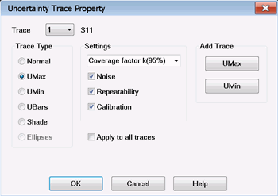 |  [CALC:UNC:DISP:TYPE](GP-IB_Command_Finder/Calculate/Uncertainty.md#UNCertDISPlayTYPE) |  [DisplayType](COM_Reference/Properties/DisplayType_Property.md)  
[CALC:UNC:DISP:CFAC](GP-IB_Command_Finder/Calculate/Uncertainty.md#UncertDispFactor) |  [CoverageFactor](COM_Reference/Properties/CoverageFactor_Property.md)  
[CALC:UNC:MOD:NOIS](GP-IB_Command_Finder/Calculate/Uncertainty.md#UncertNoise) |  [MeasurementNoiseUncertainty](COM_Reference/Properties/MeasurementNoiseUncertainty_Property.md)  
[CALC:UNC:MODE:CABL:REP](GP-IB_Command_Finder/Calculate/Uncertainty.md#UncertCableRepeat) |  [CableRepeatabilityUncertainty](COM_Reference/Properties/CableRepeatabilityUncertainty_Property.md)  
[CALC:UNC:MOD:ETER](GP-IB_Command_Finder/Calculate/Uncertainty.md#MODE:ETERm) |  [ErrorTermUncertainty](COM_Reference/Properties/ErrorTermUncertainty_Property.md)  
Apply to all traces |  None |  None  
Add Trace |  None |  None  
Save uncertainty data |  [CALC:UNC:SAVE](GP-IB_Command_Finder/Calculate/Uncertainty.md#save) |  [WriteUncertaintyFile](COM_Reference/Methods/WriteUncertaintyFile_Method.md)  
  
Preferences |  SCPI |  COM  
---|---|---  
Reference marker preference |  [SYST:PREF:ITEM:REFM](GP-IB_Command_Finder/System_Preferences.md#REFMarker) |  [TreatMkr10AsReference](COM_Reference/Properties/TreatMkr10AsReference_Property.md)  
Draw red limits preference |  [SYST:PREF:ITEM:REDL](GP-IB_Command_Finder/System_Preferences.md#Redlimits) |  [DrawLimitLinesInRed](COM_Reference/Properties/DrawLimitLinesInRed_Property.md)  
Coupled Marker controls marker state |  [SYST:PREF:ITEM:MCControl](GP-IB_Command_Finder/System_Preferences.md#markerCouplControl) |  [MarkCoupControlsMkrState](COM_Reference/Properties/MarkCoupControlsMkrState_Property.md)  
Coupled Marker state at Preset |  [SYST:PREF:ITEM:MCPreset](GP-IB_Command_Finder/System_Preferences.md#MarkerCouplPreset) |  [MarkCoupPresetIsOn](COM_Reference/Properties/MarkCoupPresetIsOn_Property.md)  
Coupled Marker Method at Preset |  [SYST:PREF:ITEM:MCMethod](GP-IB_Command_Finder/System_Preferences.md#markerCoupleMethod) |  [MarkCoupMethPresetIsChan](COM_Reference/Properties/MarkCoupMethPresetIsChan_Property.md)  
  
Capabilities commands |  SCPI |  COM  
---|---|---  
Returns the maximum leveled source power. |  [SYST:CAP:ALC:POWer:MAXimum[:LEVel]?](GP-IB_Command_Finder/SystCapability.md#ALC:POWer:MAX) |  [MaximumSourceALCPower](COM_Reference/Properties/MaximumSourceALCPower_Property.md)  
Returns the minimum leveled source power. |  [SYST:CAP:ALC:POWer:MINimum[:LEVel]?](GP-IB_Command_Finder/SystCapability.md#ALCPOWerMIN) |  [MinimumSourceALCPower](COM_Reference/Properties/MinimumSourceALCPower_Property.md)  
Returns the maximum possible number of channels. |  [SYST:CAP:CHANnels:MAXimum[:COUNt]?](GP-IB_Command_Finder/SystCapability.md#ChanMAX) |  [MaximumNumberOfChannels](COM_Reference/Properties/MaximumNumberOfChannels_Property.md)  
Returns whether or not the analyzer has FOM. |  [SYST:CAP:FOM:EXISts?](GP-IB_Command_Finder/SystCapability.md#FomEXISts) |  [IsFrequencyOffsetPresent](COM_Reference/Properties/IsFrequencyOffsetPresent_Property.md)  
Returns the maximum frequency of the analyzer, including any over-sweep |  [SYST:CAP:FREQuency:MAXimum?](GP-IB_Command_Finder/SystCapability.md#FreqMax) |  [MaximumFrequency](COM_Reference/Properties/MaximumFrequency_cap_Property.md)  
Returns the minimum frequency of the analyzer, including any under-sweep |  [SYST:CAP:FREQuency:MINimum?](GP-IB_Command_Finder/SystCapability.md#FreqMin) |  [MinimumFrequency](COM_Reference/Properties/MinimumFrequency_cap_Property.md)  
Returns whether or not there is a receiver attenuator on the specified port. |  [SYST:CAP:HARD:ATT:REC:EXISts?](GP-IB_Command_Finder/SystCapability.md#hardAttRecExist) |  [IsReceiverStepAttenuatorPresent](COM_Reference/Properties/IsReceiverStepAttenuatorPresent_Property.md)  
Returns the maximum amount of receiver attenuation on the specified port. |  [SYST:CAP:HARD:ATT:REC:MAX?](GP-IB_Command_Finder/SystCapability.md#hardAttRecMax) |  [MaximumReceiverStepAttenuator](COM_Reference/Properties/MaximumReceiverStepAttenuator_Property.md)  
Returns the step size of the receiver attenuator on the specified port |  [SYST:CAP:HARD:ATT:REC:STEP[:SIZE]?](GP-IB_Command_Finder/SystCapability.md#hardAttRecStep) |  [ReceiverStepAttenuatorStepSize](COM_Reference/Properties/ReceiverStepAttenuatorStepSize_Property.md)  
Returns the maximum amount of source attenuation on the specified port. |  [SYST:CAP:HARD:ATT:SOUR:MAX?](GP-IB_Command_Finder/SystCapability.md#hardAttSourMax) |  [MaximumSourceStepAttenuator](COM_Reference/Properties/MaximumSourceStepAttenuator_Property.md)  
Returns the step size of the source attenuator on the specified port |  [SYST:CAP:HARD:ATT:SOUR:STEP[:SIZE]?](GP-IB_Command_Finder/SystCapability.md#hardAttSourStep) |  [SourceStepAttenuatorStepSize](COM_Reference/Properties/SourceStepAttenuatorStepSize_Property.md)  
Returns a list of test port names including external testset ports. |  [SYST:CAP:HARD:PORT:CAT?](GP-IB_Command_Finder/SystCapability.md#hardPortsCat) |  [TestPortNames](COM_Reference/Properties/TestPortNames_Property.md)  
Returns the number of test ports including external testset ports. |  [SYST:CAP:HARD:PORTs:COUNt?](GP-IB_Command_Finder/SystCapability.md#hardPortsCount) |  [NumberOfPorts](COM_Reference/Properties/Number_ports_Property.md)  
Returns a list of internal test port names. |  [SYST:CAP:HARD:PORTs:INT:CAT?](GP-IB_Command_Finder/SystCapability.md#hardPortIntCat) |  [InternalTestsetPortNames](COM_Reference/Properties/InternalTestsetPortNames_Property.md)  
Returns the number of internal test ports. |  [SYST:CAP:HARD:PORTs:INT:COUNt?](GP-IB_Command_Finder/SystCapability.md#hardPortIntCount) |  [InternalTestsetPortCount](COM_Reference/Properties/InternalTestsetPortCount_Property.md)  
Returns the port number associated with the specified port name. |  [SYST:CAP:HARD:PORTs:PNUMber?](GP-IB_Command_Finder/SystCapability.md#hardPortPnum) |  [GetPortNumber](COM_Reference/Methods/GetPortNumber_Method.md)  
Returns a catalog (comma-separated string list) of internal source port names. |  [SYST:CAP:HARD:PORTs:INT:CAT?](GP-IB_Command_Finder/SystCapability.md#hardPortIntCat) |  [InternalSourcePortNames](COM_Reference/Properties/InternalSourcePortNames_Property.md)  
Returns the number of internal source ports. |  [SYST:CAP:HARD:PORTs:INT:COUNt?](GP-IB_Command_Finder/SystCapability.md#hardPortIntCount) |  [InternalSourcePortCount](COM_Reference/Properties/InternalSourcePortCount_Property.md)  
Returns whether or not the specified port number has a reference bypass switch. |  [SYST:CAP:HARD:RBSWitch:EXISts?](GP-IB_Command_Finder/SystCapability.md#hardRBSwitch) |  [IsReferenceBypassSwitchPresent](COM_Reference/Properties/IsReferenceBypassSwitchPresent_Property.md)  
Returns the number of receivers in the analyzer. |  [SYST:CAP:HARD:REC:COUNt?](GP-IB_Command_Finder/SystCapability.md#hardRecCount) |  [ReceiverCount](COM_Reference/Properties/ReceiverCount_Property.md)  
Returns whether or not the analyzer has direct receiver access (front-panel jumpers). |  [SYST:CAP:HARD:REC:DACCess](GP-IB_Command_Finder/SystCapability.md#RecDaccess) |  [HasDirectReceiverAccess](COM_Reference/Properties/HasDirectReceiverAccess_Property.md)  
Returns the number of sources in the analyzer. |  [SYST:CAP:HARD:SOURce:COUNt?](GP-IB_Command_Finder/SystCapability.md#hardSrcCount) |  [SourceCount](COM_Reference/Properties/SourceCount_Property.md)  
Returns the list of supported IFBW values. |  [SYST:CAP:IFBW:CAT?](GP-IB_Command_Finder/SystCapability.md#ifbwCat) |  [IFBWList](COM_Reference/Properties/IFBWList_Property.md)  
Returns the list of supported Noise BW when using a noise receiver (option 029). |  [SYST:CAP:NBW:NOISe:CAT?](GP-IB_Command_Finder/SystCapability.md#nbwNoise) |  [NoiseReceiverNoiseBWList](COM_Reference/Properties/NoiseReceiverNoiseBWList_Property.md)  
Returns the list of supported Noise BW values when using the NA receiver for noise measurements (option 028). |  [SYST:CAP:NBW:STD:CAT?](GP-IB_Command_Finder/SystCapability.md#nbwStd) |  [StandardReceiverNoiseBWList](COM_Reference/Properties/StandardReceiverNoiseBWList_Property.md)  
Returns the maximum number of points. |  [SYST:CAPability:POINts:MAXimum?](GP-IB_Command_Finder/SystCapability.md#pointsMax) |  [MaximumNumberOfPoints](COM_Reference/Properties/MaximumNumberOfPoints.md)  
Returns the minimum number of points. |  [SYST:CAPability:POINts:MINimum?](GP-IB_Command_Finder/SystCapability.md#pointsMin) |  [MinimumNumberOfPoints](COM_Reference/Properties/MinimumNumberOfPoints.md)  
Returns the maximum specified frequency of the analyzer, not including any over-sweep. |  [SYST:CAP:PRESet:FREQ:MAXimum?](GP-IB_Command_Finder/SystCapability.md#presFreqMax) |  [PresetMaxFrequency](COM_Reference/Properties/PresetMaxFrequency_Property.md)  
Returns the minimum specified frequency of the analyzer, not including any under-sweep. |  [SYST:CAP:PRESet:FREQ:MINimum?](GP-IB_Command_Finder/SystCapability.md#presFreqMin) |  [PresetMinFrequency](COM_Reference/Properties/PresetMinFrequency_Property.md)  
Returns the list of supported Resolution BW values for the IMS channel. |  [SYST:CAP:RBW:IMS:CATalog?](GP-IB_Command_Finder/SystCapability.md#rbwIMS) |  [ResBWList](COM_Reference/Properties/ResBWList_Property.md)  
Returns the list of supported Resolution BW values for the SA channel. |  [SYST:CAP:RBW:SA:CATalog?](GP-IB_Command_Finder/SystCapability.md#rbwSaCat) |  [SAResBWList](COM_Reference/Properties/SAResBWList_Property.md)  
Returns the maximum number of windows possible. |  [SYST:CAP:WIND:MAX[:COUNt]?](GP-IB_Command_Finder/SystCapability.md#windMax) |  [MaximumNumberOfWindows](COM_Reference/Properties/MaximumNumberOfWindows_Property.md)  
Returns the maximum number of traces per window. |  [SYST:CAP:WIND:TRAC:MAX[:COUNt]?](GP-IB_Command_Finder/SystCapability.md#windTracesMax) |  [MaximumNumberOfTracesPerWindow](COM_Reference/Properties/MaximumNumberOfTracesPerWindow_Property.md)  
Miscellaneous |  SCPI |  COM  
---|---|---  
Frequency Step Size |  [SENS:SWEep:STEP](GP-IB_Command_Finder/Sense/Sweep_SCPI.md#Step) |  [FrequencyStep Property](COM_Reference/Properties/FrequencyStep_Property.md)  
Marker noise format |  [CALC:MARK:FORMat NOISe](GP-IB_Command_Finder/Calculate/Marker.md#form) |  [Format (Marker) Property](COM_Reference/Properties/Format_Marker_Property.md)  
Display marker symbols above the trace |  [DISP:WIND:ANN:MARK:SYMB:ABOV](GP-IB_Command_Finder/Display.md#MarkerSymbolAbove) |  [MarkerSymbolsAboveTrace Property](COM_Reference/Properties/MarkerSymbolsAboveTrace_Property.md)  
Limit Pass/Fail X-axis Position |  [DISP:WIND:ANN:LIM:XPOS](GP-IB_Command_Finder/Display.md#limitX) |  [LimitTestXPosition](COM_Reference/Properties/LimitTestXPosition_Property.md)  
Limit Pass/Fail Y-axis Position |  [DISP:WIND:ANN:LIM:YPOS](GP-IB_Command_Finder/Display.md#limitY) |  [LimitTestYPosition](COM_Reference/Properties/LimitTestYPosition_Property.md)  
Scope of marker coupling |  [CALC:MARK:COUP:METH](GP-IB_Command_Finder/Calculate/Marker.md#coupleMethod) |  [CoupledMarkersMethod](COM_Reference/Properties/CoupledMarkersMethod_Property.md)  
DIQ Load |  [SENS:DIQ:LOAD](GP-IB_Command_Finder/Sense/DIQ.md#load) |  [Load Method](COM_Reference/Methods/Load_Method.md)  
DIQ Save |  [SENS:DIQ:SAVE](GP-IB_Command_Finder/Sense/DIQ.md#save) |  [Save Method](COM_Reference/Methods/Save_uncert_Method.md)  
Trace Hold |  [CALC:HOLD:TYPE](GP-IB_Command_Finder/Calculate/Hold.md#type) |  [TraceHoldType](COM_Reference/Properties/TraceHoldType_Property.md)  
Trace Hold Clear |  [CALC:HOLD:CLEar](GP-IB_Command_Finder/Calculate/Hold.md#clear) |  [TraceHoldClear](COM_Reference/Methods/TraceHoldClear_Method.md)  
  
* * *

The following are new programming commands for PNA release A.10.25 [See What's
New](../Whats_New.htm).

Diff IQ Setup Dialog  
---  
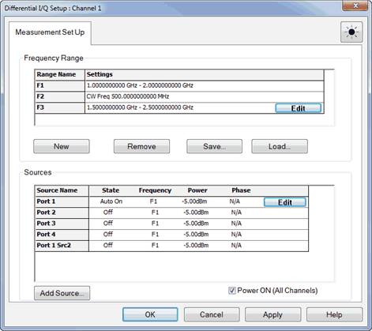 |  [SENSe:DIQ:FREQ:RANGe:ADD](GP-IB_Command_Finder/Sense/DIQ.md#FrRangeAdd) |  [AddRange Method](COM_Reference/Methods/AddRange_Method.md)  
[SENSe:DIQ:FREQ:RANGe:DELete](GP-IB_Command_Finder/Sense/DIQ.md#FrRangeDelete) |  [DeleteRange Method](COM_Reference/Methods/DeleteRange_Method.md)  
DIQ Range Settings Dialog |  |  SCPI |  COM  
---|---|---|---  
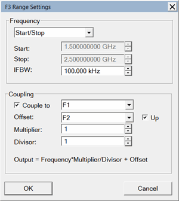 |  Frequency |  [SENSe:DIQ:FREQ:RANGe:STARt](GP-IB_Command_Finder/Sense/DIQ.md#FrRangeStart) |  [RangeStartFrequency](COM_Reference/Properties/RangeStartFrequency_Property.md)  
[SENSe:DIQ:FREQ:RANGe:STOP](GP-IB_Command_Finder/Sense/DIQ.md#FrRangeStop) |  [RangeStopFrequency](COM_Reference/Properties/RangeStopFrequency_Property.md)  
[SENSe:DIQ:FREQ:RANGe:IFBW](GP-IB_Command_Finder/Sense/DIQ.md#FrRangeIFBW) |  [RangeIFBW Property](COM_Reference/Properties/RangeIFBW_Property.md)  
Coupling |  [SENSe:DIQ:FREQ:RANGe:COUPle:STATe](GP-IB_Command_Finder/Sense/DIQ.md#FrRangeCplState) |  [RangeCoupleState Property](COM_Reference/Properties/RangeCoupleState_Property.md)  
[SENSe:DIQ:FREQ:RANGe:COUPle:ID](GP-IB_Command_Finder/Sense/DIQ.md#FrRangeCplID) |  [RangeCoupleId Property](COM_Reference/Properties/RangeCoupleId_Property.md)  
[SENSe:DIQ:FREQ:RANGe:COUPle:OFFSet](GP-IB_Command_Finder/Sense/DIQ.md#FrRangeCplOffset) |  [RangeOffset Property](COM_Reference/Properties/RangeOffset_Property.md)  
[SENSe:DIQ:FREQ:RANGe:COUPle:UCONvert](GP-IB_Command_Finder/Sense/DIQ.md#FrRangeCplUconv) |  [RangeOffsetUp Property](COM_Reference/Properties/RangeOffsetUp_Property.md)  
[SENSe:DIQ:FREQ:RANGe:COUPle:MULTiplier](GP-IB_Command_Finder/Sense/DIQ.md#FrRangeCplMult) |  [RangeMultiplier Property](COM_Reference/Properties/RangeMultiplier_Property.md)  
[SENSe:DIQ:FREQ:RANGe:COUPle:DIvisor](GP-IB_Command_Finder/Sense/DIQ.md#FrRangeCplDivisor) |  [RangeDivisor Property](COM_Reference/Properties/RangeDivisor_Property.md)  
DIQ Source Configuration Dialog |  SCPI |  COM  
---|---|---  
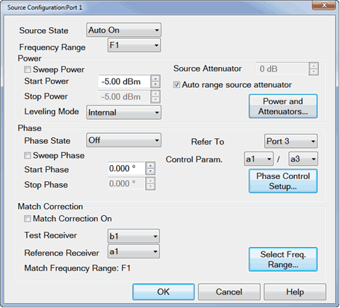 |  |  [SENSe:DIQ:PORT:STATe](GP-IB_Command_Finder/Sense/DIQ.md#PortState) |  [PortState Property](COM_Reference/Properties/SourceState_Property.md)  
[SENSe:DIQ:PORT:RANGe](GP-IB_Command_Finder/Sense/DIQ.md#PortRange) |  [PortRange Property](COM_Reference/Properties/SourceRange_Property.md)  
Power |  [SENSe:DIQ:PORT:POWer:SWEep](GP-IB_Command_Finder/Sense/DIQ.md#PortPowerSwp) |  [PowerSweepState Property](COM_Reference/Properties/PowerSweepState_Property.md)  
[SENSe:DIQ:PORT:POWer:STARt](GP-IB_Command_Finder/Sense/DIQ.md#PortPowerStart) |  [PortStartPower Property](COM_Reference/Properties/PortStartPower_Property.md)  
[SENSe:DIQ:PORT:POWer:STOP](GP-IB_Command_Finder/Sense/DIQ.md#PortPowerStop) |  [PortStopPower Property](COM_Reference/Properties/PortStopPower_Property.md)  
[SENSe:DIQ:PORT:POWer:ALC:MODE](GP-IB_Command_Finder/Sense/DIQ.md#PortPowerALC) |  [PortLevelingMode Property](COM_Reference/Properties/PortLevelingMode_Property.md)  
[SENSe:DIQ:PORT:POWer:ATT](GP-IB_Command_Finder/Sense/DIQ.md#PortPowerAtten) |  [PortAttenuator Property](COM_Reference/Properties/PortAttenuator_Property.md)  
[SENSe:DIQ:PORT:POWer:ATT:AUTO](GP-IB_Command_Finder/Sense/DIQ.md#PortPowerAttenAuto) |  [AutoRangeState Property](COM_Reference/Properties/AutoRangeState_Property.md)  
Phase |  [SENSe:DIQ:PORT:PHASe:STATe](GP-IB_Command_Finder/Sense/DIQ.md#PortPhaseState) |  [PortPhaseState Property](COM_Reference/Properties/PortPhaseState_Property.md)  
[SENSe:DIQ:PORT:PHASe:SWEep](GP-IB_Command_Finder/Sense/DIQ.md#PortPhaseSweep) |  [PhaseSweepState Property](COM_Reference/Properties/PhaseSweepState_Property.md)  
[SENSe:DIQ:PORT:PHASe:STARt](GP-IB_Command_Finder/Sense/DIQ.md#PortPhaseStart) |  [PortPhaseStart Property](COM_Reference/Properties/PortPhaseStart_Property.md)  
[SENSe:DIQ:PORT:PHASe:STOP](GP-IB_Command_Finder/Sense/DIQ.md#PortPhaseStop) |  [PortPhaseStop Property](COM_Reference/Properties/PortPhaseStop_Property.md)  
[SENSe:DIQ:PORT:PHASe:REF](GP-IB_Command_Finder/Sense/DIQ.md#PortPhaseRef) |  [PortReference Property](COM_Reference/Properties/PortReference_Property.md)  
[SENSe:DIQ:PORT:PHASe:PAR](GP-IB_Command_Finder/Sense/DIQ.md#PortPhasePar) |  [PortPhaseParameter Property](COM_Reference/Properties/PortPhaseParameter_Property.md)  
Match Correction |  [SENSe:DIQ:PORT:MATCh:STATe](GP-IB_Command_Finder/Sense/DIQ.md#PortMatchState) |  [MatchState Property](COM_Reference/Properties/MatchState_Property.md)  
[SENSe:DIQ:PORT:MATCh:TREC](GP-IB_Command_Finder/Sense/DIQ.md#PortMatchTrec) |  [MatchTestReceiver Property](COM_Reference/Properties/MatchTestReceiver_Property.md)  
[SENSe:DIQ:PORT:MATCh:RREC](GP-IB_Command_Finder/Sense/DIQ.md#PortMatchRRec) |  [MatchRefReceiver Property](COM_Reference/Properties/MatchRefReceiver_Property.md)  
[SENSe:DIQ:PORT:MATCh:RANG](GP-IB_Command_Finder/Sense/DIQ.md#PortMatchRange) |  [MatchFrequencyRange Property](COM_Reference/Properties/MatchFrequencyRange_Property.md)  
DIQ Edit Parameters Dialog |  SCPI |  COM  
---|---|---  
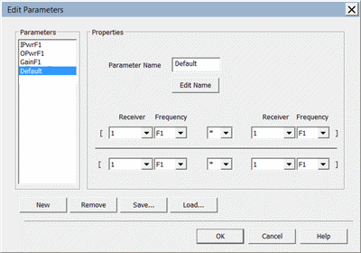 |  [SENSe:DIQ:PARameter:DEFine](GP-IB_Command_Finder/Sense/DIQ.md#parDefine) |  [DefineParameter Method](COM_Reference/Methods/DefineParameter_Method.md)  
[SENSe:DIQ:PARameter:DELete](GP-IB_Command_Finder/Sense/DIQ.md#paramDelete) |  [DeleteParameter Method](COM_Reference/Methods/DeleteParameter_Method.md)  
[SENSe:DIQ: PARameter:CATalog?](GP-IB_Command_Finder/Sense/DIQ.md#paramCat) |  [ParameterList Property](COM_Reference/Properties/ParameterList_Property.md)  
[SENS:DIQ:LOAD](GP-IB_Command_Finder/Sense/DIQ.md#load) |  [Load Method](COM_Reference/Methods/Load_Method.md)  
[SENS:DIQ:SAVE](GP-IB_Command_Finder/Sense/DIQ.md#save) |  [Save Method](COM_Reference/Methods/Save_uncert_Method.md)  
DIQ Select X-Axis Dialog |  SCPI |  COM  
---|---|---  
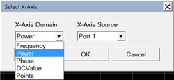 |  [CALC:DIQ:XAXis](GP-IB_Command_Finder/Calculate/DIQ.md#XAXis) |  [ActiveXAxis Property](COM_Reference/Properties/ActiveXAxis_Property.md)  
[CALC:DIQ:XAXis:DOMain?](GP-IB_Command_Finder/Calculate/DIQ.md#domain) |  [XAxisDomain Property](COM_Reference/Properties/XAxisDomain_Property.md)  
[CALC:DIQ:XAXis:SOURce?](GP-IB_Command_Finder/Calculate/DIQ.md#source) |  [XAxisSource Property](COM_Reference/Properties/XAxisSource_Property.md)  
  
* * *

The following are new programming commands for PNA release A.10.20.03 [See
What's New](../Whats_New.htm).

Narrowband Compensation |  SCPI |  COM  
---|---|---  
Enable |  [SENS:NOIS:NARRowband:[STATe]](GP-IB_Command_Finder/Sense/Noise.md#Narrowband) |  [NarrowBand](COM_Reference/Properties/NarrowBand_Property.md)  
  
Cal Plane Manager |  SCPI |  COM  
---|---|---  
Characterize a fixture |  [CSET:FIXTure:CHARacterize](GP-IB_Command_Finder/CSET.md#fixtureCharacter) |  [CharacterizeFixture](COM_Reference/Methods/CharacterizeFixture_Method.md)  
Creates a single S2P file from two existing files. |  [CSET:FIXTure:CASCade](GP-IB_Command_Finder/CSET.md#FIXTureCASCade) |  [CascadeS2PFiles](COM_Reference/Methods/CascadeS2PFiles_Method.md)  
  
Note: There are currently NO programming commands for Automatic Fixture
Removal.

* * *

The following are new programming commands for PNA release A.10.15 [See What's
New](../Whats_New.htm).

Cal Sets |  SCPI |  COM  
---|---|---  
Returns the Cal Types from the calset. |  None |  [ContentDescriptor](COM_Reference/Properties/ContentDescriptor_Property.md)  
Returns the properties of the calset. |  None |  [Properties](COM_Reference/Properties/Properties_Property.md)  
Returns the numbers of the channels using the calset. |  None |  [ChannelClients](COM_Reference/Properties/ChannelClients_Property.md)  
Unselect Cal Set |  [SENS:CORR:CSET:DEAC](GP-IB_Command_Finder/Sense/CorrCset.md#DEACtivate) |  [UnselectCalset](COM_Reference/Methods/UnselectCalset_Method.md)  
  
* * *

The following are new programming commands for PNA release A.10.00 [See What's
New](../Whats_New.htm).

Toolbars ON|OFF |  SCPI |  COM  
---|---|---  
Show virtual hardkeys |  [DISPlay:TOOLbar:KEYS[:STATe]](GP-IB_Command_Finder/Display.md#keys) |  app.[ShowToolbar](COM_Reference/Methods/Show_Toolbar_Method.md)  
Show port extensions |  [DISPlay:TOOLbar:EXT[:STATe]](GP-IB_Command_Finder/Display.md#extensions) |  app.[ShowToolbar](COM_Reference/Methods/Show_Toolbar_Method.md)  
Shown Time Domain Transform |  [DISPlay:TOOLbar:TRAN[:STATe]](GP-IB_Command_Finder/Display.md#transform) |  app.[ShowToolbar](COM_Reference/Methods/Show_Toolbar_Method.md)  
  
Miscellaneous |  SCPI |  COM  
---|---|---  
Set and read marker bucket. |  [CALC:MARK:BUCKet](GP-IB_Command_Finder/Calculate/Marker.md#bucket) |  [Bucket Number](COM_Reference/Properties/Bucket_Number_Property.md)  
Read the directory path |  [SYST:CONF:DIR](GP-IB_Command_Finder/System.md#ConfDir) |  [DirectoryPath](COM_Reference/Properties/DirectoryPath_Property.md)  
Read supported parameters for a Meas Class |  [SYST:MCL:PAR:CAT?](GP-IB_Command_Finder/System.md#mClassParCat) |  None  
System clock state |  [SYST:CLOCk](GP-IB_Command_Finder/System.md#clock) |  None  
IOConfiguration |  None |  [IOConfiguration Object](COM_Reference/Objects/IOConfiguration_Object.md)  
Read model number |  None |  [ModelNumber](COM_Reference/Properties/ModelNumber_Property.md)  
Read serial number |  None |  [SerialNumber](COM_Reference/Properties/SerialNumber_Property.md)  
  
* * *

The following are new programming commands for PNA release A.09.90 [See What's
New](../Whats_New.htm).

SMC Phase Reference Cal |  SCPI |  COM  
---|---|---  
Unknown Mixer calibration state |  [SYST:CAL:PHAS:UNKN:INCLude](GP-IB_Command_Finder/SystCalPhase.md#UnkInclude) |  [IncludeUnknownMixer](COM_Reference/Properties/IncludeUnknownMixer_Property.md)  
Unknown mixer LO frequency |  [SYST:CAL:PHAS:UNKN:LO:FREQuency](GP-IB_Command_Finder/SystCalPhase.md#UnkLoFreq) |  [UnknownMixerLOFrequency](COM_Reference/Properties/UnknownMixerLOFrequency_Property.md)  
Unknown mixer LO power |  [SYST:CAL:PHAS:UNKN:LO:POWer](GP-IB_Command_Finder/SystCalPhase.md#UnkLoPower) |  [UnknownMixerLOPower](COM_Reference/Properties/UnknownMixerLOPower_Property.md)  
Input power level to the unknown mixer |  [SYST:CAL:PHAS:UNKN:INPut:POWer](GP-IB_Command_Finder/SystCalPhase.md#UnkInPower) |  [UnknownMixerInputPower](COM_Reference/Properties/UnknownMixerInputPower_Property.md)  
Connector type and gender of your Cal Kit. |  [SYST:CAL:PHAS:CONNector](GP-IB_Command_Finder/SystCalPhase.md#connector) |  ConnectorType PhaseRef  
Cal Kit to be used to perform the S-parameter Cal |  [SYST:CAL:PHAS:CKIT](GP-IB_Command_Finder/SystCalPhase.md#ckit) |  [CalKitType PhaseRef](COM_Reference/Properties/CalKitType_PhaseRef_Property.md)  
Set the ports to be calibrated. |  [SYST:CAL:PHAS:PORT[X]](GP-IB_Command_Finder/SystCalPhase.md#port) |  [IncludePort](COM_Reference/Properties/IncludePort_Property.md)  
Reverse Port2 Coupler |  [SYST:CAL:PHAS:DEEMbed](GP-IB_Command_Finder/SystCalPhase.md#deembed) |  [DeembedCoupler](COM_Reference/Properties/DeembedCoupler_Property.md)  
  
CalPod as ECal |  SCPI |  COM  
---|---|---  
Returns whether the specified device is a CalPod module |  [SENS:CORR:CKIT:ECAL:CHAR:INSitu:ENABle?](GP-IB_Command_Finder/Sense/ECalCharacterize.md#InsituEnable) |  [SupportsInSituCharacterization](COM_Reference/Properties/SupportsInSituCharacterization_Property.md)  
Sets or returns whether the specified device will be characterized as an in situ device. |  [SENS:CORR:CKIT:ECAL:CHAR:INSitu:STATe](GP-IB_Command_Finder/Sense/ECalCharacterize.md#InsituState) |  [InSituCharacterization](COM_Reference/Properties/InSituCharacterization_Property.md)  
  
Read Date and Time |  SCPI |  COM  
---|---|---  
Read the last modified date of a Cal Set |  [CSET DATE?](GP-IB_Command_Finder/CSET.md#Date) |  None  
Read the last modified time of a Cal Set |  [CSET:TIME?](GP-IB_Command_Finder/CSET.md#time) |  None  
Read the last modified date of a file |  [MMEM:DATE?](GP-IB_Command_Finder/Memory.md#Date) |  None  
Read the last modified time of a file |  [MMEM:TIME?](GP-IB_Command_Finder/Memory.md#Date) |  None  
  
MIscellaneous |  SCPI |  COM  
---|---|---  
Returns whether the specified external device responds. |  [SYSTem:CONFigure:EDEVice:EXISts?](GP-IB_Command_Finder/SystConfigExternalDevice.md#EdevExists) |   
  
* * *

The following are new programming commands for PNA release A.09.85 [See What's
New](../Whats_New.htm).

Get/Save Noise Parameters SNP Data |  SCPI |  COM  
---|---|---  
Read noise parameter SNP data |  [SENS:NOISe:SNP?](GP-IB_Command_Finder/Sense/Noise.md#snp) |  [GetSnPData](COM_Reference/Methods/GetSnpData_Method.md)  
Write noise parameters to SNP file |  [SENS:NOISe:SNP:SAVE](GP-IB_Command_Finder/Sense/Noise.md#snpSave) |  [WriteSnPData](COM_Reference/Methods/WriteSnPData_Method.md)  
Modify TRL Cal Kit  
Set reference plane |  [SENS:CORR:COLL:CKIT:TRL:RPLane](GP-IB_Command_Finder/Sense/CorrCollCKIT.md#TRLRplane) |  None  
Set impedance standard |  [SENS:CORR:COLL:CKIT:TRL:IMPedance](GP-IB_Command_Finder/Sense/CorrCollCKIT.md#TRLImpedance) |  None  
Set LRL auto-characterization |  [SENS:CORR:COLL:CKIT:TRL:LRLChar](GP-IB_Command_Finder/Sense/CorrCollCKIT.md#TRLLRLChar) |  None  
  
* * *

The following are new programming commands for PNA release A.09.80 [See What's
New](../Whats_New.htm).

Calibrate All Channels  
---  
Select the channels to be calibrated. |  [SYST:CAL:ALL:CHAN:SEL](GP-IB_Command_Finder/SystCalAll.md#ChanSelect) |  [Channels](COM_Reference/Properties/Channels_Property.md)  
Set the IFBW |  [SYST:CAL:ALL:IFBW](GP-IB_Command_Finder/SystCalAll.md#ifbw) |  [IFBW](COM_Reference/Properties/IFBW_Property.md)  
Set the power level |  [SYST:CAL:ALL:PORT:SOUR:POW](GP-IB_Command_Finder/SystCalAll.md#SourcePower) |  [PowerLevel](COM_Reference/Properties/PowerLevel-\(CalAll\)_Property.md)  
Set the power offset |  [SYST:CAL:ALL:PORT:SOUR:POW:OFFS](GP-IB_Command_Finder/SystCalAll.md#SourceOffset) |  [PowerOffset](COM_Reference/Properties/PowerOffset_\(CalAll\)_Property.md)  
Set the receiver atten |  [SYST:CAL:ALL:PORT:SOUR:POW:REC:ATT](GP-IB_Command_Finder/SystCalAll.md#RecAtten) |  [ReceiverAttenuator](COM_Reference/Properties/ReceiverAttenuator_Property.md)  
Set the source atten |  [SYST:CAL:ALL:PORT:SOUR:POW:ATT](GP-IB_Command_Finder/SystCalAll.md#SourceAtten) |  [SourceAttenuator](COM_Reference/Properties/SourceAttenuator_Property.md)  
Set the User Calset Prefix |  [SYST:CAL:ALL:CSET:PREFix](GP-IB_Command_Finder/SystCalAll.md#csetPrefix) |  [UserCalsetPrefix](COM_Reference/Properties/UserCalsetPrefix_Property.md)  
Set Path Configuration |  [SYST:CAL:ALL:PATH:CONF:ELEM](GP-IB_Command_Finder/SystCalAll.md#ConfigElement) |  [PathConfigurationElement](COM_Reference/Properties/PathConfigurationElement_Property.md)  
Read unique Cal properties |  [SYST:CAL:ALL:MCL:PROP:NAME:CAT?](GP-IB_Command_Finder/SystCalAll.md#PropNameCat) |  [PropertyNames](COM_Reference/Properties/PropertyNames_Property.md)  
Read unique property values |  [SYST:CAL:ALL:MCL:PROP:VAL:CAT?](GP-IB_Command_Finder/SystCalAll.md#PropValueCat) |  [PropertyValues](COM_Reference/Properties/PropertyValues_Property.md)  
Set property name/value |  [SYST:CAL:ALL:MCL:PROP:VAL](GP-IB_Command_Finder/SystCalAll.md#PropValueSelect) |  [PropertyValue](COM_Reference/Properties/PropertyValue_Property.md)  
Read Cal channel |  [SYST:CAL:ALL:GUID:CHAN?](GP-IB_Command_Finder/SystCalAll.md#GuideChan) |  N/A  
Get GuidedCal handle |  N/A |  [GuidedCalibration](COM_Reference/Objects/GuidedCalibration_Object.md)  
For each channel, sets the ports to be calibrated. |  [SYST:CAL:ALL:CHAN:PORT](GP-IB_Command_Finder/SystCalAll.md#PortsSelect) |  [CalibrationPorts](COM_Reference/Properties/CalibrationPorts_Property.md)  
Returns a final list of ports to be calibrated. |  [SYST:CAL:ALL:GUID:PORT?](GP-IB_Command_Finder/SystCalAll.md#GuidedPorts) |  [SParameterCalPorts](COM_Reference/Properties/SParameterCalPorts_Property.md)  
Read generated Cal Sets |  [SYST:CAL:ALL:CSET:CATalog?](GP-IB_Command_Finder/SystCalAll.md#csetCat) |  [GeneratedCalsets](COM_Reference/Properties/GeneratedCalsets_Property.md)  
  
SMC Phase Reference Cal |  SCPI |  COM  
---|---|---  
Reset |  [SYST:CAL:ALL:PHAS:RES](GP-IB_Command_Finder/SystCalPhase.md#reset) |  [Reset](COM_Reference/Methods/Reset_\(PhaseRef\)_Method.md)  
Start Freq |  [SYST:CAL:PHAS:FREQ:STAR](GP-IB_Command_Finder/SystCalPhase.md#FreqStart) |  [StartFrequency](COM_Reference/Properties/StartFrequency_PR_Property.md)  
Stop Freq |  [SYST:CAL:PHAS:FREQ:STOP](GP-IB_Command_Finder/SystCalPhase.md#FreqStop) |  [StopFrequency](COM_Reference/Properties/Stop_Frequency_Property.md)  
Read channel number |  [SYST:CAL:PHAS:GUID:CHAN?](GP-IB_Command_Finder/SystCalPhase.md#GuidedChan) |  N/A  
Read all Phase Reference IDs |  [SYST:CAL:PHAS:REF:CAT?](GP-IB_Command_Finder/SystCalPhase.md#RefCat) |  [GetConnectedPhaseReferences](COM_Reference/Methods/GetConnectedPhaseReferences_Method.md)  
Set Phase Reference |  [SYST:CAL:PHAS:REF](GP-IB_Command_Finder/SystCalPhase.md#Reference) |  [PhaseReference](COM_Reference/Properties/PhaseReference_Property.md)  
Set Source Attenuator |  [SYST:CAL:PHAS:POW:ATT](GP-IB_Command_Finder/SystCalPhase.md#PowerAtten) |  [SourceAttenuator](COM_Reference/Properties/SourceAttenuator_PR_Property.md)  
Set Cal Set name |  N/A |  [CalSet](COM_Reference/Properties/CalSet_Property.md)  
Perform Cal |  [Guided Cal commands](GP-IB_Command_Finder/Sense/CorrGuided.md) |  [Guided Cal commands](COM_Reference/Objects/GuidedCalibration_Object.md)  
  
Noise Cal using Power Meter |  SCPI |  COM  
---|---|---  
Select Receiver Cal method |  [SENS:NOIS:CAL:RMET](GP-IB_Command_Finder/Sense/Noise.md#RMethod) |  [RcvCharMethod](COM_Reference/Properties/RcvCharMethod_Property.md)  
  
PMAR Cal and Zero |  SCPI |  COM  
---|---|---  
Set Zero method |  [SYST:CONF:EDEV:PMAR:ZERO](GP-IB_Command_Finder/SystConfigExtPMAR.md#zero) |  None  
Perform Cal |  [SYST:CONF:EDEV:PMAR:CAL](GP-IB_Command_Finder/SystConfigExtPMAR.md#Calibrate) |  None  
  
Bal - Single-ended topology |  SCPI |  COM  
---|---|---  
Set Bal-SE measurement |  [CALC:FSIM:BAL:PAR:BALS](GP-IB_Command_Finder/Calculate/FSimulatorBalun.md#parBALS) |  [BalSMeasurement](COM_Reference/Properties/BalSMeasurement_Property.md)  
Set Bal-SE topology (modified) |  [CALC:FSIM:BAL:DEVice](GP-IB_Command_Finder/Calculate/FSimulatorBalun.md#DevType) |  [DUTTopology](COM_Reference/Properties/DUTTopology_Property.md)  
Set port mapping |  [CALC:FSIM:BAL:TOP:BALS:PPORts](GP-IB_Command_Finder/Calculate/FSimulatorBalun.md#topBALS) |  [SetBSPorts](COM_Reference/Methods/SetBSPorts_Method.md)  
Read se port |  [CALC:FSIM:BAL:TOP:BALS:PPORts](GP-IB_Command_Finder/Calculate/FSimulatorBalun.md#topBALS) |  [BS_SEPort](COM_Reference/Properties/BS_SEPort_Property.md)  
Read Neg Bal port |  [CALC:FSIM:BAL:TOP:BALS:PPORts](GP-IB_Command_Finder/Calculate/FSimulatorBalun.md#topBALS) |  [BS_BalPortNegative](COM_Reference/Properties/BS_BalPortNegative_Property.md)  
Read Pos Bal port |  [CALC:FSIM:BAL:TOP:BALS:PPORts](GP-IB_Command_Finder/Calculate/FSimulatorBalun.md#topBALS) |  [BS_BalPortPositive](COM_Reference/Properties/BS_BalPortPositive_Property.md)  
  
* * *

The following are new programming commands for PNA release A.09.50 [See What's
New](../Whats_New.htm)

External DC Analyzer Control |  SCPI |  COM  
---|---|---  
Correction ON/OFF |  [SYST:CONF:EDEVice:DC:CORR](GP-IB_Command_Finder/SystConfigExtDC.md#CorrectionState) |  [DCCorrection](COM_Reference/Properties/DCCorrection_Property.md)  
Offset correction value. |  [SYST:CONF:EDEVice:DC:OFFS](GP-IB_Command_Finder/SystConfigExtDC.md#offset) |  [DCOffset](COM_Reference/Properties/DCOffset_Property.md)  
Scale correction value. |  [SYST:CONF:EDEVice:DC:SCALe](GP-IB_Command_Finder/SystConfigExtDC.md#scale) |  [DCScale](COM_Reference/Properties/DCScale_Property.md)  
DC Type (Units). |  [SYST:CONF:EDEVice:DC:TYPE](GP-IB_Command_Finder/SystConfigExtDC.md#TYPE) |  [DCType](COM_Reference/Properties/DCType_Property.md)  
Dwell Before/After Point |  [SYST:CONF:EDEVice:DC:DPOint](GP-IB_Command_Finder/SystConfigExtDC.md#DwellPoint) |  [DwellPerPoint](COM_Reference/Properties/DwellPerPoint_Property.md)  
Dwell Before Sweep value |  [SYST:CONF:EDEVice:DC:DSWeep](GP-IB_Command_Finder/SystConfigExtDC.md#DwellSweep) |  [SweepDwell](COM_Reference/Properties/SweepDwell_Property.md)  
DC Source Sweep |  |   
Source names catalog |  [SOURce:DC:Names](GP-IB_Command_Finder/SourceDC.md#names) |  [Sources](COM_Reference/Properties/Sources_Property.md)  
Enable source outputs |  [SOURce:DC:Enable](GP-IB_Command_Finder/SourceDC.md#Enable) |  [EnableAllOutput](COM_Reference/Properties/EnableAllOutput_Property.md)  
Source state |  [SOURce:DC:State](GP-IB_Command_Finder/SourceDC.md#state) |  [State](COM_Reference/Properties/State_DC_Property.md)  
Start DC |  [SOURce:DC:Start](GP-IB_Command_Finder/SourceDC.md#start) |  [Start](COM_Reference/Properties/Start_DC_Property.md)  
Stop DC |  [SOURce:DC:Stop](GP-IB_Command_Finder/SourceDC.md#stop) |  [Stop](COM_Reference/Properties/Stop_DC_Property.md)  
Data |  [SOURce:DC:Data](GP-IB_Command_Finder/SourceDC.md#data) |  [ListData](COM_Reference/Properties/ListData_Property.md)  
External Pulse Generator Control |  SCPI |  COM  
---|---|---  
PG Names catalog |  [SENSe:PULSe:CAT?](GP-IB_Command_Finder/Sense/Pulse.md#catalog) |  [PulseGeneratorNames](COM_Reference/Properties/PulseGeneratorNames_Property.md)  
Read the integer of the name |  Not applicable |  [PulseGeneratorID](COM_Reference/Properties/PulseGeneratorID_Property.md)  
Set output channel |  [SYST:CONF:EDEVice:PULSe:CHAN](GP-IB_Command_Finder/SystConfigExtPulseGen.md#chan) |  [OutputChannel](COM_Reference/Properties/OutputChannel_Property.md)  
Set output Hi amplitude (volts) |  [SYST:CONF:EDEVice:PULSe:HAMP](GP-IB_Command_Finder/SystConfigExtPulseGen.md#hamp) |  [HighAmplitude](COM_Reference/Properties/HighAmplitude_Property.md)  
Set output Low amplitude (volts) |  [SYST:CONF:EDEVice:PULSe:LAMP](GP-IB_Command_Finder/SystConfigExtPulseGen.md#lamp) |  [LowAmplitude](COM_Reference/Properties/LowAmplitude_Property.md)  
Set load impedance |  [SYST:CONF:EDEVice:PULSe:LIMP](GP-IB_Command_Finder/SystConfigExtPulseGen.md#limp) |  [LoadImpedance](COM_Reference/Properties/LoadImpedance_Property.md)  
Set source impedance |  [SYST:CONF:EDEVice:PULSe:SIMP](GP-IB_Command_Finder/SystConfigExtPulseGen.md#simp) |  [SourceImpedance](COM_Reference/Properties/SourceImpedance_Property.md)  
Master Mode |  [SYST:CONF:EDEVice:PULSe:MMODe](GP-IB_Command_Finder/SystConfigExtPulseGen.md#Mmode) |  [MasterMode](COM_Reference/Properties/MasterMode_Property.md)  
Optional Name/ID argument added to some Pulse gen commands. |  [Sens:Pulse](GP-IB_Command_Finder/Sense/Pulse.md) |  [PulseGenerator Object](COM_Reference/Objects/PulseGenerator_Object.md)  
Miscellaneous |  SCPI |  COM  
---|---|---  
Read configured device names |  None |  [DeviceNames](COM_Reference/Properties/DeviceNames_Property.md)  
Is a device name present? |  None |  [IsDevicePresent](COM_Reference/Properties/IsDevicePresent_Property.md)  
Move a trace to another window |  [DISP:WIND:TRAC:MOVE](GP-IB_Command_Finder/Display.md#traceMove) |  [Trace.Move](COM_Reference/Methods/Move_Method.md)  
Recall softkey list sort preference |  [SYST:PREF:ITEM:MRU](GP-IB_Command_Finder/System_Preferences.md#mru) |  [RecallSoftkeysMostRecent](COM_Reference/Properties/RecallSoftkeysMostRecent_Property.md)  
Default to "honor the channel <ch> argument in guided calibration SCPI commands." Note: This MAY impact your legacy programs. |  [SENS:CORR:COLL:GUID:CHAN:MODE](GP-IB_Command_Finder/Sense/CorrGuided.md#ChanMode) |   
Receiver Leveling frequency range |  [Sour:Pow:ALC:Rev:FTYPe](GP-IB_Command_Finder/SourceRxLeveling.md#FType) |  [FrequencyType](COM_Reference/Properties/FrequencyType_Property.md)  
  
* * *

The following are new programming commands for PNA release A.09.42 [See What's
New](../Whats_New.htm)

Misc Commands |  SCPI |  COM  
---|---|---  
Read CalSet stimulus values |  None |  [GetErrorTermStimulus](COM_Reference/Methods/GetErrorTermStimulus_Method.md)  
Write CalSet stimulus values |  None |  [PutErrorTermStimulus](COM_Reference/Methods/PutErrorTermStimulus_Method.md)  
Copy mechanical settings from specified channel |  [SENS:PATH:CONF:COPY](GP-IB_Command_Finder/Sense/Path.md#copy) |  [CopyFrom](COM_Reference/Methods/CopyFrom_Method.md)  
Return a measurement handle of the trace object |  None |  [Measurement](COM_Reference/Properties/Measurement_Property.md)  
Read the PNA port which is connected to the DUT input. |  None |  [DeviceInputPort](COM_Reference/Properties/DeviceInputPort_Property.md)  
Read the PNA port which is connected to the DUT output. |  None |  [DeviceOutputPort](COM_Reference/Properties/DeviceOutputPort_Property.md)  
Read the window number of the selected trace. |  [CALC:PAR:WNUM?](GP-IB_Command_Finder/Calculate/Parameter.md#wnum) |  [WindowNumber](COM_Reference/Properties/WindowNumber_Property.md)  
Read the trace number of the selected trace. |  [CALC:PAR:TNUM?](GP-IB_Command_Finder/Calculate/Parameter.md#Tnum) |  N/A  
  
Source / Role Commands (for apps) |  SCPI |  COM  
---|---|---  
Returns the roles for which sources can be used for the channel. |  [SENSe:ROLE:CATalog](GP-IB_Command_Finder/Sense/Role.md#catalog) |  [DefinedRoles](COM_Reference/Properties/DefinedRoles_Property.md)  
Set and returns the source to be used in the specified role. |  [SENSe:ROLE:DEVice](GP-IB_Command_Finder/Sense/Role.md#Device) |  [RoleDevice](COM_Reference/Properties/RoleDevice_Property.md)  
  
IMD and IM Spectrum Tone Power settings |  SCPI |  COM  
---|---|---  
Swept IMD Equal tone power |  [SENSe:IMD:TPOwer:EQUalize:STATe](GP-IB_Command_Finder/Sense/IMD.md#Equal) |  [EqualTonePower](COM_Reference/Properties/EqualTonePower_Property.md)  
IM Spectrum Equal tone power |  [SENSe:IMD:TPOwer:SET](GP-IB_Command_Finder/Sense/IMD.md#TpowerSet)  
Swept IMD Set power at DUT input or output |  [SENSe:IMS:TPOwer:EQUalize:STATe](GP-IB_Command_Finder/Sense/IMS.md#Equal) |  [TonePowerSetAt](COM_Reference/Properties/TonePowerSetAt_Property.md)  
IM Spectrum set power at DUT input or output |  [SENSe:IMS:TPOwer:SET](GP-IB_Command_Finder/Sense/IMS.md#TpowerSet)  
  
Pulse Commands |  SCPI |  COM  
---|---|---  
Set master pulse frequency |  [SENS:SWE:PULSe:MASTer:FREQ](GP-IB_Command_Finder/Sense/SweepPulse.md#MasterFreq) |  [MasterFrequency](COM_Reference/Properties/MasterFrequency_Property.md)  
Set master pulse period |  [SENS:SWE:PULSe:MASTer:PERiod](GP-IB_Command_Finder/Sense/SweepPulse.md#MasterPeriod) |  [MasterPeriod](COM_Reference/Properties/MasterPeriod_Property.md)  
Set master pulse width |  [SENS:SWE:PULSe:MASTer:WIDTh](GP-IB_Command_Finder/Sense/SweepPulse.md#MasterWidth) |  [MasterWidth](COM_Reference/Properties/MasterWidth_Property.md)  
Autoselect CW Sweep Time |  [SENS:SWE:PULSe:CWTime](GP-IB_Command_Finder/Sense/SweepPulse.md#CWSweepAuto) |  [AutoCWSweepTime](COM_Reference/Properties/AutoCWSweepTime_Property.md)  
  
Capabilities Commands |  SCPI |  COM  
---|---|---  
Return parameters supported by the specified Measurement Class |  None |  [SupportedParameters](COM_Reference/Properties/SupportedParameters_Property.md)  
Return list of supported IFBWs |  None |  [IFBWList](COM_Reference/Properties/IFBWList_Property.md)  
Return list of ResBWs supported by IMSpectrum Apps |  None |  [ResBWList](COM_Reference/Properties/ResBWList_Property.md)  
  
* * *

The following are new programming commands for PNA release A.09.33 [See What's
New](../Whats_New.htm)

FCA Commands  
---  
[Replaced SESSION commands](GP-IB_Command_Finder/Sense/CorrCollSess.md). |  [Sense:Correction:Guided](GP-IB_Command_Finder/Sense/CorrGuided.md) [Sense:Correction:Collect:Guided:SMC](GP-IB_Command_Finder/Sense/CorrCollGuidSMC.md) [Sense:Correction:Collect:Guided:VMC](GP-IB_Command_Finder/Sense/CorrCollGuidVMC.md) |  Not Applicable  
  
Multiple Power Sensors  
---  
Enable multiple sensors |  [SENS:CORR:COLL:GUID:PSEN:MULT](GP-IB_Command_Finder/Sense/CorrCollGuidPSens.md#multState) |  [UseMultipleSensors](COM_Reference/Properties/UseMultipleSensors_Property.md)  
Add sensors |  [SENS:CORR:COLL:GUID:PSEN:MULT:ADD](GP-IB_Command_Finder/Sense/CorrCollGuidPSens.md#MultAdd) |  [Add](COM_Reference/Methods/Add_GuidedPowerSensors_Method.md)  
Assign power sensor name |  [SENS:CORR:COLL:GUID:PSEN:MULT:NAME](GP-IB_Command_Finder/Sense/CorrCollGuidPSens.md#multName) |  [Name](COM_Reference/Properties/Name_PowerSensor_Property.md)  
Remove sensors |  [SENS:CORR:COLL:GUID:PSEN:MULT:REM](GP-IB_Command_Finder/Sense/CorrCollGuidPSens.md#multRemove) |  [Remove](COM_Reference/Methods/Remove_Method.md)  
Read the number of configured sensors |  [SENS:CORR:COLL:GUID:PSEN:MULT:COUNt?](GP-IB_Command_Finder/Sense/CorrCollGuidPSens.md#multCount) |  [Count](COM_Reference/Properties/Count_Property.md)  
Set start freq |  [SENS:CORR:COLL:GUID:PSEN:MULT:FREQ:STAR](GP-IB_Command_Finder/Sense/CorrCollGuidPSens.md#multFreqStart) |  [StartFrequency](COM_Reference/Properties/Start_Frequency_Property.md)  
Set stop freq |  [SENS:CORR:COLL:GUID:PSEN:MULT:FREQ:STOP](GP-IB_Command_Finder/Sense/CorrCollGuidPSens.md#multFreqStop) |  [StopFrequency](COM_Reference/Properties/Stop_Frequency_Property.md)  
Set connector type |  [SENS:CORR:COLL:GUID:PSEN:MULT:CONN](GP-IB_Command_Finder/Sense/CorrCollGuidPSens.md#MultConn) |  [PowerSensorConnectorType](COM_Reference/Properties/PowerSensorConnectorType_Property.md)  
Set Cal Kit |  [SENS:CORR:COLL:GUID:PSEN:MULT:CKIT](GP-IB_Command_Finder/Sense/CorrCollGuidPSens.md#MultCKIT) |  [PowerSensorCalKitType](COM_Reference/Properties/PowerSensorCalKitType_Property.md)  
  
Phase Control  
---  
Phase Sweep type |  [SENSe:SWEep:TYPE](GP-IB_Command_Finder/Sense/Sweep_SCPI.md#ssty) |  [SweepType](COM_Reference/Properties/Sweep_Type_Property.md)  
Set fixed phase value |  [SOURce:PHASe [:FIXed]](GP-IB_Command_Finder/SourcePhase.md#fixed) |  [FixedPhase](COM_Reference/Properties/FixedPhase_Property.md)  
Phase sweep start value |  [SOURce:PHASe:STARt](GP-IB_Command_Finder/SourcePhase.md#start) |  [StartPhase](COM_Reference/Properties/StartPhase_Property.md)  
Phase sweep stop value |  [SOURce:PHASe:STOP](GP-IB_Command_Finder/SourcePhase.md#stop) |  [StopPhase](COM_Reference/Properties/StopPhase_Property.md)  
Phase parameter |  [SOURce:PHASe:PARameter](GP-IB_Command_Finder/SourcePhase.md#parameter) |  [PhaseParameter](COM_Reference/Properties/PhaseParameter_Property.md)  
Set Phase control mode |  [SOURce:PHASe:PARameter:MODE](GP-IB_Command_Finder/SourcePhase.md#parameterMode) |  [PhaseControlMode](COM_Reference/Properties/PhaseControlMode_Property.md)  
Set reference port |  [SOURce:PHASe:PARameter:PORT](GP-IB_Command_Finder/SourcePhase.md#paramPort) |  [PhaseReferencePort](COM_Reference/Properties/PhaseReferencePort_Property.md)  
Read available phase control modes for the port |  [SOURce:PHASe:PARameter:MODE:CAT?](GP-IB_Command_Finder/SourcePhase.md#paramModeCat) |  [PhaseParameterModes](COM_Reference/Properties/PhaseParameterModes_Property.md)  
Couple sweep settings |  [SOURce:PHASe:CONTrol:COUPle](GP-IB_Command_Finder/SourcePhase.md#coupleState) |  [CouplePhasePortSettings](COM_Reference/Properties/CouplePhasePortSettings_Property.md)  
Set number of sweep iterations |  [SOURce:PHASe:CONTrol:ITERation](GP-IB_Command_Finder/SourcePhase.md#iteration) |  [PhaseIterationNumber](COM_Reference/Properties/PhaseIterationNumber_Property.md)  
Set sweep tolerance |  [SOURce:PHASe:CONTrol:TOLerance](GP-IB_Command_Finder/SourcePhase.md#tolerance) |  [PhaseTolerance](COM_Reference/Properties/PhaseTolerance_Property.md)  
Set and read an array of phase offsets. |  [SOURce:PHASe:CORRection:DATA](GP-IB_Command_Finder/SourcePhase.md#corrData) |  [PhaseCorrectionData](COM_Reference/Properties/PhaseCorrectionData_Property.md)  
Use phase offset array. |  [SOURce:PHASe:CORRection:STATe](GP-IB_Command_Finder/SourcePhase.md#corrState) |  [PhaseCorrectionEnabled](COM_Reference/Properties/PhaseCorrectionEnabled_Property.md)  
Set and read an array of ratioed power offsets. |  [SOURce:PHASe:POFFset:CORR:DATA](GP-IB_Command_Finder/SourcePhase.md#poffCorrData) |  [RatioedPowerCorrectionData](COM_Reference/Properties/RatioedPowerCorrectionData_Property.md)  
Use power offset array. |  [SOURce:PHASe:POFFset:CORR:STATe](GP-IB_Command_Finder/SourcePhase.md#poffCorrState) |  [RatioedPowerCorrectionEnabled](COM_Reference/Properties/RatioedPowerCorrectionEnabled_Property.md)  
Set the fixed power ratioed value |  [SOUR:PHAS:POFFset:FIXed](GP-IB_Command_Finder/SourcePhase.md#poffsetFixed) |  [FixedRatioedPower](COM_Reference/Properties/FixedRatioedPower_Property.md)  
Set the start power ratioed value. |  [SOUR:PHAS:POFFset:STARt](GP-IB_Command_Finder/SourcePhase.md#poffStart) |  [StartRatioedPower](COM_Reference/Properties/StartRatioedPower_Property.md)  
Set the stop power ratioed value. |  [SOUR:PHAS:POFFset:STOP](GP-IB_Command_Finder/SourcePhase.md#poffStop) |  [StopRatioedPower](COM_Reference/Properties/StopRatioedPower_Property.md)  
  
2 and 4-port Fixture De-embed  
---  
2-port Reverse |  [CALC:FSIM:SEND:DEEM:PORT<n>:SNP:REV](GP-IB_Command_Finder/Calculate/FSimulatorSend.md#ReversePorts) |  [Reverse2PortAdapter](COM_Reference/Properties/Reverse2PortAdapter_Property.md)  
4-port remap |  [CALC:FSIM:EMB:NETW<n>:PMAP](GP-IB_Command_Finder/Calculate/FSimulatorEmbed.md#pmap) |  [NetworkPortMap](COM_Reference/Methods/NetworkPortMap_Method.md)  
Extrapolate |  [CALC:FSIM:SNP:EXTR](GP-IB_Command_Finder/Calculate/FSimulator.md#extrapolate) |  [EnableSnPDataExtrapolation](COM_Reference/Properties/EnableSnPDataExtrapolation_Property.md)  
Extrapolate added to Cal Set De-embedding |  [CSET:FIXT:DEEM](GP-IB_Command_Finder/CSET.md#deembed) |  [Deembed](COM_Reference/Methods/Deembed_Method.md)  
Extrapolate added to Cal Set Embedding |  [CSET:FIX:EMBED](GP-IB_Command_Finder/CSET.md#embed) |  [Embed](COM_Reference/Methods/Embed_Method.md)  
  
Mixer Segment Sweep  
---  
Recalculate |  [SENS:MIX:RECalculate](GP-IB_Command_Finder/Sense/MIXerSCPI.md#Recalc) |  [ReCalculate](COM_Reference/Methods/ReCalculate_Method.md)  
Segment Calculate |  [SENS:MIX:SEGM<n>:CALC](GP-IB_Command_Finder/Sense/MixerSegment.md#calculate) |  [SegmentCalculate](COM_Reference/Methods/SegmentCalculate_Method.md)  
Query Count |  [SENS:MIX:SEGM:COUNt?](GP-IB_Command_Finder/Sense/MixerSegment.md#count) |  [SegmentCount](COM_Reference/Properties/SegmentCount_Property.md)  
Add Segments |  [SENS:MIX:SEGM<n>:ADD](GP-IB_Command_Finder/Sense/MixerSegment.md#Add) |  [AddSegment](COM_Reference/Methods/AddSegment_Method.md)  
Delete Segments |  [SENS:MIX:SEGM<n>DEL](GP-IB_Command_Finder/Sense/MixerSegment.md#delete) |  [DeleteSegment](COM_Reference/Methods/DeleteSegment_Method.md)  
Remove All Segments |  [SENS:MIX:SEGM:DEL:ALL](GP-IB_Command_Finder/Sense/MixerSegment.md#DeleteAll) |  [DeleteAllSegments](COM_Reference/Methods/DeleteAllSegments_Method.md)  
State |  [SENS:MIX:SEGM<n>[:STATe]](GP-IB_Command_Finder/Sense/MixerSegment.md#State) |  [SegmentState](COM_Reference/Properties/SegmentState_Property.md)  
Number Of Points |  [SENS:MIX:SEGM<n>:POINts](GP-IB_Command_Finder/Sense/MixerSegment.md#Points) |  [SegmentPoints](COM_Reference/Properties/SegmentPoints_Property.md)  
IFBW |  [SENS:MIX:SEGM<n>:BWIDth](GP-IB_Command_Finder/Sense/MixerSegment.md#bwid) |  [SegmentIFBandwidth](COM_Reference/Properties/SegmentIFBandwidth_Property.md)  
Input Fixed Freq |  [SENS:MIX:SEGM<n>:INP:FREQ:FIXed](GP-IB_Command_Finder/Sense/MixerSegment.md#InputFixed) |  [SegmentFixedFrequency](COM_Reference/Properties/SegmentFixedFrequency_Property.md)  
Input Start Freq |  [SENS:MIX:SEGM<n>:INP:FREQ:STARt](GP-IB_Command_Finder/Sense/MixerSegment.md#INPut_START) |  [SegmentStartFrequency](COM_Reference/Properties/SegmentStartFrequency_Property.md)  
Input Stop Freq |  [SENS:MIX:SEGM<n>:INP:FREQ:STOP](GP-IB_Command_Finder/Sense/MixerSegment.md#inputStopFreq) |  [SegmentStopFrequency](COM_Reference/Properties/SegmentStopFrequency_Property.md)  
Input Fixed/Swept |  [SENS:MIX:SEGM<n>:INP:FREQ:MODE](GP-IB_Command_Finder/Sense/MixerSegment.md#InputMode) |  [SegmentRangeMode](COM_Reference/Properties/SegmentRangeMode_Property.md)  
Input Power |  [SENS:MIX:SEGM<n>:INP:POWer](GP-IB_Command_Finder/Sense/MixerSegment.md#InputPower) |  [SegmentFixedPower](COM_Reference/Properties/SegmentFixedPower_Property.md)  
Output Fixed Freq |  [SENS:MIX:SEGM<n>:OUTP:FREQ:FIXed](GP-IB_Command_Finder/Sense/MixerSegment.md#OutputFixed) |  [SegmentFixedFrequency](COM_Reference/Properties/SegmentFixedFrequency_Property.md)  
Output Start Freq |  [SENS:MIX:SEGM<n>:OUTP:FREQ:STARt](GP-IB_Command_Finder/Sense/MixerSegment.md#OutputFreqStart) |  [SegmentStartFrequency](COM_Reference/Properties/SegmentStartFrequency_Property.md)  
Output Stop Freq |  [SENS:MIX:SEGM<n>:OUTP:FREQ:STOP](GP-IB_Command_Finder/Sense/MixerSegment.md#OutputFreqStop) |  [SegmentStopFrequency](COM_Reference/Properties/SegmentStopFrequency_Property.md)  
Output Fixed/Swept |  [SENS:MIX:SEGM<n>:OUTP:FREQ:MODE](GP-IB_Command_Finder/Sense/MixerSegment.md#OutputFreqMode) |  [SegmentRangeMode](COM_Reference/Properties/SegmentRangeMode_Property.md)  
Output (+/-) |  [SENS:MIX:SEGM<n>:OUTP:FREQ:SIDeband](GP-IB_Command_Finder/Sense/MixerSegment.md#OutputSideband) |  [SegmentMixingMode](COM_Reference/Properties/SegmentMixingMode_Property.md)  
Output Power |  [SENS:MIX:SEGM<n>:OUTP:POWer](GP-IB_Command_Finder/Sense/MixerSegment.md#OutputPower) |  [SegmentFixedPower](COM_Reference/Properties/SegmentFixedPower_Property.md)  
LO Fixed Freq |  [SENS:MIX:SEGM<n>:LO<x>:FREQ:FIXed](GP-IB_Command_Finder/Sense/MixerSegment.md#LOFixFreq) |  [SegmentFixedFrequency](COM_Reference/Properties/SegmentFixedFrequency_Property.md)  
LO Start Freq |  [SENS:MIX:SEGM<n>:LO<x>:FREQ:STARt](GP-IB_Command_Finder/Sense/MixerSegment.md#LOStart) |  [SegmentStartFrequency](COM_Reference/Properties/SegmentStartFrequency_Property.md)  
LO Stop Freq |  [SENS:MIX:SEGM<n>:LO<x>:FREQ:STOP](GP-IB_Command_Finder/Sense/MixerSegment.md#LoStop) |  [SegmentStopFrequency](COM_Reference/Properties/SegmentStopFrequency_Property.md)  
LO Fixed/Swept |  [SENS:MIX:SEGM<n>:LO<x>:FREQ:MODE](GP-IB_Command_Finder/Sense/MixerSegment.md#LOFreqMode) |  [SegmentRangeMode](COM_Reference/Properties/SegmentRangeMode_Property.md)  
Input >LO |  [SENS:MIX:SEGM<n>:LO<x>:FREQ:ILTI](GP-IB_Command_Finder/Sense/MixerSegment.md#loILTI) |  [SegmentIsInputGreaterThanLO](COM_Reference/Properties/SegmentIsInputGreaterThanLO_Property.md)  
LO Power |  [SENS:MIX:SEGM<n>:LO<x>:POWer](GP-IB_Command_Finder/Sense/MixerSegment.md#LOPower) |  [SegmentFixedPower](COM_Reference/Properties/SegmentFixedPower_Property.md)  
IF (+/-) |  [SENS:MIX:SEGM<n>:IF:FREQ:SIDeband](GP-IB_Command_Finder/Sense/MixerSegment.md#IF_SIDE) |  [SegmentMixingMode](COM_Reference/Properties/SegmentMixingMode_Property.md)  
  
Miscellaneous  
---  
Read available Meas Classes |  [SYST:MCLass:CAT?](GP-IB_Command_Finder/System.md#mclass) |  [AvailableMeasurementClasses](COM_Reference/Properties/AvailableMeasurementClasses_Property.md)  
Set receiver ratio to be used with receiver leveling. |  [SOURce:POWer:ALC:MODE:REC:RATio](GP-IB_Command_Finder/SourceRxLeveling.md#ReceiverRatio) |  [ReceiverRatio](COM_Reference/Properties/ReceiverRatio_Property.md)  
Removes adapters |  [SENS:CORR:COLL:GUID:ADAP:COUNt:ZERO](GP-IB_Command_Finder/Sense/CorrGuided.md#adapterCountZero) |  None  
Perform Linear Interpolation |  [SYST:CORR:INT:LINear](GP-IB_Command_Finder/SystCorrIntLinear.md) |  None  
Return if a CalSet exists |  [CSET:EXISts?](GP-IB_Command_Finder/CSET.md#Exists) |  [Exists](COM_Reference/Methods/Exists_Method.md)  
  
* * *

The following are new programming commands for PNA release A.09.30 [See What's
New](../Whats_New.htm)

Marker Display  
---  
Readouts Per Trace |  [DISP:WIND:ANN:MARK:NUMB](GP-IB_Command_Finder/Display.md#MarkerNumber) |  [MarkerReadoutsPerTrace](COM_Reference/Properties/MarkerReadoutsPerTrace_Property.md)  
Stimulus decimal places |  [DISP:WIND:ANN:MARK:RES:STIM](GP-IB_Command_Finder/Display.md#MarkerResoStimulus) |  [MarkerReadoutStimulusPlaces](COM_Reference/Properties/MarkerReadoutStimulusPlaces_Property.md)  
Response decimal places |  [DISP:WIND:ANN:MARK:RES:RESP](GP-IB_Command_Finder/Display.md#MarkerResolResponse) |  [MarkerReadoutResponsePlaces](COM_Reference/Properties/MarkerReadoutResponsePlaces_Property.md)  
Readout position: X-axis |  [DISP:WIND:ANN:MARK:XPOS](GP-IB_Command_Finder/Display.md#MarkerXposition) |  [MarkerReadoutXPosition](COM_Reference/Properties/MarkerReadoutXPosition_Property.md)  
Readout position: Y-axis |  [DISP:WIND:ANN:MARK:YPOS](GP-IB_Command_Finder/Display.md#MarkerYposition) |  [MarkerReadoutYPosition](COM_Reference/Properties/MarkerReadoutYPosition_Property.md)  
Marker symbol |  [DISP:WIND:ANN:MARK:SYMB](GP-IB_Command_Finder/Display.md#MarkerSymbol) |  [MarkerSymbol](COM_Reference/Properties/MarkerSymbol_Property.md)  
  
GCX - No new commands. [Learn more](MixerTopic.md#GCx).  
---  
  
Overload Preferences  
---  
Display receiver overload warnings? |  [SYST:PREF:ITEM:REC:CERR](GP-IB_Command_Finder/System_Preferences.md#RecError) |  [ReportReceiverOverload](COM_Reference/Properties/ReportReceiverOverload_Property.md)  
Turn source power OFF when a receiver is overloaded? |  [SYST:PREF:ITEM:REC:OVER:POW](GP-IB_Command_Finder/System_Preferences.md#overloadOFF) |  [RFOffOnReceiverOverload](COM_Reference/Properties/RFOffOnReceiverOverload_Property.md)  
  
Miscellaneous  
---  
Use Last Result for Source Power Cal |  [SOUR:POW:ALC:MODE:REC:LSPC](GP-IB_Command_Finder/SourceRxLeveling.md#LSPC) |  [LastLevelingAsSPC](COM_Reference/Properties/LastLevelingAsSPC_Property.md)  
Selectively delete a channel |  [SYSTem:CHANnels:DELete](GP-IB_Command_Finder/System.md#ChanDelete) |  [Remove Method](COM_Reference/Methods/Remove_Method.md) [RemoveChannelNumber](COM_Reference/Methods/RemoveChannelNumber_Method.md)  
  
Guided Power Cal  
---  
Perform Power Cal |  [SENS:CORR:COLL:GUID:PSEN:STATe](GP-IB_Command_Finder/Sense/CorrCollGuidPSens.md#PerformPowerCal) |  [PerformPowerCalibration](COM_Reference/Properties/PerformPowerCalibration_Property.md)  
Match-correction ON|OFF |  [SENS:CORR:METHods:MATCh](GP-IB_Command_Finder/Sense/Sense_Correction.md#methodsMatch) |  [MatchCorrectPower](COM_Reference/Properties/MatchCorrectPower_Property.md)  
  
Cal Set Items  
---  
Set or get name-value pair from calset |  None |  [Item](COM_Reference/Properties/Item_Property.md)  
Remove name-value pair from calset |  None |  [RemoveItem](COM_Reference/Methods/RemoveItem_Method.md)  
Enumerate name-value pair items in the calset. |  None |  [EnumerateCalSets](COM_Reference/Methods/EnumerateCalSets_Method.md)  
  
* * *

The following are new programming commands for PNA release A.09.22 [See What's
New](../Whats_New.htm)

Returns the error correction state for the measurement. |  [CALC:CORR:INDicator?](GP-IB_Command_Finder/Calculate/Correction.md#indicator) |  [ErrorCorrectionIndicator](COM_Reference/Properties/ErrorCorrectionIndicator_Property.md)  
---|---|---  
Calibrating specific channels |  [SENS:CORR:COLL:GUID:CHAN:MODE](GP-IB_Command_Finder/Sense/CorrGuided.md#ChanMode) |  N/A  
Port Mapping - Noise Figure Opt 028  
Write port mapping |  [SENSe:NOISe:PMAP](GP-IB_Command_Finder/Sense/Noise.md#pmapSet) |  [SetPortMap](COM_Reference/Methods/SetPortMap_Method.md)  
Read input port mapping |  [SENSe:NOISe:PMAP:INPut?](GP-IB_Command_Finder/Sense/Noise.md#PortIN) |  [DeviceInputPort](COM_Reference/Properties/DeviceInputPort_Property.md)  
Read output port mapping |  [SENSe:NOISe:PMAP:OUTPut?](GP-IB_Command_Finder/Sense/Noise.md#PortOutput) |  [DeviceOutputPort](COM_Reference/Properties/DeviceOutputPort_Property.md)  
  
* * *

The following are new programming commands for PNA release A.09.20 [See What's
New](../Whats_New.htm)

Configure Pulse Measurements  
---  
Pulse Meas Mode |  [SENS:SWE:PULS:MODE](GP-IB_Command_Finder/Sense/SweepPulse.md#mode) |  [PulseMeasMode](COM_Reference/Properties/PulseMeasMode_Property.md)  
Autodetect Pulse mode |  [SENS:SWE:PULS:DETectmode](GP-IB_Command_Finder/Sense/SweepPulse.md#detectmode) |  [AutoDetection](COM_Reference/Properties/AutoDetection_Property.md)  
Set Pulse Mode (Narrow | Wide) |  [SENS:SWE:PULS:WIDeband](GP-IB_Command_Finder/Sense/SweepPulse.md#wideband) |  [WideBandDectionState](COM_Reference/Properties/WideBandDectionState_Property.md)  
Autoselect IFBW |  [SENS:SWE:PULS:IFBW](GP-IB_Command_Finder/Sense/SweepPulse.md#ifbw) |  [AutoIFBandWidth](COM_Reference/Properties/AutoIFBandWidth_Property.md)  
Autoselect IF Gain |  [SENS:SWE:PULS:IFGain](GP-IB_Command_Finder/Sense/SweepPulse.md#IFGain) |  AutoIFGain  
Autoselect Pulse clock period |  [SENS:SWE:PULS:PRF](GP-IB_Command_Finder/Sense/SweepPulse.md#prf) |  [AutoOptimizePRF](COM_Reference/Properties/AutoOptimizePRF_Property.md)  
Autoselect Width and Delay |  [SENS:SWE:PULS:TIMing](GP-IB_Command_Finder/Sense/SweepPulse.md#timing) |  [AutoPulseTiming](COM_Reference/Properties/AutoPulseTiming_Property.md)  
Autoselect Pulse Gens |  [SENS:SWE:PULS:DRIVe](GP-IB_Command_Finder/Sense/SweepPulse.md#drive) |  [AutoSelectPulseGen](COM_Reference/Properties/AutoSelectPulseGen_Property.md)  
  
External Pulse Configuration  
---  
PulseSyncIn Trigger Polarity |  [Sense:Pulse:TPolarity](GP-IB_Command_Finder/Sense/Pulse.md#TPolarity) |  [TriggerInPolarity](COM_Reference/Properties/TriggerInPolarity_Property.md)  
PulseSyncIn Trigger Type |  [Sense:Pulse:TType](GP-IB_Command_Finder/Sense/Pulse.md#TType) |  [TriggerInType](COM_Reference/Properties/TriggerInType_Property.md)  
  
PSAT Marker Search  
---  
Initiate a PSAT search |  [CALC:MARK:PSAT:BACKoff](GP-IB_Command_Finder/Calculate/MarkerPSAT.md#backoff) |  [SearchPowerSaturation](COM_Reference/Methods/SearchPowerSaturation_Method.md)  
Set and read PSAT backoff |  [CALC:MARK:PSAT:BACKoff](GP-IB_Command_Finder/Calculate/MarkerPSAT.md#backoff) |  [PMaxBackOff](COM_Reference/Properties/PMaxBackOff_Property.md)  
Read PSat Out |  [CALC:MARK:PSAT:POUT?](GP-IB_Command_Finder/Calculate/MarkerPSAT.md#PSatOut) |  [POut](COM_Reference/Properties/POut_Property.md)  
Read PSat In |  [CALC:MARK:PSAT:PIN?](GP-IB_Command_Finder/Calculate/MarkerPSAT.md#PSatIn) |  [Pin](COM_Reference/Properties/Pin_Property.md)  
Read PMax Out |  [CALC:MARK:PSAT:POUT:MAXimum?](GP-IB_Command_Finder/Calculate/MarkerPSAT.md#PMaxOut) |  [PMaxOut](COM_Reference/Properties/PMaxOut_Property.md)  
Read PMax In |  [CALC:MARK:PSAT:PIN:MAXimum?](GP-IB_Command_Finder/Calculate/MarkerPSAT.md#PinMax) |  [PMaxIn](COM_Reference/Properties/PMaxIn_Property.md)  
Read Gain Sat |  [CALC:MARK:PSAT:GAIN?](GP-IB_Command_Finder/Calculate/MarkerPSAT.md#Gain) |  [GainSaturation](COM_Reference/Properties/GainSaturation_Property.md)  
Read Gain Max |  [CALC:MARK:PSAT:GAIN:MAXimum?](GP-IB_Command_Finder/Calculate/MarkerPSAT.md#gainMax) |  [GainMax](COM_Reference/Properties/GainMax_Property.md)  
Read Gain Linear |  [CALC:MARK:PSAT:GAIN:LINear?](GP-IB_Command_Finder/Calculate/MarkerPSAT.md#GainLinear) |  [GainLinear](COM_Reference/Properties/GainLinear_Property.md)  
Read Comp Sat |  [CALC:MARK:PSAT:COMP:SAT?](GP-IB_Command_Finder/Calculate/MarkerPSAT.md#compSat) |  [CompressionSaturation](COM_Reference/Properties/CompressionSaturation_Property.md)  
Read Comp Max |  [CALC:MARK:PSAT:COMP:MAX?](GP-IB_Command_Finder/Calculate/MarkerPSAT.md#compMax) |  [CompressionMax](COM_Reference/Properties/CompressionMax_Property.md)  
PNOP Marker Search  
---  
Initiate a PNOP search |  [CALC:MARK:PNOP:BACKoff](GP-IB_Command_Finder/Calculate/MarkerPNOP.md#backoff) |  [SearchPowerNormalOperatingPoint](COM_Reference/Methods/SearchPowerNormalOperatingPoint_Method.md)  
Set and read PNOP backoff |  [CALC:MARK:PNOP:BACKoff](GP-IB_Command_Finder/Calculate/MarkerPNOP.md#backoff) |  [BackOff](COM_Reference/Properties/BackOff_Property.md)  
Set and read PNOP Power Offset |  [CALC:MARK:PNOP:POFFset](GP-IB_Command_Finder/Calculate/MarkerPNOP.md#Poffset) |  [PinOffset](COM_Reference/Properties/PinOffset_Property.md)  
Read Pnop Out |  [CALC:MARK:PNOP:POUT?](GP-IB_Command_Finder/Calculate/MarkerPNOP.md#pout) |  [POut](COM_Reference/Properties/POut_Property.md)  
Read Pnop in |  [CALC:MARK:PNOP:PIN?](GP-IB_Command_Finder/Calculate/MarkerPNOP.md#PIN) |  [Pin](COM_Reference/Properties/Pin_Property.md)  
Read Pnop Gain |  [CALC:MARK:PNOP:GAIN?](GP-IB_Command_Finder/Calculate/MarkerPNOP.md#Gain) |  [Gain](COM_Reference/Properties/Gain_Property.md)  
Read Pnop Comp |  [CALC:MARK:PNOP:COMPression?](GP-IB_Command_Finder/Calculate/MarkerPNOP.md#Comp) |  [Compression](COM_Reference/Properties/Compression_Property.md)  
Read PMax Out |  [CALC:MARK:PNOP:POUT:MAXimum?](GP-IB_Command_Finder/Calculate/MarkerPNOP.md#poutMax) |  [PMaxOut](COM_Reference/Properties/PMaxOut_Property.md)  
Read PMax In |  [CALC:MARK:PNOP:PIN:MAXimum?](GP-IB_Command_Finder/Calculate/MarkerPNOP.md#PinMax) |  [PMaxIn](COM_Reference/Properties/PMaxIn_Property.md)  
Read Gain Max |  [CALC:MARK:PNOP:GAIN:MAXimum?](GP-IB_Command_Finder/Calculate/MarkerPNOP.md#GainMax) |  [GainMax](COM_Reference/Properties/GainMax_Property.md)  
Read Comp Max |  [CALC:MARK:PNOP:COMPression:MAXimum?](GP-IB_Command_Finder/Calculate/MarkerPNOP.md#CompMax) |  [CompressionMax](COM_Reference/Properties/CompressionMax_Property.md)  
Read PBO Out |  [CALC:MARK:PNOP:BACKoff:POUT?](GP-IB_Command_Finder/Calculate/MarkerPNOP.md#BackPout) |  [BackOffPout](COM_Reference/Properties/BackOffPout_Property.md)  
Read PBO In |  [CALC:MARK:PNOP:BACKoff:PIN?](GP-IB_Command_Finder/Calculate/MarkerPNOP.md#BackPin) |  [BackOffPIn](COM_Reference/Properties/BackOffPIn_Property.md)  
Read PBO Gain |  [CALC:MARK:PNOP:BACKoff:GAIN?](GP-IB_Command_Finder/Calculate/MarkerPNOP.md#backGain) |  [BackOffGain](COM_Reference/Properties/BackOffGain_Property.md)  
  
Include Phase in SMC measurements  
---  
Enable Phase |  [SENS:MIX:PHASe](GP-IB_Command_Finder/Sense/MIXerSCPI.md#Phase) |  [EnablePhase](COM_Reference/Properties/EnablePhase_Property.md)  
Set normalize point |  [SENS:MIX:NORMalize](GP-IB_Command_Finder/Sense/MIXerSCPI.md#Normalize) |  [NormalizePoint](COM_Reference/Properties/NormalizePoint_SMC_Property.md)  
Choose known delay or S2P |  [SENS:CORR:COLL:SESS:SMC:PHASe:METHod](GP-IB_Command_Finder/Sense/CorrCollSessSMC.md#PhaseMethod) |  [DelayCalculationMethod](COM_Reference/Properties/DelayCalculationMethod_Property.md)  
Set known delay |  [SENS:CORR:COLL:SESS:SMC:PHASe:DELay](GP-IB_Command_Finder/Sense/CorrCollSessSMC.md#PhaseDelay) |  [FixedDelay](COM_Reference/Properties/FixedDelay_Property.md)  
Set Cal Mixer Char S2P filename |  [SENS:CORR:COLL:SESS:SMC:PHASe:MIXer](GP-IB_Command_Finder/Sense/CorrCollSessSMC.md#PhaseMixer) |  [MixerCharacterizationFile](COM_Reference/Properties/MixerCharacterizationFile_Property.md)  
  
Group Delay Aperture  
---  
Set aperture using frequency |  [CALC:GDELay:FREQ](GP-IB_Command_Finder/Calculate/GroupDelay.md#freq) |  [Frequency](COM_Reference/Properties/Frequency_GD_Property.md)  
Set aperture using percent of span |  [CALC:GDELay:PERCent](GP-IB_Command_Finder/Calculate/GroupDelay.md#percent) |  [Percent](COM_Reference/Properties/Percent_Property.md)  
Set aperture using fixed number of points |  [CALC:GDELay:POINts](GP-IB_Command_Finder/Calculate/GroupDelay.md#points) |  [Points](COM_Reference/Properties/Points_Property.md)  
Set Preference to 2 points |  [SYST:PREF:ITEM:GDEL:TWOP](GP-IB_Command_Finder/System_Preferences.md#groupDelay) |  [TwoPointGroupDelayAperture](COM_Reference/Properties/TwoPointGroupDelayAperture_Property.md)  
  
Calibrations  
---  
Returns the names of the mechanical cal kits for unguided calibrations.  |  [SENSe:CORR:COLL:CKIT:CAT?](GP-IB_Command_Finder/Sense/CorrCollCKIT.md#ckitCat) |  [CalKitTypes](COM_Reference/Properties/CalKitTypes_Property.md)  
Set/get by name which cal kit is currently selected for use by unguided cal.  |  [SENSe:CORR:COLL:CKIT:PORT](GP-IB_Command_Finder/Sense/CorrCollCKIT.md#ckitPortSelect) |  [CalKitType](COM_Reference/Properties/CalKitTypeCalibrator_Property.md)  
Read pass fail status of tolerance limits on the target cal power |  Not needed - read from [SCPI error queue](GP-IB_Command_Finder/System.md#error) |  [LastCalPassedTolerance](COM_Reference/Properties/LastCalPassedTolerance.md)  
Gets the power correction dB values from the prior iteration of the source power cal. |  [SOURce:POWer:CORR:DATA:PRIor](GP-IB_Command_Finder/SourceCorrection.md#dataPrior) |  [getSourcePowerCalDataEx](COM_Reference/Methods/Get_SourcePowerCalDataEx_Method.md) [getSourcePowerCalDataScalarEx](COM_Reference/Methods/Get_SourcePowerCalDataScalarEx_Method.md)  
  
Fixturing  
---  
Compensate source power |  [CALC:FSIM:SEND:POW:PORT:COMP](GP-IB_Command_Finder/Calculate/FSimulatorSend.md#PowerPortComp) |  [EnablePowerCompensation](COM_Reference/Properties/EnablePowerCompensation_Property.md)  
Create Cal Set with De-embeded fixture removed. |  [CSET:FIXTure:DEEMbed](GP-IB_Command_Finder/CSET.md#deembed) |  None  
Create Cal Set with Matching Network included. |  [CSET:FIXTure:EMBed](GP-IB_Command_Finder/CSET.md#embed) |  None  
  
Noise Receiver (Opt 028)  
---  
Select Noise Receiver |  [SENSe:NOISe:RECeiver](GP-IB_Command_Finder/Sense/Noise.md#Receiver) |  [NoiseReceiver](COM_Reference/Properties/NoiseReceiver_Property.md)  
  
Miscellaneous  
---  
Include SC12 Sweep |  [Sens:Mixer:Reverse](GP-IB_Command_Finder/Sense/MIXerSCPI.md#Reverse) |  [IncludeReverseSweep](COM_Reference/Properties/IncludeReverseSweep_Property.md)  
Active Window Background |  [Disp:Color:ABACkground](GP-IB_Command_Finder/Display_Colors.md#ActiveBack) |  [ActiveBackground](COM_Reference/Properties/ActiveBackground_Property.md)  
Sweep Delay |  [SENS:SWEep:DWELl:SDELay](GP-IB_Command_Finder/Sense/Sweep_SCPI.md#SweepDelay) |  [SweepDelay](COM_Reference/Properties/Sweep_Delay_Property.md)  
Preference:On PRESET always turn power ON |  [SYST:PREF:ITEM:PRESet:POWer](GP-IB_Command_Finder/System_Preferences.md#PowerState) |  [PresetPowerState](COM_Reference/Properties/PresetPowerState_Property.md)  
Send and return Instrument state file to remote computer |  [SYSTem:SET](GP-IB_Command_Finder/System.md#Set) |  None  
Read the display image into remote computer |  [HCOPy:SDUMp:DATA?](GP-IB_Command_Finder/Hardcopy.md#sdump) |  None  
Set format of display image |  [HCOPy:SDUMp:DATA:FORM](GP-IB_Command_Finder/Hardcopy.md#SdumpFormat) |  None  
Set and return LXI status |  [LXI:IDEN](GP-IB_Command_Finder/LXI.md) |  [LXIDeviceIDState](COM_Reference/Properties/LXIDeviceIDState_Property.md)  
GCA Safe mode - max power |  [Sens:GCS:SAFE:MLIM](GP-IB_Command_Finder/Sense/Gain_Compression.md#SaveMaxPwr) |  [SafeSweepMaximumLimit](COM_Reference/Properties/SafeSweepMaximumLimit_Property.md)  
Set Line type of the window grid |  [DISP:WIND:TRAC:GRAT:GRID:LTYPE](GP-IB_Command_Finder/Display.md#GridLtype) |  [GridLineType](COM_Reference/Properties/GridLineType_Property.md)  
Save Data |  [MMEM:STOR:DATA](GP-IB_Command_Finder/Memory.md#StoreData) |  [SaveData](COM_Reference/Methods/SaveData_Method.md)  
  
* * *

The following are new programming commands for PNA release 9.10 [See What's
New](../Whats_New.htm)

NFX  
---  
Sets the power sensor connector |  [SENS:CORR:COLL:GUID:PSEN:CONN](GP-IB_Command_Finder/Sense/CorrCollGuidPSens.md#PsensorConn) |  [PowerSensorConnectorType](COM_Reference/Properties/PowerSensorConnectorType_Guided_Property.md)  
Sets the power sensor calkit |  [SENS:CORR:COLL:GUID:PSEN:CKIT](GP-IB_Command_Finder/Sense/CorrCollGuidPSens.md#PsenCKIT) |  [PowerSensorCalKitType](COM_Reference/Properties/PowerSensorCalKitType_Guided%20Property.md)  
Sets power level for source power cal |  [SENS:CORR:COLL:GUID:PSEN:POW:LEV](GP-IB_Command_Finder/Sense/CorrCollGuidPSens.md#PsenPowLevel) |  [PowerCalibrationLevel](COM_Reference/Properties/PowerCalibrationPowerLevel_Property.md)  
Sets auto orientation state for noise tuner |  [SENS:NOISe:TUNer:ORIent](GP-IB_Command_Finder/Sense/Noise.md#tunerOrient) |  [AutoOrientTuner](COM_Reference/Properties/AutoOrientTuner_Property.md)  
Sets LO power calibration state |  [SENS:CORR:COLL:NOIS:LO:PCAL:STATe](GP-IB_Command_Finder/Sense/Sense_Correction.md#NoiseLOPCAl) |  [EnableLOPowerCal](COM_Reference/Properties/EnableLOPowerCal_Property.md)  
Sets the source pull technique to compute DUT S-parameters |  [SENS:NOISe:PULL](GP-IB_Command_Finder/Sense/Noise.md#Pull) |  [SourcePullForSParameters](COM_Reference/Properties/SourcePullForSParameters_Property.md)  
Sets the state of ENR adapter de-embedding. |  [SENS:CORR:COLL:NOIS:ENR:ADAP:DEEM](GP-IB_Command_Finder/Sense/Sense_Correction.md#NoiseENRDeemb) |  [ForceDeEmbedENRAdapter](COM_Reference/Properties/ForceDeEmbedENRAdapter_Property.md)  
Sets the state of Power Sensor adapter de-embedding. |  [SENS:CORR:COLL:NOIS:PSEN:ADAP:DEEM](GP-IB_Command_Finder/Sense/Sense_Correction.md#NoiseENRDeemb) |  [ForceDeEmbedSensorAdapter](COM_Reference/Properties/ForceDeEmbedSensorAdapter_Property.md)  
  
Help About commands  
---  
DSP Revision |  [SYST:CONF:REVision:DSP?](GP-IB_Command_Finder/System.md#confDSP) |  [DspRevision](COM_Reference/Properties/DSPRevision_Property.md)  
DSP FPGA |  [SYST:CONF:REVision:DSPFpga?](GP-IB_Command_Finder/System.md#confDSPF) |  [DspFpgaRevision](COM_Reference/Properties/DspFpgaRevision_Property.md)  
CPU Speed |  [SYST:CONF:REVision:CPU?](GP-IB_Command_Finder/System.md#confCPU) |  [CpuRevision](COM_Reference/Properties/CpuRevision_Property.md)  
Hostname |  [SYST:COMM:LAN:HOSTname?](GP-IB_Command_Finder/SystCommunicate.md#commLAN) |  [LANConfiguration](COM_Reference/Properties/LANConfiguration_Property.md) [GetIPConfigurationStruct](COM_Reference/Methods/GetIPConfigurationStruct_Method.md) [SystemName](COM_Reference/Properties/SystemName_Property.md)  
  
Miscellaneous  
---  
Perform and apply Response (Normalization) cal |  [SENS:CORR:COLL:METHod](GP-IB_Command_Finder/Sense/Sense_Correction.md#sccm) |  [DoResponseCal](COM_Reference/Methods/DoResponseCal_Method.md)  
PulseSyncIn Trigger Polarity |  [Sense:Pulse:TPolarity](GP-IB_Command_Finder/Sense/Pulse.md#TPolarity) |  [TriggerInPolarity](COM_Reference/Properties/TriggerInPolarity_Property.md)  
PulseSyncIn Trigger Type |  [Sense:Pulse:TType](GP-IB_Command_Finder/Sense/Pulse.md#TType) |  [TriggerInType](COM_Reference/Properties/TriggerInType_Property.md)  
  
* * *

The following are new programming commands for PNA release 9.0 [See What's
New](../Whats_New.htm)

Configure External Devices  
---  
Adds an external device to the system. |  [SYST:CONF:EDEV:ADD](GP-IB_Command_Finder/SystConfigExternalDevice.md#Add) |  [Add (External Device)](COM_Reference/Methods/Add_External_Device_Method.md)  
Returns names of all configured devices |  [SYST:CONF:EDEV:CAT?](GP-IB_Command_Finder/SystConfigExternalDevice.md#cat) |  [Items](COM_Reference/Properties/Items_Property.md)  
Set driver for the external device. |  [SYST:CONF:EDEV:DRIV](GP-IB_Command_Finder/SystConfigExternalDevice.md#Driver) |  [Driver](COM_Reference/Properties/Driver_Property.md)  
Set type of device. |  [SYST:CONF:EDEV:DTYP](GP-IB_Command_Finder/SystConfigExternalDevice.md#DTYPe) |  [DeviceType](COM_Reference/Properties/DeviceType_Property.md)  
Configuration path for external device. |  [SYST:CONF:EDEV:IOC](GP-IB_Command_Finder/SystConfigExternalDevice.md#ioconf) |  [IOConfiguration](COM_Reference/Properties/IOConfiguration_Property.md)  
Enable or disable communication with device. |  [SYST:CONF:EDEV:IOEN](GP-IB_Command_Finder/SystConfigExternalDevice.md#IOEnable) |  [IOEnable](COM_Reference/Properties/IOEnable_Property.md)  
Activation state of the device. |  [SYST:CONF:EDEV:STAT](GP-IB_Command_Finder/SystConfigExternalDevice.md#State) |  [Active](COM_Reference/Properties/Active_ExtDev_Property.md)  
Time out value for external device. |  [SYST:CONF:EDEV:TOUT](GP-IB_Command_Finder/SystConfigExternalDevice.md#Tout) |  [TimeOut](COM_Reference/Properties/TimeOut_Property.md)  
  
External Source Config  
---  
Set Dwell per Point |  [SYST:CONF:EDEV:SOUR:DPP](GP-IB_Command_Finder/SystConfigExternalDevice.md#ESourceDPP) |  [DwellPerPoint](COM_Reference/Properties/DwellPerPoint_Property.md)  
Set Trigger Mode |  [SYST:CONF:EDEV:SOUR:TMOD](GP-IB_Command_Finder/SystConfigExternalDevice.md#ESourceTMODE) |  [Trigger Mode](COM_Reference/Properties/Trigger_Mode_Property.md)  
Set Trigger Port |  [SYST:CONF:EDEV:SOUR:TPORt](GP-IB_Command_Finder/SystConfigExternalDevice.md#ESourceTport) |  [TriggerPort](COM_Reference/Properties/TriggerPort_Property.md)  
  
Power Meter As Receiver (PMAR) Config  
---  
Enable min and max freqs |  [SYST:CONF:EDEV:PMAR:FLIM](GP-IB_Command_Finder/SystConfigExtPMAR.md#pmarFLimit) |  [LimitFrequency](COM_Reference/Properties/LimitFrequency_Property.md)  
Set Max freq |  [SYST:CONF:EDEV:PMAR:FMAX](GP-IB_Command_Finder/SystConfigExtPMAR.md#pmarFMAX) |  [MaximiumFrequency](COM_Reference/Properties/MaximiumFrequency_sourceCal_Property.md)  
Set Min freq |  [SYST:CONF:EDEV:PMAR:FMIN](GP-IB_Command_Finder/SystConfigExtPMAR.md#pmarFmin) |  [MinimumFrequency](COM_Reference/Properties/MinimumFrequency_sourceCal_Property.md)  
Set max number of PM readings |  [SYST:CONF:EDEV:PMAR:READ:COUN](GP-IB_Command_Finder/SystConfigExtPMAR.md#pmarReadCount) |  [ReadingsPerPoint](COM_Reference/Properties/ReadingsPerPoint_Property.md)  
Set tolerance level |  [SYST:CONF:EDEV:PMAR:READ:NTOL](GP-IB_Command_Finder/SystConfigExtPMAR.md#pmarReadNtol) |  [ReadingsTolerance](COM_Reference/Properties/ReadingsTolerance_Property.md)  
Select sensor |  [SYST:CONF:EDEV:PMAR:SENS](GP-IB_Command_Finder/SystConfigExtPMAR.md#pmarSens) |  [SensorIndex](COM_Reference/Properties/SensorIndex_Property.md)  
Set Cal Factor data |  [SYST:CONF:EDEV:PMAR:TABL:CFAC:DATA](GP-IB_Command_Finder/SystConfigExtPMAR.md#pmarCFACDate) |  [ReferenceCalFactor](COM_Reference/Properties/ReferenceCalFactor_Property.md)  
Set Cal Factor frequencies |  [SYST:CONF:EDEV:PMAR:TABL:CFAC:FREQ](GP-IB_Command_Finder/SystConfigExtPMAR.md#pmarCFACFreq) |  [Frequency](COM_Reference/Properties/Frequency_Property.md)  
Set Power loss data |  [SYST:CONF:EDEV:PMAR:TABL:LOSS:DATA](GP-IB_Command_Finder/SystConfigExtPMAR.md#pmarLossData) |  [Loss](COM_Reference/Properties/Loss_sourceCal_Property.md)  
Set Power loss frequencies |  [SYST:CONF:EDEV:PMAR:TABL:LOSS:FREQ](GP-IB_Command_Finder/SystConfigExtPMAR.md#pmarLossFreq) |  [Frequency](COM_Reference/Properties/Frequency_Property.md)  
Enable Power loss data |  [SYST:CONF:EDEV:PMAR:TABL:LOSS:STAT](GP-IB_Command_Finder/SystConfigExtPMAR.md#pmarLossState) |  [UsePowerLossSegments](COM_Reference/Properties/UsePowerLossSegments_Property.md)  
Set reference cal factor |  [SYST:CONF:EDEV:PMAR:TABL:RFAC](GP-IB_Command_Finder/SystConfigExtPMAR.md#pmarRFAC) |  [ReferenceCalFactor](COM_Reference/Properties/ReferenceCalFactor_Property.md)  
  
Power Limit  
---  
Set power limit |  [SYST:POWer:LIMit](GP-IB_Command_Finder/System.md#powerLimit) |  [Limit](COM_Reference/Properties/Limit_Property.md)  
Power limit ON/OFF |  [SYST:POWer:LIMit:STATe](GP-IB_Command_Finder/System.md#PowerLimState) |  [State](COM_Reference/Properties/State_GPL_Property.md)  
Power limit UI lock |  [SYST:POWer:LIMit:LOCK](GP-IB_Command_Finder/System.md#PowerLock) |  [Lock](COM_Reference/Properties/Lock_Property.md)  
  
Scale Coupling  
---  
Set method |  [DISP:WIND:TRAC:Y:COUP:METH](GP-IB_Command_Finder/Display.md#scaleCouplMethod) |  [ScaleCouplingMethod](COM_Reference/Properties/ScaleCouplingMethod_Property.md)  
Enable window |  [DISP:WIND:TRAC:Y:COUP](GP-IB_Command_Finder/Display.md#scaleCouplState) |  [ScaleCouplingState](COM_Reference/Properties/ScaleCouplingState_Property.md)  
  
Display and Print Colors  
---  
Set background color |  [DISP:COL:BACK](GP-IB_Command_Finder/Display_Colors.md#back) |  [Background](COM_Reference/Properties/Background_Property.md)  
Set labels and grid frame colors |  [DISP:COL:GRAT1](GP-IB_Command_Finder/Display_Colors.md#grat1) |  [ActiveLabels](COM_Reference/Properties/ActiveLabels_Property.md)  
Set inner lines of all grids in all windows colors |  [DISP:COL:GRAT2](GP-IB_Command_Finder/Display_Colors.md#grat2) |  [Grid](COM_Reference/Properties/Grid_Property.md)  
Set Inactive window label colors |  [DISP:COL:ILAB](GP-IB_Command_Finder/Display_Colors.md#inLabel) |  [InactiveLabels](COM_Reference/Properties/InactiveLabels_Property.md)  
Set limit line colors |  [DISP:COL:LIM1](GP-IB_Command_Finder/Display_Colors.md#limit) |  [FailedTraces](COM_Reference/Properties/FailedTraces_Property.md)  
Set trace data and Limit Line colors |  [DISP:COL:TRAC:DATA](GP-IB_Command_Finder/Display_Colors.md#traceData) |  [DataAndLimits](COM_Reference/Properties/DataAndLimits_Property.md)  
Set data trace marker colors |  [DISP:COL:TRAC:MARK](GP-IB_Command_Finder/Display_Colors.md#marker) |  [Markers](COM_Reference/Properties/Markers_Property.md)  
Set memory trace colors |  [DISP:COL:TRAC:MEM](GP-IB_Command_Finder/Display_Colors.md#memory) |  [Memory](COM_Reference/Properties/Memory_Property.md)  
Set memory trace marker colors |  [DISP:COL:TRAC:MMAR](GP-IB_Command_Finder/Display_Colors.md#mmarker) |  [MemoryMarkers](COM_Reference/Properties/MemoryMarkers_Property.md)  
Load a color theme |  [DISP:COL:LOAD](GP-IB_Command_Finder/Display_Colors.md#load) |  [LoadTheme](COM_Reference/Methods/LoadTheme_Method.md)  
Saves the current color theme. |  [DISP:COL:STOR](GP-IB_Command_Finder/Display_Colors.md#store) |  [StoreTheme](COM_Reference/Methods/StoreTheme_Method.md)  
Resets to the default PNA colors. |  [DISP:COL:RES](GP-IB_Command_Finder/Display_Colors.md#reset) |  [ResetTheme](COM_Reference/Methods/ResetTheme_Method.md)  
  
IMD and IMS Limited Port Mapping  
---  
Set port map |  [SENS:IMD:PMAP](GP-IB_Command_Finder/Sense/IMD.md#PMap) [SENS:IMS:PMAP](GP-IB_Command_Finder/Sense/IMS.md#pmap) |  [SetPortMap](COM_Reference/Methods/SetPortMap_Method.md)  
Read Input |  [SENS:IMD:PMAP:INP?](GP-IB_Command_Finder/Sense/IMD.md#pmapIn) [SENS:IMS:PMAP:INP?](GP-IB_Command_Finder/Sense/IMS.md#pmapIn) |  [DeviceInputPort](COM_Reference/Properties/DeviceInputPort_Property.md)  
Read Output |  [SENS:IMD:PMAP:OUTP?](GP-IB_Command_Finder/Sense/IMD.md#pmapOut) [SENS:IMS:PMAP:OUTP?](GP-IB_Command_Finder/Sense/IMS.md#pmapOut) |  [DeviceOutputPort](COM_Reference/Properties/DeviceOutputPort_Property.md)  
  
ECal User Char to Disk (new and modified commands)  
---  
Returns the factory defined and user-defined connectors. |  [SENSe:CORR:CKIT:ECAL:CHAR:CONN:CAT?](GP-IB_Command_Finder/Sense/ECalCharacterize.md#ConnCat) |  None  
Initiate a User Char - optionally check module memory. |  [SENSe:CORR:CKIT:ECAL:CHAR:INIT](GP-IB_Command_Finder/Sense/ECalCharacterize.md#Init) |  [InitializeEx](COM_Reference/Methods/InitializeEx_Method.md)  
Saves a new characterization to disk memory |  [SENSe:CORR:CKIT:ECAL:CHAR:DMEM:SAVE](GP-IB_Command_Finder/Sense/ECalCharacterize.md#dmemSave) |  [SaveToDiskMemory](COM_Reference/Methods/SaveToDiskMemory_Method.md)  
Delete disk memory characterizations. |  [SENSe:CORR:CKIT:ECAL:DMEMory:CLEar](GP-IB_Command_Finder/Sense/CorrCKIT_SCPI.md#dmemClear) |  None  
Saves a disk memory characterization to an archive file. |  [SENS:CORR:CKIT:ECAL:EXPort](GP-IB_Command_Finder/Sense/CorrCKIT_SCPI.md#EcalExport) |  None  
Imports the ECal characterization from the specified archive file. |  [SENSe:CORR:CKIT:ECAL:DMEMory:IMPort](GP-IB_Command_Finder/Sense/CorrCKIT_SCPI.md#dmemImport) |  None  
Reads the user-characterization info from ECal module or PNA disk memory. |  [SENS:CORR:CKIT:ECAL:KNAM:INF?](GP-IB_Command_Finder/Sense/CorrCKIT_SCPI.md#knameInf) |  None  
  
Gain Compression Analysis  
---  
Enable a compression analysis trace |  [CALC:GCM:ANAL:ENAB](GP-IB_Command_Finder/Calculate/GCMeas.md#enable) |  [AnalysisEnable](COM_Reference/Properties/AnalysisEnable_Property.md)  
Set CW frequency |  [CALC:GCM:ANAL:CWFR](GP-IB_Command_Finder/Calculate/GCMeas.md#cwfreq) |  [AnalysisCWFreq](COM_Reference/Properties/AnalysisCWFreq_Property.md)  
Set to discrete or interpolated CW frequencies |  [CALC:GCM:ANAL:ISD](GP-IB_Command_Finder/Calculate/GCMeas.md#isd) |  [AnalysisIsDiscreteFreq](COM_Reference/Properties/AnalysisIsDiscreteFreq_Property.md)  
Sets X-axis display |  [CALC:GCM:ANAL:XAX](GP-IB_Command_Finder/Calculate/GCMeas.md#xaxis) |  [AnalysisXAxis](COM_Reference/Properties/AnalysisXAxis_Property.md)  
  
Miscellaneous  
---  
Red Segment on Limit Line failures. |  [SYST:PREF:ITEM:RTOF](GP-IB_Command_Finder/System_Preferences.md#rtof) |  [RedTraceOnFail](COM_Reference/Properties/RedTraceOnFail_Property.md)  
Returns the X-axis values for the selected trace. |  [CALC:X?](GP-IB_Command_Finder/Calculate/X_Values.md) |   
Saves a Cal Kit to a file. |  [SENS:CORR:CKIT:EXP](GP-IB_Command_Finder/Sense/CorrCKIT_SCPI.md#Export) |   
Returns the list of cal kits that use the specified connector. |  [SENSe:CORR:COLL:GUID:CKIT:CAT?](GP-IB_Command_Finder/Sense/CorrGuided.md#ckitCatConn) |  [GetCompatibleCalKits](COM_Reference/Methods/GetCompatibleCalKits_Method.md)  
Gain Compression Saturation level |  [SENS:GCS:COMP:SAT:LEV](GP-IB_Command_Finder/Sense/Gain_Compression.md#SatLevel) |  [SaturationLevel](COM_Reference/Properties/SaturationLevel_Property.md)  
Set Cal FOM Range Preference |  [SENS:CORR:PREF:CAL:RANG](GP-IB_Command_Finder/Sense/Sense_Correction.md#PrefCalFOM) |  [FrequencyOffsetRangeForCalComputations](COM_Reference/Properties/FrequencyOffsetRangeForCalComputations_Property.md)  
Return the Calset X-axis FOM frequency range |  [SENS:CORR:CSET:STIMulus?](GP-IB_Command_Finder/Sense/CorrCset.md#Stimulus) |  [StimulusValues](COM_Reference/Properties/StimulusValues_Property.md)  
SMC - perform separate power cals |  [SENS:CORR:COLL:SESS:SMC:PWRC:SE](GP-IB_Command_Finder/Sense/CorrCollSessSMC.md#PwrCalSeparate)P |  [SeparatePowerCal](COM_Reference/Properties/SeparatePowerCal_Property.md)  
  
* * *

The following are new programming commands for PNA release 8.60 [See What's
New](../Whats_New.htm)

Miscellaneous  
---  
Reads or writes the segment sweep table. |  [SENSe:SEGM:LIST](GP-IB_Command_Finder/Sense/Segment.md#list) |  [GetAllSegments](COM_Reference/Methods/GetAllSegments_Method.md)  
Optional arguments for... |  [Sens:Corr:Ckit:CLEar](GP-IB_Command_Finder/Sense/CorrCKIT_SCPI.md#clear) [Sens:Corr:Ckit:Init](GP-IB_Command_Finder/Sense/CorrCKIT_SCPI.md#initialize) |   
  
* * *

The following are new programming commands for PNA release 8.55 [See What's
New](../Whats_New.htm)

Miscellaneous |  SCPI |  COM  
---|---|---  
Enable subpoint triggering |  Sens:pulse:SUBPointTrig |  SubPointTrigger  
  
Description |  SCPI |  COM  
---|---|---  
IMD-X for Converters  
Create or Change a Custom (Application) Measurement  
Create a custom measurement |  [CALC:CUST:DEF](GP-IB_Command_Finder/Calculate/Custom.md#CustDef) |  [App.CreateCustomMeasurementEx](COM_Reference/Methods/CreateCustomMeasurementEx_Method.md)  
Change a custom measurement |  [CALC:CUST:MOD](GP-IB_Command_Finder/Calculate/Custom.md#Modify) |   
Return handle to a converter object |  None |  [GetConverter](COM_Reference/Methods/GetConverter_Method.md)  
Configure a Mixer  
Calculate Input and Output frequencies |  [SENS:MIX:CALC](GP-IB_Command_Finder/Sense/MIXerSCPI.md#calc) |  [Calculate](COM_Reference/Methods/Calculate_Method.md)  
X-axis display |  [CALC:MIX:XAXis](GP-IB_Command_Finder/Calculate/Mixer.md#xaxis) |  [ActiveXAxisRange](COM_Reference/Properties/ActiveXAxisRange_Property.md)  
Discard Changes |  [SENS:MIX:DISCard](GP-IB_Command_Finder/Sense/MIXerSCPI.md#discard) |  [DiscardChanges](COM_Reference/Methods/DiscardChanges_Method.md)  
Load a mixer setup |  [SENS:MIX:LOAD](GP-IB_Command_Finder/Sense/MIXerSCPI.md#Load) |  [LoadFile](COM_Reference/Methods/LoadFile_Method.md)  
Save a mixer setup |  [SENS:MIX:SAVE](GP-IB_Command_Finder/Sense/MIXerSCPI.md#Save) |  [SaveFile](COM_Reference/Methods/SaveFile_Method.md)  
Apply mixer settings |  [SENS:MIX:APPLy](GP-IB_Command_Finder/Sense/MIXerSCPI.md#apply) |  [Apply](COM_Reference/Methods/Apply_Method.md)  
Assign a source to mixer input or LO. |  [SENS:MIX:ROLE:DEVice](GP-IB_Command_Finder/Sense/MIXerSCPI.md#RoleDevice) |  [AssignSourceToRole](COM_Reference/Methods/AssignSourceToRole_Method.md)  
Read all assigned roles |  [SENS:MIX:ROLE:CATalog?](GP-IB_Command_Finder/Sense/MIXerSCPI.md#RoleCat) |  [GetSourceByRole](COM_Reference/Methods/GetSourceByRole_Method.md)  
Read the source assigned to a role. |  [SENS:MIX:ROLE:DEVice](GP-IB_Command_Finder/Sense/MIXerSCPI.md#RoleDevice) |  [GetSourceRoles](COM_Reference/Methods/GetSourceRoles_Method.md)  
Set Input  
Input start frequency |  [SENS:MIX:INP:FREQ:STAR](GP-IB_Command_Finder/Sense/MIXerSCPI.md#INPut_START) |  [InputStartFrequency](COM_Reference/Properties/InputStartFrequency_Property.md)  
Input stop frequency |  [SENS:MIX:INP:FREQ:STOP](GP-IB_Command_Finder/Sense/MIXerSCPI.md#IF_STOP) |  [InputStopFrequency](COM_Reference/Properties/InputStopFrequency_Property.md)  
Input power level |  [SENS:MIX:INP:POW](GP-IB_Command_Finder/Sense/MIXerSCPI.md#INPut_POWer) |  [InputPower](COM_Reference/Properties/InputPower_Property.md)  
Numerator - Input Frac.Mult |  [SENS:MIX:INP:FREQ:NUM](GP-IB_Command_Finder/Sense/MIXerSCPI.md#INPut_NUM) |  [InputNumerator](COM_Reference/Properties/InputNumerator_Property.md)  
Denominator - Input Frac.Mult |  [SENS:MIX:INP:FREQ:DEN](GP-IB_Command_Finder/Sense/MIXerSCPI.md#INPut_DEN) |  [InputDenominator](COM_Reference/Properties/InputDenominator_Property.md)  
Input to Swept or fixed |  [SENS:MIX:INP:FREQ:MODE](GP-IB_Command_Finder/Sense/MIXerSCPI.md#InputMode) |  [InputRangeMode](COM_Reference/Properties/InputRangeMode_Property.md)  
Input fixed frequency |  [SENS:MIX:INP:FREQ:FIXed](GP-IB_Command_Finder/Sense/MIXerSCPI.md#INPut_FIX) |  [InputFixedFrequency](COM_Reference/Properties/InputFixedFrequency_Property.md)  
Set LO  
Recall a previously-configured external source. This is the only external LO configuration command. |  [SENS:MIX:LO:NAME](GP-IB_Command_Finder/Sense/MIXerSCPI.md#name) |  [LOName](COM_Reference/Properties/LOName_Property.md)  
LO freq sweep mode (fixed or swept) |  [SENS:MIX:LO:FREQ:MODE](GP-IB_Command_Finder/Sense/MIXerSCPI.md#LoMode) |  [LORangeMode](COM_Reference/Properties/LORangeMode_Property.md)  
LO fixed frequency |  [SENS:MIX:LO:FREQ:FIX](GP-IB_Command_Finder/Sense/MIXerSCPI.md#LO_FIX) |  [LOFixedFrequency](COM_Reference/Properties/LOFixedFrequency_Property.md)  
LO start frequency |  [SENS:MIX:LO:FREQ:STARt](GP-IB_Command_Finder/Sense/MIXerSCPI.md#LO_Start) |  [LOStartFrequency](COM_Reference/Properties/LOStartFrequency_Property.md)  
LO stop frequency |  [SENS:MIX:LO:FREQ:STOP](GP-IB_Command_Finder/Sense/MIXerSCPI.md#LO_stop) |  [LOStopFrequency](COM_Reference/Properties/LOStopFrequency_Property.md)  
LO power |  [SENS:MIX:LO:POW](GP-IB_Command_Finder/Sense/MIXerSCPI.md#LO_POWer) |  [LOPower](COM_Reference/Properties/LOPower_Property.md)  
LO power start |  [SENS:MIX:LO:POW:STARt](GP-IB_Command_Finder/Sense/MIXerSCPI.md#LO_Start) |  [LOStartPower](COM_Reference/Properties/LOStartPower_Property.md)  
LO power stop |  [SENS:MIX:LO:POW:STOP](GP-IB_Command_Finder/Sense/MIXerSCPI.md#LOPowerStop) |  [LOStopPower](COM_Reference/Properties/LOStopPower_Property.md)  
Numerator - LO Frac.Mult |  [SENS:MIX:LO:FREQ:NUM](GP-IB_Command_Finder/Sense/MIXerSCPI.md#LO_NUM) |  [LONumerator](COM_Reference/Properties/LONumerator_Property.md)  
Denominator - LO Frac.Mult |  [SENS:MIX:LO:FREQ:DEN](GP-IB_Command_Finder/Sense/MIXerSCPI.md#LO_DEN) |  [LODenominator](COM_Reference/Properties/LODenominator_Property.md)  
Input Greater / Less that LO |  [SENS:MIX:LO:FREQ:ILTI](GP-IB_Command_Finder/Sense/MIXerSCPI.md#ilti) |  [IsInputGreaterThanLO](COM_Reference/Properties/InputIsGreaterThanLO_Property.md)  
Set IF  
Sideband (high or low) |  [SENS:MIX:IF:FREQ:SIDE](GP-IB_Command_Finder/Sense/MIXerSCPI.md#IF_SIDE) |  [IFSideband](COM_Reference/Properties/IFSideband-Converter_Property.md)  
Set Output  
Sideband (high or low) |  [SENS:MIX:OUTP:FREQ:SIDE](GP-IB_Command_Finder/Sense/MIXerSCPI.md#OUTput_SIDE) |  [OutputSideband](COM_Reference/Properties/OutputSideband_Property.md)  
Output start frequency |  [SENS:MIX:OUTP:FREQ:STAR](GP-IB_Command_Finder/Sense/MIXerSCPI.md#OUTput_START) |  [OutputStartFrequency](COM_Reference/Properties/OutputStartFrequency_Property.md)  
Output stop frequency |  [SENS:MIX:OUTP:FREQ:STOP](GP-IB_Command_Finder/Sense/MIXerSCPI.md#OUTput_STOP) |  [OutputStopFrequency](COM_Reference/Properties/OutputStopFrequency_Property.md)  
Output to swept or fixed |  [SENS:MIX:OUTP:FREQ:MODE](GP-IB_Command_Finder/Sense/MIXerSCPI.md#OutputMode) |  [OutputRangeMode](COM_Reference/Properties/OutputRangeMode_Property.md)  
Output fixed frequency |  [SENS:MIX:OUTP:FREQ:FIXed](GP-IB_Command_Finder/Sense/MIXerSCPI.md#Out_Fix) |  [OutputFixedFrequency](COM_Reference/Properties/OutputFixedFrequency_Property.md)  
IMDx Cal  
Enable LO Power cal |  [SENS:CORR:IMD:LO:PCAL](GP-IB_Command_Finder/Sense/Corr_IMD.md#LOCal) |  [EnableLOPowerCal](COM_Reference/Properties/EnableLOPowerCal_Property.md)  
  
* * *

The following are new programming commands for PNA release 8.50 [See What's
New](../Whats_New.htm)

Compression Marker  
---  
Compression Marker level found. |  [CALC:MARKer:COMPression:LEVel](GP-IB_Command_Finder/Calculate/Marker.md#CompLevel) |  [CompressionLevel](COM_Reference/Properties/CompressionLevel_mkr_Property.md)  
Read Compression Marker Input power |  [CALC:MARKer:COMPression:PIN](GP-IB_Command_Finder/Calculate/Marker.md#pin) |  [CompressionPin](COM_Reference/Properties/CompressionPin_Property.md)  
Read Compression Marker Output power |  [CALC:MARKer:COMPression:POUT](GP-IB_Command_Finder/Calculate/Marker.md#pout) |  [CompressionPout](COM_Reference/Properties/CompressionPout_Property.md)  
New Search function |  [CALC:MARKer:FUNCtion:SEL](GP-IB_Command_Finder/Calculate/Marker.md#fselect) |  [SearchCompressionPoint](COM_Reference/Methods/SearchCompressionPoint_Method.md)  
New Execute function |  [CALC:MARKer:FUNCtion:EXEC](GP-IB_Command_Finder/Calculate/Marker.md#fexe) |  [SearchCompressionPoint](COM_Reference/Methods/SearchCompressionPoint_Method.md)  
  
Port Extensions  
---  
Port Ext in distance |  [SENS:CORR:EXT:PORT:DIST](GP-IB_Command_Finder/Sense/CorrExtension.md#portDist) |  [PortDistance](COM_Reference/Properties/PortDistance_Property.md)  
Set distance units |  [SENS:CORR:EXT:PORT:UNIT](GP-IB_Command_Finder/Sense/CorrExtension.md#UNIT) |  [PortDistanceUnit](COM_Reference/Properties/PortDistanceUnit_Property.md)  
Set Media per port |  [SENS:CORR:EXT:PORT:MEDium](GP-IB_Command_Finder/Sense/CorrExtension.md#portMedium) |  [PortMedium](COM_Reference/Properties/PortMedium_Property.md)  
Set waveguide cutoff freq per port |  [SENS:CORR:EXT:PORT:WGCutoff](GP-IB_Command_Finder/Sense/CorrExtension.md#portWGC) |  [PortWGCutoffFreq](COM_Reference/Properties/PortWGCutoffFreq_Property.md)  
Set Velocity Factor per port |  [SENS:CORR:EXT:PORT:VELF](GP-IB_Command_Finder/Sense/CorrExtension.md#portVF) |  [PortVelocityFactor](COM_Reference/Properties/PortVelocityFactor_Property.md)  
Couple to system Velocity Factor |  [SENS:CORR:EXT:PORT:SYSV](GP-IB_Command_Finder/Sense/CorrExtension.md#sysVelocity) |  [PortCoupleToSystemVelocity](COM_Reference/Properties/PortCoupleToSystemVelocity_Property.md)  
Couple to system Media type |  [SENS:CORR:EXT:PORT:SYSM](GP-IB_Command_Finder/Sense/CorrExtension.md#sysMedia) |  [PortCoupleToSystemMedia](COM_Reference/Properties/PortCoupleToSystemMedia_Property.md)  
  
Electrical Delay  
---  
Delay in distance |  [CALC:CORR:EDELay:DISTance](GP-IB_Command_Finder/Calculate/Correction.md#Delaydistance) |  [ElecDistanceDelay](COM_Reference/Properties/ElecDistanceDelay_Property.md)  
Set units for distance |  [CALC:CORR:EDELay:UNIT](GP-IB_Command_Finder/Calculate/Correction.md#edelUNIT) |  [ElecDistanceDelayUnit](COM_Reference/Properties/ElecDistanceDelayUnit_Property.md)  
  
Phase Sweep  
---  
Enable Phase sweep |  [CALC:FSIM:BAL:PHAS:SWE:STAT](GP-IB_Command_Finder/Calculate/FSimulatorBalun.md#phaseSweepState) |  [PhaseSwpState](COM_Reference/Properties/PhaseSwpState_Property.md)  
Start Phase port 1 |  [CALC:FSIM:BAL:BPOR:SWE:PHAS:STAR](GP-IB_Command_Finder/Calculate/FSimulatorBalun.md#bPortPhaseStart) |  [BalPort1StartPhase](COM_Reference/Properties/BalPort1StartPhase_Property.md)  
Start Phase port 2 |  [CALC:FSIM:BAL:BPOR:SWE:PHAS:STAR](GP-IB_Command_Finder/Calculate/FSimulatorBalun.md#bPortPhaseStart) |  [BalPort2StartPhase](COM_Reference/Properties/BalPort2StartPhase_Property.md)  
Stop Phase port 1 |  [CALC:FSIM:BAL:BPOR:SWE:PHAS:STOP](GP-IB_Command_Finder/Calculate/FSimulatorBalun.md#bPortPhaseStop) |  [BalPort1StopPhase](COM_Reference/Properties/BalPort1StopPhase_Property.md)  
Stop Phase port 2 |  [CALC:FSIM:BAL:BPOR:SWE:PHAS:STOP](GP-IB_Command_Finder/Calculate/FSimulatorBalun.md#bPortPhaseStop) |  [BalPort2StopPhase](COM_Reference/Properties/BalPort2StopPhase_Property.md)  
Enable as fixture offset |  [CALC:FSIM:BAL:FIXT:SWE:PHAS](GP-IB_Command_Finder/Calculate/FSimulatorBalun.md#FixtSweepPhase) |  [PhaseSwpAsFixture](COM_Reference/Properties/PhaseSwpAsFixture_Property.md)  
  
Other  
---  
ASYN argument added to Cal ACQuire commands |  [Learn more](Learning_about_GPIB/Understanding_Command_Synchronization.md#Synch) |  Not Applicable  
Returns ECal orientation. |  [SENS:CORR:CKIT:ECAL:ORI?](GP-IB_Command_Finder/Sense/CorrCKIT_SCPI.md#Orient) |  None  
  
* * *

The following are new programming commands for PNA release 8.35 [See What's
New](../Whats_New.htm)

FIFO Data Buffer  
---  
FIFO ON|OFF |  [SYST:FIFO[:STATe]](GP-IB_Command_Finder/SystFIFO.md#state) |  [State](COM_Reference/Properties/State_Property.md)  
Read number of data points |  [SYST:FIFO:DATA:COUNt?](GP-IB_Command_Finder/SystFIFO.md#DataCount) |  [DataCount](COM_Reference/Properties/DataCount_Property.md)  
Read data |  [SYST:FIFO:DATA?](GP-IB_Command_Finder/SystFIFO.md#data) |  [Data](COM_Reference/Properties/Data_Property.md)  
Read data compact form |  None |  [DataInCompactForm](COM_Reference/Properties/DataInCompactForm_Property.md)  
Clear data |  [SYST:FIFO:DATA:CLEar](GP-IB_Command_Finder/SystFIFO.md#clear) |  [Clear](COM_Reference/Methods/Clear_fifo_Method.md)  
  
Other N5264B Commands  
---  
FastCW |  [SENS:SWE:TYPE:FACW](GP-IB_Command_Finder/Sense/Sweep_SCPI.md#swpTypeFASTCW) |  [FastCWPointCount](COM_Reference/Properties/FastCWPointCount_Property.md)  
Enable Point Averaging |  [SENS:AVER:MODE](GP-IB_Command_Finder/Sense/Average_SCPI.md#mode) |  [AverageMode](COM_Reference/Properties/AverageMode_Property.md)  
Enable Point Sweep |  [SENS:SWE:GEN:POINtsweep](GP-IB_Command_Finder/Sense/Sweep_SCPI.md#GenPoint) |  [PointSweepState](COM_Reference/Properties/PointSweepState_Property.md)  
Set Trace Sweep |  [SENS:SWE:TRIG:MODE](GP-IB_Command_Finder/Sense/Sweep_SCPI.md#Mode) |  [Trigger Mode](COM_Reference/Properties/Trigger_Mode_Property.md)  
  
* * *

The following are new programming commands for PNA release 8.33 [See What's
New](../Whats_New.htm)

Miscellaneous  
---  
Set display format units |  [Calc:Format:Unit](GP-IB_Command_Finder/Calculate/Format_Calc.md#Unit) |  [FormatUnit](COM_Reference/Properties/FormatUnit_Property.md)  
Perform trace max |  [Disp:TMAX](GP-IB_Command_Finder/Display.md#TMax) |  [TraceMax](COM_Reference/Properties/TraceMax_Property.md)  
Fast sweep mode |  [SENS:SWE:SPE](GP-IB_Command_Finder/Sense/Sweep_SCPI.md#SweepSpeed) |  [SweepSpeedMode](COM_Reference/Properties/SweepSpeedMode_Property.md)  
Launch Cal Wizard for apps (new behaivor) |  [SYST:CORR:WIZ](GP-IB_Command_Finder/System.md#wiz) |  [LaunchCalWizard](COM_Reference/Methods/LaunchCalWizard_Method.md)  
Queries the TCP/IP port number for a TCP/IP socket connection. |  [SYST:COMM:TCPIP:CONT](GP-IB_Command_Finder/SystCommunicate.md#CommTCPIP) |  None  
Set CWFreq to Marker location |  [CALC:MARK:SET](GP-IB_Command_Finder/Calculate/Marker.md#set) |  [SetCWFreq](COM_Reference/Methods/SetCWFreq_Method.md)  
Returns a list of channel numbers |  [SYST:CHAN:CAT?](GP-IB_Command_Finder/System.md#ChanCat) |  Not new  
---|---|---  
Returns measurement numbers |  [SYST:MEAS:CAT?](GP-IB_Command_Finder/System.md#measCat) |  Not new  
Returns trace number |  [SYST:MEAS<n>:TRACe?](GP-IB_Command_Finder/System.md#MeasTrace) |  Not new  
Returns Meas name |  [SYST:MEAS:NAME?](GP-IB_Command_Finder/System.md#MeasName) |  Not new  
Return window number |  [SYST:MEAS<n>:WINDow?](GP-IB_Command_Finder/System.md#MeasWindow) |  Not new  
Returns window numbers |  [SYST:WIND:CAT?](GP-IB_Command_Finder/System.md#winCat) |  Not new  
Same as calc:par:sel except takes a meas number |  [CALC:PAR:MNUM:[SEL]](GP-IB_Command_Finder/Calculate/Parameter.md#MnumSel) |  Not new  
Returns Limit line pass/fail status |  [CALC:LIMIT:FAIL?](GP-IB_Command_Finder/Calculate/Limit.md#fail) |  Not new  
Deletes the current limit line? |  [CALC:LIMIT:DATA:DELete](GP-IB_Command_Finder/Calculate/Limit.md#delete) |  Not new  
  
Swept IMD  
---  
Create a measurement |  [Calc:Custom:Define](GP-IB_Command_Finder/Calculate/Custom.md#CustDef) |  [CreateCustomMeasurementEx](COM_Reference/Methods/CreateCustomMeasurementEx_Method.md)  
Set sweep type |  [SENS:IMD:SWE:TYPE](GP-IB_Command_Finder/Sense/IMD.md#SweepType) |  [SweepType](COM_Reference/Properties/SweepType_imd_Property.md)  
Set DeltaF |  [SENS:IMD:DFR](GP-IB_Command_Finder/Sense/IMD.md#DFRCW) |  [DeltaFrequency](COM_Reference/Properties/DeltaFrequency_Property.md)  
Set center freq |  [SENS:IMD:FREQ:FCEN](GP-IB_Command_Finder/Sense/IMD.md#FCentCW) |  [FrequencyCenter](COM_Reference/Properties/FrequencyCenter_Property.md)  
Start for center freq sweep |  [SENS:IMD:FREQ:FCEN:STAR](GP-IB_Command_Finder/Sense/IMD.md#FCentStart) |  [FrequencyCenterStart](COM_Reference/Properties/FrequencyCenterStart_Property.md)  
Stop for center freq sweep |  [SENS:IMD:FREQ:FCEN:STOP](GP-IB_Command_Finder/Sense/IMD.md#FCentStop) |  [FrequencyCenterStop](COM_Reference/Properties/FrequencyCenterStop_Property.md)  
Center for center freq sweep |  [SENS:IMD:FREQ:FCEN:CENT](GP-IB_Command_Finder/Sense/IMD.md#FcentCenter) |  [FrequencyCenterCenter](COM_Reference/Properties/FrequencyCenterCenter_Property.md)  
Span for center freq sweep |  [SENS:IMD:FREQ:FCEN:SPAN](GP-IB_Command_Finder/Sense/IMD.md#FCentSpan) |  [FrequencyCenterSpan](COM_Reference/Properties/FrequencyCenterspan_Property.md)  
Start for DeltaF sweep |  [SENS:IMD:FREQ:DFR:STAR](GP-IB_Command_Finder/Sense/IMD.md#DFRStart) |  [DeltaFrequencyStart](COM_Reference/Properties/DeltaFrequencyStart_Property.md)  
Stop for DeltaF sweep |  [SENS:IMD:FREQ:DFR:STOP](GP-IB_Command_Finder/Sense/IMD.md#DFRStop) |  [DeltaFrequencyStop](COM_Reference/Properties/DeltaFrequencyStop_Property.md)  
Set F1 for CW and Power sweep |  [SENS:IMD:FREQ:F1](GP-IB_Command_Finder/Sense/IMD.md#FreqF1) |  [F1Frequency](COM_Reference/Properties/F1Frequency_Property.md)  
Set F2 for CW and Power sweep |  [SENS:IMD:FREQ:F2](GP-IB_Command_Finder/Sense/IMD.md#FreqF2) |  [F2Frequency](COM_Reference/Properties/F2Frequency_Property.md)  
Set main tone IFBW |  [SENS:IMD:IFBW:MAIN](GP-IB_Command_Finder/Sense/IMD.md#ifbwMain) |  [MainToneIFBandwidth](COM_Reference/Properties/MainToneIFBandwidth_Property.md)  
Set product tones IFBW |  [SENS:IMD:IFBW:IMT](GP-IB_Command_Finder/Sense/IMD.md#ifbwTone) |  [IMToneIFBandwidth](COM_Reference/Properties/IMToneIFBandwidth_Property.md)  
Enables power coupling for F1 and F2 |  [SENS:IMD:TPOW:COUP](GP-IB_Command_Finder/Sense/IMD.md#TPowCoupState) |  [CoupleTonePower](COM_Reference/Properties/CoupleTonePower_Property.md)  
Set power level for F1 tone |  [SENS:IMD:TPOW:F1](GP-IB_Command_Finder/Sense/IMD.md#TPowf1) |  [TonePower](COM_Reference/Properties/TonePower_Property.md)  
Set power level for F2 tone |  [SENS:IMD:TPOW:F2](GP-IB_Command_Finder/Sense/IMD.md#TPowF2) |  [TonePower](COM_Reference/Properties/TonePower_Property.md)  
F1 start for power sweep |  [SENS:IMD:TPOW:F1:STAR](GP-IB_Command_Finder/Sense/IMD.md#TpowF1Start) |  [TonePowerStart](COM_Reference/Properties/TonePowerStart_Property.md)  
F1 stop for power sweep |  [SENS:IMD:TPOW:F1:STOP](GP-IB_Command_Finder/Sense/IMD.md#TpowF1Stop) |  [TonePowerStop](COM_Reference/Properties/TonePowerStop_Property.md)  
F2 start for power sweep |  [SENS:IMD:TPOW:F2:STAR](GP-IB_Command_Finder/Sense/IMD.md#TpowF2Start) |  [TonePowerStart](COM_Reference/Properties/TonePowerStart_Property.md)  
F2 stop for power sweep |  [SENS:IMD:TPOW:F2:STOP](GP-IB_Command_Finder/Sense/IMD.md#TpowF2Stop) |  [TonePowerStop](COM_Reference/Properties/TonePowerStop_Property.md)  
Read highest product allowed |  None |  [HighestOrderProduct](COM_Reference/Properties/HighestOrderProduct_Property.md)  
For CTB, CSO, and XMod parameters  
Normalization Mode |  [SENS:IMD:NORM:MODE](GP-IB_Command_Finder/Sense/IMD.md#NormMode) |  [CompositeNormalizationMode](COM_Reference/Properties/CompositeNormalizationMode_Property.md)  
Normalized CSO power |  [SENS:IMD:CSO:NORM:POW](GP-IB_Command_Finder/Sense/IMD.md#CSONormPower) |  [CompositeNormalizedCSOPower](COM_Reference/Properties/CompositeNormalizedCSOPower_Property.md)  
CSO Offset |  [SENS:IMD:CSO:OFFS](GP-IB_Command_Finder/Sense/IMD.md#csoOffset) |  [CSOOffset](COM_Reference/Properties/CSOOffset_Property.md)  
CSO Number of Distortion products |  [SENS:IMD:CSO:NDPR](GP-IB_Command_Finder/Sense/IMD.md#CSONumProducts) |  [CSONumDistortionProducts](COM_Reference/Properties/CSONumDistortionProducts_Property.md)  
Normalized CTB power |  [SENS:IMD:CTB:NORM:POW](GP-IB_Command_Finder/Sense/IMD.md#CTBNormPower) |  [CompositeNormalizedCTBPower](COM_Reference/Properties/CompositeNormalizedCTBPower_Property.md)  
CTB and XMod Number of carriers |  [SENS:IMD:CTB:NCAR](GP-IB_Command_Finder/Sense/IMD.md#CTBNumCarriers) |  [CTBXMODNumCarriers](COM_Reference/Properties/CTBXMODNumCarriers.md)  
CTB Offset |  [SENS:IMD:CTB:OFFS](GP-IB_Command_Finder/Sense/IMD.md#ctbOffset) |  [CTBOffset](COM_Reference/Properties/CTBOffset_Property.md)  
  
IMD Calibration  
---  
Set Cal frequencies |  [SENS:CORR:IMD:CAL:FREQ](GP-IB_Command_Finder/Sense/Corr_IMD.md#calFreq) |  [CalibrationFrequencies](COM_Reference/Properties/CalibrationFrequencies_Property.md)  
Max Products |  [SENS:CORR:IMD:MPR](GP-IB_Command_Finder/Sense/Corr_IMD.md#Mproduct) |  [MaxProduct](COM_Reference/Properties/MaxProduct_Property.md)  
Set power |  [SENS:CORR:IMD:POW](GP-IB_Command_Finder/Sense/Corr_IMD.md#Power) |  [PowerLevel](COM_Reference/Properties/PowerLevel_Property.md)  
Sensor Cal Kit |  [SENS:CORR:IMD:SENS:CKIT](GP-IB_Command_Finder/Sense/Corr_IMD.md#sensCKIT) |  [PowerSensorCalKitType](COM_Reference/Properties/PowerSensorCalKitType_Property.md)  
Sensor connector |  [SENS:CORR:IMD:SENS:CONN](GP-IB_Command_Finder/Sense/Corr_IMD.md#sensCONN) |  [PowerSensorConnectorType](COM_Reference/Properties/PowerSensorConnectorType_Property.md)  
  
* * *

The following are new programming commands for PNA release 8.2 [See What's
New](../Whats_New.htm)

iTMSA  
---  
Set Stimulus Mode |  [CALC: FSIM:BAL:STIM:MOD](GP-IB_Command_Finder/Calculate/FSimulatorBalun.md#StimMode) |  [Mode](COM_Reference/Properties/Mode-iTMSA_Property.md)  
Set Phase Offset |  [CALC: FSIM:BAL:BPOR:OFFS:PHAS](GP-IB_Command_Finder/Calculate/FSimulatorBalun.md#BPortOffsetPhase) |  [BalPort1PhaseOffset](COM_Reference/Properties/BalPort1PhaseOffset_Property.md) [BalPort2PhaseOffset](COM_Reference/Properties/BalPort2PhaseOffset_Property.md)  
Set Phase Offset as fixture |  [CALC: FSIM:BAL:FIXT:OFFS:PHAS](GP-IB_Command_Finder/Calculate/FSimulatorBalun.md#trueOffsetPhase) |  [PhaseAsFixture](COM_Reference/Properties/PhaseAsFixture_Property.md)  
Set Power Offset |  [CALC: FSIM:BAL:BPOR:OFFS:POW](GP-IB_Command_Finder/Calculate/FSimulatorBalun.md#BPortOffsPower) |  BalPort1PowerOffset [BalPort2PowerOffset](COM_Reference/Properties/BalPort2PowerOffset_Property.md)  
Set Power Offset as fixture |  [CALC: FSIM:BAL:FIXT:OFFS:POW](GP-IB_Command_Finder/Calculate/FSimulatorBalun.md#trueOffsetPower) |  [PowerAsFixture](COM_Reference/Properties/PowerAsFixture_Property.md)  
Set Source power for balanced ports |  [SOUR:POW](GP-IB_Command_Finder/source.md#pwrval) |  [TestPortPower](COM_Reference/Properties/Test_Port_Power_Property.md)  
Returns the number of source ports. |  N/A |  chan.[SourcePortCount](COM_Reference/Properties/SourcePortCount_Property.md)  
Returns the string names of source ports. |  N/A |  chan.[SourcePortNames](COM_Reference/Properties/SourcePortNames_Property.md)  
Returns the port number for the specified string port name. |  N/A |  chan.[GetPortNumber](COM_Reference/Methods/GetPortNumber_Method.md)  
  
Uncoupled Power Sweep  
---  
Set Start power for uncoupled power sweep |  [SOUR:POW:PORT:STARt](GP-IB_Command_Finder/source.md#PortStart) |  [StartPowerEx](COM_Reference/Properties/StartPowerEx_Property.md)  
Set Start power for uncoupled power sweep |  [SOUR:POW:PORT:STOP](GP-IB_Command_Finder/source.md#PortStop) |  [StopPowerEx](COM_Reference/Properties/StopPowerEx_Property.md)  
  
Choose FCA ports  
---  
Map PNA to DUT ports |  [SENS:MIX:PMAP](GP-IB_Command_Finder/Sense/MIXerSCPI.md#pmap) |  [SetDutPorts](COM_Reference/Methods/SetDutPorts_Method.md)  
Read Input port number |  [SENS:MIX:PMAP:INP?](GP-IB_Command_Finder/Sense/MIXerSCPI.md#PmapInput) |  [DeviceInputPort](COM_Reference/Properties/DeviceInputPort_FCA_Property.md)  
Read Output port number |  [SENS:MIX:PMAP:OUTP?](GP-IB_Command_Finder/Sense/MIXerSCPI.md#pmapOutput) |  [DeviceOutputPort](COM_Reference/Properties/DeviceOutputPort_FCA_Property.md)  
  
LXI  
---  
Returns Structured status of the PNA networking configuration. |  None |  [GetIPConfigurationStruct](COM_Reference/Methods/GetIPConfigurationStruct_Method.md)  
Returns string status of the PNA networking configuration. |  None |  [LANConfiguration](COM_Reference/Properties/LANConfiguration_Property.md)  
Resets the PNA LAN configuration. |  None |  [LANConfigurationInitialize](COM_Reference/Methods/LANConfigurationInitialize_Method.md)  
Modifies settings of the PNA computer networking configuration. |  None |  [SetIPConfiguration](COM_Reference/Methods/SetIPConfiguration_Method.md)  
Displays the LAN Status dialog with LAN Status Indicator showing IDENTIFY. |  None |  [LXIDeviceIDState](COM_Reference/Properties/LXIDeviceIDState_Property.md)  
  
Miscellaneous  
---  
Reset Preference Defaults |  [SYST:PREF:DEF](GP-IB_Command_Finder/System_Preferences.md#PrefDefault) |  [cap.RestoreDefaults](COM_Reference/Methods/RestoreDefaults_Method.md)  
Returns the Measurement Class name |  [Sens:Class:Name?](GP-IB_Command_Finder/Sense/Class.md#name) |  [Get_MeasurementClass](COM_Reference/Properties/MeasurementClass_Property.md)  
GCA - Returns number of iterations required in a SMART Sweep |  [CALC:GCDAT:ITER](GP-IB_Command_Finder/Calculate/GCData.md#Iterations) |  [TotalIterations](COM_Reference/Properties/TotalIterations_Property.md)  
  
* * *

The following are new programming commands for PNA release 8.0 [See What's
New](../Whats_New.htm)

Gain Compression Setup  
---  
Number of frequency points |  [SENS:GCS:SWE:FREQ:POIN](GP-IB_Command_Finder/Sense/Gain_Compression.md#FreqPoints) |  [NumberOfFrequencyPoints](COM_Reference/Properties/NumberOfFrequencyPoints_Property.md)  
Number of power points |  [SENS:GCS:SWE:POW:POIN](GP-IB_Command_Finder/Sense/Gain_Compression.md#powerPoints) |  [NumberOfPowerPoints](COM_Reference/Properties/NumberOfPowerPoints_Property.md)  
Maximum number of points |  None |  [MaximumNumberOfPoints](COM_Reference/Properties/MaximumNumberOfPoints.md)  
Total number of points |  None |  [TotalNumberOfPoints](COM_Reference/Properties/TotalNumberOfPoints_Property.md)  
Acquisition mode |  [SENS:GCS:AMOD](GP-IB_Command_Finder/Sense/Gain_Compression.md#Amode) |  [AcquisitionMode](COM_Reference/Properties/AcquisitionMode_Property.md)  
Smart tolerance |  [SENS:GCS:SMAR:TOL](GP-IB_Command_Finder/Sense/Gain_Compression.md#smartToler) |  [SmartSweepTolerance](COM_Reference/Properties/SmartSweepTolerance_Property.md)  
Smart Iterations |  [SENS:GCS:SMAR:MIT](GP-IB_Command_Finder/Sense/Gain_Compression.md#smartMiter) |  [SmartSweepMaximumIterations](COM_Reference/Properties/SmartSweepMaximumIterations_Property.md)  
Smart settling time |  [SENS:GCS:SMAR:STIM](GP-IB_Command_Finder/Sense/Gain_Compression.md#Settling) |  [SmartSweepSettlingTime](COM_Reference/Properties/SmartSweepSettlingTime_Property.md)  
Smart show iterations |  [SENS:GCS:SMAR:SIT](GP-IB_Command_Finder/Sense/Gain_Compression.md#Siterations) |  [SmartSweepShowIterations](COM_Reference/Properties/SmartSweepShowIterations_Property.md)  
Read compression failures |  [SENS:GCS:SFA?](GP-IB_Command_Finder/Sense/Gain_Compression.md#SFA) |  [SearchFailures](COM_Reference/Properties/SearchFailures_Property.md)  
Write port map |  [SENS:GCS:PORTM](GP-IB_Command_Finder/Sense/Gain_Compression.md#portMap) |  [SetPortMap](COM_Reference/Methods/SetPortMap_Method.md)  
Read Port Map (Input) |  [SENS:GCS:PORT](GP-IB_Command_Finder/Sense/Gain_Compression.md#portMap) |  [DeviceInputPort](COM_Reference/Properties/DeviceInputPort_Property.md)  
Read Port Map (Output) |  [SENS:GCS:PORT](GP-IB_Command_Finder/Sense/Gain_Compression.md#portMap) |  [DeviceOutputPort](COM_Reference/Properties/DeviceOutputPort_Property.md)  
End of Sweep |  [SENS:GCS:EOS](GP-IB_Command_Finder/Sense/Gain_Compression.md#eos) |  [EndOfSweepOperation](COM_Reference/Properties/EndOfSweepOperation_Property.md)  
Linear input power |  [SENS:GCS:POW:LIN:INP:LEV](GP-IB_Command_Finder/Sense/Gain_Compression.md#InpPwer) |  [InputLinearPowerLevel](COM_Reference/Properties/InputLinearPowerLevel_Property.md)  
Reverse Power |  [SENS:GCS:POW:REV:LEV](GP-IB_Command_Finder/Sense/Gain_Compression.md#REVpower) |  [ReverseLinearPowerLevel](COM_Reference/Properties/ReverseLinearPowerLevel_Property.md)  
Start power |  [SENS:GCS:POW:STAR:LEV](GP-IB_Command_Finder/Sense/Gain_Compression.md#startPower) |  chan.[Start Power](COM_Reference/Properties/Start_Power_Property.md)  
Stop power |  [SENS:GCS:POW:STOP:LEV](GP-IB_Command_Finder/Sense/Gain_Compression.md#stopPower) |  chan.[Stop Power](COM_Reference/Properties/Stop_Power_Property.md)  
Compression algorithm |  [SENS:GCS:COMP:ALG](GP-IB_Command_Finder/Sense/Gain_Compression.md#CompAlgorithm) |  [CompressionAlgorithm](COM_Reference/Properties/CompressionAlgorithm_Property.md)  
Compression Level |  [SENS:GCS:COMP:LEV](GP-IB_Command_Finder/Sense/Gain_Compression.md#compLevel) |  [CompressionLevel](COM_Reference/Properties/CompressionLevel_Property.md)  
Backoff Level |  [SENS:GCS:COMP:BACK:LEV](GP-IB_Command_Finder/Sense/Gain_Compression.md#backoff) |  [CompressionBackoff](COM_Reference/Properties/CompressionBackoff_Property.md)  
X Delta |  [SENS:GCS:COMP:DELT:X](GP-IB_Command_Finder/Sense/Gain_Compression.md#deltaX) |  [CompressionDeltaX](COM_Reference/Properties/CompressionDeltaX_Property.md)  
Y Delta |  [SENS:GCS:COMP:DELT:Y](GP-IB_Command_Finder/Sense/Gain_Compression.md#deltaY) |  [CompressionDeltaY](COM_Reference/Properties/CompressionDeltaY_Property.md)  
Interpolation |  [SENS:GCS:COMP:INT](GP-IB_Command_Finder/Sense/Gain_Compression.md#comInterp) |  [CompressionInterpolation](COM_Reference/Properties/CompressionInterpolation_Property.md)  
Safe Sweep enable |  [SENS:GCS:SAFE:ENAB](GP-IB_Command_Finder/Sense/Gain_Compression.md#SafeEnable) |  [SafeSweepEnable](COM_Reference/Properties/SafeSweepEnable_Property.md)  
Safe Sweep coarse |  [SENS:GCS:SAFE:CPAD](GP-IB_Command_Finder/Sense/Gain_Compression.md#SafeCourse) |  [SafeSweepCoarsePowerAdjustment](COM_Reference/Properties/SafeSweepCoarsePowerAdjustment_Property.md)  
Safe Sweep fine |  [SENS:GCS:SAFE:FPAD](GP-IB_Command_Finder/Sense/Gain_Compression.md#SafeFine) |  [SafeSweepFinePowerAdjustment](COM_Reference/Properties/SafeSweepFinePowerAdjustment_Property.md)  
Safe Sweep threshold |  [SENS:GCS:SAFE:FTHR](GP-IB_Command_Finder/Sense/Gain_Compression.md#safeThresh) |  [SafeSweepFineThreshold](COM_Reference/Properties/SafeSweepFineThreshold_Property.md)  
Read all GCA data |  [CALC:GCData:DATA](GP-IB_Command_Finder/Calculate/GCData.md#data) |  [GetRaw2DData](COM_Reference/Methods/GetRaw2DData_Method.md)  
Read real GCA data |  [CALC:GCData:REAL](GP-IB_Command_Finder/Calculate/GCData.md#real) |  [GetDataIm](COM_Reference/Methods/GetDataIm_Method.md)  
Read imaginary GCA data |  [CALC:GCData:IMAG](GP-IB_Command_Finder/Calculate/GCData.md#imag) |  [GetDataRe](COM_Reference/Methods/GetDataRe_Method.md)  
  
Noise Figure Setup  
---  
Create Noise figure meas |  [Calc:Cust:Def](GP-IB_Command_Finder/Calculate/Custom.md#CustDef) |  [CreateCustomMeasurementEx](COM_Reference/Methods/CreateCustomMeasurementEx_Method.md)  
Sets the number of impedance states to use |  [SENS:NOIS:IMP:COUN](GP-IB_Command_Finder/Sense/Noise.md#ImpCount) |  [ImpedanceStates](COM_Reference/Properties/ImpedanceStates_Property.md)  
Noise averaging ON and OFF |  [SENS:NOIS:AVER:STAT](GP-IB_Command_Finder/Sense/Noise.md#avgState) |  [NoiseAverageState](COM_Reference/Properties/NoiseAverageState_Property.md)  
Set averaging of noise receiver. |  [SENS:NOIS:AVER](GP-IB_Command_Finder/Sense/Noise.md#Average) |  [NoiseAverageFactor](COM_Reference/Properties/NoiseAverageFactor_Property.md)  
Set bandwidth of noise receiver. |  [SENS:NOIS:BWID](GP-IB_Command_Finder/Sense/Noise.md#bwid) |  [NoiseBandwidth](COM_Reference/Properties/NoiseBandwidth_Property.md)  
Set gain state of noise receiver. |  [SENS:NOIS:GAIN](GP-IB_Command_Finder/Sense/Noise.md#gain) |  [NoiseGain](COM_Reference/Properties/NoiseGain_Property.md)  
Sets noise tuner identifier |  [SENS:NOIS:TUN:ID](GP-IB_Command_Finder/Sense/Noise.md#tunerID) |  [NoiseTuner](COM_Reference/Properties/NoiseTuner_Property.md)  
Sets the port identifier of the ECal noise tuner that is connected to the PNA Source. |  [SENS:NOIS:TUN:INP](GP-IB_Command_Finder/Sense/Noise.md#TunerInput) |  [NoiseTunerIn](COM_Reference/Properties/NoiseTunerIn_Property.md)  
Sets the port identifier of the ECal noise tuner that is connected to the DUT. |  [SENS:NOIS:TUN:OUTP](GP-IB_Command_Finder/Sense/Noise.md#tunerOutput) |  [NoiseTunerOut](COM_Reference/Properties/NoiseTunerOut_Property.md)  
Set the excess noise source ON or OFF. |  [CONTrol:NOISe:SOURce](GP-IB_Command_Finder/Control.md#NoiseSourceState) or [OUTPut:MANual:NOISe[:STATe]](GP-IB_Command_Finder/Output.md#NoiseState) |  [NoiseSourceState](COM_Reference/Properties/NoiseSourceState_Property.md)  
Set mechanical switches |  [SENS:PATH:CONF:ELEM](GP-IB_Command_Finder/Sense/Path.md#state) |  [PathConfiguration](COM_Reference/Objects/PathConfiguration_Object.md)  
Sets the default setting for the Noise Tuner switch. |  [SYST:PREF:ITEM:SWIT:DEF](GP-IB_Command_Finder/System_Preferences.md#Switch) |  [Port1NoiseTunerSwitchPresetsToExternal](COM_Reference/Properties/Port1NoiseTunerSwitchPresetsToExternal_Property.md)  
  
Noise Figure Cal  
---  
Create Noise Cal object |  N/A |  [CreateCustomCalEx](COM_Reference/Methods/CreateCustomCalEx_Method.md)  
Set Noise Calibration method |  [SENS:NOIS:CAL:METH](GP-IB_Command_Finder/Sense/Noise.md#CalMethod) |  [CalMethod](COM_Reference/Properties/CalMethod_Property.md)  
Noise source ENR filename |  [SENS:NOIS:ENR:FIL](GP-IB_Command_Finder/Sense/Noise.md#ENRFilename) |  [ENRFile](COM_Reference/Properties/ENRFile_Property.md)  
Set noise source Cal Kit type |  [SENS:NOIS:SOUR:CKIT](GP-IB_Command_Finder/Sense/Noise.md#sourceCKIT) |  [NoiseSourceCalKitType](COM_Reference/Properties/NoiseSourceCalKitType_Property.md)  
Set ambient temperature |  [SENS:NOIS:TEMP:AMB](GP-IB_Command_Finder/Sense/Noise.md#TempAmb) |  [AmbientTemperature](COM_Reference/Properties/AmbientTemperature_Property.md)  
Sets noise source connector type |  [SENS:NOIS:SOUR:CONN](GP-IB_Command_Finder/Sense/Noise.md#sourceConn) |  [NoiseSourceConnectorType](COM_Reference/Properties/NoiseSourceConnectorType_Property.md)  
Set Noise source temperature |  [SENS:CORR:TCOL:USER:VAL](GP-IB_Command_Finder/Sense/Sense_Correction.md#tcold) |  [NoiseSourceCold](COM_Reference/Properties/NoiseSourceCold_Property.md)  
  
Noise Figure ENR File Data Management  
---  
Set ENR calibration data. |  [SENS:CORR:ENR:CAL:TABL:DATA](GP-IB_Command_Finder/Sense/Sense_Correction.md#ENRData) |  [PutENRData](COM_Reference/Methods/PutENRData_Method.md)  
Read ENR calibration data. |  [SENS:CORR:ENR:CAL:TABL:DATA?](GP-IB_Command_Finder/Sense/Sense_Correction.md#ENRData) |  [GetENRData](COM_Reference/Methods/GetENRData_Method.md)  
Get/set ID of ENR table. |  [SENS:CORR:ENR:CAL:TABL:ID:DATA](GP-IB_Command_Finder/Sense/Sense_Correction.md#EnrID) |  [ENRID](COM_Reference/Properties/ENRID_Property.md)  
Get/set serial number of noise source. |  [SENS:CORR:ENR:CAL:TABL:SERial:DATA](GP-IB_Command_Finder/Sense/Sense_Correction.md#EnrSerial) |  [ENRSN](COM_Reference/Properties/ENRSN_Property.md)  
Load ENR table from file. |  [MMEMory:LOAD:ENR](GP-IB_Command_Finder/Memory.md#recall) |  [LoadENRFile](COM_Reference/Methods/LoadENRFile_Method.md)  
Save ENR table to file. |  [MMEMory:STORe:ENR](GP-IB_Command_Finder/Memory.md#save) |  [SaveENRFile](COM_Reference/Methods/SaveENRFile_Method.md)  
  
Custom Cal Window  
---  
Turn ON | OFF Custom Cal window. |  [SENS:CORR:COLL:DISP:WIND](GP-IB_Command_Finder/Sense/Sense_Correction.md#CalWindowState) |  [DisplayNAWindowDuringCalAcquisition](COM_Reference/Methods/DisplayNAWindowDuringCalAcquisition_Method.md)  
Show NO Custom Cal windows. |  [SENS:CORR:COLL:DISP:WIND:AOFF](GP-IB_Command_Finder/Sense/Sense_Correction.md#CalWindowAoff) |  [DisplayOnlyCalWindowDuringCalAcquisition](COM_Reference/Methods/DisplayOnlyCalWindowDuringCalAcquisition_Method.md)  
Specify channel to sweep before Cal acquisition. |  [SENS:CORR:COLL:SWE:CHAN](GP-IB_Command_Finder/Sense/Sense_Correction.md#CalWinSweepChan) |  [AllowChannelToSweepDuringCalAcquisition](COM_Reference/Methods/AllowChannelToSweepDuringCalAcquisition_Method.md)  
Sweep NO channel before Cal acquisition. |  [SENS:CORR:COLL:SWE:CHAN:AOFF](GP-IB_Command_Finder/Sense/Sense_Correction.md#CalWindowAoff) |  [SweepOnlyCalChannelDuringCalAcquisition](COM_Reference/Methods/SweepOnlyCalChannelDuringCalAcquisition_Method.md)  
Preview sweep before remote Cal acquisition. |  [SENS:CORR:COLL:GUID:PACQuire](GP-IB_Command_Finder/Sense/CorrGuided.md#previewAcquire) |  [SetupMeasurementsForStep](COM_Reference/Methods/SetupMeasurementsForStep_Method.md)  
  
Miscellaneous  
---  
Set Trigger sweep mode |  [SENS:SWE:TRIG:MODE](GP-IB_Command_Finder/Sense/Sweep_SCPI.md#Mode) |  [Trigger Mode](COM_Reference/Properties/Trigger_Mode_Property.md)  
Copy a Cal Set |  [SENSe:CORR:CSET:COPY](GP-IB_Command_Finder/Sense/CorrCset.md#copy) |   
  
* * *

