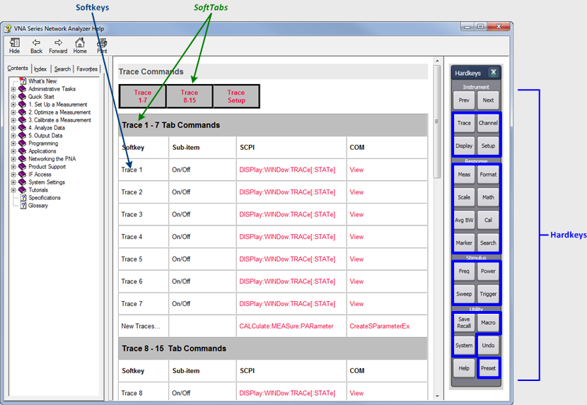
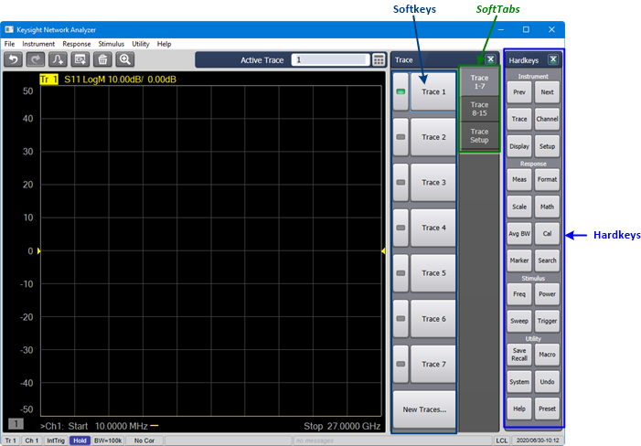

# Programming Guide

* * *

Finding Programming Commands

Use one of the following methods to find programming commands in the help:

Command Finder

SCPI Command Recorder

Simulated User Interface of Drop-down Menus

Command Tree

## Command Finder

From simulated User Interface: Hardkeys, SoftTabs, and Softkeys. Click on
[Command Finder](Command_Finder.md) to display the screen below. Clicking on
one of the Hardkeys shown in the online help screen opens the corresponding
SoftTab and Softkey menus and corresponding SCPI/COM commands. This is a
"mapping" of GUI functions to their corresponding SCPI/COM commands.

  
---  
  
## SCPI Command Recorder

[SCPI Command Recorder](SCPI_Recorder.md) The front panel operation will
record the corresponding SCPI commands.  
---  
  
## Simulated User Interface of Drop-down Menus

From a simulated User Interface of the drop-down menus: [File](FileTopic.md) | [Instrument](XTraceChanTopic.md) | [Response](XResponseTopic.md) | [Stimulus](XStimulusTopic.md) | [Utility](XUtilityTopic.md) | [Cal](CalTopic.md) | [Apps](MixerTopic.md) | [Remote ONLY](DataTopic.md)  
---  
  
## Command Tree

|  GPIB / SCPI |  COM  
---|---|---  
|  [Command Tree](GP-IB_Command_Finder/SCPI_Command_Tree.md) |  [COM Object Model](COM_Reference/Objects/The_Analyzer_Object_Model.md)  
See Also |  [Example Programs](GPIB_Example_Programs/SCPI_Example_Programs.md) |  [Example Programs](COM_Example_Programs/COM_Example_Intro.md)  
[Learning about SCPI](Learning_about_GPIB/Learning_about_GPIB.md) |  [Learning about COM](Learning_about_COM/Learning_about_COM.md)  
  
### See Also

  * [New Programming Commands](New_Programming_Commands.md)

  * [Remotely Specifying a Source Port](Remotely_Specifying_a_Source_Port.md)

  * [Shut Down or Restart the PNA Remotely](Learning_about_GPIB/Shut_Down_or_Restart_the_PNA_Remotely.md)

  * [Your Programs on Windows ](Your_Programs_on_Windows.md)

  * [LXI and VXI-11.3 Compliance](../S0_Start/LXI_Compliance.md)

  * [VEE Examples](VEE_Examples/VEE_Pro_Runtime.md) with runtime installed.

  * [Using Macros](Using_Macros.md)

  * Code Translator App.

  * [Superseded / Replacement Commands](Replacement_Commands.md)

  * [Data Access Map](DataMapSet.md)

