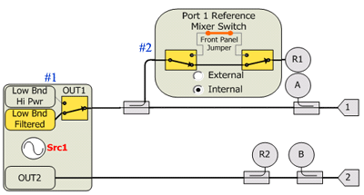
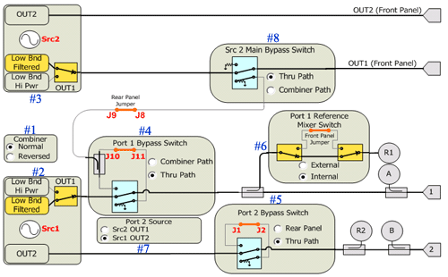
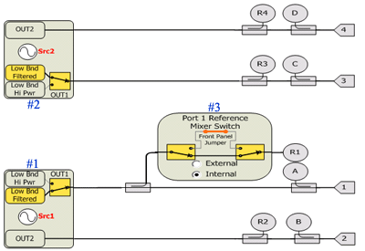
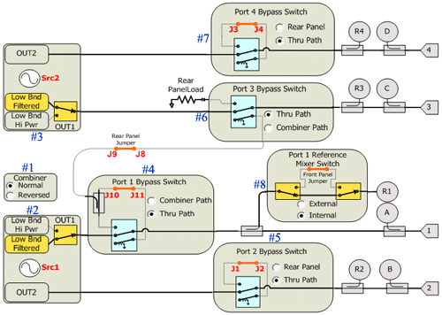
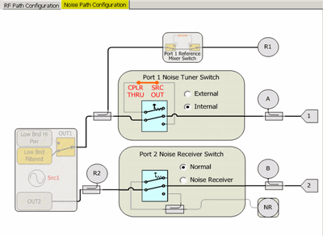
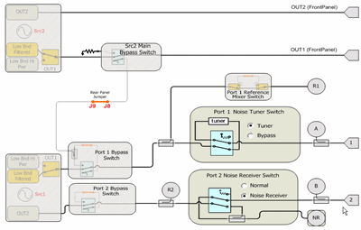

# RF Path Configuration Elements

* * *

The tables below show RF Path Configuration Elements for all PNA-X models and
options. These settings are provided for configuring the elements using SCPI
and COM commands.

  * [PNA-X Opt 423](RF_PathConfig.md#423)

  * [PNA-X Opt 224](RF_PathConfig.md#224)

  * [PNA-X Opt 201](RF_PathConfig.md#200)

  * [PNA-X Opt 401](RF_PathConfig.md#400)

  * PNA-X Opt 029

  *     * [26.5 GHz Noise Figure](RF_PathConfig.md#029)

    * [50 GHz Noise Figure](RF_PathConfig.md#50GHz)

### See Also

  * [IF Path Configuration Elements](../IFAccess/IF_Path_Configuration.md)

  * [COM commands](COM_Reference/Objects/PathConfiguration_Object.md)

  * [SCPI commands](GP-IB_Command_Finder/Sense/Path.md)

* * *

### PNA-X - 201 2 ports, single source

  
---  
Ref# |  Element Name |  Settings  
#1 |  "Src1Out1LowBand" |  "Filtered" "HiPwr"  
#2 |  "Port1RefMxr" |  "Internal" "External"  
Not shown |  "PortxCoupler" (SMC measurements only. [Learn more](../FreqOffset/FCA_Use.md#SweepTab).) |  "Normal" "Reversed"  
  
### PNA-X - 224 2 ports, add internal 2nd source, combiner & mechanical
switches

  
---  
Ref# |  Element Name |  Settings  
#1 |  "Combiner" This selection only draws connection lines. No switches are thrown. |  "Normal" "Reversed"  
#2 |  "Src1Out1LowBand" |  "Filtered" "HiPwr"  
#3 |  "Src2Out1LowBand" |  "Filtered" "HiPwr"  
#4 |  "Port1Bypass" |  "Thru" "Combiner"  
#5 |  "Port2Bypass" |  "Thru" "RearPanel"  
#6 |  "Port1RefMxr" |  "Internal" "External"  
#7 |  "Port2Src" This selection only draws connection lines. No switches are thrown. |  "Src1Out2" "Src2Out1"  
#8 |  "Src2Out1Bypass" Labeled: Src2 Main Bypass Switch |  "Thru" "Combiner"  
Not shown |  "Src1RearOut" (routes Src1 signal to J6 on rear panel) |  "Normal" "RFOut"  
Not shown |  "Src2RearOut" N5227A/47A only (routes Src2 signal to J12 on rear panel) |  "Normal" "RFOut"  
Not shown |  "PortxCoupler" (SMC measurements only. [Learn more](../FreqOffset/FCA_Use.md#SweepTab).) |  "Normal" "Reversed"  
  
### PNA-X - 401 4 ports, dual source

  
---  
Ref# |  Element Name |  Settings  
#1 |  "Src1Out1LowBand" |  "Filtered" "HiPwr"  
#2 |  "Src2Out1LowBand" |  "Filtered" "HiPwr"  
#3 |  "Port1RefMxr" |  "Internal" "External"  
Not shown |  "PortxCoupler" (SMC measurements only. [Learn more](../FreqOffset/FCA_Use.md#SweepTab).) |  "Normal" "Reversed"  
  
### PNA-X Opt 423 4 ports, add internal combiner & mechanical switches (also
second source)

  
---  
Ref# |  Element Name |  Settings  
#1 |  "Combiner" This selection only draws connection lines. No switches are thrown. |  "Normal" "Reversed"  
#2 |  "Src1Out1LowBand" |  "Filtered" "HiPwr"  
#3 |  "Src2Out1LowBand" |  "Filtered" "HiPwr"  
#4 |  "Port1Bypass" |  "Thru" "Combiner"  
#5 |  "Port2Bypass" |  "Thru" "RearPanel"  
#6 |  "Port3Bypass" |  "Thru" "Combiner"  
#7 |  "Port4Bypass" |  "Thru" "RearPanel"  
#8 |  "Port1RefMxr" |  "Internal" "External"  
Not shown |  "Port2Src" (Not shown in the above image) - See #7 in PNA-X - 224 This selection only draws connection lines. No switches are thrown. |  "Src1Out2" "Src2Out1"  
Not shown |  "Src1RearOut" (routes Src1 signal to J6 on rear panel) |  "Normal" "RFOut"  
Not shown |  "Src2RearOut" N5227A/47A only (routes Src2 signal to J12 on rear panel) |  "Normal" "RFOut"  
Not shown |  "PortxCoupler" (SMC measurements only. [Learn more](../FreqOffset/FCA_Use.md#SweepTab).) |  "Normal" "Reversed"  
  
### PNA-X Opt 029 - 26.5 GHz Models

  
---  
|  "Port1NoiseTuner" | 

  * "Internal"
  * "External"

  
|  "Port2NoiseReceiver" | 

  * "Normal"
  * "Noise"

  
  
### PNA-X Opt 029 - 50 GHz Models

  
---  
|  "Port1NoiseTuner" | 

  * "Tuner" (built-in)
  * "Bypass" (front-panel loops)

  
|  "Port2NoiseReceiver" | 

  * "Normal"
  * "Noise"

  
Change the impedance states of the built-in Noise Tuner. Choose from:  
|  "InternalNoiseTuner” | 

  * "Impedance1" (ECal Open)
  * "Impedance2" (ECal OffsetOpen)
  * "Impedance3" (ECal Short)
  * "Impedance4" (ECal OffsetShort1)
  * "Impedance5" (ECal OffsetShort2)
  * "Impedance6" (ECal OffsetShort3)
  * "Impedance7" (ECal Load)
  * "Thru" (ECal Thru)

  
  
* * *

