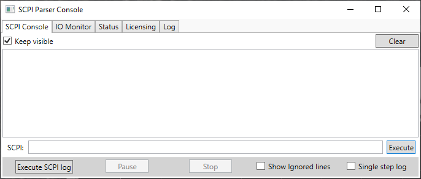
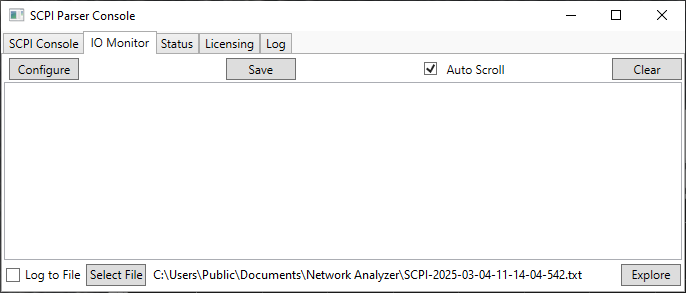
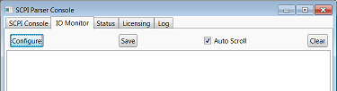
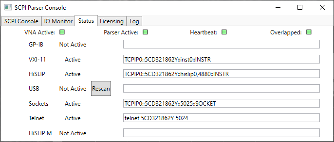
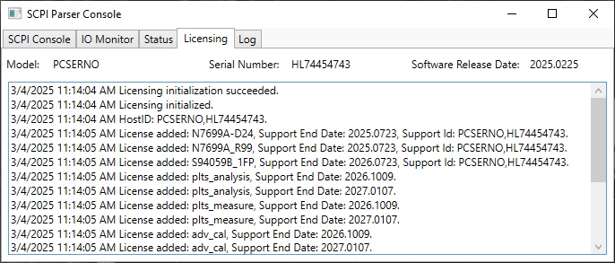
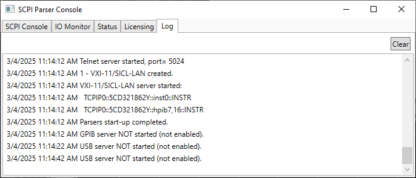

# SCPI Parser Console

* * *

The SCPI Parser Console window helps you monitor the VNA's remote interface.
You can send single SCPI/GPIB commands from the analyzer keyboard. This window
can also be used to capture the SCPI traffic used over HiSLIP.

  * Type a valid command, with appropriate arguments and press enter.

  * Use the arrow keys to recall previous commands.

See also:

  * [How to Configure for GPIB, SCPI, and SICL](Learning_about_GPIB/How_to_Configure_for_GPIB_SCPI_and_SICL.md)

  * [SCPI Recorder](SCPI_Recorder.md)

Tabs in this window include the following:

SCPI Console

IO Monitor

Status

Licensing

Log

#### Accessing the SCPI Parser Console  
  
---  
Using Hardkey/SoftTab/Softkey |  Using a mouse  
  
  1. Press System > System Setup > Remote Interface... > Click Show SCPI Parser Console checkbox.

|

  1. Click LCL in lower-right corner of front-panel display.
  2. Select SCPI Parser Console...

  
  
## SCPI Console

## IO Monitor

IO Monitor enables monitoring activity on the remote control.

Clicking on the Configure button accesses the IO Monitor Configuration dialog
to enable/disable this function.

Enabling the IO monitor provides detailed error message with debug
information.

Example of Error message:

  * On: -109, "Missing parameter; calc:par:def aaa<Err>

  * Off: -109, "Missing parameter"

Disabling the IO monitor increases measurement speed.

## Status

The Rescan button updates the status of the USB ports.

See also, [The VNA as a USB Device](Learning_about_GPIB/DeviceSide_USB.md).

## Licensing

## Log

* * *

