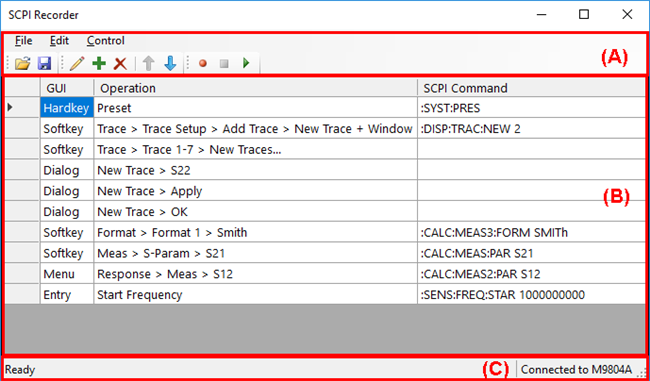
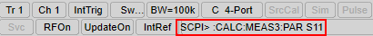

# SCPI Recorder

The SCPI command recorder allows you to get the corresponding SCPI commands
from your front panel operation. It helps you to know the required commands
without checking the command reference.

### How to execute SCPI Recorder  
  
---  
Using Hardkey/SoftTab/Softkey | Using a mouse  
  
  1. Press System > System Setup > SCPI Recorder...

|

  1. Click Utility Format. > System > System Setup > SCPI Recorder...

  
  
The following SCPI Recorder Panel is displayed.

#### Sample Operation

  1. Click  to start the recording.

  2. Operate your sequence.

  3. As the SCPI Recorder dialog box may be hidden behind the measurement window, put the SCPI Recorder dialog box at the front.

  4. Click  to stop the recording.

  5. Save the file as necessary.

## (A) Menu and Tool Icon

Menu | Commands | Icon | Description  
---|---|---|---  
File | Load File...  |  | Open the recording file with .vrec file extension  
Save File... |  | Save the recording file with .vrec file extension.  
Export Sequence... | - | Export the SCPI command list in a text format   
Exit | - | Exit the SCPI command recorder application  
Edit | Edit Command |  | Edit the command cell   
Add Row |  | Add a new row at the end of table  
Insert Row | - | Insert a new row above the active row  
Delete Row |  | Delete the active low  
Move Up |  | Move up the active row  
Move Down |  | Move down the active row  
Delete Blank Command Rows | - | Delete the rows which are blank in SCPI command column  
Clear Record | - | Clear the table  
Control | Record |  | Start the recording  
Stop  |  | Stop the recording and show the recorded commands in the log table  
Play |  | Play commands in the log table  
Display SCPI | - | When checked, a corresponding SCPI command is displayed on the message area during front panel operation. This function is available even when the recording is not turned on.   
  
## (B) Log Table

The recorded commands are listed in the log table.

Table shows these three column

GUI: Operation method from the front panel

Operation: Operation from Softkey, Entry, Menu, Dialog and Hardkey

SCPI Command: Corresponding SCPI command

Not all operation sequence is supported for recording. The following table
shows the supported operation and command. A blank is filled if the operation
is supported but SCPI command is not supported.

GUI | Operation  | SCPI Command  
---|---|---  
Softkey | Supported  | Supported (*2)  
Entry | Supported  | Partially Supported   
Menu from Menu bar | Supported  | Partially Supported   
Dialog  | Partially Supported  | Not Supported   
Hardkey  | Partially Supported (*1) | Partially Supported (*1)  
Tool bar button | Not Supported  | Not Supported   
Mouse (trace drag and drop, right-click menu and direct marker/trace operations) | Not Supported  | Not Supported   
  
(*1) Only for preset, marker and search hardkeys which can directly execute a
command.

(*2) Even if GUI shows the softkey, some softkey do not show the commands.
This is because there is no equivalent command.

As the softkey operation is fully supported, it is recommended to use softkey
if both Softkey and Dialog box are available for the same operation.

For example, use Sweep > Main > Sweep Type to select Sweep Type instead of
Sweep > Main > Sweep Setup... (dialog box).

## (C) Status Bar

Show the connection and current status such as Recording and Playing

* * *

* * *

