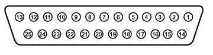
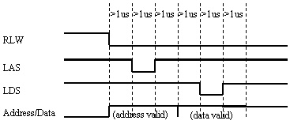
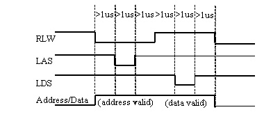

# **E** xternal Test Set I/O Connector

* * *

### **General Description**

This DB-25 female connector is used to control external test sets. The
external test set bus consists of 13 multiplexed address and data lines, three
control lines, and an open-collector interrupt line. The Test Set IO is not
compatible with the 8753 test sets.

You can change the settings on the External Test Set IO connector through
[SCPI](GP-IB_Command_Finder/Control.md) and
[COM](COM_Reference/Objects/HWExternalTestSetIO_Object.md) programming
commands. The settings are NOT accessible through the front-panel keys or
display menu.

Notes:

  * The External Test Set pin settings are NOT affected by [Instrument State Save/Recall](../S5_Output/SaveRecall.md#FileTypes) or [Instrument Preset.](../S1_Settings/Preset_the_Analyzer.md)

  * At VNA Power Up and return from Hibernation, the External Test Set bus data lines, address lines, and control lines are set HIGH, and no strobe lines are pulsed.

**Caution:** Do not mistake this connector with a Parallel Printer port. A
printer may be damaged if connected to this port.

[Other System Configuration Topics](../System/System_Topics.md)

**Pin** |  **Name** |  **Description**  
---|---|---  
1 |  [SEL0](TestSetIO_Connector.md#SEL0-SEL3) |  Test set select bit 0; tied to GND  
2 |  [Sweep Holdoff In](TestSetIO_Connector.md#Sweep) |  TTL input - state may be read with SCPI or COM command  
3 |  [AD12](TestSetIO_Connector.md#AD0-AD12) |  Address and latched data  
4 |  [AD10](TestSetIO_Connector.md#AD0-AD12) |  Address and latched data  
5 |  [AD9](TestSetIO_Connector.md#AD0-AD12) |  Address and latched data  
6 |  [AD8](TestSetIO_Connector.md#AD0-AD12) |  Address and latched data  
7 |  [GND](TestSetIO_Connector.md#GND) |  0V  
8 |  [LAS](TestSetIO_Connector.md#LAS) __ |  TTL output Low = Address Strobe  
9 |  [AD4](TestSetIO_Connector.md#AD0-AD12) |  Address and latched data  
10 |  [AD3](TestSetIO_Connector.md#AD0-AD12) |  Address and latched data  
11 |  [AD2](TestSetIO_Connector.md#AD0-AD12) |  Address and latched data  
12 |  [GND](TestSetIO_Connector.md#GND) |  0V  
13 |  Interrupt In |  TTL input - state may be read with a SCPI or COM command  
14 |  [No connect](TestSetIO_Connector.md#22V) |  **CAUTION** : Older VNAs have +22v on this line; this will damage a printer.  
15 |  [SEL1](TestSetIO_Connector.md#SEL0-SEL3) |  Test set select bit 1; tied to GND  
16 |  [SEL2](TestSetIO_Connector.md#SEL0-SEL3) |  Test set select bit 2; tied to GND  
17 |  [AD11](TestSetIO_Connector.md#AD0-AD12) |  Address and latched data  
18 |  [SEL3](TestSetIO_Connector.md#SEL0-SEL3) |  Test set select bit 3; tied to GND  
19 |  [AD7](TestSetIO_Connector.md#AD0-AD12) |  Address and latched data  
20 |  [AD6](TestSetIO_Connector.md#AD0-AD12) |  Address and latched data  
21 |  [AD5](TestSetIO_Connector.md#AD0-AD12) |  Address and latched data  
22 |  [AD0](TestSetIO_Connector.md#AD0-AD12) |  Address and latched data  
23 |  [AD1](TestSetIO_Connector.md#AD0-AD12) |  Address and latched data  
24 |  [LDS](TestSetIO_Connector.md#LDS) |  TTL output - active low data strobe  
25 |  [_RLW_](TestSetIO_Connector.md#RLW) |  TTL output - high-read, low write  
  
* * *

### **SEL0-SEL3 (pins 1,15,16,18)**

#### **Description**

Selects addresses of test sets that are "daisy chained" to this port. The
select code is set to zero at the VNA connector and is incremented by one as
it goes through each successive external test set. Therefore, the first test
set in the chain has address zero and so on, for up to 16 test sets.

#### **HW Details**

Connected to ground inside the VNA.

#### **Timing**

None

* * *

### **Sweep Holdoff In (pin 2)**

#### **Description**

Input line used by the test set for holding off a sweep. Holding off a sweep
is one way of introducing a delay that allows an external device to settle
before the VNA starts taking data. You must write a program that will query
the line and perform the delay. The program needs to query the line and keep
VNA from sweeping while the line remains low. When a subsequent query detects
that the line went high the program would then trigger the VNA to start the
sweep.

Use either Single or External trigger mode to control the VNA sweep.

#### **HW Details**

This pin has a series 215-ohms resistor followed by 4.7k-ohm pull-up and then
an "ABT" TTL buffered register.

#### **Timing**

This input is not latched by the VNA hardware. Therefore the input level must
be held at the desired state by the test set until it's read by your program.

* * *

### **AD0-AD12 (pins 3-6, 9-11, 17, 19-23)**

#### **Description**

Thirteen lines are used to output data addresses or input / output data.
Several [SCPI](GP-IB_Command_Finder/Control.md) and
[COM](COM_Reference/Objects/HWExternalTestSetIO_Object.md) commands are
available for reading and writing to these lines. You can choose to use
commands where the VNA provides the appropriate timing signals needed for
strobing the addresses and data. Or you can choose to control the timing
signal directly. The timing signals are RLW, LAS and LDS. If you decide to do
direct control refer to the corresponding SCPI and COM command details. Close
attention to detail is needed to insure the desired results.

After a write command, lines AD0-AD12 are left in the state they were
programmed. Default setting for Mode is Read / Input).

After a read command, lines AD0-AD12 are left in input mode. While in this
mode an external test set attached to the IO is free to set the level on each
line.

#### **HW Details**

Each of these I/O pins has a series 215-ohm resistor followed by 4.7k-ohm
pull-up resistor.

Write/Read is implemented by an output tri-state TTL buffer / latch for
latching and enabling write data in parallel with a TTL input buffer for
reading.

#### **Timing**

Output Address and data setup and hold times are 1us minimum.

Address & Data I/O Write

Address & Data I/O Read - Data must be valid for 1us before and after strobe

* * *

### **GND (pins 7, 12)**

#### **Description**

Two ground pins used as ground references by the test set.

#### **HW Details**

Connected to digital ground.

#### **Timing**

None.

* * *

### **LAS** _(Low Address Strobe)_ **(pin 8)**

#### **Description**

This line has two behaviors that are command dependent. Refer to the
[SCPI](GP-IB_Command_Finder/ControlExt.md) and
[COM](COM_Reference/Objects/HWExternalTestSetIO_Object.md) commands for
further details.

In one behavior LAS is one of the lines used by the VNA to provide appropriate
timing for writing Address and Data to the Test Set. In this case LAS is
controlled automatically by the VNA and is intended to be used as the strobe
for the Address. When LAS is low, lines AD0 - AD12 represent the Address. LAS
will return to its normally high state when the transaction is finished.

In the second behavior the VNA will NOT provide appropriate timing. In this
case LAS is controlled directly by the user through a [SCPI](GP-
IB_Command_Finder/ControlExt.htm) or
[COM](COM_Reference/Methods/WriteRaw_Method.md) command. When the transaction
is finished LAS is left set to the state it was programmed to until another
command changes it. (Default for LAS is TTL High).

#### **HW Details**

This output pin is driven by a TTL latched buffer with a series 215-ohm
resistor followed by 2.15k-ohm pull-up.

#### **Timing**

Strobe length, setup and hold times are all 1us minimum.

See the description for [AD0-AD12](TestSetIO_Connector.md#AD0-AD12) for more
timing information.

* * *

### **Interrupt In (pin 13)**

#### **Description**

Query this line with a [SCPI](GP-IB_Command_Finder/ControlExt.md#interrupt)
or [COM](COM_Reference/Properties/Interrupt_Property.md) command.

#### **HW Details**

This line is a non-latched TTL input, has series 215-ohms followed by
4.64k-ohm pullup.

#### **Timing**

The Test Set must maintain at the desired TTL level until its read.

* * *

### **(pin 14) No Connect** (**previously +22V** )

**WARNING** : Early versions of the VNA had +22v on this pin. Connecting a
printer to this port will usually damage the printer.

####

#### **Description**

+22V, 100mA max. The 25-pin D connector is the same as a computer parallel
printer port connector. Pin (14) corresponds to a printer's "autofeed" line.
Connecting a printer to this port will damage the printer if +22v is present
since printers requires less than 5V on all control lines.

#### **HW Details**

No connect

#### **Timing**

None

* * *

### **LDS** _(Low Data Strobe)_ **(pin 24)**

#### **Description**

This line has two behaviors that are command dependent. Refer to the External
Test Set IO SCPI and COM commands for further details. (Default setting for
LDS is TTL High)

In one behavior LDS is one of lines used by the VNA to provide appropriate
timing for writing Address and Data to the Test Set. In this case LDS is
controlled automatically by the VNA and is intended to be used as the strobe
for the Data. When LDS is low, lines AD0 - AD12 represents Data. LDS will
return to its normally high state when the transaction is finished.

In the second behavior the VNA will NOT provide appropriate timing. In this
case LDS is controlled directly by the user through a SCPI or COM command.
When the transaction is finished the LDS is left set to the state it was
programmed to.

#### **HW Details**

This output pin is driven by a TTL latched buffer with a series 215-ohm
resistor followed by 2.15k-ohm pull-up.

#### **Timing**

Strobe length, setup and hold times are all 1us minimum.

See the description for [AD0-AD12](TestSetIO_Connector.md#AD0-AD12) for more
timing information.

* * *

### **RLW (pin 25)**

#### **Description**

This line is the output for the Read Write signal. It has two behaviors that
are command dependent. Refer to the External Test Set IO SCPI and COM commands
for further details. (Default setting for RLW is TTL High)

In one behavior RWL is controlled automatically by the VNA during a Read Write
operation. When RLW is low, lines AD0 - AD12 represent output Data. When RLW
is high, the lines represent input Data.

In the second behavior the VNA does NOT provide the timing. The user must
control it directly through the SCPI or COM command. In this case the line is
left set to the state it was programmed to.

####  **HW Details**

This pin is a TTL latched output with a series 215-ohm resistor followed by
2.15k-ohm pull-up resistor.

#### **Timing**

Strobe length, setup and hold times are all 1us minimum.

See the description for [AD0-AD12](TestSetIO_Connector.md#AD0-AD12) for more
timing information.

* * *

