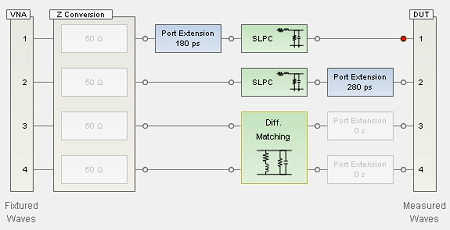

# Using Fixture Simulator

Fixture simulator allows user to mathematically add (embed) or remove (de-
embed) circuits to, or from, the measurements. Learn more on [Fixture
Simulator](../S3_Cals/Fixture_Simulator.htm).

In the new fixture generator with the firmware A.14.40 and above, multiple
fixturing elements can be combined in any order, creating infinite
combinations. New SCPIs are created with the concept of fixture “blocks’ or
“circuits”.

In the legacy fixturing, a few specific features are tied to specific ports.

### See Also

  * Programming examples:

    * [Create fixturing function (impedance conversion and port matching)](GPIB_Example_Programs/creating_fixture_with_fixture_simulator.md)

    * [Create fixturing function (2-port deembed, port extension, port matching, impedance conversion)](GPIB_Example_Programs/Create_fixturing_function_2-port_deembed%2c_port_extension%2c_port_matching%2c_impedance_conversion.md)

    * [Create fixuring function (port impedance conversion and port extension)](GPIB_Example_Programs/Create_fixuring_function__example_2.md)

## Concepts

There are two important concepts:

  1. Fixtures are built from right to left, the circuit elements are added from right to left. There is no way to insert a block to the right of already existing blocks. And unlike legacy commands, there is not one SCPI command to change the order of the features. Instead, the blocks must be created in the order desired.

Example of a fixture:

When building a fixture, the circuit elements are added from right to left. So
in this example, the S2P blocks are added first, and then the S4P blocks.

Note: These blocks always exist and user cannot create them. In order to move
them to the appropriate place in the fixture, first create the fixture
elements to the right, then send the
[“calc:fsim:draft:extension:port[n]:end”](GP-
IB_Command_Finder/Calculate/FSimulatorDraft.htm#ExtPortEnd) command to move
the port extension to the left-most side of the circuit sections. If more
fixture elements are desired to be added to the left of the port extensions,
create them after the [“calc:fsim:draft:extension:port[n]:end”](GP-
IB_Command_Finder/Calculate/FSimulatorDraft.htm#ExtPortEnd) command is sent.

  2. Fixture elements are built on a “draft” fixture and then “applied”. The process should be:

  1. First “discard” the draft fixture changes with [CALC:FSIM:DRAFt:DISCard](GP-IB_Command_Finder/Calculate/FSimulatorDraft.md#Discard) command. This copies the active fixture to the draft fixture.

  2. Then build fixture using new [Fsimulator Draft SCPI commands.](GP-IB_Command_Finder/Calculate/FSimulatorDraft.md)

  3. Lastly “apply” the draft fixture with [CALC:FSIM:APPLy](GP-IB_Command_Finder/Calculate/FSimulatorActive.md#APPLy). This does a fixture computation (to ensure validity) and then the fixture is copied to the active fixture in the channel.

## New SCPI commands

  * [Fsimulator Draft SCPI commands, CALC:FSIM:DRAFt:XXX:YYY:ZZZ](GP-IB_Command_Finder/Calculate/FSimulatorDraft.md) : These commands are used to query and set fixture values on a scratch fixture.

  * [Fsimulator Active SCPI commands, CALC:FSIM:XXX:YYY:ZZZ](GP-IB_Command_Finder/Calculate/FSimulatorActive.md) : These commands are used to query ONLY fixture values on the active fixture. 

  * The only exceptions to these commands are: 

  1. [CALC:FSIM:APPLy](GP-IB_Command_Finder/Calculate/FSimulatorActive.md#APPLy) which is same as legacy command

  2. [CALC:FSIM:POWer:PORT:COMPensate](GP-IB_Command_Finder/Calculate/FSimulatorActive.md#PowPortComp) commands because they are not fixture _building_ commands, but rather specify if the fixture is being used in the channel (and how).

  * [CALC:FSIM:APPLy](GP-IB_Command_Finder/Calculate/FSimulatorActive.md#APPLy): Validate scratch fixture, copy to active fixture

  * [CALC:FSIM:DRAFt:DISCard](GP-IB_Command_Finder/Calculate/FSimulatorDraft.md#Discard): Discard scratch fixture changes by copying active fixture to scratch fixture.

  * CALC:FSIM:RESet: Preset the fixture.

Notes

  * Legacy SCPI commands will continue to work, but they are incompatible with the new features. There will be an error if legacy SCPI commands are sent **after** new SCPI commands are sent or and/or **after** the new GUI is used to build the fixture.
  * Blocks are created by default as "de-embed". User must send the [CALC:FSIM:DRAFt:CIRCuit[n]:EMBED:TYPE embed](GP-IB_Command_Finder/Calculate/FSimulatorDraft.md#CircEmbedType) command to switch to "embed" type.
  * In many cases, « CALC:FSIM:DRAF:CIRC » can replace the legacy-specific SCPI such as « CALC:FSIM:SEND:DEEM:PORT », but it is recommended to read the SCPI documentation linked above.
  * To verify that the fixture has been properly created using SCPI, you can visualize the entire fixture by using the new Fixture GUI. Learn more about the [Fixture generator dialog box](../S3_Cals/Fixture_Simulator.md#FGMain).
  * User also can create .topo or .snp file by GUI, and recall the file from SCPI. Learn more on [Fixture generator dialog box](../S3_Cals/Fixture_Simulator.md#FGMain).

  
---  
  
#### Simple Sample Program

:CALC1:FSIM:DRAFT:DISCard

! Port Matching for port 1

:CALC1:FSIM:DRAFt:CIRCuit1:ADD SLPC,2

:CALC1:FSIM:DRAFt:CIRCuit1:VNA:PORTs 1

:CALC1:FSIM:DRAFt:CIRCuit1:EMBED:TYPE EMBED

:CALC1:FSIM:DRAFt:CIRCuit1:STATe ON

:CALC1:FSIM:DRAFt:CIRCuit1:PAR:L 3E-9

:CALC1:FSIM:DRAFt:CIRCuit1:PAR:R 0

:CALC1:FSIM:DRAFt:CIRCuit1:PAR:C 0

:CALC1:FSIM:DRAFt:CIRCuit1:PAR:G 0

! Port Matching for port 2

:CALC1:FSIM:DRAFt:CIRCuit2:ADD SLPC,2

:CALC1:FSIM:DRAFt:CIRCuit2:VNA:PORTs 2

:CALC1:FSIM:DRAFt:CIRCuit2:EMBED:TYPE EMBED

:CALC1:FSIM:DRAFt:CIRCuit2:STATe ON

:CALC1:FSIM:DRAFt:CIRCuit2:PAR:L 2E-9

:CALC1:FSIM:DRAFt:CIRCuit2:PAR:R 0

:CALC1:FSIM:DRAFt:CIRCuit2:PAR:C 0

:CALC1:FSIM:DRAFt:CIRCuit2:PAR:G 0

! Diff. Matching for ports 3 and 4

:CALC1:FSIM:DRAFt:CIRCuit3:ADD D4PMatching,4

:CALC1:FSIM:DRAFt:CIRCuit3:VNA:PORTs 3,4

:CALC1:FSIM:DRAFt:CIRCuit3:EMBED:TYPE EMBED

:CALC1:FSIM:DRAFt:CIRCuit3:STATe ON

:CALC1:FSIM:DRAFt:CIRCuit3:PAR:L 2E-9

:CALC1:FSIM:DRAFt:CIRCuit3:PAR:R 1E-4

:CALC1:FSIM:DRAFt:CIRCuit3:PAR:C 5E-9

:CALC1:FSIM:DRAFt:CIRCuit3:PAR:G 0

! Port Extension

:CALC1:FSIM:DRAFt:EXTension:PORT1:DELay 180E-12

:CALC1:FSIM:DRAFt:EXTension:PORT1:STATe ON

:CALC1:FSIM:DRAFt:EXTension:PORT1:END ' This command should be executed after
adding all other blocks. Because adding a block resets the port extension
block position.

:CALC1:FSIM:DRAFt:EXTension:PORT2:DELay 280E-12

:CALC1:FSIM:DRAFt:EXTension:PORT2:STATe ON

:CALC1:FSIM:DRAFt:SECTion:EXTension:ENABle ON

! Apply the circuit from draft to active.

:CALC1:FSIM:APPLY

:CALC1:FSIM:STATe ON

* * *

