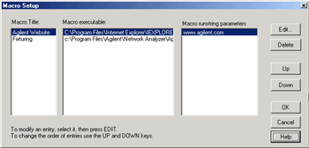
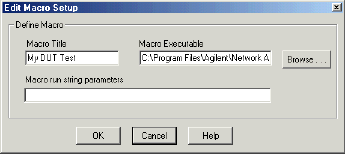

# Using Macros

* * *

Macros are executable programs that you write, load into the analyzer, and
then run from the analyzer. You can have up to 25 macros set up to run on the
analyzer.

  * [How to Setup Macros](Using_Macros.md#HowToSetup)

  * [How to Run Macros](Using_Macros.md#HowToRun)

  * [Macro Example](Using_Macros.md#example)

### How to Setup Macros  
  
---  
Using Hardkey/SoftTab/Softkey  
  
  1. Press Macro > Key Setup > Macro Setup....

  
In the Macro Setup dialog box:

  1. Create an executable program and save it on the VNA hard drive. See [SCPI](GPIB_Example_Programs/SCPI_Example_Programs.md) or [COM](COM_Example_Programs/COM_Example_Intro.md) example programs in VBscript.
  2. Use a mouse or the front-panel 'down-arrow' to select a blank line below the last entry. (There may be NO entry.)
  3. Click Edit to start the [Edit Macro Setup](Using_Macros.md#Edit) dialog.
  4. In the Macro Title box, type a descriptive title for your macro.
  5. Click Browse.
  6. Change Files of Type.
  7. Find and select your executable file. Change Files of Type if necessary.
  8. Click OK on the Edit Macro Setup dialog.
  9. Click OK on the Macro Setup dialog.
  10. Press macro to run. It may be necessary to first Preset the VNA to see your macro in the menu.

  
  
Macro Setup dialog box help  
---  
 Macro setup allows you to create up
to 25 macros that can be launched from the VNA application. An external
keyboard is required to enter the Macro Title and the Run string parameters.
To add a Macro, use a mouse or the front-panel 'down arrow' (NOT the 'Down'
key) to select a blank line. Then click Edit. Macro Title Shows the titles
that appear in the softkeys and menu when you press the Macro key. These
titles are associated with the executable files and should be descriptive so
you can easily identify them. Macro Executable Lists the complete path to the
executable file. To follow the example of launching the Keysight VNA Series
Home Page, the path to the executable could be "C:\Program Files(x86)\Internet
Explorer\iexplore.exe. Macro Runstring Parameters Lists the parameters that
get passed to the program that is referenced in the executable file. Again
following the example of launching the VNA Series Home Page, you could assign
the runstring parameters "http://www.Keysight.com/find/pna". Edit Invokes the
[Macro Edit dialog box](Using_Macros.md#Edit). Delete Deletes the selected
macro. Up Allows you to reorder the macros, moving the selected macro up one
line. This order determines how they appear in the VNA Menu and in the
softkeys and when you press the Macro front-panel key. Down Moves the
selection down one line in the list of macros.  
  
Macro Edit dialog box help  
---  
 Macro Title Add a title that appears
in the softkeys and menu. Macro Executable Set the complete path to the macro
executable file. Click Browse to navigate to the macro executable file and
establish the complete path to the file. Macro run string parameters
Optionally add parameters that are passed to the program referenced in the
executable file. [See Macro Setup dialog box](Using_Macros.md#Setup)  
  
### How to Run Macros  
  
---  
Using Hardkey/SoftTab/Softkey  
  
  1. Press Macro > Macro<#>.

  
  
Macro Example

The following is an example Visual Basic Scripting (vbs) program that you can
copy, install, and run on your VNA.

Note: Print these instructions if viewing in the analyzer. This topic will be
covered by the Macro Setup dialog box.

  1. Copy the following code into a Notepad file.

  2. Save the file on the analyzer hard drive in the C:/Documents folder. Name the file FilterTest.vbs

  3. Close Notepad

  4. [Setup the macro in the VNA](Using_Macros.md#HowToSetup)

  5. [Run the macro](Using_Macros.md#HowToRun)

Notepad is a text editor that is installed on all PCs that use a Microsoft
Operating system. To launch Notepad on the analyzer:

  1. Click View, then click Title Bars

  2. Click the Start button on the windows taskbar

  3. Point to Programs, Accessories.

  4. Click Notepad

'Start copying here  
'This program creates a S21 measurement  
'It is written in VBscript using SCPI commands  
  
Dim app  
Dim scpi  
'Create / Get the VNA application  
Set app = CreateObject ("AgilentPNA835x.Application")  
Set scpi = app.ScpiStringParser  
  
'Preset the Analyzer.FPREset presets the setting and deletes all traces and
windows  
scpi.Execute ("SYST:FPReset")  
'Create and turn on window 1  
scpi.Execute ("DISPlay:WINDow1:STATE ON")  
'Define a measurement name, parameter  
scpi.Execute ("CALCulate:PARameter:DEFine:EXT 'MyMeas', 's21'")  
'Associate ("FEED") the measurement name ('MyMeas') to WINDow (1), and give
the new TRACE a number (1).  
scpi.Execute ("DISPlay:WINDow1:TRACe1:FEED 'MyMeas'")  
  
  
'End copying here

* * *

