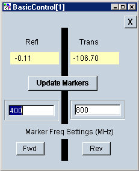

# Basic Control using VEE

* * *

This VEE Pro 6.0 example does the following:

  * Controls VNA windows and traces.

  * Changes stimulus settings.

  * Measures all four S parameters.

  * Create markers and displays marker readout.

If this Help file is on a VNA and [VEE Pro RunTime is
installed](VEE_Pro_Runtime.htm), then:

  1. [Run the BasicControl.vxe example](../../assets/misc/Programming/VEE_Examples/BasicControl.vxe)

  2. Then click Open on the following dialog box to run the program.

Otherwise, you can modify the example program using VEE, [save the VEE
BasicControl.vee](../../assets/misc/Programming/VEE_Examples/BasicControl.vee)

[Learn how to run this program as a Macro on the
VNA](../Using_Macros.htm#HowToSetup).

* * *

The following dialog box will be visible on the VNA when the example program
is running.

  * Click Fwd to activate the Forward (S11 and S21) measurements.

  * Click Rev to activate the Reverse (S22 and S12) measurements.

  * Click Update Markers to sweep the VNA.

  * Type values to change Marker Frequencies.

* * *

