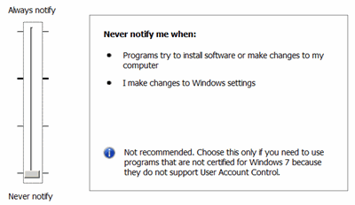

# Your Programs on Windows

* * *

### Programs that run on Workstations

If your program is running on a separate workstation and talking to the VNA
using SCPI or DCOM, you may encounter problems when your program saves data to
the root directory of the VNA HDD. This is because of User Account Control
(UAC), a new security model with Windows 10.

In the UAC default security setting, programs will not be able to save files
to the root folder of the VNA. Try changing the UAC setting to the lowest
security level. If it runs, but it is not acceptable to rewrite the program,
then leave the UAC in this setting. The VNA software runs with UAC on either
of these settings.

To access UAC settings for Windows 10:

  1. Minimize the VNA application
  2. Click the Type here to search icon
  3. In the Type here to search text field, type UAC

  
---  
Default setting |    
Lowest security setting |    
  
### Programs that run on the VNA

The following issues relate to problems that may occur when you install and
run your programs on the VNA. Most programs that run in Windows XP will run
without changes on Windows 10. However, there are differences between the two
operating systems that could break more complicated programs. These
incompatibilities are the same issues that software developers deal with on
personal computers.

32-bit Programs

If your 32-bit program is saving files, Windows will redirect memory access to
correct for different file locations. If problems occur, the path locations
may need to be modified. [See new path
locations](../S0_Start/Windows_File_Locations.htm).

16-bit Programs

On Windows XP, there was a compatibility layer for 16-bit programs. This
compatibility layer has been removed. So, your very old 16-bit programs will
no longer be able to run on the VNA.

### Special note about .NET applications with 64-bit Windows

In Visual Studio 2008 and earlier, the default .NET platform target was
AnyCPU. On Windows 10 64-bit, .NET applications that are written against the
"AnyCPU" platform will compile down to a native 64-bit application. This can
cause odd failures in your code as you will not be able to load any 3rd party
libraries that are 32-bit only. You should always be compiling .NET
applications as the "x86" platform. Starting with Visual Studio 2010, the
default platform was changed to x86.

* * *

