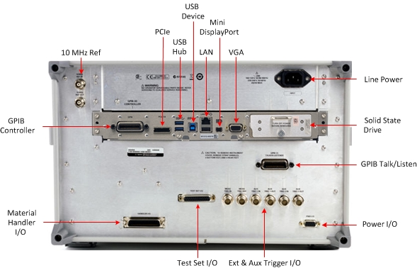
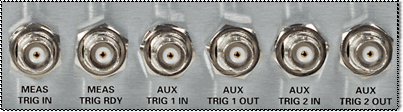

# N523xB Rear Panel

* * *

Click Image to learn more.

Note: For CPU 9.0 information, refer to [PNA-X and N522xB Rear
Panel](XRtour.htm).

### See Also

[PNA-X and N522xB rear-panel.](XRtour.md)

[N523xB Models and Options](../Support/Configurations.md)

* * *

### 10 MHz Reference IN/OUT

10 MHz Reference Input When a 10 MHz external reference signal is detected at
this port, it will be used as the instrument frequency reference instead of
the internal frequency reference.

10 MHz Reference Output This BNC(f) connector outputs a frequency reference
signal for use by other test equipment.

  * See [SCPI](../Programming/GP-IB_Command_Finder/Sense/Roscillator.md) command that detects an external reference signal at this connector.

  * [See Specifications](../Specs/ManualChoice.md)

* * *

### VGA Connector [Learn more](VGA_Output.md)

* * *

### USB Hub

This USB hub contains two SuperSpeed USB ports to power your VNA peripherals.
There is also one USB port below the LAN connector, on USB device port, and
four USB ports on the front panel.

Limitation: The total power consumption for all eight USB ports is limited to
4.0 amps. If this limit is exceeded, all USB ports are disabled until a device
is removed and power consumption falls below the limit. The total current
limit for all rear panel USB ports is 2.3 amps. The total current limit for
all front panel USB ports is 2 amps. When first connected, Keysight ECal
modules 8509x and N4431 draw significantly more current than other modules.
[See Specifications](../Specs/ManualChoice.md).

[See Important First-time USB connection
note](../Front_Panel/XTour.htm#FirstTimeNote).

* * *

### USB Device [Learn
more](../Programming/Learning_about_GPIB/DeviceSide_USB.htm)

* * *

### LAN Connector

This 10/100/1000 BaseT Ethernet connection has a standard 8-pin configuration
and auto selects between the two data rates.

* * *

### Mini DisplayPort Connector

The Mini DisplayPort is a miniature DisplayPort connector for connection to
external displays.

* * *

### Line Power

[See Specifications](../Specs/ManualChoice.md)

* * *

### GPIB Controller and Talker/Listener Ports

The N523x can be a GPIB Controller and Talker/Listener. [Learn
more.](../Programming/Learning_about_GPIB/How_to_Configure_for_GPIB_SCPI_and_SICL.htm)

* * *

### PCIe X4 Connector

The PCIe X4 connector is a 4-lane slot for future enhancements.

* * *

### External and AUX Trigger I/O

  
---  
MEAS TRIG IN \- When enabled, VNA is triggered by signals on this connector.
[Learn more.](../S1_Settings/External_Triggering.md#ExternalDiag)  
MEAS TRIG RDY When enabled, VNA outputs a 'READY' signal on this connector to
other devices. [Learn
more.](../S1_Settings/External_Triggering.htm#ExternalDiag)  
AUX TRIG 1&2 IN When enabled, VNA accepts signals on these connectors which
indicates that the external devices is ready to be triggered. [Learn
more.](../S1_Settings/External_Triggering.htm#AuxTrigDiag)  
AUX TRIG 1&2 OUT When enabled, VNA outputs signals on these connectors either
before or after a measurement. [Learn
more.](../S1_Settings/External_Triggering.htm#AuxTrigDiag)  
  
### Test Set I/O

[See Details](../Programming/TestSetIO_Connector.md)

* * *

### Material Handler I/O

[See details.](../Programming/HandlerIO_Connector.md)

* * *

### CPU

See [CPU Speed / Performance](../S0_Start/ComputerProperties.md#cpu)

See [Determine Your VNA's CPU
Version](http://na.support.keysight.com/pna/cputype.html) (Internet connection
required)

* * *

### Solid State Drive (SSD)

See [Service Guide](http://na.support.keysight.com/pna/documents.html) to
learn how to remove the SSD. (Internet connection required)

See Preventing VNA SSD Problems

* * *

