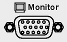

## Video Graphics Adapter (VGA) Output Connector

* * *

 |  This 15-pin female D-sub connector allows connection of external VGA monitors. With the following resolution settings, you can simultaneously view the VNA display and a remote monitor. [See Rear Panel](XRtour.md)  
---|---  
|  External Device |  Resolution  
---|---  
Flat Panel (TFT) |  1024x768, 800x600, 640x480  
Flat Panel (DSTN) |  800x600, 640x480  
CRT Monitor |  1280x1024, 1024x768, 800x600, 640x480  
  
### How to turn ON an external monitor

1\. [Minimize the VNA
application.](../S1_Settings/Customize_Your_Analyzer_Screen.htm#Minimize)  
---  
2\. Click Start -> Control Panel -> Hardware and Sound -> Display.  
3\. Under Multiple displays select Duplicate desktop on 1 and 2.  
4\. Click OK, then OK again to confirm.  
  
### How to view both the VNA screen and the external monitor

The VNA must be set to the default resolution (640 x 480). While on any other
resolution setting, only the external monitor can be viewed. To change
resolution:

  1. [Minimize the VNA application.](../S1_Settings/Customize_Your_Analyzer_Screen.md#Minimize)

  2. Right-click on the VNA desktop, then click Screen resolution.

  3. Adjust display resolution.

* * *

