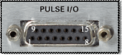
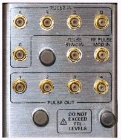

## Pulse I/O Connector

* * *

The models offer the 15 pin D connector provides access to Pulse Modulators
and Generators.

  * [See IF Path Configuration Dialog and block diagram](../IFAccess/IF_Path_Configuration.md), which includes the Pulse Modulators and Generators.

  * See the Integrated Pulsed Application

Pin |  Name |  Description  
---|---|---  
1 |  IFGateAIn |  IF pulse gate input A (TTL)  
2 |  IFGateBIn |  IF pulse gate input B (TTL)  
3 |  IFGateCIn |  IF pulse gate input C (TTL)  
4 |  IFGateDIn |  IF pulse gate input D (TTL)  
5 |  IFGateRIn |  IF pulse gate input R (TTL)  
6 |  DCOM |  Ground  
7 |  PulseSyncIn |  Pulse gen. synchronization trigger input (TTL)  
8 |  RFPulseModIn |  RF source pulse modulation drive input (TTL)  
9 |  DCOM |  Ground  
10 |  Pulse1Out |  Hardwired pulse train output #1 (TTL)  
11 |  Pulse2Out |  Hardwired pulse train output #2 (TTL)  
12 |  Pulse3Out |  Hardwired pulse train output #3 (TTL)  
13 |  Pulse4Out |  Hardwired pulse train output #4 (TTL)  
14 |  N.C. |  No connect -- for future use  
15 |  DCOM |  Ground  
  
See Pulse [SCPI](../Programming/GP-IB_Command_Finder/Sense/XSensIF.md) and
[COM](../Programming/COM_Reference/Objects/SignalProcessingModuleFour_Object.md)
commands

### N1966A Pulse I/O Adapter

This D connector to RF adapter makes accessing the Pulse I/O connector more
convenient.

* * *

