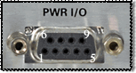

## Power I/O Connector

* * *

The 9-pin D connector replaces much of the functionality of the AUX I/O
connector on older VNA models. [See Rear Panel](XRtour.md)

Pin | Name | Description  
---|---|---  
1 | +15V | +15V @ 750 mA (peak surge 1000 mA)  
2 | -15V | -15V @ 750 mA (peak surge 1000 mA)  
3 | AnalogOut1 | Controlled from the [DC Source Control dialog](../S1_Settings/DC_Control.md). Analog Output Voltage Programmable +/-10V @100 mA out Nominally 0 ohms 2.44mV typical resolution 1MHz BW Read and write voltage programmatically using:

  * [CONT:AUX:OUTP1:VOLT](../Programming/GP-IB_Command_Finder/ControlAux.md#output) (SCPI - read and write)
  * [get OutputVoltage Method](../Programming/COM_Reference/Methods/get_OutputVoltage_Method.md) (COM - read)
  * [put OutputVoltage Method](../Programming/COM_Reference/Methods/put_OutputVoltage_Method.md) (COM - write)

  
4 | AnalogOut2 | Controlled from the [DC Source Control dialog](../S1_Settings/DC_Control.md). Analog Output Voltage Programmable +/-10V @100 mA out Nominally 0 ohms 2.44mV typical resolution 1MHz BW Read and write voltage programmatically using:

  * [CONT:AUX:OUTP2:VOLT](../Programming/GP-IB_Command_Finder/ControlAux.md#output) (SCPI - read and write)
  * [get OutputVoltage Method](../Programming/COM_Reference/Methods/get_OutputVoltage_Method.md) (COM - read)
  * [put OutputVoltage Method](../Programming/COM_Reference/Methods/put_OutputVoltage_Method.md) (COM - write)

  
5 | ACOM | System ground  
6 | GndSense | Ground sense for Analog In & Out Connected with 51.1-ohm to ACOM Read voltage programmatically using:

  * [InputVoltageEX Property](../Programming/COM_Reference/Properties/InputVoltageEX_Property.md) (COM)
  * [CONT:AUX:OUTP3:VOLT](../Programming/GP-IB_Command_Finder/ControlAux.md#output) (SCPI)

  
7 | AnalogIn1 | Analog input: +/-10V @ 1.22mV typical resolution Rin >1 M-ohm BW ~ 1 MHz ADC conversion time < 1 us typical Read voltage programmatically using:

  * [CONT:AUX:INP1:VOLT](../Programming/GP-IB_Command_Finder/ControlAux.md#input) (SCPI)
  * [InputVoltageEX Property](../Programming/COM_Reference/Properties/InputVoltageEX_Property.md) (COM)

Voltages on this pin can also be read using ADC receiver measurements. [Learn
more.](../S1_Settings/ADC_Measurements.htm)  
8 | AnalogIn2 | Analog input: +/-10V @ 1.22mV typical resolution Rin >1 M-ohm BW ~ 1 MHz ADC conversion time < 1 us typical Read voltage programmatically using:

  * [CONT:AUX:INP2:VOLT](../Programming/GP-IB_Command_Finder/ControlAux.md#input) (SCPI)
  * [InputVoltageEX Property](../Programming/COM_Reference/Properties/InputVoltageEX_Property.md) (COM)

Voltages on this pin can also be read using ADC receiver measurements. [Learn
more.](../S1_Settings/ADC_Measurements.htm)  
9 | Power Button | Open collector input Active low replicates power button key press.  
  
* * *

