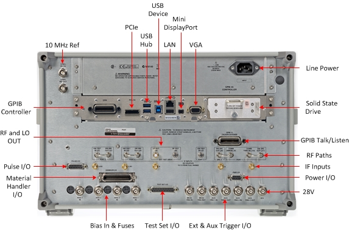
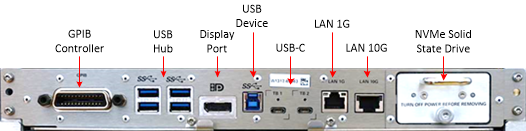
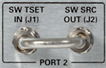
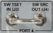
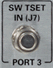
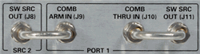
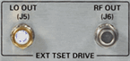
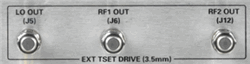
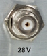
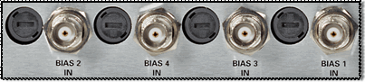

# PNA-X and N522xB Rear Panel

* * *

See [Differences between the PNA-X and N522xB
Models](../Support/Configurations.htm#N522x)

See [N523xB rear-panel](N523xRP.md).

Click image to learn more.

* * *

## CPU Version 9.0

* * *

## CPU Version 7.0/8.0/9.0 Connector Reference

The following table shows the connectors for CPU versions 7.0, 8.0, and 9.0:

Connector Name |  CPU 7.0, 8.0 |  CPU 9.0  
---|---|---  
VGA |  Yes |  No  
Display Port Mini |  Yes |  No  
Display Port |  No |  Yes  
1GB LAN |  Yes |  Yes  
10GB LAN |  No |  Yes  
GPIB |  Yes |  Yes  
USB3 (rear panel) |  2 Ports |  4 Ports  
USB2 (rear panel) |  1 Port |  0 Ports  
USB-B 3.0 Device Side |  Yes |  Yes  
USB-C (USB 3.1/Thunderbolt) |  No |  Yes  
PCIe |  Yes |  No  
SATA 2.5 SSD |  Yes |  No  
NVMe SSD |  No |  Yes  
  
* * *

### 10 MHz Reference IN/OUT

10 MHz Reference Input When a 10 MHz external reference signal is detected at
this port, it will be used as the instrument frequency reference instead of
the internal frequency reference.

10 MHz Reference Output This BNC(f) connector outputs a frequency reference
signal for use by other test equipment.

  *     * Press Setup > Internal Hardware > Reference... to switch external/internal reference.

    * From SCPI, use [SENS:ROSC:SOUR](../Programming/GP-IB_Command_Finder/Sense/Roscillator.md)

[See Specifications](../Specs/ManualChoice.md)

[See Reference](../S1_Settings/Reference.md)

* * *

### Line Power

[See Specifications](../Specs/ManualChoice.md)

* * *

### SRC3 Connector

Provides a synthesizer output from 10 MHz to 13.5 GHz ([Option
XSB](../Support/Configurations.htm#XSB)) and also requires Option 422 or 423.

### GPIB Controller and Talker/Listener Ports

The PNA-X can be a GPIB Controller and Talker/Listener. [Learn
more.](../Programming/Learning_about_GPIB/How_to_Configure_for_GPIB_SCPI_and_SICL.htm)

* * *

### PCIe X4 Connector (CPU 8.0, 7.0)

The PCIe X4 connector is a 4-lane slot for future enhancements.

* * *

### USB Hub

This USB hub contains two SuperSpeed USB ports to power your VNA peripherals.
There is also one USB port below the LAN connector, one USB device port, and
four USB ports on the [front panel.](../Front_Panel/XTour.md)

Limitation: The total current limit for all rear panel USB ports is 2.3 amps.
The total current limit for all front panel USB ports is 2 amps. When first
connected, Keysight ECal modules 8509x and N4431 draw significantly more
current than other modules. [See Specifications](../Specs/ManualChoice.md).

#### PNA with CPU Version 9.0

This USB hub contains four SuperSpeed USB ports to power your VNA peripherals.
There is also one USB device port, and four USB ports on the [front
panel.](../Front_Panel/XTour.htm) The CPU 9.0 provides a total current limit
on the four USB-3.0 ports of **3.6** amps.

[See Important First-time USB connection
note](../Front_Panel/XTour.htm#FirstTimeNote).

* * *

### Display Port (CPU 9.0)

The Display Port is used to connect to external displays and replaces the VGA
connector.

* * *

### USB Device [Learn
more](../Programming/Learning_about_GPIB/DeviceSide_USB.htm)

* * *

### USB-C Connectors (CPU 9.0)

Two USB-C connectors with support for:

  * USB-3.1 (maximum Power Delivery of 5V@1A)

  * Thunderbolt3 (maximum Power Delivery of 5V@1A)1

  * Display Port (port TB1 only)

1(high power devices require external power supply)

* * *

### 1G LAN Connector (CPU 9.0)

Gigabit Ethernet port supports speeds up to 1 Gb/s.

* * *

### 10G LAN Connector (CPU 9.0)

Gigabit Ethernet port supports speeds up to 10 Gb/s1.

1Wake on LAN not supported on 10G LAN.

* * *

### LAN Connector

This 10/100/1000 BaseT Ethernet connection has a standard 8-pin configuration
and auto selects between the data rates.

* * *

### Mini DisplayPort Connector (CPU 8.0, 7.0)

The Mini DisplayPort is a miniature DisplayPort connector for connection to
external displays.

* * *

### VGA Connector (CPU 8.0, 7.0) [Learn more](VGA_Output.md)

* * *

### Solid State Drive (SSD) (CPU 8.0, 7.0)

See [Service Guide](http://na.support.keysight.com/pna/documents.html) to
learn how to remove the SSD. (Internet connection required)

See Preventing VNA SSD Problems

* * *

### NVMe Solid State Drive (SSD) (CPU 9.0)

Non-Volatile Memory Express solid state drive.

See [Service Guide](http://na.support.keysight.com/pna/documents.html) to
learn how to remove the SSD. (Internet connection required)

See Preventing VNA SSD Problems

* * *

### RF Path Access

These connectors are NOT available on the
[N522x](../Support/Configurations.md#N522x) and
[N5264B](../IFAccess/N5264A.md) models.

These connectors allow [RF Path
Configuration.](../S1_Settings/Path_Configurator.htm)

Ports 3 and 4 are not available on 2-port models.

N5247A - J8 thru J11 are moved to the [front-
panel](../Front_Panel/XTour.htm#N5247AJump).

 |   |   |    
---|---|---|---  
  
* * *

### RF and LO OUT

The RF OUT connector is NOT available on the [N5264B](../IFAccess/N5264A.md)

For the [N5247B](../Support/Configurations.md#PNAX) and
[N5227B](../Support/Configurations.md#N522x):- Added RF2 OUT (J12) for 4-port
110 GHz single sweep VNA. Enables driving two mmWave modules simultaneously.
[Learn more](../IFAccess/External_Test_Head_Configuration.md).

Caution: LO OUT has more power than previous VNA models.

[See specifications](../Specs/ManualChoice.md)

* * *

### IF Path Inputs

Option 020 adds these connectors, which allow access to the VNA Receiver / IF
paths.

These are labeled A, B, C/R1, D/R2, R.

  * For 2-port models, use A, B, R1, R2.

  * For 4-port models, use A, B, C, D, R.

[See IF Path Configuration settings and block
diagram](../IFAccess/IF_Path_Configuration.htm).

* * *

### Power I/O

[See Details](XPwrIO.md)

* * *

### +28 VDC (BNC output)

Used to power a noise source for the [Noise Figure
App.](../Applications/Noise_Figure.htm)

  * Maximum steady-state current = 300 mA.
  * Maximum in-rush current = 500 mA.
  * This output is protected with a self-healing fuse.

* * *

### External and AUX Trigger I/O

  
---  
MEAS TRIG IN \- When enabled, VNA is triggered by signals on this connector.
[Learn more.](../S1_Settings/External_Triggering.md#ExternalDiag)  
MEAS TRIG RDY When enabled, VNA outputs a 'READY' signal on this connector to
other devices. [Learn
more.](../S1_Settings/External_Triggering.htm#ExternalDiag)  
AUX TRIG 1&2 IN When enabled, VNA accepts signals on these connectors which
indicates that the external devices are ready to be triggered. [Learn
more.](../S1_Settings/External_Triggering.htm#AuxTrigDiag)  
AUX TRIG 1&2 OUT When enabled, VNA outputs signals on these connectors either
before or after a measurement. [Learn
more.](../S1_Settings/External_Triggering.htm#AuxTrigDiag)  
  
### Test Set I/O

[See Details](../Programming/TestSetIO_Connector.md)

* * *

### Bias IN and Fuses

Connect your DC Power Supply to apply Bias to the VNA ports through these BNC
connectors.

  * The bias fuses are rated for 0.5A. You are responsible to ensure that devices connected to the test port do NOT draw more current than 0.5A. This will occur, for example, if a calibration SHORT is connected to the test port with bias power ON. The fuse Keysight part number for the PNA-X is 2110-0824.

  * The VNA will meet all of its RF specifications with bias up to 200 ma. As the DC bias is increased, corrected source match and directivity will degrade at low RF frequencies.

* * *

### Material Handler I/O

[See details.](../Programming/HandlerIO_Connector.md)

* * *

### Pulse I/O

[See Details](XPulseIO.md)

* * *

### CPU

See [CPU Speed / Performance](../S0_Start/ComputerProperties.md#cpu)

See [Determine Your VNA's CPU
Version](http://na.support.keysight.com/pna/cputype.html) (Internet connection
required)

* * *

