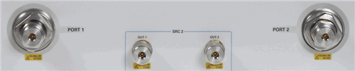

# Internal Second Source

* * *

The following VNA models include an internal second source.

Model |  Total   
# of Ports  
---|---  
PNA-X Opt 224 |  [2](Internal_Second_Source.md#224)  
ALL PNA-X models N522xA Opt 400's |  4  
  
### How to use the second source

  * Set frequency using the [Frequency Offset Opt S93080A dialog](../FreqOffset/Frequency_Offset_Mode.md#FreqOffsDiag).

  * Set power using the [Advanced Power dialog](../S1_Settings/Power_Level.md#Advanced).

  * [Source power calibration](../S3_Cals/PwrCalibration.md#SourceDiag) of the second source is performed as usual.

  * Using FCA, [click the LO button](../Applications/MixerConverter_Setup.md#Configure) to set frequency and power.

  * The [specifications](../Specs/ManualChoice.md) of the second source are the same as source 1.

### Benefits / Uses of the second source

  * Up to five times faster than stepping an external source.

  * Measure Mixers with internal swept or fixed LO.

  * Measure TOI or Intermodulation distortion.

### Internal Second Source Restrictions

Source 1 and Source 2 are available at specific ports as follows:

4-port models

  * Source 1 power is available at Port 1 OR Port 2; NOT at both ports simultaneously.

  * Source 2 power is available at Port 3 AND Port 4; BOTH ports simultaneously. (Although it is possible, the VNA firmware typically prevents both ports from sweeping simultaneously for measurement integrity purposes.)

  * Other routing configurations are possible using the [RF Path Configurator](../S1_Settings/Path_Configurator.md#FactoryConfigs).

PNA-X Opt 224 (PNA-X 2-port model):

  * Source 1 power is available at Port 1 OR Port 2; NOT at both ports simultaneously.

  * Source 2 (SRC 2) power is available at Out 1 AND Out 2; BOTH ports simultaneously.

  * Other routing configurations are possible using the [RF Path Configurator](../S1_Settings/Path_Configurator.md#FactoryConfigs).

### Remotely Accessing the Internal Second Source

See [Remotely Specifying a Source
Port](../Programming/Remotely_Specifying_a_Source_Port.htm).

* * *

