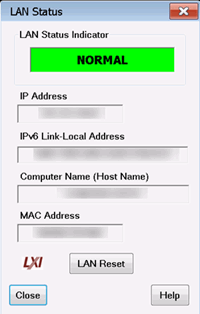

# LXI and VXI Compliance

* * *

PNA-X, N522x models are LXI-1.1 and VXI-11.3 compliant.

### LXI Compliance

A VNA is LXI-1.1 compliant if the  logo
appears on the dialog box shown below.

Learn more about LXI at <http://www.lxistandard.org/>

### VXI Compliance

To be compliant with VXI-11.3, the VNA must have been either:

  * Shipped from the factory with VNA version A.08.20 or higher, or

  * Had the Hard Disk Drive (HDD) upgraded since about June 2008 when A.08.20 was released and using VNA Rev. A.08.20 or higher.

Learn more about VXI at [http://www.vxibug.org/](http://www.vxibus.org/)

## LAN Status

When a LAN connection is used with the VNA, the LAN Status dialog allows you
to see the IP address and other LAN connection properties.

#### How to view LAN Status  
  
---  
Using Hardkey/SoftTab/Softkey | Using Menus  
  
  1. System > System Setup > Lan Status....

|

  1. Click Utility.
  2. Select System.
  3. Select System Setup.
  4. Select LAN Status.

  
  
  
LAN Status dialog box help  
---  
 Indicator Shows the current status of the
LAN connection. NORMAL \- Indicates that the VNA LAN is ready for
communication. IDENTIFY \- Indicates that a remote computer has invoked an LXI
identification operation on the VNA using the web-based interface or
[LXIDeviceIDState](../Programming/COM_Reference/Properties/LXIDeviceIDState_Property.md)
COM property. FAULT \- Indicates that the VNA LAN interface is not connected
to the Internet. IP Address Shows the current IP address of the VNA. IPv6
Link-Local Address Shows the current IPv6 address of the VNA. Computer Name
Shows the full computer name of the VNA. [Learn how to change
this.](ComputerProperties.htm#computerName) If you see the IP address listed
here, that means there is no DNS server specified in the network setup. MAC
Address Shows the unique address of the VNA computer. Also known as HostID.
LAN Reset Provides a LAN Configuration Initialize (LCI) mechanism. Press to
return the following settings to factory default conditions:

  * IP Address Configuration (DHCP): Enabled
  * ICMP Ping Responder: Enabled
  * Web Password for configuration: Resets the password to 'Keysight'.

  
  
### Web Server Software

If your VNA is LXI Class C compliant ([see above](LXI_Compliance.md)), you
can connect to the VNA using a web browser over an internet connection.

To do this, when the above dialog indicates a NORMAL condition:

  1. From a web browser, type http://<your_VNA_computer_name>.

  2. Type the log on User Name and Password

  3. You will see the welcome screen with connection links.

* * *

* * *

