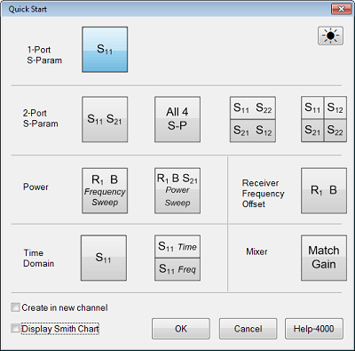
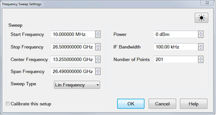
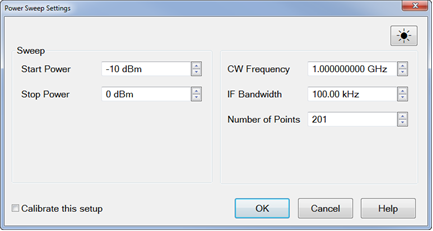
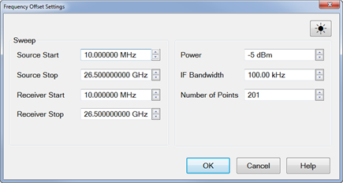
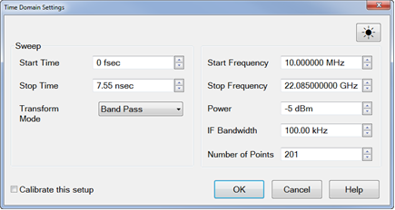
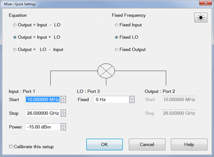

# Quick Start Dialog

* * *

Quick start is a simple wizard which helps to setup the settings for typical
measurements. This feature allows users to select from a set of pre-configured
measurement layouts.

### How to Open Quick Start Dialog Box  
  
---  
Using Hardkey/SoftTab/Softkey  
  
  1. Press Setup > Main > Quick Start....

  
  
  
The measurement comprises the following THREE steps.

## Step 1: Layout Templates

You are able to select a layout template for typical measurements.

 If "Create in new channel" checkbox is
enabled, a new channel and window(s) will be created.

 If "Create in new channel" checkbox is
disabled, when a template is selected then the active channel will be used for
the new measurements. If the active trace is displayed in a window with traces
on other channels, then the trace will be deleted and a new window(s) will be
opened for the new measurements.

 If "Display Smith Chart" checkbox is
enabled, the active trace in a window will turn to display Smith Chart.

 If "Display Smith Chart" checkbox is
disabled, no changes on the active trace in a window.

* * *

## Step 2: Stimulus Settings Dialogs

This step is used to set stimulus for the measurement.

S-Parameters Option Required:  
None | Creates S11 and S21 measurements in a single channel and window.  Enter:

  * [Start/Stop frequency](../S1_Settings/Frequency_Range.md)
  * [Center Frequency](../S1_Settings/Frequency_Range.md#CentDiag)
  * [Span Frequency](../S1_Settings/Frequency_Range.md#CentDiag)
  * [Sweep Type](../S1_Settings/Sweep.md#SweepTypeDiag): Lin or Log Frequency
  * [Power](../S1_Settings/Power_Level.md)
  * [IF Bandwidth](../S2_Opt/Trce_Noise.md#Variable_IF_Bandwidth)
  * [Number of Points](../S1_Settings/DPoints.md#PointsDiag)

Learn more about [S-parameter
measurements](../S1_Settings/Measurement_Parameters.htm#S_Params).  
---|---  
Differential (Balanced)  
Option Required:  
None | Creates Sdd11 and Sdd21 measurements in a single channel and window.  Enter:

  * [Start/Stop frequency](../S1_Settings/Frequency_Range.md)
  * [Center Frequency](../S1_Settings/Frequency_Range.md#CentDiag)
  * [Span Frequency](../S1_Settings/Frequency_Range.md#CentDiag)
  * [Sweep Type](../S1_Settings/Sweep.md#SweepTypeDiag): Lin or Log Frequency
  * [Power](../S1_Settings/Power_Level.md)
  * [IF Bandwidth](../S2_Opt/Trce_Noise.md#Variable_IF_Bandwidth)
  * [Number of Points](../S1_Settings/DPoints.md#PointsDiag)

Learn more about [Differential (Balanced)
measurements](../S1_Settings/Balanced_Measurements.htm).  
Power Frequency Sweep Option Required:  
None | Creates R1 and B receiver measurements in a single channel and window. This allows you to view the DUT input power (R1) and output (B) power.  Enter:

  * [Start/Stop Frequency](../S1_Settings/Frequency_Range.md)
  * [Center Frequency](../S1_Settings/Frequency_Range.md#CentDiag)
  * [Span Frequency](../S1_Settings/Frequency_Range.md#CentDiag)
  * [Sweep Type](../S1_Settings/Sweep.md#SweepTypeDiag): Lin or Log Frequency
  * [Power](../S1_Settings/Power_Level.md)
  * [IF Bandwidth](../S2_Opt/Trce_Noise.md#Variable_IF_Bandwidth)
  * [Number of Points](../S1_Settings/DPoints.md#PointsDiag)

Learn more about [Power Sweep measurements](../s1_settings/sweep.md#power).  
Power Power Sweep Option Required:  
None | Creates a power sweep while viewing R1, B, and S21 measurements in a single channel and window. This allows you to view the DUT input power (R1), output power (B), and DUT gain (S21).  Enter:

  * [Start/Stop Power](../s1_settings/power_level.md#PowerSweep)
  * [CW Frequency](../s1_settings/frequency_range.md#cw_freq)
  * [IF Bandwidth](../s2_opt/trce_noise.md#Variable_IF_Bandwidth)
  * [Number of Points](../S1_Settings/DPoints.md#PointsDiag)

Learn more about [Power Sweep measurements](../S1_Settings/Sweep.md#power).  
Receiver Frequency Offset Option Required:  
S93080A | Creates Frequency Offset Measurement while viewing R1 and B receivers in a single channel and window.  Enter

  * [Source Start](../S1_Settings/Frequency_Range.md)
  * [Source Stop](../S1_Settings/Frequency_Range.md)
  * [Receiver Start](../S1_Settings/Frequency_Range.md)
  * [Receiver Stop](../S1_Settings/Frequency_Range.md)
  * [Power Level](../S1_Settings/Power_Level.md)
  * [IF Bandwidth](../S2_Opt/Trce_Noise.md#Variable_IF_Bandwidth)
  * [Number of Points](../S1_Settings/DPoints.md#PointsDiag)

Learn more about [FOM](../FreqOffset/Frequency_Offset_Mode.md).  
Time Domain Option Required:  
S93010A/B | Creates an S11 measurement and enables Time Domain.  Enter:

  * [Start/Stop Time](../Time/TimeDomain.md#TransformDiag)
  * Transform Mode (Time Domain Settings dialog auto-select the start frequency if a LPF transform mode is selected.)
  * [Start/Stop Frequency](../S1_Settings/Frequency_Range.md)
  * [Power](../S1_Settings/Power_Level.md)
  * [IF Bandwidth](../S2_Opt/Trce_Noise.md#Variable_IF_Bandwidth)
  * [Number of Points](../S1_Settings/DPoints.md#PointsDiag)

Learn more about [Time Domain measurements](../Time/TimeDomain.md).  
Mixer Option Required:  
S93082A/B/S93083A/B | If any one of the [SMC Measurements](../FreqOffset/SMC_Measurements.md) is selected in Step 1, the Mixer Quick Settings dialog will appear.  Enter:

  * Equation: Output = Input - LO, Output = Input + LO, Output = LO - Input.
  * Input, LO, and Output Frequencies and configuration.

Learn more about [SMC Measurements](../FreqOffset/SMC_Measurements.md)  
  
## Steps 3: Cal Wizard Dialog (Optional)

 If "Calibrate this setup" checkbox is
enabled, the Cal Wizard Dialog will appear when Stimulus Settings Dialog is
dismissed with the "OK" button.

 If "Calibrate this setup" checkbox is
disabled, the Cal Wizard Dialog will NOT appear.

* * *

* * *

