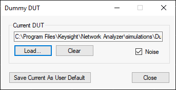
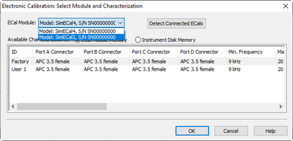

# Simulator (S94050B, S94051B)

Beginning with firmware release A.14.80.xx, all the features of the standard
class are enabled by the simulator license. Without the license, the firmware
enters Viewer Mode in which many of the features are disabled.

Note: Only "B" version PNA/VNA firmware can be used with the Simulator
(S9405xB).

To install the VNA simulator, user has to

  1. Download and install the IO library if it is not installed. [https://www.keysight.com/find/iolibs](http://www.keysight.com/find/iolibs)

  2. Download Firmware from Keysight web (<https://www.keysight.com/find/pxiusbvna-firmware>). The firmware supports the simulator capability for all models including PNA and ENA.

  3. Install the firmware to the PC. Follow the instructions for the installation.

  4. Execute the Keysight License Manager from Start Menu in Windows to install the license. Click “What if I have a license file to install”, then follow the instruction to install the license file. Learn more on [option enable](../Support/Option_Enable.md#Node-lockedLicense).

  5. You can open the Simulator setup dialog thru VNA SFP Launcher. 

In this topic:

  * VNA Simulator Setup Dialog (for PC or PXIe/USB VNA only)

  * VNA Simulator License

  * Simulator Mode

  * Dummy DUT

  * [Calibration Simulation](Simulator.md#CalibrationSimulation)

## VNA Simulator Setup Dialog (for PC or PXIe/USB VNA only)

Model Type Select the series for simulator mode.

Model Number Pulldown menu to select the model for simulator mode. It will
change depending on the selected Model Type.

Number of Ports To change the number of ports with the Up/Down button or edit
that value using keyboard. Acceptable number as the number of ports is even
number from 2 to 66. The maximum number of ports will change depending on the
selected model.

Run Start the firmware as Simulator mode with the selected setup. The selected
Model Type, Model Number and Number of ports will be saved as new default
values and these new default values will be used when the dialog will open
next time.

Cancel Does not apply any changes and close the simulator setup dialog.

Help Open Help.

## VNA Simulator License

One of the licenses below is required to enable VNA Simulator.

  * S94050B – Standard Simulator

  * S94051B – Advanced Simulator

When no simulator license exists, VNA Simulator starts with Data Viewer Mode.

### Simulator Mode

There are three simulator modes as below:

#### 1\. Data Viewer

Data Viewer is a free version of VNA Simulator and supports STD Channel with
restrictions. Advanced functions including applications and remote-control
capability are disabled.

####

#### 2\. Standard Simulator

All the features of the standard class are enabled by the simulator base
license. The required license for the standard simulator is S94050B.

Standard Simulator supports STD Channel and remote-control capability.
Applications are not supported.

#### 3\. Advanced Simulator

The S94051B is needed to enable advanced simulator.

Advanced Simulator supports Standard Simulator features + Applications (SW
options) listed below.

VNA Family |  Product |  Supported Software Options  
---|---|---  
|  N522xB |  S93xxx: 008, 010,011,015,025,029,082,083,084,086,087,088,089,090,094,118,322,460  
PNA |  N523xB |  S93xxx: 008, 010,011,015,082,090,322  
|  N524xB |  S93xxx: 008, 010,011,015,025,029,082,083,084,086,087,088,089,090,094,110,111,118,322,460  
ENA |  E5080A |  S96xxx: 008, 010,082,086  
E5080B |  S96xxx: 008, 010,011,015,025,029,082,083,084,086,088,090,460,111  
E5081A |  S96xxx:008, 010,015,025,029,070,082,083,084,086,090,111  
|  M983xA |  S95xxx: 008, 010,015,025,029,070,082,083,084,086,090,111  
PXI |  M980xA |  S95xxx: 008, 010,011,015,025,029,070,082,083,084,086,088,089,090,460,111  
|  M937xA |  M9372A-xxx: 009,010  
Streamline (USB VNA) |  P50xxA/B |  S97xxx: 008, 010,011,015,025,029,082,083,084,086,088,090,460,111  
P937xA/B P938xB |  S97xxx: 010,082  
  
#####

The following options are not supported.

  * S9x007B Automatic Fixture Removal for all models

  * S96041B Impedance Analysis

  * S95552B Multiport Calibration Assistant

  * S95553B Multiport calibrated measurements with switch instruments

  * S97560B Banded millimeter-wave network analysis

Hardware options:

  * Software options include required hardware options (For M980xA,P50xxA, E5080B, E5081A)

  * 2nd source (option 022) is enabled for N524xB, 4-port N522xB, 4-port E5080B, E5081A and P502xA only

  * N source is enabled for M980xA but supported N*2-port configurations only

  * LFE option is enabled for N5222/27B (option 205) and N5242/45/47B (option 425)

  * Analog Input (option 175) is enabled for E5080B, E5081A.

  * Multi-port (unit) configuration in USB VNA is not supported

The external devices such as source, power sensor are not supported. PXI
internal devices such as the switch and M9341A/B Digital IO supports GUI only.

## Dummy DUT

Dummy DUT capability provides measurement data manipulation for VNA simulator
using the following format files.

The following data can be recalled from Dummy DUT dialog box. They can be
stored under Save Recall > Save Others > Save Data...

  * sNp files

  * Mixer S2P (.s2px)

  * GCA Sweep Data (.csv)

  * GCX Sweep Data (.csv)

The selection of GCA Sweep Data and GCX Sweep Data is shown only when the Gain
Compression parameters are measured.

The data acquisition mode must be 2D (either Sweep Power per Frequency or
Sweep Frequency per Power).

VNA Simulator automatically loads a “default” dummy DUT put under VNA
installed folder (C:\Program Files\Keysight\Network
Analyzer\simulations\DummyDUT.s6p)

Users can set their own default dummy DUT under user VNA document folder
(C:\Users\Public\Documents\Network Analyzer\UserDummyDUT.s*p)

When there are multiple “UserDummyDUT.s*p” files, VNA simulator loads the
first found one.

Dummy DUT Tool provides GUI for dummy DUT handling. The tool is Installed
under VNA Macro softkey.

### How to create Dummy DUT snp file

Use one of the following methods to make a dummy DUT snp file  
---  
Using Hardkey/SoftTab/Softkey |  Using a mouse  
  
  1. Press Macro > Macro1 > **Dummy DUT tool**

|

  1. Click Utility > Macro > **Dummy DUT tool [dummyduttool...]**

  
  
  

Current DUT Show sNp file currently used as dummy DUT

Load... Load user specific sNp file as current dummy DUT

Clear Clear current dummy DUT

Noise Set noise state ON/OFF

Save Current As User Default Save current dummy DUT as user default

## Calibration Simulation

### Mechanical Calibration Kit Simulation

If you have an SnP file of the condition of open, short and load, the normal
calibration can be simulated.

  1. Execute the dummy DUT dialog box

  2. Execute Smart Cal.

  3. Since Dummy DUT dialog box is hidden behind the GUI, make it visible by using Alt+Tab. Then, Load the SnP file of the open condition.

  4. Take a open calibration.

  5. Continue this for Short and Load.

### ECal Simulation

The following two simulated ECal modules are available in the simulator.

Ecal Name |  Model Number |  Serial Number |  Number of Ports  
---|---|---|---  
SimEcal4 |  129 |  SN00000000 |  4  
SimEcal2 |  130 |  SN00000000 |  2  
  

The simulated ECals do the followings:

  * Emulates ECal's state changes while the calibration is executed.

  * Shows measurement results of standards according to he ECal state.

  * Returns the result by sending SCPI commands related with ECal such as :SENS:CORR:CKIT:ECAL:LIST?

