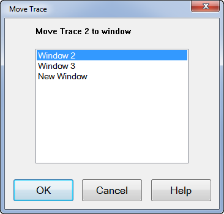
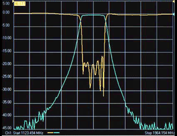
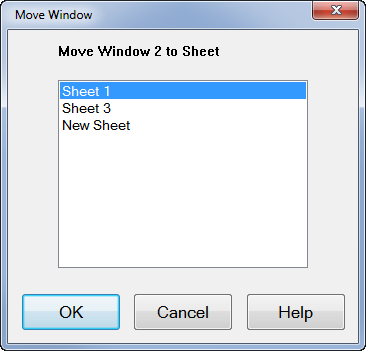

# Traces, Channels, Windows, and Sheets on the Analyzer

* * *

It is critical to understand the meaning of the following terms as they are
used on the analyzer.

  * [Traces](Traces_Channels_and_Windows.md#Trace) \- [Managing](Traces_Channels_and_Windows.md#ManagingTraces) ([Trace Manager](Traces_Channels_and_Windows.md#TraceManager_Dialog))

  * [Channels](Traces_Channels_and_Windows.md#channel) - [Managing](Traces_Channels_and_Windows.md#ManagingChan)

  * [Windows](Traces_Channels_and_Windows.md#window) \- [Managing](Traces_Channels_and_Windows.md#Managing)

  * Sheets - Managing

[Other Quick Start topics](Getting_Started.md)

## Traces

Traces are a series of measured [data points](../S1_Settings/DPoints.md).
There is no theoretical limit to the number of traces. However, the practical
limit is the [maximum number of
windows](Traces_Channels_and_Windows.htm#window) times the maximum number of
traces per window (100).

In addition, the following two kinds of memory traces are available. [Learn
more about Math / Memory traces.](../S4_Collect/Math_Operations.htm)

  * One memory trace in the same measurement (same trace number) 

  * Memory data trace in the different measurement (different trance number) 

Trace settings affect the presentation and mathematical operations of the
measured data.

The following are Trace settings:

  * [Parameter](../S1_Settings/Measurement_Parameters.md)

  * [Format and Scale](../S1_Settings/Data_Format.md)

  * [Smoothing](../S2_Opt/Trce_Noise.md#Smoothing)

  * [Correction ON / OFF](../S3_Cals/Error_Correction_and_Interpolation.md)

  * [Electrical Delay](../S2_Opt/Phase_Accy.md#ElectricalDiag)

  * [Phase Offset](../S2_Opt/Phase_Accy.md#po)

  * [Trace Math](../S4_Collect/Math_Operations.md)

  * [Markers](../S4_Collect/Markers.md)

  * [Time Domain](../Time/TimeDomain.md) (Opt S93010A/B/010)

### Managing Traces

  * How to Add a trace

  * [How to Select a trace](Traces_Channels_and_Windows.md#SelectTrace)

  * [How to Delete a trace](Traces_Channels_and_Windows.md#DeleteTrace)

  * [How to Move a trace](Traces_Channels_and_Windows.md#move)

  * [How to Maximize a trace](Traces_Channels_and_Windows.md#MaxTrace)

  * [How to perform Trace Hold (Max or Min)](Traces_Channels_and_Windows.md#Trace_Hold)

  * [How to Create a new trace](../S1_Settings/Measurement_Parameters.md#NewTraceDiag)

  * [How to Change the trace parameter](../S1_Settings/Measurement_Parameters.md#NewTraceDiag)

  * [How to display a custom trace title](../S1_Settings/Customize_Your_Analyzer_Screen.md#TraceTitle) (separate topic)

  * [How to display a wide active trace](../System/Preferences.md#Preferences) (separate topic)

#### How to Add a trace

The only measurements that can be selected are those in the same measurement
class as is currently assigned to the channel. To select a measurement other
than these, first select the appropriate measurement class to a new or
existing channel. [Learn how.](../s1_settings/measurement_classes.md) A trace
must be selected (active) before its trace settings can be changed. [How to
know which trace is
Active?](../S1_Settings/Customize_Your_Analyzer_Screen.htm#status_bar)  
---  
Using Hardkey/SoftTab/Softkey | Using a mouse  
  
  1. For Traces 1-7, press Trace > Trace 1-7 > click left side Trace 1-7 small button  
(Example: Click on left side Trace 1 small button and Trace 1 is active when
it turns green, so Trace 1 added).

  2. For Traces 8-15, press Trace > Trace 8-15 > click left side Trace 8-15 small button  
(Example: Click on left side Trace 9 small button and Trace 9 is active when
it turns green, so Trace 1 is added).

  3. Another method of adding traces is by pressing Trace > Trace 1-7 > New Traces....
  4. For other traces numbers, press Trace > Trace Setup > Add Trace, then select New Trace, New Trace + Channel, New Trace + Window, New trace + Channel + Window, or New Traces....

|

  1. Right click in the grid box and then select New Trace....

  
  
  
#### How to Select a Trace

The only measurements that can be selected are those in the same measurement
class as is currently assigned to the channel. To select a measurement other
than these, first select the appropriate measurement class to a new or
existing channel. [Learn how.](../s1_settings/measurement_classes.md) A trace
must be selected (active) before its trace settings can be changed. [How to
know which trace is
Active?](../S1_Settings/Customize_Your_Analyzer_Screen.htm#TraceTitle)  
---  
Using Hardkey/SoftTab/Softkey | Using a mouse  
  
  1. Press Trace > Trace Setup > Select.
  2. Select a trace number which corresponds to the desired measurement parameter.

|

  1. Click on [Trace Status](../S1_Settings/Customize_Your_Analyzer_Screen.md#trace_status) label of any trace above the grid box.

  
  
  
#### How to Delete a Trace  
  
---  
Using Hardkey/SoftTab/Softkey | Using a mouse  
  
  1. For Traces 1-7, press Trace > Trace 1-7 > click left side Trace 1-7 small button  
(Example: Click on left side Trace 1 small button and Trace 1 is inactive when
it is not green).

  2. For Traces 9-16, press Trace > Trace 8-15 > click left side Trace 8-15 small button  
(Example: Click on left side Trace 9 small button and Trace 9 is inactive when
it is not green).

  3. For other traces numbers, press Trace > Trace Setup > Delete Trace, then select a trace number.

|

  1. Right-click the [Trace Status](../S1_Settings/Customize_Your_Analyzer_Screen.md#trace_status) label above the grid box, then click Delete Trace.

  
  
  
#### How to Move a trace to a different Window

You can DRAG a trace from one window to another, or...  
---  
Using Hardkey/SoftTab/Softkey | Using a mouse  
  
  1. Press Trace > Trace Setup > Trace Manager...
  2. Under the Window Column, reassign the active trace to another window number at the pulldown then click OK.

For some models

  1. Press Trace > Trace Setup > Move Trace....
  2. Select a window number in the following dialog, and then click OK.

|

  1. Right-click the [Trace Status](../S1_Settings/Customize_Your_Analyzer_Screen.md#trace_status) label above the grid box, then click Trace Manager... 
  2. Under the Window Column, reassign the active trace to another window number at the pulldown then click OK.

For some models,

  1. Right-click the [Trace Status](../S1_Settings/Customize_Your_Analyzer_Screen.md#trace_status) label above the grid box, then click Move Trace....
  2. Select a window number in the following dialog, and then click OK.

  
  
  
Trace Manager dialog box help  
---  
 Trace Manager allows the
user to see and modify all traces/channels/windows/sheets/formats in one
table. The changes are updated immediately.  There is one row for each trace.
By Clicking on a column heading will display the rows in ascending or
descending order as defined by that column. A row is selected by clicking on
any cell in the row and the popup menu for the cell will appear. Multiple rows
can be selected by click-drag-release. All selected rows will be highlighted
and popup menu for the column will appear.  Undo Reverse back to the previous
settings  Redo Change the settings again.

#### Trace Column

 User is not able to edit trace
numbers. User may select multiple rows; this allows user to delete multiple
traces using the popup menu.  There is a special case where the trace entry in
the row is empty. This is used to show when there is an empty window. If the
users select this row and choose "Delete Trace", it will delete the empty
window; this is a convenient feature; it is deleting a null trace. New Trace
To add a new trace. Selecting the cell will open the "Meas" dialog. Delete
Trace The selected trace will be deleted. Table Columns A pop up dialog is
opened which allows user to define the columns visible in the table. The
default table column is: Meas/Class/Channel/Windows/Sheet.

#### Meas Column

Selecting the cell will open the "Meas" dialog. User cannot select multiple
rows from a Meas cell.

#### Class Column

 Selecting the cell will open the
"Measurement Class" dialog. User cannot select multiple rows from a Class
cell.  When the measurement class is changed, all traces numbers on the
currently active channel will be assigned to the new measurement class. The
window and sheet settings will be the same, but the "Meas" setting will be
changed to default values for the selected class.

####

#### Channel Column

 Selecting the cell will open a
pulldown, and will select the row. User can click and drag to select multiple
rows.  User may use the pulldown to reassign the active trace to another
channel and delete the active channel. When the channel for a trace is
changed, the "Meas" setting will likely be changed.

#### Window Column

 Selecting the cell will open a
pulldown, and will select the row. User can click and drag to select multiple
rows. Changing the layout of the windows will reset window titles. User may
use the pulldown to reassign the active trace to another window, delete the
active window and all traces on that window and change the layout of the
windows. If the active row has no trace assigned, then the window pulldown
will not allow user to change the window number.

#### Sheet Column

 Selecting the cell will open a
pulldown, and will select the row. User can click and drag to select multiple
rows.  User may use the pulldown to reassign the active trace to another
sheet, delete the active sheet and all traces on that sheet and change the
layout of the sheets. If the active row has no trace assigned, then the sheet
pulldown will not allow user to change the sheet number.

####

#### Format Column

 Selecting the cell will open a
pulldown, and will select the row.  User may use the pulldown to select the
trace formats. When the measurement class is SA, the selectable formats are
only LinM and LogM.  
  
Move Trace dialog box help (E5080A only)  
---  
 Note: Only ONE trace can be moved at
a time.

  1. Click the [Trace Status](../S1_Settings/Customize_Your_Analyzer_Screen.md#trace_status) label to select the trace to move.
  2. Move Trace N to window \- Transfer the selected trace to any Window listed or to a New Window.

  
  
### Trace Max

#### How to maximize the active trace - the active trace is the ONLY trace on
the screen display. All other traces are hidden.  
  
---  
Using Hardkey/SoftTab/Softkey | Using a mouse  
  
  1. Press Trace > Trace Setup > Trace Maximize (ON). With Trace Max (ON), select a different trace to make that trace visible.
  2. To make all traces visible again, select Trace Maximize (OFF).

|

  1. Right-click the [Trace Status](../S1_Settings/Customize_Your_Analyzer_Screen.md#trace_status) label above the grid box, then click Trace Maximize.
  2. Double click on the active trace to make all traces visible again.

  
  
  
### Trace Hold

#### How to hold the active trace at the maximum or minimum points.  
  
---  
Using Hardkey/SoftTab/Softkey

  1. Trace > Trace Setup > Trace Hold > OFF | Max | Min.
  2. Restart resets the trace.

| Using a mouse Not available  
  
  
Maximum/Minimum trace hold can be applied with several conditions:

  * Feature is applicable to any data trace, but NOT to memory traces.

  * When the stimulus or any data post processing setting is changed, the trace hold data will be reset. These settings include:

  *     * Smoothing on/off.

  * Smoothing Aperture.

  * Gating on/off.

  * Transform on/off.

  * Conversion state change, conversion type change.

  * Data Math Function (Data/Mem) change.

  * Equation Editor state change, formula change.

  * Parameter change.

  *     * Formatting change.

  * Minimum/maximum comparison is done with formatted data. For Smith and Polar formats, absolute data is used and not phase.

  * Trace hold data can be recalled.

  * Data save files formats

  *     * SnP does NOT save trace hold data

    * Citifile, CSV, MDF, PRN DOES save trace hold data

Note: Citifiles can be recalled and viewed in the VNA.

    * Use SCPI commands to get trace hold data. If trace hold is active, then the data returned from the remote interfaces will be the trace hold data.

* * *

## Channels

Channels contain traces. The analyzer can have up to maximum 500 independent
channels.

Note: Actual maximum number of channel depends on the setup. A large number of
NOPs and traces limit the maximum number of channel.

Channel settings determine how the trace data is measured . All traces that
are assigned to a channel share the same channel settings. A channel must be
selected (active) to modify its settings. To select a channel, click the
[Trace Status](../S1_Settings/Customize_Your_Analyzer_Screen.md#trace_status)
button of a Trace in that channel. The following are channel settings:

  * [Frequency range](../S1_Settings/Frequency_Range.md)

  * [Power level](../S1_Settings/Power_Level.md)

  * [Calibration](../S3_Cals/Calibration.md)

  * [IF Bandwidth](../S2_Opt/Trce_Noise.md#Variable_IF_Bandwidth)

  * [Number of Points](../S1_Settings/DPoints.md)

  * [Sweep Settings](../S1_Settings/Sweep.md)

  * [Average](../S2_Opt/Trce_Noise.md#averaging)

  * [Trigger](../S1_Settings/Trigger.md) (some settings are global)

### Managing Channels

#### How to Select a Channel

A channel must be selected (active) before its settings can be changed. To
make a channel active, [select a
trace](Traces_Channels_and_Windows.htm#SelectTrace) in that channel or click
the [Trace
Status](../S1_Settings/Customize_Your_Analyzer_Screen.htm#trace_status) button
of a Trace in that channel.  
---  
  
#### How to Add a channel  
  
---  
Using Hardkey/SoftTab/Softkey

  1. Press Channel > Channel 1-8 > click left side Channel 1-8 small button  
(Example: Click on left side Channel 1 small button and Channel 1 is active
when it turns green, so Channel 1 is added).

  2. For other channel numbers, press Channel > Channel Setup > Add Channel, then select New Trace \+ Channel or New Trace + Channel \+ Window.

| Using a mouse Not available  
No programming commands are available for this feature  
  
#### How to Delete a channel  
  
---  
Using Hardkey/SoftTab/Softkey

  1. Press Channel > Channel 1-8 > click left side Channel 1-8 small button  
(Example: Click on left side Channel 1 small button and Channel 1 is inactive
when it is not green).

  2. For other channel numbers, press Channel > Channel Setup > Delete Channel, then select a channel.

| Using a mouse Not available  
  
  
* * *

## Windows

Windows are used for viewing traces.

  * The analyzer can show between 1 and 500 windows on the screen with the following limitations:

  *     * The COM property [MaximumNumberOfWindows](../Programming/COM_Reference/Properties/MaximumNumberOfWindows_Property.md) returns 500.

    * The [SCPI status register](../Programming/GP-IB_Command_Finder/Status.md) can track the status of up to 576 traces.

  * Each window can contain up to 100 traces.

  * Windows are completely independent of channels.

  * See [Customize the analyzer screen](../S1_Settings/Customize_Your_Analyzer_Screen.md) to learn how to make other window settings.

The following is a window containing two traces. Both traces use the same
channel 1 settings as indicated by the annotation at the bottom of the window.

The window number shows in the lower-left corner of the window. The following
shows window 5.

### Managing Windows

#### How to Add a window  
  
---  
Using Hardkey/SoftTab/Softkey | Using a mouse  
  
  1. Press Display > Window 1-8 > click left side Channel 1-8 small button  
(Example: Click on left side Window 1 small button and Window 1 is active when
it turns green, so Window 1 is added).

  2. For other windows, press Display > Window Setup > Add Window, then select New Window, New Trace + Window, or New Trace \+ Channel + Window.

|

  1. Right-click any area of grid box and then select New Window.

  
  
  
#### How to Delete a Window  
  
---  
Using Hardkey/SoftTab/Softkey | Using a mouse  
  
  1. Press Display > Window 1-8 > click left side Channel 1-8 small button  
(Example: Click on left side Window 1 small button and Window 1 is inactive
when it is not green).

  2. For other windows, press Display > Window Setup > Delete Window, then select a window.

|

  1. Right-click any area of grid box and then select Close Window.

  
  
  
####

#### How to Move a Window to a different Sheet

Note: This featue is NOT available on M948xA and E5080A.  
---  
Using Hardkey/SoftTab/Softkey  
  
  1. Select a Window to move.
  2. Press Display > Window Setup > Move Window...
  3. Select a sheet number in the following dialog, and then click OK.

  
  
  
####

Move Window dialog box help  
---  
 Note: Only ONE window can be moved
at a time.

  1. Move Window N to Sheet N\- Transfer the selected window to any sheet listed or to a New Sheet.

  
  
####

#### How to Change Window Layout

Note: This featue is NOT available on M948xA and E5080A. Note: Changing the
layout of the windows will reset window titles. This is a window auto-layout
option, for quicker selection instead of selecting the trace, channel, window
and sheet separately. 7 auto-layout options are available.  
---  
Using Hardkey/SoftTab/Softkey  
  
  1. Press Display > Window Setup > Window Layout.
  2. Select 1 Window, 2 Windows, 3 Windows, 4 Windows, 1 Trace per Window, 1 Channel per Window, or Tile Windows.

  
  
  
#### How to maximize the active window - the active window is the ONLY window
on the screen display. All other windows are hidden.  
  
---  
Using Hardkey/SoftTab/Softkey | Using a mouse  
  
  1. Press Display > Window Setup > Window Max (ON). With Window Max (ON), select a different window to make that window visible.
  2. To make all windows visible again, select Window Max (OFF).

|

  1. Right-click in any area of the grid box and then select Maximize.

  
  
  
* * *

## Sheet

Sheets are used to group VNA windows. The sheet tabs provide an easy way to
switch multiple display settings quickly.

Features and actions that can performed with tabbed sheets:

  1.      * Add/Delete/Select sheet

     * Move window to sheet

     * Measurement can be performed on traces/channels in inactive sheets

     * Easy setup for channel per window

     * Easy setup for channel per sheet

### Managing Sheet

#### How to Add Sheet  
  
---  
Using Hardkey/SoftTab/Softkey | Using a mouse  
  
  1. Press Display > Sheet Setup > Add Sheet.
  2. The select one a New Sheet, New Trace + Sheet or New Trace + Channel + Sheet.

|

  1. Click on the sheet tab.

  
  
  
#### How to Delete a Sheet  
  
---  
Using Hardkey/SoftTab/Softkey | Using a mouse  
  
  1. Press Display > Sheet Setup > Delete Sheet.
  2. Then select a sheet.

|

  1. Click on the sheet tab.

  
  
  
#### How to View a Sheet  
  
---  
Using Hardkey/SoftTab/Softkey | Using a mouse  
  
  1. Press Display > Sheet Setup > Select.
  2. Then select a sheet.

|

  1. Click on the sheet tab.

  
  
  
#### How to Change Sheet Title  
  
---  
Using Hardkey/SoftTab/Softkey  
  
  1. Press Display > Sheet Setup > Sheet Title....
  2. In the pop up Sheet title box, enter the title and click OK.

  
  
  
#### How to Change Sheet Layout

This is a sheet auto-layout option, for quicker selection instead of selecting
the trace, channel, window and sheet separately. 4 auto-layout options are
available.  
---  
Using Hardkey/SoftTab/Softkey  
  
  1. Press Display > Sheet Setup > Sheet Layout.
  2. Select 1 Sheet, 1 Trace per Sheet, 1 Channel per Sheet, or 1 Window per Sheet.

  
  
  
* * *

