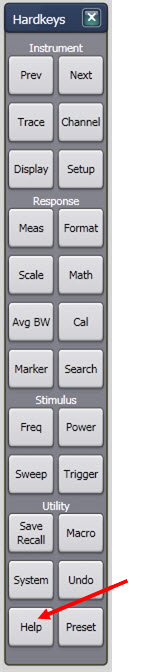
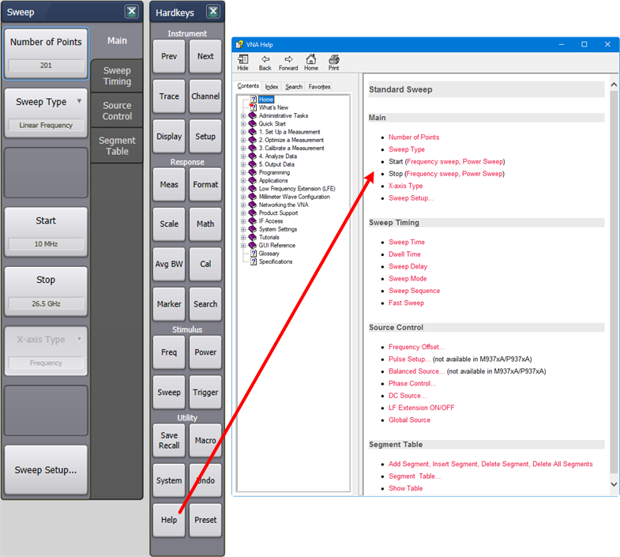
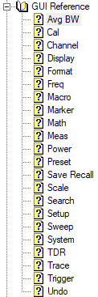
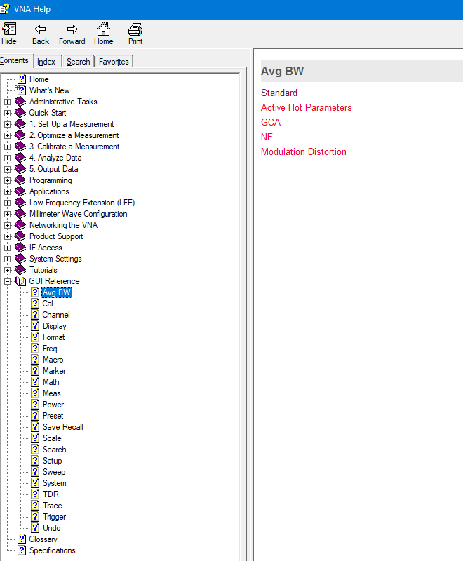
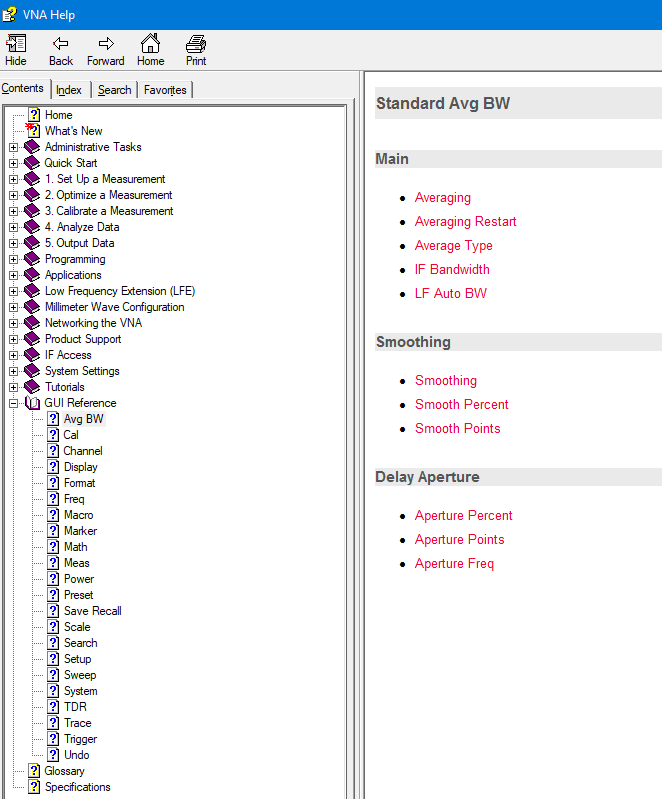
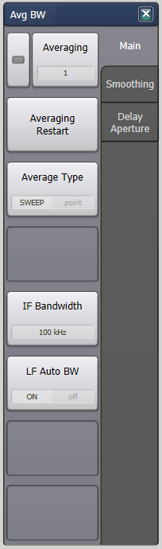
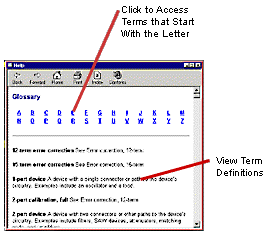

# Using Help

* * *

This topic discusses the following:

  * [Documentation](Using_Help.md#docs)

  * [Printing Help](Using_Help.md#Printed)

  * [Copying Help to your PC](Using_Help.md#Copying)

  * [Launching Help](Using_Help.md#Home)

  * [Searching Help](Using_Help.md#Search)

  * GUI Reference Help

    * Accessing GUI Reference Help with Help Hardkey

    * Accessing GUI Reference Help from Table of Contents

  * [Help Languages](Using_Help.md#Help_languages)

  * [Documentation Warranty](Using_Help.md#Documentation)

### See Also

  * [Programming Guide](../Programming/Programming_Guide.md) (for finding SCPI/COM commands for remote programming)
  * [Help, About Network Analyzer](HelpAbout.md)

[Other Quick Start Topics](Getting_Started.md)

## Help Documentation

This Help file, which is embedded in the analyzer, is the Users Guide and
Programming Manual for the VNA. The help file is automatically updated on the
VNA when firmware is updated. Only the VNA [Installation and Quick Start
Guide](http://literature.cdn.Keysight.com/litweb/pdf/E8356-90001.pdf) is
shipped with new VNA instruments.

Hardcopy manuals are no longer available for purchase with the VNA.

Copying Help to your PC

With the Help system on your PC, you can read about the analyzer while away
from it. You can also Copy and Paste programming code from this Help system
directly into your programming environment.

The Help file is located on your analyzer hard-drive at C:\Program Files
(x86)\Keysight\Network Analyzer\Help\<filename>.chm. If both the analyzer and
PC are connected to LAN, you can [map a drive](../S5_Output/Drive_Mapping.md)
and copy the file directly.

The Help file can also be downloaded from [N52xxB PNA Series Help File | Keysight](https://www.keysight.com/us/en/lib/resources/help-files/n52xxb-pna-series-help-file.html) .

## Launching Help

The Help system can be launched in the following ways:

  1. From the front panel Help button.

  2. From the Help drop-down menu.

  3. From Dialog Box Help buttons.

## Search Tab

TIP: To Search any topic for a keyword, press Ctrl and F.

.

The following rules apply for using full-text search:

  * Searches are not case-sensitive.

  * You can search for any combination of letters (a-z) and numbers (0-9).

  * Punctuation marks (period, colon, semicolon, comma, and hyphen) are ignored during a search.

  * You can group the words of your search using double quotes or parentheses. Examples: "response calibration" or (response calibration). This requirement makes it impossible to search for quotation marks.

  * Use Wildcard expressions:

  *     * To search for one undefined character use a question mark (?). For example, searching for cal? will find calc and calf.

    * To search for more than one undefined character use an asterisk (*). Searching for Cal* will find calibration and calculate.

  * Use Boolean operators to define a relationship between two or more search words.

Search for | Example | Results will show topics containing:  
---|---|---  
Two words in the same topic | response AND calibration | Both the words "response" and "calibration".  
Either of two words in a topic | response OR calibration | Either the word "response" or the word "calibration" or both.  
The first word without the second word in a topic | response NOT calibration | The word "response" but not the word "calibration".  
Both words in the same topic, close together. | response NEAR calibration | The word "response" within eight words of the word "callibration".  
  
## GUI Reference Help

### Accessing GUI Reference Help with Help Hardkey

The GUI Reference help can be accessed at any time by clicking on the Help
hardkey:

The GUI Reference help accessed by clicking on the Help hardkey corresponds to
the currently active Measurement Class, currently selected Hardkey, and
currently selected Soft Tab to provide context sensitive help.

The following procedure is a typical example of how to find GUI Reference help
using the Help hardkey. This example assumes the Standard Measurement class is
currently active, the Sweep hardkey is selected, and the Main Soft Tab is
selected.

  1. Click on the Help hardkey. The following is displayed:  
  
  

  2. Click on a link for information. The links correspond to the Softkeys.

### Accessing GUI Reference Help from Table of Contents

The GUI Reference topics displayed in the table of contents are arranged in
alphabetical order:

The [GUI Reference](../GUI_Reference/Avg_BW.md) corresponds to the GUI
Hardkeys to help find information quickly:

The following procedure is a typical example of how to find information using
the GUI Reference. This example shows how to search for the Avg BW Hardkey
information with the Standard Measurement class selected.

  1. Under GUI Reference in the table of contents, select the Avg BW topic. The following is displayed:  
  
  
  
The links shown on this page correspond to Measurement Class names because
some menus change with Measurement Class.  

  2. Click on the Standard link. The following is displayed:  
  

  
  
Main, Smoothing, and Delay Aperture correspond to the soft tab labels. The
links correspond to the softkey labels.  

  3. Click on a link for information. The links correspond to the Softkeys.

## Help Languages

This help file is offered in English ONLY.

## Glossary

The [Glossary](../Glossary.md) holds definitions of words, in alphabetical
order.

## Documentation Warranty

The material contained in this document is provided "as is," and is subject to
being changed, without notice, in future editions. Further, to the maximum
extent permitted by applicable law, Keysight disclaims all warranties, either
express or implied with regard to this manual and any information contained
herein, including but not limited to the implied warranties of merchantability
and fitness for a particular purpose. Keysight shall not be liable for errors
or for incidental or consequential damages in connection with the furnishing,
use, or performance of this document or any information contained herein.
Should Keysight and the user have a separate written agreement with warranty
terms covering the material in this document that conflict with these terms,
the warranty terms in the separate agreement will control.

