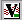

# Using VNC to Control the VNA User Interface

* * *

VNC (Virtual Network Computing) allows you to control the User Interface of a
VNA from any PC. The VNA display appears on the connected PC display. Mouse
and keyboard control can occur from both the VNA and PC, although not
simultaneously.

Note: For similar functionality, use Windows Remote Desktop. A display setting
of 1280X800 pixels is recommended. See the Windows help file for more
information.

Both the VNA and PC must be connected to the same network. The responsiveness
of the VNA while using VNC is dependent of the speed of your internet
connection.

Every VNA is shipped with VNC installed. However, you must download and
install the VNC software onto the PC.

The following procedures can help you configure VNC to view and control the
VNA application from your PC.

### On the VNA, run VNC Server

To do this:

  1. Click View, then Minimize Application.

  2. Click Start, then All Programs, then TightVNC, then Tight VNC Server (Application Mode), then Launch VNC Server.

  * When the server is running, the  icon is visible in the lower right corner of the display. If not visible, click the up arrow to expand the list of icons.

  * The first time you run VNC Server, use the default password "Keysight" (case sensitive). For optimum security, it is recommended that you set your own unique password to control access from remote PCs.

### On the PC, run VNC Viewer

To do this:

  1. Download from <http://www.tightvnc.com/> and install TightVNC on the PC.

  2. From the PC Desktop, click Start, then Programs, then TightVNC, then TightVNC Viewer

  3. When prompted for the Hostname, type the [full computer name](ComputerProperties.md#computerName) or [IP address](ComputerProperties.md#IP) of the VNA.

  4. When prompted for the password, type the password you set when configuring VNC on the VNA.

* * *

