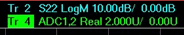

# ADC Measurements

* * *

The PNA is equipped with two ADC (Analog to Digital Converter) inputs on the
rear-panel [Power I/O connector](../Rear_Panel/XPwrIO.md) (Pins 7 and 8).
These ADC inputs can be used as measurement receivers and display measurements
on the VNA screen.

  * Analog Inputs (AI1 and AI2) can be used for measuring from -10V to +10V. These inputs can be considered auxiliary receivers and used in a similar way as S-Parameter receivers.

  * Analog Output Sense inputs (AOS1 and AOS2) can be used to measure the corresponding DAC outputs.

  * Analog Ground input (AIG) can be used to measure the instruments analog ground (PNA-X only).

Two DAC outputs are supplied on the [Power I/O
connector](../Rear_Panel/XPwrIO.htm) (Pins 3 and 4). These DAC outputs are
controlled from the [DC Source Control dialog](DC_Control.md).

[Learn how to configure an external DC Source or DC
Meter.](../System/Configure_a_DC_Device.htm)

New Trace (ADC) dialog box help  
---  
Note: Sweep speed slows dramatically when measuring more than two ADC
receivers. On the [New Trace dialog](Measurement_Parameters.md#NewTraceDiag),
click the Receivers tab. Activate \- check any empty line to create a trace.
Numerator - select from the following:

  * AIx - Input x: x is Input No.
  * AOSx \- Output sense x: x is Output No.
  * AIG \- Analog ground (PNA-X only)

Denominator \- NOT available (ONLY unratioed measurements) Source Port \- The
ADC receiver is measured when the specified source port is sweeping. Select
None to always measure the ADC receiver.  
  
---  
  
ADC receiver traces are labeled as shown in the following images:

  * The ADC1 input is being measured, with 2 as the source port.

  * The Y axis is U (unitless).

  * The default trace [format](Data_Format.md) is Real (linear).

### ADC Traces and other useful VNA functions

Although most VNA functions work with ADC traces, the following may be
especially useful.

  * [Equation Editor](../S4_Collect/Equation_Editor.md) can be used with the trace data. Although the VNA ADC is measuring voltage (-10V to +10V range in 14 bits), by using a trace formula, this voltage can represent other types of measurement parameters (such as current, temperature, or a scaled voltage). [See PAE example.](../S4_Collect/Equation_Editor.md#PAE)

  * [Trace averaging](../S2_Opt/Trce_Noise.md#averaging) and [Trace Smoothing](../S2_Opt/Trce_Noise.md#Smoothing) can be used to remove trace noise.

  * [Dwell time](Sweep.md#Dwell) can be used to allow for settling.

### VNA Functions Not Supported

  * Calibration for ADC receivers is NOT supported.

  * Not supported in [Noise Figure application](../Applications/Noise_Figure.md)

* * *

