# Balanced Measurements

* * *

  * [What are Balanced Devices](Balanced_Measurements.md#What)?

  * [Differential and Common Modes Model](Balanced_Measurements.md#Model)

  * [Measuring Mixed Mode (Balanced) S-Parameters](Balanced_Measurements.md#Mixed Mode)

  * [Measuring Imbalance Parameters](Balanced_Measurements.md#imbalance)

  * [Measuring CMRR](Balanced_Measurements.md#CMRR)

  * [Port Mapping](Balanced_Measurements.md#mapping)

  * [Calibrating Balanced Measurements](Balanced_Measurements.md#Calibrating)

  * [How the analyzer makes Balanced Measurements](Balanced_Measurements.md#How)

Other [Measurement Setup](Select_a_Measurement_State.md) Topics

Check out the Integrated True Mode Stimulus Application
([iTMSA](../Applications/iTMSA.md)).

### What are Balanced Devices?

Standard Single-ended devices generally have one input port and one output
port. Signals on the input and output ports are referenced to ground.

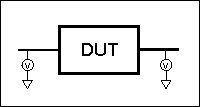

Balanced devices have two pins on either the input, the output, or both. The
signal of interest is the difference and average of the two input or output
lines, not referenced to ground.

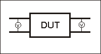

### Differential and Common Modes Model

On balanced devices, the signal of interest is the difference and average of
the two input or output lines. In balanced device terminology, these signals
are known as the Differential and Common modes.

The following model shows how two signals (A and B) combine to create
Differential and Common mode signals:

  * Signal A is fixed at 1V peak

  * Signal B is selectable

  * Differential is calculated as A minus B

  * Common is calculated as the AVERAGE of A and B

Note: Click Signal B selections to see various Differential and Common
signals.

Signal A =1V |  |   
---|---|---  
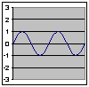 | 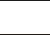 | Differential  
(A - B) 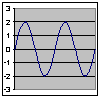 | Common (Avg)  
(A + B) / 2 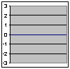  
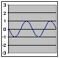  
Signal B = SELECTABLE | Calculations  
Single-ended0V | 1 \- 0 = 1 | (1 \+ 0)/2 = .5  
180° Out of Phase.1V | 1 \- (-1) = 2 | (1 \+ (-1))/2 = 0  
180° Out of Phase 2V | 1 \- (-2) = 3 | (1 \+ (-2))/2 = -.5  
In Phase 1V | 1 \- 1 = 0 | (1 \+ 1)/2 = 1  
In Phase 2V | 1 \- 2 = -1 | (1 \+ 2)/2 = 1.5  
  
Notes:

  * Even when Signal B is 0V, like a Single -ended signal, there is still a unique Differential and Common mode representation of the two individual signals.

  * The above model does not show a DUT. The difference and average of two signals can be calculated for both the balanced INPUT and balanced OUTPUT of a device.

### Measuring Mixed Mode (Balanced) S-Parameters

Mixed mode S-parameters combine traditional S-parameter notation with balanced
measurement terminology.

Some balanced devices are designed to amplify the differential component and
reject the common component. This allows noise that is common to both inputs
to be virtually eliminated from the output. For example, a balanced device may
amplify the differential signal by a factor of 5, and attenuate the common
signal by a factor of 5. Using traditional S-parameter notation, an S21 is a
ratio measurement of the device Output / device Input. Mixing this with
balanced terminology, we could view the amplifier's Differential Output signal
/ Differential Input signal. To see this parameter on the analyzer, we would
select an Sdd21 measurement using the following balanced notation:

Sabxy -

Where

a \- device output mode

b - device input mode

(choose from the following for both a and b:)

  1.      * d \- differential

     * c \- common

     * s \- single ended

x \- device output "logical" port number

y \- device input "logical" port number

### See Also

[Logical port mapping](Balanced_Measurements.md#mapping)

[Port mapping with External Test
Sets](../System/External_Testset_Control.htm#Balanced)

[iTMSA](../Applications/iTMSA.md)

### Measuring Imbalance Parameters

Imbalance is a measure of how well two physical ports that make up a balanced
port are matched. With a perfectly balanced port, the same amount of energy
flows to both ports and the magnitude of the ratio of these ports is 1.

The notation is similar to traditional S-parameters. In the following
diagrams, the letters a, b, c, and d are used because any analyzer port can be
assigned to any logical port using the [port mapping
process](Balanced_Measurements.htm#mapping).

For example, in the following single-ended \- balanced formula, Sba indicates
the device output port is logical port b and the input port is logical port a.

Imbalance parameter when measuring a balanced device.
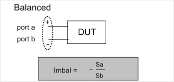  
---  
  
Imbalance parameter when measuring a single-ended \- balanced device.
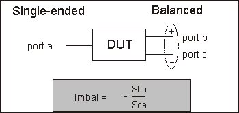  
---  
  
Imbalance parameter when measuring a balanced \- single-ended device.
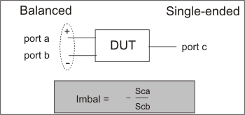  
---  
  
Imbalance1 and Imbalance2 parameters when measuring a balanced \- balanced
device. 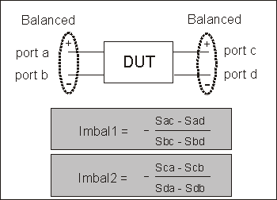  
---  
  
Imbalance1 and Imbalance2 parameters when measuring a single-ended \- single-
ended - balanced device. 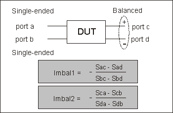  
---  
  
### Measuring CMRR (Common Mode Rejection Ratio)

CMRR is a ratio of the transmission characteristic in differential mode over
the transmission characteristic in the common mode of the balanced port as the
measurement parameter. A high value indicates more rejection of common mode,
which is desirable in a device that transmits information in the differential
portion of the signal. The table below shows the CMRR parameter you can select
when measuring each balanced device.

Single-ended - balanced device | Sds21  
\---------  
Scs21 | and | Ssd12  
\---------  
Ssc12  
---|---|---|---  
Balanced - single-ended device | Ssd21  
\---------  
Ssc21 | and | Sds12  
\---------  
Scs12  
Balanced - balanced device | Sdd21  
\---------  
Scc21 |  |   
Single-ended \- single-ended - balanced device | Sds31  
\---------  
Scs31 | and | Sds32  
\---------  
Scs32  
  
### Device Topology and Port Mapping

As we have seen on balanced inputs and outputs, the signal of interest is the
difference or average of two BALANCED input or BALANCED output lines. It is
also possible to have single-ended ports AND balanced ports on the same
device. The two balanced input or output lines are referred to as a single
"logical" port.

When configuring a balanced measurement on the analyzer, select a device
'topology'. Then map each test port to the DUT ports. The analyzer assigns
"logical ports". [See how to set device
topology.](Measurement_Parameters.htm#topology)

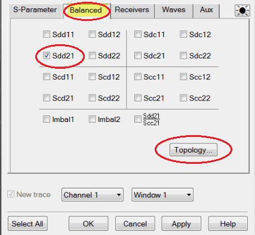

The following device topologies can be measured by a 4-port analyzer.

  * Balanced / Balanced  
(2 logical ports - 4 physical ports)  
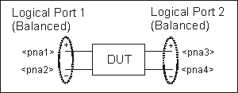

  * Single-ended / Balanced  
(2 logical ports - 3 physical ports)  
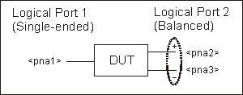

  * Balanced / Single-ended  
(2 logical ports - 3 physical ports)  
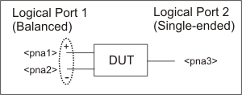

  * Single-ended \- Single-ended / Balanced  
(3 logical ports - 4 physical ports)  
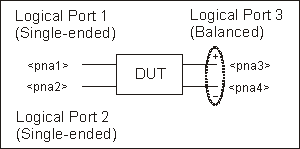

These topologies can be used in the reverse (<==) direction to measure:

  * Balanced / Single-ended topology

  * Balanced / Single-ended \- Single-ended topology

For example, to measure a Balanced / Single-ended topology, measure the S12
(reverse direction) of a Single-ended / Balanced topology.

### Calibrating Balanced Measurements

Balanced measurements are calibrated in the same manner as single-ended
(standard) measurements. However, for highest accuracy, you must choose Thru
paths so that each transmission path of the balanced measurement is
represented. For a Balanced/Balanced topology, this means that FOUR Thru
connections should be made.

For example (see following image):

  * Balanced Port 1 is ports 1 and 3

  * Balanced Port 2 is ports 2 and 4

  * Thru paths to be calibrated should be: 12, 14, 32, 34.

  * Paths 13, and 24 are less important.

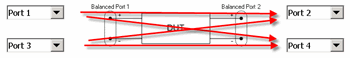

To select Thru paths:

  1. From SmartCal, on the Select DUT Connectors and Cal Kits page, check Modify Cal.

  2. Click Next to see the following Cal Wizard page:

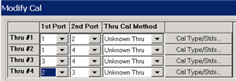

### How the analyzer makes Balanced Measurements

When using standard Balanced measurements, the analyzer does not provide true
balanced measurements by stimulating both balanced inputs together and
measuring both outputs relative to one another. Instead, the analyzer makes
only Single-ended measurements. On a Balanced/ Balanced device, it stimulates
each input and measures each output individually. From the output data, the
analyzer calculates the Differential and Common outputs from the DUT using the
math formulas below. However, all measurements and calculations are performed
in frequency domain using complex (magnitude and phase) data. The Balanced
S-parameter display data is then calculated from the Differential and Common
inputs and outputs.

In [iTMSA](../Applications/iTMSA.md), the VNA DOES stimulate both balanced
inputs with true balanced sources.

Differential to Differential

Sdd11=0.5*(S11-S21-S12+S22)

Sdd12=0.5*(S13-S23-S14+S24)

Sdd21=0.5*(S31-S41-S32+S42)

Sdd22=0.5*(S33-S43-S34+S44)

Common to Differential

Sdc11=0.5*(S11-S21+S12-S22)

Sdc12=0.5*(S13-S23+S14-S24)

Sdc21=0.5*(S31-S41+S32-S42)

Sdc22=0.5*(S33-S43+S34-S44)

Differential to Common

Scd11=0.5*(S11+S21-S12-S22)

Scd12=0.5*(S13+S23-S14-S24)

Scd21=0.5*(S31+S41-S32-S42)

Scd22=0.5*(S33+S43-S34-S44)

Common to Common

Scd11=0.5*(S11+S21+S12+S22)

Scd12=0.5*(S13+S23+S14+S24)

Scd21=0.5*(S31+S41+S32+S42)

Scd22=0.5*(S33+S43+S34+S44)

* * *

