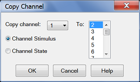

# Copy Channels

* * *

Copy channels allows you to make a duplicate channel of the same [Measurement
Class](Measurement_Classes.htm) and with the same stimulus conditions as an
existing channel.

  * [Why Copy Channels](CopyChannels.md#Why)

  * [How to Copy Channels](CopyChannels.md#How)

  * [List of Channel Settings](CopyChannels.md#List)

Note: Copy Channels CAN be used with [PNA
Applications](../Applications/Applications.htm), such as FCA, Gain
Compression, or Noise Figure.

[Other Setup Measurements Topics](Select_a_Measurement_State.md)

Why Copy Channels

Copy channel settings if you need to create several channels that have
slightly different settings.

For example, if you have an amplifier that you want to characterize over a
frequency span with several different input power levels.

Follow these steps:

  1. Create one measurement with your optimized channel settings.

  2. Copy that channel to new channels.

  3. Change the power level on the new channels.

The alternative to using Copy Channels is to create new default measurements
on new channels. Then change every channel setting to your new requirement.
This is very time consuming and thus shows the benefit of the Copy Channels
feature.

### How to Copy Channels  
  
---  
Using Hardkey/SoftTab/Softkey  
  
  1. Press Channel > Channel Setup > Copy Channel.
  2. Click Copy to Active Window/Copy to New Window/Copy Channel....

  
  
Copy Channel dialog box help  
---  
 Copies an existing channel's settings to
another channel. Measurement traces from the source channel are NOT copied.
Copy channel (also known as 'Source' channel): Select a channel to copy. to
(also known as 'Destination' channel): Scroll to select a channel to copy
settings to. Compatible channel numbers that are currently being used are
highlighted. They can be selected and overwritten. The following are
compatible destination channels:

  * A channel that does not yet exist. The new channel is created with the channel's default measurement.
  * A channel of the same [Measurement Class](Measurement_Classes.md) as the source. The existing measurements remain on the destination channel.
  * A channel of any Measurement Class that contains no measurements. Again, the destination channel is created with the channel's default measurement.

Notes:

  * You can copy channel settings to ONLY one new or existing channel. Repeat this operation to copy to more than one channel.
  * The source channel is ALWAYS copied to the Active window. If you want the destination channel in a separate window, first create a compatible new measurement in a new window. Then make sure it is the Active window before you copy the channel into it.
  * The measurement in the destination channel becomes the active measurement.

For example:

  1. Source channel 1: Standard S21 measurement
  2. Destination NEW channel 2
  3. Result: Source channel 1, S21 Measurement AND channel 2, S11 measurement. Both with same stimulus settings and in the same window. Channel 2, S11 measurement is the active measurement.

For more information see [Traces, Channels, and
Windows](../S0_Start/Traces_Channels_and_Windows.htm)  
  
List of Channel Settings

  * [Source Power Cal data](../S3_Cals/PwrCalibration.md)

  * [IF Bandwidth](../S2_Opt/Trce_Noise.md#IFDiag)

  * [Number of Points](DPoints.md)

  * [Sweep Settings](Sweep.md)

  * [Average](../S2_Opt/Trce_Noise.md#averaging)

  * [Trigger (some settings)](Trigger.md)

  * [Fixturing Settings](../Programming/Using_Fixture_Simulator.md)

  * [Balanced Measurements](Balanced_Measurements.md)

  * [TMSA Settings](../Support/Configurations.md#S93460A)

  * [Channel Coupling Settings](../Programming/GP-IB_Command_Finder/Sense/Couple.md)

  * [Interface Control Settings](../System/Interface_Control.md)

  * [Phase Control](Phase_Control.md)

  * [External Devices](../System/Configure_an_External_Device.md)

  * Pulse Settings

* * *

