# Customize the Analyzer Screen

* * *

You can customize your analyzer screen by showing or hiding the following
display elements. All of these selections are made from the Response > Display
menu.

  * [Windows](../s0_start/traces_channels_and_windows.md#window) (Separate topic)

  * [Display Labels](customize_your_analyzer_screen.md#Labels)

  *     * [Trace Status](customize_your_analyzer_screen.md#Trace_Status)

    * [Y-axis Labels](customize_your_analyzer_screen.md#Y-axisLabels)

    * [X-axis Labels](customize_your_analyzer_screen.md#X-axisLabels)

    * Trace Annotation for All Traces

  * [Marker Display](../s4_collect/markers.md#Display) (Separate topic)

  * [Tables](customize_your_analyzer_screen.md#tables)

  * [Toolbars](customize_your_analyzer_screen.md#Toolbars)

  *     * [Softkey](customize_your_analyzer_screen.md#Softkey)

    * [Hardkey](customize_your_analyzer_screen.md#Hardkey)

    * [Port Extension](../s3_cals/port_extensions.md)

    * [Transform](customize_your_analyzer_screen.md#Time)

    * [Marker](customize_your_analyzer_screen.md#markers_tb)

    * [Cal Set Viewer](customize_your_analyzer_screen.md#CalSetViewerToolbar)

    * [Title Bars](customize_your_analyzer_screen.md#title_bars)

    * [Active Entry](customize_your_analyzer_screen.md#act_ent_tb)

    * [Status bars](customize_your_analyzer_screen.md#StatusBar)

    * [Active Port](Customize_Your_Analyzer_Screen.md#active_port)

    * [System Date and Time](customize_your_analyzer_screen.md#clock)

  * [Display Colors](../system/display_colors.md) (Separate topic)

  * [Grid: SOLID | Dotted](customize_your_analyzer_screen.md#GridLines)

  *     * [Grid Lines](customize_your_analyzer_screen.md#GridLines)

    * [Y-axis Divisions](customize_your_analyzer_screen.md#Y-axisDiv)

    *     * [Show Table](customize_your_analyzer_screen.md#ShowTable)

  * [Tools](customize_your_analyzer_screen.md#Tools)

  * Colors

  * [Window Title](customize_your_analyzer_screen.md#WindowTitle)

  * [Trace Title](customize_your_analyzer_screen.md#TraceTitle)

  * [Frequency/Stimulus](customize_your_analyzer_screen.md#freq_stim)

  * [Minimize Application](customize_your_analyzer_screen.md#Minimize)

### See Also

[Expanded display capabilities of the
PNA-X](../Front_Panel/XScreen.htm#rightClick)

[Traces, Channels, and Windows](../S0_Start/Traces_Channels_and_Windows.md)

[See other 'Setup Measurements' topics](Select_a_Measurement_State.md)

## Labels

You can display different labels for traces status, Y-axis and X-axis labels.

####  How to display labels  
  
---  
Using Hardkey/SoftTab/Softkey |  Using a mouse  
  
  1. Press Display > Display Setup > Customize Display....
  2. Select Labels tab.

OR

  1. Press Marker > Marker Setup > Marker Display....
  2. Select Labels tab.

|

  1. Right click on any window area.
  2. Click Customize Display....
  3. Select Labels tab.

  
  
Labels tab Dialog Box Help  
---  
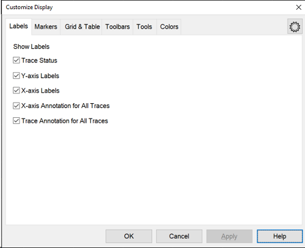 Show Labels Trace Status |  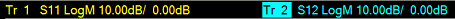  
---  
Trace status is annotated at the top of each window. The highlighted trace
number indicates Active Trace. Click the title to select a trace.  
  
Trace Status shows the following:

  * Trace number (Tr x). This is the trace number of the channel; NOT the window trace number which is used in many programming commands

    * MTrn.m (Ex. MTr1.1) indicates the data trace for memory. See [Data -> New Trace](../S4_Collect/Math_Operations.md#Data-_New_Trace).

  * Measurement parameter. This can be replaced with a custom [Trace Title](customize_your_analyzer_screen.md#TraceTitle).

  * Format

  * Scaling factor

  * Reference level

[How to show/hide Trace Status.](customize_your_analyzer_screen.md#Labels)

Y-axis Labels

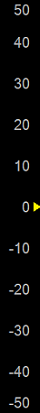

"Y-axis Labels" \- allows user to show or hide the y-axis labels.

[How to show/hide Y-axis Labels.](customize_your_analyzer_screen.md#Labels)

X-axis Labels

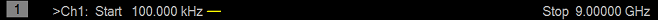

[How to show/hide X-axis Labels.](customize_your_analyzer_screen.md#Labels)

X-axis Annotation for All Traces

Show the X-axis annotation for all traces. (Left: Checked, Right: Unchecked)

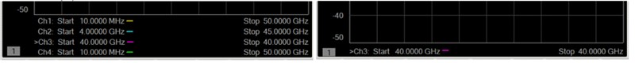

Trace Annotation for All Traces

Select to display trace annotation for all traces. (Left: Checked, Right:
Unchecked)

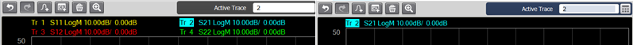  
  
## Grid & Tables

#### How to set VNA Grid and display tables.

Each window can display only one table at a time.  
---  
Using Hardkey/SoftTab/Softkey |  Using a mouse  
  
  1. Press Display > Display Setup > Customize Display...
  2. Select Grid tab.

OR

  1. Press Marker > Marker Setup > Marker Display....
  2. Select Grid tab.

|

  1. Right click on any window area.
  2. Click Customize Display....
  3. Select Grid tab.

  
  
Grid & Table Dialog Box Help  
---  
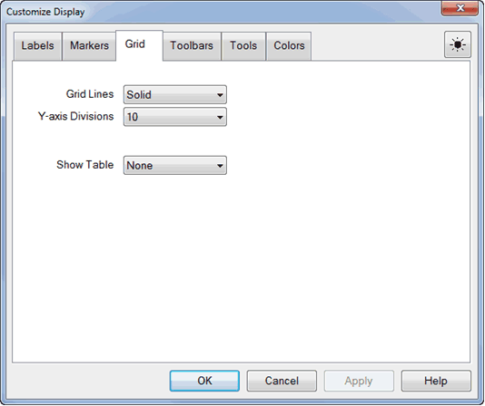 Grid Lines: Solid | Dotted \- Set whether to display ALL open window grid lines in solid or dotted lines. The selected setting is shown in CAPS. Once set, new windows are created using this setting. Grid lines return to SOLID when the VNA is Preset. Set the color of the grid using [Display Colors.](../system/display_colors.md) [How to display grid settings](customize_your_analyzer_screen.md#tables) Y-axis Divisions \- Set the desired rows of Y-axis, it can shows 2 to 30. **** Show Table None \- Turn OFF the table.

* * *

Marker Table You can display a table of marker settings. These settings
include the:

  * Marker number
  * Marker reference (for delta measurements)
  * Frequency
  * Time and Distance (for Time Domain measurements)
  * Response

[Learn more about Markers](../s4_collect/markers.md)

* * *

Limit Line Table You can display, set up, and modify a table of limit test
settings. These include:

  * Type (MIN, MAX, or OFF)
  * Beginning and ending stimulus values
  * Beginning and ending response values

[Learn more about Limit Lines](../s4_collect/use_limits_to_test_devices.md).

* * *

Ripple Table You can display, set up, and modify a table of maximum ripple
limit over frequency range settings. These include:

  * Type (ON or OFF)
  * Beginning stimulus value
  * Ending stimulus value
  * Maximum ripple

[Learn more about Ripple
limits](../S4_Collect/Use_Ripple_Limit_Test.htm#RippleTable).

* * *

Segment Sweep Table You can display, set up, and modify a table of segment
sweep settings. These include:

  * State (On/Off)
  * Start and Stop frequencies
  * Number of Points
  * IF Bandwidth (if independent levels)
  * Power Level (if independent levels)
  * Sweep Time (if independent levels)

[Learn more about Segment Sweep](sweep.md#segment).

* * *

Distortion Table You can display,set up, and modify a table of modulation
distortion measurement parameters. Each row represents a measurement band.
Each column represents a measurement parameter. [Learn more about the
Distortion
Table](../Applications/Modulation_Distortion/Displaying_Distortion_Parameters.htm#Distortion_Table_dialog_help).

* * *

Spurious, Integrated Noise, Spot Noise Tables You can display,set up, and
modify a tables of phase noise measurement parameters. [Learn more about the
Phase Noise.](../Applications/Phase_Noise/Configuring_Phase_Noise.htm)  
  
## Toolbars

You can display different toolbars to allow you to easily set up and modify
measurements.

#### How to display Toolbars  
  
---  
Using Hardkey/SoftTab/Softkey |  Using a mouse  
  
  1. Press Display > Display Setup > Customize Display...
  2. Select Toolbars tab.

OR

  1. Press Marker > Marker Setup > Marker Display....
  2. Select Toolbars tab.

|

  1. Right click on any window area.
  2. Click Customize Display....
  3. Select Toolbars tab.

  
  
Toolbars Dialog Box Help  
---  
 Show Toolbar Note:
There is also a Cal Set toolbar available for [Monitoring Error
Terms](../s3_cals/errors.htm#promouse) Softkey
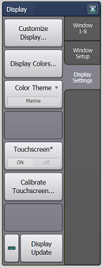 Softkey is a combination of softkeys
and SoftTabs. Softkeys are automatically turned ON when one of the 'function'
hardkeys is pressed. This setting allows you to turn the softkeys OFF to show
more measurement space on the screen. The softkeys will reappear when another
function hardkey is pressed. Hardkey 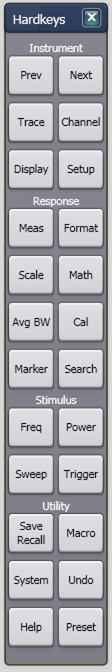 These
keys also known as Front Keys, perform interface operations that are
equivalent to those of keys in the INSTRUMENT keys, RESPONSE keys, STIMULUS
keys and UTILITY keys on the front panel of VNA. [Learn
more.](../Front_Panel/XScreen.htm#Hardkeys1) Port Extensions Toolbar
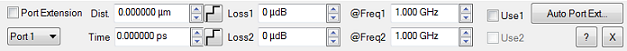 The Port Extension toolbar allows you
to set Port Extensions while viewing the measurement trace. Learn more about
[Port Extensions](../s3_cals/port_extensions.md). Transform (Time Domain)
Toolbar 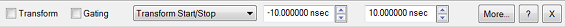 The Time Domain toolbar
allows you to do the following:

  * Turn Transform and Gating ON/OFF.
  * Change the Start/Stop times for both Transform and Gating.
  * More... - Launches the [Time Domain Transform](../Time/TimeDomain.md#TransformDiag) dialog box.
  * ? \- Display the help file.
  * X \- Closes the toolbar.

Markers Toolbar 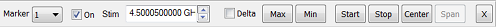 The markers toolbar
allows you to set up and modify markers. It shows:

  * Marker number
  * Stimulation value
  * Marker functions:
  *     * Delta
    * Max/Min
    * Start/Stop
    * Center/Span

Tip: To use the Front Panel Knob to change marker position, first click the
Stimulus field of the marker toolbar and then turn the knob. [Learn more about
Markers](../s4_collect/markers.htm) Cal Set Viewer Toolbar
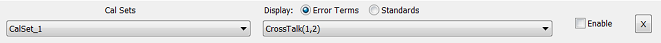 [Learn more about Cal Set
Viewer](../S3_Cals/Errors.htm#Monitoring). All Off (NOT on softkeys) This
allows you to hide all toolbars with a single selection. NOT available on
sofkeys.

* * *

Other Bars Main Title 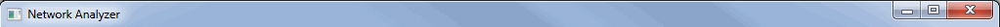 The Main Title shows
the title of VNA window and Minimize / Maximize icons.

  *  Checked - Title bars for all VNA window are shown.
  *  Cleared - Title bars for all VNA window are hidden. This allows more room to display measurement results.

Active Entry Toolbar 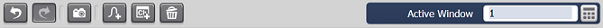 When used
with softkeys, this area allows numeric values to be entered for settings.
From the keyboard, enter G for Giga, M for Mega or milli, K for kilo and so
forth. Status Bar 2 Bars 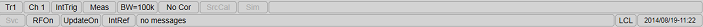 When enabled, the
status bar is displayed along the bottom of the VNA screen. The primary status
bar shows the following: Tip: Right-click on many of these items in the status
bar for quick access to settings.

  * Active trace
  * Active channel
  * [Trigger source](trigger.md#source)
  * [Channel Trigger State](trigger.md#channel_state) (Hold, Single, Continuous)
  * [IF Bandwidth](../s2_opt/trce_noise.md#Variable_IF_Bandwidth)
  * [Error correction](../s3_cals/error_correction_and_interpolation.md#Viewing) for the active trace to the Basic cal, Smart cal and Calibrate All Channels.
  *     * F: Full Port Calibration, R: Response Calibration, -: Nothing
  * Reference (Internal/ [External](../Rear_Panel/XRtour.md#10M))
  * [Source Power Calibration](../S3_Cals/PwrCalibration.md#PerformSourcePowerCal)
  * Service (shows when the measurement result is not guaranteed such as hardware failure. The advance mode in TDR also indicates the Service.)
  * [RF power](Power_Level.md#powerDiag)
  * [Display Update](../System/Display_Update.md)
  * [Error messages](../support/pna_errors.md)
  * [GPIB status](../programming/learning_about_gpib/how_to_configure_for_gpib_scpi_and_sicl.md): Local (LCL), Remote Talker Listener (RMT), or System Controller (CTL).
  * [System Date and Time](customize_your_analyzer_screen.md#clock) \- Can be set ON or OFF. [How to show/hide the VNA clock.](customize_your_analyzer_screen.md#clock)
  * Status Area
    * [Trace Deviation](../S4_Collect/Math_Operations.md#Trace_Deviation)
    *     * TDR
    * Conversion
    * Time Domain 

Note: A second level status bar appears when using External Test Set Control
or Interface control. The status bar state (ON or OFF) will not change when
the VNA is Preset. Clock (System Date and Time) The VNA system date and time
can be shown in the far right corner of the status bar. The format is: year-
month-day hr:min and can NOT be changed. To hide the clock, right click the
mouse on the clock and then click Hide Clock. Learn how to set the VNA time
settings. **Active Port** Check to enable the active port feature. All VNA
port numbers will be displayed in a status bar whether they are active or not.
The currently active port will be highlighted in blue. If the ports change
state more quickly than 4 Hz in standard channel, all active ports will be
highlighted with a constant blue color. The location of the active port
indicators depend on the state of the ["2
Bars"](Customize_Your_Analyzer_Screen.htm#2_bars) selection, the number of VNA
ports and the width of the display. Selecting Measurement Class other than
Standard will disable the Active Port Pane. If both Application and Standard
measurement channels are selected, the indications for Standard channel will
only be shown on the pane.  Use-Case example: 1\. ["2
Bars"](Customize_Your_Analyzer_Screen.htm#2_bars) is OFF. The active port
indicators on 2nd bar. 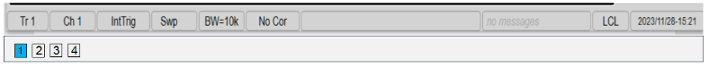 2\.
["2 Bars"](Customize_Your_Analyzer_Screen.md#2_bars) is ON. The active port
indicators on 1st bar. 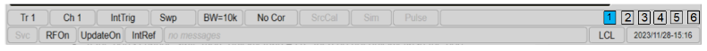 3\. ["2
Bars"](Customize_Your_Analyzer_Screen.htm#2_bars) is ON. The active port
indicators on 3rd bar. (when number of port indicators > (Wapp-1000)/20, where
Wapp is application width in pixels.)
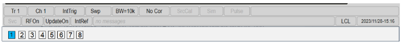 Display Sheet Tabs Top
\- Display sheet tabs above display. Bottom \- Display sheet tabs below
display.  
  
## Tools

#### How to set Tools settings  
  
---  
Using Hardkey/SoftTab/Softkey |  Using a mouse  
  
  1. Press Display > Display Setup > Customize Display...
  2. Select Tools tab.

OR

  1. Press Marker > Marker Setup > Marker Display....
  2. Select Tools tab.

|

  1. Right click on any window area.
  2. Click Customize Display....
  3. Select Tools tab.

  
  
Tools Dialog Box Help  
---  
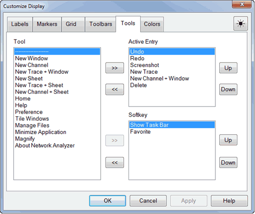 Tools function to create a shortcut icon to
display on Active Entry or Softkey Toolbar. The maximum icons can display on
Active Entry is 9, while Softkey Toolbar is 12. New Window - Create a new
window. 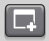 New Channel - Create a new channel
on active window. 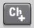 New Channel + Window \-
Create a new trace and channel to a new window.
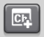 New Trace - Create a new trace on
active window. 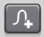 New Trace + Window - Create
a new trace to a new window, but the channel is remain.
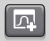 New Sheet - Create a new sheet.
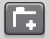 New Trace + Sheet - Create a new trace to a
new sheet, but the channel is remain. 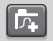
New Channel + Sheet \- Create a new trace and channel to a new sheet.
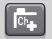 Home \- Display VNA Home softkeys.
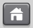 Favorite \- Set favorite application. To Add a
Favorite, press and hold any softkey for three seconds and select the desired
Favorite number (Favorite 1 to 3).  Help \-
Shows Help file. 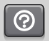 Show Task Bar \- Shows Window
bar. 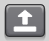 Preference \- Display preference
dialog box. 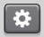 Tile Windows
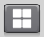 Manages Files - Use to manage the saved
files in the "D:\" drive folder. [Learn
more.](../s5_output/saverecall.htm#Manage_files)
 Minimize Application \- Restore VNA
screen. [Learn more.](customize_your_analyzer_screen.md#Minimize)
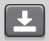 About Network Analyzer \- Display
[About Network Analyzer](../s0_start/helpabout.md) dialog box.
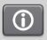 Undo \- Recover to previous version. [Learn
more.](undo.htm)  Redo \- Set to latest version.
[Learn more.](undo.md) 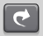 Screenshot \- Save
screen figure to "D:\" drive (D:\\). 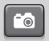
Delete \- Delete the active window.   
  
## Colors

#### How to set colors  
  
---  
Using Hardkey/SoftTab/Softkey |  Using a mouse  
  
  1. Press Display > Display Setup > Customize Display...
  2. Select Colors tab.

|

  1. Right click on any window area.
  2. Click Customize Display....
  3. Select Colors tab.

  
  
Colors Dialog Box Help  
---  
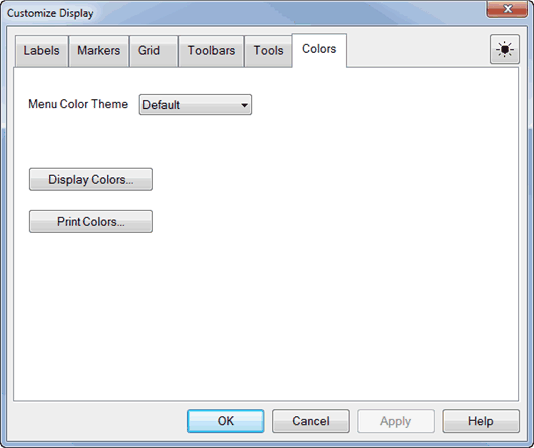 Menu Color Theme \- Select color theme
Display Colors... \- See [Display Colors](../system/display_colors.md) Print
Colors... \- See [Print Preview](../System/Display_Colors.md#PrintPreview)  
  
### Window Title

You can create and display a title for each window.

  * The limit is set by the number of windows that are displayed.

  * The title (My Window) is annotated in the upper-left of the window as follows:

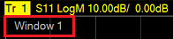

#### How to enter a Window Title  
  
---  
Using Hardkey/SoftTab/Softkey |  Using a mouse  
  
  1. Press Display > Window Setup > Window Title....

|

  1. Move a cursor in the grid and then right click.
  2. Select Title....

  
  
Window Title Dialog Box Help  
---  
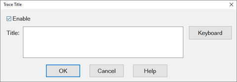

  1. Click Enable, then type the window title. Click Keyboard to type with a mouse.
  2. To remove the window title, clear the Enable checkbox or delete the text from the dialog entry.

  
  
## Trace Title

A Trace Title overwrites the Measurement Parameter in the [Trace
Status](customize_your_analyzer_screen.htm#Trace_Status) area, the [Status
Bar](customize_your_analyzer_screen.htm#StatusBar) and [hardcopy
prints](../s5_output/print.htm#printout).

  * This title has priority over [Equation Editor](../s4_collect/equation_editor.md) titles.

  * The practical limit is about 70 characters if there is only one trace.

  * Spaces are accepted but not displayed; use underscores.

  * The title is annotated as follows:

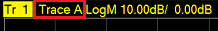

#### How to enter a Trace Title  
  
---  
Using Hardkey/SoftTab/Softkey |  Using a mouse  
  
  1. Press Trace > Trace Setup > Trace Title....

|

  1. Move a cursor in the grid and then right click.
  2. Select Trace Title....

  
  
Trace Title Dialog Box Help  
---  
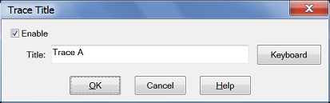

  1. Click Enable, then type the window title. Click Keyboard to type with a mouse.
  2. To remove the window title, clear the Enable checkbox or delete the text from the dialog entry.

  
  
## Frequency/Stimulus

Frequency/stimulus information is displayed at the bottom of each window on
the screen. It shows:

  * Channel number

  * Start value

  * Stop value

How to show/hide Frequency/Stimulus information

* * *

## Minimize Application

The Network Analyzer application can be minimized to show the desktop and
Windows taskbar.

  1. Click System > Main > Minimize Application.

To restore the VNA application, double-click the VNA application on the
desktop.

* * *

