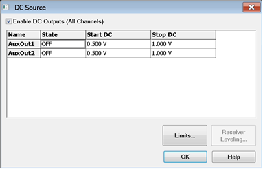
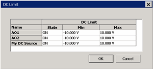

# DC Source Control

* * *

When a DC Source (power supply) is configured as an external device, the new
DC source can be controlled from the VNA using this dialog. Internal DC
Sources are also controlled from this dialog.

  * [How to start the DC Source Control dialog](DC_Control.md#How)

  * [The](DC_Control.md#DCControl) [DC Source Control dialog box](CopyChannels.md#How)

  * [The DC Limits dialog box](DC_Control.md#DCLimits)

### See Also

[Configure the DC Source as an External
Device](../System/Configure_an_External_Device.htm)

[Internal DC Sources - ADC Measurements](ADC_Measurements.md)

[Other Setup Measurements Topics](Select_a_Measurement_State.md)

### How to start the DC Source Control dialog  
  
---  
Using Hardkey/SoftTab/Softkey | Using a mouse  
  
  1. Press Sweep > Source Control > DC Source....

|

  1. Click Stimulus.
  2. Select Sweep.
  3. Select Source Control.
  4. Select DC Source.

  
  
DC Source Control dialog box help  
---  
 Note: The 9-pin PWR I/O (Power I/O) D
connector on the rear-panel replaces much of the functionality of the AUX I/O
connector on older VNA models. The Power I/O voltages can be set using the
following methods:  
  
\- [CONTrol:AUXiliary:OUTPut:VOLTage](../Programming/GP-
IB_Command_Finder/ControlAux.htm#output) or [put_OutputVoltage
Method](../Programming/COM_Reference/Methods/put_OutputVoltage_Method.htm) (no
GUI equivalent, global scoped, and settings not saved as part of the
instrument state)  
\- [SOURce:DC:START](../Programming/GP-IB_Command_Finder/SourceDC.md#start)
and [SOURce:DC:STOP](../Programming/GP-IB_Command_Finder/SourceDC.md#stop)
(DC Source dialog is the GUI equivalent, channel scoped, and settings saved as
part of the instrument state)  
\- [Interface Control dialog](../System/Interface_Control.md#Aux) (no remote
equivalent, channel scoped, and settings saved as part of the instrument
state)  
  
To avoid unexpected behavior, choose one method only to set the Power I/O
voltages. Name Lists the names of the configured DC Sources. In the above
image:

  * AuxOut1 and AuxOut2 are internal VNA DC sources that are available
  *     * Rear-panel Power I/O connector (Pins 3 and 4). [Learn more](../Rear_Panel/XPwrIO.md).
  * MyDCSupply is the name of an external DC Source. [Learn how to setup and configure an External DC Source and DC Meter.](../System/Configure_a_DC_Device.md)

State Set the state of the DC source.

  * ON DC Source is always ON.
  * OFF DC source is always OFF.
  * Per Port The Name selection for that DC source expands to allow an Port <n> / N/A setting for each VNA port. When the RF source for that port <n> is ON, then the DC source for port <n> is also ON. Select 'N/A' to turn the DC Source OFF for that port.

Start / Stop DC Set the start and stop voltages of the DC source. The VNA will
step the voltage of the DC source from Start to Stop in increments = (Stop -
Start)/Number of data points.

### Buttons

Limits Click to start the DC Limits dialog. Receiver Leveling For future use.  
  
DC Limits dialog box help  
---  
 Select the Minimum and Maximum voltages
to which the specified DC sources can be set by the VNA. When the DC source
level exceeds the limit, DC source is turned off and the measurement sweep
stops.  
  
---  
  
* * *

* * *

