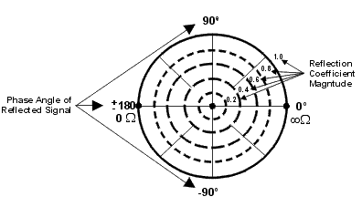
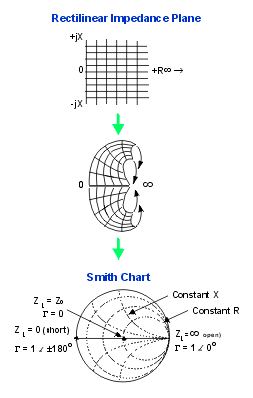
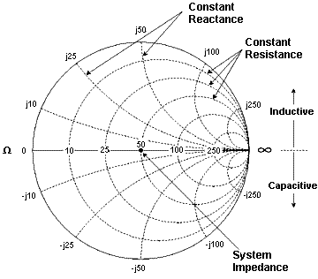

# Data Format

* * *

A data format is the way the analyzer presents measurement data graphically.
Pick a data format appropriate to the information you want to learn about the
test device.

  * [How to set Format](Data_Format.md#change)

  * [Rectangular (Cartesian) Display Formats](Data_Format.md#Rec_display_form)

  * [Polar](Data_Format.md#Polar)

  * [Smith Chart](Data_Format.md#Smith_Chart)

  * Temperature

[See other 'Setup Measurements' topics](Select_a_Measurement_State.md)

### How to set the Display Format  
  
---  
Using Hardkey/SoftTab/Softkey | Using a mouse  
  
  1. Press Format > Format 1 or Format 2.

|

  1. Right-click on the trace status area above the grid box.
  2. Click Format.
  3. Select the desired format.

  
  
  
Format dialog box help  
---  
Click a link to learn about that format: | [Log Mag](Data_Format.md#Log_Mag) | [Polar](Data_Format.md#Polar) | [Complex](Data_Format.md#Complex)  
---|---|---  
[Phase / Unwrapped Phase](Data_Format.md#Phase) | [Linear Mag](Data_Format.md#Lin_Mag) | Temperature   
[Group Delay](Data_Format.md#Group_Delay) | [SWR](Data_Format.md#SWR) | [Kelvin](Data_Format.md#temp)  
[Smith / Inverse Smith Chart](Data_Format.md#Smith_Chart) | [Real](Data_Format.md#Real_Format) | [°F](Data_Format.md#temp)  
Positive Phase | [Imaginary](Data_Format.md#Imag_Format) | [°C](Data_Format.md#temp)  
  
### Format Unit

Only the following Formats allow a Unit selections:

Log Mag \- Choose from:

  * dB (Decibel)

  * dBm (Power)

  * dBmV (dB milli Volts) - used for unratioed receiver measurements.

  * dBuV (dB micro Volts) - used for unratioed receiver measurements.

  * dBmA (dB milli Amps) - used for unratioed receiver measurements.

Lin Mag \- Choose from:

  * U (no units), W (Watts), V, (volts), A (amps)

  
  
Rectangular Display Formats

Seven of the nine available data formats use a rectangular display to present
measurement data. This display is also known as Cartesian, X/Y, or
rectilinear. The rectangular display is especially useful for clearly
displaying frequency response information of your test device.

  * Stimulus data (frequency, power, or time) appears on the X-axis, scaled linearly

  * Measured data appears on the Y-Axis.

### Log Mag (Logarithmic Magnitude) Format

  * Displays Magnitude (no phase)

  * Y-axis: dB

  * Typical measurements:

  *     * Return Loss

    * Insertion Loss or Gain

### Phase Format

Measures the phase of a signal relative to the calibration reference plane
with a range of +/- 180 degrees.

  * Displays Phase (no magnitude)

  * Y-axis: [Phase](JavaScript:hhctrl.TextPopup\(Phase,'Arial,8',10,10,00000000,0xc0ffff\)) (degrees)

  * The trace 'wraps' every 180 degrees for easier scaling.

  * Typical Measurements:

  *     * [Deviation from Linear Phase](../Tutorials/Phase_Devi.md)

### Unwrapped Phase

  * Same as Phase, but without 180 degree wrapping.

Note: Phase is unwrapped by comparing the phase from one data point to the
next. If the phase difference between two points is greater than 180 degrees,
or if the phase of the first data point is greater than 180 degrees from DC,
than the phase measurement is probably NOT accurate.

### Positive Phase

Displays the phase wrapped between 0 to +360 degrees.

### Group Delay Format

  * Displays signal transmission (propagation) time through a device

  * Y-axis: Time (seconds)

  * Typical Measurements:

  *     * Group Delay

### See Also:

[Group Delay](../Tutorials/Group_Delay6_5.md) (Measurement)

[Comparing the analyzer Delay
Functions.](../Tutorials/Comparing_the_PNA_Delay_Functions.htm)

[Phase Measurement Accuracy](../S2_Opt/Phase_Accy.md)

### Linear Magnitude Format

  * Displays positive values only

  * Y-axis: Unitless (U) for ratioed measurements  
Watts (W) for unratioed measurements.

  * Typical Measurements:

  *     * reflection and transmission coefficients (magnitude)

    * time domain transfer

### SWR Format

  * Displays reflection measurement data calculated from the formula (1+r)/ (1-r) where r is reflection coefficient.

  * Valid only for reflection measurements.

  * Y axis: Unitless

  * Typical Measurements:

  *     * SWR

### Real Format

  * Displays only the real (resistive) portion of the measured complex data.

  * Can show both positive and negative values.

  * Y axis: Unitless

  * Typical Measurements:

  *     * time domain

    * auxiliary input voltage signal for service purposes

### Imaginary Format

  * Displays only the imaginary (reactive) portion of the measured data.

  * Y - axis: Unitless

  * Typical Measurements:

  *     * impedance for designing matching network

Polar Format

Polar format is used to view the magnitude and phase of the reflection
coefficient (G) from your S11 or S22 measurement.

You can use Markers to display the following:

  * Linear magnitude (in units) or log magnitude (in dB)

  * Phase (in degrees)

  * The dashed circles represent reflection coefficient. The outermost circle represents a reflection coefficient (G) of 1, or total reflected signal. The center of the circle represents a reflection coefficient (G) of 0, or no reflected signal.

  * The radial lines show the phase angle of reflected signal. The right-most position corresponds to zero phase angle, (that is, the reflected signal is at the same phase as the incident signal). Phase differences of 90°, ±180°, and -90° correspond to the top, left-most, and bottom positions on the polar display, respectively.

Smith Chart Format

The Smith chart is a tool that maps the complex reflection coefficient (G) to
the test device's impedance.

In a Smith chart, the rectilinear impedance plane is reshaped to form a
circular grid, from which the series resistance and reactance can be read (R +
jX).

You can use Markers to display the following:

  * Resistance (in units of ohms)

  * Reactance as an equivalent capacitance (in units of farads) or inductance (in units of henrys)

### Inverse Smith Chart (also known as Admittance)

Same as standard Smith Chart , except:

  * The plot graticule is reversed right-to-left.

  * Admittance (in units of siemens) instead of resistance.

### Interpreting the Smith Chart

  * Every point on the Smith Chart represents a complex impedance made up of a real resistance (r) and an imaginary reactance (r+-jX)

  * The horizontal axis (the solid line) is the real portion of the impedance - the resistance. The center of the horizontal axis always represents the system impedance. To the far right, the value is infinite ohms (open). To the far left, the value is zero ohms (short)

  * The dashed circles that intersect the horizontal axis represent constant resistance.

  * The dashed arcs that are tangent to the horizontal axis represent constant reactance.

  * The upper half of the Smith chart is the area where the reactive component is positive and therefore inductive.

  * The lower half is the area where the reactive component is negative and therefore capacitive.

### Complex

  * Displays the real (resistive) portion of the measured complex data on the X axis and the imaginary (reactive) portion of the measured complex data on the Y axis.

#### X axis annotation

There is X-axis annotation for 2-D plot, and it takes window area for all
traces in the window. The X-axis annotation area is reserved when there is at
least one trace that the format is complex.

The annotation area can be turned off with the SCPI command
[:DISPlay:WINDow:ANNotation:X:STATe](../Programming/GP-
IB_Command_Finder/Display.htm#AnnXstate).

When the rectangular trace is selected, the X axis annotation area gets blank,
while the complex trace still showing.

When there is no trace with complex format, the X axis annotation area is
collapsed.

When [:DISPlay:WINDow:ANNotation:X:STATe](../Programming/GP-
IB_Command_Finder/Display.htm#AnnXstate) is set to off, the X axis annotation
area is also collapsed even if there are some traces with complex format.

### Kelvin, °F, and °C

Used to display temperature, primarily with the Noise Figure application.
[Learn more](../Applications/Noise_Figure.md).

* * *

