# Device Expert (DE)

Amplifiers, Mixers, and Band pass filters are common DUTs that are
characterized with VNAs. In some cases the setup of these devices can be time
consuming due to the measurements needed and, in the case of mixers and band
pass filters, multiple frequencies that need to be entered to characterize the
DUT. Device Expert allows you to quickly set up common measurements for these
DUTs and save the DUT configuration.

In this topic:

  * Features
  * Select Device page help
  * Select DUT Ports page help
  * Define DUT Frequencies page help
  * Define DUT Power page help
  * Select and Apply Measurements page help
  * Edit Channel Parameters and Properties dialog help
  * External Source Error Messages

## Features

  * Intuitive user interface for the setup of measurements common for Amplifiers, Mixers, and Band Pass Filter devices. 
  * Apply selected measurements to VNA.

  * Automatically Begin Cal All Wizard once the Device Expert (DE) Wizard completes setup.
  * Append DE Wizard configured measurements to existing VNA setup, without disturbing any of your already configured window arrangements.
  * Save and recall DUT configurations and mixer frequency ranges.

#### Accessing DMX Settings  
  
---  
Using Hardkey/SoftTab/Softkey | Using a mouse  
  
  1. Press Setup > Main > Device Expert....

|

  1. Click Instrument.
  2. Select Setup.
  3. Select the Device Expert....

  
  
Select Device page help |   
---|---  
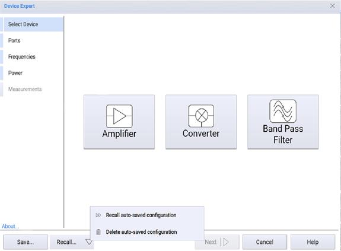 Choose from the following
selections, the wizard will automatically advance. Amplifier – Set up a
selection of common measurements for 2-port amplifier devices with gain.
Converter – Set up a selection of common measurements for frequency
translating devices such as mixers, including up- or down-converters. Band
Pass Filter – Set up a selection of common measurements for a 2-port band pass
filter device. This will setup measurements in 3 channels, corresponding to
the upper and lower rejection band and the pass band, to optimize measurement
speed. Save... – Saves a DUT configuration. Recall... \- Recalls a DUT
configuration. Clicking on the down arrow in the Recall... button accesses the
following: Recall auto-saved configuration \- Recalls the previous session
whether it was manually saved or not. Delete auto-saved configuration \-
Deleted the auto-saved configuration.  
  
Select DUT Ports page help |   
---|---  
Amplifier 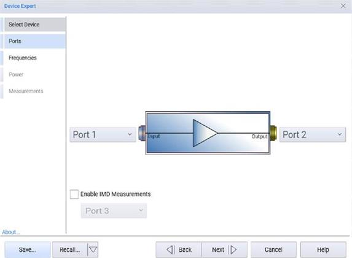 Converter
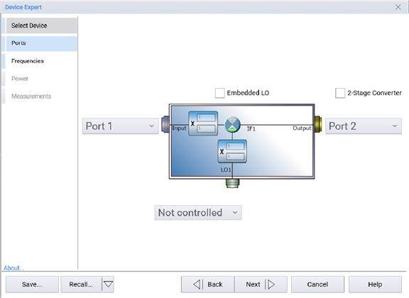 Band Pass Filter
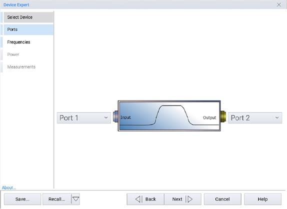 Using the pull-down selection menus on
the side of the DUT graphic the ports that the DUT will be connected to on the
VNA can be selected. If the VNA supports IMD style measurements a check box
will be visible to enable or disable the setup of IMD measurements by the
Wizard. If IMD measurements are enabled the port selection for the input port
will be disabled and automatically set to port 1 to take advantage of the
internal combiner and second source on the VNA, if available. For
mixer/converter devices the LO port source can be selected from the pull-down
menu of available sources. If external sources are configured those will also
be present in the list as possible external sources. If the mixer/converter
device has an embedded LO or is a 2-stage converter device those DUT
properties can be selected on this page. Save... – Saves a DUT configuration.
Recall... \- Recalls a DUT configuration. Clicking on the down arrow in the
Recall... button accesses the following: Recall auto-saved configuration \-
Recalls the previous session whether it was manually saved or not. Delete
auto-saved configuration \- Deleted the auto-saved configuration.  
  
Define DUT Frequencies page help |   
---|---  
The following images show the define DUT frequency pages available in the
wizard. The start/stop or center/span frequencies for the measurements can be
specified. In addition, the number of points for the measurement can be set on
this page. Amplifier 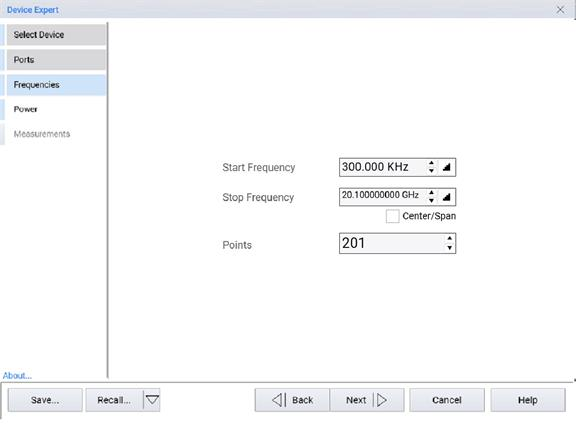
Converter 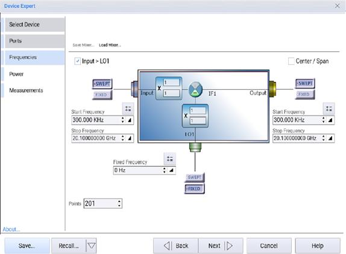 Band Pass Filter
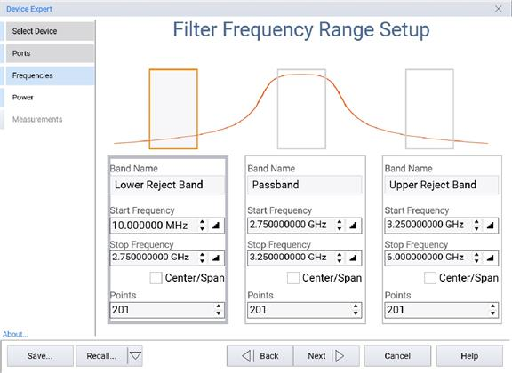 For the converter device two
additional options are available to save and load defined mixer setups. Save
Mixer  and Load Mixer  are different from the Wizard Save /Recall  function as
the mixer file only contains information regarding the mixer frequencies and
high-/low-side selection without the additional information of the measurement
configuration and VNA setup.

  * Save Mixer  saves the mixer definition file including frequencies, the high-/low-side setting, and fixed/swept input settings.
  * Load Mixer  loads the mixer frequency range definition file.

For BPF DUTs there are three sets of frequency range inputs that you can use
to specify the frequency ranges of the lower and upper rejection band as well
as the pass band. Also available is a Band Name field that allows you to name
the frequency range for easier recognition when the channels are set up on the
VNA using the Wizard. Save... – Saves a DUT configuration. Recall... \-
Recalls a DUT configuration. Clicking on the down arrow in the Recall...
button accesses the following: Recall auto-saved configuration \- Recalls the
previous session whether it was manually saved or not. Delete auto-saved
configuration \- Deleted the auto-saved configuration.  
  
Define DUT Power page help |   
---|---  
The DUT power stimulus conditions can specified in the pages shown below.
Amplifier 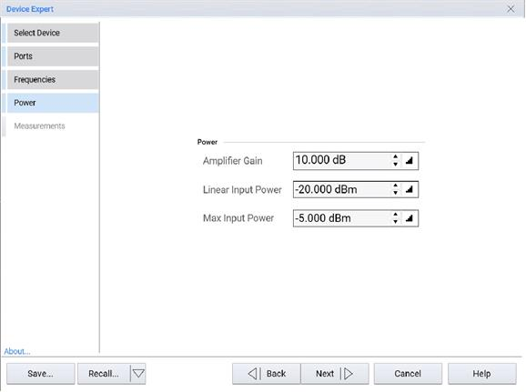 Converter
 Band Pass Filter
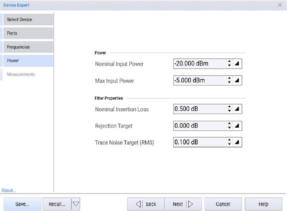 Amplifier Gain and Conversion Gain –
Provide an estimate of the gain of the of the device. This is used by the
Wizard to compute optimal input power levels to the DUT to prevent compression
of the VNA receivers. Linear Input Power – Nominal input power level to
achieve linear DUT operation. Max Input Power – The maximum input power level
to apply to the DUT. For measurements requiring the power to be swept, for
example gain compression measurement class, this sets the maximum power level
supplied to the DUT during power sweeps. Caution! Setting this to a high value
on devices with gain could result in output powers that could damage the VNS
receivers.  LO1 Power and LO2 Power – The power level to use for LO1 and, if
applicable, LO2 for converter devices. Nominal Insertion Loss – An estimate of
the nominal insertion loss in the pass band region of a band pass filter. This
value is used by the Wizard to estimate an optimal IFBW to achieve the target
trace noise (described below). Rejection Target – An estimate of the rejection
level desired in the rejection regions of the band pass filter DUT. Trace
Noise Target – A value of the target trace noise, in dB(rms), the Wizard
should attempt to optimize the VNA to achieve for pass band measurements on a
band pass filter DUT. Save... – Saves a DUT configuration. Recall... \-
Recalls a DUT configuration. Clicking on the down arrow in the Recall...
button accesses the following: Recall auto-saved configuration \- Recalls the
previous session whether it was manually saved or not. Delete auto-saved
configuration \- Deleted the auto-saved configuration.  
  
Select and Apply Measurements page help |   
---|---  
Measurements and parameters to be created using the wizard can be enabled or
disabled in pages shown below. Amplifier
 Converter
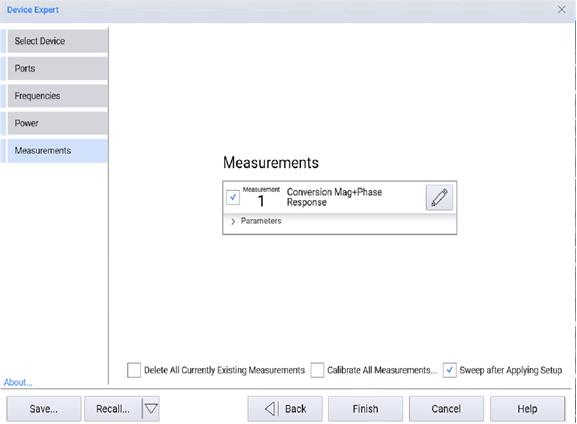 Band Pass Filter
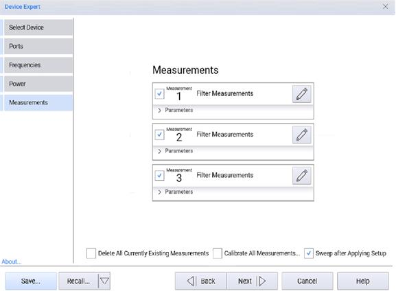 The check box next to each item
can be used to enable or disable that item’s creation by the wizard. Clicking
the pencil icon next to each measurement will open the Edit Channel Parameters
and Properties dialog where additional measurement parameters can be added and
the settings for that measurement can be manually adjusted, if desired. The
parameters that will be measured for each of the measurement types can be
displayed by clicking on the Parameters expander. Individual parameters can be
enabled or disabled from this page. Clicking the Finish button will apply the
selected measurements and parameters to the VNA. Once completed the wizard
will automatically exit. Delete All Currently Existing Measurements – Enabling
this option will delete all measurements that are currently configured on the
VNA when the Finish button is clicked in the wizard. Calibrate All
Measurements  \- Enabling this option will launch the VNA’s Calibrate All
Channels wizard after the Device Expert wizard completes the setup of the
selected measurements. Sweep after Applying Setup \- Enabling this option
(default) applies the setup to the VNA and performs a single sweep afterwards.
Disabling this option applies the setup to the VNA but does not perform a
single sweep afterwards. Save... – Saves a DUT configuration. Recall... \-
Recalls a DUT configuration. Clicking on the down arrow in the Recall...
button accesses the following: Recall auto-saved configuration \- Recalls the
previous session whether it was manually saved or not. Delete auto-saved
configuration \- Deleted the auto-saved configuration.  
  
Edit Channel Parameters and Properties dialog help |   
---|---  
An example of the edit channel parameters and properties dialog is shown in
the image below. 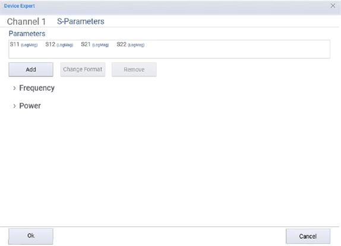 Add – Add a new
parameter to the measurement. Change Format – Change format of the selected
parameter in the list of parameters Remove – Delete parameter from the
measurement Ok – Save and apply changes to the measurement Cancel – Abandons
changes made in this dialog to the measurement.  
  
## External Source Error Messages

If an external source has been set up as an external device but is turned off,
then Device Expert may cause errors to appear in the PNA firmware status bar
when it loads. Device Expert attempts to activate these external sources.
These errors can be safely ignored:

  * VI_ERROR_CONN_LOST: The IO connection for the session has been lost
  * [SCPI: 1073]: Unexpected error

