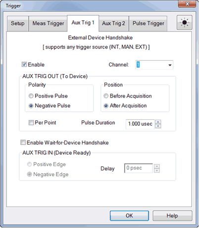
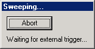

# External and Auxiliary Triggering

* * *

External and auxiliary triggering is used to synchronize the triggering of the
analyzer with other equipment.

Note: When an External Source is configured as an External Device, the PNA
automatically controls all trigger settings. Do NOT make additional trigger
settings. [Learn more.](../System/Configure_an_External_Source.md)

  1. [Overview](External_Triggering.md#ExternalAuxConcepts)

  2. How to make Trigger Settings:

  3.      * [Auxiliary Triggering](External_Triggering.md#AuxTrigDiag)

     * [Meas Trig (IN) Dialog](External_Triggering.md#ExternalDiag)

     * Pulse Triggering

### See Also

  * [Controlling a Handler](../Programming/HandlerIO_Connector.md)

  * [Synchronizing an External Source](../Tutorials/Synchronize_an_External_PSG_Source.md)

  * [Internal Triggering](Trigger.md)

  * Pulse Triggering (separate topic)

* * *

Overview

### Ready Signals versus Trigger Signals

A 'Ready for Trigger' signal is different from a Trigger signal. The ready
signal indicates that the instrument sending the signal is ready for
measurement. The instrument receiving the ready signal would then send a
trigger signal, indicating that the measurement will be, or has been, made.
Usually the slower instrument sends the trigger signal.

Learn more about each type of triggering signal:

  * [Meas Trig RDY and Meas Trig IN](External_Triggering.md#ExternalDiag) \- This pair of signals is easy to use and limited in ability to configure.

  * [AUX TRIG OUT and AUX TRIG IN](External_Triggering.md#AuxTrigDiag) \- These two pair of connectors and signals are highly configurable. Use them to synchronize with any number of devices and equipment.

Meas (External) Trigger dialog box help  
---  
The [MEAS TRIG](../Rear_Panel/XRtour.md#ExternalTrig) connectors are located
on the VNA rear-panel.

[See how to access the Trigger Dialog](Trigger.md#How to)

### Dialog Settings

To cause the VNA to respond to Meas Trig IN or Handler I/O signals, select
External on the [Trigger Setup tab, Source](Trigger.md#source) setting. Note:
You must select External when you use any external triggers. Also on the
Trigger Setup tab, Scope setting, choose whether one external trigger signal
will apply to ALL channels (Global) or one trigger signal per Channel. The
following settings apply accordingly. Main Trigger Input Global / Channel
Trigger Delay After an external trigger is received, the start of the sweep is
held off for this specified amount of time plus any inherent latency.

  * When [Trigger Scope](Trigger.md#scope) = Channel, the delay value is applied to the specified channel.
  * When Trigger Scope = Global, the same delay value is applied to ALL channels.

Source The VNA accepts Trigger IN signals through the following connectors:

  * [Handler I/O Pin 18](../Programming/HandlerIO_Connector.md)
  * [Pulse3](Trigger.md#Pulse3)

Level / Edge High Level The VNA is triggered when it is armed (ready for
trigger) and the TTL signal at the select input is HIGH. Low Level The VNA is
triggered when it is armed (ready for trigger) and the TTL signal at the
select input is LOW.  Positive Edge After the VNA arms, it will trigger on the
next positive edge. If Accept Trigger Before Armed is set, the VNA will
trigger as soon as it arms if a positive edge was received since the last data
was taken. Negative Edge After the VNA arms, it will trigger on the next
negative edge. If Accept Trigger Before Armed is set, the VNA will trigger as
soon as it arms if a negative edge was received since the last data was taken.
Accept Trigger Before Armed  When checked, as the VNA becomes armed (ready to
be triggered), the VNA will immediately trigger if any triggers were received
since the last taking of data. The VNA remembers only one trigger signal. All
others are ignored.

  * When this checkbox is cleared, any trigger signal received before VNA is armed is ignored.
  * This feature is only available when positive or negative EDGE triggering is selected.
  * Configure this setting remotely using [CONTrol:SIGNal](../Programming/GP-IB_Command_Finder/Control.md#signal) (SCPI) or [ExternalTriggerConnectionBehavior](../Programming/COM_Reference/Properties/ExternalTriggerConnectionBehavior_Property.md) (COM).

### Ready for Trigger Indicator (Trigger Ready)

On the VNA, when External is selected on the Trigger Setup tab, then both Meas
Trig IN and Meas Trig Ready are enabled.  Note: The Ready for trigger is
available only when the trigger source is set at External. Choose a connector
to send the VNA Ready OUT signal:

  * [Meas Trig RDY](../Rear_Panel/XRtour.md#ExternalTrig)

Choose Polarity of the 'Ready OUT' signal.

  * Ready High \- TTL High indicates the VNA is ready for trigger.
  * Ready Low \- TTL Low indicates the VNA is ready for trigger (default setting). 

### See Also

  * Pulse Trigger Tab
  * [Learn how to External Trigger during Calibration](External_Triggering.md#CalNote)

  
---  
  
Aux Trig 1 \- Aux Trig 2 dialog box help  
---  
 [See how to access the Trigger
Dialog](Trigger.htm#How to) Note: When an External Source is configured as an
External Device, the VNA automatically controls all trigger settings. Do NOT
make additional trigger settings. [Learn
more.](../System/Configure_an_External_Source.htm)

### AUX TRIG OUT and AUX TRIG IN

See the AUX TRIG (1&2) connectors on the VNA rear-panel.

These signals are highly configurable. They can be used with all types of
external devices to send and receive signals. However, it is important to note
that either Aux Trig INPUT does NOT trigger the VNA. That signal must be
selected. See step 2 in the following procedure.

  1. An external source sends a 'Ready' signal to the VNA (at the Aux Trig IN connector) when it is settled at a frequency.
  2. After receiving the Ready signal, the VNA begins the measurement when it receives a Trigger signal from the specified [Trigger Source](Trigger.md#source):

  1.      * Internal \- Measurement begins immediately.
     * Manual \- Measurement begins when the VNA Trigger button is pressed.
     * External \- Measurement begins when [Meas Trig In](External_Triggering.md#ExternalDiag) signal is received from an external device. This must be configured independently.

  * The Aux Trig OUT signal can be configured to be sent either just BEFORE the measurement is made or AFTER the measurement is complete. When communicating ONLY with an external source, the Aux Trig OUT signal should be sent AFTER the measurement is complete to indicate that the external source can setup for the next measurement.

### Dialog Settings

The Aux Trig 1 and Aux Trig 2 tabs are identical. Two pair of connectors are
available to allow two external devices to be controlled simultaneously.
Enable Check to use the Aux1 or Aux2 connectors to output signals to an
external device. Channel: This setting is controlled by a [VNA Preference
setting](../System/Preferences.htm#ExtTriggerGlobal).

  * Global \- ALL Aux Trig settings apply to ALL channels. The Per Point setting (see below) is made on the [Trigger Setup tab](Trigger.md#state_point) which also applies to ALL channels.
  * Channel \- ALL Aux Trig settings apply to the specified channel. Each channel can be configured independently.

### AUX TRIG OUT (To Device)

The following settings control the properties of the signals sent out the rear
panel [AUX TRIG OUT (1&2) connectors](../Rear_Panel/XRtour.md#ExternalTrig):
Polarity Positive Pulse Outgoing pulse is positive. Negative Pulse Outgoing
pulse is negative. Position Before Acquisition Pulse is sent immediately
before data acquisition begins. After Acquisition Pulse is sent immediately
after data acquisition is complete. Per Point Check to cause a trigger output
to be sent for each data point. Clear to send a trigger output for each sweep.
When the Aux Trig - ["Global" VNA
Preference](../System/Preferences.htm#ExtTriggerGlobal) is selected, then the
Point setting is made on the [Trigger Setup tab](Trigger.md#state_point). It
then applies to ALL channels. When more than one channel is present, the
channel setting that was made last is used. Pulse Duration Specifies the
duration of the positive or negative output trigger pulse.

### Enable Wait-for-Device Handshake

When checked, the VNA waits indefinitely for the input line at the rear panel
[AUX TRIG IN (1&2) connectors](../Rear_Panel/XRtour.md#ExternalTrig) to
change to the specified level before acquiring data. This signal indicates
that the external device is ready for VNA data acquisition. If the signal
arrives before the VNA is ready to acquire data, it is latched (remembered).
When NOT checked, the VNA does not wait, but outputs trigger signals when the
VNA is ready. This signal does NOT trigger the VNA. The trigger signal is
generated from [Trigger Sources](Trigger.md#source): Internal, Manual, or
External. IN (READY) Positive Edge VNA responds to the leading edge of a pulse
on the Aux1 or Aux2 In connector. Negative Edge VNA responds to the trailing
edge of a pulse on the Aux1 or Aux2 In connector. Delay Time that the VNA
waits after receiving the Handshake input before data acquisition begins.

### See Also

  * See how to use these connectors to [synchronize with External Sources.](../Tutorials/Synchronize_an_External_PSG_Source.md)
  * Pulse Triggering

  
  
Note: Guided and Unguided Calibration CAN be performed in External Trigger
mode. With this optional behavior, while Trigger Source is set to External,
trigger signals must be sent for Calibration sweeps. This behavior does not
apply to FCA calibrations. You can [set a
Preference](../System/Preferences.htm#Preferences) to calibrate using Internal
trigger signals while Trigger Source is set to External. The following dialog
box appears on the screen while waiting for an External trigger signal.
 Click Abort to cancel the wait for a
trigger signal.  
---  
  
* * *

