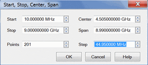
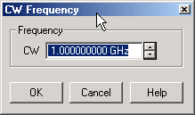

# Frequency Range

* * *

Frequency range is the span of frequencies you specify for making a device
measurement.

  * How to Set Frequency Range

  * [Zoom](Frequency_Range.md#Zoom)

  * CW Frequencies

  * Frequency Resolution

  * Frequency Band Crossings

  * Auto Tune (Option S9x09xxA/B, S9x090A/B only)

  * Span All Meas Bands (Option S93070xB, S9x070A/B Modulation Distortion only)

[See other 'Setup Measurements' topics](Select_a_Measurement_State.md)

#### How to set Frequency Range

You can also make these settings and more from the [Sweep Type](Sweep.md)
dialog. See the [frequency ranges of all analyzer
models](../Support/Configurations.htm).  
---  
Using Hardkey/SoftTab/Softkey | Using a mouse  
  
  1. Press Freq> Main > Start, Stop, Center, or Span.
  2. Enter desired frequency value.

|

  1. Right click on the X-axis label or stimulus range area under grid line.
  2. Click on Start/Stop/Center....

  
  
Frequency Start/Stop \- Center/Span \- Step dialog box help |   
---|---  
 Either of the following pairs of
settings determine the frequency range. The last value that you enter
determines the X-Axis labels. For example, if you enter the Start and Span
values, the X-Axis will show Center and Span labels. Start /Stop \- Specifies
the beginning and end frequency of the swept measurement range. Note: The
start frequency at preset may not be the minimum value in full range.  Center
/Span \- Specifies the value at the center and frequency range. Either of the
following settings determine the number of evenly-spaced data points across
the frequency range. Points \- Specifies the number of evenly-spaced data
points across the frequency range. [Learn more about Data
Points](DPoints.htm). Step \- Available ONLY in [Linear sweep
type](Sweep.htm#SweepTypeDiag). Specifies the frequency step size between
evenly-spaced data points. Changes to this setting will cause the Points
setting to adjust to the closest integer. Any 'remainder' will adjust either
the Stop value or Span value depending on which is displayed on the X-Axis
label.  
  
### Zoom

Zoom allows you to easily change the start and stop frequencies or start and
stop power levels in a [power sweep](Power_Level.md#PowerSweep).

Zoom operates on the [Active
Trace](../S0_Start/Traces_Channels_and_Windows.htm#ManagingTraces) and all
traces in the same channel as the active trace, regardless of the window in
which they appear.

How to Zoom in a measurement window  
---  
  
  1. Left-click the mouse or use a finger, then drag across a portion of a trace.
  2. Release the mouse or lift the finger and the following menu appears:
  3. Select from the following:

  * Zoom \- changes the channel stimulus settings to the left and right border values of the Zoom selection
  * Zoom xy \- changes the channel stimulus settings as above. In addition, the Y-axis scale of the active trace changes to the approximate scale of the Zoom selection.
  * Zoom Full Out \- changes the channel stimulus settings to the full span of the current calibration. If no calibration is ON, then the stimulus settings are changed to the full span of the VNA model.

#### Notes

  * The stimulus settings are changed for ALL traces in the active channel, regardless of the window in which they appear.
  * If markers are in the selected area, they remain in place.
  * If markers are in the unselected area, they are moved to the right or left edge of the new span. When Zoom Full Out is selected, the markers are moved back to their original location.

Zoom is NOT available for the following:

  * Smith Chart or Polar [display formats](Data_Format.md)
  * [CW Time](Sweep.md#cw_time) and [Segment sweep type](Sweep.md#segment)
  * [Frequency Offset Measurements](../FreqOffset/Frequency_Offset_Mode.md)
  * [FCA Opt S93083A/B Measurements](../FreqOffset/FCA_Use.md)

  
  
CW Frequencies

Measurements with a [CW Time sweep](Sweep.md#cw_time) or [Power
sweep](Sweep.htm#power) are made at a single frequency rather than over a
range of frequencies.

#### How to set CW Frequency  
  
---  
Using Hardkey/SoftTab/Softkey | Using a mouse  
  
  1. Set [Sweep Type](Sweep.md#HowSweep) to CW Time or Power Sweep.
  2. Press Freq > Main > CW.
  3. Enter desired CW frequency.

|

  1. Set [Sweep Type](Sweep.md#HowSweep) to CW Time or Power Sweep.
  2. Right click on the stimulus range area under grid box.
  3. Click on CW....

  
  
  
CW Frequency dialog box help  
---  
 CW Type a value and the first letter of the
suffix (k,m,or g) or use the up and down arrows to select any value within the
range of the VNA.  
  
Frequency Resolution

The resolution for setting frequency is 1 Hz.

Frequency Band Crossings

The frequency range of the VNA covers several internal frequency bands. The
higher the frequency range of the VNA, the larger the number of bands. The
source power to your DUT turns off as the stimulus frequency is swept through
these band crossings. To learn more, see [Power ON and OFF during Sweep and
Retrace](Power_Level.htm#PowerONOFF).

The listed frequencies in the following tables are the stop frequency of the
specified band, and the start frequency of the following band.

You can download a [VNA Band Structure
Readout](http://na.support.keysight.com/pna/apps/applications.htm) utility
that lists the band crossings for your VNA.

Frequency band crossings are different for the following models:

  * PNA-X Models (with synthesizer revision greater than 6)

  * PNA-X Models (with synthesizer revision 6 or earlier)

  * [N522xB Models (with synthesizer revision greater than 6)](Frequency_Range.md#N522x)

  * N522xB Models (with synthesizer revision 6 or earlier)

  * [N523xA Models](Frequency_Range.md#N523xA)

### PNA-X Models Band Stop Frequencies (with synthesizer revision greater than
6)

N5241B and N5242B

Band | Freq (GHz) | Band | Freq (GHz) | Band | Freq (GHz) |   
---|---|---|---|---|---|---  
0 | Reserved | 12 | .396 | 24 | 12.00 |   
1 | .010 | 13 | .500 | 25 | 12.80 |   
2 | .014 | 14 | .628 | 26 | 13.51 |   
3 | .019 | 15 | 1.00 | 27 | 15.20 |   
4 | .027 | 16 | 1.50 | 28 | 16.00 |   
5 | .038 | 17 | 2.00 | 29 | 18.00 |   
6 | .053 | 18 | 3.20 | 30 | 19.04 |   
7 | .075 | 19 | 5.332 | 31 | 20.00 |   
8 | .105 | 20 | 6.00 | 32 | 21.30 |   
9 | .146 | 21 | 7.6 | 33 | 24.00 |   
10 | .205 | 22 | 8.5 | 34 | 26.50 |   
11 | .250 | 23 | 9.52 |  |  |   
|  |  |  |  |  |   
  
N5244B and N5245B

Band | Freq (GHz) | Band | Freq (GHz) | Band | Freq (GHz) | Band | Freq (GHz)  
---|---|---|---|---|---|---|---  
0 | Reserved | 12 | .396 | 24 | 12.00 | 36 | 30.40  
1 | .010 | 13 | .500 | 25 | 12.80 | 37 | 32.00  
2 | .014 | 14 | .628 | 26 | 13.51 | 38 | 36.10  
3 | .019 | 15 | 1.00 | 27 | 15.20 | 39 | 38.08  
4 | .027 | 16 | 1.50 | 28 | 16.00 | 40 | 40.53  
5 | .038 | 17 | 2.00 | 29 | 19.04 | 41 | 42.00  
6 | .053 | 18 | 3.20 | 30 | 20.00 | 42 | 43.50  
7 | .075 | 19 | 5.332 | 31 | 21.30 | 43 | 45.60  
8 | .105 | 20 | 6.00 | 32 | 24.00 | 44 | 48.00  
9 | .146 | 21 | 7.60 | 33 | 26.50 | 45 | 50.00  
10 | .205 | 22 | 8.50 | 34 | 27.02 |  |   
11 | .250 | 23 | 9.52 | 35 | 28.50 |  |   
  
N5247B

Band | Freq (GHz) | Band | Freq (GHz) | Band | Freq (GHz) | Band | Freq (GHz) | Band | Freq (GHz)  
---|---|---|---|---|---|---|---|---|---  
0 | Reserved | 12 | .396 | 24 | 12.00 | 36 | 30.40 | 48 | 60.10  
1 | .010 | 13 | .500 | 25 | 12.80 | 37 | 32.00 | 49 | 60.80  
2 | .014 | 14 | .628 | 26 | 13.51 | 38 | 36.10 | 50 | 64.00  
3 | .019 | 15 | 1.00 | 27 | 15.20 | 39 | 38.08 | 51 | 66.80  
4 | .027 | 16 | 1.50 | 28 | 16.00 | 40 | 40.00 | 52 | 70.00  
5 | .038 | 17 | 2.00 | 29 | 19.04 | 41 | 40.53 |  |   
6 | .053 | 18 | 3.20 | 30 | 20.00 | 42 | 45.82 |  |   
7 | .075 | 19 | 5.332 | 31 | 21.30 | 43 | 48.00 |  |   
8 | .105 | 20 | 6.00 | 32 | 24.00 | 44 | 50.00 |  |   
9 | .146 | 21 | 7.60 | 33 | 26.50 | 45 | 53.00 |  |   
10 | .205 | 22 | 8.50 | 34 | 27.02 | 46 | 54.04 |  |   
11 | .250 | 23 | 9.52 | 35 | 28.50 | 47 | 57.30 |  |   
  
### PNA-X Models Band Stop Frequencies (with synthesizer revision 6 or
earlier)

N5241B and N5242B

Band | Freq (GHz) | Band | Freq (GHz) | Band | Freq (GHz) |   
---|---|---|---|---|---|---  
0 | Reserved | 12 | .396 | 24 | 8.50 |   
1 | Reserved | 13 | .500 | 25 | 10.664 |   
2 | .014 | 14 | .628 | 26 | 12.00 |   
3 | .019 | 15 | 1.00 | 27 | 12.80 |   
4 | .027 | 16 | 1.50 | 28 | 13.51 |   
5 | .038 | 17 | 2.00 | 29 | 15.40 |   
6 | .053 | 18 | 3.00 | 30 | 16.00 |   
7 | .075 | 19 | 3.20 | 31 | 18.00 |   
8 | .105 | 20 | 4.00 | 32 | 20.00 |   
9 | .146 | 21 | 5.332 | 33 | 21.328 |   
10 | .205 | 22 | 6.752 | 34 | 22.50 |   
11 | .250 | 23 | 8.00 | 35 | 24.00 |   
|  |  |  | 36 | 27.00 |   
  
N5244B and N5245B

Band | Freq (GHz) | Band | Freq (GHz) | Band | Freq (GHz) | Band | Freq (GHz) |   
---|---|---|---|---|---|---|---|---  
0 | Reserved | 12 | .396 | 24 | 8.50 | 36 | 27.008 |   
1 | Reserved | 13 | .500 | 25 | 10.664 | 37 | 32.00 |   
2 | .014 | 14 | .628 | 26 | 12.00 | 38 | 36.50 |   
3 | .019 | 15 | 1.00 | 27 | 12.80 | 39 | 40.50 |   
4 | .027 | 16 | 1.50 | 28 | 13.51 | 40 | 42.656 |   
5 | .038 | 17 | 2.00 | 29 | 15.40 | 41 | 43.50 |   
6 | .053 | 18 | 3.00 | 30 | 16.00 | 42 | 46.20 |   
7 | .075 | 19 | 3.20 | 31 | 19.00 | 43 | 48.00 |   
8 | .105 | 20 | 4.00 | 32 | 20.00 | 44 | 50.20 |   
9 | .146 | 21 | 5.332 | 33 | 21.328 |  |  |   
10 | .205 | 22 | 6.752 | 34 | 24.00 |  |  |   
11 | .250 | 23 | 8.00 | 35 | 26.50 |  |  |   
  
N5247B

Band | Freq (GHz) | Band | Freq (GHz) | Band | Freq (GHz)  
---|---|---|---|---|---  
0 | Reserved | 12 | 6.75 | 24 | 32.00  
1 | Reserved | 13 | 8.00 | 25 | 40.00  
2 | .053 | 14 | 10.70 | 26 | 40.50  
3 | .175 | 15 | 13.50 | 27 | 42.70  
4 | .250 | 16 | 15.40 | 28 | 46.20  
5 | .500 | 17 | 16.00 | 29 | 48.00  
6 | 1.000 | 18 | 19.00 | 30 | 50.00  
7 | 2.000 | 19 | 20.00 | 31 | 54.00  
8 | 3.000 | 20 | 21.30 | 32 | 60.00  
9 | 3.200 | 21 | 24.00 | 33 | 64.00  
10 | 4.000 | 22 | 26.50 | 34 | 67.00  
11 | 5.330 | 23 | 27.00 | 35 | 70.00  
  
### N522xB Models Band Stop Frequencies (with synthesizer revision greater
than 6)

N5221B and N5222B

Band | Freq (GHz) | Band | Freq (GHz)  
---|---|---|---  
0 | Reserved | 12 | 15.20  
1 | .010 | 13 | 16.00  
2 | .053 | 14 | 18.00  
3 | .175 | 15 | 19.04  
4 | .250 | 16 | 20.00  
5 | .500 | 17 | 21.30  
6 | 3.20 | 18 | 24.00  
7 | 6.00 | 19 | 26.50  
8 | 7.60 |  |   
9 | 9.52 |  |   
10 | 12.00 |  |   
11 | 13.51 |  |   
  
N5224B and N5225B

Band | Freq (GHz) | Band | Freq (GHz) | Band | Freq (GHz)  
---|---|---|---|---|---  
0 | Reserved | 12 | 15.20 | 24 | 38.08  
1 | .010 | 13 | 16.00 | 25 | 40.53  
2 | .053 | 14 | 19.04 | 26 | 42.00  
3 | .175 | 15 | 20.00 | 27 | 43.50  
4 | .250 | 16 | 21.30 | 28 | 45.60  
5 | .500 | 17 | 24.00 | 29 | 48.00  
6 | 3.20 | 18 | 26.50 | 30 | 50.00  
7 | 6.00 | 19 | 27.02 |  |   
8 | 7.60 | 20 | 28.50 |  |   
9 | 9.52 | 21 | 30.40 |  |   
10 | 12.00 | 22 | 32.00 |  |   
11 | 13.51 | 23 | 36.10 |  |   
  
N5227B

Band | Freq (GHz) | Band | Freq (GHz) | Band | Freq (GHz) | Band | Freq (GHz)  
---|---|---|---|---|---|---|---  
0 | Reserved | 12 | 15.20 | 24 | 38.08 | 36 | 66.80  
1 | .010 | 13 | 16.00 | 25 | 40.00 | 37 | 70.00  
2 | .053 | 14 | 19.04 | 26 | 40.53 |  |   
3 | .175 | 15 | 20.00 | 27 | 45.82 |  |   
4 | .250 | 16 | 21.30 | 28 | 48.00 |  |   
5 | .500 | 17 | 24.00 | 29 | 50.00 |  |   
6 | 3.20 | 18 | 26.50 | 30 | 53.00 |  |   
7 | 6.00 | 19 | 27.02 | 31 | 54.04 |  |   
8 | 7.60 | 20 | 28.50 | 32 | 57.30 |  |   
9 | 9.52 | 21 | 30.40 | 33 | 60.10 |  |   
10 | 12.00 | 22 | 32.00 | 34 | 60.80 |  |   
11 | 13.51 | 23 | 36.10 | 35 | 64.00 |  |   
  
### N522xB Models Band Stop Frequencies (with synthesizer revision 6 or
earlier)

N5221B and N5222B

Band | Freq (GHz) | Band | Freq (GHz)  
---|---|---|---  
0 | Reserved | 12 | 6.752  
1 | .010 | 13 | 8.0  
2 | .053 | 14 | 10.664  
3 | .175 | 15 | 13.51  
4 | .250 | 16 | 15.40  
5 | .500 | 17 | 16.0  
6 | 1.0 | 18 | 20.0  
7 | 2.0 | 19 | 21.328  
8 | 3.0 | 20 | 24.0  
9 | 3.2 | 21 | 27.0  
10 | 4.0 | 22 |   
11 | 5.332 | 23 |   
  
N5224B and N5225B

Band | Freq (GHz) | Band | Freq (GHz) | Band | Freq (GHz)  
---|---|---|---|---|---  
0 | Reserved | 12 | 6.752 | 24 | 32.00  
1 | Reserved | 13 | 8.00 | 25 | 40.50  
2 | .053 | 14 | 10.664 | 26 | 42.656  
3 | .175 | 15 | 13.51 | 27 | 43.50  
4 | .250 | 16 | 15.40 | 28 | 46.20  
5 | .500 | 17 | 16.00 | 29 | 48.00  
6 | 1.000 | 18 | 19.00 | 30 | 50.20  
7 | 2.000 | 19 | 20.00 |  |   
8 | 3.000 | 20 | 21.328 |  |   
9 | 3.200 | 21 | 24.00 |  |   
10 | 4.000 | 22 | 26.50 |  |   
11 | 5.332 | 23 | 27.008 |  |   
  
N5227B

Band | Freq (GHz) | Band | Freq (GHz) | Band | Freq (GHz)  
---|---|---|---|---|---  
0 | Reserved | 12 | 6.752 | 24 | 32.00  
1 | .010 | 13 | 8.00 | 25 | 40.00  
2 | .053 | 14 | 10.664 | 26 | 40.50  
3 | .175 | 15 | 13.51 | 27 | 42.656  
4 | .250 | 16 | 15.40 | 28 | 46.20  
5 | .500 | 17 | 16.00 | 29 | 48.00  
6 | 1.000 | 18 | 19.00 | 30 | 50.00  
7 | 2.000 | 19 | 20.00 | 31 | 54.00  
8 | 3.000 | 20 | 21.328 | 32 | 60.00  
9 | 3.200 | 21 | 24.00 | 33 | 64.00  
10 | 4.000 | 22 | 26.50 | 34 | 67.00  
11 | 5.332 | 23 | 27.008 | 35 | 70.00  
  
### N523xModels [See N523x Freq ranges.](../Support/Configurations.md#N523x)

N5231B, N5232B, N5239B

Band | Freq (GHz) | Band | Freq (GHz)  
---|---|---|---  
0 | Reserved | 10 | 5.33  
1 | .000425 | 11 | 6.75  
2 | .0012 | 12 | 8.00  
3 | .0075 | 13 | 10.07  
4 | .025 | 14 | 13.50  
5 | .050 | 15 | 16.00  
6 | 1.00 | 16 | 16.70  
7 | 2.00 | 17 | 20.01  
8 | 3.00 |  |   
9 | 4.00 |  |   
  
### N5234B, N5235B Models

Band | Freq (GHz) | Band | Freq (GHz) | Band | Freq (GHz)  
---|---|---|---|---|---  
0 |  | 11 | 10.66 | 21 | 30.80  
1 | .010 | 12 | 13.51 | 22 | 31.50  
2 | .250 | 13 | 15.40 | 23 | 32.00  
3 | .500 | 14 | 16.00 | 24 | 40.00  
4 | 1.00 | 15 | 20.00 | 25 | 40.56  
5 | 2.00 | 16 | 20.26 | 26 | 42.00  
6 | 3.00 | 17 | 21.33 | 27 | 48.00  
7 | 4.00 | 18 | 24.00 | 28 | 50.00  
8 | 5.332 | 19 | 26.00 |  |   
9 | 6.752 | 20 | 27.01 |  |   
10 | 8.00 |  |  |  |   
  
Auto Tune

The Auto Tune softkey is a feature of the Spectrum Analyzer measurement class
(Option S9x09xxA/B, S9x090A/B). Each time this softkey is pressed, all defined
distortion measurement bands for the modulation channel are automatically
tuned.

Span All Meas Bands

The Span All Meas Bands softkey is a feature of the Modulation Distortion
measurement class (Option S93070xB, S9x070A/B only). Each time this softkey is
pressed, all defined distortion measurement bands for the modulation channel
are automatically tuned.

* * *

