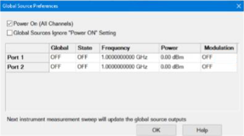
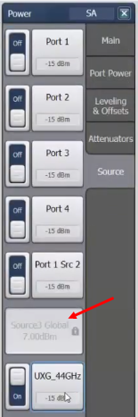

# Global Source

Global Source allows any internal or external source to be set globally and
retain its settings even after an instrument preset.

### How to access the Global Source dialog  
  
---  
Using Hardkey/SoftTab/Softkey |  Using a mouse  
  
  1. Press Sweep > Source Control > Global Source...o

or

  1. Press System > System Setup > Preferences....
  2. Press Global Sources... button.

|

  1. Click Stimulus.
  2. Select Sweep.
  3. Select Source Control.
  4. Select Global Source.

  
  
  
Global Source dialog box help  
---  
 Power On (All Channels) \- Check
to enable source power for all channels. Global Sources Ignore "Power ON"
Setting \- This setting is a preference. Sources set to Global are not turned
off when Power On (All Channels) is checked. Users of high power systems often
turn off the RF Power to avoid damaging the system or the DUT. However, they
may not want to turn off Global Sources being used as the clock signal for
synthesizers. Name \- Lists the names of the sources. Global - Set the state
of the source.

  * OFF Do not set as a global source.
  * Global Set as a global source and set to a fixed frequency and power level defined in this dialog. Once a source is set to Global, It becomes "locked" and its settings cannot be controlled by any channel settings (frequency, power, RF on/off): It will be unaffected even if sweeps are disabled and if there are no channels defined for the VNA. The Recall feature will not change the Global Source setting. If Global Source is ON and a state saved with Global Source OFF is recalled, then Global Source will remain ON and the state will not be completely recalled and the VNA displays the warning message: The Recall is incomplete because Global Source is ON. When the GUI is exited, the Global Sources will be turned OFF.  
  
The following shows Source3 has been set to Global.  
  

State \- Turns source power on and off. Frequency \- Sets source frequency.
Power \- Sets the power level at the output of the source. Modulation \-
Enables/disables modulation on an internal source corresponding to the
selected VNA port. Click in this field then click the Edit button to load an
existing modulation file. [Learn more](Internal_Source_Modulation.md).  
  
* * *

