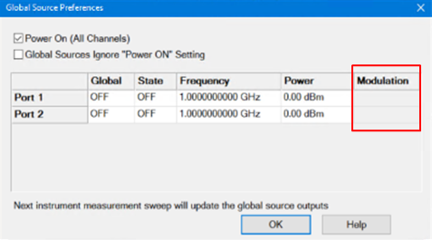
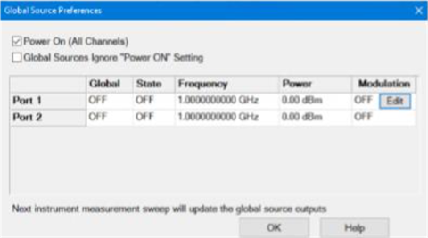
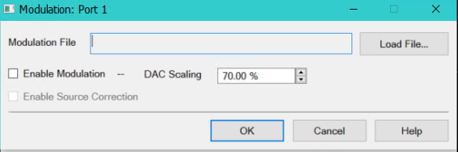

# Internal Source Modulation

This feature allows any PNA/PNA-X port to be stimulated by a modulated signal
and is supported by all measurement classes (requires Option
[S93072B](../Support/Configurations.md#S93072B) and synthesizer 7). Internal
source modulation allows any of the internal synthesizers to replace
traditional sources. In addition, internal source modulation can be set as a
[global source](Global_Source.md).

In this topic:

  * Modulation Below 3.2 GHz
  * How to Set Up Internal Source Modulation

## Modulation Below 3.2 GHz

When using an internal modulated source, the low band source is automatically
set from [Low Bnd Filtered](Path_Configurator.md#Src1_Src2_Settings) to [Low
Bnd Hi Pwr](Path_Configurator.htm#Src1_Src2_Settings). The Low Bnd Hi Pwr mode
has significant low frequency spurious when the carrier is below 3.2 GHz. In
this case, the Low Bnd Filtered mode can be used below 3.2 GHz to reduce
harmonics. The filtered paths are divided into frequency bands ranging from 10
MHz to 3.2 GHz. Each band indicates a low-pass filter with a cutoff slightly
above the highest frequency of the range. The frequency band is determined by
the carrier frequency. A carrier offset may be needed to keep the carrier
frequency in a correct band while avoiding filtering the multitone signal.

The following table shows the frequency range of each band when using the
filtered path.

Band Number | Frequency Range   
(MHz)  
---|---  
0 | 10 - 14  
1 | 14 - 19  
2 | 19 - 27  
3 | 27 - 38  
4 | 38 - 53  
5 | 53 - 75  
6 | 75 - 105  
7 | 105 - 146  
8 | 146 - 205  
9 | 205 - 250  
10 | 250 - 396  
11 | 396 - 500  
12 | 500 - 628  
13 | 628 - 1000  
14 | 1000 - 1500  
15 | 1500 - 2000  
16 | 2000 - 3200  
  
## How to Set Up Internal Source Modulation

  1. Press Sweep > Source Control > Global Source.... The Global Source Preferences dialog is displayed:  
  
  
  
If the VNA has a synthesizer version earlier than 7 and does not have the
S93072B license, the Modulation column will be grayed out and not available:  
  

  2. Click in the Modulation column corresponding to the VNA port to be modulated then click on the Edit button:.  
  
  

  3. The Modulation Port X dialog should be displayed as shown below:  
  
  

  4. Click on the "Load File..." button then load an existing modulation file.

Note: Modulation files can be created using the [Create
Modulation](../Applications/Modulation_Distortion/Create_Modulation_Files.htm)
dialog (*.mdx) in the SA/MOD/MODX measurement classes. Using the Create
Modulation dialog to create modulation files allows you to verify the signal
before using it.

  5. Check the Enable Modulation box.
  6. The DAC Scaling sets the scaling factor used for the waveform (full scale = 70%). This ensures that the DAC filter does not output a signal that is larger than the DAC's maximum output level, which can cause distortion in the system. 
  7. Check Enable Source Correction to enable source correction after a source modulation calibration is performed then click OK.
  8. In the Global Source Preferences dialog, change the State column to ON to turn the source power on.
  9. Change the Global column to ON to set it as a global source. [Learn more](Global_Source.md).

