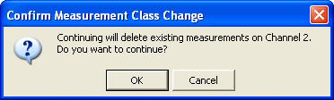

# Measurement Classes

* * *

Measurement Classes are categories of measurements that can coexist on a
channel.

  * [What are Measurement Classes](Measurement_Classes.md#What)

  * [How to assign a Measurement Class to a Channel](Measurement_Classes.md#How to)

  * [Measurement Class Dialog Box Help](Measurement_Classes.md#StartDiag)

[See other 'Setup Measurements' topics](Select_a_Measurement_State.md)

### What are Measurement Classes

Note: Measurement classes vary according to the VNA model and options
installed.

The dialog below is an example showing the Measurement Classes currently
available for a VNA. Within each of these classes there are a number of
measurements.

Measurement Classes are categories of measurements that can coexist on a
channel. A measurement from one class can NOT reside in a channel with a
measurement from another class. For example, a Noise Figure measurement can
NOT reside in a channel that is currently hosting Scalar Mixer Measurements.

The Measurement Class dialog is accessed in the following ways:

#### How to assign a Measurement Class to a Channel  
  
---  
Using Hardkey/SoftTab/Softkey | Using a mouse  
  
  1. Press Meas > S-Param > Meas Class...

|

  1. Click Instrument.
  2. Select Meas Class....

  
  
  
Measurement Class dialog box help  
---  
 Measurement class dialog box shows the
supported classes for your unit. The supported classes depends on the product
and installed options. The above dialog box shows an example of PNA.
Measurements in a measurement class can NOT coexist in a channel with a
measurement of a different measurement class. Select a measurement class for
the active channel or new measurement channel.

  * The Standard measurement class contains S-Parameters. Balanced parameters, and Receiver measurements.
  * All other measurement classes are commonly called "[Applications](../Applications/Applications.md)".

Title Bar Indicates the active channel to which the measurement class will be
assigned. Show setup dialog

  * Check to launch the selected Measurement Class dialog.
  * Clear (default setting) to not launch the selected Measurement Class dialog. This setting survives a Preset and VNA Shutdown.

Confirm changes

  * Check (default setting) to launch the Confirm Measurement Class Change dialog.
  * Clear to perform the 'OK' actions without confirmation. This setting survives a Preset and VNA Shutdown.

New Channel Click to create the measurement class in a new channel and new
window. A default measurement for that class is created in the channel. To
change the measurement, click Trace, then select a new measurement.  
  

Choose to do the following:

  * OK - Delete the existing measurements in the active channel. Create the new measurement class, and default measurement, in that channel.

  * Cancel - Do not create the new measurement class. Leave the old measurements (and class) in that channel and return to the Measurement Class dialog box.

* * *

