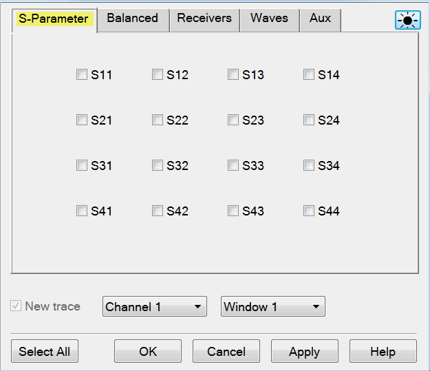
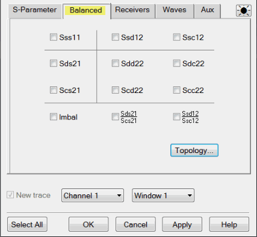
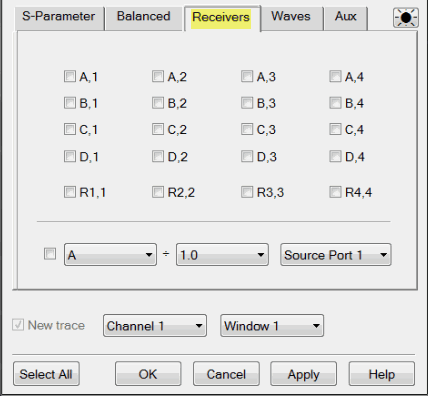
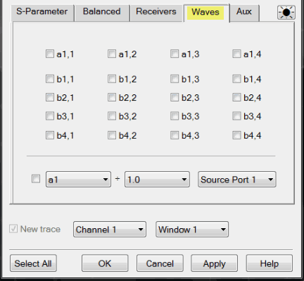
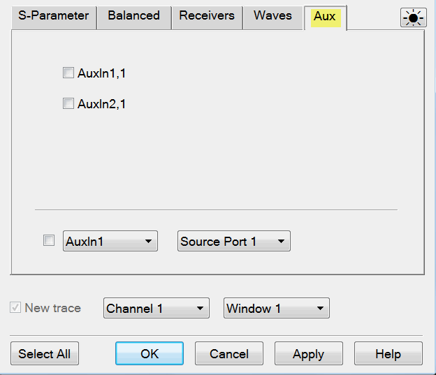
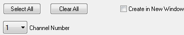
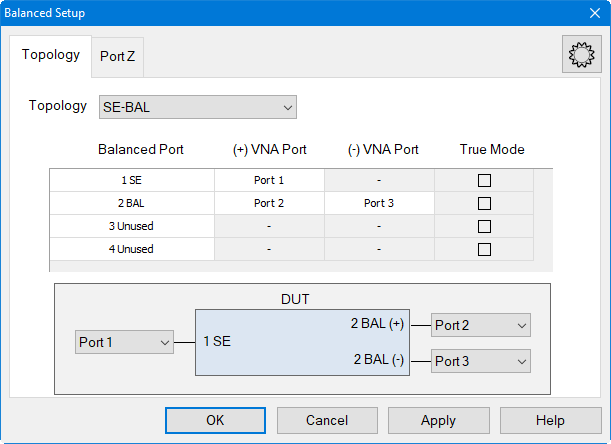
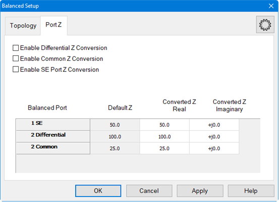
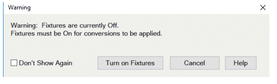

# Measurement Parameters

* * *

This topic contains the following information:

  * S-Parameters (pre-selected ratios)

  * [Ratioed](Measurement_Parameters.md#arb_ratio) (choose your own ratio)

  * [Unratioed Power](Measurement_Parameters.md#Unratioed_Power) (absolute power)

  * New / Change Measurement dialog box help

  * How to Select a Measurement Parameter

  * [Option Sx090A/B Spectrum Analyzer Measurement Parameters](../Applications/Spectrum_Analyzer.md#HowMeasParams) (separate topic)

  * [Option S93070xB Modulation Distortion Measurement Parameters](../Applications/Modulation_Distortion/Displaying_Distortion_Parameters.md#Measurement_Parameters) (separate topic)

  * [Option S93031xB Phase Noise Measurement Parameters](../Applications/Phase_Noise/Displaying_Phase_Noise_Parameters.md#Measurement_Parameters) (separate topic)

  * Auxiliary

[Learn about Balanced Measurements](Balanced_Measurements.md)

[See other 'Setup Measurements' topics](Select_a_Measurement_State.md)

S-Parameters

S-parameters (scattering parameters) are used to describe the way a device
modifies a signal. For a 2-port device, there are four S-Parameters. The
syntax for each parameter is described by the following:

S out - in

out = |  analyzer port number where the device signal output is measured (receiver)  
---|---  
in = |  analyzer port number where the signal is applied (incident) to the device (source)  
  
Move the mouse over each S-parameter to see the signal flow:

For two-port devices:

  * When the source goes into port 1, the measurement is said to be in the forward direction.

  * When the source goes into port 2, the measurement is said to be in the reverse direction.

The analyzer automatically switches the source and receiver to make a forward
or reverse measurement. Therefore, the analyzer can measure all four
S-parameters for a two-port device with a single connection.

See the [block diagram](../Specs/ManualChoice.md#Block_diag) (including
receivers) of your VNA.

### Common Measurements with S-Parameters

Reflection Measurements  
(S11 and S22) |  Transmission Measurements  
(S21 and S12)  
---|---  
  
  * Return loss
  * Standing wave ratio (SWR)
  * Reflection coefficient
  * Impedance
  * S 11 , S 22

|

  * Insertion loss
  * Transmission coefficient
  * Gain/Loss
  * Group delay
  * Deviation from linear phase
  * Electrical delay
  * S 21 , S 12

  
  
Receiver Measurements

All analyzer models have test port receivers and reference receivers. See the
[block diagram](../Specs/ManualChoice.md#Block_diag) of your VNA.

For 4-port models...

  * R1, R2, R3, and R4 are reference receivers. They measure the signal as it leaves the analyzer source.

  *     * R1 measures the signal out of Port 1

    * ...

    * R4 measures the signal out of Port 4

  * A, B, C, and D are test port receivers. They measure the signal out (or reflecting off ) of the DUT.

  *     * A measures the signal into VNA Port 1

    * B measures the signal into VNA Port 2

    * C measures the signal into VNA Port 3

    * D measures the signal into VNA Port 4

Models with more than 4 ports must specify receivers using Logical Receiver
Notation. [Learn more](Measurement_Parameters.md#RecNotation).

### Ratioed Measurements

Ratioed measurements allow you to choose your own ratio of any two receivers
that are available in your analyzer. S-parameters are actually predefined
ratio measurements. For example S11 is A/R1.

The following are common uses of ratioed measurements:

  * Comparing the phase between two paths of a device. An example could be something simple like a power splitter or more complicated like a dual-channel receiver.

  * Measurements that require a higher dynamic range than the analyzer provides with S-parameters.

Your VNA MAY have front-panel jumper cables that go directly to measurement
receivers. Learn about the [front-panel
jumpers](../Front_Panel/FPJumpersChoice.htm) on your VNA.

### Unratioed (Absolute Power) Measurements

The unratioed power parameter measures the absolute power going into any of
the receivers that are available on your analyzer.

The reference receivers are internally configured to measure the source power
for a specific analyzer port. Performing an absolute power measurement of a
reference receiver using a different source port will measure very little
power unless the front panel jumpers are removed and signal is applied
directly to the receiver. An example of this would be an R1 measurement using
port 2 as the source.

  * [Measuring phase](Data_Format.md#Phase) using a single receiver yields meaningless data. Phase measurements must be a comparison of two signals.

  * Averaging for Unratioed parameters is computed differently from ratioed parameters. [Learn more](../S2_Opt/Trce_Noise.md#AveDiag).

  * To calibrate ratioed or unratioed receiver (power) parameters, the recommended method is the _[Guided Power Calibration](../S3_Cals/Guided_Power_Calibration.md)_. The _[Unguided Response Calibration](../S3_Cals/Calibration_Wizard.md#unguided)_ can also be used to calibrate a single unratioed or ratioed parameter at a time.

New / Change Measurement dialog box help  
---  
|  Note: The only measurements that are available are those in the
[measurement class](Measurement_Classes.md) currently assigned to the active
channel. Other measurements are NOT compatible. To create a measurement other
than these, first assign the appropriate measurement class to a new or
existing channel. [Learn how.](Measurement_Classes.md)  
---  
---  
  
Click a tab to create or change measurements.

  * When creating NEW measurements, you can choose more than one.

  * When changing an EXISTING measurement, you can choose ONLY one.

### Tabs

S-Parameter Select a predefined ratioed measurements. Learn more about
S-parameters.

For Setup:<= 4-Port

Balanced Select a balanced measurement type.

Topology Click to invoke the [Balanced DUT Topology / Logical Port
mappings](Measurement_Parameters.htm#topology) dialog box. [Learn more about
Balanced Measurements.](Balanced_Measurements.htm)

For Setup:<= 4-Port

Select All Will only select the parameters shown and will not select the check
box of the Receiver selector at the bottom.

Receivers Select receivers to make Ratioed and Unratioed (absolute power)
measurements. [Learn more about receiver
measurements.](Measurement_Parameters.htm#Receiver)

Ratioed Click on the check box to select the parameters and create
measurement. Receiver selector at the bottom allow you to define ratios.
Select a receiver for the Numerator, select another receiver for the
Denominator, then select a source port for the measurement.

The Source port is ALWAYS interpreted as a logical port number.

For convenience, the table is populated with common choices.

Select All Will only select the parameters shown and will not select the check
box of the Receiver selector at the bottom.

  * [Learn about External Test Sets and Ratioed Measurements](../System/External_Testset_Control.md#Ratioed)

  * [Learn more about Ratioed Measurements.](Measurement_Parameters.md#arb_ratio)

Unratioed Same as Ratioed, but select 1 as the Denominator.

  * [Learn More about Unratioed Measurements.](Measurement_Parameters.md#Unratioed_Power)

  * See the [block diagram](../Specs/ManualChoice.md#Block_diag) of receivers in YOUR VNA.

  * The internal ADCs (Analog-Digital Converters) can be used as measurement receivers. [Learn more.](ADC_Measurements.md)

Waves Select receiver notation to make ratioed and unratioed measurements.

Click on the check box to select the parameters and create measurement. Wave
selector at the bottom allow you to define ratio.

Select All Will only select the parameters shown and will not select the check
box of the Wave selector at the bottom.

### Receiver Notation

Receivers can be also selected using logical receiver notation. This
"8510-style" notation makes it easy to refer to multi-port receivers.

  * aN - Reference receiver for logical port N
  * bN - Test port receiver for logical port N

For example:

  * For Ratioed measurements: "b12/a1" refers to the logical test port 12 receiver / the logical port 1 reference receiver.
  * For Unratioed measurements: "b10" refers to the logical test port 10 receiver.

The VNA-style notation (A, B, R1 and so forth) can still be used to refer to
physical receivers in less than 4 ports. [Learn
more.](Measurement_Parameters.htm#Receiver) However, ratioed measurements MUST
use the same notation to refer to both receivers; either the physical receiver
notation (A, R1) or the logical receiver notation (aN, bN). For example, the
following mixed notation is NOT allowed: A/b3 and a5/R2.

### Programming

When entering receiver letters using programming commands, neither logical or
physical receiver notation are case sensitive.  
---  
  
AUX Select input of Auxiliary on the rear panel to make DC measurement.

Click on the check box to select the input of auxiliary and create
measurement. Auxiliary selector at the bottom allow you to define auxiliary
and other parameters such as PMAR and DVMs.

Select All Will only select the parameters shown and will not select the check
box of the Auxiliary selector at the bottom.

### Channel / Window Selections

These selections are NOT AVAILABLE when changing an EXISTING measurement.
Learn how to change a measurement.

Channel Number Select the channel for the new traces.

Create in New Window

  * Check to create new traces in a new window.

  * Clear to create new traces in the active window. When the [traces per window limitation](../S0_Start/Traces_Channels_and_Windows.md#window) has been reached, no more traces are added.

[About Measurement Parameters](Measurement_Parameters.md) (top of page)  
  
Balanced Source / Topology dialog box help |    
---|---  
  
#### Topology Tab

 See the dialog for [Integrated
True Mode Stimulus Application](../Applications/iTMSA.htm#BalancedTopDiag)
(iTMSA). Create or edit DUT Topology and Logical Port Mapping. A Logical Port
is a term used to describe a physical analyzer test port that has been
remapped to a new port number. You can assign logical single-ended ports to
logical balanced ports. Note: These selections apply to ALL measurements in
the channel. If the device topology is changed, any existing measurements in
the channel that are incompatible with the new topology will be automatically
changed to one that is compatible. Topology: Describes your DUT as you would
like it tested. The following device topologies can be measured by a multiport
analyzer.

  * **BAL** DUT has a single balanced port. 
  * **BAL-BAL** DUT has two balanced ports. 
  * **BAL-SE** DUT has one balanced port and one single-ended port. 
  * BAL-SE-SE \- DUT has one balanced port and two single-ended ports.
  * **SE-BAL** DUT has one single-ended port and one balanced port. 
  * SE-SE-BAL \- DUT has two single-ended ports and one balanced port.
  * All SE  
(Changes all entries to Single-ended)

  * All BAL  
(Changes all entries to Balanced)

  * All Unused  
(Changes all entries to Unused) This is a convenience feature to help set up
custom topologies, but it is not possible to have only Unused ports. If the OK
button is clicked and all ports are listed as Unused, the topology will be set
up to have 1 SE Port.

  * Custom  
(Maps the physical VNA ports to a device of balanced and single-ended logical
ports for multi-port systems with greater than 4 ports.)

These topologies can be used in the reverse (<==) direction to measure:

  * Balanced / Single-ended topology
  * Balanced / Single-ended - Single-ended topology

For example, to measure a Balanced / Single-ended topology, measure the S12
(reverse direction) of a Single-ended / Balanced topology. A balanced port can
be any one of four physical port combinations: 1 - 3 1 - 4 2 - 3 2 - 4
Balanced Port Number of rows equals number of VNA ports. User may select each
port as SE or BAL or Unused. Unused ports are always forced to the bottom of
the list and some Unused port selectors may be grayed-out when all the VNA
ports are used. VNA Port Displays physical port numbers. But will display
logical port numbers if logical ports are used. Balanced port requires (+) and
(-) VNA port definitions; SE port only requires a single VNA port definition.
True Mode Define true mode independently for each BAL port. SE ports cannot be
defined as true mode. See this dialog for
[Integrated](../Applications/iTMSA.md#BalancedTopDiag) [True Mode Stimulus
Application](../Applications/iTMSA.htm#BalancedTopDiag) (iTMSA).
 Provide an enable for
both Common and Differential Conversion and SE Port Z Conversion. Balanced
Port Shows all ports defined on the balanced topology page. Default Z Shows
the default impedances that will be applied if the port Z conversions are not
enabled. The SE Default Z always equals the System Zo defined for the VNA. The
Differential and Common Default Z will display values calculated from the
single-ended port impedances. Converted Z User may enter the real or imaginary
component of the impedance. Power Waves (default) This was legacy method used.
If a load is the complex conjugate of the system impedance, then it will be
displayed as a perfect match. Traveling Waves This is newly added. If a load
equals the complex system impedance, then it will be displayed as a perfect
match.  Warning Dialog The
dialog is displayed if "Conversion" is enabled and "Apply Fixtures" is
currently disabled.

### See Also

  * Learn about [Logical Port mapping when using an External Test Set.](../System/External_Testset_Control.md#Balanced)
  * Learn more about [Balanced Measurements](Balanced_Measurements.md)
  * Balanced parameters can be saved to SNP files. [Learn more.](../S5_Output/SaveRecall.md#ChoosePorts)

  
  
* * *

