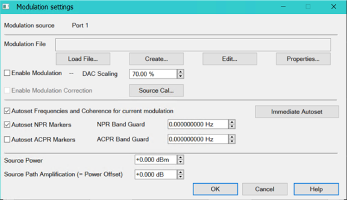
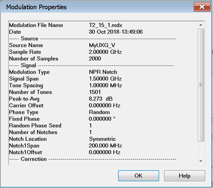

# Noise Power Ratio (NPR) Settings

NPR measures the nonlinear behavior of an RF microwave amplifier under a
modulated signal stimulus.

In this topic:

  * Requirements
  * Create a Spectrum Analysis Channel
  * Accessing NPR Settings
  * Modulation settings dialog
  * [Create Modulation dialog](../Applications/Modulation_Distortion/Create_Modulation_Files.md#Create_Modulation) (separate topic)
  * [Modulation Cal - Setup dialog](../Applications/Modulation_Distortion/Modulation_Flatness_and_Power_Calibration.md) (separate topic)

[See Noise Power Ratio (NPR) Measurement
Example](../Tutorials/Noise_Power_Ratio_\(NPR\)_Measurement.htm)

## Requirements

  * Spectrum Analyzer Option S9x090xA/B

  * 2- or 4-Port PNA with ability to connect an external modulated source

  * Supported external sources:

    * E8267D PSG Vector Signal Generator

    * M8190A with E8267D PSG Vector Signal Generator

    * M9383A/B, M9384B (wideband vector, 44 GHz, with enhanced phase noise)

Note: When setting up an M9383A, M9383B, or M9384B source in the [External
Device Configuration](../System/Configure_an_External_Device.htm#ExtDevConfig)
dialog, select MXG_Vector as the driver (they are code compatible).

    * N5182B MXG RF Vector Signal Generator

    * N5192A and N5194A UXG Vector Adapter

## Create a Spectrum Analysis Channel

  1. On the VNA front panel, press Meas > S-Param > Meas Class....

  2. Select Spectrum Analysis, then either:

     * OK delete the existing measurement, or

     * New Channel to create the measurement in a new channel.

  3. A Spectrum Analysis measurement is displayed.

#### Accessing NPR Settings  
  
---  
Using Hardkey/SoftTab/Softkey | Using a mouse  
  
  1. Press Freq > Source IQ Mod. > MXG.

|

  1. Click Stimulus
  2. Select SA Setup...
  3. Select the Source tab.
  4. Click in the IQMod column then select Edit.

  
  
Modulation settings dialog help |   
---|---  
 Modulation source \- Displays
the name of the modulation source. Modulation File \- Displays the modulation
file name. Load File... button \- Loads an existing modulation file.
Create...- button \- See [Create
Modulation](../Applications/Modulation_Distortion/Create_Modulation_Files.htm#Create_Modulation)
dialog description. Edit...- button \- See [Create
Modulation](../Applications/Modulation_Distortion/Create_Modulation_Files.htm#Create_Modulation)
dialog description. Properties button \- Displays the properties found in the
modulation file. This is the active Modulation Filename selected in the
Modulation settings dialog. This information cannot be edited.
 Enable Modulation - Check
to enable modulation. DAC Scaling \- Sets the scaling factor used for the
waveform (full scale = 70%). This ensures that the DAC filter does not output
a signal that is larger than the DAC's maximum output level, which can cause
distortion in the system.

#### Enable Modulation Correction \- Automatically checked if user exits the
calibration wizard with Exit & Save Cal. This option is grayed out if a
modulation calibration has not been performed.

Source Cal... button \- Accesses the [Modulation Cal -
Setup](../Applications/Modulation_Distortion/Modulation_Flatness_and_Power_Calibration.htm#Modulation_Cal_Settings_Dialogs)
dialog for performing source modulation calibration. Autoset Frequencies and
Coherence for current modulation - Check to allow frequencies and coherence to
be set automatically for the current modulation. Autoset NPR Markers  Enables
and disables NPR markers. Autoset ACPR Markers  Enables and disables ACPR
markers. NPR Band Guard \- Guard band on each side of the notch in an NPR
measurement. ACPR Band Guard \- Guard band between the end of the modulation
signal and where ACPR is measured. Immediate Autoset button - Click to adjust
frequencies and markers if modulation settings are changed. Source Power \-
Sets the source power level. Source Path Amplification (= Power Offset)  \-
Displays the Power Offset to monitor the power budget between the source and
DUT. The Power Offset setting provides a method of compensating port power for
added attenuation or amplification in the source path. [Learn
more](../System/Power_Limit_and_Power_Offset.htm#Offset).

####

