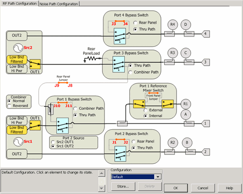

# PNA-X RF Path Configurator

* * *

Allows you to configure hardware components that are available with selected
[PNA-X options.](../Support/Configurations.md#PNAX)

N522xB and N523x models do NOT have the RF Path Configurator.

### How to access Path Configurator  
  
---  
Using Hardkey/SoftTab/Softkey | Using Menus:  
  
  1. Press Setup > Internal Hardware > RF Path Config....

|

  1. Click Instrument.
  2. Select Setup.
  3. Select Internal Hardware.
  4. Select RF Path Config...

  
  
  
The following image shows configuration with PNA-X Opt 423 (4-port, internal
2nd source, combiner, and mechanical switches). Your PNA-X may not include
these options.

### See Also

[IF Path Configuration](../IFAccess/IF_Path_Configuration.md)

[PNA-X specs](../Specs/ManualChoice.md) for block diagrams

[Internal Second Source
limitations](../S0_Start/Internal_Second_Source.htm#Restrictions)

[VNA Configurations and Options](../Support/Configurations.md)

Path Configuration dialog box help  
---  
See [Noise Figure tab](../Applications/Noise_Figure.md#PathPic) of the Path
Configuration. Note: With [selected PNA-X
options](../Support/Configurations.htm#PNAX), pulse modulation is available
ONLY on OUT1 of Src 1 and Src 2. [See block
diagram](../IFAccess/IF_Path_Configuration.htm#ExpandedBD). Different paths
can be configured for each channel.

### Configuration

Select, store, and delete factory configurations or user-defined
configurations. Configurations are stored on the VNA hard drive. Any
configuration can be saved, and later recalled, from this dialog. Click Store,
type a configuration name, then click OK. Text area Displays text describing
the physical connections required to complete the configuration. The text for
factory configurations can NOT be edited. Text is saved as part of the
configuration. Cancel Closes the dialog and returns the configuration settings
to the state they were in when the dialog was opened. Cancel does NOT undo
Store and Delete actions that were performed while the dialog was open. Notes

  * Click or touch anywhere within a box on the screen to cycle through the available settings.
  * Some switch settings alter graphics in areas other that where the switch is thrown.
  * If you don't hear switches clicking, this could be why:
  *     * Electronic switches are orange on the path configuration dialog. These switches do not make noise when being thrown. Mechanical switches are blue.
    * The channel is not sweeping.
    * The following selections do NOT throw switches, but simply indicate how to connect jumper cables by drawing red lines on the dialog:
    *       * Combiner (Normal/Reversed)
      * Port 2 Source (Src2 OUT1/Src1 OUT2)

| Note: To prevent premature wear, the VNA does not allow attenuators or other
mechanical switches to switch continuously. These mechanical devices are set
for the entire channel. When more than one channel is used, and a mechanical
device setting is NOT the same for all channels, only the ACTIVE channel is
allowed to sweep. All other channels are NOT allowed to sweep (Blocked). Learn
how to [view the settings of all mechanical
devices](../System/Mechanical_Devices.htm) in the VNA.  
---  
  
  * Red lines are jumpers on the front or rear panel.

  * Src1 / Src2 Settings:

  *     * Low Bnd Filtered (default setting) reduces harmonics below 3.2 GHz on OUT1 of both Src1 and Src2.

    * Low Bnd Hi Pwr setting does not use the filtering which causes higher power below 3.2 GHz. See Max Leveled Power in the [specifications](../Specs/ManualChoice.md) for your PNA-X model.

    * Each source optionally has [pulse modulation](../IFAccess/IF_Path_Configuration.md) capability.

    * Note: Pulse modulation is available ONLY on OUT1 of Src 1 and Src 2. [See block diagram](../IFAccess/IF_Path_Configuration.md#ExpandedBD). Your VNA must also have Pulse options. [Learn more](../Support/Configurations.md).

  * [Copy channel](CopyChannels.md) feature also copies path configuration settings.

  * Path Configuration is saved and recalled as part of an [instrument state.](../S5_Output/SaveRecall.md)

### Factory Configurations

Note: Recalling a stored configuration will over-write MANY RF and [IF path
configuration](../IFAccess/IF_Path_Configuration.htm) settings. Make your
measurement settings AFTER recalling a stored configuration, NOT before.

Port 1 2-tone Routes Source 2 through the internal combiner to create a two-
tone signal out port 1. The standard jumper configuration is used. This is the
configuration that is used to make [IMD
measurements](../Applications/IMD_App.htm).

Src 2 Out Port 2 (Option 423 ONLY) Routes Source 2 (OUT1) to port 2 using an
external cable attached to the rear-panel J8 to J1. This allows source power
at port 1 AND port 2 simultaneously. Source power is NOT available at port 3.
[Learn more about Internal Second Source
capability](../S0_Start/Internal_Second_Source.htm).

2 port Dual Source (Option 224 ONLY) Routes Source 2 (OUT1) to port 2 using an
external cable attached to the rear-panel J8 to J1. This allows source power
at port 1 AND port 2 simultaneously. This also allows pulsed measurements to
be performed on both ports 1 and 2.

Hot S-parameters The rear panel jumpers must be manually reconfigured to allow
the source 2 signal to be routed through the thru path of the internal
combiner. Source 2 is used to drive the AUT into compression, so the highest
possible output power is required. Source 1, routed through the coupled path
of the combiner, is used for S-parameter measurements, so a small signal is
sufficient. These two signals are combined but the frequencies are usually
offset.

### See Also

  * [Configuration for High-power measurements](../Tutorials/High_Power_PNA-X.md)

  
  
* * *

