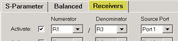
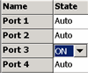

# Phase-Coherent Measurements

* * *

Coherent phase means that the measurement does NOT have random phase.
Coherent-phase measurements require the comparison of phase between two
sources that are sweeping simultaneously. It also requires that two receivers
are measuring the two sources simultaneously.

This capability is available in the PNA-X using several applications:

  * [iTMSA](../Applications/iTMSA.md) (Opt S93460A/B) provides phase-coherent Balanced measurements.

  * [Phase Control](Phase_Control.md) (Opt S93088A/B) provides phase-coherent CW or Phase Sweep measurements.

  * R/R measurements can provide simple phase-coherent measurements.

### How to make phase-coherent R/R (R over R) measurements

To make a phase-coherent R/R measurements, both sources must be ON
simultaneously, and the receiver measurements must be made on the same sweep.
On a 4-port PNA-X, the two sources are NOT available at all VNA ports
simultaneously. It is important to [learn these
restrictions.](../S0_Start/Internal_Second_Source.htm#Restrictions) Also, both
receiver measurements must be made on the same sweep.

  1. Create a ratioed receiver measurement using two reference receivers. [Learn how](Measurement_Parameters.md#Receiver). For example, you might create an R1/R3 measurement, specifying the source port as either 1 or 3.

  2. The source port that is selected above is turned on automatically. The other source port (port 3 in this case) must be turned ON manually using the [Power and Attenuators dialog](Power_Level.md#Advanced).

  3. Select a phase format. [Learn how.](Data_Format.md)

* * *

