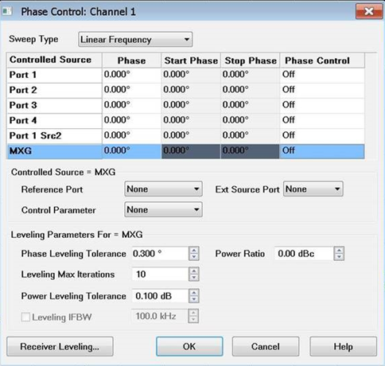
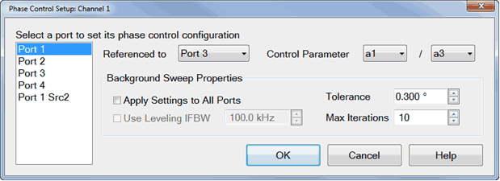
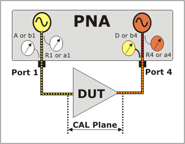
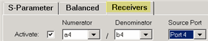
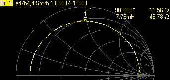
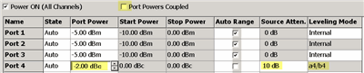
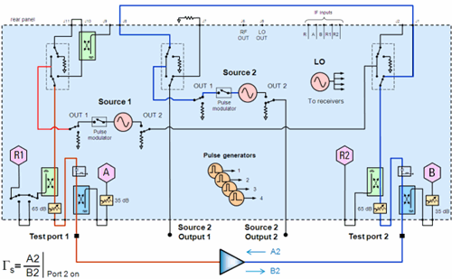

# Source Phase Control (Opt S9x088A/B)

* * *

Option S9x088A/B allows you to control the phase of a VNA source or an
external source. Two sources are required.

  * [Overview](Phase_Control.md#Overview)

  * [Features and Limitations](Phase_Control.md#FeaturesLimitations)

  * [Phase Control Use-Cases](Phase_Control.md#UseCase)

  * [How to make Phase Settings](Phase_Control.md#How)

  * [Calibration and Phase Control](Phase_Control.md#calibration)

  * [Active Load Pull Examples](Phase_Control.md#ActiveLPExample)

  * Phase Control with N Sources

[See other 'Setup Measurements' topics](Select_a_Measurement_State.md)

Overview

The Source Phase Control feature provides a specific phase difference between
two sources. The phase difference can be fixed (for example, at 90 degrees),
or swept between two arbitrary phase values (for example, from 0 to 360
degrees).

This feature is allowed on ALL PNA-X models, any N522x, E5080B, E5081A,
M980xA, M983xA and P50xxA/B model with either two internal sources or an
external source and configurable test set.

Any combination of VNA internal or external sources may be used. One source is
selected as the controlled source and the other source is the reference
source. You select the two sources by selecting the ports at which the sources
are available. The choice of ports is limited for you on the Phase Control
dialog. [Learn about these
limitations.](../S0_Start/Internal_Second_Source.htm#Restrictions)

In addition to selecting source ports, you also select the receivers to be
used to measure the phase for the sources. This can be test port receivers or
the reference receivers for the specified source ports. The receivers measure
the relative phase of the sources, then adjust the phase of the controlled
source, then remeasure until the phase difference is within the tolerance that
you specify.

Phase can also be set without using any receivers. This is called 'Open Loop'
mode. In this mode, the phase of the controlled source is set once, and
iterations are not done, resulting in phase that is less accurate and stable
compared to using receivers to measure and set phase. Use Open Loop mode when
you need to use the receivers to measure other parameters.

The phase of the controlled source can be swept relative to the reference
source. The phase difference between the controlled and reference source is
incremented and iterated on consecutive data points. Before starting the Phase
Control dialog, select Sweep Type = Phase Sweep. [Learn
how](Sweep.htm#SelectingSweepType).

When the phase of a source is controlled, the power of that source is also
controlled using [Receiver Leveling](Receiver_Leveling.md). Instead of the
normal receiver-leveling mode where only one receiver is used, when phase
control is active the ratio of two receivers is used to level the power of the
controlled source. This is useful for making active load-pull measurements as
described below. In Open Loop mode, neither the phase nor the power of the
source is controlled.

### Features and Limitations

  * Phase Control is allowed ONLY in a standard [S-parameter](Measurement_Classes.md) channel.

  * Phase Control can be used with Wideband pulse measurements - NOT in narrow-band pulse mode.

  * [Point Averaging](../S2_Opt/Trce_Noise.md#AveDiag) is NOT allowed.

  * External sources are supported. Learn how to [Configure an External Device](../System/Configure_an_External_Device.md). Phase can be controlled on Keysight MXG, PSG, ESG and EXG sources. The external source must be routed through the rear panel so that a reference receiver can measure its phase. Use the [Path Configuration dialog](Path_Configurator.md) to make switch settings and [enable FOM mode.](../FreqOffset/Frequency_Offset_Mode.md)

  * [Remote commands](../Programming/XStimulusTopic.md#Phase) are available that allow the phase and power of each point to be set individually, much like in source power calibration. Use these commands if you need to create a specific pattern of amplitude/phase states, such as characterizing the load-pull of an amplifier.

## Phase Control Use-Cases

Phase control and phase sweep is useful in the following applications:

### Active load control

Provide a controlled, electronically-settable impedance to the output port of
a DUT under fixed or swept-frequency conditions. Some examples are: measuring
the gain and output power of an amplifier with a known load, and measuring the
output from a directional detector with a known load.

The reference source is applied to the DUT input port, and the controlled
source is applied to the DUT output port as a reverse input wave. The phase
and power level of the controlled source is set relative to the forward output
wave of the DUT (which is determined by the reference source), so that any
arbitrary load impedance (gamma) can be set.

Optionally, the phase of the controlled source can be swept with a constant
frequency, so that the phase of gamma rotates while the magnitude of gamma
remains constant. The ratio of reverse input wave and forward output wave as
viewed on a Smith chart or polar display would appear as a circle. This
capability can be combined with external load-pull software to create
traditional load-pull power contours.

### Phase-controlled sources

Set the phase and magnitude of one source relative to a reference source, to
provide differential, quadrature, or arbitrary phase-offset signals at a fixed
or swept frequency. Typically, another instrument, receiver, or detector would
be required to measure the response of the DUT.

### How to make Phase Control settings:  
  
---  
Using Hardkey/SoftTab/Softkey |  Using a mouse  
  
  1. Press Sweep > Main > Sweep Setup....
  2. In the Sweep Setup dialog select Phase Sweep.

|

  1. Click Stimulus.
  2. Select Sweep.
  3. Select Sweep Setup....
  4. In the Sweep Setup dialog select Phase Sweep.

  
To perform a Phase Sweep:  
  
  1. Press Sweep > Main > Sweep Type.
  2. Select Phase Sweep.

|

  1. Click Stimulus.
  2. Select Sweep.
  3. Select Sweep Type....
  4. In the Sweep Setup dialog select Phase Sweep.

  
To select (view) a Phase format: ([Learn more](Data_Format.md))  
  
  1. Press Format > Format 1 > Phase.

|

  1. Click Response.
  2. Select Format.
  3. Select Phase, Unwrapped Phase, or Smith.

  
To access the Phase Control dialog:  
  
  1. Press Sweep > Source Control > Phase Control.

|

  1. Click Stimulus.
  2. Select Sweep.
  3. Select Source Control.
  4. Select Phase Control....

  
  
  
Phase Control dialog box help  
---  
 Sweep Type See [Sweep
Type](Sweep.htm#SweepTypeDiag) for information. Port N Select a port to set
its phase control configuration. This is the 'controlled' port. Phase Specify
any Fixed Phase setting. Start / Stop Phase Available when Sweep Type is set
to Phase Sweep. [Learn how.](Sweep.md#SweepTypeDiag) Enter the Start and Stop
phase values in degrees. Phase Control Click in the port cell to be
controlled, then choose from the following:

  * Off \- Phase is NOT set or controlled.
  * Open Loop \- Phase is set, but receivers are NOT used to measure and iterate the phase or power of the source. Therefore, the setting of phase is not as accurate or stable. Open Loop mode can be used with phase sweep (for example, from 0 to 360 degrees). However, each sweep may not start at an absolute phase of 0 degrees. Settings made for phase control do not apply to an open loop sweep.

Note: Open loop mode works in AUTO mode using the [Power and Attenuators
dialog](Power_Level.htm#Advanced). Therefore, the source does not have to be
set to ON.

  * <rec/rec>, reference port (Controlled) \- Phase and power is measured and iterated to within the specified tolerance. The receivers, reference port, and iteration properties are specified below.
  * Reference is displayed to indicate the specified reference port. You can also perform receiver leveling on the reference source. [Learn how](Receiver_Leveling.md).

Reference Port Select a source port to be used as a phase reference for the
controlled port. The two internal VNA sources are available ONLY at specific
ports. These choices are limited for you on the Phase Control dialog. For
example on a 4-port PNA-X, the possible port pairings are: 1/3, 1/4, 2/3, or
2/4. Port 1 can NOT be paired with Port 2, and Port 3 can NOT be paired with
Port 4. [Learn more about these
limitations.](../S0_Start/Internal_Second_Source.htm#Restrictions) Ext Source
Port Selects the source port that the external source is routed through.
Displayed when an external source is selected as the active port. Control
Parameter Select the receivers to be used to measure the phase and power of
the sources. The swept phase or phase offset will be the difference between
these two receivers. Use either standard notation (R1, A) or logical receiver
notation (a1,b1). [Learn more](Measurement_Parameters.md#RecNotation). Select
the receivers based on your application. You are responsible to make sure that
your DUT configuration routes the signals of interest to the correct
receivers. Otherwise, the phase will not be properly controlled. For example,
if you select a configuration where Port 4 is the controlled source (measured
by a4) and Port 1 is the reference source (measured by b4), both Port 4 and
Port 1 must be connected and measured by the Port 4 (a4 and b4) receivers.
This would typically be at your DUT output. See the [Active Load Pull
Example](Phase_Control.htm#ActiveLPExample) below. Phase Leveling Tolerance
When consecutive phase measurements of the same data point are within this
value of each other, then the phase measurement is considered settled.
Leveling Max Iterations Sets the maximum number of background phase
measurements to perform in order to achieve settling. If the phase is not
sufficiently settled after these measurements, then the closest value is used.
Power Leveling Tolerance The source is considered leveled when each stimulus
data point has achieved the power level +/- (plus or minus) this tolerance
value. Leveling IFBW Available only for VNA receivers. By default, the IFBW
for the leveling sweeps is set to 100 kHz. [Learn more about
IFBW.](../S2_Opt/Trce_Noise.htm#IFDiag) Power Ratio Power ratio value. This is
the power offset between the two receivers in the control parameter. Displayed
for all sweep types except Power Sweep. Start/Stop Power Sets the start and
stop power ratio values during a power sweep. Displayed when the Sweep Type is
set to Power Sweep. This is the power offset between the two receivers in the
control parameter.  
  
Phase Control Setup dialog box help  
---  
 Select a port to set its phase
control configuration This is the 'controlled' port. Referenced to Select a
source port to be used as a phase reference for the controlled port. The two
internal VNA sources are available ONLY at specific ports. These choices are
limited for you on the Phase Control dialog. For example on a 4-port PNA-X,
the possible port pairings are: 1/3, 1/4, 2/3, or 2/4. Port 1 can NOT be
paired with Port 2, and Port 3 can NOT be paired with Port 4. [Learn more
about these limitations.](../S0_Start/Internal_Second_Source.htm#Restrictions)
Control Parameter Select the receivers to be used to measure the phase and
power of the sources.

  * The LEFT receiver (a1 in the above image) measures the controlled source.
  * The RIGHT receiver (a3 in the above image) measures the reference source.

The swept phase or phase offset will be the difference between these two
receivers. Use either standard notation (R1, A) or logical receiver notation
(a1,b1). [Learn more](Measurement_Parameters.md#RecNotation). Select the
receivers based on your application. You are responsible to make sure that
your DUT configuration routes the signals of interest to the correct
receivers. Otherwise, the phase will not be properly controlled. For example,
if you select a configuration where Port 4 is the controlled source (measured
by a4) and Port 1 is the reference source (measured by b4), both Port 4 and
Port 1 must be connected and measured by the Port 4 (a4 and b4) receivers.
This would typically be at your DUT output. See the [Active Load Pull
Example](Phase_Control.htm#ActiveLPExample) below.

### Background Sweep Properties

Background sweeps are phase and power measurements that are made, but the
results are not displayed. For each data point, when subsequent measurements
are within the specified tolerance, that point is considered settled. If
consecutive phase or power measurements of the same data point are NOT within
the specified tolerance before the Max Iterations is reached, then one of the
following messages are displayed:

  * Phase leveling warning: phase not settled.
  * Phase leveling warning: power not settled.
  * Phase leveling warning: phase and power not settled.

Apply Settings to All Ports When checked, the specified settings are used for
all background sweeps for all phase-controlled ports. When cleared, the
following three settings are specified independently for each port pair. Use
Leveling IFBW Available only for VNA receivers. By default, the IFBW for the
leveling sweeps is set to 100 kHz. [Learn more about
IFBW.](../S2_Opt/Trce_Noise.htm#IFDiag) Tolerance When consecutive phase
measurements of the same data point are within this value of each other, then
the phase measurement is considered settled. Max Iterations Sets the maximum
number of background phase measurements to perform in order to achieve
settling. If the phase is not sufficiently settled after these measurements,
then the closest value is used.  
  
### Calibration and Phase Control

Calibrate only those ports that are used for a phase control measurement. For
example, if using ports 1 and 3 for phase control, then do NOT calibrate all
four ports. If other ports are calibrated, then even ports 1 and 3 may not
yield acceptable results.

Important During the Guided Calibration, at the Select Ports dialog, check the
[Calibrate source and receiver
power](../S3_Cals/Guided_Power_Calibration.htm#IncludePwrCal) checkbox.
Otherwise, the calibration may not be accurate.
  
---  
  
After performing calibration, the phase is aligned and the power is accurate
at the calibration plane.

### Active Load Control Example (4-port PNA-X)

[See setup using a 2-port 2-source PNA-X.](Phase_Control.md#2P2SPull)

  1. Select the Phase Control parameters in the above [Phase Control](Phase_Control.md#PhaseControlDiag) and [Phase Control Setup](Phase_Control.md#PhaseSetupDiag) dialogs.

  2. Setup a measurement with the same receivers that are selected on the Phase Control Setup dialog. In this example, on the '[Receivers' measurement tab](Measurement_Parameters.md#Receiver), select 'a4/ b4' as in the following image:

### 

  3. Select Format, then either Phase or Smith Chart.

  4. If you continually see Phase leveling warning: power not settled, then on the [Power and Attenuators dialog](Power_Level.md#Advanced), clear Port Powers Coupled (independent port power), then add attenuation to the controlled port. This happens because of additional power being measured from both sources.

### Active Load Control with 2-Port 2-Source PNA-X Models

  1. Connect a rear-panel jumpers cable from J8 to J1.

  2. On the Phase Control Setup dialog, select Port 2 as the controlled source and Port1 Src 2 as the reference source.

  3. On the [Path Configuration dialog](Path_Configurator.md#PathConfDiag), on the Configuration box, select 2- port dual source.

  4. Select the Control Parameter (receivers) a2 / b2.

* * *

