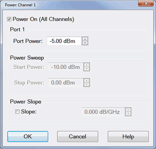
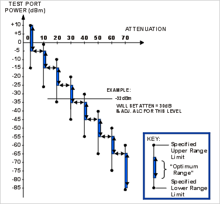
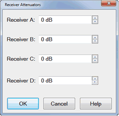

# Power Level

* * *

Power level is the power of the source at the test ports.

  * [How to make Power Settings](Power_Level.md#Power_Range)

  * [Power Dialog](Power_Level.md#powerDiag)

  * [Power and Attenuator Dialog](Power_Level.md#Advanced)

  * [Source Unleveled](Power_Level.md#Unleveled)

  * [Setting Independent Port Power](Power_Level.md#Atten_Uncpld_Ports)

  * [Optimum Attenuation Value](Power_Level.md#Optimum)

  * [Receiver Attenuation](Power_Level.md#Receiver_Atten)

  * [Power ON and OFF during Save / Recall and Preset](Power_Level.md#PowerStatePreset)

  * [Power ON and OFF during Sweep and Retrace](Power_Level.md#PowerONOFF)

[See other 'Setup Measurements' topics](Select_a_Measurement_State.md)

Power Settings

The test port output power is specified over frequency.

See the [Power Range specifications](../Specs/ManualChoice.md) for your
analyzer.

#### How to make Power settings

Use one of the following methods to set port power.  
---  
Using Hardkey/SoftTab/Softkey |  Using a mouse  
  
  1. Press Power > Main > Power Level / Start Power / Stop Power to enter desired power level.
  2. Press Power > Main > RF Power to turn ON or OFF the RF power.
  3. Press Power > Leveling & Offsets > click left side Slope small button to turn ON or OFF the slope (Green color means the slope is turned ON; Grey color means the slope is turned OFF).

|

  1. Right click on the X-axis label or stimulus range area under grid line.
  2. Click Power.... and then Power: Channel N dialog box appears.

  
  
  
Power dialog box help  
---  
 This dialog provides basic control of
source power for a specific port. See [Power and Attenuators dialog
box.](Power_Level.htm#Advanced) Power On (All Channels) Check to enable source
power for all channels. Only turns power ON if channel power setting is ON or
Auto. Port 'n' Active source port for which power is being set. Port Power
Sets the power level for the specified port. To accurately set the power level
at any point after the test port, perform a [Source Power
Calibration](../S3_Cals/PwrCalibration.htm#PerformSourcePowerCal).

### Power Sweep

Start / Stop Power Set the start and stop power values of a power sweep.

  * These settings are only available when [Sweep Type](Sweep.md#SweepTypeDiag) is set to Power Sweep.
  * Uncoupled power sweep power can be set from the [Advanced Power dialog.](power_level.md#Advanced)
  * You can Zoom to easily change the start and stop power levels in a power sweep. [Learn how.](Frequency_Range.md#Zoom)
  * [Learn more about Power Sweep.](sweep.md#power)

### Power Slope

Helps compensate for cable and test fixture power losses at increased
frequency. Slope Select to set the power slope. Clear to set power slope OFF.
[Learn more about power slope](Power_Level.md#slope).  
  
#### How to make Power settings

Use one of the following methods to set port power.  
---  
Using Hardkey/SoftTab/Softkey  
  
  1. Press Power > Main > Power and Attenuators and then the Power and Attenuators dialog box appears.

Detailed settings for Power and Attenuators:

  1. Press Power > Main > RF Power to turn ON or OFF the RF power.
  2. Press Power > Port Power > Select Port x to active the selected port.
  3. Press Power > Port Power > Power Level / Start Power / Stop Power to enter desired power level for selected port.
  4. Press Power > Port Power > Source State to choose the source state either Auto, On or Off.
  5. Press Power > Port Power > Coupling to turn ON or OFF Power Coupling.
  6. Press Power > Leveling & Offsets > click left side Slope small button to turn ON or OFF the slope (Green color means the slope is turned ON; Grey color means the slope is turned OFF).

  
  
Power and Attenuators dialog box help  
---  
 Defines and controls the source
power and attenuation for the active channel. Note: External sources can be
controlled from this dialog. [Learn
more](../System/Configure_an_External_Device.htm). Power On (All Channels)
Check to enable source power for all channels (same function as RF Power).
Only turns power ON if channel power setting is ON or Auto. Port Powers
Coupled

  * Coupled (checked) The power levels are the same at each test port. Set power at any test port and all test ports change to the same power level.
  * Uncoupled (cleared) The power levels are set independently for each test port. Uncouple power, for example, if you want to measure the gain and reverse-isolation of a high-gain amplifier. The power required for the input port of the amplifier is much lower than the power required for the output port. A power sweep can also be performed with uncoupled power. Learn more about [Setting Independent Port Power](Power_Level.md#Atten_Uncpld_Ports)

Name Lists the analyzer test ports. State

  * Auto Source power is turned ON at the specified test port when required by the measurement. This is the most common (default) setting. See also [Power ON and OFF during Save / Recall, User Preset, and Preset](Power_Level.md#PowerStatePreset).
  * ON Source power is ALWAYS ON, regardless of measurements that are in process. Use this setting to supply source power to a DUT port that always requires power, such as an LO port. This could turn OFF power at another test port. [Learn about internal second source restrictions](../S0_Start/Internal_Second_Source.md). See [also Setting Port Power On/Off for the Second source and Multi Module/Unit configuration](Power_Level.md#MultiSource).
  * OFF Source power is never ON, regardless of the measurement requirements. Use this setting to prevent damage to a sensitive DUT test port.

Port Power Sets the power level at the output of the source.

  * To accurately set the power level at any point after the test port, perform a [Source Power Calibration](../s3_cals/pwrcalibration.md#PerformSourcePowerCal).
  * See [specified power range of VNA model](../specs/manualchoice.md#Out_Pow).
  * See [ECal Module Compression Level](../S3_Cals/Using_ECal.md#compression)

Start / Stop Power Available ONLY when sweep type is set to Power Sweep. Set
the start and stop power values of a power sweep. [Learn how to set Power
Sweep.](Sweep.htm#power)

  * You can specify whether to maintain source power at either the start power or stop power level at the end of a power sweep. [Learn more](Power_Level.md#PowerONOFF).
  * A power sweep can be performed with [uncoupled power](Power_Level.md#Power_Coupling). Different power ranges can be swept in the forward and reverse directions.

Auto Range Check to allow the analyzer to select the optimum attenuation value
to achieve the specified test port power. Clear to manually set the
attenuation for each port. Type or select the attenuation value in the
adjacent Attenuator Control box. When using manual attenuation (Auto Range
cleared), Port Power can be set within a 60 dB range. For example:

  * With 0 dB of manual attenuation, Port Power can be set from -30 dBm to +30 dBm.
  * With 10 dB of manual attenuation, Port Power can be set from -40 dBm to +20 dBm, and so forth.

Important Note: The available power range can also be adjusted AUTOMATICALLY
by a Source Power Calibration, Guided Power Cal, or Power Compensation. If you
are NOT seeing the range that you expect, or the correct power level at your
DUT, view the Power Offset column in the [Power Limits and Offsets
dialog](../System/Power_Limit_and_Power_Offset.htm). Source Attenuator When
Port Powers are Uncoupled, manual attenuator control allows you to set a wide
range of power levels by setting the attenuation. See Setting Independent Port
Power. Also use manual attenuation control when a measurement requires a very
good impedance match with the source, such as with oscillators or
conditionally unstable amplifiers. Choose an attenuation level of 10 dB or
more to ensure the best source match.

  * Attenuators or other mechanical switches are NOT allowed to switch continuously. [Learn more.](Power_Level.md#NoteSwitchAttn)
  * When Port Powers are Coupled, changing one port Attenuation Control value changes all port values.

### Default Source Attenuation Based on Measurement Class

The table below lists the default source attenuation values (dB) for each port, based on the selected measurement class. These are the initial source attenuation values that appear when you open the Power and Attenuators dialog box. |  Meas.  
Class |  Port 1 |  Port 2 |  Src2  
Out1 |  Src2  
Out2 |  Port 1  
Src2  
---|---|---|---|---|---  
Std. |  0 |  0 |  0 |  0 |  0  
AHP |  0 |  0 |  0 |  0 |  0  
GCA |  0 |  0 |  0 |  0 |  0  
DIQ |  0 |  0 |  0 |  0 |  0  
IMS |  0 |  10 |  0 |  0 |  0  
IMD |  0 |  10 |  0 |  0 |  0  
MOD |  0 |  0 |  0 |  0 |  0  
NF |  20 |  10 |  0 |  0 |  20  
PN |  0 |  0 |  0 |  0 |  0  
SA |  0 |  0 |  0 |  0 |  0  
TDR |  NA |  NA |  NA |  NA |  NA  
GCX |  0 |  0 |  0 |  0 |  0  
IMSX |  0 |  10 |  0 |  0 |  0  
IMDX |  0 |  10 |  0 |  0 |  0  
MODX |  0 |  0 |  0 |  0 |  0  
NFX |  20 |  10 |  0 |  0 |  20  
SMC |  5 |  5 |  0 |  0 |  5  
VMC |  5 |  5 |  0 |  0 |  5  
  
Note: Because the reference receiver is not in the attenuation path, there is
more power at the reference receiver than at the test port by the amount of
source attenuation. By default, ALL VNA models mathematically offset the
reported power at the reference receivers by the amount of source attenuation.
[See Block diagram.](../Specs/ManualChoice.md#Block_diag_opt) A preference
can be set to NOT mathematically offset the reported power of the reference
receiver by the amount of source attenuation. Learn how to [set the
preference](../System/Preferences.htm).  
---  
  
Leveling Mode (ALC Hardware Softkey)- Refer to the following diagram:

  * Internal \- ALC leveling. Power level within an attenuator setting is limited to the ALC Range. [See Source Unleveled.](Power_Level.md#Unleveled)

  * Open Loop \- No ALC and NO Receiver Leveling. (Used during pulse conditions with the internal source modulators). NOT available on N523x models. No leveling is used in setting the source power. The lowest settable power, without attenuation, is limited to -30dBm. The source power level accuracy is very compromised. Use a source power calibration to make the source power somewhat more accurate.

  * Receiver Rx - Receiver Leveling. Select a receiver to use for leveling the source. [Learn more.](Receiver_Leveling.md)

  * Note: Receiver Leveling can be used with EITHER Internal ALC or Open Loop. See [Enable ALC Hardware](Receiver_Leveling.md#LevelingProps) on the Receiver Leveling dialog.

### Channel Power Slope

Helps compensate for cable and test fixture power losses at increased
frequency. With power slope enabled, the port output power increases (enter
positive value) or decreases (enter negative value) as the sweep frequency
increases.

Slope Select to set the power slope. Clear to set power slope OFF.

Power slope is computed and applied from 0 GHz – not from the measurement
start frequency.

For example, with the following measurement settings:

  * Start / Stop Freq: 10 GHz to 20 GHz

  * Power level: 0 dBm

  * Slope: 1 dB/GHz

The power into the DUT from 10 GHz to 20 GHz is 10 dBm sloping to 20 dBm

Offset and Limits Launches the [Power Offset and
Limits](../System/Power_Limit_and_Power_Offset.htm) dialog.

Receiver Leveling Launches the [Receiver Leveling](Receiver_Leveling.md)
dialog.

Receiver Attenuator Launches the Receiver Attenuator dialog.

Path Configurator Launches the [Path Configurator](Path_Configurator.md)
dialog.

Source Unleveled

When the power level that is required at a test port is higher than can be
supplied, a Source Unleveled [error
message](../Support/About_Error_Messages.htm) appears on the screen and the
letters LVL appear on the [status
bar.](../S1_Settings/Customize_Your_Analyzer_Screen.htm#status_bar)

To perform a power sweep, the range of power is usually limited to the range
of the Automatic Leveling Control (ALC) loop. (The PNA-X allows a very wide
power range using Open Loop).

Specifications guarantee the ALC power range over which power can be supplied
without an unleveled indication. However, the actual achievable power range on
your analyzer is probably greater than the specified range.

### How to calculate the specified achievable power range

From the specifications for a frequency span from 15 GHz to 20 GHz:

  * Max Leveled Power = -8 dBm

  * Power Sweep Range (ALC) = -17 dB

For this frequency range the specified power range is calculated as:

  * Max = -8 dBm

  * Min = (-8)-(17) = -25 dBm

When using Source Attenuators:

  * with 10dB of attenuation, this becomes -18 dBm to -35 dBm

  * with 20dB of attenuation, this becomes -28 dBm to -45 dBm, and so forth.

To resolve an unleveled condition, change either the Test Port Power or
Attenuator setting.

Important Note: The available power range can also be adjusted AUTOMATICALLY
by a Source Power Calibration, Guided Power Cal, or Power Compensation. If you
are NOT seeing the range that you expect, or the correct power level at your
DUT, view the Power Offset column in the [Power Limits and Offsets
dialog](../System/Power_Limit_and_Power_Offset.htm).

Setting Independent Port Power

You can uncouple port power and specify different power levels at each test
port. There are a few things to consider when setting independent port powers.

  * Does your required high and low power levels fall within the specified Min and Max power range of the analyzer? See Unleveled Indicator. If they do not, you may need to use the internal Source Attenuators.

  * Does the analyzer have source attenuators? If so, how many source attenuators? Some VNA models have one attenuator for each port. In most multiport VNA systems, the attenuators are shared by at least two test ports. See [VNA Options](../Support/Configurations.md) to see the availability and range of source attenuation on your VNA.

Note: To prevent premature wear, attenuators or other mechanical switches are
NOT allowed to switch continuously. These mechanical devices are set for the
entire channel. When more than one channel is used, and a mechanical device
setting is NOT the same for all channels, only the ACTIVE channel is allowed
to sweep. All other channels are NOT allowed to sweep (Blocked). Learn how to
[view the settings of all mechanical
devices](../System/Mechanical_Devices.htm).  
---  
  
## Setting Port Power On/Off for the Second source and Multi Module/Unit
configuration

When the unit has the second source capability or multi module/unit
configuration in PXI/USB VNA, Source power ALWAYS ON can be applied for each
source group.

The following dialog shows an example of three module configuration of six,
four and two port PXI VNAs. In this case, there are three independent source
group, port 1to 6, 7 to 10 and 11 to 12. You can set one port in each group at
ON state.

Optimum Attenuation Value

The attenuator has different positions, allowing a wide range of power levels.
The number of power ranges available is determined by the source attenuation
installed in your VNA. See [VNA Options](../Support/Configurations.md) to see
the availability and range of source attenuation on your VNA.

  * Each range has a total specified span (50 dB in the following Attenuation Values graphic ).

  * The optimum setting is the middle of the range. This range provides the best accuracy and performance of the source leveling system. The optimum ranges are the blue regions in the following graphic.

  * An attenuator setting can be selected manually or automatically. If automatic is selected, the blue optimum ranges (shown in the following graphic) are used.

Note: Error correction is fully accurate only for the power level at which a
measurement calibration was performed. However, when changing power within the
same attenuator range at which the measurement calibration was performed,
ratioed measurements can be made with nearly full accuracy (non-ratioed
measurements with less accuracy).

Receiver Attenuators dialog box help  
---  
 Receiver Attenuators are offered as an
option. [Learn more](../Support/Configurations.md). Type or select
independent attenuation values for each receiver.

  * Receiver A is at Test Port 1
  * Receiver B is at Test Port 2
  * Receiver C is at Test Port 3
  * Receiver D is at Test Port 4

Receiver Attenuation is used to protect the VNA test port receivers from
damage or compression. Receiver attenuation causes the reported power at the
receiver to be less than the power at the test port by the specified amount of
attenuation. When an [external test
set](../System/External_Testset_Control.htm) is connected, Receiver
Attenuation control is only available for the physical receivers in the VNA.
Switching receiver attenuation using [logical receiver
notation](Measurement_Parameters.htm#RecNotation) is NOT allowed. CAUTION! You
can damage the analyzer receivers if the power levels exceed the maximum
values.

  * See [Technical Specifications](../Specs/ManualChoice.md#Rcvr_Input) for the maximum input power to a receiver and receiver compression.
  * See [Receiver attenuation values for your VNA model](../Support/Configurations.md).

  
---  
  
Power ON and OFF during Save / Recall, User Preset, and Preset

To protect your DUT from being inadvertently powered ON, the following RF
Power ON/OFF settings occur:

### [Instrument State Save/Recall](../S5_Output/SaveRecall.md#State)

If power is OFF when an instrument state is saved, then power will always be
OFF after the instrument state is recalled.

If power is ON when an instrument state is saved, and the current power
setting is OFF, then power will be OFF after the instrument state is recalled.

### [User Preset](Preset_the_Analyzer.md#PresetUserDefined)

If power is OFF when a User Preset is saved, then power will always be OFF
after a User Preset.

If power is ON when a User Preset is saved, and the current power setting is
OFF, then power will be OFF after a User Preset.

### [Preset](Preset_the_Analyzer.md)

Instrument Preset sets power ON by default.

This can be changed with a [Preference
setting](../System/Preferences.htm#PresetPower) so that, if the current power
setting is OFF, then power will be OFF after Preset.

Power ON and OFF during Sweep and Retrace

The frequency range of the VNA covers several internal frequency bands. The
higher the frequency range of the VNA, the larger the number of bands. For
example, a 9 GHz VNA has 6 frequency bands, a 50 GHz VNA has 25 frequency
bands. See the [frequency band crossings](Frequency_Range.md#BandCrossings).

Power to the DUT is turned OFF during band changes to avoid causing power
spikes to the DUT.

Retrace occurs when the source gets to the end of your selected frequency span
and moves back to the start frequency. Power to the DUT is again turned OFF
when retracing across frequency bands.

The following power ON/OFF states occur for various stimulus settings:

  1. Single band sweep \- The power ON/OFF state to the DUT during retrace is determined by [a preference setting](../System/Preferences.md#RetracePower).

  2. Multi-band sweep \- The power to the DUT is turned OFF while sweeping across a band crossing. It is turned OFF again during retrace.

  3. Power sweep \- Power sweep is always done at a single frequency, Therefore, like item 1, the power ON/OFF state to the DUT during retrace is determined by [a preference setting](../System/Preferences.md#RetracePower)

  4. Single sweep:

  1.      * Manual trigger mode - At the end of a multiband sweep, power is turned OFF during retrace, and then power is turned back ON before arming for the next trigger.

     * Hold mode - Power can be ON or OFF depending on when and how Hold mode is entered. However, power can be immediately turned OFF manually or remotely.

Caution: Avoid expensive repairs to your analyzer. Read [Electrostatic
Discharge Protection](../Tutorials/esd.htm).

* * *

