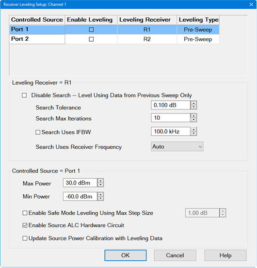
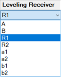
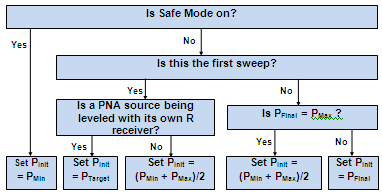

# Receiver Leveling

* * *

Note: The M937xA/P937xA does not support this function.

Receiver Leveling adjusts the source power until the measured receiver power
is equal to the Port Power.

In this topic:

  * [Overview](Receiver_Leveling.md#Overview)

  * Receiver Leveling Process

  * [Features and Limitations](Receiver_Leveling.md#Features)

  * [How to make Receiver Leveling settings](Receiver_Leveling.md#How)

    * Support for Pre-Sweep Mode, Point Mode, and Prior Sweep Mode

  * [Receiver Leveling dialog box help](Receiver_Leveling.md#RecLevelDiag)

  * [Initial Power Selection](Receiver_Leveling.md#Initial)

See other ['Setup Measurements'](Select_a_Measurement_State.md) topics

### Overview

Receiver Leveling uses receiver measurements to adjust the source power level
across a frequency or power sweep. There are three receiver leveling modes:
pre-sweep mode, point mode, and prior sweep mode.

Note: Enabling Safe Mode when using receiver leveling may be necessary to
ensure stable results.

### Receiver Leveling Process

Pre-Sweep Mode

Before each measurement sweep, a variable number of background sweeps are
performed to measure and adjust power at the target port. Those power
adjustments are then used to achieve greater source power level accuracy on
the final sweep.

This is similar to a [Source Power
Calibration](../S3_Cals/PwrCalibration.htm#SourcePowerCal) but because
Receiver Leveling is updated for every measurement sweep, it provides more
accurate source power levels, but also takes longer to perform each
measurement sweep.

  1. For each leveling pre-sweep, port power is measured by the specified receiver. [Learn how the initial power level is selected](Receiver_Leveling.md#Initial).

  2. The deviation is calculated between the measured power and the port power setting.

  3. The deviation is applied as a power offset on the final sweep.

  4. This pre-sweep process continues until the receiver power at each data point has achieved the port power within the specified tolerance value, or until the specified number of leveling sweeps (iterations) has been reached.

Point Mode (if supported by the hardware)

This mode does not use a pre-sweep. Instead, leveling is performed at the same
time each point is acquired.

  1. When the sweep starts, the source is set to the first point and power is read.

  2. If the power is outside the target power tolerance, the source power is adjusted and the point is read again.

  3. If max iterations is reached or the target power is within the tolerance, display the point and move to the next point.

  4. This process repeats for each point.

Prior Sweep Mode

This mode avoids any extra data acquisition. There is no pre-sweep or extra
point acquisitions.

This mode uses the data acquired during the prior sweep to compute a power
offset for the following sweep. The power continues to be adjusted in this way
until the tolerance is met.

  1. Acquire data from the prior sweep.

  2. The deviation is calculated between the measured power and the port power.

  3. The deviation is applied as a power offset on the final sweep.

  4. This process repeats for each successive sweep until the tolerance is reached.

### Features and Limitations

  * Receiver Leveling can be used with most [sweep types](Sweep.md#SweepTypeDiag), including Segment sweep and Power sweep. See [Wide Power Sweep with Receiver Leveling](../Tutorials/Wide_Power_Sweep_with_Receiver_Leveling.md).

  * Receiver Leveling is ALWAYS enabled for the controlled source when [Phase Control](Phase_Control.md) (Opt S93088A/B) is enabled.

  * Receiver Leveling is available for standard S-parameter measurements and with [FCA](../FreqOffset/FCA_Use.md), [GCA](../Applications/Gain_Compression_Application.md), and [IMD](../Applications/IMD_App.md) applications.

  * Turn ON Receiver Leveling before or after doing a Calibration. When turned ON before calibrating, it is turned OFF during the calibration, then back ON after calibration.

  * Power Offset on the [Offsets and Limits dialog](../System/Power_Limit_and_Power_Offset.md) can be used when there exists an additional attenuator or booster amplifier in the source path. An offset should be set to improve the leveling speed. This power offset is automatically used to set the port power.

Use Receiver Leveling for the following:

  * Correcting for short term drift when using an external component, such as a booster amplifier. The booster amplifier must be connected to the front-panel jumpers, in front of the reference receiver. See the Block diagram for your VNA, located at the end of every [Specifications document.](../Specs/ManualChoice.md)

  * Extending the accuracy of power leveling at very low powers where the internal detector may be too noisy.

  * Providing controlled power during Pulsed measurements in an open loop mode.

  * Controlling the power at the outputs of [MM-Wave heads](../IFAccess/External_Test_Head_Configuration.md).

Note: Increase the sweep delay if output power is not accurate when Receiver
Leveling is applied to two or more ports.

### How to make Receiver Leveling settings

Start the [Power and Attenuators](Power_Level.md#Advanced) dialog box as
follows:  
---  
Using Hardkey/SoftTab/Softkey |  Using a mouse  
  
  1. Press Power > Main > Power and Attenuators....
  2. On the Power and Attenuators dialog, click Receiver Leveling button.

|

  1. Click Stimulus, Power, then [Power and Attenuators](Power_Level.md#Advanced).
  2. On the Power and Attenuators dialog, click Receiver Leveling button.

  
  
  
Receiver Leveling dialog box help  
---  
[Learn about Receiver Leveling](Receiver_Leveling.md) (scroll up).

## Support for Pre-Sweep Mode, Point Mode, and Prior Sweep Mode

The following dialog and descriptions apply to VNAs that support pre-sweep
mode, point mode, and prior sweep mode receiver leveling.
 Controlled Source (Port)
Each source port to be leveled is configured individually. Select a source to
be configured for receiver leveling. Choose from: Port 1, Port 2, Port 3, Port
4, or any active external source. [Learn more about External
Devices](../System/Configure_an_External_Device.htm). Note: A Modulation
Distortion channel only allows one modulated source. Therefore, only one row
will be displayed showing the name of the modulated source. Enable Leveling \-
Checkbox enables/disables receiver leveling. The default is disabled
(unchecked). Leveling Receiver \- Select a receiver to be used to level the
specified source by clicking on the Leveling Receiver pull down menu. Choose
from a VNA Receiver or Ext. Device
([PMAR](../System/Configure_a_Power_Meter_As_Receiver.md)).
 For a VNA Receiver,
choose from any VNA receiver using standard or receiver notation. To level
power at the source output or DUT input choose the reference receiver for the
source port. For example, to level the source power at port 1, then choose
"R1". To level power at the DUT output, choose the receiver that is used to
measure the DUT output. If the DUT output is connected to port 2, then select
"B" or 'b2". [Learn about Receiver
Notation](Measurement_Parameters.htm#RecNotation). When [Phase
Control](Phase_Control.htm) is enabled, the ratioed receivers used in Phase
Control are selected and can NOT be changed. However, the Reference Source CAN
also be selected for Receiver Leveling. For Ext Device type, choose a
configured PMAR device. Leveling Type - Sets the receiver leveling type: Pre-
Sweep \- _Leveling sweeps are performed in the background (not visible) before
every measurement sweep to measure and apply source correction data._ Point \-
Leveling is performed per point. If the point is outside the tolerance, the
source power is adjusted and the point is read again. This process is repeated
until the leveling receiver reports that the target power is within tolerance
(or the maximum iteration setting is reached). When the iteration is done, it
moves immediately to the next point. Prior Sweep \- Disables the receiver
leveling search function. After the first sweep, receiver leveling reads the
data and computes the correction for each point in an attempt to reach the
target power level. The calculated offset is used for the next sweep. This
process is repeated to improve receiver leveling for successive sweeps.

### Controlled Source Setup

Max Power Always limits the maximum power out of the source to this value. The
message: Power set to Max Power appears when this limit is reached. If the
maximum port power out of the VNA is reached at any time during the leveling
sweeps, the following message appears: Power set to user power limit. Min
Power Always limits the minimum power out of the source to this value. The
message: Power set to Min Power appears when this limit is reached. When Safe
Mode is enabled, this value is used as the initial power level for the
leveling loop process. Note: The MAX/MIN limit is always used regardless of
the safe mode state. In addition, the MAX/MIN limit is for port power and
related to power offset. If the power offset is not set correctly, the MAX/MIN
limit is not correct and it may impact the leveling. Ensure that the power
offset in the channel is the same as power offset during calibration. If the
exact power offset is not known, choose a limit for source and then it will
not be related to power offset. Enable Safe Mode Leveling Using Max Step Size
To protect your DUT and ensure stable results, these settings control the
extent to which the source power will be changed to achieve the port power as
measured at the reference receiver. These settings could be necessary when
using external components with a large variation in frequency response
(flatness). When checked:

  * The Min source output is used as the initial power level for the leveling loop process.
  * The controlled source is never stepped more than the Max source step size.

When cleared:

  * The initial power for the leveling loop may be determined by the Min source output, the Max source output, the last setting of the leveling loop, or the target value of the leveling loop. [See Initial Power below](Receiver_Leveling.md#Initial).
  * The Max source step size is ignored.

Max source step size When Safe Mode is enabled, the change in source power at
each data point from one sweep to the next is limited to this value. For
example, assume Safe Mode is enabled, and Max Power Step is set to 1 dB. On
the first leveling sweep, the first data point measures 3 dB lower than the
port power, then source power for data point 1 will be increased by 1 dB for
the next sweep, and likely for the following two sweeps. Update Source Power
Calibration with Leveling Data Available only when using an RF Source and VNA
receiver.

  * When checked, the latest correction data is copied to the Source Power Cal correction array. When Leveling Mode is switched back to Internal (on the Power and Attenuators dialog), [Source Power Cal](../S3_Cals/PwrCalibration.md#SourcePowerCal) is automatically turned ON using this correction data.
  * When cleared, Source Power Cal is NOT turned ON when Leveling Mode is switched back to Internal.

Source ALC Hardware  
NOT available with External sources. 

  * Internal\- Internal ALC leveling and Receiver Leveling (Recommended).
  * Open Loop\- NO ALC leveling; Receiver Leveling ONLY. NOT available on [N523x models](../Support/Configurations.md#N523x).

### Leveling Receiver Setup

Leveling Tolerance The source is considered leveled when each stimulus data
point has achieved the power level +/- (plus or minus) this tolerance value.
Leveling Max Iterations If every stimulus data point does NOT achieve the port
power after this number of leveling sweeps, the measurement sweep occurs using
the correction values obtained from the last leveling sweep. The message: Not
settled, noisy trace appears when the Max Iterations is reached. If you see
this message, you can increase the Max Iterations, reduce the IFBW, or
increase the Tolerance setting. Note: Max Iterations can no longer be set to
zero. Instead, select Prior Sweep mode to disable the receiver leveling search
function. In this way, there will be no pre-sweep for the receiver leveling,
but the value of the receiver data will be used to correct the next sweep.
This provides a post sweep correction and can be useful for correcting slow
drift in a system where a booster amplifier or open loop ALC is used, without
adding pre-sweeps to the sweep-acquisitions. Leveling Receiver Frequency \-
Available ONLY when the selected receiver is a VNA Receiver or power meter.
This setting determines which receiver frequencies are measured. Choose from:
Note: LO Leveling is not supported.

  * Auto \- FOM source frequency range for reference receivers. FOM receiver frequency range for test receivers.
  * FOM Receiver \- FOM Receiver frequency range. Learn more about [Frequency Offset Mode.](../FreqOffset/Frequency_Offset_Mode.md)
  * FOM Source \- FOM Source frequency range.
  * DUT Input \- Mixer/Converter input frequency range.
  * DUT Output \- Mixer/Converter output frequency range.
  * FOM Primary \- Current Active Channel settings.

Leveling IFBW Available only for VNA receivers. By default, the IFBW for the
leveling sweeps is set to 100 kHz. [Learn more about
IFBW.](../S2_Opt/Trce_Noise.htm#IFDiag)

  * Increase this value to make faster, but noisier leveling sweeps.
  * Decrease this value to maker slower, more repeatable leveling sweeps.
  * Uncheck the box to use the same IFBW as the measurement sweeps.

Leveling Noise BW \- (SA multitone and Modulation Distortion channel only)
Sets the receiver noise bandwidth value for leveling at pre-sweep. Noise
bandwidth is equal to the Resolution bandwidth divided by the Vector Average
factor. Carrier Aperture Span/Offset \- (SA multione Modulation Distortion
channel only) Enabling the aperture settings will measure the power more
quickly by reducing the span of the measurement during the pre-sweep. Enter
the span and offset of the frequency aperture used to measure the signal
power. Since the ideal modulation signal is known, the total power is
calculated from this value.  
  
### Initial Power Selection

For each displayed data point, the leveling algorithm must select an initial
power to begin the iteration process. This value is chosen as follows:

Where:

PInit = the initial power for the iteration process.

PFinal = the final power setting from the previous leveled sweep.

PMin = the minimum controlled source output level as specified in the Receiver
leveling setup.

PMax = the maximum controlled source output level as specified in the Receiver
leveling setup.

PTarget = the target power level for the selected leveling receiver.

* * *

