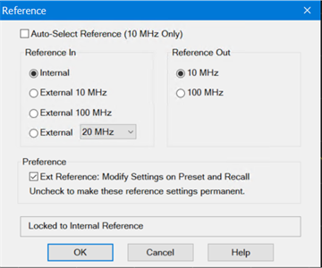

# Reference

Note: This feature applies to instruments with serial prefix 6021 and above
with A.14.00.xx firmware and above and with instruments with synthesizer 7.0
or greater.

The frequency reference can be set to use the internal reference in the VNA or
use an external reference connected to the 10 MHz REF IN connector on the rear
panel.

The 10 MHz REF IN on the rear panel accepts an external frequency reference of
10 MHz, 20 MHz, 80 MHz,or 100 MHz. The 10 MHz REF OUT connector on the rear
panel is used to connect the frequency reference to other test equipment.

#### Accessing Reference Settings  
  
---  
Using Hardkey/SoftTab/Softkey |  Using a mouse  
  
  1. Press Setup > Internal Hardware > Reference...   

|

  1. Click Instrument.
  2. Select Setup.
  3. Select Internal Hardware.
  4. Select Reference.

  
  
Reference dialog help |    
---|---  
  
#### 

#### Auto-select Reference (10 MHz Only) \- When selected (default), the
frequency reference selects between the internal 10 MHz reference or external
10 MHz reference automatically. The external reference will be selected if a
signal is detected at the 10 MHz REF IN connector on the rear panel.

#### Reference In

Internal \- Selects the 10 MHz internal frequency reference. External 10 MHz
\- Selects an external 10 MHz frequency reference connected to the 10 MHz REF
IN connector on the rear panel. External 100 MHz \- Selects an external 100
MHz frequency reference connected to the 10 MHz REF IN connector on the rear
panel. External 20 MHz/80 MHz \- Selects an external 20 MHz or 80 MHz
frequency reference connected to the 10 MHz REF IN connector on the rear
panel. Note: Using the signal from PXI Chassis backplane degrades the
measurement performance especially absolute measurement. This is due to worse
phase noise on the reference signal from backplane. Reference Out

#### 10 MHz \- Selects 10 MHz frequency reference.

#### 100 MHz \- Selects 100 MHz frequency reference.

Preference Ext Reference \- Check to modify settings on a preset and recall or
uncheck to make the current reference settings permanent. See [Ext Device: De-
activate on PRESET and recall](../System/Preferences.htm#ExtRef) in preference
dialog.

####

Note (M937xA and P937xA) Reference In/Out Frequency cannot be selected. 10 MHz
only. Select the external reference at on or off.

