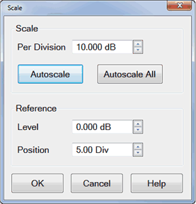
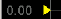
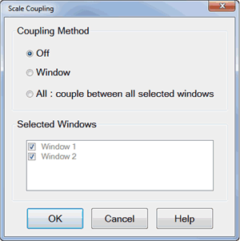

# Scale

* * *

The Scale, Reference Level and Reference Position settings (along with
[Format](Data_Format.md)) determine how the data trace appears on the VNA
screen.

  * [Scale, Reference Level and Position](Scale.md#Scale_Section)

  * [Scale Coupling](Scale.md#ScaleCoupling)

  * Magnify Mode and Zoom Preference

  * [Electrical Delay](../s2_opt/phase_accy.md#ed) (Separate topic)

  * [Magnitude Offset & Magnitude Slope](Scale.md#Magnitude)

  * Y-Axis Graph (Lin/Log Scale),Top, Bottom, Ref X/Y Level, Ref X/Y Position

  * [Phase Offset](../s2_opt/phase_accy.md#po) (Separate topic)

[See other 'Setup Measurements' topics](Select_a_Measurement_State.md)

Scale, Reference Level and Position

The Scale, Reference Level and Reference Position settings (along with format)
determine how the data trace appears on the VNA screen.

### How to set Scale, Reference Level, and Position  
  
---  
Using Hardkey/SoftTab/Softkey |  Using a mouse  
  
  1. Press Scale > Main > Scale / Reference Level / Reference Position.
  2. Input the desired value.

|

  1. Right-click on Y-axis annotation or the [trace status](Customize_Your_Analyzer_Screen.md#trace_status) label above the grid box.
  2. Select Scale....

  
  
  
Scale dialog box help  
---  
 Note: The scale settings are set to couple
with other traces in each window. The following settings assume that Scale
Coupling is set to OFF. [Learn more about Scale
Coupling.](Scale.htm#ScaleCoupling)

### Scale

Per Division Sets the value of the vertical divisions of a rectangular display
format. In Polar and Smith Chart formats, scale sets the value of the outer
circumference. Range: 0.001dB/div to 500 dB/div. Tip: Click on the Y-axis
labels, then use a mouse scroll wheel to change scale in preset increments. Or
Right-click on Y-axis annotation to change Scale. Autoscale \- Automatically
sets value of the vertical divisions and reference value to fit the ACTIVE
data trace within the grid area of the screen. The stimulus values and
reference position are not affected. The analyzer determines the smallest
possible scale factor that will allow all the displayed data to fit onto 80
percent of the vertical grid. The reference value is chosen to center the
trace on the screen. Tip: Double click on the Y-axis labels to autoscale the
active trace. Autoscale All Automatically scales ALL data traces in the ACTIVE
WINDOW to fit vertically within the grid area of the screen.

### Reference

Level In rectangular formats, sets the value of the reference line, denoted by
 on the screen. Range: -500 dB to 500 dB. In
Polar and Smith chart formats, reference level is not applicable. Tip: Click
on the Y-axis labels, then drag up or down to change the reference level in
preset increments. Position In rectangular formats, sets the position of the
reference line. Zero is the bottom line of the screen and ten is the top line.
Default position is five (middle). In Polar and Smith chart formats, reference
position is not applicable. Tip: Click on the triangle
, then drag up or down to change the
reference position in preset increments.  
  
Scale Coupling

With Scale Coupling enabled, traces that have the same format will have the
same Scale, Reference Level, and Reference Position. You can choose to couple
the scale of traces that are in the same window, couple the scale of all
traces in all windows, or to have NO coupling.

### How to set Scale Coupling  
  
---  
Using Hardkey/SoftTab/Softkey |  Using a mouse  
  
  1. Press Scale > Main > Scale Coupling....

|

  1. Right-click on Y-axis annotation.
  2. Select Scale Coupling....

  
  
  
Scale Coupling dialog box help  
---  
 Allows traces that share the same
[format](Data_Format.md) to have the same [Scale](Scale.md#Scale_Section),
[Reference Level](Scale.md#Ref_Level) and [Reference
Position](Scale.htm#Ref_Pos).

### Coupling Method

Off \- No coupling. Traces are scaled individually. Default setting. Window \-
All traces with the same format in each selected window share the same scale
settings. All \- All traces in ALL selected windows with the same format share
the same scale settings.

  * When Window or All coupling is enabled, the scale settings for the active trace are assumed by other coupled traces with the same format.
  * When there are traces with a different format present, all traces with that format assume the trace settings of the lowest-numbered trace of that format.
  * Once enabled, scale settings for all coupled traces with the same format can be changed with any coupled trace being active.

### Selected Windows

Available when either the Window or All method is selected. Selected windows will participate in scale coupling. All windows are selected by default. Clear a checkbox to 'Opt-out' of scale coupling for that window. | 

### About Autoscale and Scale Coupling

Autoscale (not Autoscale All) affects the active trace in the active window.
All traces that are coupled to this trace assume the new scale settings of the
active trace. This could cause some traces to NOT show on the screen.
Autoscale All with Coupling Method...

  * Off \- All traces in the active window are autoscaled independently.
  * Window \- All traces in each selected window are autoscaled to fit within a common set of scaling factors.
  * All \- All traces in all selected windows are autoscaled to fit within a common set of scaling factors.

  
---  
  
Y-Axis Graph (Lin/Log Scale),Top, Bottom, Ref X/Y Level, Ref X/Y Position

### How to set Y-Axis Spacing  
  
---  
Using Hardkey/SoftTab/Softkey  
  
  1. Press Scale > Main > Y-Axis Spacing / Top / Bottom / Ref Y Level / Ref Y Position / Ref X Level / Ref X Position.

  
  
  
Y Axis Spacing \- Selects either a linear or log scale Y-axis format.

Top \- Sets the maximum scale value for the Log Y-axis.

Bottom \- Sets the minimum scale value for the Log Y-axis.

Ref Y Level \- Sets the Y axis Reference Level of the specified trace in the
specified window.

Ref Y Position \- Sets the Y axis Reference Position of the specified trace in
the specified window.

Ref X Level \- Sets the X axis Reference Level of the specified trace in the
specified window.

Ref X Position \- Sets the X axis Reference Position of the specified trace in
the specified window.

### Graph Area Graticules

In the graph area, multiple traces can be drawn overlaid. Different graticule
is drawn based on the active trace.

The following is an example of a case that these 3 traces are shown:

Trace 1 = Log ( 10k to 1M )

Trace 2 = Log ( 5k to 500k )

Trace 3 = Linear

When trace 1 is active.

When Trace 2 is active (graticule is still log, but different from Trace 1)

When Trace 3 is active.

## Magnify Mode and Zoom Preference

The magnify feature allows to magnify all traces in the active window. It
allows to zoom into a portion of the display to see the response in detail.

### How to magnify the trace  
  
---  
Using Hardkey/SoftTab/Softkey |  Using a mouse  
None | 

  1. Left-click and select the area you want to magnify
  2. Select Magnify from the pop-up menu.

  
  
  
Other methods to set the magnify mode includes:

  * When the Zoom Preference is set to Magnify, a 2-finger spread gesture will turn ON the Magnify mode

  * Click on the Magnify icon at the top of the screen

  * Enable the zoom box select mode and drag the zoom box to select an area, and then choose the Magnify option in the popup menu.

When the Magnify Mode is turned on:  
---  
2-finger pinch on the display changes the x and y magnification. If
magnification is pinched down to 1:1 scaling, the magnify mode will be turned
off. 1-finger drag across display changes the reference of the magnified x and
y.  
  
Zoom Preference Dialog Box Help  
---  
Zoom Preference allows you to decide the default operation of the 2-finger
pinch gesture, from these 4 choices: 2-finger pinch automatically turns on
magnify mode so that x and y-axis can be magnified/ This is the default
setting. 2-finger pinch changes y-axis scale. 2-finger pinch changes y-axis
scale and x-axis stimulus. 2-finger pinch does nothing.  
  
Magnitude Offset

Magnitude Offset allows you to offset the magnitude (not phase) data by a
fixed and / or sloped value in dB. If the display format is Linear Magnitude
or Real (unitless), the conversion from dB is performed and the correct amount
of offset is implemented.

### How to set Magnitude Offset  
  
---  
Using Hardkey/SoftTab/Softkey  
  
  1. Press Scale > Constants > Mag Offset / Mag Slope.

  
  
  
Magnitude Offset dialog box help  
---  
Magnitude Offset allows you to offset the magnitude (not phase) data by a
fixed and / or sloped value in dB. If the display format is Linear Magnitude
or Real (unitless), the conversion from dB is performed and the correct amount
of offset is implemented. The Magnitude offset setting affects only the active
trace. Mag Offset Offsets the entire data trace by the specified value. Mag
Slope Offsets the data trace by a value that changes with frequency. The
offset slope begins at 0 Hz. For your convenience, the offset value at the
start frequency is calculated and displayed. See where this operation is
performed in the [data processing chain](../Programming/DataMapSet.md).  
  
* * *

* * *

