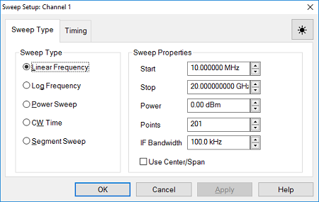
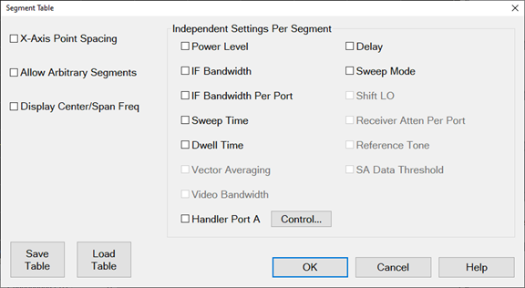
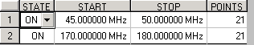
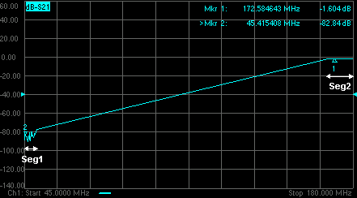
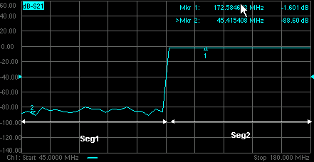

# Sweep Settings

* * *

A sweep is a series of consecutive data point measurements taken over a
specified sequence of stimulus values. You can make the following sweep
settings:

  * [Number of Points](DPoints.md) (Separate topic)

  * [Sweep Type](Sweep.md#SelectingSweepType)

  *     * [Linear / Log](Sweep.md#lin_freq)

    * [Power Sweep](Sweep.md#power)

    * [CW Time](Sweep.md#cw_time)

    * [Segment Sweep](Sweep.md#segment)

    * [Phase](Sweep.md#Phase)

  * [Frequency Range](frequency_range.md): Start/Stop (Separate topic)

  * [Power Sweep](sweep.md#power)

  * Segment Sweep

  *     * [How to make segment sweep settings](sweep.md#SegmentSweepSettings)

    * [Segment Table dialog](sweep.md#SegmentTableDialog)

  * [X-Axis Point Spacing - Segment Sweep ONLY](sweep.md#X-AxisPoint)

  * [Arbitrary Segment Sweep](sweep.md#Arbitrary)

  * [Sweep Time](Sweep.md#SettingSweepSpeed)

  * [Sweep Setup](Sweep.md#SweepSetup)

  *     * [Fast Sweep](Sweep.md#Fast)

    * [Auto vs Stepped](Sweep.md#Stepped)

    * [Dwell and Delay](Sweep.md#Dwell)

    * [Standard vs Point Sweep](Sweep.md#pointSweep)

See [Triggering](Trigger.md) and [other 'Setup Measurements'
topics](Select_a_Measurement_State.htm)

#### How to set Sweep Type  
  
---  
Using Hardkey/SoftTab/Softkey |  Using a mouse  
  
  1. Press Sweep > Main > Sweep Type.

|

  1. Right click on the [stimulus range](Customize_Your_Analyzer_Screen.md#labels) area under grid box.
  2. Click Sweep Setup....
  3. Select Sweep Type tab and select type.
  4. Click Apply to implement the setting changes.

  
  
Sweep Type dialog box help |    
---|---  
 Note: Sweep Settings are not applied until
either OK or Apply is pressed. Channel The active channel when Sweep Type was
selected. Sweep settings will be applied to this channel.

### Sweep Type

Linear Frequency Sets a linear frequency sweep that is displayed on a standard
grid with ten equal horizontal divisions.

  * Start Sets the beginning value of the frequency sweep.
  * Stop Sets the end value of the frequency sweep.
  * Points Sets the number of data points that the analyzer measures during a sweep (Default is 201). [Learn more](DPoints.md#PointsDiag).
  * Power \- Sets the power level or the source. [Learn more](Power_Level.md).
  * IF Bandwidth \- Sets the IF (Receiver) bandwidth. [Learn more](../S2_Opt/Trce_Noise.md#IFDiag).
  * Use Center/Span\- Changes from Start/Stop to Center/Span setup.

Log Frequency The source is stepped in logarithmic increments and the data is
displayed on a logarithmic x-axis. This is usually slower than a continuous
sweep with the same number of points.

  * Start Sets the beginning value of the frequency sweep.
  * Stop Sets the end value of the frequency sweep.
  * Points Sets the number of data points that the analyzer measures during a sweep (Default is 201). [Learn more](DPoints.md#PointsDiag).
  * Power \- Sets the power level or the source. [Learn more](Power_Level.md).
  * IF Bandwidth \- Sets the IF (Receiver) bandwidth. [Learn more](../S2_Opt/Trce_Noise.md#IFDiag).

Power Sweep Activates a power sweep at a single frequency that you specify.
[Learn about power sweep](Sweep.md#power)

  * Start Power Sets the beginning value of the power sweep.
  * Stop Power Sets the end value of the power sweep.
  * CW Freq Sets the single frequency where the analyzer remains during the measurement sweep.
  * Points Sets the number of data points that the analyzer measures during a sweep (Default is 201). [Learn more](DPoints.md#PointsDiag).
  * IF Bandwidth \- Sets the IF (Receiver) bandwidth. [Learn more](../S2_Opt/Trce_Noise.md#IFDiag).

CW Time Sets the analyzer to a single frequency, and the data is displayed
versus time. [Learn more.](Sweep.md#sweepTimeDiag)

  * CW Freq  Sets the frequency where the analyzer remains during the measurement.
  * Power \- Sets the power level or the source. [Learn more](Power_Level.md).
  * Sweep Time Sets the duration of the measurement, which is displayed on the X-axis.
  * Points Sets the number of data points that the analyzer measures during a sweep (Default is 201). [Learn more](DPoints.md#PointsDiag).
  * IF Bandwidth Sets the IF (Receiver) bandwidth. [Learn more](../S2_Opt/Trce_Noise.md#IFDiag).

Segment Sweep Sets the analyzer to sweep through user-defined sweep segments.
[Learn how to make these settings](Sweep.md#segment). Phase Sweep Sweeps the
phase of one or more sources relative to another source. Choose values between
-360° and +360°. [Learn more](Phase_Control.md).

  * Start Phase Sets the beginning value of the phase sweep.
  * Stop Phase Sets the end value of the phase sweep.
  * CW Freq Sets the single frequency where the analyzer remains during the sweep.

OK Applies setting changes and closes the dialog box. Apply Applies setting
changes and leaves the dialog box open to make more setting changes. Cancel
Closes the dialog. Setting changes that have been made since the last Apply
button click are NOT applied.  
Help \- Display the Sweep Type dialog box help.  
  
Power Sweep

A power sweep either increases or decreases source power in discrete steps.
Power sweep is used to characterize power-sensitive circuits, with
measurements such as gain compression.

In the Sweep Type dialog, specify Start power, Stop power, and CW Frequency.
Power can be swept over any attainable range within the [analyzer ALC
range.](Power_Level.htm#Power_Range)

Note: If the VNA has source attenuators, and the attenuation must be changed
in order to achieve the requested start and stop power, click Stimulus, then
Power then [Power and Attenuators](Power_Level.md#Advanced).

The VNA does NOT allow power to sweep over a range that requires attenuator
switching. However, two power sweeps can be performed in different channels.
The attenuators will not be allowed to switch continuously, but triggering can
be performed using single or group triggering. [Learn
more.](Power_Level.htm#Power_Coupling)

The remaining power settings apply in power sweep mode:

  * Test Port Power setting is not available.

  * Port Power can be coupled or uncoupled.

  * Attenuator Control is always Manual.

  * Power Slope (dB/GHz) is ignored (output frequency is CW).

  * Press Sweep > Main > Number of Points to change the step size of the power sweep.

Notes:

  * Using a [preference setting](../System/Preferences.md), you can specify whether to maintain source power at either the start power or stop power level at the end of a power sweep.

  * Power Sweep is optimized for speed. For highest measurement accuracy during a power sweep, it may be necessary to increase the [Dwell Time](Sweep.md#Dwell) to allow the source more time to settle.

  * You may be able to perform a 60 dB power sweep with Receiver Leveling. [Learn how](../Tutorials/Wide_Power_Sweep_with_Receiver_Leveling.md).

Segment Sweep

Segment Sweep activates a sweep which consists of frequency sub-sweeps, called
segments. For each segment you can define independent power levels, IF
bandwidth, and sweep time.

Once a measurement calibration is performed on the entire sweep or across all
segments, you can make calibrated measurements for one or more segments.

In segment sweep type, the analyzer does the following:

  * Sorts all the defined segments in order of increasing frequency

  * Measures each point

  * Displays a single trace that is a composite of all data taken

Restrictions for segment sweep:

  * The frequency range of a segment is not allowed to overlap the frequency range of any other segment.

Note: Segment sweeps can be overlapped for converter measurement types.

  * The number of segments is limited only by the combined number of data points per channel (1 to 100,003 points) for all segments in a sweep.

  * The combined number of data points for all segments in a sweep cannot exceed the [max number of data points per trace](DPoints.md#PointsDiag).

  * All segments are FORCED to have power levels within the same attenuator range to avoid premature wear of the mechanical step attenuator. See [ Power Level ](Power_Level.md).

#### How to make segment sweep settings  
  
---  
Using Hardkey/SoftTab/Softkey |  Using a mouse  
  
  1. Press Sweep > Segment Table > Segment Table...

|

  1. Right click on the X-axis label or stimulus display area under grid line.
  2. Click Sweep Setup... then select Segment Sweep under sweep type.
  3. Click Segment Table....

  
  
Segment Table dialog box help  
---  
 Segment Table Softkeys Add Segment
\- adds a sweep segment at last segment. Insert Segment \- adds a sweep
segment before the selected segment. You can also click the "down" arrow on
your keyboard to quickly add many segments. Delete Segment \- removes the
selected segment. Delete All Segments \- removes all segments. Note: At least
ONE segment must be ON or [Sweep Type](sweep.md#SweepTypeDiag) is
automatically set to Linear. Segment Table dialog box X-Axis Point Spacing \-
Check to scale the X-axis to include only the segments. [Learn
more](sweep.htm#X-AxisPoint). Allow Arbitrary Segments \- Check to allow
arbitrary frequencies (overlapped or reverse sweep). [Learn
more](sweep.htm#Arbitrary). Display Center/Span Freq \- Check to display the
center/span frequency. Independent Setting Per Segment Power Level - Sets the
[Power level](power_level.md) for the segment. Also, the test port power can
UNCOUPLE. See [Power Coupling](power_level.md#powerDiag). IF Bandwidth \-
Sets the [IF Bandwidth](../s2_opt/trce_noise.md#IFDiag) for the segment. IF
Bandwidth Per Port \- Sets the different bandwidth with different port for the
segment. Sweep Time - Sets the [Sweep time](sweep.md#sweepTimeDiag) for the
segment. Dwell Time \- Specifies the time the source stays at each measurement
point before the analyzer takes the data. Vector Averaging \- Enables SA
vector average for the segment. Video Bandwidth \- Enables SA video bandwidth
for the segment. Delay\- Sets the time to wait just before acquisition begins
for each segment. Sweep Mode \- Sets the sweep mode to auto or stepped. Shift
LO\- Sets the state of Shift LO. Receiver Atten Per Port \- Enables receiver
attenuation per port for the segment. Reference Tone \- Enables SA multitone
reference for the segment. SA Data Threshold \- Enables SA data threshold for
the segment. Save Table \- Saves the setting changes in segment table. Load
Table \- Apply the setting changes in segment table. To Modify an Existing
Segment To make the following menu settings available, the segment table must
be displayed first. (Press Sweep > Segment Table). State \- Click the box on
the segment to be modified. Then, use the up/down arrow to turn the segment ON
or OFF. Start \- Sets start frequency for the segment. Click the box and type
a value and the first letter of a suffix (KHz, Mhz, GHz). Or double-click the
box to select a value. Stop \- Sets stop frequency for the segment. Click the
box and type a value and the first letter of a suffix (KHz, Mhz, GHz). Or
double-click the box to select a value. Note: The segment table truncates the
frequency resolution. To verify the frequency resolution that you input,
create a marker at the start or stop frequency settings. Points \- Sets number
of data points for this segment. Insert a value or double-click the box to
select a value. To set Power Level, IF Bandwidth/IF Bandwidth Per Port, Sweep
Time, Delay, Receiver Attenuator Per Port, Sweep Mode and Shift LO
independently for each segment:

  1. Press Sweep > Main > Sweep Type > Segment Sweep.
  2. Click on Segment Table > Segment Table....
  3. Check the box corresponding to the segment setting to set then click OK.
  4. Click in the box at the bottom of the display and use the up/down arrows to enter a value or double-click the box and select a value with the numeric keypad.

Note: If the following are NOT set, the entire sweep uses the channel IFBW,
Power, and Time settings.  
  
### X-Axis Point Spacing - Segment Sweep ONLY

This feature affects how a segment trace is drawn on the screen.

#### How to select X-Axis Point Spacing  
  
---  
Using Hardkey/SoftTab/Softkey |  Using a mouse  
  
  1. Press Sweep > Segment Table. > Segment Table....
  2. Check X-Axis Point Spacing.

|

  1. Right click on the X-axis label or stimulus display area under grid line.
  2. Click Sweep Setup... then select Segment Sweep under sweep type.
  3. Click Segment Table....
  4. Check X-Axis Point Spacing.

  
  
  
  * Without X-axis point spacing, a multi-segment sweep trace can sometimes result in squeezing many measurement points into a narrow portion of the x-axis.

  * With X-axis point spacing, the x-axis position of each point is chosen so that all measurement points are evenly spaced along the x-axis.

For example, given the following two segments:

Without X-Axis Point Spacing

With X-Axis Point Spacing

### Arbitrary Segment Sweep

This feature allows arbitrary frequencies to be entered into the segment sweep
table. With this capability, segments can have:

  * overlapping frequencies.

  * the stop frequency less than the start frequency (reverse sweep).

However, there are several limitation:

  * Sweep mode: Stepped only.

  * Sweep time: When reverse sweep is performed, the sweep time and the wait time before the measurement point becomes longer.

#### How to enable Arbitrary Segment Sweep  
  
---  
Using Hardkey/SoftTab/Softkey |  Using a mouse  
  
  1. Press Sweep > Segment Table. > Segment Table....
  2. Check Allow Arbitrary Segments.

|

  1. Right click on the X-axis label or stimulus display area under grid line.
  2. Click Sweep Setup... then select Segment Sweep under sweep type.
  3. Click Segment Table....
  4. Check Allow Arbitrary Segments.

  
  
  
Notes:

  1.      * Unusual results may occur when using arbitrary sweep segments with markers, display settings, limit lines, formatting, and some calibration features.

     * When Allow Arbitrary Segments is checked, a dialog is displayed indicating that X-axis point spacing is recommended.

     * When the segment table has both forward and reverse frequency sweep, the correction interpolation may not work properly. Use the same segment table setting for both correction and measurement. (Make a measurement at the condition where "Cor" is displayed.)

     * When the measurement data size of segment table exceeds its limitation, an error occurs. In this case, reduce the measurement data size (i.e., NOP, number of channels).

Sweep Time

The analyzer automatically maintains the fastest sweep time possible with the
selected measurement settings. However, you can increase the sweep time to
perform a slower sweep.

#### How to set Sweep Time  
  
---  
Using Hardkey/SoftTab/Softkey |  Using a mouse  
  
  1. Press Sweep > Sweep Timing > Sweep Time.
  2. Input the desired sweep time.

|

  1. Right click on the X-axis label or stimulus range area under grid line.
  2. Click on Sweep Setup....
  3. Select Timing tab.
  4. Deselect the Auto Sweep Time box.
  5. Input the desired sweep time.

  
  
Time dialog box help |    
---|---  
Sweep Time Specifies the time the analyzer takes to acquire RF data for a
sweep. The maximum sweep time of the analyzer is 86400 seconds or 1 day.
[Learn about other settings that affect sweep speed.](../S2_Opt/Fast_Swp.md)
Note: When a channel has an Aux In or SMU trace, the measurement time for DC
voltage/current will be added.  Note: If sweep time accuracy is critical, use
ONLY the up and down arrows next to the Sweep Time entry box in the Sweep
Setup dialog to select a value that has been calculated by the analyzer. Do
NOT type a sweep time value as it will probably be rounded up to the closest
calculated value. This rounded value will not be updated in the dialog box.

  * The actual sweep time includes this acquisition time plus some "overhead" time.
  * The analyzer automatically maintains the fastest sweep time possible with the selected measurement settings. However, you can increase the sweep time using this setting.
  * Enter 0 seconds to return the analyzer to the fastest possible sweep time.
  * The Sweep Time setting is applied to the active channel.
  * The sweep time is per sweep. A full 2-port cal requires two sweeps, both using the specified sweep time. [Learn more.](../S2_Opt/Fast_Swp.md#cal)
  * A Sweep Indicator  appears on the data trace when the Sweep Time is 0.3 seconds or greater, or if trigger is set to [Point](Trigger.md#state_point). The indicator is located on the last data point that was measured by the receiver. If the indicator is stopped (point sweep mode) the source has already stepped to the next data point.

  
  
Sweep Setup

#### How to make Sweep Setup settings  
  
---  
Using Hardkey/SoftTab/Softkey |  Using a mouse  
  
  1. Press Sweep > Sweep Timing.

|

  1. Right click on the X-axis label or stimulus range area under grid line.
  2. Click on Sweep Setup....
  3. Select Timing tab.

  
  
Sweep Setup dialog box help |    
---|---  
  
### Time

Sweep Time \- same as [Sweep Time Softtab Help](sweep.md#sweepTimeDiag).
Dwell Time - Specifies the time the source stays at each measurement point
before the analyzer takes the data. Only applies to stepped sweep. The maximum
dwell time is 20 seconds. See also [Electrically Long
Devices](../s2_opt/long_devices.htm). Sweep Delay \- Specifies the time to
wait just before acquisition begins for each sweep. This delay is in addition
to Dwell Time (per point) and [External Trigger
delay](external_triggering.htm#ExternalDiag) if enabled. Fast Sweep NOT
available on [N5264B](../Support/Configurations.md#N5264) and
[N523xB](../Support/Configurations.md#N523x) models. When checked, in Analog
Sweep mode the analyzer source settling times are shortened in both frequency
and power-control (ALC) circuits. In Stepped Sweep mode, the settling time at
ALL data points are shortened. This nearly doubles the sweep speed at preset
conditions, but at the expense of frequency accuracy and a few dB of amplitude
variation. For ratioed measurements, such as S-Parameters, these errors
substantially ratio out.

  * By default, Fast Sweep is always OFF to provide maximum accuracy and stability.
  * Fast Sweep is NOT allowed with [Power Limit](../System/Power_Limit_and_Power_Offset.md) enabled.
  * Note: Performance specifications do NOT apply in Fast Sweep.

### Sweep Mode

Auto - Automatic adjusts the sweep time and dwell time. When "Auto Sweep Time"
is checked, the sweep time and dwell time will disable to edit.  Stepped When
checked (Stepped Sweep) the analyzer source is tuned, then waits the specified
Dwell time, then takes response data, then tunes the source to the next
frequency point. This is slower than Analog Sweep, but is more accurate when
testing electrically-long devices. When cleared (Analog Sweep) the analyzer
takes response data AS the source is sweeping. The sweep time is faster than
Stepped, but could cause measurement errors when testing electrically-long
devices. When the dialog check box is cleared, the analyzer could be in either
Analog or Step mode. The mode can change from sweep to sweep. There is NO way
to determine whether the analyzer is in Analog or Stepped Sweep. If you want
to be sure what the current sweep mode is, then switch it to Stepped. Stepped
sweep is automatically selected for a number of reasons. Here are some of the
reasons:

  * [IF Bandwidth](../S2_Opt/Trce_Noise.md#Variable_IF_Bandwidth) is at, or below, 1 kHz.
  * [Source Power Correction](../S3_Cals/PwrCalibration.md) is ON unless doing CW measurement.
  * When more than one source is turned ON ([multisource VNA models](../Support/Configurations.md)).
  * When step mode is a faster way to take the data.
  * For all [FOM](../FreqOffset/Frequency_Offset_Mode.md) and [FCA](../FreqOffset/FCA_Use.md) measurements.
  * For all [ADC measurements.](ADC_Measurements.md)
  * For all [MMwave measurements](../IFAccess/External_Test_Head_Configuration.md).

### Sweep Sequence

Standard Sweep When checked, the analyzer sweeps all data points for each
source port in turn. For a 2-port analyzer, this means that all data points
are swept in the forward direction, then all data points are swept in the
reverse direction. Even when NO reverse parameters are displayed (S22 or S12),
reverse measurements are necessary when a full 2-port calibration is
correcting the channel. This is the default behavior. Point Sweep Available
ONLY on standard S-parameter channels. When checked, the analyzer measures all
parameters at each frequency point before stepping to the next frequency. The
display trace is updated as each data point is measured.

  * Point sweep usually results in slower sweeps and is useful only in rare circumstances.
  * Point sweep is the same as stepped sweep mode on the 8510 and 8530. 
  * [PMAR](../System/Configure_a_Power_Meter_As_Receiver.md) is not compatible with Point Sweep mode.

  
  
* * *

