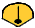
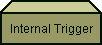
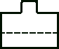
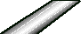
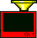
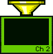
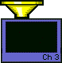

Speedometer  
 |   |  Trigger Source  
Internal  
Manual   
---|---|---  
|   |  Trigger Scope  
Global  
Channel  
  
 |   |    
Continuous  
Groups 5 4 3 2 1  
Single  
Hold  
Point |  Continuous  
Groups 5 4 3 2 1  
Single  
Hold  
Point |  Continuous  
Groups 5 4 3 2 1  
Single  
Hold  
Point  
---|---|---  
  
[About the trigger model](javascript:TextPopup\(this\))

This SIMPLIFIED model can help you learn about the flexible triggering
behavior of the analyzer. The triggering of channels is represented by
dropping balls.

Although the triggering behavior it is NOT an exact model of the PNA, the
following differences are subtle.

  * The timing of setting responses differs from the analyzer. For example, switching to Manual mode occurs immediately in the analyzer. The model waits until the current sweep is complete.

  * The model does not include External triggering.

  * Speedometer - controls the speed of the animation:

Read [Text description](Trigger.md#TriggerDiag) of triggering behaviors.

This model does not include [Sweep trigger mode](Trigger.md#TriggerMode).

