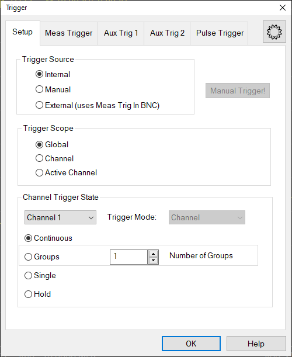

# Trigger

* * *

A trigger is a signal that causes the analyzer to make a measurement sweep.
The analyzer offers great flexibility in configuring the trigger function.

View the interactive [Trigger Model](TrigModel.md) animation to see how
triggering works.

  * [How to Set Trigger](Trigger.md#How to)

  * [Source](Trigger.md#Source)

  * [Scope](Trigger.md#scope)

  * [Channel Settings](Trigger.md#channel_state)

  * [Restart](Trigger.md#effects_on_restart)

  * [External](External_Triggering.md) [and Auxiliary](External_Triggering.md) [Triggering](External_Triggering.md) (separate topic)

[See other 'Setup Measurements' topics](Select_a_Measurement_State.md)

####  How to set Triggering  
  
---  
Using Hardkey/SoftTab/Softkey |  Using a mouse  
  
  1. Press Trigger > Main > Trigger....

|

  1. Right click on the Trig or Meas icons on the status bar.
  2. Select Trigger....

  
  
  
Note: The Continuous, Single, and Hold settings apply ONLY to the active
channel. These settings are available from the Trigger menu, Active Entry
keys, and softkeys

Trigger Setup dialog box help  
---  
 |  |   
---|---  
|  
  
View the interactive [Trigger Model](TrigModel.md) animation to see how
triggering works.

### Trigger Source

These settings determine where the trigger signals originate for all existing
channels. A valid trigger signal can be generated only when the analyzer is
not sweeping.

Internal Continuous trigger signals are sent by the analyzer as soon as the
previous measurement is complete.

Manual One trigger signal is sent when invoked by the Trigger button, the
active tool bar, or a programming command.

External Trigger signals received from the trigger source. The trigger source
can be defined in [External and AUX Triggering.](External_Triggering.md)

Pulse3 Trigger signal using internal Pulse3 to Meas Trig In bypass. Pulse3 can
be defined in the Pulse Generators Setup dialog.

Manual Trigger! - Manually sends one trigger signal to the analyzer. Available
ONLY when Manual trigger is selected.

### Trigger Scope

These settings determine what is triggered.

Global All channels not in Hold receive the trigger signal [Default setting]

Channel Only the next channel that is not in Hold receives the trigger signal.
This is not obvious or useful unless Trigger Source is set to Manual. This
setting enables [Point Sweep](Trigger.md#state_point) mode.

Active Channel \- Trigger are sent only to the active channel. The active
channel does not change.

### Channel Trigger State

These settings determine how many trigger signals the channel will accept.

Continuous The channel accepts an infinite number of trigger signals.

Groups The channel accepts only the number of trigger signals that is
specified in the Number of Groups text box, then goes into Hold. Before
selecting groups you must first increment the Number of Groups text box to
greater than one.

Number of Groups Specify the number of triggers the channel accepts before
going into Hold. If in Point Sweep, an entire sweep is considered one group.

First increment to desired number, then select 'Groups'.

Single The channel accepts ONE trigger signal, then goes into Hold.

Another way to trigger a single measurement is to set [Trigger
Source](Trigger.htm#source_manual) to Manual, then send a Manual trigger.
However, ALL channels are single triggered.

Hold The channel accepts NO trigger signals.

See also this Keysight support article: [HOW TO ACQUIRE DATA USING AVERAGES ON
A VNA WITH SCPI EXAMPLE IN
PYTHON](https://support.keysight.com/KeysightdCX/s/knowledge-article-
detail?language=en_US&keyid=How-to-acquire-data-using-averages-on-a-VNA-with-
SCPI-example-in-Python)

### Trigger Mode

These settings determine what EACH signal will trigger.

Sweep and Point modes are available ONLY when both [Trigger
Source](Trigger.htm#source) = MANUAL or EXTERNAL AND [Trigger
Scope](Trigger.htm#scope) = CHANNEL.

  * Channel Each trigger signal causes ALL traces in that channel to be swept in the order specified below.

  * Point Each Manual or External trigger signal causes one data point to be measured. Subsequent triggers go to the same trace until it is complete, then other traces in the same channel are swept in the order specified below. When in Groups or Single trigger, the count is decremented by one after ALL data points on ALL traces in the channel are measured. See Also, the (point) [Sweep Indicator](Sweep.md#sweepTimeDiag) and [SCPI Triggering example](../Programming/GPIB_Example_Programs/Triggering_the_PNA_using_SCPI.md) for use with External.

For gated SA measurements, Point does not refer to a data point. Instead, it
refers to the next LO acquisition. For SA, each time the LO is shifted an
acquisition is captured. The time for each LO acquisition is based on the [ADC
Record Size](../Applications/Spectrum_Analyzer.htm#Force_ADC_Record_Size) and
time per ADC sample (10 nsec).

  * Trace Available ONLY when [Point Sweep](Sweep.md#SweepSetupDiag) is selected. Each trigger signal causes two identical measurements to be triggered separately - one trigger signal is required for each measurement. Other trigger mode settings cause two identical parameters to be measured simultaneously. Trace triggering is NOT permitted when a channel is using a 2 port (or more) S-Parameter calibration.

  * Sweep Each Manual or External trigger signal causes ALL traces that share a source port to be swept in the order specified below. When in Groups or Single trigger, the count is decremented by one after ALL traces in ALL directions are swept.

When multiport correction is ON, which requires sweeps in more than one
direction, traces on the screen will not update until all of the relevant
directions have been swept. For example, with all four 2-port S-Parameters
displayed:

  *     * When Full 2-port correction is ON, trigger 1 causes NO traces to update; trigger 2 causes ALL S-Parameters to update. [Learn more about sweeps with correction ON.](../S2_Opt/Fast_Swp.md#cal)

    * When correction is OFF, trigger 1 causes S11 and S21 to update; trigger 2 causes S22 and S12 to update.

  * Segment Each trigger signal causes one Segment of a Segment Sweep to be measured. [Learn more](Sweep.md#segment).

Trace Sweep Order For ALL Trigger Modes, trigger signals continue in the same
channel until all traces in that channel are complete. Triggering then
continues to the next channel that is not in HOLD. Traces within each channel
are always swept in the following order:

  * Traces are swept sequentially in source-port order. For example, in a channel with all four 2-port S-parameters, first the source port 1 traces (S11 and S21) are swept simultaneously. Then the source port 2 traces (S22 and S12) are swept simultaneously.
  * In addition, when [Alternate sweep](Sweep.md#Alternate) is selected, traces are swept sequentially in source-port / receiver-port order. In the above example, first the S11 trace is swept, then S21, then S12, then S22.

  
---  
  
Restart (Available only from the Trigger menu) Restart stops the currently
sweeping Channel, and continues on to the next Channel that can sweep.

Examples:

  1.      1. Single channel in Continuous Trigger mode: The current sweep on the channel is stopped, and the channel starts sweeping the first sweep of the Channel.

     2. Single channel in Hold mode: The Restart softkey does not do anything.

     3. Multiple Channels in Continuous mode: The current sweep on the current channel is stopped, and the next channel that can sweep is started.

### See Also

  * [External](External_Triggering.md) [and AUX](External_Triggering.md) [Triggering](External_Triggering.md)

  * Interactive [Trigger Model](TrigModel.md) animation

  
  
* * *

