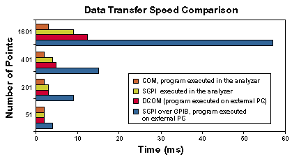

# Data Transfer Speed

* * *

When testing devices remotely using COM or SCPI, the following techniques can
be used to transfer data quickly between the analyzer and remote computer,
helping you achieve the best measurement throughput.

  * Use [single sweep](../S1_Settings/Trigger.md#state_single) (trigger) mode to ensure that a measurement is complete before starting a data transfer.

  * Transfer the minimum amount of data needed. For example, a trace with a few points, using segment sweep rather than a full trace with many linearly spaced points. Also, use markers instead of trace transfers.

  * Choose the REAL data format to provide the fastest transfer speed when using SCPI programs for automated applications.

  * Use SCPI over LAN for applications that are automated with SCPI programs.

  * Use COM programs to provide the fastest transfer speed when using an automated application. See [Data Transfer Time](../Specs/ManualChoice.md#Time_datatrans) specifications.

Note: The following data is obsolete, but still serves to illustrate the
relative speed between COM and SCPI.

[Other topics about Optimizing Measurements](Optimize.md)

