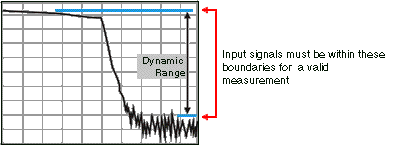
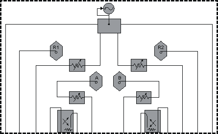
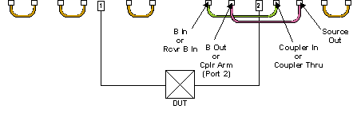

# Dynamic Range

* * *

Dynamic range is the difference between the analyzer receiver's maximum input
power and the minimum measurable power (noise floor). For a measurement to be
valid, input signals must be within these boundaries.

Increasing dynamic range is important if you need to measure very large
variations in signal amplitude, such as filter bandpass and rejection. The
dynamic range is shown below for an example measurement.

To help reduce measurement uncertainty, the analyzer dynamic range should be
greater than the response that the DUT exhibits. For example, measurement
accuracy is increased when the DUT response is at least 10 dB above the noise
floor. The following methods can help you increase the dynamic range.

  * [Increase the Device Input Power](Dyn_Rge.md#inc)

  * [Reduce the Receiver Noise Floor](Dyn_Rge.md#red)

  * [Improving Dynamic Range using the Front-Panel Jumpers](Dyn_Rge.md#FrontPanelJumpers)

[Other topics about Optimizing Measurements](Optimize.md)

Increase Device Input Power

Increase the DUT input power so that the analyzer can more accurately detect
and measure the DUT output power. However, use caution - too much power can
damage the analyzer receiver or cause compression distortion.

Caution! Receiver input damage level: +15 dBm.

[See how to increase input power to the
device](../S1_Settings/Power_Level.htm)

Tip: You can further increase dynamic range by using an external booster
amplifier to increase the input power to the DUT. See [High Power Amplifier
Measurements.](../Tutorials/High_Power_PNA-X.htm)

Reduce the Receiver Noise Floor

You can use the following techniques to lower the noise floor and increase the
analyzer's dynamic range.

  * Reduce crosstalk between the VNA receivers when measuring signals close to the noise floor. See [Receiver Crosstalk](Crosstalk.md).)

  * Use Sweep Averaging \- learn more about [Sweep Average](Trce_Noise.md#averaging)

  * Reduce the IF Bandwidth \- learn more about [IF Bandwidth](Trce_Noise.md#Variable_IF_Bandwidth).

  * In [Segment sweep](../S1_Settings/Sweep.md#segment) mode each segment can have its own IF bandwidth. For example, when measuring a filter:

  *     * In the passband, the IF bandwidth can be set wider for a fast sweep rate, as long as high-level trace noise is kept sufficiently small.

    * In the reject band, where noise floor contributes significantly to measurement error, the IF bandwidth can be set low enough to achieve the desired reduction in average noise level.

## Improving Dynamic Range using the Front-Panel Jumpers

### Direct Access

The simplest method to improve dynamic range is to remove a RCVR 'n' IN
[front-panel jumper](../Front_Panel/XTour.md#Jumpers) and route the DUT
output directly into that VNA receiver. This bypasses the directional coupler
and limits the ability to provide Full Error Correction because the signal can
not be applied in the reverse direction.

Refer to the [VNA specifications](../Specs/ManualChoice.md) to learn the
dynamic range that is available with direct receiver access.

### Reverse the directional coupler

Another method to improve dynamic range is to reverse the signal path in the
test-port coupler and bypass the loss typically associated with the coupled
arm.

As shown in the following graphic, the signal is applied to Port 2. The signal
bypasses the coupled arm via the jumper cable connected to the Coupler Thru
(or Coupler In) and the Receiver B In (or B In) ports.

When making measurements in reverse direction, the system dynamic range is
degraded by 15 dB.

Note: Your analyzer's block diagram may contain different components than
shown below. To see the block diagram for your VNA model, see the bottom of
the [specs/data sheet.](../Specs/ManualChoice.md)

  
---  
  
  
### See Also

[Front-panel Jumpers](../Front_Panel/XTour.md#Jumpers) (image)

[Using the Front Panel Jumpers](../Front_Panel/FPJumpersChoice.md)

[Specifications](../Specs/ManualChoice.md)

* * *

