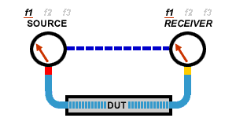
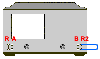

# Electrically-Long Device Measurements

* * *

A signal coming out of a device under test may not be exactly the same
frequency as the signal going in to a device at a given instant in time. This
can sometimes lead to inaccurate measurement results. You can choose between
two techniques to eliminate this situation and increase measurement accuracy.

  * [Why Device Delay May Create Inaccurate Results](Long_Devices.md#why)

  * [Solutions to Increase Measurement Accuracy](Long_Devices.md#Sol)

  *     * [Slow the Sweep Speed](Long_Devices.md#slow)

    * [Add Electrical Length to the R Channel](Long_Devices.md#Add)

[Other topics about Optimizing Measurements](Optimize.md)

Why Device Delay May Create Inaccurate Results

The following graphic shows an example of this situation:

  * In the network analyzer, the source and receiver are phase locked together and sweep simultaneously through a span of frequencies.

  * The signal flow through the Device Under Test (DUT) is shown as different colors for different frequencies.

  * You can see as a stimulus frequency travels through the [DUT](JavaScript:hhctrl.TextPopup\(DUT,'Arial,8',10,10,00000000,0xc0ffff\)), the analyzer tunes to a new frequency just before the signal arrives at the receiver. This causes inaccurate measurement results.

.

If the analyzer is measuring a long cable, the signal frequency at the end of
the cable will lag behind the network analyzer source frequency. If the
frequency shift is appreciable compared to the network analyzer's IF detection
bandwidth (typically a few kHz), then the measured result will be in error by
the rolloff of the IF filter.

Note: There is no fixed electrical length of a device where this becomes an
issue. This is because there are many variables that lead to measurement
speed. When high measurement accuracy is critical, lower the sweep speed until
measurement results no longer change.

Solutions to Increase Measurement Accuracy

Choose from the following methods to compensate for the time delay of an
electrically long device.

### Slow the Sweep Speed

The following methods will slow the sweep speed.

  * [Increase the Sweep Time](../S1_Settings/Sweep.md#sweepTimeDiag)

  * [Increase the Number of Points](../S1_Settings/DPoints.md)

  * [Use Stepped Sweep](../S1_Settings/Sweep.md#Stepped)

  * [Set Dwell Time](../S1_Settings/Sweep.md#Dwell)

### Add Electrical Length to the R Channel

Note: This method applies to VNA models with front panel loops.

Instead of slowing the sweep, you can compensate for the electrical length of
a cable or fixture.

  1. Remove the R-channel jumper on the front panel of the analyzer.

  2. Replace the jumper with a cable of about the same length as the device under test.

     1. Add the cable on the R1 channel for S11 and S21 measurements.
     2. Add the cable on the R2 channels for S22 and S12 measurements.
  3. Set the analyzer for a fast sweep.

### Configuration for S22 and S12 Measurements

This method balances the delays in the reference and test paths, so that the
network analyzer's ratioed transmission measurement does not have a frequency-
shift error.

Note: This method works well if the delay is in a cable or fixture. For
devices with long delays, this method is only suitable for uncalibrated
measurements.

* * *

