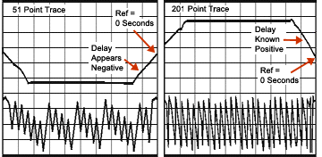

# Phase Measurement Accuracy

* * *

You can increase the accuracy of phase measurements by using the following
features.

  * [Electrical Delay](Phase_Accy.md#ed)

  * [Phase Offset](Phase_Accy.md#po)

  * [Spacing Between Frequency Points (Aliasing)](Phase_Accy.md#space)

### See Also

[Port Extensions](../S3_Cals/Port_Extensions.md)

[Comparing the Delay
Functions](../Tutorials/Comparing_the_PNA_Delay_Functions.htm)

[Phase Control](../S1_Settings/Phase_Control.md)

[Phase Coherent Measurements](../S1_Settings/Phase_Coherent_Measurements.md)

[Learn more about Phase measurements](../Tutorials/Phase_Meas.md)

Electrical Delay

Electrical delay is a mathematical function that simulates a variable length
of lossless transmission line.

Use the electrical delay feature to compensate for the linear phase shift
through a device. This feature allows you to look at only the [deviation from
linear phase](../Tutorials/Phase_Devi.htm) of the device.

You can set the electrical delay independently for each measurement trace.

### How to set Electrical Delay  
  
---  
Using Hardkey/SoftTab/Softkey  
  
  1. Press Scale > Electrical Delay.

  
  
  
Electrical Delay dialog box help  
---  
Electrical Delay Specifies the value of delay added or removed, in Time or
Distance. This compensates for the linear phase shift through a device. You
can set the electrical delay independently for each measurement trace.
Velocity Factor Specifies the velocity factor that applies to the medium of
the device that was inserted after the measurement calibration. The value for
a polyethylene dielectric cable is 0.66 and 0.7 for PTFE dielectric. 1.0
corresponds to the speed of light in a vacuum. Velocity factor can also be set
from the [Port Extensions](../S3_Cals/Port_Extensions.md#More) dialog and
[Time Domain Distance Marker Settings.](../Time/TimeDomain.md#Distance)
Softkey Display Allows you to enter delay in either Time or Distance using the
softkeys and [Active Entry
toolbar](../S1_Settings/Customize_Your_Analyzer_Screen.htm#act_ent_tb). Delay
Distance Changes the value when the Delay Time or Delay Distance values are
changed. Distance Units Select from Meters, Inches, or Feet. The step size
will not change automatically when this value is changed.

### Media

Coax Select if the added length is coax. Also specify the velocity factor of
the coax. Waveguide Select if the added length is waveguide. Also specify the
low frequency cutoff of the waveguide. Cutoff Freq Low frequency cutoff of the
waveguide. Learn about [Electrical Delay](Phase_Accy.md#ed) (scroll up)  
  
Phase Offset

Phase offset mathematically adjusts the phase measurement by a specified
amount, up to 360°. Use this feature in the following ways:

  * Improve the display of a phase measurement. This is similar to the way you would change the reference level in an amplitude measurement. Change the phase response to center or align the response on the screen.

  * Emulate a projected phase shift in your measurement. For example, if you know that you need to add a cable and that the length of that cable will add a certain phase shift to your measurement, you can use phase offset to add that amount and simulate the complete device measurement.

### How to set Phase Offset  
  
---  
Using Hardkey/SoftTab/Softkey  
  
  1. Press Scale > Constants > Phase Offset.

  
  
  
Phase Offset dialog box help  
---  
Phase Offset Type a value or use the up and down arrows to select any value up
to 360 degrees. Learn about [Phase Offset](Phase_Accy.md#po) (scroll up)  
  
Spacing Between Frequency Points (Aliasing)

The analyzer samples data at discrete frequency points, then connects the
points, creating a trace on the screen.

If the phase shift through a device is >180° between adjacent frequency
points, the display can look like the phase slope is reversed. This is because
the data is undersampled and aliasing is occurring.

If you are measuring group delay and the slope of the phase is reversed, then
the group delay will change sign. For example, the following graphic shows a
measurement of a SAW bandpass filter.

  * The left measurement has 51 points and indicates the group delay is negative, which is a physical impossibility. That is, the response is below 0 seconds reference line.

  * The right measurement shows an increase to 201 points which indicates the group delay is positive. That is, the response is above the 0 seconds reference line.

Tip: To check if aliasing might be occurring in a measurement, either
[increase the number of points](../S1_Settings/DPoints.md) or [reduce the
frequency span.](../S1_Settings/Frequency_Range.htm#How to)

* * *

